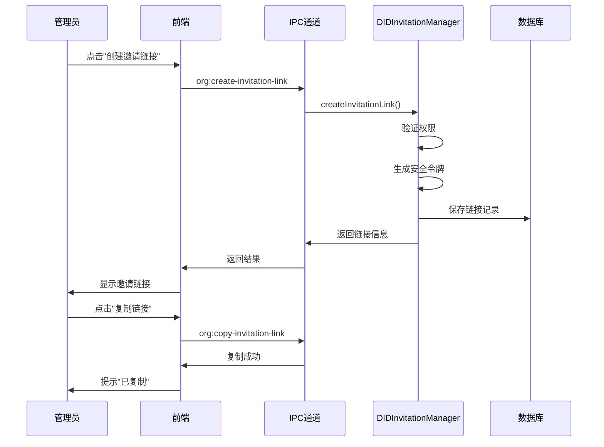
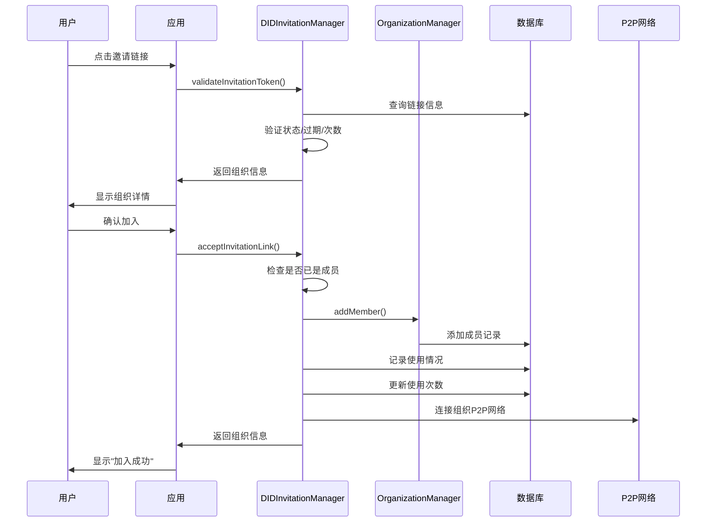

# 企业版DID邀请链接功能文档

## 概述

邀请链接功能是ChainlessChain企业版DID邀请机制的重要组成部分，允许组织管理员创建可分享的邀请链接，用户通过点击链接即可快速加入组织。

## 功能特性

### ✅ 已实现功能

1. **安全的令牌生成**
   - 使用32字节随机令牌（base64url编码）
   - 防止暴力破解和令牌猜测

2. **灵活的使用控制**
   - 单次使用或多次使用（可配置）
   - 无限制使用（maxUses = -1）
   - 使用次数追踪

3. **过期时间管理**
   - 默认7天过期
   - 可自定义过期时间
   - 自动过期检测

4. **权限控制**
   - 基于角色的邀请（owner/admin/member/viewer）
   - 创建者和管理员可撤销/删除链接
   - 权限验证

5. **使用记录追踪**
   - 记录每次使用的用户DID
   - 记录使用时间
   - 可选记录IP地址和User Agent

6. **统计分析**
   - 链接总数统计
   - 活跃/过期/撤销状态统计
   - 使用率计算
   - 使用详情查看

## 数据库架构

### invitation_links 表

```sql
CREATE TABLE invitation_links (
  link_id TEXT PRIMARY KEY,              -- 链接ID
  org_id TEXT NOT NULL,                  -- 组织ID
  inviter_did TEXT NOT NULL,             -- 邀请人DID
  invitation_token TEXT UNIQUE NOT NULL, -- 邀请令牌（唯一）
  role TEXT DEFAULT 'member',            -- 分配的角色
  message TEXT,                          -- 邀请消息
  max_uses INTEGER DEFAULT 1,            -- 最大使用次数
  used_count INTEGER DEFAULT 0,          -- 已使用次数
  metadata_json TEXT,                    -- 额外元数据
  status TEXT DEFAULT 'active',          -- 状态（active/expired/revoked）
  created_at INTEGER NOT NULL,           -- 创建时间
  expires_at INTEGER,                    -- 过期时间
  last_used_at INTEGER,                  -- 最后使用时间
  FOREIGN KEY (org_id) REFERENCES organization_info(org_id)
);
```

### invitation_link_usage 表

```sql
CREATE TABLE invitation_link_usage (
  id TEXT PRIMARY KEY,                   -- 使用记录ID
  link_id TEXT NOT NULL,                 -- 链接ID
  user_did TEXT NOT NULL,                -- 使用者DID
  used_at INTEGER NOT NULL,              -- 使用时间
  ip_address TEXT,                       -- IP地址（可选）
  user_agent TEXT,                       -- User Agent（可选）
  FOREIGN KEY (link_id) REFERENCES invitation_links(link_id)
);
```

## API接口

### 后端方法（DIDInvitationManager）

#### 1. 创建邀请链接

```javascript
await didInvitationManager.createInvitationLink({
  orgId: 'org_xxx',
  role: 'member',                    // 可选，默认'member'
  message: '欢迎加入我们的组织！',    // 可选
  maxUses: 10,                       // 可选，默认1，-1表示无限制
  expiresIn: 7 * 24 * 60 * 60 * 1000, // 可选，默认7天
  metadata: { source: 'email' }      // 可选
});

// 返回值
{
  linkId: 'link_xxx',
  orgId: 'org_xxx',
  inviterDID: 'did:chainlesschain:xxx',
  invitationToken: 'xxx',
  role: 'member',
  message: '欢迎加入我们的组织！',
  maxUses: 10,
  usedCount: 0,
  status: 'active',
  createdAt: 1234567890,
  expiresAt: 1234567890,
  invitationUrl: 'chainlesschain://invite/xxx',
  orgName: '组织名称',
  orgDescription: '组织描述',
  orgAvatar: 'https://...'
}
```

#### 2. 验证邀请令牌

```javascript
await didInvitationManager.validateInvitationToken(token);

// 返回值
{
  linkId: 'link_xxx',
  orgId: 'org_xxx',
  orgName: '组织名称',
  orgDescription: '组织描述',
  orgAvatar: 'https://...',
  inviterDID: 'did:chainlesschain:xxx',
  inviterName: '邀请人名称',
  role: 'member',
  message: '欢迎加入！',
  maxUses: 10,
  usedCount: 5,
  remainingUses: 5,
  expiresAt: 1234567890,
  createdAt: 1234567890,
  metadata: {}
}
```

#### 3. 通过邀请链接加入组织

```javascript
await didInvitationManager.acceptInvitationLink(token, {
  ipAddress: '192.168.1.1',  // 可选
  userAgent: 'Mozilla/5.0...' // 可选
});

// 返回值：组织信息对象
```

#### 4. 获取邀请链接列表

```javascript
didInvitationManager.getInvitationLinks(orgId, {
  status: 'active'  // 可选，过滤状态
});

// 返回值：邀请链接数组
```

#### 5. 获取邀请链接详情

```javascript
didInvitationManager.getInvitationLink(linkId);

// 返回值：包含使用记录的完整链接信息
```

#### 6. 撤销邀请链接

```javascript
await didInvitationManager.revokeInvitationLink(linkId);
```

#### 7. 删除邀请链接

```javascript
await didInvitationManager.deleteInvitationLink(linkId);
```

#### 8. 获取统计信息

```javascript
didInvitationManager.getInvitationLinkStats(orgId);

// 返回值
{
  total: 10,              // 总链接数
  active: 5,              // 活跃链接数
  expired: 3,             // 过期链接数
  revoked: 2,             // 已撤销链接数
  totalUses: 50,          // 总使用次数
  totalMaxUses: 100,      // 总最大使用次数
  utilizationRate: '50.00' // 使用率（%）
}
```

### IPC通道（前端调用）

#### 1. 创建邀请链接

```javascript
const result = await window.electron.ipcRenderer.invoke('org:create-invitation-link', {
  orgId: 'org_xxx',
  role: 'member',
  message: '欢迎加入！',
  maxUses: 10,
  expiresIn: 7 * 24 * 60 * 60 * 1000
});

if (result.success) {
  console.log('邀请链接:', result.invitationLink.invitationUrl);
}
```

#### 2. 验证邀请令牌

```javascript
const result = await window.electron.ipcRenderer.invoke('org:validate-invitation-token', token);

if (result.success) {
  console.log('链接信息:', result.linkInfo);
} else {
  console.error('验证失败:', result.error);
}
```

#### 3. 通过邀请链接加入组织

```javascript
const result = await window.electron.ipcRenderer.invoke('org:accept-invitation-link', token, {
  ipAddress: '192.168.1.1'
});

if (result.success) {
  console.log('加入成功:', result.org);
}
```

#### 4. 获取邀请链接列表

```javascript
const result = await window.electron.ipcRenderer.invoke('org:get-invitation-links', orgId, {
  status: 'active'
});

if (result.success) {
  console.log('链接列表:', result.links);
}
```

#### 5. 获取邀请链接详情

```javascript
const result = await window.electron.ipcRenderer.invoke('org:get-invitation-link', linkId);

if (result.success) {
  console.log('链接详情:', result.link);
  console.log('使用记录:', result.link.usageRecords);
}
```

#### 6. 撤销邀请链接

```javascript
const result = await window.electron.ipcRenderer.invoke('org:revoke-invitation-link', linkId);

if (result.success) {
  console.log('撤销成功');
}
```

#### 7. 删除邀请链接

```javascript
const result = await window.electron.ipcRenderer.invoke('org:delete-invitation-link', linkId);

if (result.success) {
  console.log('删除成功');
}
```

#### 8. 获取统计信息

```javascript
const result = await window.electron.ipcRenderer.invoke('org:get-invitation-link-stats', orgId);

if (result.success) {
  console.log('统计信息:', result.stats);
}
```

#### 9. 复制邀请链接到剪贴板

```javascript
const result = await window.electron.ipcRenderer.invoke('org:copy-invitation-link', invitationUrl);

if (result.success) {
  console.log('已复制到剪贴板');
}
```

## 使用流程

### 管理员创建邀请链接



### 用户通过链接加入组织



## 安全考虑

### 1. 令牌安全
- 使用32字节随机令牌（256位熵）
- Base64url编码，URL安全
- 唯一性约束，防止冲突

### 2. 权限验证
- 创建链接需要`member.invite`权限
- 撤销/删除需要创建者或管理员权限
- 加入前验证组织存在性

### 3. 防滥用机制
- 使用次数限制
- 过期时间控制
- 重复使用检测（同一用户不能多次使用同一链接）
- 状态管理（active/expired/revoked）

### 4. 审计追踪
- 完整的使用记录
- 活动日志记录
- IP地址和User Agent追踪（可选）

## 最佳实践

### 1. 创建链接时

```javascript
// ✅ 推荐：为不同场景创建不同链接
await createInvitationLink({
  orgId: 'org_xxx',
  role: 'member',
  message: '来自邮件邀请',
  maxUses: 1,  // 单次使用，更安全
  expiresIn: 24 * 60 * 60 * 1000,  // 24小时过期
  metadata: { source: 'email', campaign: 'Q1_2026' }
});

// ❌ 不推荐：创建无限制链接
await createInvitationLink({
  orgId: 'org_xxx',
  maxUses: -1,  // 无限制使用
  expiresIn: null  // 永不过期
});
```

### 2. 链接分享

```javascript
// ✅ 推荐：通过安全渠道分享
// - 加密邮件
// - 企业即时通讯工具
// - 二维码（线下场景）

// ❌ 不推荐：公开分享
// - 社交媒体
// - 公开论坛
// - 未加密的通讯渠道
```

### 3. 定期清理

```javascript
// 定期清理过期和已用尽的链接
const links = getInvitationLinks(orgId);
for (const link of links) {
  if (link.isExpired || link.isExhausted) {
    await deleteInvitationLink(link.linkId);
  }
}
```

### 4. 监控使用情况

```javascript
// 定期检查统计信息
const stats = getInvitationLinkStats(orgId);
if (stats.utilizationRate > 80) {
  console.warn('邀请链接使用率过高，可能需要创建新链接');
}
```

## 错误处理

### 常见错误及处理

| 错误信息 | 原因 | 解决方案 |
|---------|------|---------|
| `邀请链接不存在` | 令牌无效或链接已删除 | 请求新的邀请链接 |
| `邀请链接已过期` | 超过过期时间 | 创建新的邀请链接 |
| `邀请链接使用次数已达上限` | 使用次数用尽 | 创建新的邀请链接 |
| `您已经是该组织的成员` | 用户已加入 | 无需重复加入 |
| `您已经使用过此邀请链接` | 同一用户重复使用 | 无需重复加入 |
| `没有创建邀请链接的权限` | 权限不足 | 联系组织管理员 |

## 未来增强

### 计划中的功能

1. **QR码生成**
   - 自动生成邀请链接二维码
   - 支持移动端扫码加入

2. **邀请模板**
   - 预定义邀请消息模板
   - 支持变量替换

3. **批量邀请**
   - 一次创建多个邀请链接
   - 批量导出链接

4. **高级分析**
   - 邀请转化率分析
   - 来源渠道追踪
   - 时间分布统计

5. **自动提醒**
   - 链接即将过期提醒
   - 使用次数即将用尽提醒

6. **链接预览**
   - 加入前预览组织信息
   - 显示当前成员数量

## 相关文件

- **核心实现**: `desktop-app-vue/src/main/organization/did-invitation-manager.js`
- **IPC处理器**: `desktop-app-vue/src/main/organization/organization-ipc.js`
- **组织管理器**: `desktop-app-vue/src/main/organization/organization-manager.js`
- **数据库初始化**: `desktop-app-vue/src/main/database.js`

## 技术支持

如有问题或建议，请联系：
- GitHub Issues: https://github.com/chainlesschain/chainlesschain/issues
- 文档: `docs/design/系统设计_个人移动AI管理系统.md`

---

**版本**: v1.0.0
**最后更新**: 2026-01-12
**作者**: ChainlessChain Development Team
