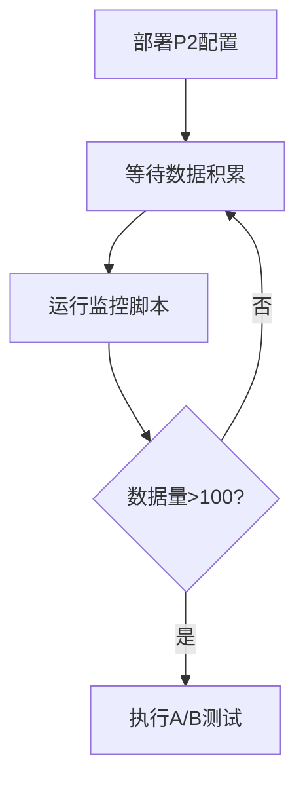

# 性能优化完整指南

本指南介绍三大性能优化工具的使用方法和最佳实践：

1. **A/B测试框架** - 对比不同配置阶段的性能
2. **可视化监控仪表板** - 实时监控系统健康状态
3. **缓存优化器** - 分析和优化缓存性能

---

## 目录

- [1. A/B测试框架](#1-ab测试框架)
- [2. 可视化监控仪表板](#2-可视化监控仪表板)
- [3. 缓存优化器](#3-缓存优化器)
- [4. 优化工作流程](#4-优化工作流程)
- [5. 常见问题](#5-常见问题)

---

## 1. A/B测试框架

### 功能概述

A/B测试框架用于对比P0、P1、P2三个优化阶段的性能差异，帮助您量化每个优化阶段的实际效果。

### 快速开始

```bash
# 运行完整A/B测试 (默认3轮，5个场景)
node ab-test-performance.js run

# 自定义测试参数
node ab-test-performance.js run --rounds=5 --tasks=3

# 指定输出文件
node ab-test-performance.js run --output=my-test-results.json

# 查看已有测试报告
node ab-test-performance.js report ab-test-results.json
```

### 测试场景

框架包含5个预定义测试场景，覆盖不同复杂度的任务：

| 场景ID | 名称 | 复杂度 | 描述 |
|--------|------|--------|------|
| simple_query | 简单查询 | 0.15 | 基础对话型查询 |
| file_operation | 文件操作 | 0.25 | 单文件读写操作 |
| multi_step | 多步骤任务 | 0.40 | 需要多个步骤的任务 |
| complex_reasoning | 复杂推理 | 0.65 | 需要复杂推理的任务 |
| batch_processing | 批量处理 | 0.50 | 批量文件处理 |

### 性能指标

测试会收集以下关键指标：

- **响应时间** (ms) - 任务完成耗时
- **LLM调用次数** - 调用大模型的次数
- **工具调用次数** - 调用工具的次数
- **估算成本** - 相对成本单位
- **感知延迟** (ms) - 用户感知的延迟时间
- **内存占用** (MB) - 内存使用量

### 解读测试结果

#### 整体性能对比表

```
| 指标 | P0优化 | P1优化 | P2优化 | P1 vs P0 | P2 vs P1 |
|------|--------|--------|--------|----------|----------|
| 平均响应时间 | 349ms | 247ms | 25ms | 29.2% | 89.7% |
| LLM调用次数 | 1.3 | 1.0 | 1.0 | -25.0% | -0.0% |
| 成本 | 0.0073 | 0.0040 | 0.0040 | -45.5% | -0.0% |
```

**关键指标解读**：

- **P1 vs P0**: 显示P1优化相对P0的改进百分比
  - 正值 = 性能提升
  - 负值 = 成本/调用次数减少（好事）

- **P2 vs P1**: 显示P2优化相对P1的额外改进
  - 通常P2在延迟方面有显著改进（流式响应）

#### 阶段贡献分析

```
📊 阶段贡献分析:
   - P1 (智能增强): 响应时间 29.2%, 成本 45.5%
   - P2 (性能优化): 响应时间 89.7%, 成本 0.0%
```

**含义**：
- **P1阶段**主要优化：减少LLM调用次数、优化工具调用
- **P2阶段**主要优化：流式响应减少感知延迟、知识蒸馏降低成本

### 最佳实践

1. **定期测试**
   - 每月运行一次完整测试
   - 配置变更后必须测试
   - 新功能上线前测试

2. **多轮测试**
   - 至少运行3轮取平均值
   - 排除异常数据点
   - 在相同环境下测试

3. **场景覆盖**
   - 包含实际业务场景
   - 覆盖高中低复杂度
   - 测试边界情况

4. **结果存档**
   - 保存测试结果JSON
   - 建立性能基线
   - 跟踪性能趋势

---

## 2. 可视化监控仪表板

### 功能概述

实时监控仪表板提供Web界面，可视化展示系统各项KPI和性能指标。

### 快速开始

#### 启动API服务

```bash
# 默认端口 3000
node dashboard-api.js

# 自定义端口
node dashboard-api.js 8080
```

#### 访问仪表板

启动后在浏览器访问：

- 仪表板UI: `http://localhost:3000/dashboard`
- API端点: `http://localhost:3000/api/monitoring?days=7`

### 仪表板功能

#### 1. 实时KPI卡片

7个核心KPI卡片实时显示：

- **意图融合** 🔗
  - 融合次数
  - 平均节省率 (%)
  - LLM调用节省数
  - 状态徽章 (优秀/良好/需优化)

- **知识蒸馏** 🧠
  - 总任务数
  - 小模型使用率 (%)
  - 状态评估

- **流式响应** ⚡
  - 流式任务数
  - 总事件数
  - 平均事件/任务

- **自我修正** 🔧
  - 修正次数
  - 成功率 (%)
  - 状态评估

- **多意图识别** 🎯
  - 识别次数
  - 多意图占比 (%)

- **检查点校验** ✅
  - 校验次数
  - 通过率 (%)
  - 状态评估

- **用户反馈** 💬
  - 反馈数
  - 平均评分 (/5)
  - 好评率 (%)

#### 2. 可视化图表

**模型使用分布图** (甜甜圈图)
- 显示小模型 vs 大模型使用比例
- 实时更新数据

**意图融合趋势图** (折线图)
- 融合次数时间序列
- 节省率趋势
- 双Y轴显示

#### 3. 数据表格

**功能使用热度 Top 10**
- 功能名称
- 使用次数
- 成功率
- 平均耗时

**性能问题热点**
- 功能名称
- 问题类型
- 问题数
- 平均耗时
- 最后发生时间

### 交互功能

#### 时间范围选择

```
时间范围: [下拉菜单]
  - 最近 1 天
  - 最近 7 天  ← 默认
  - 最近 30 天
  - 最近 90 天
```

#### 数据刷新

- **手动刷新**: 点击 🔄 刷新数据 按钮
- **自动刷新**: 每30秒自动刷新一次

#### 数据导出

点击 📥 导出数据 按钮，下载JSON格式的监控数据。

### 状态徽章说明

| 颜色 | 状态 | 含义 |
|------|------|------|
| 🟢 绿色 | 优秀 | 超过优秀阈值 |
| 🔵 蓝色 | 良好 | 达到良好标准 |
| 🟡 黄色 | 需优化 | 低于标准，需关注 |
| 🔴 红色 | 需要关注 | 显著偏离目标 |

**阈值标准**：

- 意图融合节省率: >= 50% (优秀)
- 知识蒸馏小模型率: 40-60% (优秀范围)
- 自我修正成功率: >= 70% (优秀)
- 检查点通过率: >= 80% (优秀)

### 部署建议

#### 开发环境

```bash
# 本地运行
node dashboard-api.js 3000
```

#### 生产环境

使用PM2部署：

```bash
# 安装PM2
npm install -g pm2

# 启动服务
pm2 start dashboard-api.js --name "dashboard" -- 3000

# 设置开机自启
pm2 startup
pm2 save

# 查看日志
pm2 logs dashboard

# 停止服务
pm2 stop dashboard
```

#### Nginx反向代理

```nginx
server {
    listen 80;
    server_name dashboard.yourcompany.com;

    location / {
        proxy_pass http://localhost:3000;
        proxy_http_version 1.1;
        proxy_set_header Upgrade $http_upgrade;
        proxy_set_header Connection 'upgrade';
        proxy_set_header Host $host;
        proxy_cache_bypass $http_upgrade;
    }
}
```

### API文档

#### GET /api/monitoring

获取监控数据

**参数**:
- `days` (可选): 查询天数，默认7

**响应**:
```json
{
  "timestamp": "2026-01-02T10:30:00.000Z",
  "timeRange": "7 days",
  "intentFusion": {
    "totalFusions": 150,
    "avgSavingsRate": 57.8,
    "totalLLMSaved": 240,
    "lastFusion": "2026-01-02T09:15:00.000Z",
    "history": [...]
  },
  "knowledgeDistillation": {...},
  "streamingResponse": {...},
  ...
}
```

---

## 3. 缓存优化器

### 功能概述

缓存优化器分析系统缓存使用情况，识别优化机会，提供智能建议。

### 快速开始

```bash
# 分析缓存性能
node cache-optimizer.js analyze

# 生成优化配置
node cache-optimizer.js optimize

# 执行缓存预热
node cache-optimizer.js preheat

# 执行所有优化
node cache-optimizer.js all
```

### 核心功能

#### 1. 缓存性能分析

**分析内容**：

- **意图识别缓存**
  - 样本数量
  - 模拟命中率
  - 重复查询比例

- **LLM响应缓存**
  - 任务样本数
  - 复杂度分布
  - 缓存潜力评估

- **整体缓存统计**
  - 总请求数
  - 命中率/未命中率
  - 缓存条目数
  - 内存占用
  - 淘汰次数

**输出示例**：

```
📊 缓存性能分析
======================================================================

1. 意图识别缓存分析

ℹ 意图缓存样本数: 85
ℹ 模拟命中次数: 28
ℹ 模拟未命中次数: 12
ℹ 预期命中率: 70.0%

3. 整体缓存统计

ℹ 总请求数: 125
ℹ 缓存命中: 88 (70.40%)
ℹ 缓存未命中: 37 (29.60%)
ℹ 缓存条目数: 85
ℹ 总内存占用: 2.45 MB
ℹ 平均条目大小: 29.53 KB
ℹ 淘汰次数: 0
```

#### 2. 缓存热点/冷点分析

**热点数据** (Top 5):
- 访问次数最多的缓存键
- 访问计数
- 最后访问时间
- 数据大小

**冷点数据** (Bottom 5):
- 访问次数最少的缓存键
- 识别可淘汰数据

#### 3. 智能优化建议

基于分析结果，系统会给出针对性建议：

##### 命中率 < 50%

```
⚠ 缓存命中率偏低 (<50%)
   建议:
   - 增加缓存大小
   - 优化缓存键生成算法
   - 实施缓存预热策略
```

##### 命中率 50-70%

```
⚠ 缓存命中率一般 (50-70%)
   建议:
   - 分析冷数据，考虑调整TTL
   - 实施智能预取
```

##### 命中率 >= 70%

```
✓ 缓存命中率良好 (>=70%)
```

##### 内存占用 > 80MB

```
⚠ 内存占用较高
   建议:
   - 启用压缩
   - 调整淘汰策略
   - 减小TTL
```

##### 淘汰率 > 30%

```
⚠ 淘汰率较高 (>30%)
   建议:
   - 增加缓存容量
   - 优化淘汰策略（考虑LFU）
```

#### 4. 配置优化

`optimize`命令会生成优化后的配置文件：

```json
{
  "maxSize": 2000,
  "maxMemoryMB": 200,
  "ttl": 7200000,
  "evictionPolicy": "lfu",
  "compressionEnabled": true,
  "prefetchEnabled": true
}
```

配置说明：

| 参数 | 说明 | 默认值 | 优化后 |
|------|------|--------|--------|
| maxSize | 最大缓存条目数 | 1000 | 动态调整 |
| maxMemoryMB | 最大内存 (MB) | 100 | 动态调整 |
| ttl | 生存时间 (ms) | 3600000 | 动态调整 |
| evictionPolicy | 淘汰策略 | lru | lru/lfu/fifo |
| compressionEnabled | 启用压缩 | true | 根据内存占用 |
| prefetchEnabled | 启用预取 | true | true |

#### 5. 缓存预热

`preheat`命令会预加载高频数据：

- **高频意图** (Top 50)
  - 基于历史使用频率
  - 减少冷启动时间

- **常用工具** (Top 30)
  - 预加载工具调用结果
  - 提高首次调用速度

**输出示例**：

```
🔥 缓存预热
======================================================================

1. 预热高频意图

✓ 预热 45 个高频意图

2. 预热常用工具

✓ 预热 28 个常用工具

预热结果:

ℹ 预热条目数: 73
ℹ 内存占用: 3.21 MB
```

### 缓存策略

#### LRU (Least Recently Used)

- **适用场景**: 访问模式有时间局部性
- **优点**: 实现简单，适合大多数场景
- **缺点**: 偶尔访问的热数据可能被淘汰

#### LFU (Least Frequently Used)

- **适用场景**: 有明显热点数据
- **优点**: 保留真正高频数据
- **缺点**: 需维护访问计数，新数据难进入

#### FIFO (First In First Out)

- **适用场景**: 数据时效性强
- **优点**: 实现最简单
- **缺点**: 不考虑访问频率

### 智能缓存键生成

#### 数据规范化

系统会自动规范化输入数据以提高命中率：

**意图缓存**:
```javascript
// 原始输入
{ text: "  HELLO World  ", context: {...} }

// 规范化后
{ text: "hello world", context: {...} }

// 好处: "HELLO World" 和 "hello world" 命中同一缓存
```

**工具调用缓存**:
```javascript
// 原始参数
{ name: "read_file", params: { path: "/a/b", encoding: "utf8" } }

// 规范化后 (参数排序)
{ name: "read_file", params: { encoding: "utf8", path: "/a/b" } }

// 好处: 参数顺序不影响缓存命中
```

### 最佳实践

1. **定期分析**
   - 每周运行 `analyze` 命令
   - 关注命中率趋势
   - 识别性能瓶颈

2. **适时优化**
   - 命中率 < 60% 时运行 `optimize`
   - 应用推荐配置
   - 观察效果

3. **缓存预热时机**
   - 应用启动时
   - 低峰期预热
   - 配置更新后

4. **监控指标**
   - 命中率: >= 70%
   - 内存占用: < 80MB
   - 淘汰率: < 30%

---

## 4. 优化工作流程

### 初次部署后 (第1周)



**操作步骤**：

```bash
# 1. 每天检查监控
node monitor-production.js 1

# 2. 一周后运行A/B测试
node ab-test-performance.js run --rounds=3

# 3. 查看可视化仪表板
node dashboard-api.js 3000
# 访问 http://localhost:3000/dashboard
```

### 稳定运行期 (第2-4周)

```bash
# 1. 每周A/B测试
node ab-test-performance.js run

# 2. 分析缓存性能
node cache-optimizer.js analyze

# 3. 如命中率<60%，执行优化
node cache-optimizer.js optimize

# 4. 查看监控仪表板
# 访问 http://localhost:3000/dashboard
```

### 持续优化期 (每月)

```bash
# 1. 完整性能分析
node ab-test-performance.js run --rounds=5
node cache-optimizer.js all

# 2. 知识蒸馏阈值调优
node tune-distillation-threshold.js recommend

# 3. 生成月度报告
node monitor-production.js 30 > monthly-report.txt

# 4. 备份测试数据
cp ab-test-results.json backup/ab-test-$(date +%Y%m).json
```

### 问题排查流程

#### 性能下降

```bash
# 1. 查看监控仪表板，确定问题模块
# 访问 http://localhost:3000/dashboard

# 2. 运行A/B测试确认
node ab-test-performance.js run

# 3. 分析缓存是否有问题
node cache-optimizer.js analyze

# 4. 检查数据库是否有问题
node monitor-production.js 7
```

#### 成本上升

```bash
# 1. 检查知识蒸馏小模型使用率
node tune-distillation-threshold.js analyze

# 2. 如果小模型使用率偏低，调整阈值
node tune-distillation-threshold.js recommend

# 3. 检查意图融合效果
node monitor-production.js 7
```

#### 用户满意度下降

```bash
# 1. 查看用户反馈
# 在仪表板中查看反馈卡片

# 2. 查看性能问题热点
# 在仪表板中查看热点表格

# 3. 分析自我修正成功率
node monitor-production.js 7

# 4. 运行A/B测试找问题
node ab-test-performance.js run
```

---

## 5. 常见问题

### Q1: A/B测试显示"暂无数据"

**原因**: 系统刚部署，还没有历史数据

**解决**:
1. 等待系统运行1-2周积累数据
2. 手动执行一些测试任务
3. A/B测试本身会生成模拟数据用于对比

### Q2: 监控仪表板无法访问

**检查步骤**:
```bash
# 1. 确认API服务是否运行
ps aux | grep dashboard-api

# 2. 检查端口是否被占用
netstat -ano | findstr :3000  # Windows
lsof -i :3000                  # Linux/Mac

# 3. 查看错误日志
node dashboard-api.js 2>&1 | tee dashboard.log

# 4. 尝试其他端口
node dashboard-api.js 8080
```

### Q3: 缓存命中率一直很低

**可能原因**:
1. 缓存大小设置过小
2. TTL设置过短
3. 查询模式不适合缓存
4. 缓存键生成算法需优化

**解决方案**:
```bash
# 1. 运行优化命令
node cache-optimizer.js optimize

# 2. 应用推荐配置到实际代码
# 编辑 src/main/ai-engine/cache-config.js

# 3. 执行缓存预热
node cache-optimizer.js preheat

# 4. 一周后重新分析
node cache-optimizer.js analyze
```

### Q4: A/B测试结果不稳定

**原因**: 测试轮数太少，环境干扰

**解决**:
```bash
# 增加测试轮数
node ab-test-performance.js run --rounds=10

# 在相同条件下测试
# - 关闭其他程序
# - 保持网络稳定
# - 使用相同的数据库状态
```

### Q5: 知识蒸馏小模型使用率异常

**检查**:
```bash
# 1. 查看当前阈值
node -e "console.log(require('./src/main/ai-engine/ai-engine-config').getAIEngineConfig().knowledgeDistillationConfig.routing.complexityThreshold)"

# 2. 分析任务复杂度分布
node tune-distillation-threshold.js analyze

# 3. 获取推荐阈值
node tune-distillation-threshold.js recommend

# 4. 模拟不同阈值
node tune-distillation-threshold.js simulate 0.4
```

### Q6: 仪表板数据不刷新

**检查**:
1. 浏览器控制台是否有错误
2. API是否正常响应: `curl http://localhost:3000/api/monitoring`
3. 数据库连接是否正常
4. 清除浏览器缓存重试

### Q7: 内存占用持续增长

**排查**:
```bash
# 1. 检查缓存大小
node cache-optimizer.js analyze

# 2. 查看具体内存占用
node --expose-gc -e "
  const used = process.memoryUsage();
  console.log('堆内存:', (used.heapUsed / 1024 / 1024).toFixed(2), 'MB');
  console.log('总内存:', (used.rss / 1024 / 1024).toFixed(2), 'MB');
"

# 3. 优化缓存配置
node cache-optimizer.js optimize

# 4. 如果是数据库连接泄漏，检查是否正确关闭连接
```

---

## 附录

### A. 性能指标参考值

| 指标 | 优秀 | 良好 | 需优化 |
|------|------|------|--------|
| 意图融合节省率 | >= 50% | >= 40% | < 40% |
| 小模型使用率 | 40-60% | 30-70% | < 30% or > 70% |
| 缓存命中率 | >= 70% | >= 50% | < 50% |
| 自我修正成功率 | >= 70% | >= 60% | < 60% |
| 检查点通过率 | >= 80% | >= 70% | < 70% |
| 响应时间优化 | >= 80% | >= 50% | < 50% |
| 成本节省 | >= 50% | >= 30% | < 30% |

### B. 工具对照表

| 需求 | 工具 | 命令 |
|------|------|------|
| 对比不同配置性能 | A/B测试 | `node ab-test-performance.js run` |
| 实时监控系统状态 | 仪表板 | `node dashboard-api.js` |
| 提高缓存效率 | 缓存优化器 | `node cache-optimizer.js all` |
| 调整蒸馏阈值 | 阈值调优工具 | `node tune-distillation-threshold.js recommend` |
| 查看历史趋势 | 生产监控 | `node monitor-production.js 30` |
| 验证部署效果 | E2E测试 | `node test-e2e-pipeline.js` |

### C. 相关文件

- **工具脚本**:
  - `ab-test-performance.js` - A/B测试框架
  - `dashboard-api.js` - 仪表板API服务
  - `dashboard.html` - 仪表板前端
  - `cache-optimizer.js` - 缓存优化器
  - `monitor-production.js` - 生产监控
  - `tune-distillation-threshold.js` - 阈值调优

- **配置文件**:
  - `src/main/ai-engine/ai-engine-config.js` - AI引擎配置
  - `cache-config.json` - 缓存配置 (生成)

- **文档**:
  - `P0_P1_P2_PRODUCTION_DEPLOYMENT_GUIDE.md` - 部署指南
  - `KNOWLEDGE_DISTILLATION_TUNING_GUIDE.md` - 蒸馏调优指南
  - `PERFORMANCE_OPTIMIZATION_GUIDE.md` - 本文档

---

**版本**: v1.0
**最后更新**: 2026-01-02
**作者**: ChainlessChain Team
