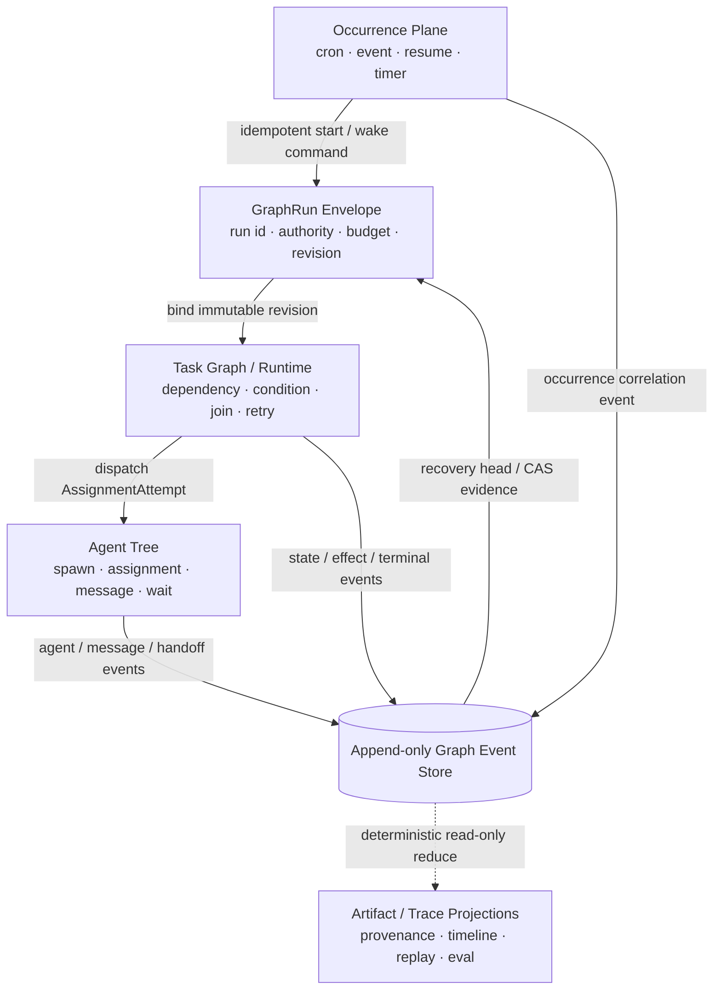

# ChainlessChain 对照 OpenAI Codex 开源架构的差距与优化建议

> 审计日期：2026-08-24  
> 最新进展更新：2026-09-02
> ChainlessChain 基线：`3ec94b795e`  
> 最新 Agent 平台发布验证基线：`40354eb432281c28ed266f2dc6d1458764eb536d`（`v-npm-0-166-0`、`python-agent-sdk-v0.2.0`）
> 最新 Agent Protocol OIDC 发布验证基线：`882c3c9d7f18ee0cc0c766a2b865f8234f7dc4ed`（`agent-protocol-oidc-v0.1.0`）
> 最新 Graph 平台协调发布验证基线：`e6a830f340a8dc3214a56b440ebf495624fc12ff`（`v-npm-0-166-1`、`python-agent-sdk-v0.2.1`、`agent-protocol-oidc-v0.1.1`）
> 最新实时 Team 消息发布验证基线：`f868e142068c33d203601cddd7643fd8ad9c4ffb`（`v-npm-0-166-2`，CLI-only；协议与 SDK 版本不变）
> 最新未发布 Team/Session 消息验证基线：`20b1bb5563239bd3ec2d4653ba6c57bdbb6c0d9a`（CLI-only；CLI CI 已通过；协议与 SDK 内容及版本不变）
> 最新结构化审批正式发布基线：精确提交 `67fdfd25359b7bb6995fed1a89452bcc128daf6d` 已通过协议、CLI、Strict Sandbox、Python SDK、桌面 E2E、通用 CI 与 IDE 权威矩阵，并通过 OIDC 发布 protocol `0.1.2`、TS/Python SDK `0.2.2` 与 CLI `0.166.3`；发布链后继加固提交为 `0830ebea9059bc07d76355ca43c632821ab4faf2`
> 最新 Agent 平台协调发布基线：protocol `0.1.5`、TS/Python SDK `0.2.4` 未发生包字节变化，无需重复发布；CLI `0.166.6` 已在精确提交 `f2a249bf3daf77af32ab84cfe5d567485f08b3e7` 完成 Linux/Windows/macOS CLI CI、CLI Strict Sandbox、OIDC 发布和独立公网制品/provenance 回读，现为生产安装版本；Open VSX `0.37.71` 已公开。JetBrains `0.4.102` 已通过六宿主矩阵并上传 Marketplace，但公开 API 仍为 `0.4.100`，当前只剩外部人工审核，不阻塞继续攻破其他任务
> 最新 P2 UI replay/Codex compatibility 发布验证基线：精确提交 `222396f6a8429d4b862292a2572067a5cacb1003` 已通过真实 Chromium Linux/Windows/macOS replay 聚合、Codex `0.149.0`/`0.150.0`/`0.150.1` 三平台 App Server 兼容与移除演练、CLI CI、CLI Strict Sandbox，并以 `v-npm-0-166-9` 正式发布
> 最新合并后公开发布基线：精确提交 `15bd3636b8aa8f223a11b2eefeb206ff7dc20bb7` 已通过发布工作流对同 SHA 的 CLI CI、CLI Strict Sandbox 前置校验，并以 npm Trusted Publishing/SLSA provenance 发布 `chainlesschain@0.166.16`；Open VSX `0.37.78` 已公开，JetBrains `0.4.108` 已完成六宿主矩阵并上传 Marketplace、仍待外部人工审核。protocol `0.1.7`、TS/Python SDK `0.2.7` 继续为公开稳定版本；详见 §12.77
> Codex 源码参考基线：`479c8c8924eaafdeb56e86154cd19ff0805839e4`（2026-08-23）  
> 本机 Codex CLI：`codex-cli 0.149.0`

## 1. 结论先行

ChainlessChain 当前最不缺的是 Agent 功能。CLI、桌面端、IDE、TS/Python SDK、MCP、Skills、Hooks、Worktree、多代理、会话恢复、上下文压缩、沙箱、审批、OTLP 和 Eval 都已有实现。

截至 2026-08-25，初始 Agent 平台与协议首发证据仍分别固定在 `40354eb432281c28ed266f2dc6d1458764eb536d` 和 `882c3c9d7f18ee0cc0c766a2b865f8234f7dc4ed`。在此之后，Graph compensation、bounded loop、digest-pinned subgraph、typed subgraph I/O、durable budget slicing、iteration-scoped effect/receipt/compensation 及内置 v0→v1 migration/rollback corpus 已协调发布：精确提交 `e6a830f340a8dc3214a56b440ebf495624fc12ff` 通过同一 SHA 的 Linux/Windows/macOS CLI、strict sandbox、协议与 Python 矩阵，并公开发布 `chainlesschain@0.166.1`、`@chainlesschain/agent-sdk@0.2.1`、`chainlesschain-agent-sdk==0.2.1` 和 `@chainlesschain/agent-protocol@0.1.1`。三个 npm 包均显示 GitHub Trusted Publisher OIDC 身份和 SLSA provenance；全新临时 npm/Python 环境的安装与导入回读通过。

这关闭了 P1-4/P1-8 在 CLI Graph Kernel、协议与生成绑定上的本轮实现/发包边界，但不等于 canonical Graph Kernel 已成为全产品唯一 authoritative runtime。CLI Team/Cowork/Scheduler、Desktop/Browser 的生产 adapter 切换和旧 writer 下线仍归 P1-12。P1-5 的 dependency/scope priority donation、aging 和 3 倍 queue-wait SLO，以及 P1-6～P1-8 的 30 分钟消息可靠性、跨进程 DAG/fault、effect/receipt 恢复正式门，已在后续精确 SHA 三平台矩阵闭环，详见 6.9.6.7.21～6.9.6.7.24。

在已发布的 `0.166.1` 基线之后，`chainlesschain@0.166.2` CLI-only 补丁补上了真实 `cc team --agent` child 的实时 `team_send / team_receive / team_ack / team_followup` 宿主工具、attempt/lease/fence 绑定的私有本地桥、at-least-once 回执与幂等消费、`--state` mutation checkpoint，以及禁止嵌套 subagent 继承父 attempt 通道的隔离。精确提交 `f868e142068c33d203601cddd7643fd8ad9c4ffb` 已通过 Linux/Windows/macOS `CLI CI` 与 `CLI Strict Sandbox`，并由不可变标签 `v-npm-0-166-2` 通过 GitHub OIDC/Trusted Publishing 正式发布；公共 registry、签名 provenance 和不可变制品字节级回读均通过。

此后的未发布 CLI 源码先完成 idle target followup 新 turn、canonical Team message/handoff 投影和有 custody 的 `team_handoff`；最新增量又把使用 `--state` 的生产 `cc team` 消息 authority 从 Team snapshot 内嵌 mailbox 切换为 [`SessionMessageFabric`](../packages/cli/src/lib/session-message-fabric.js) companion state。新 [`TeamSessionMessageAdapter`](../packages/cli/src/lib/agent-team/team-session-message-adapter.js) 保留 Team 的稳定逻辑消息 ID 和广播语义，同时提供跨进程锁内 admission、offline hold/reconnect、at-least-once receive、read/processed/dead-letter、consumer fencing、幂等、跨进程 rate limit、legacy TeamMailbox v3 migration、单 revision 审计快照和锁内 4 MiB Team pending-byte 上限。精确源码提交 `4109134150d380c202a143f53050bccfd6ab87cb` 的三平台 `CLI Strict Sandbox` 已通过，但 `CLI CI` 因 XSESSION v2 的锁定审计基线未同步而在三平台同一测试失败，故没有发布资格；仅修复 contract 的后继提交 `20b1bb5563239bd3ec2d4653ba6c57bdbb6c0d9a` 已通过完整 CLI CI（52 成功、1 条件跳过）。P1-6 仍因真实 provider、长时离线/poison/reorder 正式 soak、分布式 custody 边界、全产品 authoritative adapter/旧 writer 切换未完成而保持开放；本增量没有修改 Agent Protocol 或 TS/Python SDK 包，当前也不创建 CLI 或协议/SDK 版本。

公开结构化审批增量现已完成发版闭环：canonical schema 生成的 JavaScript/TypeScript/Python validator 与同一份合法/非法 fixture 覆盖协议包、TS SDK、Python SDK 和 CLI App Server；两套 SDK 的回调可返回 `acceptOnce / acceptForTurn / acceptForSession / decline / cancel`，请求携带 exact binding 与最小 `requested_permissions`，非法、异常、binding 缺失或不匹配均失败关闭。CLI 只复用精确匹配 tool、args、cwd、policy 的 grant；turn grant 不落盘，session grant 只有在 tamper-evident authority event 持久化成功后才生效，损坏恢复会全部丢弃，持久化失败降级为 `acceptOnce`。旧 boolean 回调和直接 `respondApproval(..., boolean)` 保留 N-1 wire 兼容。最终发布提交 `67fdfd25359b7bb6995fed1a89452bcc128daf6d` 已通过协议、Python SDK、CLI CI、Strict Sandbox、E2E、通用 CI、IDE 与其他精确 SHA 门禁，并通过 OIDC 发布 protocol `0.1.2`、TS/Python SDK `0.2.2` 和 CLI `0.166.3`。首次 IDE Job `97827116999` 是 GitHub hosted runner 失联，attempt 2 同 SHA 重跑后整个工作流成功；WebShell fixture 与 npm/PyPI 发布链的后续修复见第 12 节。

真正值得从 Codex 学习的，不是继续堆功能，而是把这些能力收敛成一套可验证的产品内核：

1. **一个长期稳定的 Agent Server 协议**，统一桌面端、CLI、IDE、SDK 和移动端。
2. **一个 canonical Agent Kernel**，统一 turn loop、上下文、工具、审批、沙箱、会话和遥测。
3. **一个 canonical Graph Kernel**，明确区分动态 Agent Tree、确定性 Task DAG 和事后 Artifact/Trace Graph，并共享同一运行权限、预算与事件账本。
4. **Schema-first + codegen**，不再由 TypeScript、Python、IDE 和 WebSocket 手工镜像协议。
5. **安全边界默认生效且失败关闭**，审批不能替代操作系统级沙箱。
6. **真实轨迹驱动的契约测试和 Eval**，测试真实对象与真实事件，而不只是 mock 和功能清单。

本次扫描同时发现数个应先于架构重构修复的高置信问题：

- 当前 Codex backend 复用了 Claude Code 参数，实际调用协议错误。
- Desktop Coding Agent 的宿主工具和自动记忆归并存在真实对象契约断裂，但测试 mock 掩盖了问题。
- Desktop `$team` 子进程当前只写进度并直接返回成功；与之相对，CLI `cc team` 已经是真实执行器，不能把两者混为一谈。
- 旧 `cc workflow`、Desktop AgentCoordinator/WorkflowEngine 和 Cowork parallel 的部分路径会产生“幻影成功”，或在多个可写 Agent 共享同一 `cwd` 时并发产生不可归属的副作用。
- Desktop Browser Workflow 的取消可能被覆写成 completed/failed，活跃执行只在内存且进程重启后无法 hydrate/resume；在补恢复契约前不能声明 durable。
- CLI 已有较强安全基础，但 Desktop/Cowork 存在通用 IPC、任意路径写入和直接 host spawn 等平行执行面。
- Desktop MCP 在 policy 加载失败、无权限配置和无 consent UI 时存在 allow 路径，stdio server 还会继承完整环境与敏感连接信息。
- ApprovalGate 初始化失败后会退回允许路径；CLI 默认也不强制技术沙箱。

因此，建议总体策略是：**先修真实性和安全性，再统一协议与内核，最后扩展体验。**

## 2. Codex 实际开放了什么

OpenAI 官方当前列出的开放组件包括 Codex CLI、SDK、Security CLI/SDK、App Server、Skills、Plugins 和通用云环境；IDE 扩展与 Codex cloud 均被官方明确列为 **Not open source**。参见 [OpenAI：Open Source](https://learn.chatgpt.com/docs/open-source)。

这意味着最值得直接研究的是开放的 agent harness 和集成边界，而不是照搬产品 UI：

- **App Server**：以 JSON-RPC 风格协议暴露线程、轮次、事件、审批与工具交互，stdio 是默认传输，WebSocket 仍是实验性传输；官方当前也把 `app-server` 命令整体标为实验性且不支持生产工作负载。因此可以借鉴协议形状，但不能把其成熟度当作 ChainlessChain 的生产保证；它还包含初始化握手、恢复、分支和服务端主动审批请求。参见 [Codex App Server](https://learn.chatgpt.com/docs/app-server)。
- **共享 harness**：Codex 的 CLI、App 和 IDE 共享同一 agent loop；产品层拥有界面、上下文选择、工具与操作边界，harness 负责推理循环、沙箱和生命周期。参见 [Codex as a platform](https://learn.chatgpt.com/blog/codex-as-a-platform)。
- **自动化入口分层**：脚本和 CI 使用 `codex exec`，程序化启动/恢复/事件流使用 SDK，完整产品集成使用 App Server。参见 [Codex CLI](https://learn.chatgpt.com/docs/codex/cli) 与 [Codex as a platform](https://learn.chatgpt.com/blog/codex-as-a-platform)。
- **安全双层模型**：sandbox 是技术边界，approval policy 决定何时询问；两者不能互相替代。参见 [Agent approvals & security](https://learn.chatgpt.com/docs/agent-approvals-security) 与 [Sandboxing](https://learn.chatgpt.com/docs/sandboxing)。
- **Skills 产品化**：除了渐进加载，还可通过 Record & Replay 把稳定、重复的 UI 流程录制成可复用 Skill；但 Codex 当前这项能力仅支持 macOS，且要求 Computer Use 可用并启用，不能误写成现成的跨平台能力。参见 [Record & Replay](https://learn.chatgpt.com/docs/extend/record-and-replay)。
- **多智能体不是通用 DAG 引擎**：Responses API 的 hosted Multi-agent 采用 root/subagent 动态树与 `spawn/send/followup/wait/interrupt/list` 六类协作动作，适合可独立、边界清楚的并行工作；官方将固定、确定性执行图列为 “Prefer one agent” 场景。该 hosted 能力当前仍是 beta，`max_concurrent_subagents` 对整棵树全局生效且默认 3，但官方没有固定树深或累计 subagent 数上限；每个 agent 独立 compact，当前也不支持 `/responses/compact`、`reasoning.summary` 或 `max_tool_calls`。这些限制和默认值不能套到本地 Codex Subagents；后者使用 `agents.max_concurrent_threads_per_session`，官方未声明相同默认。若 ChainlessChain 仍需要固定 DAG，应由自身 Task Graph/Application orchestration 承担，并自行实施深度、累计规模、驻留与预算上限。参见 [Responses Multi-agent](https://developers.openai.com/api/docs/guides/responses-multi-agent) 与 [Codex Subagents](https://learn.chatgpt.com/docs/agent-configuration/subagents)。
- **Codex 源码已有两类“图”，但都不是任务 DAG**：[`agent-graph-store`](https://github.com/openai/codex/tree/479c8c8924eaafdeb56e86154cd19ff0805839e4/codex-rs/agent-graph-store/src) 持久化 parent/child spawn 树；[`rollout-trace`](https://github.com/openai/codex/blob/479c8c8924eaafdeb56e86154cd19ff0805839e4/codex-rs/rollout-trace/README.md) 以 append-only 原始事件和离线 reducer 构造事后语义信息流图。它们分别承载持久 spawn 拓扑/生命周期查询与诊断/回放，不提供声明式依赖、join/barrier 或拓扑调度。

## 3. 本项目已经具备、应保留的能力

以下能力不建议推倒重做：

| 能力                 | 现状证据                                                                                                                                                                                                                                                                                                                                                                                                                                                                       | 判断                                                                                                                                    |
| -------------------- | ------------------------------------------------------------------------------------------------------------------------------------------------------------------------------------------------------------------------------------------------------------------------------------------------------------------------------------------------------------------------------------------------------------------------------------------------------------------------------ | --------------------------------------------------------------------------------------------------------------------------------------- |
| CLI 非交互执行       | [`agent.js`](../packages/cli/src/commands/agent.js#L404) 已支持 text/json/stream-json、schema、权限、worktree、sandbox、OTLP 等                                                                                                                                                                                                                                                                                                                                                | 功能面成熟，适合收敛出稳定 `exec` facade                                                                                                |
| 会话恢复与完整性     | [`jsonl-session-store.js`](../packages/cli/src/harness/jsonl-session-store.js#L2) 已有 append-only、hash chain、resume/fork/checkpoint/compact                                                                                                                                                                                                                                                                                                                                 | 应提升为共享逻辑契约，而不是另造存储                                                                                                    |
| TS/Python SDK        | [`protocol.ts`](../packages/agent-sdk/src/protocol.ts#L5) 和 Python SDK 已存在，IDE 还有共用 fixtures                                                                                                                                                                                                                                                                                                                                                                          | 应改为 schema/codegen，不必重写 SDK                                                                                                     |
| Worktree 安全        | [`agent-worktree.js`](../packages/cli/src/lib/agent-worktree.js#L66) 已有 repo/path/base SHA 与 fail-closed 清理检查                                                                                                                                                                                                                                                                                                                                                           | 应进入统一 Agent Kernel                                                                                                                 |
| Skills 渐进披露      | CLI [`skill-loader.js`](../packages/cli/src/lib/skill-loader.js#L893) 和 Desktop 四层 skill loader 已支持 metadata-first                                                                                                                                                                                                                                                                                                                                                       | 应补激活契约与代码型 Skill 隔离                                                                                                         |
| MCP 安全能力         | CLI 已有一次性 capability、workspace fingerprint 和 host-owned sandbox floor                                                                                                                                                                                                                                                                                                                                                                                                   | 应扩散到 Desktop/Cowork 并消除绕行路径                                                                                                  |
| 进程安全基础         | CLI [`ProcessExecutionBroker`](../packages/cli/src/lib/process-execution-broker/index.js#L979) 已过滤凭据，并能校验真实 sandbox boundary                                                                                                                                                                                                                                                                                                                                       | 应成为全产品唯一进程执行入口                                                                                                            |
| CLI Scheduler Kernel | [`contract.js`](../packages/cli/src/lib/scheduler-kernel/contract.js#L382)、[`store.js`](../packages/cli/src/lib/scheduler-kernel/store.js#L38)、[`runtime.js`](../packages/cli/src/lib/scheduler-kernel/runtime.js#L239) 已有 occurrence 幂等身份、SQLite schema v6、job revision、lease/fencing、retry/dead-letter、authority budget、pause/resume 与未知结果对账；[`service.js`](../packages/cli/src/lib/scheduler-kernel/service.js#L128) 还会串行 tick 并隔离 driver 失败 | 应保留为定时/事件 occurrence 与 admission 层，通过 adapter 触发或恢复 GraphRun；它不是 Task DAG scheduler，不能与 Graph Kernel 重复编排 |
| CLI Cowork 图运行时  | [`cowork-workflow.js`](../packages/cli/src/lib/cowork-workflow.js#L803) 已有 DAG、条件、fan-out、循环、retry/timeout 与无 barrier pipeline；[`dynamic-workflow-runtime.js`](../packages/cli/src/lib/dynamic-workflow-runtime.js#L1499) 已有持久 effect、lineage、暂停和未知结果对账                                                                                                                                                                                            | 应作为动态流程与副作用恢复内核，不应被旧 workflow shell 取代                                                                            |
| CLI Agent Team       | [`team-runner.js`](../packages/cli/src/lib/agent-team/team-runner.js#L1136)、[`task-lease.js`](../packages/cli/src/lib/agent-team/task-lease.js#L287) 与 [`team-worktree.js`](../packages/cli/src/lib/agent-team/team-worktree.js#L1644) 已有真实 Agent、DAG、lease/fencing、预算、worktree、合并和崩溃恢复                                                                                                                                                                    | 应作为任务调度、写隔离与最终化内核，不应误判为模拟器                                                                                    |
| 审计与遥测           | 已有 OTLP、Ed25519/Merkle 审计和 Eval                                                                                                                                                                                                                                                                                                                                                                                                                                          | 应统一事件语义并形成质量闭环                                                                                                            |
| 产品差异化           | 多模型/本地模型、离线优先、Personal Data Hub、P2P/联邦、移动端                                                                                                                                                                                                                                                                                                                                                                                                                 | 这是相对 Codex 的护城河，不应被 OpenAI-only 架构替换                                                                                    |

项目的方向不是“补一个 Codex 克隆”，而是让现有广度建立在更少、更硬的核心契约上。

## 4. 优先级总览

| 优先级 | 建议                                                                           |   投入 | 主要收益                             |
| ------ | ------------------------------------------------------------------------------ | -----: | ------------------------------------ |
| P0     | 修正 Codex backend 的命令和事件协议                                            |     小 | 立即恢复真实可用性                   |
| P0     | 修复 Desktop 真实对象契约，增加非 mock 集成测试                                | 小到中 | 消除“单测绿、生产断”的问题           |
| P0     | 收口 Desktop/Cowork 的 IPC、文件、进程、MCP 与审批入口                         | 中到大 | 消除高危旁路，统一安全保证           |
| P0     | 将 Desktop `$team` 从进度模拟器接入真实内核，并清除其他 Graph shell 的幻影成功 | 中到大 | 让多代理与工作流能力名实相符         |
| P0     | 修复取消/超时后的迟到副作用，并隔离并行可写 Agent 的 workspace                 | 中到大 | 防止隐藏执行、重复写入和不可归属变更 |
| P1     | 建立 CC App Server 与 Thread/Turn/Item 统一模型                                |     大 | 统一多端产品集成边界                 |
| P1     | 建立单一协议 Schema 和多语言 codegen                                           |     中 | 消除 SDK/IDE/WS 漂移                 |
| P1     | 收敛 canonical Graph Kernel、typed Graph IR 与 artifact/handoff 契约           |     大 | 统一调度、协作、恢复和证据语义       |
| P1     | 统一 rollout、上下文压缩、记忆与结构化审批                                     |     大 | 提升恢复、长任务和安全一致性         |
| P1     | 有界队列、背压与模块边界治理                                                   |     中 | 提升长期可维护性和高负载可靠性       |
| P2     | 稳定 `cc exec`、轨迹 Eval、Record & Replay、可选 Codex adapter                 |     中 | 改善自动化、体验和生态兼容           |

### 4.1 P0：真实性、安全边界与终态正确性

以下编号可直接用于 Issue、分支、PR 和验收矩阵；`S/M/L/XL` 仅表示相对投入，不替代实际排期。“已有基础”不代表任务已完成，只有验收标准全部满足后才能关闭。

| 编号 | 任务                                | 真实差距                                                                                                                                                      | 验收标准                                                                                                                                                                                                                                        | 外部条件                                      | 建议        |
| ---- | ----------------------------------- | ------------------------------------------------------------------------------------------------------------------------------------------------------------- | ----------------------------------------------------------------------------------------------------------------------------------------------------------------------------------------------------------------------------------------------- | --------------------------------------------- | ----------- |
| P0-1 | 修正 Codex external-agent adapter   | Codex 与 Claude 共用 Claude 参数和事件 parser，`-p` 被错误当作 prompt，Codex JSONL 也未按真实协议解析                                                         | 独立 `CodexAdapter` 使用 `codex exec --json`；argv、版本能力和脱敏 JSONL fixture contract test 在 Linux/Windows/macOS 通过；失败、取消和未知事件有稳定 exit/error mapping                                                                       | 核心无；真实账号只用于可选 smoke              | 本期，S     |
| P0-2 | 修复 Desktop 真实对象契约           | `callTool/call`、`TraceStore.add/record` 和 `MemoryConsolidator` 构造/调用签名不一致，mock 掩盖生产断裂                                                       | 使用真实 `FunctionCaller/TraceStore/MemoryConsolidator/MCP adapter` 的组件测试覆盖 plan → approval → tool → observation 与 close → trace → consolidate → memory；删除生产不存在的方法 mock                                                      | 无                                            | 本期，S～M  |
| P0-3 | 清除模拟执行和 Graph shell 幻影成功 | Desktop `$team`、旧 workflow、Desktop AgentCoordinator/WorkflowEngine 及部分 Cowork parallel 路径会把 pending、progress 或未检查的 Agent 结果映射为 completed | 所有执行面声明 `simulated/real/durable/isolated` runtime claims；未接入真实内核的入口必须 feature-gate、降级为 designer/simulator 并只能返回 planned/simulated；terminal success 必须绑定 output schema、artifact digest、commit 和测试 receipt | 核心无；真实内核迁移归 P1-3/P1-12             | 本期，M     |
| P0-4 | 修复 Graph 终态与依赖传播           | loop 达到 cap 仍可能 completed；不同引擎对 failed/skipped/upstream failure 的传播互相矛盾；Browser Workflow 的 cancel 还可能被覆写为 completed/failed         | loop cap 未满足条件时进入 `EXHAUSTED/TIMED_OUT` 且不解锁 success edge；cancel 只落 `CANCELLED`；后继稳定落入 `BLOCKED/SKIPPED/UPSTREAM_FAILED/CANCELLED`；run-level terminal algebra 和根因 cut 有单元、属性和恢复测试                          | 无                                            | 本期，S～M  |
| P0-5 | 取消、超时与并行写隔离              | Desktop AgentOrchestrator、Browser Workflow 及 legacy/non-admitted 路径会在调用方返回后留下在途执行；多个可写 Agent 共用 `cwd`，loser 副作用不会撤销或归属    | stop-on-error 不再 dispatch；cancel/timeout 级联 abort descendants、等待物理 settlement，并以 attempt/lease fence 拒绝迟到结果；每个可写 attempt 使用独立 worktree 或经证明不相交的 write scope，只合并 accepted winner                         | 核心无；真实 Git/进程树三平台矩阵需 CI        | 本期，M～L  |
| P0-6 | 关闭 Desktop/Cowork 已知执行旁路    | generic IPC、任意路径写、直接 host spawn、raw MCP/网络工具，以及 Desktop MCP 的 `bypassPolicy`、策略加载失败即 allow 和默认 permissive 权限形成绕过面         | renderer 只能调用固定 allowlist API；路径 realpath 后受 workspace/capability 约束；已知 direct spawn/raw MCP/network/bypass 关闭或先接入现有 Broker；策略缺失/空权限默认拒绝；负向测试覆盖 renderer/Skill/MCP/依赖被攻破场景                    | 核心无；全产品唯一 Broker 迁移归 P1-3/P1-11   | 本期，M～L  |
| P0-7 | 沙箱、审批与审计 fail closed        | ApprovalGate 初始化异常可退回允许；CLI 默认可不启用技术沙箱；Desktop MCP 无主窗口时高风险连接 consent 自动允许，部分审计写入失败被忽略                        | sandbox guarantee 与 approval policy 独立且默认生效；无 UI 或 sandbox/approval/audit/ToolBroker 不可用时高危动作稳定拒绝；审批绑定 operation+args+cwd+workspace+policy digest，过期、重放或参数变化必须重新审批                                 | Linux/macOS/Windows 各需真实 enforcement cell | 本期核心，M |
| P0-8 | 秘密、数据密钥与持久审计迁移        | 私钥/bearer token 可能进入普通数据库；IPFS 数据密钥与密文同库；Desktop stdio MCP 直接继承完整 `process.env` 并注入数据库/GitHub token；高危审计可能只留内存   | 数据库只保存 SecretStore/key reference 或 wrapped DEK；子进程使用最小 allowlist env 和按调用注入的短期 credential；迁移后旧明文被安全清理并可回滚；审计持久、完整、脱敏且无法静默丢失，包含 actor/session/authorization/policy/sandbox/result   | 生产 KMS/HSM 可后移，本地 SecretStore 核心无  | 本期，M     |

#### 4.1.1 P0 历史发布状态（2026-08-24）

本轮已完成 4.1 中 P0-1～P0-8 的代码修复与契约验证。P0-1～P0-5 提交为 `a14f1c7308`；P0-6～P0-8、安全证据刷新与工作流契约收口分别提交为 `d31757dd45`、`6a6ddd19d6`、`d63322b5e9`。CLI 发布候选为精确提交 `f370514d5518a0dd52906b99c661cceea63f41d5`，已经通过同一 SHA 的 Linux/Windows/macOS 权威矩阵并发布为 `chainlesschain@0.165.9`。这里保留的是 P0 版本的历史发布证据；后续 P1/P2 实现已经另以精确提交 `40354eb432281c28ed266f2dc6d1458764eb536d` 完成独立矩阵、正式发布和公网回读，证据见 4.3.2 与 11.1。仍未通过真实 provider 旅程或产品切换验证的任务继续保持开放，不借用基础发布矩阵冒充路线图全部验收。

发布验收证据：

- [CLI CI（成功）](https://github.com/chainlesschain/chainlesschain/actions/runs/32687406177)：52 个 job 成功，1 个条件式 dry-run job 按设计跳过；包含 Linux、Windows、macOS 分片与三平台 `verify-cli`。
- [CLI Strict Sandbox（成功）](https://github.com/chainlesschain/chainlesschain/actions/runs/32687406040)：Linux、Windows、macOS 三个平台的 strict native boundary 全部通过。
- [npm 正式发布（成功）](https://github.com/chainlesschain/chainlesschain/actions/runs/32689298604)：immutable tag/exact-SHA gate、完整复测、打包校验、provenance publish 与注册表回读全部通过。
- npm 公共包：`chainlesschain@0.165.9`，`latest=0.165.9`，tarball 为 `https://registry.npmjs.org/chainlesschain/-/chainlesschain-0.165.9.tgz`，integrity 为 `sha512-tMKa41cjmF618GvdxsRKIJXW68I3Hp7R13cDKtmlxA+u3LhmI3eBK4KRf+7qLDdWNzWyqYNkw4yC1y4+LdYJmA==`。

| 编号 | 实施状态       | 已落地证据                                                                                                                                                                                                       | 外部验收与范围边界                                                     |
| ---- | -------------- | ---------------------------------------------------------------------------------------------------------------------------------------------------------------------------------------------------------------- | ---------------------------------------------------------------------- |
| P0-1 | 已完成         | 独立 Codex `exec --json` adapter、真实 argv/JSONL fixtures、未知事件/取消/超时/非零退出映射                                                                                                                      | 精确 SHA 的三平台 CLI CI 与 `verify-cli` 已通过                        |
| P0-2 | 已完成         | 真实 `FunctionCaller/TraceStore/MemoryConsolidator/MCP adapter` 集成链路，不再依赖生产中不存在的方法 mock                                                                                                        | 精确 SHA 的完整 CLI 发布复测已通过                                     |
| P0-3 | 已完成         | 执行面 runtime claims；未接真实内核的入口降级为 planned/simulated；terminal success 要求证据                                                                                                                     | CLI 发布门禁已通过；唯一 authoritative kernel 的切换仍属于 P1-3/P1-12  |
| P0-4 | 已完成         | loop cap、依赖失败传播、blocked-root cut 与 Browser cancel 终态已修正并覆盖回归                                                                                                                                  | CLI 三平台矩阵已通过；全产品 crash/recovery 持续矩阵属于后续发布门禁   |
| P0-5 | 已完成         | stop-on-error、descendant abort、settlement/fence、per-attempt workspace/write-scope 隔离已落地                                                                                                                  | CLI CI 与 Strict Sandbox 的 Linux/Windows/macOS 矩阵已通过             |
| P0-6 | 历史发布已完成 | generic preload IPC 默认关闭；项目路径 realpath/symlink 边界；Coding Agent/Web Shell raw MCP 强制策略；Cowork code runner/HTTP 与 stdio MCP 强制 Broker；HTTP MCP 有域名、DNS/IP 和大小上限                      | 历史 CLI 发布验收已通过；2026-08-30 当前树回归修复见4.1.2              |
| P0-7 | 历史发布已完成 | ApprovalGate 缺失默认拒绝；CLI 默认 workspace-write/network-off；renderer sandbox 与 sender guard 默认强制；无 consent UI、sandbox、Broker 或持久审计时拒绝                                                      | 历史 Strict Sandbox 三平台矩阵已通过；2026-08-30 当前树回归修复见4.1.2 |
| P0-8 | 历史发布已完成 | Agent 私钥进入 SecretStore、bearer 仅留 hash；CLI IPFS 保存 keyRef，Desktop IPFS 保存 wrapped DEK；旧明文迁移支持 dry-run/事务失败回滚；MCP/PTY/Skill 使用最小环境；MCP 与桌面进程审计持久、脱敏且写入失败即拒绝 | 历史发布与 provenance 已通过；2026-08-30 当前树持久审计回归修复见4.1.2 |

#### 4.1.2 P0 回归复核与当前树修复（2026-08-30）

2026-08-30 对第 5 章的真实调用链重新复核时，发现 P0-6～P0-8 在后续源码中出现了三类回归：通用 preload IPC 可被环境变量重新打开，未显式配置的 CLI sandbox 可返回 `null`，且真实 `agent-core run_shell` 只在 gate 存在时才调用已经 fail-closed 的 shell approval。同时，ApprovalGate 策略存储失败与 ProcessExecutionBroker 审计落盘失败仍可被静默忽略。因此，4.1.1 的历史精确 SHA 证据只证明当时已发布对象，**不能借给后续工作树**。

当前树已完成以下回归修复：

- P0-6：[`verify-fixed-renderer-ipc.mjs`](../desktop-app-vue/scripts/verify-fixed-renderer-ipc.mjs) 从生产 renderer 引用与 main/scoped-preload 静态权威生成精确 capability manifest，排除测试 fixture、模型名、URL/import 等伪 channel；[`renderer-ipc-capabilities.json`](../desktop-app-vue/src/preload/renderer-ipc-capabilities.json) 当前允许 1,208 个精确 channel，并把 156 个仅在 renderer 引用、却没有静态 main/preload 权威的 channel 显式列为 denied。`CC_ENABLE_LEGACY_GENERIC_IPC` 旁路已删除，manifest 漂移或旁路回归会在 Desktop `prebuild` 失败。
- P0-7：[`normalizeAgentSandboxMode`](../packages/cli/src/lib/agent-sandbox.js) 在无显式模式时恢复 `workspace-write + network-off + failIfUnavailable + !allowUnsandboxedCommands`；只有显式 `off` 可返回 host 路径，且仍受 managed policy 拒绝。[`agent-core`](../packages/cli/src/runtime/agent-core.js) 现在对非 settings-rule 的真实 `run_shell` 无条件调用 approval 评估，缺 gate 稳定返回 `approval-gate-unavailable/deny`。[`ApprovalGate`](../packages/session-core/lib/approval-gate.js) 串行策略落盘，写入失败后直接返回 `policy-store-error/deny`，auto-mode 不得绕过该健康检查；[`ApprovalGate` 文件适配器](../packages/session-core/lib/file-adapters.js) 仅把不存在的文件视为空策略，损坏、非法结构或读取错误均返回 `APPROVAL_POLICY_STORE_UNAVAILABLE`。CLI/Desktop singleton 不缓存加载失败的实例，Desktop Coding Agent 宿主也把必需 gate 的加载失败映射为 `policy-store-error/deny`，不再回退到普通允许路径。
- P0-8：高风险 shell/sandbox 路径在 native spawn **之前**要求 ProcessExecutionBroker 持久 admission audit；无法落盘时抛出 `ERR_PROCESS_AUDIT_UNAVAILABLE` 且不启动进程。审计包含 actor、session、authorization、policy digest、sandbox guarantee 和 result；原始 shell command 及 PowerShell/Plugin/Docker/bwrap 中承载用户命令的 argv 按索引脱敏。已启动进程的 outcome 如果后续写入失败，会产生 `audit-error`/进程 warning，不再静默消失。

当前本地确定性验收结果：

- CLI shell/broker 主路径：10 个文件，103 passed、5 skipped；ProcessExecutionBroker 平台边界：335/335 passed。
- CLI headless/stream/sandbox：6 个文件，190/190 passed；ApprovalGate/auto-mode/审计定向回归：5 个文件，88/88 passed；策略配置入口/REPL：4 个文件，183/183 passed。
- ApprovalGate 读取/落盘边界：session-core 2 个文件，54/54 passed；Desktop Coding Agent 宿主失败关闭：51/51 passed；CLI WebSocket 策略入口在本机放宽测试超时后 25/25 passed（默认 5 秒阈值下动态导入超时，不计为功能通过证据）。
- Desktop 安全定向回归：8 个文件，107/107 passed；IPC manifest 校验通过；完整 `npm run build` 成功（renderer 7,919 modules，main/preload 构建成功）。

因此，当前可精确表述为：**P0-1～P0-5 保持历史完成；P0-6～P0-8 的当前树回归修复和本地确定性验收已完成**。当前工作树还不是可发布的精确提交；下一次对外发布前，必须让包含这些修复的最终 SHA 重新通过 Linux/Windows/macOS `CLI CI`、`CLI Strict Sandbox` 与 Desktop 相关矩阵；不以本地结果或旧 SHA 证据替代该门禁。

### 4.2 P1：统一协议、Agent Kernel 与 Graph Engineering

| 编号  | 任务                                   | 已有基础与剩余工作                                                                                                                                                                                                                                                                                                                                                                        | 前置依赖                   | 建议期次              |
| ----- | -------------------------------------- | ----------------------------------------------------------------------------------------------------------------------------------------------------------------------------------------------------------------------------------------------------------------------------------------------------------------------------------------------------------------------------------------- | -------------------------- | --------------------- |
| P1-1  | 单一协议 Schema 与多语言 codegen       | TS/Python SDK、IDE fixtures 和多套事件 union 已存在；冻结 canonical ID、Thread/Turn/Item、approval、tool、error、Graph event schema，并生成 TS/Python/Kotlin/Swift client、validator 和兼容 fixture                                                                                                                                                                                       | P0-1～P0-5                 | 第 3～6 周，M         |
| P1-2  | CC App Server                          | CLI/桌面/IDE 已各有会话和事件入口；为 CC 自身实现 initialize 握手、thread start/resume/fork、turn start/interrupt、item delta/completed、server request、backpressure、幂等和 capability negotiation；stdio 先作为项目基线，WebSocket 明确实验级                                                                                                                                          | P1-1 additive schema MVP   | 第 3～6 周，L         |
| P1-3  | canonical Agent Kernel 与 rollout      | CLI agent、JSONL hash chain、Desktop Coding Agent、context/compaction/memory 已有较多实现；统一 turn loop、ToolBroker、approval、sandbox、context projection、checkpoint/compact/resume/fork 与 terminal evidence；把 Desktop `$team` 接入真实内核，并把旧运行时及执行入口改成 adapter                                                                                                    | P0-2、P0-6、P1-1           | 第 3～10 周，L～XL    |
| P1-4  | versioned typed Graph IR 与 Compiler   | Cowork 已有 DAG、condition、fan-out、leaf loop；Browser Workflow 已有 nested region/sub-workflow；补 `TriggerBinding/Region/LoopRegion/SubgraphCall/IterationFrame`、typed port、edge policy、definition/revision digest、N/N-1 migration，并在任何 effect 前完成引用、环、预算和 workspace 检查                                                                                          | P0-4、P1-1                 | 第 3～10 周，L        |
| P1-5  | AssignmentAttempt、任务调度与触发边界  | Scheduler Kernel 已有 occurrence 幂等、lease/fence、retry/dead-letter/authority；TeamRunner/TaskLeaseRegistry 已有 ready frontier、priority、scope lock、worktree。明确前者只产出 start/resume/timer trigger，后者调度 Task/AssignmentAttempt；补 N:M assignment、capacity/residency、priority donation、fairness 与 accepted-attempt finalization                                        | P0-5、P1-4                 | 第 7～10 周，L        |
| P1-6  | 实时消息与有 custody 的 Handoff        | TeamMailbox 和 SessionMessageFabric 已有 durable sequence、TTL、backpressure 和基础 receipt；把 child 的 send/receive/ack/followup 接入生产 adapter，区分 read/processed，补 causation、去重/dead-letter，并实现 offer/accept/commit/revoke/expire 的 handoff/lease 转移                                                                                                                  | P1-1、P1-3、P1-5           | 第 7～10 周，L        |
| P1-7  | 触发关联、动态扩图与 termination       | Scheduler Kernel 与 DistributedQueue 分别已有 occurrence identity/lease/fence 和 lock 内 append/revision/digest/finalization fence；补 occurrence↔GraphRun 幂等关联、expected-revision/request-id/origin lease、预算再准入、`OPEN/SEALED + producer lease`、稳定 quiescence、runtime wait-for graph 与 deadlock/livelock predicate                                                        | P1-4、P1-5、P1-6           | 第 7～10 周，L        |
| P1-8  | Effect、Artifact 与 Trace Graph        | DynamicWorkflowRuntime 已有 durable effect/receipt/reconcile，Team 有 checkpoint/merge，项目已有 OTel/JSONL/ArtifactStore；统一 idempotency/unknown outcome/compensation、transactional outbox/inbox 或等价 dispatch journal、artifact provenance、recipient-visible evidence、append-only raw event 与 deterministic reducer                                                             | P0-4、P0-5、P1-3～P1-7     | 第 7～12 周，L        |
| P1-9  | durable HumanTask 与统一策略事件       | 已有 approval、Hooks、MCP capability 和人工对账原型；定义可认领、可恢复、精确绑定 revision/attempt/operation digest 的 HumanTask/Decision，等待时释放 Agent slot，统一 approval-vs-cancel CAS、多人 quorum、separation-of-duties 与 hook/tool policy event                                                                                                                                | P0-7、P1-1、P1-3、P1-7     | 第 7～10 周，M～L     |
| P1-10 | 有界队列、模块边界与增量 conformance   | 多个超大模块和事件队列已有局部 limit；把 transport/event/message/tool backlog 全部有界化，拆 ports/adapters/state machines；从 P1-1 MVP 起，每个接口合入必须同时提交 fixture，最终再形成 CLI/Desktop/IDE、旧 adapter/新 kernel、crash/recovery 与 migration matrix                                                                                                                        | P1-1 schema/harness MVP    | 持续实施，第 3～12 周 |
| P1-11 | Skill 供应链、数据来源与选择性网络出口 | 已有 AgentAuthority、ContextSourceLedger、MCP effect provenance、Plugin VM、SecretStore、ProcessExecutionBroker 和 Merkle audit；补 Skill containment/签名/capability manifest、Graph 数据的 origin/trust/sensitivity/allowedSinks 与 declassification；webhook 验签/鉴权/body cap；统一 egress broker 覆盖 MCP transport 的 DNS/IP/redirect 重检、超时及 request/response/SSE frame 上限 | P0-6、P0-7、P0-8           | 第 3～10 周，L        |
| P1-12 | Graph Kernel 集成、双写验证与迁移切换  | P1-4～P1-9 分别建设 IR、调度、协作、动态图、effect 与 HumanTask，但还缺唯一 authoritative runtime 的切换任务；将 CLI Team、Cowork、Scheduler Kernel 与 Desktop/Browser 作为 adapter 接入；Browser 未具备 checkpoint/hydration 前标为 non-durable；完成 shadow-run/diff、统一投影、feature flag、回滚和旧 shell 下线                                                                       | P1-4～P1-9；P1-10 增量门禁 | 第 9～12 周，L        |

#### 4.2.1 P1 实施与发布状态（2026-08-24）

本次把可以在仓库内闭环的协议、内核和契约实现落到代码与确定性测试，并随 Agent 平台精确提交完成三操作系统 CLI/sandbox 发布矩阵和 SDK 发布。需要真实产品切换、长时间 soak、真实 provider 或跨产品 conformance 的项目继续保持“待外部验收”，不能因为基础包已经发布而关闭。

| 编号  | 实施/发布状态                               | 本次落地                                                                                                                                                                                                                                                                                                                                                                                                                                                                                                                                                                                                                                                                                                                                                                                                                                                                                                                                                                                         | 尚未关闭的验收边界                                                                                                                                                                                                          |
| ----- | ------------------------------------------- | ------------------------------------------------------------------------------------------------------------------------------------------------------------------------------------------------------------------------------------------------------------------------------------------------------------------------------------------------------------------------------------------------------------------------------------------------------------------------------------------------------------------------------------------------------------------------------------------------------------------------------------------------------------------------------------------------------------------------------------------------------------------------------------------------------------------------------------------------------------------------------------------------------------------------------------------------------------------------------------------------ | --------------------------------------------------------------------------------------------------------------------------------------------------------------------------------------------------------------------------- |
| P1-1  | 已完成并发布                                | canonical JSON Schema；37-event payload union；TS/Python/Kotlin/Swift 确定性 codegen/validator；Android/iOS/Desktop/CLI/VS Code/JetBrains 生产消费与 causal conformance；protocol `0.1.5`、TS/Python SDK `0.2.4`、CLI `0.166.6` 与 VS Code `0.37.71` 已公开，JetBrains `0.4.102` 已上传待人工审核                                                                                                                                                                                                                                                                                                                                                                                                                                                                                                                                                                                                                                                                                                | 仓库实现、精确候选矩阵与应有发布边界均已关闭；JetBrains Marketplace 公开可见性为外部人工审核状态，不阻塞后续任务                                                                                                            |
| P1-2  | 已完成并发布                                | stdio JSON-RPC、固定 capability Desktop/VS Code pilot、强鉴权/TLS/有界输入输出的实验 WebSocket、过载重试与慢消费者断路均已落地；精确候选矩阵、1,800 秒正式 overload/RSS soak 及 CLI/SDK/IDE 发布和公网回读已成功                                                                                                                                                                                                                                                                                                                                                                                                                                                                                                                                                                                                                                                                                                                                                                                 | —；WebSocket 仍按声明保持 experimental，后续新增 transport 能力必须继续遵守版本化 capability 与有界队列契约                                                                                                                 |
| P1-3  | 🟡 仓库实现约 99%～100%，可合并候选         | App Server 复用真实 CLI agent loop；固定 Graph capability、Desktop `$team`/Specialized Agents/WorkflowManager canonical+shadow adapter、Cowork/Scheduler result receipt、authority generation/lease/head CAS；23-entry inventory（7 migrate、13 retire、3 disabled）锁定 360 个直接 guarded mutation、15 条替代边与 32 个历史读方法；精确候选 `2932aad32c` 的 Linux/Windows/macOS 真实 provider、打包 Electron、durable cut-point 与 60/60 entry-platform-store 聚合门全部通过；`751c8df089` 将 retire replacement、历史读、旧 mutation/writer 的结构化 exact-SHA qualification 绑定 ledger                                                                                                                                                                                                                                                                                                                                                                                                      | 仓库代码与候选门已闭环；严格 production close 仍需五 surface staged rollout/rollback、真实生成 retire qualification/旧 writer 零成功观察 artifact、跨机器/长时 soak；详见 §6.9.6.7.18～§6.9.6.7.19                          |
| P1-4  | 核心已发布；生产迁移凭据矩阵闭环            | typed/versioned Graph IR、digest、effect-before-compile；多节点 bounded loop；digest-pinned 父子 GraphRun；typed input/output mapping；durable 子图预算预留/实际结算；iteration-scoped effect/receipt/compensation；内置 v0→v1 upcaster、冻结 N/N-1 corpus、备份摘要与回滚恢复；`37fb2d96c2` 又把 N-1 原始 backup、rollback digest 和 replay 校验贯穿生产 GraphRun/App Server crash-resume 快照；精确 SHA `0f51092559` 的 Linux/Windows/macOS Graph/真实 Electron/持久 store 聚合门全部成功；新增 Graph/Agent runtime 已随 CLI `0.166.10` 完成精确 SHA 三平台门禁、OIDC 发布与公网回读                                                                                                                                                                                                                                                                                                                                                                                                           | 仓库语义、真实运行 definition migration、发布与三平台矩阵已闭环；CLI Team/Cowork/Scheduler 与 Desktop/Browser 的 authority 切换、shadow equivalence 和旧 writer 下线统一归 P1-12                                            |
| P1-5  | 核心与正式公平门已闭环                      | N:M AssignmentAttempt、agent capacity、lease/fence、accepted attempt、优先级 donation/aging/critical boost、预算和 artifact/write provenance；10 秒 queue-wait SLO、持续 30 秒（3 倍 SLO）的 Linux/Windows/macOS dependency/scope/aging fairness matrix 已在精确 SHA `d775e664e91e647bdb6b9b58a4cb8feeac2004cd` 通过                                                                                                                                                                                                                                                                                                                                                                                                                                                                                                                                                                                                                                                                             | 全产品 authoritative adapter 切换继续由 P1-12 跟踪，不再重复记为 P1-5 的仓库调度缺口                                                                                                                                        |
| P1-6  | custody/Session 消息增量已随 CLI 发布       | `0.166.3` 已公开真实 child 消息工具、idle followup 新 turn、canonical message/handoff 投影、完整 custody 状态机，以及 state-backed `cc team` 的 SessionMessageFabric adapter、legacy v3 migration、跨进程 rate limit/offline recovery、processed-before-ACK、poison dead-letter 和锁内总字节背压                                                                                                                                                                                                                                                                                                                                                                                                                                                                                                                                                                                                                                                                                                 | 真实 provider、长时离线/poison/reorder 正式 soak、分布式 custody、全产品 authoritative adapter/旧 writer 切换仍未完成，故 P1-6 仍不关闭                                                                                     |
| P1-7  | 核心随 CLI 已发布                           | occurrence↔GraphRun dispatch journal、动态 revision CAS/request id、producer lease/seal、稳定 quiescence、wait-for deadlock/livelock 与 crash-after-commit 恢复                                                                                                                                                                                                                                                                                                                                                                                                                                                                                                                                                                                                                                                                                                                                                                                                                                  | Scheduler/Cowork 的生产双写与跨进程竞争 soak 尚未完成                                                                                                                                                                       |
| P1-8  | 逐 effect/iteration 补偿与 Trace 增量已发布 | durable Effect/receipt/unknown-outcome/reconcile、取消 fencing、artifact provenance、append-only event、确定性 trace reducer/time travel/diff；可恢复逆依赖补偿、五类 durable cut-point fault injection，以及逐 iteration source/compensation receipt lineage                                                                                                                                                                                                                                                                                                                                                                                                                                                                                                                                                                                                                                                                                                                                    | CLI Graph Kernel 的核心切点与三平台 CI 已闭环；全产品/跨进程 outbox-inbox 切点、长时恢复矩阵尚未完成                                                                                                                        |
| P1-9  | 仓库实现与权威矩阵闭环                      | 既有 HumanTask、统一 policy event、exact turn/session grant 与 Desktop/IDE settlement CAS 之外，Android/iOS/Web 已接入可审阅持久 grant、共享 fixture 和单赢家结算；Desktop App Server 以 durable HumanTask 提供 quorum/职责分离产品面，等待释放 Agent slot，actor 由 main authority 派生，重启恢复和 revision/attempt/operation digest 绑定均失败关闭；移动端精确 SHA 与 Desktop/Graph 三平台精确 SHA 权威矩阵全部成功；相关 App Server/Graph runtime 已随 CLI `0.166.10` 公开并完成 provenance 回读，详见 §12.52、§12.54～12.56、§12.59、§12.62、§12.64、§12.67                                                                                                                                                                                                                                                                                                                                                                                                                                 | 仓库内代码、确定性/三平台验证与公开发布已关闭；真实全产品 authoritative adapter 切换与旧 writer 下线统一归 P1-12                                                                                                            |
| P1-10 | 仓库实现已闭环，待外部矩阵                  | 既有 App Server、Agent IPC、Cowork、MCP、RSS/Email、signaling、IPFS、Realtime/Yjs、Federated/Social/Gossip/Mesh 边界之外，P2P 10 个协议 handler/12 个 stream read、Device Sync、Connection Pool、native collaboration、MTC channel/envelope/federation/archive、DID/Organization/Sync 及 29 个 active social manager 的队列、字节、并发、listener、timer、task 与关闭顺序已统一有界；超大运行时拆出 strict boundary、protocol registry 与 lifecycle owner；新增 fail-closed conformance inventory/evidence gate，本地双 libp2p 节点、外部强杀恢复和跨产品 fixture consumer 已通过                                                                                                                                                                                                                                                                                                                                                                                                                | 仓库内可实现与确定性验证范围已关闭；整体仍需在权威外部环境完成真实物理多主机、packaged Electron crash/recovery、跨版本 migration 与长时 bounded-runtime soak，不能以本机模拟替代；详见 §12.22～12.27、§12.43～12.50、§12.63 |
| P1-11 | 仓库权限接线已闭环，待签名矩阵              | Graph 数据来源/信任/敏感度/allowedSinks 传播与审计 declassification；orchestrate webhook 已有 HMAC、时间窗、delivery replay、body/rate cap，并补齐 DingTalk、Feishu、WeCom 原生验签及密文解密；MCP consent 缓存键只保留稳定摘要；Desktop 外部 Skill 已完成签名/containment、一次性强沙箱 worker、有界协议与默认拒绝 capability broker；bundled executable Skill 已完成 145/145 最小 capability/摘要审计，84/84 个 filesystem reader（含 21 个 writer）、14/14 个 HTTP Skill、直接 environment handler 及 33/33 个 process executor 已全部迁入 branded host authority；生产 registry 已接入 main-owned workspace、safeStorage-backed LLM/GitHub/Google OAuth/Notion/Tavily 加密配置、DesktopProcessBroker、精确网络去分类与 fail-closed Hook 审批并覆盖 renderer host port；签名 Desktop matrix 已有同 SHA/三平台/平台信任链/fresh install/packaged launch/七项 Skill authority 的 fail-closed 聚合与 OIDC attestation contract，详见 §12.30～12.42、§12.51、§12.53、§12.57～12.58、§12.60～12.61 | 仍需受保护 producer workflow、Desktop Windows/macOS 签名与公证 secrets，并对同一精确 SHA 跑出 Linux/Windows/macOS 真实安装、启动与 Skill 旅程权威矩阵；本地、未签名或仅 contract 回归不能替代                               |
| P1-12 | 全量生产证据 gate 已闭环，待真实 rollout    | CLI Team/Cowork/Scheduler/Desktop/Browser 的 machine-readable claims、单一 writer 约束、shadow equivalence、terminal-evidence/cutover gate；23 个入口有唯一 rollout key，逐 store RPO=0、回滚保权和同 SHA 三平台证据由 hash-chain ledger 强制；13 retire 有 Graph 替代和历史只读契约，3 个 Browser/Remote 入口明确 non-durable + disabled；精确候选三平台真实运行及 60/60 聚合门已通过；§6.9.6.7.25 新增覆盖 20 durable entry、九类 projection、三种 rollback、全部旧 writer/mutation、3 disabled entry 与 OIDC provenance 的 fail-closed production aggregate gate；验证器与受保护 consumer 已随 CLI `0.166.10` 公开并完成公网 provenance 回读                                                                                                                                                                                                                                                                                                                                                  | 在真实 `graph-kernel-production` 环境生成 staged rollout/观察 evidence，并让受保护 workflow 对同一精确 SHA 产出通过 receipt；缺少该 artifact 时不得改绿                                                                     |

#### 4.2.2 发布后 Graph compensation 与恢复增量（2026-08-24）

- [`compiler.js`](../packages/cli/src/lib/graph-kernel/compiler.js) 将 `compensationNodeId` 与 compensation edge 编译为不可变索引；拒绝未知/冲突/复用/递归 handler、非 effectful source/target 以及进入正向依赖图的 handler。补偿节点不进入 forward topological order，也不参与正向并行写冲突判定。
- [`runtime.js`](../packages/cli/src/lib/graph-kernel/runtime.js) 将补偿节点初始标记为 `skipped`，只允许对 `failed/partial/cancelled` 且 attempt/effect 已结算的 run 显式启动补偿。执行顺序为正向成功节点的逆拓扑序；每步必须提交补偿 effect receipt，原 effect 随后转为 `compensated` 并记录 `compensationEffectId`；失败或 unknown outcome 转入人工对账。
- [`graph-kernel-fault-injection.test.js`](../packages/cli/__tests__/unit/graph-kernel-fault-injection.test.js) 模拟 durable append 成功后调用方尚未观察结果即崩溃，覆盖 dispatch/lease、state transition、message admission、effect receipt 与 processed/ACK；恢复以已落盘事件为准，验证不重复派发、消息/effect 幂等和 processed receipt 重放。
- [`trace-reducer.js`](../packages/cli/src/lib/graph-kernel/trace-reducer.js) 暴露补偿计划、handler/source lineage 与 compensation edge，并把 handler 从正向 critical path 排除，避免回滚耗时污染正向调度指标。
- 本地定向验证：`graph-kernel-compiler/runtime/fault-injection/observability/adapters` 共 5 个文件、48 项测试通过；本轮修改的 Graph JS 源码与测试 ESLint 通过。精确代码提交 `161d68167a712cb90d59a556428f54e4284d70a5` 的 [CLI CI（成功）](https://github.com/chainlesschain/chainlesschain/actions/runs/32724518661)完成 52 个成功 job（另 1 个按条件跳过），[CLI Strict Sandbox（成功）](https://github.com/chainlesschain/chainlesschain/actions/runs/32724518471)完成 Linux/Windows/macOS 3/3 native boundary；本轮不沿用 `40354eb432...` 的旧结果。

#### 4.2.3 发布后 bounded loop 与 subgraph 执行增量（2026-08-24）

- [`compiler.js`](../packages/cli/src/lib/graph-kernel/compiler.js) 生成不可变 `loops/loopByNode/loopByExitNode` 索引，并在 effect 前拒绝跨 entry/exit 泄漏、不可达 loop 节点、loop 内 subgraph，以及尚无 iteration-scoped receipt/compensation 语义的 effectful loop；`kind=subgraph` 与 pinned `SubgraphCall` 必须一一对应。
- [`runtime.js`](../packages/cli/src/lib/graph-kernel/runtime.js) 将每轮 loop 保存为 durable `IterationFrame`；AssignmentAttempt 携带 `(nodeId, iterationPath, attempt)` 且 ID 由该元组确定生成。整轮成功后停在 `waiting_condition`，只有带 SHA-256 condition evidence 和稳定 request ID 的显式 decision 才能进入下一轮或解锁 exit；条件在 cap 处仍要求继续时，frame/loop 进入 `exhausted`、exit 落 `budget_exhausted`，success edge 不会解锁。
- subgraph 不再作为普通 task 派发；`startSubgraph()` 校验 definition/revision digest、父 definition path 与 `maxDepth`，再以确定性 child run ID 建立可恢复父子 GraphRun。`settleSubgraph()` 只接受真实 child terminal state；父取消会级联 child。父 binding 已落盘但 child 尚未创建的 cut point 可在恢复后安全续建。
- [`trace-reducer.js`](../packages/cli/src/lib/graph-kernel/trace-reducer.js) 新增 `iterationGraph` 与 `subgraphGraph`，保留 frame、attempt iteration path、child revision/status；重复迭代耗时按执行 attempt 累计，补偿 handler 仍不污染正向 critical path。
- 本地确定性回归新增 [`graph-kernel-structured-control.test.js`](../packages/cli/__tests__/unit/graph-kernel-structured-control.test.js)，并扩展 fault injection：覆盖两轮多节点 loop、cap、并行 branch failure、decision-point 重启、digest/depth/recursion、child 重启续建、subgraph settle/取消级联和 trace replay。当前本地 Graph 定向集 6 个文件、57 项通过，修改文件 ESLint 无错误；CLI 全量本地 `npm test` 在 5 分钟内没有产生用例摘要，已主动停止且不计为通过。精确代码提交 `4ea9831bf76982b9566070458987e86011a74192` 的 [CLI CI（成功）](https://github.com/chainlesschain/chainlesschain/actions/runs/32730022085) 与 [CLI Strict Sandbox（成功）](https://github.com/chainlesschain/chainlesschain/actions/runs/32730021938) 已在 Linux/Windows/macOS 通过；该增量仍未进入新的 CLI 标签/包版本。

#### 4.2.4 typed subgraph budget、effectful loop 与 N/N-1 migration 收口（2026-08-25）

- 协议为 `SubgraphCall` 增加 parent↔child typed port binding 和 budget slice，为 `Effect` 增加 base idempotency key 与 iteration path；TypeScript、Python、Kotlin、Swift 绑定及 CLI 内嵌 schema 均由同一 schema 重生。Compiler 在 effect 前拒绝未知/重复/缺失映射、类型不兼容、必填 child input 未绑定及子图预算不足。
- Runtime 在 `subgraph.starting` 时持久预留预算，阻止并行子图 oversubscription；child 使用独立 slice，完成/取消/恢复时只结算实际使用并释放余量。`subgraph.starting` 落盘后崩溃恢复不会重复预留。
- effectful loop 仅在存在隔离补偿 handler 时允许编译；每个 iteration 派生稳定 SHA-256 idempotency key，effect/receipt 绑定 iteration lineage。补偿计划按逆拓扑和逆 iteration 顺序逐 effect 执行，预算耗尽后仍可进入补偿，恢复不会串错 source/compensation receipt。
- GraphDefinition 内置 v0→v1 upcaster，并冻结 minimal/typed 两组 N/N-1 输入/期望输出；migration dry-run 返回不可变原始备份和 domain-separated rollback digest，restore 会拒绝版本错误或被篡改备份。对应提交为 `a20fefcf784dc38b53e46186f3ec77e74dc93e08` 与 `742c638dc5`，最终随协调发布提交 `e6a830f340a8dc3214a56b440ebf495624fc12ff` 出货。
- 本地 Graph 定向集 6 个文件、60 项通过，协议 5 项、TS SDK 53 项（含真实 `cc agent` E2E）、Python SDK 23 项通过，相关 ESLint/codegen/package dry-run 均通过。精确发布 SHA 的远端与发布证据见 4.3.4。

##### 4.2.4.1 生产 GraphRun 的 N-1 迁移备份与恢复凭据（2026-08-29）

提交 `37fb2d96c2` 补上了此前 N/N-1 migration 只在 Compiler API 和冻结 fixture 中闭环、没有贯穿生产 GraphRun 快照的问题：生产 adapter 虽会调用 `compileGraphDefinition()` 自动把 v0 upcast 到 v1，但原始定义、rollback digest 和迁移身份没有进入 durable state；App Server 还会把 canonical v1 覆盖写入 request receipt，fresh process 因而无法证明该 run 来自哪份 N-1 输入，也无法重新验证 rollback backup。

- Compiler 现在对每次 N-1 upcast 生成确定性的 `chainlesschain.graph-definition-migration/v1` evidence，包含 source/target version、canonical revision digest、不可变原始 backup 与 domain-separated rollback digest。`migrateGraphDefinition()` 复用同一凭据，不再维护第二套摘要逻辑。
- `validateGraphDefinitionMigrationEvidence()` 会先校验 schema/version，再恢复并验签 backup，最后从 backup 重新编译；replay 的 canonical revision 与凭据不一致时以 `CC_GRAPH_MIGRATION_REPLAY_MISMATCH` 失败关闭。被篡改的 backup 继续由 `CC_GRAPH_MIGRATION_BACKUP_TAMPERED` 拒绝。
- GraphRun state snapshot 持久化完整 migration evidence；公开 projection 只暴露版本、canonical/rollback digest 和 `backupAvailable`，不直接扩散原始定义。fresh `GraphKernel.recoverRun()` 必须重新验证 migration evidence 后才能恢复 authority 和执行状态，动态扩图后仍保留初始定义的迁移来源链。
- App Server durable request 对 N-1 输入保留原始 backup，而不是只保存 upcast 后的 v1；真实 `start → durable snapshot → fresh AppServerGraphRuntime → resume → execute → terminal` 测试证明恢复使用同一输入、提升 authority generation、canonical revision 不漂移且 backup 可回滚。`graph/compile` 同步返回不含 backup 正文的 migration summary。
- Compiler/App Server 定向测试 23/23，目标 ESLint、Prettier 与 diff check 通过。完整 Graph/Team/Desktop 本地矩阵为 20 个文件全部通过；真实 Git worktree 文件另有 5 项通过、1 项连续两次在本机 Windows 上超过其自身 120 秒超时，完整运行合计 185/186。该超时用例不在本次改动路径，且没有被调高产品测试门槛或记为通过；最终结论等待同一候选 SHA 的 GitHub Linux/Windows/macOS workflow。

这关闭了 P1-4 中“真实运行中 definition 迁移演练”的仓库实现缺口；CLI Team/Cowork/Scheduler、Desktop/Browser 的 authority 切换、shadow equivalence 和旧 writer 下线仍属于 P1-12，不能继续挂在 P1-4 上重复计算。该段落记录的是当时的候选状态；后续 CLI `0.166.10` 的精确 SHA 矩阵、不可变发布与公网回读已经完成，最终发布证据见 §12.67。

#### 4.2.5 Team canonical message/custody handoff 增量（2026-08-25）

- [`team-graph-projection.js`](../packages/cli/src/lib/agent-team/team-graph-projection.js) 将 TeamMailbox v3 的消息、receipt 与 TaskLeaseRegistry 的 custody 历史确定性投影为 canonical protocol `Message`/`Handoff` 和 Graph edges；广播按接收方展开，只有 read/processed 形成 model-visible edge，并以 revision/authority/source/projection digest 绑定恢复身份。投影不回写 mailbox/registry，snapshot 恢复后保持字节级等价。
- [`task-lease.js`](../packages/cli/src/lib/agent-team/task-lease.js) 实现 `OFFERED → ACCEPTED | REJECTED → COMMITTED | REVOKED | EXPIRED` 状态机。commit 在同一 optimistic task write 中撤销 source lease、建立 target AssignmentAttempt/lease/fencing token 并写入 durable dispatch journal；source 的迟到 complete/fail/heartbeat/reacquire 会被旧 fence 拒绝，未启动 transfer 不会被普通 claim/reconcile 抢走，已启动后崩溃继续走既有 retry/adjudication。
- [`team-message-tools.js`](../packages/cli/src/lib/agent-team/team-message-tools.js) 与 [`team-message-bridge.js`](../packages/cli/src/lib/agent-team/team-message-bridge.js) 为真实 child 增加 `team_handoff` 的 offer/accept/reject/commit/revoke/status；model 不能自行选择 sender、lease 或 fence，父进程每次调用都绑定当前 holder/attempt authority。TeamRunner 在 commit 前预留 session/team budget，持久化 `targetStartedAt` 后才允许 target side effect，并复用原 task key、session、权限、预算、scope/worktree 契约。
- TTL expiry 会撤销未完成 offer、把目标通知 dead-letter 并通知 source；commit-before-dispatch 在恢复时刷新 target fence 后只排队一次。跨两个真实 Node 进程的 fixture 在第一进程 commit 后以非零状态退出，第二进程恢复并证明 target 执行一次、旧 source 写入失效、最终 settlement 绑定新 lease。
- 初始实现提交 `b60e80de0bdb8421e6acec619665de753a7c4b81` 的首次 CLI CI 暴露了真实兼容回归：TeamRunner 把 custody registry 方法误当作所有 adapter 的必需接口，导致 `TeamDistributedQueue.asRegistry()` 在普通调度前失败；同一 SHA 的 Strict Windows 首次 attempt 还发生“JSON 记录 2458 项通过、0 失败但 Vitest teardown 退出 1”的 hosted-runner 假红，attempt 2 在不改 SHA 后通过。该提交不具备发布资格，也未借用其部分结果。
- 修复提交 `982b13a41f4697898d453c46b18621d339b60bad` 对 registry capability 做完整检测：原生 TaskLeaseRegistry 保留 custody/handoff，尚未实现该能力的 durable/distributed adapter 继续普通调度并对 handoff 失败关闭。本地 Team 定向 11 个文件、217 项，distributed queue/agent/CLI 4 个文件、115 项，以及 production soak 8 项通过、1 项条件跳过；修改文件 ESLint、Prettier、`node --check` 与 `git diff --check` 通过。CLI 全量本地 Vitest 在约 5 分钟内仍无总摘要后主动停止，不计为通过。
- [CLI CI（成功）](https://github.com/chainlesschain/chainlesschain/actions/runs/32805253333)：精确绑定 `982b13a41f...`，52 个 job 成功、1 个按条件跳过，Linux/Windows/macOS unit/integration/e2e 与最终 `verify-cli` 全绿。[CLI Strict Sandbox（成功）](https://github.com/chainlesschain/chainlesschain/actions/runs/32805253099)：同一 SHA 的 Linux/Windows/macOS strict native boundary 3/3 一次通过。
- 本增量当时只修改 CLI，不改变 canonical protocol schema、生成绑定或 SDK 包内容；当时 registry 仍为 `chainlesschain@0.166.2`、`@chainlesschain/agent-protocol@0.1.1`、`@chainlesschain/agent-sdk@0.2.1` 与 `chainlesschain-agent-sdk==0.2.1`，因此没有单独重复发布协议/SDK。该 CLI 增量随后与结构化审批一起由新版本和新标签发布为 `0.166.3`，见第 12 节。

### 4.3 P2：体验、生态与质量闭环

| 编号 | 任务                           | 复核后的准确范围                                                                                                                                                                                | 外部条件                              | 建议                           |
| ---- | ------------------------------ | ----------------------------------------------------------------------------------------------------------------------------------------------------------------------------------------------- | ------------------------------------- | ------------------------------ |
| P2-1 | 稳定 `cc exec` facade          | 复用 `cc agent`，稳定 text/json/stream-json、exit code、stderr、output schema、last message、cwd、ephemeral、resume/fork/review；不再新增第三套 agent loop                                      | 无                                    | Graph/Agent Kernel 稳定后，M   |
| P2-2 | Graph topology/timeline 调试器 | 在现有 Team Monitor 上增加 Agent Tree、Task Graph、Trace/Artifact overlay、critical path/slack、lease/worktree/commit、消息因果、审批等待、预算热图、graph diff 和 time-travel replay           | 核心无；依赖 P1-7、P1-8 的统一事件    | P2 试点，M～L                  |
| P2-3 | Rollout 与协作质量 Eval        | 除完成率外，覆盖调度等价性、handoff 完整率、重复劳动、消息丢失/重排、false quiescence、deadlock/livelock、starvation、workspace conflict、成本/延迟/质量 frontier，并保留单 Agent 对照          | 真实模型预算；长期 soak runner 可后移 | 本期先 deterministic/fake，M   |
| P2-4 | Record & Replay → Skill        | 录制 UI 操作和必要上下文，去除秘密/易变数据，生成参数化 Skill 草稿；用户审阅 capability、步骤和失败条件后在沙箱回放，通过才启用                                                                 | 真实 UI/跨平台回放矩阵                | P2 prototype，M                |
| P2-5 | 可选 Codex App Server adapter  | 轻量任务使用 `codex exec --json`；持久会话才在 feature flag 后映射 Codex App Server 到 ChainlessChain Thread/Turn/Item/Approval/OTel，保持 provider-neutral；官方仍标实验性时不得作为生产硬依赖 | Codex 可用环境和兼容版本矩阵          | P1-1/P1-2 稳定后，M            |
| P2-6 | Graph/Agent 真实旅程与发布矩阵 | 建立真实模型、多 Agent、worktree/merge、crash/resume、sandbox、消息恢复和跨端一致性旅程；发布以同一精确 SHA 的 Linux/Windows/macOS workflow matrix 为准，不以本地或旧提交结果关闭任务           | CI、真实 provider、各 OS enforcement  | 持续门禁，不与功能完成混为一谈 |

#### 4.3.1 P2 实施与发布状态（2026-08-24）

| 编号 | 实施/发布状态      | 本次落地                                                                                                                                                                                                                                                                                                                                                                                                                                                                                                                                                              | 尚未关闭的验收边界                                                                                     |
| ---- | ------------------ | --------------------------------------------------------------------------------------------------------------------------------------------------------------------------------------------------------------------------------------------------------------------------------------------------------------------------------------------------------------------------------------------------------------------------------------------------------------------------------------------------------------------------------------------------------------------- | ------------------------------------------------------------------------------------------------------ |
| P2-1 | CLI facade 已发布  | `exec` 作为 `agent` 的稳定 alias，共用同一 Commander command、参数、输出和 agent loop；manifest/help/completion 从同一声明生成；精确 SHA 的完整 CLI 与三平台矩阵已通过                                                                                                                                                                                                                                                                                                                                                                                                | facade 本身已关闭；真实 provider 的端到端自动化旅程仍归 P2-6                                           |
| P2-2 | 已完成并发布       | `cc team graph inspect/diff/eval` 可从持久事件生成 Agent Tree、Task Graph、Artifact/Message/Effect/Timeline、critical path、blocked root 和 time-travel；Desktop 共享调试器已接入 Coding Agent、Workflow Manager 与 Specialized Agents；新增固定 `graph/history` App Server 能力及 Workflow/Specialized Agents IPC，只返回有界、metadata-only 的 durable event/snapshot 历史；CLI/Desktop/VS Code 使用同一故障 fixture 关闭 blocked-root、revision diff 与 time-travel 一致性矩阵；CLI `0.166.10` 已完成精确 SHA 三平台门禁、OIDC 发布与公网回读，详见 §12.29、§12.67 | —                                                                                                      |
| P2-3 | 确定性阶段已发布   | 多 seed、单 Agent 对照、schedule equivalence 与 correctness/safety/recovery/cost/latency threshold gate 可绑定精确 commit SHA                                                                                                                                                                                                                                                                                                                                                                                                                                         | 真实模型预算、长期 soak 与真实旅程权威报告尚未完成                                                     |
| P2-4 | 已完成并发布       | 低风险 UI action 录制、参数化、secret/PII/volatile 扫描、capability/env binding、用户精确审阅和 network-off 沙箱回放均已落地；真实 Playwright Chromium driver 在精确发布 SHA 上完成 Linux/Windows/macOS 正向旅程、主动网络逃逸拒绝与 fail-closed 聚合，详见 §12.68                                                                                                                                                                                                                                                                                                    | —                                                                                                      |
| P2-5 | 已完成并发布       | feature flag、精确 patch 版本矩阵、provider-neutral 事件映射和 admission 前 fail-closed fallback 已落地；Codex `0.149.0`、`0.150.0`、`0.150.1` 的真实 schema/stdio 生命周期已在精确发布 SHA 上完成三平台矩阵，生产依赖扫描和独立 `codex exec --json` 移除演练通过，详见 §12.68                                                                                                                                                                                                                                                                                        | —；继续保持 experimental/optional，不进入生产关键依赖                                                  |
| P2-6 | 基础发布矩阵已通过 | 精确 SHA 的 CLI CI 与 CLI Strict Sandbox 已在 Linux/Windows/macOS 全绿；正式标签工作流复测、打包、SBOM、provenance 和独立公网回读成功                                                                                                                                                                                                                                                                                                                                                                                                                                 | `graph-agent-real-journey.yml` 尚未使用真实 provider secret 跑出三平台聚合全绿；真实旅程任务保持未关闭 |

#### 4.3.2 Agent 平台正式发布证据（2026-08-24）

发布身份为精确提交 `40354eb432281c28ed266f2dc6d1458764eb536d`（`chore(release): prepare agent platform 0.166.0`）。不可变标签 `v-npm-0-166-0` 与 `python-agent-sdk-v0.2.0` 均解析到该提交；后续 main 上的 IDE 元数据提交不属于本次 Agent 平台发布内容。

- [CLI CI（成功）](https://github.com/chainlesschain/chainlesschain/actions/runs/32707920123)：同一 SHA 的全部分片与 Linux、Windows、macOS `verify-cli` 通过。
- [CLI Strict Sandbox（成功）](https://github.com/chainlesschain/chainlesschain/actions/runs/32707919798)：同一 SHA 的 Linux、Windows、macOS strict native boundary 全部通过。
- [Python Agent SDK（成功）](https://github.com/chainlesschain/chainlesschain/actions/runs/32707919817)：Python 3.10、3.12、3.13 conformance 全部通过。
- [npm 正式发布（成功）](https://github.com/chainlesschain/chainlesschain/actions/runs/32711432194)：精确 SHA gate、完整 CLI/SDK 复测、不可变 CLI tarball、SBOM、provenance publish 与注册表回读全部通过。
- [CLI npm 独立公网回读（成功）](https://github.com/chainlesschain/chainlesschain/actions/runs/32713336762)：验证 npm 签名 provenance，并证明注册表 tarball 与发布 workflow 保存的不可变产物逐字节一致。
- [Python SDK 正式发布（成功）](https://github.com/chainlesschain/chainlesschain/actions/runs/32711233078)及其 [PyPI 公网安装冒烟（成功）](https://github.com/chainlesschain/chainlesschain/actions/runs/32711340937) 均通过。
- npm 公共包：`chainlesschain@0.166.0`（`latest=0.166.0`，integrity `sha512-ZexkPufz7kOCwfUXMsmrSoCOf6qH9wTO1mTBJLMTvwjDBoiabMSGY7PbKcHAsNjJBAjEg5Ni7O4XpjMiPcqndA==`）和 `@chainlesschain/agent-sdk@0.2.0`（`latest=0.2.0`，integrity `sha512-8vOMDXu1s8pDhvQpvTYP/DypjP6MAb6dkact24LmwB8Jv9Uceo6bazIK8R4+sFQdN5/YY9MsU/Fz+5IAsA5Vew==`）；后者已在全新临时项目完成根入口和 `/protocol` 子入口导入。
- PyPI 公共包：`chainlesschain-agent-sdk==0.2.0`，wheel/sdist 可见，声明 Python `>=3.10`，独立环境 wheel 导入与版本一致性验证通过。
- 后续独立发布：本节对应的 Agent 平台版本当时确实没有公开协议包；`@chainlesschain/agent-protocol@0.1.0` 已在后续精确提交和独立 OIDC 门禁下发布，证据见 4.3.3。TS/Python SDK 仍使用随各自包分发的生成绑定且未声明协议包运行时依赖，因此协议包首发不要求重发 SDK。

#### 4.3.3 Agent Protocol 独立 OIDC 发布证据（2026-08-24）

协议包准备提交为 `c5c969448c6c9bcd47b3c7122d68a869d6cca8f4`；tokenless OIDC 工作流收口与最终发布身份为精确提交 `882c3c9d7f18ee0cc0c766a2b865f8234f7dc4ed`（`agent-protocol-oidc-v0.1.0`）。npm 要求包已经存在才能建立 Trusted Publisher，因此先经 maintainer 交互式 2FA 发布仅含 README/LICENSE 的永久 bootstrap `0.0.0`，再绑定 GitHub 仓库与 `workspace-npm-publish.yml`，正式 `0.1.0` 没有使用长期发布 token。

- [Agent Protocol CI（成功）](https://github.com/chainlesschain/chainlesschain/actions/runs/32734852105)：同一精确 SHA 的 Linux、Windows、macOS 全部完成 schema/codegen baseline 检查、5 项协议测试和 public tarball 校验。
- [tokenless OIDC dry-run（成功）](https://github.com/chainlesschain/chainlesschain/actions/runs/32734995197)：固定 Node.js 22.14.0/npm 11.18.0，在依赖安装后删除 registry token 配置，只选择 `agent-protocol` 并重跑 prepublish gate。
- [npm OIDC 正式发布（成功）](https://github.com/chainlesschain/chainlesschain/actions/runs/32735684290)：精确检出 `882c3c9d...`，通过 Trusted Publisher 发布并生成 GitHub Actions 签名 provenance；Sigstore transparency log index 为 [`2581108762`](https://search.sigstore.dev/?logIndex=2581108762)。
- npm 公共包：[`@chainlesschain/agent-protocol@0.1.0`](https://www.npmjs.com/package/@chainlesschain/agent-protocol/v/0.1.0)，`latest=0.1.0`，SHA-1 `7768f84bce6ecfa7a043ac07a5261457801ebd57`，integrity `sha512-UasIl7t1DB/rDSVDAABUeho+kMPXvDrJ7vD0v6wJr/b9iLRwiH6B1MHNySCDcj5cqYaBurGQXenzth2XUlg2Cw==`。
- 未登录全新临时项目已完成根入口、`/schema`、`/compatibility` 导入及 Kotlin/Swift source subpath 解析；wire protocol version 为 `1`，schema digest 为 `sha256:743d32d9f2b265b4f5d730abd748ca73687ca7dd672f896bd28c6f363b280155`。`npm audit signatures --include-attestations` 返回 `invalid=[]`、`missing=[]`，一次性本地 npm 会话随后已注销。

#### 4.3.4 Graph 平台协调补丁发布证据（2026-08-25）

最终发布身份为精确提交 `e6a830f340a8dc3214a56b440ebf495624fc12ff`（`chore(release): prepare graph platform 0.166.1`）。不可变标签 `v-npm-0-166-1`、`python-agent-sdk-v0.2.1`、`agent-protocol-oidc-v0.1.1` 均解析到该提交；协议/SDK/CLI/Python 版本未从本地结果直接发布。

- [CLI CI（最终成功，attempt 2）](https://github.com/chainlesschain/chainlesschain/actions/runs/32741510311)：初次 attempt 的 Windows unit 3/4 在 21 个后台 shell 断言全部通过后，因临时 sandbox helper 未在 teardown 重试窗内删除而单项失败；同文件本机 Windows 21/21 通过，GitHub 仅重跑失败作业后该 shard 与 Linux/Windows/macOS `verify-cli` 均通过，最终 52 个 job 成功、1 个按条件跳过。该重跑仍绑定同一 SHA，不借用旧提交结果。
- [CLI Strict Sandbox（成功）](https://github.com/chainlesschain/chainlesschain/actions/runs/32741510419)、[Agent Protocol CI（成功）](https://github.com/chainlesschain/chainlesschain/actions/runs/32741510076)和 [Python Agent SDK（成功）](https://github.com/chainlesschain/chainlesschain/actions/runs/32741510324)均绑定同一 SHA；Strict/Protocol 为 Linux、Windows、macOS，Python 为 3.10、3.12、3.13。
- [CLI/TS SDK npm 正式发布（成功）](https://github.com/chainlesschain/chainlesschain/actions/runs/32766824005)：再次完成完整 workspace/SDK/Web Panel/CLI 复测、exact-SHA gate、不可变 CLI tarball、SBOM、npm publish、签名 provenance 与 registry tarball 回读。`@chainlesschain/agent-sdk` 的 Sigstore log index 为 [`2581807823`](https://search.sigstore.dev/?logIndex=2581807823)，CLI 为 [`2581807935`](https://search.sigstore.dev/?logIndex=2581807935)。
- [Agent Protocol tokenless OIDC 发布（成功）](https://github.com/chainlesschain/chainlesschain/actions/runs/32766839880)：从 `agent-protocol-oidc-v0.1.1` 精确检出，通过 `workspace-npm-publish.yml` Trusted Publisher 发布；Sigstore log index 为 [`2581790966`](https://search.sigstore.dev/?logIndex=2581790966)。[Python SDK Trusted Publishing（成功）](https://github.com/chainlesschain/chainlesschain/actions/runs/32766823738)从对应不可变标签构建 wheel/sdist 后通过 PyPI OIDC 发布。
- npm 公网回读：`chainlesschain@0.166.1`（integrity `sha512-mvpiFA+bCH4RZFonQsgoQnqjW81qcB/YRYX4aL92sYpm6hL+stDO3KCZCj92ee5rVTw8PQgj2pc7bvH31DMrwQ==`）、`@chainlesschain/agent-sdk@0.2.1`（integrity `sha512-ZOP0oRses9bpKdyA9nNPunXlRt2d3JohVEZNzHusmXGpGRL5mXPF2BKpV2yAAfmlnq4DluZeTo+jPnDYeC//6g==`）与 `@chainlesschain/agent-protocol@0.1.1`（integrity `sha512-kK7FZJx1r4YaZecqp/coHxqEI8lV5KML+F0dRNDgQNltG5L9JxcdGSfK+5F7htR6/eMbp9O4IGCFOuuf7OEy+w==`）均为 `latest`，npm registry 元数据均显示 GitHub Trusted Publisher 与 SLSA provenance；SDK/协议在全新临时 npm 项目完成根入口、`/protocol` 与 JSON `/schema` 导入。
- PyPI 公网回读：`chainlesschain-agent-sdk==0.2.1` 可见；全新 Python 3.12 venv 以 `--no-deps` 安装 wheel 后，distribution metadata、`sdk.__version__` 和预期版本三者一致。

#### 4.3.5 实时 Team 消息 CLI-only 补丁发布证据（2026-08-25）

最终发布身份为精确提交 `f868e142068c33d203601cddd7643fd8ad9c4ffb`（`test(ci): refresh team messaging security evidence`）；不可变标签 `v-npm-0-166-2` 解析到该提交。首个源码提交 `e3be89054e07b01c1152c0ed24ef20e79dda326b` 的 Windows strict job 因修改后的安全映射 producer digest 未刷新而失败，已明确取消发布资格；刷新 fixture 后以新提交重新执行全部门禁，没有借用旧提交或部分矩阵结果。

- [CLI CI（成功）](https://github.com/chainlesschain/chainlesschain/actions/runs/32775668553)：精确 SHA 的 52 个 job 成功、1 个条件式 job 按设计跳过，Linux/Windows/macOS 分片与三平台最终校验全部通过。
- [CLI Strict Sandbox（成功）](https://github.com/chainlesschain/chainlesschain/actions/runs/32775668270)：精确 SHA 的 Linux、Windows、macOS strict native boundary 3/3 通过。
- [CLI npm OIDC 正式发布（成功）](https://github.com/chainlesschain/chainlesschain/actions/runs/32779764184)：exact-SHA gate、完整 workspace/SDK/Web Panel/CLI 复测、不可变 CLI tarball、SBOM、Trusted Publishing、签名 provenance 与发布内公网回读全部通过；Sigstore transparency log index 为 [`2582026933`](https://search.sigstore.dev/?logIndex=2582026933)。
- [CLI npm 独立公网回读（成功）](https://github.com/chainlesschain/chainlesschain/actions/runs/32781738319)：从公共 registry 重新下载 `chainlesschain@0.166.2`，验证签名 provenance 指向 `f868e142...` 与 `refs/tags/v-npm-0-166-2`，并证明 registry tarball 与发布工作流保存的不可变制品逐字节一致。
- npm 公网回读：`chainlesschain@0.166.2` 为 `latest`，tarball 为 `https://registry.npmjs.org/chainlesschain/-/chainlesschain-0.166.2.tgz`，integrity 为 `sha512-4gOuHxZ7ZocEDuo+zoqU5jTiEAyN8V3TvKeBE+lIIjrq32L/nSQs224XefyL2O6JIV7I0xxv5ndNINHk1zZi+w==`；发布前不可变 tarball 的 SHA-256 为 `2d638ad7844e87572fd3e5d5fa77a22c92ab25f0bac1f1361e2fb75d1623ccd3`。
- 本补丁只修改 CLI；Agent Protocol、TypeScript Agent SDK 与 Python Agent SDK 的 schema/生成绑定和包内容均未改变，因此分别保持 `@chainlesschain/agent-protocol@0.1.1`、`@chainlesschain/agent-sdk@0.2.1` 与 `chainlesschain-agent-sdk==0.2.1`，没有为了版本对齐重复发布空包。

## 5. P0：立即修复的真实性与安全问题

> **状态口径（2026-08-30 复核）：** 本章保留 2026-08-24 审计时的原始缺口和建议，其中的“当前”不应再解读为今日源码现状。P0-1～P0-5 保持历史完成；P0-6～P0-8 在后续源码中曾出现回归，现已完成当前树修复和本地确定性验收。回归原因、修复证据、测试数字与尚需的 exact-SHA 三平台发布门见 [4.1.2](#412-p0-回归复核与当前树修复2026-08-30)。

### 5.1 Codex backend 当前使用了错误的 CLI 契约

当前路由把 Claude 与 Codex 都交给同一个 `ClaudeCodeAgent`：[`agent-router.js`](../packages/cli/src/lib/agent-router.js#L330)。执行参数固定为：

```text
-p <prompt> --output-format stream-json
```

证据见 [`claude-code-bridge.js`](../packages/cli/src/lib/claude-code-bridge.js#L131)，输出也只按 Claude 的 `result` 和 `assistant.message.content` 解析：[`claude-code-bridge.js`](../packages/cli/src/lib/claude-code-bridge.js#L417)。注释还将 OpenAI Codex 错写成 GitHub Copilot：[`claude-code-bridge.js`](../packages/cli/src/lib/claude-code-bridge.js#L71)。

本机 `codex-cli 0.149.0` 的 `codex exec --help` 显示：

- 正确非交互入口是 `codex exec [PROMPT]`。
- JSONL 事件使用 `--json`。
- `-p` 是 `--profile`，不是 prompt。

现有测试只验证检测和对象字段，没有验证 Codex argv/JSONL 语义：[`claude-code-bridge.test.js`](../packages/cli/__tests__/unit/claude-code-bridge.test.js#L324)。

建议：

1. 抽出 `ExternalAgentAdapter`：`detectVersion()`、`buildArgs()`、`parseEvent()`、`capabilities()`、`cancel()`。
2. 分别实现 Claude 和 Codex adapter，不允许仅替换 executable 名称。
3. 加入 Codex 真实脱敏 JSONL fixture、argv contract test、版本兼容表和离线 `--help` smoke test。
4. 短期可使用 `codex exec --json`；需要持久线程、服务端审批和产品级交互时，再提供可选 Codex App Server adapter。

### 5.2 Desktop Coding Agent 存在真实对象契约断裂

#### 宿主工具调用

`CodingAgentSessionService` 要求并调用 `functionCaller.callTool`：

- [`coding-agent-session-service.js`](../desktop-app-vue/src/main/ai-engine/code-agent/coding-agent-session-service.js#L2247)
- [`coding-agent-session-service.js`](../desktop-app-vue/src/main/ai-engine/code-agent/coding-agent-session-service.js#L2260)

真实 `FunctionCaller` 暴露的是 `call()` 和 `executeAgentTool()`：

- [`function-caller.js`](../desktop-app-vue/src/main/ai-engine/function-caller.js#L1020)
- [`function-caller.js`](../desktop-app-vue/src/main/ai-engine/function-caller.js#L1476)

测试却 mock 了生产对象不存在的 `callTool`：[`coding-agent-session-service.test.js`](../desktop-app-vue/src/main/ai-engine/code-agent/__tests__/coding-agent-session-service.test.js#L1514)。

#### 自动记忆归并

服务调用不存在的 `traceStore.add()`：[`coding-agent-session-service.js`](../desktop-app-vue/src/main/ai-engine/code-agent/coding-agent-session-service.js#L507)，真实 API 是 `record()`：[`trace-store.js`](../packages/session-core/lib/trace-store.js#L44)。

服务构造 `MemoryConsolidator` 时只传 `memoryStore`：[`coding-agent-session-service.js`](../desktop-app-vue/src/main/ai-engine/code-agent/coding-agent-session-service.js#L511)，但真实构造器强制要求 `traceStore`：[`memory-consolidator.js`](../packages/session-core/lib/memory-consolidator.js#L88)，且真实签名为 `consolidate(session, options)`：[`memory-consolidator.js`](../packages/session-core/lib/memory-consolidator.js#L103)。现有测试只 mock `_autoConsolidate` 是否被调用，没有运行真实归并：[`coding-agent-session-service.test.js`](../desktop-app-vue/src/main/ai-engine/code-agent/__tests__/coding-agent-session-service.test.js#L1730)。

建议先定义唯一接口：

```ts
interface ToolBroker {
  execute(
    descriptor: ToolDescriptor,
    args: unknown,
    context: ToolContext,
  ): Promise<ToolResult>;
}
```

然后用真实 `FunctionCaller`、`TraceStore`、`MemoryConsolidator` 和 MCP adapter 做组件集成测试，覆盖：plan → approval → tool → observation，以及 close → trace → consolidate → memory。

### 5.3 Desktop `$team` 当前没有真实执行任务

这里特指 Desktop Coding Agent 的 `$team` 子运行时，不包括 CLI `cc team`。后者已经通过真实 headless `cc agent`、lease/fencing、team/session budget、worktree、checkpoint、merge review 与崩溃对账执行任务：[`team.js`](../packages/cli/src/commands/team.js#L1017)、[`team-runner.js`](../packages/cli/src/lib/agent-team/team-runner.js#L1136)。这是项目应保留并上收为内核的强项。

子进程入口明确不启动 CodingAgentBridge：[`sub-runtime/index.js`](../desktop-app-vue/src/main/sub-runtime/index.js#L26)。实际逻辑只是遍历 plan steps、追加进度：[`sub-runtime/index.js`](../desktop-app-vue/src/main/sub-runtime/index.js#L73)，随后无条件返回 `success: true`：[`sub-runtime/index.js`](../desktop-app-vue/src/main/sub-runtime/index.js#L89)。

调度外壳虽然有 OS 进程隔离、DAG 和 scope group，但它会把未知依赖静默视为已满足：[`sub-runtime-pool.js`](../desktop-app-vue/src/main/ai-engine/code-agent/sub-runtime-pool.js#L95)，structured wave 也明确不强制 `maxSize`：[`sub-runtime-pool.js`](../desktop-app-vue/src/main/ai-engine/code-agent/sub-runtime-pool.js#L437)。

建议：

- 子进程复用 canonical Agent Kernel，而不是维护另一套简化循环。
- 每个 agent 有最小上下文、收窄后的 capability、独立 worktree/file scope、token/step/time/tool budget。
- 全局 semaphore 必须覆盖所有 wave；planner 不能突破硬并发上限。
- 完成条件必须由可验证产物决定，例如 patch、测试结果或结构化报告，不能以“已发 progress”判定成功。

### 5.4 清除其他 Graph shell 的幻影成功与隐形副作用

进一步复核发现，“状态流转存在”被多处误当成“节点已经执行”：

- 公开的旧 `cc workflow` 在拓扑排序后直接把每个 stage 写成 `completed`，没有调用任何 action：[`workflow-engine.js`](../packages/cli/src/lib/workflow-engine.js#L234)；pause 可把已完成执行改成 paused，resume/rollback 也只是改状态或日志：[`workflow-engine.js`](../packages/cli/src/lib/workflow-engine.js#L324)。
- Desktop WorkflowEngine 的 action stage 同样只设置 `completed`：[`workflow-engine.js`](../desktop-app-vue/src/main/ai-engine/workflow/workflow-engine.js#L484)。它保存 `dag.edges`，校验和执行却只读取 `stage.next`，重启时也不恢复 paused/waiting execution。
- Desktop AgentRegistry 创建的是 metadata record，并无 `execute` runtime：[`agent-registry.js`](../desktop-app-vue/src/main/ai-engine/agents/agent-registry.js#L221)。AgentCoordinator 遇到它会先生成 `pending`，随后仍无条件记为 `COMPLETED/success: 1`：[`agent-coordinator.js`](../desktop-app-vue/src/main/ai-engine/agents/agent-coordinator.js#L585)。cancel 只改账，没有中止 handle：[`agent-coordinator.js`](../desktop-app-vue/src/main/ai-engine/agents/agent-coordinator.js#L782)，而这些能力已通过 IPC 暴露：[`agents-ipc.js`](../desktop-app-vue/src/main/ai-engine/agents/agents-ipc.js#L286)。
- `cc orchestrate` 在 `runCI:false` 时不检查 `agentResults[].success` 就完成：[`orchestrator.js`](../packages/cli/src/lib/orchestrator.js#L223)。Cowork parallel 正好走这条路径，AbortSignal 只停止 cron timer，最终 artifact/token/tool 还被固定为空或 0：[`cowork-task-runner.js`](../packages/cli/src/lib/cowork-task-runner.js#L850)。
- AgentRouter 和 ClaudeCodePool 会让多个可写 agent 共享同一 `cwd`：[`agent-router.js`](../packages/cli/src/lib/agent-router.js#L258)、[`claude-code-bridge.js`](../packages/cli/src/lib/claude-code-bridge.js#L323)。`parallel-all` 虽只选择首个成功结果，落选 agent 的文件副作用不会自动撤销或归属。
- Desktop AgentOrchestrator 的 `stopOnError` 在 Promise 已 reject 后仍由 `finally` 继续调度，timeout 也只是 `Promise.race`，不会停止底层 `agent.execute`：[`agent-orchestrator.js`](../desktop-app-vue/src/main/ai-engine/multi-agent/agent-orchestrator.js#L347)、[`agent-orchestrator.js`](../desktop-app-vue/src/main/ai-engine/multi-agent/agent-orchestrator.js#L502)。其消息队列超过 1000 条时直接截成最后 500 条，会静默丢弃尚未确认的消息：[`agent-orchestrator.js`](../desktop-app-vue/src/main/ai-engine/multi-agent/agent-orchestrator.js#L421)。
- Desktop Browser Workflow 的 `cancel()` 只置位，且只在下一 step 开始前检查：[`workflow-engine.js`](../desktop-app-vue/src/main/browser/workflow/workflow-engine.js#L377)、[`workflow-engine.js`](../desktop-app-vue/src/main/browser/workflow/workflow-engine.js#L214)。最后一个在途 step 完成后仍会无条件写 `COMPLETED`；若下一步检测到取消，刚写入的 `CANCELLED` 又会被外层 catch 覆写为 `FAILED`：[`workflow-engine.js`](../desktop-app-vue/src/main/browser/workflow/workflow-engine.js#L134)、[`workflow-engine.js`](../desktop-app-vue/src/main/browser/workflow/workflow-engine.js#L170)、[`workflow-engine.js`](../desktop-app-vue/src/main/browser/workflow/workflow-engine.js#L763)。action/sub-workflow 没有父级 AbortSignal，且 `retryCount` 还是跨步骤共享计数，不是 per-node/attempt budget。
- Cowork 的 `loopWhile/loopUntil` 是单 leaf step 的 post-test 重复；若条件直到 `maxIterations` 仍未满足，`loopExhausted: true` 但 status 仍继承最后一次的 `completed`：[`cowork-workflow.js`](../packages/cli/src/lib/cowork-workflow.js#L1627)。pipeline 随后把它视为成功并解锁下游：[`cowork-workflow.js`](../packages/cli/src/lib/cowork-workflow.js#L1748)。对 wait-until 或质量门禁，这会在退出条件未达成时继续产生副作用。

这些路径应先做“能力真实性”治理：

1. 所有执行面公开 machine-readable runtime claims：`validate-only / simulated / real-execution / durable / crash-safe / isolated-writes`；模拟器只能返回 `planned/simulated`，不能返回生产成功。
2. terminal success 必须由 runtime terminal event 与不可变证据共同派生，例如 output schema、artifact digest、worktree commit、测试 receipt；pending 或任意 result object 均不能直接完成。
3. cancel/timeout/stop-on-error 必须沿 Agent 树传播 AbortSignal，停止新调度，等待所有在途执行物理 settlement，并以 attempt/lease revision fence 拒绝迟到完成。
4. 并行可写节点必须使用 per-attempt worktree 或受证明的互斥 write scope；候选并行只合并被选中的产物。
5. 在任何副作用前完成 Graph compile；尤其要预留 `forEach` 生成 ID 命名空间，避免声明节点 `fan[0]` 与 `fan` 的动态子节点在执行后才碰撞。
6. loop 达到 cap 时进入显式 `EXHAUSTED/TIMED_OUT`，由 edge policy 决定 fail、fallback 或人工处理；除非定义明确允许，否则不得映射为 completed 或解锁 success edge。

### 5.5 统一 Desktop/Cowork 安全执行面

CLI 侧已有较强安全基础，但 Desktop/Cowork 存在绕过路径。组合风险包括：

- preload 暴露通用 `invoke/send/on`：[`preload/index.js`](../desktop-app-vue/src/preload/index.js#L2885)、[`preload/index.js`](../desktop-app-vue/src/preload/index.js#L3441)、[`preload/index.js`](../desktop-app-vue/src/preload/index.js#L3458)。
- renderer 可把任意路径传给 `file:writeContent`，main 进程直接建目录和写文件：[`file-ipc.js`](../desktop-app-vue/src/main/ipc/file-ipc.js#L534)；路径解析还原样接受非项目绝对路径：[`project-config.js`](../desktop-app-vue/src/main/project/project-config.js#L209)。
- Cowork code runner 直接 host `spawn` 并继承全部环境：[`handler.js`](../desktop-app-vue/src/main/ai-engine/cowork/skills/builtin/code-runner/handler.js#L42)。
- Electron terminal 明确跳过危险命令和可信来源门，renderer 可直接写 PTY：[`terminal-ipc.js`](../desktop-app-vue/src/main/terminal/terminal-ipc.js#L25)、[`terminal-ipc.js`](../desktop-app-vue/src/main/terminal/terminal-ipc.js#L112)。
- 主窗口 renderer sandbox 关闭：[`index.js`](../desktop-app-vue/src/main/index.js#L929)。sender guard 内部异常 fail-open：[`ipc-sender-guard.js`](../desktop-app-vue/src/main/ipc/ipc-sender-guard.js#L183)，安装失败也只记录 warning：[`index.js`](../desktop-app-vue/src/main/index.js#L944)。
- Coding Agent 直接调用 raw `mcpManager.callTool`：[`coding-agent-session-service.js`](../desktop-app-vue/src/main/ai-engine/code-agent/coding-agent-session-service.js#L2235)，而 MCP 的完整 `validateToolExecution` 位于另一条 adapter 路径：[`mcp-tool-adapter.js`](../desktop-app-vue/src/main/mcp/mcp-tool-adapter.js#L397)。
- Desktop MCP 自身还有多重 fail-open：共享 policy 加载失败时替换成 allow-all，caller 可传 `bypassPolicy`：[`mcp-client-manager.js`](../desktop-app-vue/src/main/mcp/mcp-client-manager.js#L30)、[`mcp-client-manager.js`](../desktop-app-vue/src/main/mcp/mcp-client-manager.js#L170)；无主窗口时高风险连接 consent 自动允许，无 permission 或空 `allowedPaths` 也默认放行：[`mcp-security-policy.js`](../desktop-app-vue/src/main/mcp/mcp-security-policy.js#L775)、[`mcp-security-policy.js`](../desktop-app-vue/src/main/mcp/mcp-security-policy.js#L801)。stdio server 直接继承完整 `process.env`，还注入数据库 URL/GitHub token 并绕过 ProcessExecutionBroker：[`mcp-client-manager.js`](../desktop-app-vue/src/main/mcp/mcp-client-manager.js#L253)。

这并不代表所有入口都可被远程直接利用，但一旦 renderer、Skill 或依赖被攻破，当前桥接面会显著扩大主机权限。应进行单独威胁建模和验证。

建议：

1. 删除 renderer 可自由指定 channel 的 generic bridge，只暴露按窗口/角色生成的固定 capability API。
2. 文件操作使用 workspace handle 或授权后的 root id；main 端执行 `realpath`、边界与 symlink 校验，不信任 renderer 路径。
3. 所有 CLI/Desktop/Cowork/Skill/Hook/Plugin/MCP/PTY 子进程统一经过 capability-aware ProcessExecutionBroker。
4. ToolBroker 统一 schema、路径、风险、审批、consent、sandbox、timeout、输出上限、取消、脱敏和审计；禁止 Agent 直接访问 raw manager。
5. 高危入口的 guard、policy、sandbox 或 audit 初始化失败时必须拒绝，而不是降级继续运行。

**2026-08-30 复核结果：** 上述其他路径的历史修复保持，但 generic preload IPC 的环境变量兼容口实际构成了可恢复旁路。当前实现已删除该口子，改为由生产源码生成、内联到 sandboxed preload 的精确 capability set；测试 fixture 和非 IPC 字符串不能授权，仅在 renderer 引用但无 main/scoped-preload 权威的 channel 稳定拒绝。详见 4.1.2 和 [`verify-fixed-renderer-ipc.mjs`](../desktop-app-vue/scripts/verify-fixed-renderer-ipc.mjs)。这一修复收口已知 generic bridge，不宣称 P1-3/P1-11 的全产品唯一 Broker 迁移已因此完成。

### 5.6 沙箱与审批必须默认生效并失败关闭

当前 CLI 未显式配置时，agent sandbox 返回 `null`：[`agent-sandbox.js`](../packages/cli/src/lib/agent-sandbox.js#L211)，默认还允许 unsandboxed commands 且 sandbox 不可用时不失败：[`agent-sandbox.js`](../packages/cli/src/lib/agent-sandbox.js#L206)。

ApprovalGate 初始化异常后被设置为 `null`：

- [`headless-runner.js`](../packages/cli/src/runtime/headless-runner.js#L1568)
- [`headless-stream.js`](../packages/cli/src/runtime/headless-stream.js#L2122)

而 shell approval 在没有 gate 时明确返回 allow：[`shell-approval.js`](../packages/cli/src/lib/shell-approval.js#L241)。

建议采用与 Codex 一致的双层原则：

- 默认 `workspace-write + network off`；approval 只是是否询问，不能代替技术隔离。
- `off/full-host` 必须显式选择、强提示、可被 managed policy 禁止。
- 当当前模式要求审批时，gate 加载、持久化或审计失败必须 `CONFIG_ERROR/deny`。
- 只有显式 bypass 模式才允许无 gate，并写入不可抵赖的高危审计。
- 继续保留现有“真实 isolation level”报告与域名限制无法无旁路执行时 fail-closed 的优点：[`agent-sandbox.js`](../packages/cli/src/lib/agent-sandbox.js#L330)。

**2026-08-30 复核结果：** 本节指出的两个真实旁路都已关闭。无显式模式现在产生 fail-closed `workspace-write/network-off` sandbox，而不是 `null`；`agent-core` 不再用“gate 存在”作为调用 approval 的前置条件。ApprovalGate 策略文件仅在不存在时初始化为空；损坏、非法结构或读取失败会返回稳定错误，CLI/Desktop 不缓存加载失败实例，Desktop Coding Agent 对必需 gate 的加载失败直接返回 `policy-store-error/deny`。策略写入失败同样拒绝，auto-mode 也会先验证该状态。shell 执行还必须在 spawn 前完成持久审计 admission；审计不可用时稳定拒绝。显式 `sandbox-mode off` 仍保留为可审计的高风险选项，并可被 managed policy 禁止。

### 5.7 私钥与 bearer token 不应明文落普通数据库

Agent Network 表直接保存 `private_key` 和 auth `token`：[`agent-network.js`](../packages/cli/src/lib/agent-network.js#L75)、[`agent-network.js`](../packages/cli/src/lib/agent-network.js#L124)，创建时写入原始私钥：[`agent-network.js`](../packages/cli/src/lib/agent-network.js#L287)。CLI bootstrap 初始化数据库时未传 encryption key：[`bootstrap.js`](../packages/cli/src/runtime/bootstrap.js#L105)，core DB 还会回退到无加密 `better-sqlite3`：[`database-manager.js`](../packages/core-db/lib/database-manager.js#L62)。`encrypt db` 命令描述本身也明确只是 encryption tracking：[`encrypt.js`](../packages/cli/src/commands/encrypt.js#L131)。

建议：

- 私钥只存 OS-backed SecretStore、TPM/Keychain 或硬件 key reference；普通 DB 只存公钥与 `keyRef`。
- bearer token 只存哈希、有效期与撤销状态。
- 敏感数据域不允许无加密 driver fallback。
- 复用已有 fail-closed SecretStore：[`secret-store.js`](../packages/cli/src/lib/secret-store.js#L3)，不要再发明一套密钥存储。

**2026-08-30 复核结果：** SecretStore/keyRef/wrapped-DEK 和最小子进程环境的历史实现保持。本轮额外关闭了 CLI shell 进程审计的 best-effort 回归：要求持久审计的调用在 spawn 前落 admission，记录 actor/session/authorization/policy/sandbox/result，并对 shell command 及承载命令的 argv 脱敏；落盘失败不再启动高风险进程。生产 KMS/HSM 仍是可后移的部署增强，不属于本轮本地代码收口。

## 6. P1：最值得借鉴的架构能力

### 6.1 建立 CC App Server，统一所有客户端

当前至少并存以下边界：

- CLI headless NDJSON/stream-json。
- CLI WebSocket gateway 与独立 WS session journal。
- Desktop CodingAgentBridge + legacy IPC/envelope。
- VS Code 直接 spawn CLI。
- TS/Python SDK 手工镜像协议。

建议引入一个稳定的 `CC App Server`，语义借鉴 Codex，但保持 provider-neutral：

```text
Desktop / CLI / VS Code / JetBrains / Mobile / SDK
                       │ generated clients
                       ▼
             CC App Server (JSON-RPC)
       stdio: CC baseline    WebSocket: optional
                       │
                       ▼
              Canonical Agent Kernel
       ┌──────────┬──────────┬──────────┐
       │ Lifecycle│ ToolBroker│ Context  │
       │ Approval │ Sandbox   │ Rollout  │
       │ Skills   │ MCP/Hooks │ OTel/Eval│
       └──────────┴──────────┴──────────┘
                       │ adapters
                       ▼
       Local models / providers / Codex exec or app-server
```

建议的第一版协议原语：

- `initialize`
- `thread/start | resume | fork | read | list | archive`
- `turn/start | interrupt`
- `item/started | delta | completed`
- `approval/requested | resolved`
- `tool/requested | result`
- `subagent/started | completed`

Thread → Turn → Item 比当前“一个大 union 覆盖 stream、background pipe 和 WS relay”更容易做恢复、分支、审批、进度 UI 和兼容性治理。

stdio 应先作为稳定基线；WebSocket 必须增加认证、有界队列、并发配额、`OVERLOADED + retry_after_ms`、`bufferedAmount` 水位和慢消费者断路。当前 WS 收发直接异步处理，缺少完整背压契约：[`ws-server.js`](../packages/cli/src/gateways/ws/ws-server.js#L539)、[`ws-server.js`](../packages/cli/src/gateways/ws/ws-server.js#L1341)。

Codex App Server 当前还支持 Unix socket；其 WebSocket 使用有界队列，并在过载时返回 JSON-RPC `-32001`。官方同时要求远程 WebSocket 配置认证与 TLS。CC 可以借鉴这些具体约束：非 loopback 监听若没有认证/TLS 就启动失败，schema 必须由将要部署的精确 server 版本生成并随兼容矩阵保存，不能拿另一版生成物作为契约。参见 [Codex App Server protocol](https://learn.chatgpt.com/docs/app-server#protocol)。

### 6.2 单一协议 Schema 与自动代码生成

当前协议文件明确要求破坏性变更时手工同步版本和 CLI manifest：[`protocol.ts`](../packages/agent-sdk/src/protocol.ts#L13)，TS/Python 又各自定义 `PROTOCOL_VERSION = 1`：[`protocol.ts`](../packages/agent-sdk/src/protocol.ts#L23)、[`protocol.py`](../packages/agent-sdk-python/src/chainlesschain_agent_sdk/protocol.py#L21)。

建议：

- 建立一个 IDL/JSON Schema 源。
- 生成 TypeScript、Python、Kotlin、Swift 类型和运行时 validator。
- 生成协议文档与 capability manifest。
- CI 做 breaking-change diff、N/N-1 兼容和 SDK/CLI lockstep release gate。
- 保留现有跨 IDE fixtures，升级为所有生成客户端的投影测试。

### 6.3 统一逻辑 rollout store，而不是强行只保留一种物理存储

> **实施状态（2026-08-30）：✅ 仓库实现完成，待随下一精确 SHA 发布矩阵验收。**

项目已有优秀的 hash-chained JSONL，不应为了模仿 Codex 而删除。现已统一逻辑契约：

```text
start / append / read / resume / fork / checkpoint / compact / archive / migrate
```

每条 canonical event 至少包含：

```text
schema_version, thread_id, turn_id, item_id, event_seq,
tool_use_id, approval_id, trace_id, parent_id, timestamp
```

JSONL、SQLite 和远端同步可以是不同 adapter；任何客户端都不应因为物理存储不同而无法恢复。原审计发现 headless resume 对 DB-only session 存在明确边界，WS 又维护自己的状态 journal。

本轮实现关闭了上述边界：

- [`rollout-store.js`](../packages/cli/src/lib/app-server/rollout-store.js) 导出固定九方法契约及 adapter 校验；Memory、hash-chained JSONL、SQLite 对 `start/append/read/resume/fork/checkpoint/compact/archive/migrate` 使用相同 canonical record、幂等、head revision/hash CAS、压缩和归档语义。SQLite 不再忽略 stale head。
- [`rollout-store-factory.js`](../packages/cli/src/lib/app-server/rollout-store-factory.js) 是唯一默认生产构造入口。App Server、Graph event/cutover/migration saga 和 distributed Team bridge 不再直接锁死 JSONL；内置 `jsonl`、`sqlite`，完整实现该契约的远端/同步 store 可通过 custom adapter seam 接入；需要承载 App Server `thread/list` 或全库迁移时再实现 host discovery 扩展 `list`。
- `cc serve --app-server --app-server-store jsonl|sqlite`、`--app-server-state-dir`/`--app-server-state-path`，TS SDK 的 `storageBackend/stateDirectory/statePath`，以及 Python SDK 的 `storage_backend/state_directory/state_path` 只选择物理 adapter，不改变 Thread/Turn/Item RPC；Desktop 与 VS Code 的 byte-identical vendored client 和 pilot 也透传同一选择。
- `cc serve migrate-rollouts --from ... --from-path ... --to ... --to-path ...` 默认 dry-run；只有 `--apply` 才复制。迁移保留原 timestamp、event sequence 和 hash chain，接受相同目标前缀以支持崩溃后重入，对 ahead/divergent 目标失败关闭，并支持 `--thread` 限定回填。
- [`session-transcript-migration.js`](../packages/cli/src/lib/session-transcript-migration.js) 将旧 `llm_sessions` DB-only snapshot 幂等导入 verified canonical transcript；headless `--resume/--continue/--fork-session` 不再因只存在 DB 行而静默失败或启动空会话。
- WebSocket agent session 创建时即绑定 canonical transcript；[`ws-session-gateway.js`](../packages/cli/src/gateways/ws/ws-session-gateway.js) 把 WS state journal 作为 canonical event 持久化，DB metadata 只保留兼容投影。恢复会优先 verified canonical state，支持 canonical-only headless session 投影到 WS，也会一次性回填历史 DB-only WS session；损坏、分叉或未验证状态均失败关闭。

确定性测试覆盖三种内置 store 的九方法 contract、canonical 字段、幂等、CAS、篡改检测、JSONL↔SQLite hash round-trip、partial-prefix restart、divergence refusal、迁移命令 dry-run/apply、旧 DB transcript 回填以及 canonical WS journal 优先恢复。严格发布状态仍遵守本文的精确提交三平台矩阵要求，不能以本地测试替代发布门。

### 6.4 统一上下文压缩与记忆生命周期

> **2026-08-30 实际完成情况：仓库实现与正式 production close 均已完成。** `packages/context-memory-kernel` 已成为独立 canonical schema/runtime；CLI 与 Desktop 默认 canonical，旧 mutation API 失败关闭，VS Code/JetBrains 为只读 canonical projection。实现提交依次包括 `b126f0e7e9`（Kernel/schema/adapters）、`207af1a327`（production default 与 legacy fence）、`64c7be019e`（物理 purge、崩溃恢复）、`9bf4a5168b`（exact-SHA close gate）、`ff4f9a8ed8`（Desktop memory IPC canonical adapter）、`60906fa591`（单一跨端 conformance fixture）、`a975429dbb`（容量、四宿主 soak 与实际 writer probe）、`6c7b2667e9`（CLI canonical fixture consumer）和 `80993850c7`（Kotlin/Swift 非标识符字段 codegen）；最终关闭候选 `e93dc817ae7f65159ffa754472ebdac30de34180` 还包含 Swift codegen、compaction usage operation identity 与发布/E2E 契约修复，并已获得 GitHub 托管三平台、30 分钟 soak、签注 evidence manifest 和 production-close receipt。

| 交付层                  | 当前状态                                           | 可验证证据                                                                                                                                                                                                                      | 尚未完成                                                                                  |
| ----------------------- | -------------------------------------------------- | ------------------------------------------------------------------------------------------------------------------------------------------------------------------------------------------------------------------------------- | ----------------------------------------------------------------------------------------- |
| 用户文档与信息架构      | **100% closed**                                    | [`统一上下文与记忆`](features/CONTEXT_MEMORY_KERNEL.md)、CLI 命令说明与模块 108 已更新到 canonical/legacy-fenced 状态                                                                                                           | 本行已登记 exact-SHA run、artifact 与 receipt                                             |
| canonical schema/Kernel | **100% repository**                                | `context-memory-kernel` 提供 schema、planner、compaction、memory reducer、authority、ports、inventory 和属性/负向测试                                                                                                           | 正式包发布不是本任务的前置声明                                                            |
| CLI/Desktop cutover     | **100% closed**                                    | provider 前强制 ContextPlan；canonical durable memory/JSONL compaction；Desktop main 默认 canonical；121 个分类文件无未知 writer；实际探针覆盖 CLI 3 类和 Desktop 7 类旧 mutation，均 fail closed                               | exact-SHA CLI/Strict/Context 三平台门已通过                                               |
| IDE/SDK/App Server      | **100% closed**                                    | 固定七个方法、additive lifecycle events、VS/JetBrains bounded projection、TS/Python/Kotlin/Swift generated contract；单一 TSV 固定 14 场景和 7 surface；JDK 21 与 SDK matrix 已通过                                             | 无                                                                                        |
| 删除/隐私/恢复          | **100% canonical + registered online projections** | 最小 tombstone、ContentPort/索引/缓存/副本 purge、已迁移旧 SQLite/session-core 物理 purge、显式 receipt、partial/reconcile、进程终止重启与离线回灌 fence                                                                        | 外部备份和未接入 Kernel 的历史离线文件仍由部署 policy 定义，不包含在在线 purge receipt 中 |
| 性能/长期运行           | **100% closed**                                    | release benchmark 覆盖 10k ContextItem、1k 消息、100 MiB tool result、100k MemoryRecord、CAS 重算及 10k 四存储删除；quick soak 对 CLI/Desktop/VS Code/JetBrains 各执行 30 次压缩和 3 次重启；同 SHA 30 分钟 release soak 已通过 | 无                                                                                        |
| 发布关闭                | **100% closed**                                    | 26 槽 requirements、三平台 CI、容量/writer receipts、30 分钟 soak、evidence assembler 和 production-close attestation workflow 全部绑定 `e93dc817ae7f65159ffa754472ebdac30de34180`                                              | 无                                                                                        |

因此，本节的最终口径为：**“统一仓库实现、默认 authority 切换和 exact-SHA 正式生产关闭均已完成”**。关闭对象是 `e93dc817ae7f65159ffa754472ebdac30de34180`；后续文档提交不替换该候选身份，也不能把这组回执借给其他提交。

当前至少存在：

- CLI `PromptCompressor`：[`prompt-compressor.js`](../packages/cli/src/harness/prompt-compressor.js#L346)
- CLI `CLIContextEngineering`：[`cli-context-engineering.js`](../packages/cli/src/lib/cli-context-engineering.js#L40)
- provider-backed compaction：[`provider-backed-compaction.js`](../packages/cli/src/harness/provider-backed-compaction.js#L116)
- Desktop `PromptCompressor`：[`prompt-compressor.js`](../desktop-app-vue/src/main/llm/prompt-compressor.js#L71)
- 多套永久/层次/MemGPT/session-core memory。

模块 108 的以下要求现已进入共享实现和机器门：

- 预算按 system、skills、tools、history、working state 分区。
- 保留计划、pending approval、tool call/result 配对、工作目录、worktree、预算和未完成任务。
- 大工具结果外置，仅保留有内容哈希的引用与摘要。
- compaction 本身写入 rollout，可重放、可评估、可回滚。
- memory 统一 scope、provenance、confidence、retention、deletion 与 privacy。
- 对同一 fixture，在 CLI/Desktop/IDE 上应得到等价的压缩状态和恢复结果。

上述 fixture 已从仅验证 4 条 projection lifecycle 扩展为同一 TSV 内的 14 个可执行场景，覆盖中英文长会话、多窗口、并行/孤儿工具结果、pending approval/question、四种 scope、provider 正常/失败/unknown/取消、crash/restart、CAS、索引重建、离线回灌和部分删除。canonical parser 会拒绝缺场景、缺 surface、非对象 JSON 或超 64 KiB 单元格。

§18 的容量门也已落地。2026-08-30 本地 Windows release 诊断运行约 29.6 秒，完整执行 10k plan、1k 消息、100 MiB `ContentRef` 工具结果、100k lexical/vector recall 和 10k authority/index/cache/replica 删除；这些毫秒/RSS 数字只作环境诊断，最终发布采用 exact-SHA CI receipt，不把单机值当统一 SLO。三个 receipt 生成器现在还会拒绝脏工作树、缩写 SHA 或与 checkout HEAD 不一致的候选，避免把本地未提交代码伪装成某个提交的证据。

最终候选 `e93dc817ae7f65159ffa754472ebdac30de34180` 的正式证据已经闭环：[`CLI CI` 33271724521](https://github.com/chainlesschain/chainlesschain/actions/runs/33271724521) 为 56 success、1 条件 skip 且总结果 success；[`CLI Strict Sandbox` 33271724327](https://github.com/chainlesschain/chainlesschain/actions/runs/33271724327) 与 [`Context Memory Kernel CI` 33271744491](https://github.com/chainlesschain/chainlesschain/actions/runs/33271744491) 均为 Linux/Windows/macOS 3/3 success；[`Context Memory Long Soak` 33271747366](https://github.com/chainlesschain/chainlesschain/actions/runs/33271747366) 完成 30 分钟 release profile。随后 [`Context Memory Release Evidence` 33273788419](https://github.com/chainlesschain/chainlesschain/actions/runs/33273788419) 生成 26 槽 artifact `context-memory-release-evidence-e93dc817ae7f65159ffa754472ebdac30de34180-1`（artifact `9720880730`，SHA-256 `4873fc42811e5877e4ae7c4fae6edf80397b5ce1396adb1e87e3f572f69e2e98`）；[`Context Memory Production Close` 33273850679](https://github.com/chainlesschain/chainlesschain/actions/runs/33273850679) 验签并生成关闭 artifact `context-memory-production-close-e93dc817ae7f65159ffa754472ebdac30de34180-1`（artifact `9720900006`，SHA-256 `363ad4cef12b4c171d612f3b6b4171fc2a8f1ac62d73a7e6ac02ef272e7f0b56`）。关闭回执为 `status: passed`、`checkCount: 26`，receipt digest `sha256:4d89d680b6f98bc0fc898587faf2e1b9f0fa5a114a01d9cbb716c6f0ebaee551`，并绑定 evidence digest `sha256:857ae8e2fe237ac9d04c5672daef4efafe32152c69e9bd505881d2a3ea52ba80` 与 requirements digest `sha256:e8193df50eea499cdafa819816ebc18ae5f52b7fcd77d36c3c55cd17e9dd7b09`。第 6.4 节据此满足关闭标准。

Codex 官方披露的实践表明，保留推理状态和改进 compaction 能显著提升长任务表现；这比单纯把历史截短更值得借鉴。参见 [Codex as a platform](https://learn.chatgpt.com/blog/codex-as-a-platform)。

### 6.5 将审批升级为结构化决定，并暴露现有安全能力

内部 ApprovalGate 原有 policy、一次性 bound authorization 和防重放：[`approval-gate.js`](../packages/session-core/lib/approval-gate.js#L172)。本轮未发布候选已经消除公开 SDK 只能返回 `approve: boolean` 的断层：[`protocol.ts`](../packages/agent-sdk/src/protocol.ts) 复用生成的 PermissionGrant/ApprovalDecision，[`agent-session.ts`](../packages/agent-sdk/src/agent-session.ts) 与 Python [`session.py`](../packages/agent-sdk-python/src/chainlesschain_agent_sdk/session.py) 接受结构化回调并回显请求 binding；boolean 回调与直接 response 方法仍按 N-1 wire 兼容。

当前公开候选类型为：

```ts
type ApprovalDecision =
  | { kind: "acceptOnce" }
  | { kind: "acceptForTurn"; permissions?: PermissionGrant[] }
  | { kind: "acceptForSession"; permissions?: PermissionGrant[] }
  | { kind: "decline"; reason?: string }
  | { kind: "cancel" };
```

协议包公开 schema-derived validator，并由同一份 [`approval-decisions.json`](../packages/agent-protocol/test/fixtures/approval-decisions.json) 驱动 JavaScript/TypeScript/Python/CLI conformance；非法对象、回调异常、结构化决定与 boolean 不一致、批准时缺 binding 或 binding 不匹配均拒绝。CLI [`approval-grant-ledger.js`](../packages/cli/src/lib/approval-grant-ledger.js) 将长期授权限制为 exact tool + args + cwd + policy scope，最多 64 项：turn grant 只在当前 turn 内存活；session grant 必须先写入带 transcript/index anchor 的 authority event，损坏恢复丢弃全部 grant，写入失败退化为一次性批准而不虚构持久授权。

这关闭了“公开 SDK 只有 boolean”这一实现缺口，但没有关闭整个 P1-9。仍需把结构化决定接入 Desktop/IDE 人机界面，统一 hook/tool policy event，并以跨产品 fixture 覆盖 replan 后旧审批、approval-vs-cancel、多人 quorum、职责分离和 crash/restart race。本段实现时公开包仍为 protocol `0.1.1`、TS/Python SDK `0.2.1`、CLI `0.166.2`；后续已经精确 SHA 门禁和新不可变标签发布为 `0.1.2/0.2.2/0.166.3`，见第 12 节。

### 6.6 按状态机和端口拆分超大模块，但不要为 Rust 而 Rust

本次静态统计中：

- `packages/cli/src/runtime/agent-core.js`：约 14,525 行。
- `packages/cli/src/repl/agent-repl.js`：约 9,850 行。
- `platform-sandbox.js`：约 9,792 行。
- `jsonl-session-store.js`：约 7,147 行。
- `dynamic-workflow-runtime.js`：约 6,300 行。
- `plugin-runtime/install.js`：约 6,097 行。
- `mcp-client.js`：约 5,988 行。

建议在协议和测试先稳定后，按 `lifecycle / context / tool / approval / sandbox / store / transport` 拆分纯状态机与 I/O ports。Codex 的 Rust crate 边界值得参考，但迁移语言不是目标；直接重写为 Rust 会放大风险，先在现有 JS/TS 中建立清晰边界更划算。

### 6.7 合并 Hooks 运行时和信任模型

> **实施状态（2026-08-30）：✅ 仓库实现完成；正式发布仍以同一精确 SHA 的 Linux/Windows/macOS 工作流为准。**

项目同时存在 observe-only hook registry、settings decision hooks 和 Hooks v2：

- [`hook-manager.js`](../packages/cli/src/lib/hook-manager.js#L1)
- [`settings-hooks.cjs`](../packages/cli/src/lib/settings-hooks.cjs#L18)
- [`hooks-v2-runtime.js`](../packages/cli/src/lib/hooks-v2-runtime.js#L2)

建议统一 typed event、优先级、超时、同步/异步 decision、hash/trust/reapprove 与审计，旧配置仅作为 adapter。Codex 当前的 PreToolUse、PermissionRequest、Pre/PostCompact、UserPromptSubmit、SubagentStop 和 Stop 等生命周期可作为事件完整性清单参考。参见 [Hooks](https://learn.chatgpt.com/docs/hooks)。

本轮已经关闭该实现缺口：

- [`hook-runtime-contract.cjs`](../packages/cli/src/lib/hook-runtime-contract.cjs) 成为唯一事件契约，统一 67 个 typed event、事件分组、decision/observe 语义、优先级、超时范围、同步/异步模式和有界 JSON context；`hook-manager`、settings loader、event bus 与 Hooks v2 都从同一冻结注册表投影，不再维护四份事件枚举。
- [`hooks-v2-runtime.js`](../packages/cli/src/lib/hooks-v2-runtime.js) 成为唯一调度与决策运行时：按优先级组严格排序、同优先级并行，所有 command/HTTP/MCP/prompt/agent/JS executor 使用同一 timeout budget；异步 Hook 只产生 observe-only queued record，不能在返回后反向改变决策。
- [`hook-runtime-adapters.js`](../packages/cli/src/lib/hook-runtime-adapters.js) 将 `.claude/settings.json`、受管/用户/plugin settings 与 SQLite registry 编译为 canonical definition。真实 `PreToolUse`、`PostToolUse`、`PermissionRequest`、prompt/session/compact/subagent/stop、plan 和 CLI replay/run 路径只调用一次 Hooks v2；[`settings-hook-events.cjs`](../packages/cli/src/lib/settings-hook-events.cjs) 只保留 CJS envelope/兼容转发，不再拥有第二套执行器。
- [`hook-trust.js`](../packages/cli/src/lib/hook-trust.js) 复用共享 workspace trust ledger，将项目/配置 Hook 绑定到 source path + 完整文件 SHA-256 + definition digest。首次使用必须显式执行 `cc hook trust [file]`；源文件在加载后变化、摘要变化、丢失或信任账本不可用都会失败关闭并要求重新授权。旧 notice-only `hook-trust.json` 自动确认已删除，`trust-status` 与 `untrust` 使用同一账本。
- [`hook-audit-store.js`](../packages/cli/src/lib/hook-audit-store.js) 提供原子写入、跨进程锁、hash chain、截断 anchor、默认 10,000 条上限和字段白名单脱敏；生产 decision event 在审计不可持久化时失败关闭，`cc hook audit --verify` 可验证链完整性。

本地确定性验证覆盖统一注册表、优先级组、同级并行、command/JS timeout、异步 decision 隔离、首次信任、内容变更后重新授权、CLI trust journey、审计截断/脱敏/篡改检测、审计失败关闭，以及既有 settings/SQLite/plugin/headless/agent lifecycle 回归；Hooks 专项矩阵为 **27 个文件、551/551 项通过**。该本地结果证明仓库实现，不替代正式发布所需的同 SHA 三平台门禁。

### 6.8 补齐 Skill 供应链、网络出口与不可抵赖审计

这些问题适合和统一 ToolBroker 一起修复：

| 问题                                                                                                 | 证据                                                                                                                                                                                                                                | 建议                                                                                                                                                            |
| ---------------------------------------------------------------------------------------------------- | ----------------------------------------------------------------------------------------------------------------------------------------------------------------------------------------------------------------------------------- | --------------------------------------------------------------------------------------------------------------------------------------------------------------- |
| 代码型 Skill 可通过 `./../../...` 逃出目录，并在 Electron main 中直接 `require`                      | [`skill-md-parser.js`](../desktop-app-vue/src/main/ai-engine/cowork/skills/skill-md-parser.js#L291)、[`markdown-skill.js`](../desktop-app-vue/src/main/ai-engine/cowork/skills/markdown-skill.js#L195)                              | `realpath` 后做目录包含校验；引入签名、来源、capability manifest，并在 VM/独立进程中执行                                                                        |
| `api_requester` 可对模型给出的 URL/headers/body 直接发请求                                           | [`extended-tools-3.js`](../desktop-app-vue/src/main/ai-engine/extended-tools-3.js#L399)、[`function-caller.js`](../desktop-app-vue/src/main/ai-engine/function-caller.js#L1068)                                                     | 所有网络走统一 egress broker；默认断网，拒绝 loopback/private/link-local/metadata，并对 DNS 和每次 redirect 重新校验                                            |
| MCP 远程策略只校验 scheme/transport，renderer 可写 server config，HTTP-SSE frame/response 无字节上限 | [`mcp-policy.js`](../packages/session-core/lib/mcp-policy.js#L53)、[`mcp-ipc.js`](../desktop-app-vue/src/main/mcp/mcp-ipc.js#L93)、[`http-sse-transport.js`](../desktop-app-vue/src/main/mcp/transports/http-sse-transport.js#L193) | egress broker 必须覆盖 MCP transport 的 DNS/IP 分类与重绑定、redirect 重检、连接/读取超时、request/response/SSE frame cap 和慢流断路                            |
| `cc orchestrate` webhook 无验签/鉴权/body cap，且把三种 IM 全标成 CLI 来源后直接派给可写 Agent       | [`orchestrate.js`](../packages/cli/src/commands/orchestrate.js#L517)、[`orchestrate.js`](../packages/cli/src/commands/orchestrate.js#L531)、[`orchestrator.js`](../packages/cli/src/lib/orchestrator.js#L248)                       | 每个 channel 使用真实 origin、验签、replay window、body/rate cap；不可信正文只能作为数据，不得生成 approval/control authority，写入前经 policy/declassification |
| `sandbox-v2` 的执行路径目前只是模拟                                                                  | [`sandbox-v2.js`](../packages/cli/src/lib/sandbox-v2.js#L303)                                                                                                                                                                       | 重命名为 policy simulator，或接入真实 ProcessExecutionBroker；产品不得把模拟结果报告成技术隔离                                                                  |
| IPFS 加密将数据密钥与密文放在同一数据库                                                              | [`ipfs-storage.js`](../packages/cli/src/lib/ipfs-storage.js#L94)、[`ipfs-storage.js`](../packages/cli/src/lib/ipfs-storage.js#L323)                                                                                                 | 使用 envelope encryption，数据库只存 wrapped DEK 或 `keyRef`                                                                                                    |
| Desktop process audit 写入失败会被忽略，enterprise audit 无数据库时只留内存                          | [`desktop-process-broker.js`](../desktop-app-vue/src/main/process/desktop-process-broker.js#L144)、[`enterprise-audit-logger.js`](../desktop-app-vue/src/main/audit/enterprise-audit-logger.js#L210)                                | 高危动作无法持久化审计时拒绝；统一 actor/session/authorization/policy/sandbox guarantee/result 事件                                                             |

项目已有可复用的 Plugin VM、SecretStore、MCP capability 和 Merkle audit，应优先复用这些实现，而不是再添加平行安全组件。

另一个容易漏掉的边界是 **Graph 数据流安全**。项目已用 [`agent-authority.js`](../packages/cli/src/lib/agent-authority.js#L28) 保证消息正文不能自称为 user/approval authority，用 [`context-source-ledger.js`](../packages/cli/src/lib/context-source-ledger.js#L16) 记录上下文来源，并把 MCP 声明明确视作不构成宿主授权的提示：[`mcp-effect-contract.js`](../packages/cli/src/lib/mcp-effect-contract.js#L77)。这些能力应上收为统一数据契约：Message、DataRef、ArtifactRef 和 context item 至少携带由可信 dispatch 赋值的 `origin/trust/sensitivity/allowedSinks`，解密、降级或跨信任域发送必须记录显式 declassification 决定。浏览器、RAG、MCP、Skill、channel 或 subagent 的不可信内容可以作为数据输入，但不能通过 prompt injection 自行变成 system 指令、approval、capability、Graph control edge 或新增网络出口。

### 6.9 将多套图收敛为 canonical Graph Kernel

#### 6.9.1 正确判断：不是“没有 Graph”，而是执行面割裂

Codex 公开源码提供动态 Agent Tree 与事后 Trace Graph，ChainlessChain 则已经拥有更接近声明式任务 DAG 的能力。因此目标不应是照抄 Codex 或再造第五套 scheduler，而应将已有强内核收敛成同一套可验证语义：

| 执行面                                     | 已有真实能力                                                                                                                                                                                                                                         | 主要缺口或定位                                                                                                                                                                                                     |
| ------------------------------------------ | ---------------------------------------------------------------------------------------------------------------------------------------------------------------------------------------------------------------------------------------------------- | ------------------------------------------------------------------------------------------------------------------------------------------------------------------------------------------------------------------ |
| CLI Scheduler Kernel                       | occurrence identity、job revision、SQLite schema v6、lease/fencing、retry/dead-letter、authority reservation、pause/resume、migration/rollback 与 unknown-outcome adjudication；已有 agenda/automation/event/cowork cron/saved loop/routine adapters | 应作为 temporal/event trigger 与 admission plane：只产生或唤醒一个幂等 GraphRun，不负责 Task ready frontier、join、handoff 或 Graph 终态；当前还缺 canonical occurrence↔run correlation 和跨内核 dispatch journal  |
| CLI `cc team`                              | 真实 headless Agent、初始 DAG、priority、lease/fencing、预算、scope lock、worktree/checkpoint/merge、分布式恢复；queue 已支持 lock 内 append task、revision/digest 与 finalization fence                                                             | 最适合作为 ready-frontier、任务租约、写隔离和最终化内核；动态扩图仍缺 expected-revision/idempotency/producer seal/budget re-admission，task contract 仍缺 typed output、acceptance、skills/tools 与实时 child 通信 |
| CLI Cowork + Dynamic Workflow              | 条件、fan-out、loop、retry/timeout、pipeline、definition/admission digest、持久 effect/receipt、pause/input/reconcile、ArtifactStore lineage                                                                                                         | 最适合作为 Graph Compiler、动态控制流和副作用恢复内核；并行节点仍共享 `cwd`，数据流主要是字符串 placeholder，token/USD/duration 以预估准入和事后观测为主                                                           |
| Desktop Browser Workflow                   | condition、multi-step loop body、try/catch/finally、group 和 sub-workflow，能递归执行嵌套 block                                                                                                                                                      | 可作为 `Region/LoopRegion/SubgraphCall` adapter 的参考；cancel 终态/级联错误，执行只在内存 Map 且启动不 hydrate，sub-workflow 缺 parent-run/signal binding、call-cycle/depth guard，loop cap 也没有 exhausted 终态 |
| 旧 `cc workflow` + Desktop WorkflowEngine  | DAG CRUD、模板、状态和简单 UI                                                                                                                                                                                                                        | action 实际未执行、rollback 不补偿，必须降级为 designer/simulator 或改接 canonical executor                                                                                                                        |
| Desktop AgentCoordinator + Desktop `$team` | assignment/DAG/process/scope 外壳                                                                                                                                                                                                                    | runtime identity、取消、终态和产物未绑定，存在 pending/进度直接完成                                                                                                                                                |
| `cc orchestrate` + Cowork parallel         | 会真实启动外部 Agent 并聚合输出                                                                                                                                                                                                                      | 失败可能被报成完成、取消不终止在途 Agent、并行写共享 workspace                                                                                                                                                     |
| 大量 `*V2 governance overlay`              | profile/task 生命周期与容量原型                                                                                                                                                                                                                      | 多为 module-level `Map` 和手工 `complete-*` 状态转换，不是可跨 CLI 进程恢复的 runtime；应 feature-gate 或改为事件投影                                                                                              |

推荐用一个 GraphRun envelope 绑定三种互补图，但 envelope 本身不是第四种“万能图”。它只统一运行身份、权限、预算、revision 与耐久事件头；真正的控制权仍属于 Task Graph/runtime，Agent Tree 只描述执行拓扑，Artifact/Trace Graph 只做证据投影：



| 平面                        | 权威职责                                                                              | 明确不负责                                   |
| --------------------------- | ------------------------------------------------------------------------------------- | -------------------------------------------- |
| Trigger / Occurrence        | 外部触发、幂等 admission、start/wake dispatch 与 occurrence 终态                      | Task ready frontier、GraphRun 终态           |
| GraphRun envelope           | 绑定 run id、definition/revision digest、authority、budget、correlation 与 event head | 用父子关系替代任务依赖；用投影反写调度状态   |
| Task Graph / runtime        | 依赖、condition、join、retry、ready frontier、AssignmentAttempt 与终态 predicate      | 表达 Agent 的全部动态协作拓扑                |
| Agent Tree                  | spawn、capacity、executor/participant、message、handoff、wait/interrupt 与 residency  | 定义 Task 依赖；父子 Agent 不自动生成 DAG 边 |
| Artifact / Trace projection | 从耐久事件确定性生成 provenance、因果、timeline、回放、diff 与 Eval                   | 成为 scheduler source of truth 或发起副作用  |

GraphRun 的正常生命周期是：Occurrence 通过幂等准入 → 绑定 immutable revision 并创建/唤醒同一逻辑 run → Task runtime 计算 ready frontier → 向 Agent Tree 分派 `AssignmentAttempt` → runtime 将 attempt、Message/Handoff、Effect/Receipt、Artifact 与终态证据追加到事件账本 → reducer 只读生成 Artifact/Trace 投影。模型可动态 spawn Agent，但这只改变执行拓扑；只有经过 compile、权限/预算复验与 expected-revision CAS 的显式 graph append 才能改变 Task Graph。

失败与恢复必须保持同样边界：Occurrence `succeeded` 只表示 start/wake 已耐久接纳，不代表 GraphRun 成功；“当前无 ready task”也不等于终态；外部 Effect 响应丢失必须依 receipt/reconcile 裁决，不能从 trace 猜测后盲目重放；Trace reducer 可以重建证据，但永远不能反向修改权威 runtime。官方也明确指出固定确定性图并不是多智能体模式的最佳场景，因此不要强迫所有协作消息都变成预声明 DAG 节点。

#### 6.9.2 建立 versioned typed Graph IR 与 effect-before-compile 禁令

建议最少定义并由同一 schema/codegen 生成：

- `GraphDefinition / GraphRevision / GraphRun / TriggerBinding / OccurrenceRef / TaskNode / Region / LoopRegion / SubgraphRef / SubgraphCall / IterationFrame / NodeAttempt / Edge / AgentRuntime / AssignmentAttempt / Message / Handoff / HumanTask / Decision / ArtifactRef / Receipt / WaitReason`。
- `TaskNode` 只声明 capability/role/model-class、tools/skills、typed input/output、acceptance、permission、预算、workspace/write-set、retry、idempotency key、effect class 和 compensation 等执行要求，不固化具体 Agent 或实际 model。
- 边至少区分 control/data/message/review/merge/compensation，并支持 `onSuccess / onFailure / always / timeout / cancel`；join 支持 `all / any / quorum / race` 及 loser cancellation。
- `ArtifactRef` 绑定 producer node/attempt/lease、schema、digest、worktree commit、validation evidence、消费者和 retention，终态只引用不可变产物；Message/DataRef/ArtifactRef 还应携带 origin、trust、sensitivity、allowed sinks 与 declassification evidence，数据来源不能隐式提升控制或执行权限。
- `TaskNode` 与 `AgentRuntime` 不能 1:1 绑定。用一等 `AssignmentAttempt` 表达 selected agent/model、lead/executor/reviewer/judge/observer、capacity slot、grant、attempt lease/fencing 和 participation status：一个 warm Agent 可串行承担多个任务，一个任务也可因 retry/recovery 或 quorum 关联多个 attempt/只读 participant，但可写 mutation authority 只能属于一个被接受且未过期的 attempt。现有 TaskLeaseRegistry 将稳定 task key 与临时 holder/leaseId 分开，是正确范式：[`task-lease.js`](../packages/cli/src/lib/agent-team/task-lease.js#L308)。Desktop 则存在相反例子：先把 subtask 记录给指定 `agentId`，随后 `dispatch` 又重新选 Agent，账面 assignee 与真实 executor 可能不同：[`cowork-orchestrator.js`](../desktop-app-vue/src/main/ai-engine/multi-agent/cowork-orchestrator.js#L343)、[`agent-orchestrator.js`](../desktop-app-vue/src/main/ai-engine/multi-agent/agent-orchestrator.js#L204)。
- `Task Graph` 的声明依赖保持无环；循环、递归和可复用子图必须是显式、可设上限的 `LoopRegion/SubgraphCall`，具有 entry/exit、typed input/output、break/continue/feedback、digest pin、预算切片、cancel/compensation boundary 与 call-cycle/depth guard。每次迭代以 `(nodeId, iterationPath, attempt)` 展开成无环 execution-attempt graph，防止把合法 loop 与非法 back-edge 混为一谈，也避免 child ID、artifact 与幂等键碰撞。

当前 Cowork 的 loop 只重复一个 leaf step，并非 multi-node region：[`cowork-workflow.js`](../packages/cli/src/lib/cowork-workflow.js#L1593)。相反，Desktop Browser Workflow 已能递归执行 condition、multi-step loop、try/catch 和 sub-workflow：[`workflow-engine.js`](../desktop-app-vue/src/main/browser/workflow/workflow-engine.js#L229)、[`workflow-engine.js`](../desktop-app-vue/src/main/browser/workflow/workflow-engine.js#L719)，但 sub-workflow 尚未绑定 parent run/digest/signal，也没有递归调用环和深度保护。它的 active execution 只在内存 `Map`，结束即删除；IPC 初始化不 hydrate 未完成记录，resume 也只查内存：[`workflow-engine.js`](../desktop-app-vue/src/main/browser/workflow/workflow-engine.js#L80)、[`workflow-ipc.js`](../desktop-app-vue/src/main/browser/workflow/workflow-ipc.js#L31)。因此在补齐 checkpoint、version binding、restart hydration 与 reconcile 前只能声明 non-durable。两者应分别作为 leaf-repeat 与 structured-region adapter 接入统一 IR，不宜继续各自扩展。

当前 Cowork workflow 校验了字段类型、依赖和环，却不会静态证明 `${step.X...}` 引用来自传递依赖，也没有提前保留动态 child ID 命名空间：[`cowork-workflow.js`](../packages/cli/src/lib/cowork-workflow.js#L803)。Graph Compiler 必须在第一个 provider/tool/file effect 前完成：未知引用、重复/动态碰撞 ID、非法 dependency cycle、subgraph call-cycle、orphan/unreachable、dependency closure、typed port、权限单调性、预算上界与 workspace 冲突检查。

Codex 的 [`SpawnReservation`](https://github.com/openai/codex/blob/479c8c8924eaafdeb56e86154cd19ff0805839e4/codex-rs/core/src/agent/registry.rs#L304-L401) 值得直接借鉴：真正 spawn 单个 child 前先以 atomic counter 预留一个全局 slot，再在 registry mutex 下预留唯一 AgentPath；只有 commit 后才登记 child，失败或提前返回会回滚计数与路径。它不是“一次原子预留整棵树”。Graph Kernel 可将这种 reservation/commit 思路扩展到动态节点 ID、预算、AssignmentAttempt、lease 与 write scope，而不是先产生副作用再发现冲突。

定义和运行状态还需要 N/N-1 upcaster、迁移 dry-run、备份与 rollback。当前 definition contract 和 durable runtime 都精确绑定 v1：[`workflow-definition-contract.js`](../packages/cli/src/lib/workflow-definition-contract.js#L84)、[`dynamic-workflow-runtime.js`](../packages/cli/src/lib/dynamic-workflow-runtime.js#L1499)；没有迁移链时，长期运行和跨版本恢复会成为升级阻塞点。

#### 6.9.3 把协作从 prompt 快照升级为实时、可恢复的 handoff

截至 2026-08-25，生产 `cc team --agent` adapter 的 prompt-only 断桥已在正式发布的 `chainlesschain@0.166.2` 中补上。父进程为每个真实 child 建立随机 endpoint/token 的私有本地 [`TeamMessageBridge`](../packages/cli/src/lib/agent-team/team-message-bridge.js)，child headless runner 直接挂载宿主持有的 [`team_send / team_receive / team_ack / team_followup`](../packages/cli/src/lib/agent-team/team-message-tools.js)，不会启动另一个 MCP executable，也不会扩大现有 MCP trust surface。每次调用都重新核对 TeamRunner 当前 holder、task、attempt、lease 与 fencing token；凭据不进入 prompt，工具标为 `inheritable:false`，嵌套 subagent 会由 [`subagent-inheritance.js`](../packages/cli/src/lib/subagent-inheritance.js) 剔除该通道。

[`TeamMailbox`](../packages/cli/src/lib/agent-team/team-mailbox.js) v3 继续作为无 `--state` 的 process-local 兼容实现。使用 `--state` 的新 Team 则创建独立 companion message state，由 [`TeamSessionMessageAdapter`](../packages/cli/src/lib/agent-team/team-session-message-adapter.js) 把现有 Team 工具表面映射到 [`SessionMessageFabric`](../packages/cli/src/lib/session-message-fabric.js)：legacy v3 snapshot 可一次性迁移；member running/idle/failed 生命周期映射为 online/offline admission；receive 与 terminal ACK 分离，processed-before-ACK 会重投；稳定 consumer 冲突失败关闭；每次审计/Graph 投影只读取一个 fabric revision。幂等、TTL、顺序、每接收方容量、跨进程 rate limit 及 Team 既有 4 MiB 总消息上限都在持久化锁内判定，避免多进程先检查后写入的越界窗口。

这关闭了真实 CLI child 的 mid-turn adapter、idle target 新 turn admission、Team message/handoff 投影、Team custody 原子交接，以及 state-backed Team 接入 SessionMessageFabric、跨进程 rate limit 与事务级总字节背压等源码缺口。真实进程证据已覆盖 32 进程 admission、offline false-delivery 为 0、processed-before-ACK 恢复、poison dead-letter 和跨进程速率拒绝；commit-before-dispatch fixture 证明 target 副作用只执行一次，handoff 后 source 迟到写由 fencing 稳定拒绝。仍未完成的是更长周期的离线/poison/reorder 与 overload soak、真实 provider 多 Agent 旅程、跨机器/分布式 custody，以及 Desktop/IDE/Cowork/Scheduler 的 authoritative adapter 切换和旧 writer 下线，因此 P1-6 继续开放。

建议：

1. 已完成真实 CLI child 的 holder/attempt/lease-bound `send / receive / ack / followup / handoff`、idle target 持久化新 turn、state-backed Team 的 SessionMessageFabric adapter、legacy v3 migration、跨进程 rate limit 和单 revision 审计投影；下一步把 Desktop/IDE/Cowork/Scheduler 也切到同一 authoritative message/Graph ledger，关闭旧 writer，并补长时恢复与 overload soak。
2. handoff 已从“摘要 payload”提升为 custody 协议：`OFFERED → ACCEPTED | REJECTED → COMMITTED | REVOKED | EXPIRED` 绑定 from/to、task/attempt、GraphRevision、authority digest、artifact refs、preconditions、expiry 和 idempotency key；commit 原子转移 AssignmentAttempt/lease/fence，拒绝、撤销和超时保留 source custody。仍需接入跨产品 adapter、真实 provider 与长时竞争/重排 soak。
3. 已在 Team/Session adapter 明确采用 at-least-once delivery + 幂等 consumer，不宣称 exactly-once，并区分 admitted/delivered/read/processed/dead-letter，记录 causation/correlation、sender attempt/lease 与 payload digest；processed-before-ACK、poison dead-letter、跨进程 rate limit 与 commit-before-dispatch 已有真实进程 fixture。仍需统一 handoff registry 与 authoritative Graph Kernel 的 conversation/revision authority，并补 poison 长时重试及跨 channel 重排矩阵。
4. 稳定层级 `AgentPath` 与 thread UUID 分离，submission 保留 parent/root turn 因果；context fork 支持 `none / all / last-N`，并过滤旧 tool chatter 和父级策略碎片。
5. child 的 approval、permission、cwd、sandbox、budget 和 tool scope 只能继承或收窄；message/handoff 不得成为扩权通道。
6. 已区分 queue 与 wake intent：`team_send` 只排队，`team_followup` 对 active target 只投递，对 idle 且有可恢复 session 的 target 创建真实新 turn，对尚无完成 session 的 target 保持 queued；每条消息 wake 有固定上限，普通完成通知不会无条件唤醒。Codex V2 将二者映射为 [`QueueOnly / TriggerTurn`](https://github.com/openai/codex/blob/479c8c8924eaafdeb56e86154cd19ff0805839e4/codex-rs/core/src/tools/handlers/multi_agents_v2/message_tool.rs#L1-L23)，但这里不从枚举名推导 durable/reliable 保证。
7. Team message/handoff 已有 canonical Graph 只读投影；继续将 `spawn / wait / interrupt / list` 以及 Desktop/IDE adapter 映射到同一 authoritative event ledger，使各端看见同一棵实时 Agent Tree，并完成旧 writer 下线。

#### 6.9.4 统一调度、写隔离、失败传播与补偿

应复用而不是重写现有组件：Scheduler Kernel 负责 trigger/occurrence、幂等身份、temporal admission、lease/fence、retry/dead-letter 与 adjudication：[`contract.js`](../packages/cli/src/lib/scheduler-kernel/contract.js#L382)、[`runtime.js`](../packages/cli/src/lib/scheduler-kernel/runtime.js#L239)；TeamRunner/TaskLeaseRegistry 负责 Task claim/fencing/ready frontier，DynamicWorkflowRuntime 负责 effect/receipt/unknown-outcome reconcile，TeamWorktreeCoordinator 负责写隔离与 merge，SessionResourceBudget 负责整棵 descendant tree 的 concurrency/spawn/depth/turn/token/USD/time 上限：[`session-resource-budget.js`](../packages/cli/src/lib/session-resource-budget.js#L1213)。

仍需补齐以下 Graph 级语义：

- Cowork 并行可写节点默认共用 `cwd`；必须复用 scope lock/worktree，或静态证明 write-set 不相交。workspace checkpoint 只能回滚受覆盖文件，不能替代外部 API、网络、数据库或进程副作用的补偿。
- Scheduler occurrence 与 GraphRun 必须保持两个状态机：occurrence 的 `succeeded` 只表示幂等 start/resume/timer dispatch 已被 Graph Kernel 接收并落账，不得冒充 GraphRun 成功；两者绑定 job revision、occurrence id/idempotency key、Graph definition/revision 与 run id。通过 transactional outbox 或等价 durable dispatch journal 保证同一 occurrence 最多创建一个逻辑 GraphRun，crash/retry 只能重放同一关联。
- 全局 `continueOnError` 不足以表达生产失败策略。每个节点/边应声明 fail-fast、continue、fallback、retry class、compensation 与 downstream terminal policy。
- 当前不同引擎的依赖失败语义相反：Desktop AgentCoordinator 把失败 attempt 也加入 `completed`，下游仍可运行：[`agent-coordinator.js`](../desktop-app-vue/src/main/ai-engine/agents/agent-coordinator.js#L1674)；Agent Team 的失败父节点又可能让后继长期保持 pending；Cowork run 聚合又只剩 completed/partial/failed，全部 skipped 会落到 failed：[`cowork-workflow.js`](../packages/cli/src/lib/cowork-workflow.js#L2392)。统一状态代数、edge propagation 和 blocked-root cut，避免逐个引擎猜终态。
- stop/cancel/timeout 必须停止新节点、级联中止 descendants、等待在途 settlement，再以 fencing 拒绝 late result；不能只让调用方 Promise 先返回。尤其要为 Browser action/sub-workflow 注入父级 AbortSignal，并保证 `CANCELLED` 不会被外层完成/异常分支覆写。
- 动态扩图并非从零开始：TeamDistributedQueue 已在 file lock 内原子增加 task、递增 state revision、刷新 graph/authority/integrity digest 并写回：[`team-distributed-queue.js`](../packages/cli/src/lib/agent-team/team-distributed-queue.js#L3329)、[`team-distributed-queue.js`](../packages/cli/src/lib/agent-team/team-distributed-queue.js#L4959)。真正缺的是 `expectedGraphRevision / requestId / originAttemptLease`，使 stale planner CAS 失败、byte-equivalent replay 幂等，并在扩图时重新检查权限/预算、失败依赖和 write conflict。高风险 rewire/remove 还需审批，不能直接改内存数组。
- Graph 状态、lease、消息和 effect receipt 之间的跨组件提交要有 transactional outbox/inbox 或等价 journal；必须故障注入“状态已提交但消息未发”“任务已派发但 lease 未落账”“effect 已发生但 receipt 丢失”“ACK 已处理但未持久化”等 cut point，并以 inbox dedup、fencing 与 reconciliation 收敛，不能用进程内回调假设原子性。
- GraphRun 必须显式区分 `OPEN / SEALED` 并租约化 planner/producer authority。当前 distributed worker 在同一 revision 看到 `claimable=0 && leased=0` 就退出：[`team-distributed.js`](../packages/cli/src/commands/team-distributed.js#L2399)，但 queue 仍可 append task；只有 graph sealed、所有 producer lease 结束且不存在未对账 effect/input/revision 时，quiescence 才能成为 terminal。
- 现有 TeamScopeLock 一次原子校验并持有全部 scope，已避免经典“分批拿锁”的 lock-order deadlock：[`team-scope-lock.js`](../packages/cli/src/lib/agent-team/team-scope-lock.js#L244)。但 strict priority 仍会让持续到来的 high task 饿死 low task，尤其 high 依赖 low 时会发生 priority inversion；scope scan 上限也可能造成 head-of-line stall：[`team-runner.js`](../packages/cli/src/lib/agent-team/team-runner.js#L1055)。加入 transitive priority donation/critical-path boost、aging/WFQ、lock wait queue、tenant quota、deadline/slack 与 queue-wait SLO。
- “当前无可 claim 节点”不等于完成。现有 TeamRunner 会在 no claimable 且无本地 in-flight 时结束 worker，再单独计算 `allDone`：[`team-runner.js`](../packages/cli/src/lib/agent-team/team-runner.js#L445)、[`task-lease.js`](../packages/cli/src/lib/agent-team/task-lease.js#L839)。统一内核应维护 Task/Agent/Message/Scope/Lease/Timer/Human/Join 的 runtime wait-for graph，以稳定 cut 判定 quiescence；GraphRun 非终态至少有 `WAITING_INPUT / WAITING_EXTERNAL / WAITING_HUMAN / RECONCILIATION_REQUIRED`，终态至少有 `SUCCEEDED / FAILED / PARTIAL / CANCELLED / BLOCKED / DEADLOCKED / BUDGET_EXHAUSTED`，每项都必须有可验证 predicate 和 blocked-root cut。
- 还要检测“有事件但无进展”的 livelock：以 progress epoch、frontier/artifact/terminal digest 和 retry/replan/message budget 识别重复状态或 ping-pong。动态 wait-for SCC 应产生可诊断根因，并按确定性 victim policy、补偿或人工介入解除，而不是静默挂起。
- 把累计 Agent Tree 规模、active concurrency 和 resident context 数分开。Codex V2 的 [residency manager](https://github.com/openai/codex/blob/479c8c8924eaafdeb56e86154cd19ff0805839e4/codex-rs/core/src/agent/control/residency.rs#L48-L158) 只卸载终态、无 active turn、无 pending mailbox 的 child；ChainlessChain 可以采用自己的 depth/total budget，但 eviction 不得破坏寻址、消息或恢复语义。
- Human-in-the-loop 应成为 durable `HumanTask/InputRequest/Decision`，精确绑定 run/revision/node attempt、operation+args/artifact digest、policy version、actor/claim lease、nonce 与 TTL；等待期间释放 Agent capacity 和可释放写锁，resume 时重新验证 digest，approval-vs-cancel/replan 由 CAS/fencing 决胜，多人审批支持 all/any/quorum 与 separation of duties。

#### 6.9.5 Trace Graph、调试器与 Graph Eval

Codex rollout trace 最值得借鉴的是 `observe first, interpret later`：运行时只追加原始有序事件与 payload ref，离线 deterministic reducer 再生成 Spawn/Assign/Message/Result/Close 等语义边。ChainlessChain 可把现有 JSONL hash chain、dynamic effect lineage、OTLP、Team lease/worktree 和 ArtifactStore 统一投影为 Trace Graph，而不让观测逻辑反向污染 scheduler。

边界也要照着学准：Codex rollout trace 是 opt-in、best-effort 的本地诊断 artifact，不是 telemetry、不会上传，也不是 scheduler 的 source of truth；bundle 可能包含 prompt、tool/terminal 输出和路径等敏感内容，必须按敏感本地数据保护。child 与 root 共用同一 bundle，独立顶层 thread 则分别记录。另有 [`trace_id` 与 `rollout_id`](https://github.com/openai/codex/blob/479c8c8924eaafdeb56e86154cd19ff0805839e4/codex-rs/rollout-trace/README.md#L108-L116) 分离，runtime payload 也不自动证明模型看到了相同字节。Message delivery edge 应等到 recipient-side model-visible item 出现才成立，而不是 sender API 返回即成立，Codex reducer 也采用这种 [pending-delivery evidence](https://github.com/openai/codex/blob/479c8c8924eaafdeb56e86154cd19ff0805839e4/codex-rs/rollout-trace/src/reducer/tool/agents.rs#L514-L625)。trace 中的 `CloseAgent/CollabClose` 保留真实 close tool/runtime evidence，但这不证明 Responses hosted 公共 API 在六类动作之外还有第七个 `close_agent`；固定 V2 handler 也未公开该动作：[`agents.rs`](https://github.com/openai/codex/blob/479c8c8924eaafdeb56e86154cd19ff0805839e4/codex-rs/rollout-trace/src/reducer/tool/agents.rs#L99-L115)。

统一事件至少覆盖 graph revision、node/edge/attempt、agent lifecycle、lease、message/ACK、tool/provider effect、approval、artifact、checkpoint、merge、budget 与 terminal evidence。现有 VS Code Team Monitor 已能展示任务、lease、budget 和人工对账，但主要仍是平面表格：[`team-monitor-view.js`](../packages/vscode-extension/src/ui/team-monitor-view.js#L1037)。P2 可增加拓扑 + timeline overlay、critical path/slack、workspace/commit、artifact lineage、消息因果、审批等待、预算热图、graph diff 和 time-travel replay。

Graph Eval 不应只统计“多少任务完成”，还应覆盖：

- property/metamorphic：不同合法调度次序得到等价结果，budget/permission 守恒且只收窄；
- fault/chaos：每个持久化边界 crash、lease 过期、late write、lost/duplicate/processed-before-ACK message、handoff accept-vs-revoke、approval-vs-cancel、unknown provider/tool outcome；
- collaboration quality：handoff 完整率、重复劳动、冲突率、综合结论正确性、单 Agent 对照增益；
- scheduling quality：critical-path utilization、并行 speedup、queue wait、starvation、dynamic wait-cycle、retry/replan livelock、false quiescence、cost/latency/quality frontier；
- workspace/integration：write-set 冲突、merge/review、只合并 winner、测试证据与 artifact provenance。

当前相关单元测试数量和故障覆盖已经很可观，缺口主要是跨运行时 conformance 与真实端到端语义，而不是再堆一批只检查状态枚举的测试。

#### 6.9.6 唯一 authoritative Graph Kernel 的切换方案

这项工作的复杂度应评为 **高（约 8/10）**，但性质是迁移而不是从零重写。共享 Kernel 已经具备 compiler、durable runtime、event store、typed control flow、effect/receipt、artifact/trace 与故障注入基础；真正困难的是在不中断现有任务、不重复外部副作用、不中途丢失 custody/lease 的前提下，把五个生产执行面从“各自写状态”改成“adapter 只提交命令和回读投影，canonical Kernel 是唯一 run-state writer”。

当前仓库已有 [`GraphRuntimeAdapterRegistry`](../packages/cli/src/lib/graph-kernel/adapters.js#L67)、[`compareGraphRuntimeShadow`](../packages/cli/src/lib/graph-kernel/adapters.js#L156) 和 [`assertGraphKernelCutover`](../packages/cli/src/lib/graph-kernel/adapters.js#L207)，能校验 runtime claims、阻止多个 authoritative surface、比较 terminal/causal projection，并要求 shadow 等价、回滚已验证和旧 writer 清零。但截至 2026-08-27，这些门禁除定义外只被 [`graph-kernel-adapters.test.js`](../packages/cli/__tests__/unit/graph-kernel-adapters.test.js) 消费，尚未接入 CLI Team、Cowork、Scheduler、Desktop 或 Browser 的生产启动路径。Team 的 canonical collaboration projection 也明确是只读，`TeamMailbox` 与 `TaskLeaseRegistry` 仍是 authoritative writers：[`team-graph-projection.js`](../packages/cli/src/lib/agent-team/team-graph-projection.js#L261)。因此“切换门禁已具备”只能记为准备完成，不能记为 production cutover 已完成。

##### 6.9.6.1 先修正 authority 模型，再接五个 surface

`surface` 表示命令或产品入口来源，不应成为 run-state authority 的身份。渐进迁移时可能同时有尚未切换的 Desktop run 和已经切换的 CLI Team run；如果只用进程内单个 `authoritativeSurface` 表达全局权威，既不能按 workspace/run 做 canary，也无法安全回滚。建议把注册表扩展为以下两个正交维度：

- `originSurface = cli_team | cowork | scheduler | desktop | browser`：谁提交命令、展示投影或承载兼容 API。
- `authorityMode = legacy | shadow | canonical`：该 run 的状态由谁写入。只有 `canonical` 模式可写 canonical event head；adapter 永远不能因为来自某个 surface 就获得权威写权限。

每个 GraphRun 还要持久绑定 `authorityGeneration / writerId / graphRevisionDigest / eventHead / adapterVersion / cutoverPolicyDigest`。所有 append、settlement、ACK、handoff、cancel 和 terminal transition 都在写入事务内复核 generation 与 writer lease；旧进程、回滚前实例和迟到 attempt 即使仍持有内存对象，也会因 fence 失效而被拒绝。

建议采用单向、有门禁的迁移状态机：

```text
LEGACY_ONLY
  -> SHADOW_REPLAY
  -> CANARY_CANONICAL
  -> CANONICAL_DEFAULT
  -> LEGACY_READ_ONLY
  -> LEGACY_REMOVED
```

- `LEGACY_ONLY`：旧 runtime 唯一写入；只允许补充观测和 writer inventory，不改变行为。
- `SHADOW_REPLAY`：旧 runtime 仍唯一执行真实 provider/tool/file/network effect；canonical Kernel 只消费冻结输入、旧 runtime 已形成的 receipt 和规范化事件，写入隔离的 shadow namespace。禁止调用真实 effect adapter。
- `CANARY_CANONICAL`：只对显式 workspace、测试租户或新建 run 由 canonical Kernel 执行；旧 runtime 只读生成对照投影。canary run 一经创建不得在同一 generation 内偷偷换回旧 writer。
- `CANONICAL_DEFAULT`：新 run 默认走 canonical Kernel；不满足 capability/version 的入口失败关闭或明确降级为 planned/simulated，不能静默回旧执行器。
- `LEGACY_READ_ONLY`：旧状态只允许导入、查询和确定性投影；所有 mutation API 返回稳定的 retired-writer 错误。
- `LEGACY_REMOVED`：删除旧 dispatch/write 路径和 feature flag 反向分支，只保留有期限的 N-1 只读 importer/upcaster。此阶段的版本回滚是回滚到上一版 canonical Kernel，不再复活旧 writer。

状态只能前进一个阶段。`SHADOW_REPLAY` 和 `CANARY_CANONICAL` 可执行控制面回滚；进入 `LEGACY_READ_ONLY` 后，若必须回退，应由已验证的 migration saga 重新选择 writer generation，而不是让两个 store 同时可写。任何已经发生但 receipt 不确定的外部副作用都进入 `RECONCILIATION_REQUIRED`，不能因为“回滚”而盲目重放或假装撤销。

##### 6.9.6.2 Phase 0：冻结契约与完整 writer inventory

第一步不是改入口，而是生成可由 CI 校验的 `graph-runtime-surfaces.json` 或等价 manifest。每个生产入口至少列出：command/IPC/HTTP/trigger 名称、definition parser、run/task/message/effect/artifact store、实际 mutation 函数、恢复入口、runtime claims、当前 authority、目标 adapter、feature flag 和 owner。库存至少覆盖：

| Surface   | 必须纳入 inventory 的现有入口                                                                        | 切换后的边界                                                                                                                      |
| --------- | ---------------------------------------------------------------------------------------------------- | --------------------------------------------------------------------------------------------------------------------------------- |
| CLI Team  | `cc team`、TeamRunner、TaskLeaseRegistry、distributed queue、mailbox/message adapter、worktree/merge | adapter 提交 Graph command；ready frontier、attempt、message、handoff、artifact 与 terminal 只由 Kernel event head 派生           |
| Scheduler | daemon、agenda/automation/event/cowork-cron/loop/routine adapters、migration admin                   | 只拥有 occurrence/trigger authority；通过 durable outbox 创建或唤醒唯一 GraphRun，不再写 Graph terminal                           |
| Cowork    | workflow definition/facade、CoworkWorkflow、DynamicWorkflowRuntime、parallel/orchestrate bridge      | 复用 canonical compiler/runtime/effect journal；旧 facade 只做 schema/CLI 兼容和投影                                              |
| Desktop   | Coding Agent `$team`、AgentCoordinator、WorkflowEngine、Cowork/Workflow IPC                          | main process adapter 调用 App Server/Kernel；renderer 只消费 projection，不能写 runtime state                                     |
| Browser   | workflow builder/engine/storage/IPC 与 sub-workflow                                                  | 先保持 non-durable/feature-gated；只有 checkpoint、restart hydration、version binding、reconcile 完成后才可申请 durable authority |

CI 必须同时维护允许的 canonical writer allowlist 与 legacy writer denylist。新增入口若没有 manifest 条目、runtime claims 或 authority owner，构建直接失败。迁移期间冻结旧 runtime 的新特性，只接受安全、数据兼容和 cutover blocker 修复，避免 shadow 基线持续漂移。

Phase 0 的交付物是：surface/writer manifest、canonical command/event/terminal mapping、volatile-field normalization allowlist、effect classification、状态迁移版本表、feature-flag policy 和逐 surface 的 owner/回滚 runbook。

##### 6.9.6.3 Phase 1：无副作用 shadow replay 与差异归因

shadow 不能把一个用户任务真实运行两遍。正确路径是：

1. 旧 runtime 按当前生产方式执行，并记录规范化 command、scheduler decision、provider/tool result、effect receipt、message delivery/ACK、artifact digest 与 terminal evidence。
2. canonical Kernel 在独立 namespace 中消费同一 definition、同一已冻结的非确定性输入和 receipt；provider/tool/file/network adapter 全部替换为 replay adapter。
3. reducer 分别从旧事件和 canonical events 生成可比较 projection；比较 terminal algebra、artifact digest、causal partial order、attempt/lease/custody、预算守恒和 effect/receipt 数量。
4. 所有差异分类为 `expected-normalization / legacy-bug / canonical-bug / unsupported / nondeterministic-input-leak`；只有显式版本化 allowlist 可忽略时间戳、进程 ID、随机物理 ID 等非语义字段，禁止用删除 status、digest、lease、message 或 evidence 字段来“修绿”。

现有 `compareGraphRuntimeShadow()` 只比较 terminal 与简化 causal events，生产切换前还需加入：Graph definition/revision、run terminal root cause、node/attempt terminal、assignment/executor、message/handoff/custody、effect/receipt/reconciliation、artifact provenance、budget delta、workspace commit/test receipt 与 projection schema version。比较器应接受稳定的逻辑 ID 映射，但映射本身也必须有 digest 并进入报告。

##### 6.9.6.4 Phase 2：按风险逐面切换，不做全产品 big bang

建议切换顺序如下：

1. **CLI Team**：已有真实执行、lease/fence、worktree、SessionMessageFabric 和 canonical collaboration projection，最适合作为首个 canary。先迁 ready frontier 与 AssignmentAttempt，再迁 message/handoff，最后迁 terminal/artifact；任一阶段仍只允许一个 writer。
2. **Scheduler**：将 occurrence→GraphRun durable correlation/outbox 设为唯一边界。Scheduler 的成功只代表 start/wake 已耐久接纳；Graph 终态只能从 canonical projection 回读。先迁新 occurrence，历史 occurrence 保持只读。
3. **Cowork/Dynamic Workflow**：将 definition 编译、loop/subgraph、effect/receipt/reconcile 映射到 canonical IR/runtime。旧 Cowork facade 保留参数和输出兼容，但不得继续维护平行 run state。
4. **Desktop**：先迁 main-process 执行入口，再迁 renderer projection/UI。Desktop `$team`、AgentCoordinator 和旧 WorkflowEngine 未接入前继续 planned/simulated 或 feature-gated，不能为了兼容返回伪 completed。
5. **Browser**：最后处理。若本期不实现 durable checkpoint/hydration，则只作为 canonical definition designer 和 non-durable adapter，不能阻塞其他四个 surface 的 cutover，也不能声称全产品 durable。

每个 surface 都依次经过 `shadow → internal canary → opt-in canary → default-on → legacy read-only`，不能因另一个 surface 已通过就借用其结果。切换粒度至少绑定 workspace + run；已有 run 默认由原 writer 执行到终态，新 run 才进入 canary。只有在可证明的 safe point（无 in-flight effect/attempt、event head 与 checkpoint digest 一致、所有消息/ACK 已对账）才能迁移未完成 run。

##### 6.9.6.5 Phase 3：状态迁移、双读与回滚协议

耐久状态迁移应使用显式 saga，而不是启动时 best-effort copy：

```text
PREPARED -> SNAPSHOT_VERIFIED -> IMPORTED -> SHADOW_VERIFIED
         -> AUTHORITY_ACTIVATED -> LEGACY_FENCED -> RETIRED
```

- `PREPARED` 固定 source store identity、schema/version、head/revision、run/task/message/effect/artifact 数量与目标 Kernel version。
- `SNAPSHOT_VERIFIED` 生成不可变备份及摘要，校验路径、权限、workspace binding 和 writer lease。
- `IMPORTED` 以幂等 migration id 写入 canonical namespace；重复执行只能得到同一 digest。
- `SHADOW_VERIFIED` 要求迁移前后 projection 等价，且未知 outcome、pending HumanTask、timer、message、lease、budget 和 artifact 均有去向。
- `AUTHORITY_ACTIVATED` 用 compare-and-swap 推进 authority generation；从这一点起 canonical writer 生效。
- `LEGACY_FENCED` 让旧进程和旧 mutation API 稳定失败；不能只依赖 UI 隐藏或 feature flag。
- `RETIRED` 在观察窗口和回滚演练通过后移除旧 writer，保留只读证据和有期限的 N-1 importer。

双读只用于比较和兼容查询，不能做“哪个 store 有值就信哪个”的 fallback。每次查询必须公开 `authoritySource / authorityGeneration / eventHead / projectionVersion`；canonical store 损坏或缺失时失败关闭并进入恢复流程，不能静默采用更旧的 legacy row。回滚必须证明 RPO=0 的 authoritative event、已发生 effect receipt 不丢失、fence 单调推进，且回滚后同一 logical run 不会生成第二个 external effect。

##### 6.9.6.6 Phase 4：默认切换、旧 writer 下线与发布节奏

默认切换应与删除旧 writer 分成两个发布阶段：

- **Release A（canonical default）**：新 run 默认 canonical；保留受控 rollback 和只读 legacy projection；持续收集无敏感正文的 authority/divergence/overload/recovery 指标。
- **Release B（legacy read-only）**：所有旧 mutation API 由测试证明失败关闭；仍可导入 N-1 状态和查看历史证据。
- **Release C（legacy removed）**：静态调用图、入口 manifest 和运行期写探针均证明旧 writer 为零后，删除代码和反向 feature flag；发布说明明确旧状态最低可读版本与迁移工具保留期。

任何阶段出现以下条件都立即 NO-GO：未知 writer、semantic shadow divergence、同一 run 两个有效 writer generation、effect 数量不守恒、artifact/terminal digest 不一致、旧 lease 可继续结算、cancel 后出现 accepted late result、恢复依赖未验证的 legacy fallback，或三平台任一权威矩阵未通过。按现有代码基础，adapter/shadow 接线预计 1～2 周，各 surface 与状态迁移 2～4 周，回滚、跨进程恢复和三平台 soak 2～3 周；仓库侧实现约 4～6 周，完整生产验收约 6～9 周。该估算假设真实 provider secret、Linux/Windows/macOS runner 和 Desktop E2E 环境可用。

##### 6.9.6.7 2026-08-27 仓库审计：剩余工作量与 Desktop 切换清单

本节把“Kernel 能力已经存在”和“产品入口已经完成 authoritative cutover”分开计算。前者完成度较高，后者仍是本项的主要剩余工作。以下百分比不是按代码行数机械计算，而是按生产风险、状态迁移、回滚和发布门权重估算：

- 若按整个 Agent/Graph Platform 建设整体计，compiler、Agent loop、Graph runtime、协议、持久事件、effect/receipt、trace/eval、App Server 和安全边界已经构成大部分基础。
- 若只按“唯一内核切换”这个独立 epic 计，2026-08-27 审计起点约完成 **25%～35%**；经 §6.9.6.7.5～§6.9.6.7.9 的隔离实现后，当前严格 production-close 口径约完成 **68%～76%**。剩余权重集中在 Desktop 打包进程重启 hydration、逐 store cutover/rollback 和同一精确 SHA 三平台发布梯子，而不是 Kernel 核心原语。
- 按 Graph authoritative gate 的严格口径，CLI Team、Cowork、Scheduler、Desktop、Browser 当前是 **0/5 完成 production cutover**。这不表示五端都没有使用 Agent Kernel；它表示尚无一个 surface 完成 `shadow → canary → canonical default → legacy read-only` 全链路并关闭旧 writer。

###### 6.9.6.7.1 当前执行入口事实矩阵

| 入口族                                   | 当前真实路径                                                                                                                                                                                                                                                                                                                                                                                                                                                 | 已完成部分                                                                                                                                                 | 未完成的唯一内核工作                                                                                                                                                                                         |
| ---------------------------------------- | ------------------------------------------------------------------------------------------------------------------------------------------------------------------------------------------------------------------------------------------------------------------------------------------------------------------------------------------------------------------------------------------------------------------------------------------------------------ | ---------------------------------------------------------------------------------------------------------------------------------------------------------- | ------------------------------------------------------------------------------------------------------------------------------------------------------------------------------------------------------------ |
| CLI 单 Agent / REPL / headless / WS      | `agent-core` 是模型与工具循环真源；WS handler 直接消费 canonical `agentLoop`：[`ws-agent-handler.js`](../packages/cli/src/gateways/ws/ws-agent-handler.js#L15)                                                                                                                                                                                                                                                                                               | 单 Agent Kernel、权限、sandbox、budget、checkpoint、stream 与 terminal evidence 已发布                                                                     | 不属于主要剩余量；只需防止新入口绕过 canonical runner                                                                                                                                                        |
| Desktop 普通 Coding Agent                | `CodingAgentBridge` 通过 Desktop Process Broker 启动 CLI `serve`：[`coding-agent-bridge.js`](../desktop-app-vue/src/main/ai-engine/code-agent/coding-agent-bridge.js#L80)                                                                                                                                                                                                                                                                                    | 默认 WS 路径最终进入 CLI `agent-core`；不是第二套模型/工具 loop                                                                                            | App Server pilot 仍默认关闭：[`coding-agent-bootstrap.js`](../desktop-app-vue/src/main/bootstrap/coding-agent-bootstrap.js#L34)；需要选择默认 transport、迁移会话/UI 投影并验证回滚，但不需要重写 Agent loop |
| Desktop `$team`                          | renderer IPC → `workflow-command-runner` → in-process skill handler；run 创建时固定 `legacy/shadow/canonical`，canonical 通过固定 App Server Graph capability 驱动真实 Agent Kernel child，shadow 不产生 executor attempt，legacy 才保留旧 pool                                                                                                                                                                                                              | parser/approval/UI 可复用；canonical terminal/cancel/reconcile、shadow observation、legacy read-only gate 已接线                                           | 真实 Desktop IPC/provider crash-resume-reconcile journey、renderer authority projection、staged canary/default/read-only 与三平台同 SHA门                                                                    |
| Desktop Specialized Agents               | `agents:*` IPC 惰性取得同一主进程 App Server pilot；`AgentCoordinator` 保留 plan/selector，canonical 把整份依赖计划编译为 Graph，只有 accepted immutable receipt 后才投影兼容 task；shadow 只观察，legacy 才调用 `agent.execute()`：[`desktop-graph-execution-adapter.js`](../desktop-app-vue/src/main/ai-engine/code-agent/desktop-graph-execution-adapter.js)、[`agent-coordinator.js`](../desktop-app-vue/src/main/ai-engine/agents/agent-coordinator.js) | canonical 不调用旧 registry executor；writer generation/head/projection 与 terminal evidence 持久到兼容历史；cancel unknown 进入 reconciliation            | 真实 IPC/provider 重启恢复与 renderer journey；staged canary/default/read-only；确认旧 registry writer 在 canonical 发布后可物理退休                                                                         |
| Desktop WorkflowManager                  | `workflow:*` IPC 惰性取得同一 App Server pilot；canonical 把 stage 链编译为 dependency-bound Graph 并从 accepted receipt 投影 stage/progress，旧 stage executor 零调用；shadow 失败不影响 legacy writer：[`workflow-pipeline.js`](../desktop-app-vue/src/main/workflow/workflow-pipeline.js)                                                                                                                                                                 | start/terminal/cancel 已由 Graph authority 驱动；unknown effect 不假取消；Graph 尚无安全能力的 pause/resume/retry/gate override 显式失败关闭               | 为需要保留的控制补 canonical Graph/HumanTask command，完成重启 hydration、renderer projection、真实 IPC/provider journey 和 staged canary；在此之前旧 state machine 仅是进程内兼容投影                       |
| Desktop legacy Workflow / Skill Workflow | `ai-engine/workflow` 诚实执行 simulation；Skill Workflow IPC 当前在未注入 engine 的情况下注册：[`phase-16-20-skill-evo.js`](../desktop-app-vue/src/main/ipc/phases/phase-16-20-skill-evo.js#L50)                                                                                                                                                                                                                                                             | 已消除 phantom success；不可用入口会返回失败                                                                                                               | 逐入口决定 `adapter / designer-only / retire`，不能继续保留模糊的第二执行语义                                                                                                                                |
| Browser / Remote Workflow                | Browser workflow、browser action workflow 和 remote workflow 各自维护 execution map、control flow 与 action dispatch                                                                                                                                                                                                                                                                                                                                         | builder、condition/loop/sub-workflow 和远程 action 能力可复用                                                                                              | 本期可明确保持 non-durable + feature-gated；若申请 durable authority，必须先补 checkpoint、restart hydration、parent/version binding、effect reconcile 与 cancel cascade                                     |
| CLI Team                                 | child 的真实 Agent turn 已通过 `cc agent` 进入 Agent Kernel；local TeamRunner 与 distributed queue worker 均可把 dispatch/settle/cancel 交给 Graph writer；旧 registry/mailbox/queue 是兼容投影与 transport                                                                                                                                                                                                                                                  | local ready/message/handoff/dynamic/effect 已 canonical；distributed bridge/outbox、唯一 writer、receipt 验证、恢复修复与 stale queue lease fencing 已落地 | 尚未完成 staged canary/default/read-only 发布链、跨机器 custody、长时 crash/reorder soak 和同 SHA 三平台真实 provider journey；legacy mode 仍为兼容入口，不能宣称该 surface 已完整 production cutover        |
| Cowork / Scheduler                       | 各自已有 durable runtime、definition digest、effect/receipt 或 occurrence/lease 能力                                                                                                                                                                                                                                                                                                                                                                         | 可作为 adapter 输入，迁移不是从零实现                                                                                                                      | Cowork run state 和 scheduler trigger/terminal 职责仍需拆开；Scheduler 只保留 occurrence authority，Graph Kernel 成为 run terminal authority                                                                 |

这份矩阵还不是 Phase 0 要求的 machine-readable writer inventory。正式实现必须生成 `graph-runtime-surfaces.json` 或等价 manifest，并把上述每个入口继续展开到具体 IPC/command/trigger、store、mutation function、恢复入口和 feature flag；CI 要证明未分类 writer 为零。

###### 6.9.6.7.2 Desktop `$team` 的建议切换步骤

Desktop `$team` 不应把现有 pool 换成另一套新 pool。建议按以下顺序把可复用的 UI/plan 能力留在 Desktop，把执行 authority 交给共享 Kernel：

1. **冻结输入契约**：保留 `$team` parser、`plan.md` approval 与 `tasks.json` 兼容读取；规范化为 versioned GraphDefinition，并绑定 plan/tasks digest、workspace、permission ceiling、budget 和 write scope。
2. **引入固定 capability adapter**：Desktop main 只通过固定 App Server/SDK 方法提交 `graph/compile`、`graph/run`、`graph/cancel`、`graph/status`、message/handoff/HumanTask 决策；renderer 不获得任意 RPC 或 store 写权限。
3. **替换 child 执行**：每个 AssignmentAttempt 通过 Agent Kernel 创建真实 turn，继承或收窄父级 tool/skill/MCP/permission/budget；不再启动 `src/main/sub-runtime/index.js` 的 simulated child。
4. **统一状态回读**：`WorkflowSession`、Team panel、progress log 和 task status 只消费 canonical event/projection；Desktop 可保留有界 UI cache，但不能据此结算 run/task。
5. **无副作用 shadow**：旧 `$team` scheduler 继续产生 legacy decision/event，Graph Kernel 使用冻结 decision/receipt replay；禁止两个路径都调用 provider、工具或写工作区。
6. **新 run canary**：仅显式 workspace/feature flag 的新 run 进入 canonical generation；已经开始的旧 session 默认由旧 writer 执行到终态，除非满足无 in-flight effect/attempt、消息已对账和 checkpoint digest 一致的 safe point。
7. **退役旧入口**：canary、rollback 和三平台 E2E 通过后，`SubRuntimePool` 与 sub-runtime entry 先变为 retired-writer fail-closed，再删除；旧 session 只保留有期限的 importer/只读 projection。

最低成功语义不是“子进程 exit 0”或 UI 显示 completed，而是 Graph terminal event 同时绑定 output/artifact/commit/test receipt 中至少一类不可变证据。取消、超时、窗口关闭和 App Server 崩溃必须中断 descendants、等待 settlement，并由 fence 拒绝迟到结果。

###### 6.9.6.7.3 人日拆分与范围场景

以下为熟悉现有代码的工程人员估算；同一项中的实现、测试和文档已合并计算，跨项可以有限并行：

| 工作包                        | 主要交付                                                                                                                                  | 估算            |
| ----------------------------- | ----------------------------------------------------------------------------------------------------------------------------------------- | --------------- |
| Authority 基础                | writer manifest、`originSurface/authorityMode`、generation/writer lease、cutover state machine、CI allow/deny list                        | 4～6 人日       |
| Shared shadow / migration     | replay-only effect adapter、完整 projection comparator、logical ID mapping、migration saga、双读 provenance                               | 5～8 人日       |
| CLI Team / Cowork / Scheduler | 三个 surface 的生产 adapter、首个 canary、occurrence→GraphRun outbox、旧 terminal writer fencing                                          | 8～12 人日      |
| Desktop `$team` 与旧入口      | `$team` Graph adapter、Agent Kernel child、projection/UI；AgentCoordinator/WorkflowManager/Skill Workflow 的 adapter/designer/retire 分流 | 8～12 人日      |
| 下线与权威验证                | legacy read-only/removed、rollback drill、crash-cut recovery、Desktop real E2E、三平台 matrix、soak/canary                                | 7～12 人日      |
| **合计**                      | Browser 保持 non-durable + feature-gated 的完整仓库 cutover                                                                               | **32～50 人日** |

范围不同，工期不能混用：

| 范围                                 | 仓库实现                   | 完整验收                           | 说明                                                                                                                           |
| ------------------------------------ | -------------------------- | ---------------------------------- | ------------------------------------------------------------------------------------------------------------------------------ |
| 只把 Desktop `$team` 接入已有 Kernel | 6～9 人日                  | 约 2～3 周                         | 不处理其他 Desktop legacy writer，只能关闭 `$team` 子项，不能把 P1-3/P1-12 标为完成                                            |
| Desktop surface 全收口               | 16～24 人日                | 约 3～5 周                         | 包含 `$team`、AgentCoordinator、WorkflowManager、Skill/Cowork IPC 与 renderer projection；Browser/Remote 只做明确 feature gate |
| 五 surface 完整仓库 cutover          | 32～50 人日                | 仓库侧约 4～6 周，生产侧约 6～9 周 | 假设 2 名左右熟悉代码的工程人员有限并行，并有真实 provider secret、三平台 runner 和 Desktop E2E 环境                           |
| Browser 同期升级为 durable authority | 在上项基础上增加 5～8 人日 | 通常再增加 1～2 周风险窗口         | 若保持 non-durable + feature-gated，则不应阻塞其余 surface，也不能宣称 Browser durable                                         |

若由单人基本串行推进，32～50 人日约等于 **7～10 个工作周**；多人并行能压缩日历时间，但 authority model、首个 Team canary、migration saga 和 rollback gate 存在先后依赖，不能简单按人数线性相除。

这里的“旧 runtime”必须区分两种含义：

- 仅指 `packages/cli/src/lib/*` 中已经退化为 `@deprecated` re-export 的 shim：主要是删除窗口、全仓 consumer 扫描和兼容说明，约 1～2 人日，不是当前大头。
- 指仍拥有 run/task/message/effect mutation 的 Desktop/Team/Cowork/Scheduler/Browser legacy writer：这才是 P1-3/P1-12 的完整关闭范围，也是上述 32～50 人日估算对象。

###### 6.9.6.7.4 可关闭 P1-3/P1-12 的最小完成定义

必须同时满足以下条件，不能只完成 Desktop `$team` 后提前改绿：

1. machine-readable inventory 覆盖全部生产入口，未知 writer 为零；新增未声明入口会让 CI 失败。
2. 每个新 run 持久公开 `authoritySource / authorityGeneration / writerId / eventHead / projectionVersion`，同一 logical run 同时最多一个有效 writer。
3. 五个 surface 分别完成 shadow 等价、internal/opt-in canary、canonical default 和 legacy read-only；Browser 若选择 non-durable 路线，claim 与 feature gate 必须保持真实且不参与 durable 完成声明。
4. shadow 的真实 provider/tool/file/network/message effect 调用数为零；receipt 缺失、伪造或重复消费全部失败关闭。
5. migration saga 在每个持久化 cut point 强杀后可恢复；authoritative event RPO=0，unknown effect 进入 reconciliation，不依赖 legacy fallback。
6. 旧 mutation API、旧进程、stale generation/lease/attempt 和迟到结果均由自动化测试证明无法结算 canonical state。
7. Desktop 真实 IPC/main/renderer journey 与 CLI Team/Cowork/Scheduler crash/resume/cancel/reconcile journey 在 Linux、Windows、macOS 的同一精确 SHA 上通过；发布证据不借用旧提交、本地-only 或部分矩阵。

###### 6.9.6.7.5 2026-08-27 P1-3 隔离实现结果与更新后剩余量

本轮在独立 worktree、独立分支 `feature/p1-3-kernel-cutover` 中完成第一批可提交实现，没有在 P1-10 正在使用的主工作区上直接改写文件。该批次关闭的是“共享 authority、固定 Graph capability、Desktop `$team` 真实 Agent Kernel 路径、Cowork/Scheduler terminal adapter、旧 Desktop writer 封禁”这一仓库切片；**尚不能据此把 P1-3 或 P1-12 整体改为已完成**，因为默认切换、逐面 canary 和精确 SHA 三平台门仍未发生。

本轮已落地：

1. **GraphRun authority 成为持久契约**：每个 run/event/projection 公开 `originSurface / authorityMode / authoritySource / authorityGeneration / writerId / writerLeaseId / eventHead / projectionVersion`；所有 mutation 在事务内校验 writer、lease、generation 和 event-head CAS。恢复必须绑定精确 head 并使用更高 generation；旧 writer、同 generation 第二 writer 和过期 lease 均失败关闭。
2. **machine-readable writer inventory**：新增 `graph-runtime-surfaces.json` 及静态发现/校验器，覆盖五个 surface、11 个入口族；当前定向 CI 断言未分类 writer 为零。inventory 已纳入 CLI Team local/distributed、Cowork、Scheduler、Desktop `$team`/Specialized Agents/WorkflowManager/legacy Workflow/Skill Workflow、Browser 与 Remote Workflow。
3. **固定 App Server Graph capability**：协议和 TS/Python/Kotlin/Swift generated bindings 增加 `graph/compile`、`graph/run`、`graph/status`、`graph/cancel`、`graph/reconcile`；Desktop/VS Code vendored SDK 同步。App Server 以真实 `CliAgentKernelAdapter.startTurn()` 执行 Graph node，要求不可变 terminal evidence，并在取消时等待物理 Agent turn settlement。
4. **Desktop `$team` 不再以新 pool 替换旧 pool**：shadow/canonical 模式通过 main-process-only 的固定 App Server capability 提交 versioned GraphDefinition；canonical 每个 node 进入真实 Agent Kernel，renderer 不能注入 pilot。shadow 只建立隔离投影，不额外调用 provider/tool/file/network；canonical 下 `SubRuntimePool` 和 `src/main/sub-runtime/index.js` 返回稳定的 `CC_DESKTOP_LEGACY_RUNTIME_READ_ONLY`。
5. **Desktop 旧执行 writer 分流**：AgentCoordinator 只保留 plan/template/query 能力；WorkflowPipeline、legacy WorkflowEngine、SkillWorkflowEngine 和 Workflow Automation 的执行/暂停/恢复/取消 mutation 在 canonical 或 legacy-read-only 阶段统一失败关闭，不再形成第二套 task/run terminal。Browser 与 Remote Workflow 明确为 `non_durable`，默认由 `CHAINLESSCHAIN_BROWSER_WORKFLOW_EXPERIMENTAL` 关闭。
6. **CLI Team、Cowork、Scheduler adapter**：CLI Team 将任务 definition、attempt、effect 和 terminal evidence 投影到 Graph；Cowork facade 和 Scheduler occurrence adapter 在 canonical 下先持久化真实结果 receipt，再结算 Graph，最后写兼容投影。shadow 复用旧路径已产生的结果，不执行第二次真实 effect。
7. **crash cut-point 与 unknown outcome**：Cowork、Scheduler 和 Desktop App Server Graph 均持久绑定请求/结果 receipt；“结果已提交、Graph effect/attempt 尚未完成”恢复时使用 receipt 自动对账且不重放 provider/adapter。缺失或不匹配 receipt 进入 `RECONCILIATION_REQUIRED`；authority mode 变化必须经过 migration saga。新增 saga 原语覆盖 safe point、snapshot/head 校验、authority switch、legacy read-only 和 rollback drill。

本地确定性验证结果：

- Graph Kernel 原有 runtime/structured-control/fault-injection 恢复 fixture 已升级为显式 higher-generation takeover，相关 31/31 通过；Graph authority/inventory、migration、adapter、observability 及 Team/Cowork/Scheduler/App Server 定向套件通过。
- Desktop `$team` canonical/shadow、固定 App Server capability、旧 runtime read-only 与 Browser truthful claim 定向测试 95/95 通过。
- Agent Protocol codegen `--check` 与 13/13 Node conformance 通过；Agent SDK build 及 26/26 协议/client 测试通过。
- Scheduler SQLite 全套在本机仍被 Node 22 对应的 `better-sqlite3.node` 缺失阻断；Graph occurrence adapter 的纯内存 crash/recovery/reconcile 测试已通过，不能用后者替代 native store 矩阵。

更新后的判断：

- 按 **P1-3 仓库代码接线** 口径，当前约 **65%～75%**，剩余 **25%～35%**。
- 按 §6.9.6.7.4 的 **P1-3/P1-12 严格 production close** 口径，当前约 **50%～60%**，仍剩 **40%～50%**；五个 surface 仍是 **0/5 完成完整 production cutover**，因为没有任何一个 surface 已在同一精确 SHA 上完成 `shadow → internal canary → opt-in canary → canonical default → legacy read-only` 及三平台发布门。
- 熟悉代码的工程人员继续推进，仓库侧约还需 **15～26 人日**：CLI Team message/handoff/ready frontier 与 distributed queue 的单写者收口 4～6 人日；Desktop Specialized/Workflow 的功能性 Graph adapter 与 UI projection 3～5 人日；逐 store migration/cut-point/rollback 3～5 人日；真实 Desktop/CLI 三平台 crash/cancel/reconcile、canary 与 soak 5～10 人日。Browser 继续保持 non-durable；若同期升级为 durable authority，另加 5～8 人日。

下一提交不能提前做的声明包括：不能把 feature flag 默认值直接改成 canonical 来跳过 shadow/canary；不能把已封禁但尚未提供 Graph 功能替代的旧 Workflow 入口称为“功能迁移完成”；不能把本地 Windows 定向测试当成 Linux/Windows/macOS 同 SHA 证据；不能把 Graph 对 legacy scheduler/queue 的投影误称为 Graph 已独占全部 ready/message/handoff writer。

###### 6.9.6.7.6 2026-08-27 CLI Team 单写者第二批次

隔离分支提交 `f778ac439d` 在第一批 authority/adapter 基线上继续收口生产 `cc team`，范围仍局限于 P1-3，不与主工作区同期 P1-10 的 renderer/remote 状态上限改动共享文件。该提交把 **local `cc team run`** 的 ready frontier、动态任务、message、handoff、effect 与 terminal mutation 切到同一 Graph writer；`TaskLeaseRegistry`、`TeamMailbox`/`SessionMessageFabric` 继续作为兼容投影和真实 transport，不再有权先行结算 canonical task/message/custody。

本批次新增的具体约束如下：

1. **Graph-first local Team**：TeamRunner 从 Graph ready frontier 取任务；canonical assignment/effect/terminal 先提交，旧 registry 后投影。旧 projection 拒绝 canonical 结果时 run 失败关闭，不再把 legacy 成功视作 Graph 成功。真实 `cc team run --exec` 两任务 journey 已覆盖该路径；shell 成功由 canonical writer 对 operation digest 与已检查 exit code 生成不可变 execution receipt。
2. **动态 follow-up 与 quiescence**：canonical run 以 `OPEN + producer lease` 接受动态 follow-up，`appendGraph` 使用 revision CAS、request idempotency 和完整 task-definition metadata；结束时先释放 producer 再 seal。没有 worktree 的动态写任务按声明 scope 自动补安全依赖，默认未知 scope 为 `**`，不会引入未排序并行双写。
3. **canonical message/ACK**：task sender 必须绑定活动 Graph AssignmentAttempt；coordinator 使用 writer-bound system source。Graph admission 先于 legacy transport，恢复会把已 admission 未投影的消息补入 mailbox；processed consumer key 冲突、第二 consumer、dead-letter/ACK 漂移失败关闭。该语义仍是 at-least-once + 幂等 consumer，不宣称 exactly-once。
4. **custody handoff**：offer/accept/reject/commit/revoke 先进入 Graph；commit 原子换 AssignmentAttempt/lease/fence，并把 started effect custody 转给 target，source 迟到 settlement 被拒绝。Graph commit 已落盘而 legacy commit 未发生的 cut point 会按 Graph handoff binding 修复 registry；旧 generation 中尚未 commit 的 offer/accept 在 takeover 时显式 expire，不会悬挂或暗中转移 custody。
5. **attempt generation fencing**：AssignmentAttempt 持久记录 `authorityGeneration / writerId`；新 writer 不能使用旧 attempt 的 lease/fence 直接结算。无 effect 的 dispatch 回到 ready frontier；已有 terminal receipt 的 attempt 必须通过显式 `resumeAttempt` 换新 lease/fence 后结算；started/unknown effect 只进入 reconciliation。跨进程 JSONL writer 竞争 fixture 证明同 generation 只有一个 authority-transfer 胜者，旧进程的后续 terminal mutation 被 head CAS 拒绝。
6. **RPO=0 projection repair**：effect receipt 已提交而 attempt/legacy task 未提交时，新 generation 复用 receipt、换代 attempt、完成 Graph terminal，并用带 run/node/revision/generation/head 的 projection digest 修复 legacy task。Graph 动态 append 或 message admission 赢得崩溃竞态时也分别补回 task/mailbox 投影，不重放真实 command/provider effect。
7. **distributed registry 基础能力（当时状态）**：`TeamDistributedQueue` 已在同一文件锁事务中提供 custody handoff、target lease/fence、预算 reservation 转移、恢复刷新以及 canonical task/handoff projection API；该批次时 distributed CLI 进程尚未建立唯一 Graph dispatch writer/outbox。后继完成情况见 §6.9.6.7.7。

本地提交前验证共 **259 项通过**：Graph Kernel 8 文件 68 项；Team ready/message/handoff/dynamic/distributed 8 文件 175 项；真实 CLI command 与跨进程 writer 2 文件 16 项。新增单独 writer race 再跑 1/1 通过；修改文件经 Prettier、`node --check` 与 `git diff --check` 通过。本机 ESLint 启动被现有依赖树缺失 `@eslint-community/eslint-utils` 阻断，未把该项计为通过；也尚无 `f778ac439d` 的 Linux/Windows/macOS 同 SHA GitHub Actions 证据。

据此更新当前剩余量：

- 按 **P1-3 仓库代码接线** 口径，约 **70%～80%**，剩余 **20%～30%**。
- 按 §6.9.6.7.4 的 **严格 production close** 口径，约 **55%～63%**，仍剩 **37%～45%**；五个 surface 仍是 **0/5 完成完整 production cutover**，因为 staged canary、canonical default、legacy read-only 和同 SHA 三平台门尚未完成。
- 熟悉代码的工程人员继续推进，该批次时仓库及验收侧约剩 **13～23 人日**。其中 CLI Team distributed writer/outbox 与 shadow/cancel 子项现已由 §6.9.6.7.7 关闭；当前剩余量以该节的 **10～18 人日** 为准。Browser 仍保持 truthful non-durable；升级为 durable 另计。

因此，`f778ac439d` 关闭的是 **CLI Team local canonical 单写者与主要 RPO=0 cut point**，不是 P1-3/P1-12 总任务。下一安全切片应优先做 distributed Team 的单 Graph dispatch writer/outbox 与 shadow equivalence，随后再进入 Desktop Specialized/Workflow 功能迁移；在完成逐面 canary 前仍不得把默认值直接切成 canonical。

###### 6.9.6.7.7 2026-08-28 CLI Team distributed writer、shadow 与取消收口

隔离分支后续提交 `e02363e5ef`、`d619129c62` 与 `4ec2115142` 完成 §6.9.6.7.6 所列的下一安全切片，并持续与主工作区 P1-10 保持路径隔离。它们关闭的是 **CLI Team distributed dispatch authority、shadow collaboration observation 与整 run 取消 fencing**，仍不等于五个 surface 已完成 production cutover。

本批次落地的边界如下：

1. **distributed authority journal**：queue snapshot 持久固定 `graphAuthorityMode`；canonical 队列使用独立 append-only Graph bridge 与 Graph-run store。旧 snapshot 缺少该字段时按 `legacy` 恢复，不会因升级静默夺取已有 run 的 writer authority。
2. **唯一 Graph dispatch writer**：新增 `cc team queue graph-writer`。worker 先提交 lease/fence/attempt-bound dispatch request，唯一 writer 建立 Graph AssignmentAttempt 与 effect，返回绑定 authority generation、event head 和 effect identity 的 response；worker 在进入 executor 前重新读取 Graph hash-chain 状态并验证整份 response。缺失、伪造、重复或 stale response 全部失败关闭。
3. **terminal receipt 与投影顺序**：executor 结果先作为 settle request 交给 Graph writer，Graph terminal/effect receipt 成功后才更新旧 distributed queue。Graph 已终态但 bridge response 丢失时可从 append-only journal 修复；dispatch response 未确认时不得假定 executor 已获授权。
4. **崩溃与对账**：dispatch request 已写、writer 未响应可安全重试；Graph dispatch 已应用但结果未知时进入 reconciliation；Graph terminal 已落盘、legacy queue 未更新时由 recovery receipt 修复投影且不重放 executor。exact queue lease、Graph attempt lease、writer generation/head 任一陈旧均不能结算。
5. **shadow message/handoff**：shadow proxy 永远先执行 legacy mailbox/registry transition，再以稳定 legacy message ID、payload digest、consumer key 和 handoff custody 映射观察 Graph；Graph observer 或 divergence sink 失败不会改变 legacy 结果。shadow Graph 保持 `OPEN + producer lease` 以观察动态 follow-up，结束时显式 release/seal，不再留下假 quiescence。
6. **整 run cancel 与迟到结果**：TeamRunner 保持同步 `abortRun()` API，但 canonical 模式会先请求 Graph cancel，并在运行结束前等待权威取消 settlement；取消写失败以 `CC_TEAM_GRAPH_CANCEL_FAILED` 失败关闭。Graph 将未结算 effect 固定为 `unknown/reconciliation_required`，Runner 不再用已撤销的 attempt 重写 failure terminal，忽略 AbortSignal 的迟到成功也无法改变 canonical state。shadow cancel 只记录 divergence，不成为执行 authority。
7. **legacy 可用性与 fail-closed 分界**：没有 Graph writer 的 canonical distributed worker 不进入 executor，request 保留 pending 供恢复；显式 legacy queue 仍沿旧路径运行。该兼容并非“有哪个 store 就信哪个”的 fallback，而是 run 创建时固定且可审计的 authority mode。

本地验证证据：

- distributed Graph writer 单元测试 6/6；Team/Graph 相关 7 文件 93/93；真实 `cc team queue graph-writer` 进程配合 worktree worker 的 dispatch/settle journey 通过，无 writer 场景证明 executor 调用数为零。
- shadow/cancel 提交验证 Team 7 文件 **139/139**，Graph Kernel 8 文件 **69/69**；另一个聚焦组合 68/68，覆盖 mailbox processed/dead-letter 映射、handoff commit、canonical cancel 等待、cancel writer 失败和 late result rejection。
- `team-distributed-cli.test.js` 的 22 条 baseline 在一次整文件运行中 19 条通过、3 条因共享测试目录 transaction lock 残留失败；三条分别隔离运行均通过。由于整文件没有一次全绿，本报告不把它算作完整套件通过，也不能替代三平台 CI。
- 修改文件通过 Prettier、`node --check` 与 `git diff --check`。命令 manifest/help 生成在本机被既有依赖缺失 `@inquirer/prompts` 阻断；新增的是既有 `team queue` 下的子命令，仍需在正式依赖环境执行生成一致性门。

更新后的工作量：

- 按 **P1-3 仓库代码接线** 口径，约 **76%～84%**，剩余 **16%～24%**。
- 按 §6.9.6.7.4 的 **严格 production close** 口径，约 **60%～68%**，仍剩 **32%～40%**；五个 surface 仍为 **0/5 完整 production cutover**，因为没有一个 surface 已完成 staged canary、canonical default、legacy read-only 与同 SHA 三平台门。
- 熟悉代码的工程人员继续推进，仓库及验收侧约剩 **10～18 人日**：Desktop Specialized/Workflow 功能性 Graph adapter 与 canonical UI projection 3～5 人日；逐 store migration/cut-point/rollback 2～4 人日；CLI Team 跨机器 custody/长时恢复与 Desktop/CLI 真实 provider 三平台 journey、canary/soak 5～9 人日。Browser 保持 truthful non-durable；升级 durable 另计 5～8 人日。

下一安全切片应进入 **Desktop Specialized Agents 与 WorkflowManager 的功能性 Graph adapter**，先迁 main-process command/terminal authority，再迁 renderer projection；旧入口在 adapter 可用前保持 read-only 或 designer-only。之后才做逐 store migration/canary/rollback，不能直接把 canonical flag 改为默认来跳过发布梯子。

###### 6.9.6.7.8 2026-08-28 Desktop Specialized Agents 与 WorkflowManager 主进程切核

隔离分支提交 `99aa7a8dbd` 完成了 §6.9.6.7.7 指定的下一批主进程工作：两个生产 IPC 入口都通过惰性 provider 复用 `codingAgentBootstrap.appServerPilot`，不会因为 IPC 注册早于 Coding Agent bootstrap 而捕获空客户端；同一 adapter 只调用固定的 `graphRun/graphStatus/graphCancel` capability。该提交关闭的是 **Desktop Specialized Agents 与 WorkflowManager 的 main-process command/terminal authority**，不是 Desktop surface 的完整发布切换。

具体边界如下：

1. **共用严格 Desktop Graph adapter**：新增 `DesktopGraphExecutionAdapter`，校验 exact run ID、`authorityMode/authoritySource`、正整数 generation、writer ID、SHA-256 event head 与 projection version。canonical wait 必须得到 Graph 终态；`reconciliation_required` 不得伪装成普通失败或成功。shadow projection 只要出现任何 executor attempt 就以 `CC_DESKTOP_GRAPH_SHADOW_EFFECT_DETECTED` 失败，确保观察路径零真实副作用。
2. **Specialized Agents 单写者**：plan/agent selector 继续留在 Desktop，但 canonical orchestration 把全部 subtask 与 dependency 编译为一份 Graph definition，direct assignment 编译为单节点 Graph。旧 `agentRegistry.getInstance(...).execute()` 在 canonical 路径调用数为零；只有 `succeeded` node、`accepted` attempt 与格式有效的 immutable terminal evidence 同时存在时才投影 completed。writer generation、writer ID、event head、projection version、Graph run/attempt 与 receipt 会写入兼容 `agent_task_history.result`，内存淘汰后仍可审计。
3. **Specialized cancel/reconcile**：cancel 只有在 Graph 明确返回 `cancelled` 后才写兼容 cancelled；unknown effect、capability/transport 异常或其他 Graph 状态全部保持 `reconciliation_required`，不会用旧 task map 覆盖权威结果。IPC handler 已等待异步 Graph cancel 后再回复。
4. **WorkflowManager Graph authority**：六个 stage 被编译成 dependency-bound Graph node；canonical 完成后从 accepted receipt 投影旧 stage/progress/event 形状，不再调用旧 stage executor 或本地 quality-gate writer。shadow Graph 失败只记有界 divergence，legacy stage 继续作为唯一 writer。
5. **控制面失败关闭**：当前固定 Graph capability 已有 start/status/cancel/reconcile，但没有可证明等价的 pause/resume/retry/quality-gate override。canonical Workflow 对后四类操作返回稳定 `CC_DESKTOP_GRAPH_CONTROL_UNSUPPORTED`，而不是偷偷修改旧 state machine。删除运行中 workflow 必须先等待 authoritative cancel；cancel 未决时拒绝删除。
6. **启动顺序与真实入口接线**：Phase 8/9 Workflow 与 Phase 13 Agents 注册都传入 `() => app?.codingAgentBootstrap?.appServerPilot || null`，执行时才取客户端。capability 未启用或 bootstrap 未就绪时 canonical 失败关闭，不 fallback 到旧 executor。

本地验证证据：

- 新增 adapter、production surface、AgentCoordinator authority、Workflow authority 测试；Agents/Workflow 扩大回归 **12 文件 148/148** 通过，聚焦新增组合 **4 文件 22/22** 通过。
- 使用真实 `AppServerGraphRuntime` 而非 adapter mock 执行两节点 dependency Graph：最终 `succeeded`，单一 writer generation 为 1，2/2 节点均从 accepted immutable receipt 投影成功。
- 修改文件通过 Prettier、`node --check` 与 `git diff --check`。本机 ESLint 仍被现有共享依赖树缺少 `@eslint-community/eslint-utils` 阻断；Desktop 默认 jsdom 配置还被共享依赖树缺少 `@csstools/css-calc` 阻断，因此上述 Node 环境回归不能替代正式 Desktop 矩阵。
- 尚未完成真实 Electron renderer ↔ IPC ↔ App Server provider 的 crash/resume/cancel/reconcile E2E，也没有 `99aa7a8dbd` 的 Linux/Windows/macOS 同 SHA CI 证据。

更新后的工作量：

- 按 **P1-3 仓库代码接线** 口径，约 **81%～89%**，剩余 **11%～19%**。
- 按 §6.9.6.7.4 的 **严格 production close** 口径，约 **64%～72%**，仍剩 **28%～36%**；五个 surface 仍为 **0/5 完整 production cutover**，因为本批次没有跳过 staged canary、canonical default、legacy read-only、rollback 与同 SHA 三平台门。
- 熟悉代码的工程人员继续推进，仓库及验收侧约剩 **8～15 人日**：Desktop 真实 IPC/provider crash-resume-reconcile、renderer projection 与缺失控制命令 1～3 人日；逐 store migration/cut-point/rollback 2～4 人日；CLI Team 跨机器 custody/长时恢复 2～3 人日；同 SHA 三平台 journey、canary/rollback/soak 3～5 人日。Browser 继续保持 truthful non-durable；若升级 durable 另计 5～8 人日。

下一安全切片应先完成 **真实 Desktop IPC provider journey 与 authority projection**，用进程重启、cancel race、unknown-effect reconcile 证明这批 adapter 不只在单元测试中成立；随后执行逐 store migration/rollback 演练。只有 shadow equivalence 和 rollback gate 通过后，才可进入 internal/opt-in canary，不能现在直接把 `CHAINLESSCHAIN_GRAPH_DESKTOP` 默认改成 canonical。

###### 6.9.6.7.9 2026-08-28 Desktop 固定 IPC、对账投影与跨 generation receipt 恢复

隔离分支提交 `4fc9b2e20b` 完成 renderer 到 main-process 的默认可达路径，提交 `5de54077d6` 同时修正扩大回归发现的 receipt 恢复 fencing 缺口。前一批 `99aa7a8dbd` 已让 main-process command/terminal authority 切核，但生产 renderer 仍使用默认关闭的 generic IPC，且 Specialized Agents 的旧 channel 名与真实 `agents:*` handler 不一致；因此当时“主进程已切核”不等于默认 UI 真能到达该路径。本批关闭了这个接线断点，并增加真实 handler + `AppServerGraphRuntime` journey，但仍不把它记作打包 Electron 三平台 E2E 或完整 production cutover。

具体完成项：

1. **固定 preload capability**：新增 `electronAPI.specializedAgents` 与 `electronAPI.workflowManager`，只暴露枚举后的 exact channel 和固定 payload 转换；Agents store、Workflow store、`WorkflowProgress` 与 `WorkflowMonitorPage` 不再依赖 `CC_ENABLE_LEGACY_GENERIC_IPC=1`，也不再调用错误的 `agents:task-*`/`agents:template-*` channel。事件订阅返回精确 disposer，页面/Store 销毁时只移除自己的 listener。
2. **renderer authority 真值保留**：Agents 的 `taskId/agentId` 兼容形状会规范化，同时保留 `graphRunId`、`authoritySource`、generation/writer/head/projection 与 `reconciliationRequired`；Workflow 增加 `reconciliation_required` 显式状态。取消只有 Graph 投影为 `cancelled` 才显示已取消；已开始写操作的 outcome 无法证明时，IPC 与 UI 保留 Graph authority 并显示需要对账，不降级为普通失败或假取消。
3. **真实 main IPC journey**：测试注册真实 `agents-ipc.js`、`workflow-ipc.js`、`AgentCoordinator`、`WorkflowManager` 与真实 `AppServerGraphRuntime`。bootstrap provider 尚未就绪时 canonical 请求稳定返回 `CC_DESKTOP_GRAPH_CAPABILITY_UNAVAILABLE` 且旧 executor 调用为 0；provider 就绪后单节点 Agents 与六阶段 Workflow 共执行 7 个 Graph node，全部从 accepted immutable receipt 投影，旧 executor 仍为 0。
4. **unknown effect 与 cancel race**：真实 runtime 的 executor 在 dispatch 后失联时，Agents IPC 返回 `CC_GRAPH_RECONCILIATION_REQUIRED`、明确的 effect ID 和 exact writer authority；Workflow 在 in-flight workspace write 上取消时，晚到 executor 退出不能把 unknown effect 覆盖成 cancelled，main IPC 与 renderer 均投影 `reconciliation_required`。
5. **跨 generation receipt fencing**：App Server、Cowork 与 Scheduler 恢复 durable result/effect receipt 时，不再用旧 generation 的 attempt/lease/fence 直接结算。恢复 writer 先调用 `resumeAttempt` 产生新 attempt/lease/fence，再使用不可变 receipt 结算；App Server 会沿 `resumedFromAttemptId` custody chain 找回原 receipt。新增测试覆盖 `effect.settled` 后崩溃、generation 2 在 `assignment.resumed` 后再次崩溃、generation 3 恢复成功，全程 executor replay 为 0。
6. **与并行 P1-10 的冲突审计**：P1-3 始终在独立 worktree/分支完成。以 merge base `1f52714216`、P1-3 `4fc9b2e20b`、本地 `main` `ef1e8dc24c` 计算，P1-10/main 一侧改动 63 个文件、P1-3 一侧 99 个文件，交集为 **0**；`git merge-tree` 未报告 content conflict。因此截至这些精确 SHA **没有代码冲突**。这只是当前快照结论；合并前仍应在最新 main 重跑 merge-tree 和专项测试。

本地验证证据：

- Graph/Desktop 扩大专项回归 **22 文件 182/182** 通过；Agents/Workflow renderer store（happy-dom）**2 文件 26/26** 通过。
- 新增真实 IPC journey 自身覆盖 3 条路径：正常执行、unknown-effect reconcile、cancel race；所有 canonical 路径旧 executor 调用数为 0。
- `app-server-graph-runtime` 与 `graph-kernel-runtime` **2 文件 22/22** 通过；其中 App Server receipt 用例证明连续两个恢复写入 cut point 后 generation 3 无 executor replay。
- 修改 JS 通过 `node --check`，全部修改通过 `git diff --check`。全量 `vue-tsc --noEmit` 仍以 code 2 结束，但过滤本批 preload/renderer 文件没有命中错误；该结果不能替代现有全仓类型债清零或正式 Desktop CI。

更新后的工作量：

- 按 **P1-3 仓库代码接线** 口径，约 **85%～92%**，剩余 **8%～15%**。
- 按 §6.9.6.7.4 的 **严格 production close** 口径，约 **68%～76%**，仍剩 **24%～32%**；五个 surface 仍为 **0/5 完整 production cutover**，因为 staged canary、canonical default、legacy read-only、rollback 与同 SHA 三平台门尚未完成。
- 熟悉代码的工程人员继续推进，仓库及验收侧约剩 **6～12 人日**：Desktop 打包 Electron main/renderer/provider 的应用重启 hydration、status/cancel/reconcile E2E 1～2 人日；逐 store migration/cut-point/rollback 1～3 人日；CLI Team 跨机器 custody/长时恢复 1～2 人日；同 SHA Linux/Windows/macOS journey、canary/rollback/soak 3～5 人日。Browser 继续保持 truthful non-durable；升级 durable 另计 5～8 人日。

下一安全切片应做 **Desktop 进程重启后的 durable run registry/hydration**：新 `AgentCoordinator`/`WorkflowManager` 不能只依赖进程内 Map，必须从 Graph status 与兼容 store 恢复 run binding，并证明重启后的 status/cancel/reconcile 不猜测终态。随后执行逐 store migration/rollback drill 和跨平台发布梯子；当前仍不得把 canonical flag 直接改为默认。

###### 6.9.6.7.10 2026-08-28 Desktop durable run binding、重启 hydration 与审计对账

隔离分支提交 `b3f6e87a37` 完成了 §6.9.6.7.9 指定的 Desktop 重启恢复切片。该提交不再把 `AgentCoordinator.activeTasks` 或 `WorkflowManager.workflows` 的进程内 Map 当作恢复事实源：Desktop 只持久化 surface/entity/Graph run binding、authority mode、生命周期投影和非敏感展示 metadata；原始 Graph definition 与 inputs 仍由 App Server 的 durable request receipt 唯一保管，Desktop 恢复时只提交 run ID，避免再复制一份 prompt/input 并产生双重事实源。

具体完成项：

1. **Desktop durable run registry**：新增 `desktop_graph_run_bindings` 表与 `DesktopGraphRunRegistry`。binding 在首次 Graph dispatch 前写入，记录 `surface/entityId/graphRunId/authorityMode/lifecycleStatus/lastProjection`，并限制标识符和序列化体积；损坏 JSON fail closed。Workflow 删除会同步删除 binding，但 `reconciliation_required` 状态禁止删除，防止通过第二次删除绕过审计。
2. **App Server 无输入恢复**：`graph/run` 增加明确的 `resume:true` 分支，`AppServerGraphRuntime.resume(runId)` 从 durable request receipt 读取 exact definition/inputs，再按新 writer generation 恢复；Desktop 不得在重启后重构或猜测输入。测试在 generation 1 只持久化 pre-dispatch request，销毁 runtime 后由 generation 2 使用原 prompt 完成，旧 runtime executor 调用为 0。
3. **Agent/Workflow 应用重启 hydration**：新的 `AgentCoordinator` 可从 binding 恢复 task，新的 `WorkflowManager` 可恢复 workflow 与六阶段 projection；真实 `agents:get-task-status` / `workflow:get-status` handler 会调用 Graph status，并仅对 resumable lifecycle 触发后台 resume。fresh runtime、fresh coordinator/manager 和共享 durable-store facade 的 journey 中，单节点 Agent 与六节点 Workflow 均由 generation 2 完成，共 7 次 executor 调用，没有 Desktop legacy executor fallback。
4. **固定人工对账入口**：新增 `agents:reconcile-task`、`workflow:reconcile` 及对应 preload/type/store capability。committed 决定必须同时给出审计 ID、合法 immutable receipt digest 与 terminal evidence；terminal evidence 在 mutation 前校验，缺失或 forged receipt 不得先改变 effect 状态。合法 committed 对账以新 fenced attempt 从审计证据结算，原 executor 不重放；若此前已发出取消，剩余节点保持取消语义，最终投影 `partial/failed` 而不是伪 completed。
5. **重启后的 status/cancel/reconcile 真值**：binding 始终保存最后一份 exact Graph authority；transport 结果不确定时状态保持 `reconciliation_required`。canonical cancel 只有 Graph 返回 `cancelled` 才投影取消；进程重启后仍可按 binding 找到 run，不能因内存对象消失而回落旧 writer。
6. **与并行 P1-10 的最新冲突审计**：以 merge base `1f52714216`、本地 `main` `85e42626ab`、P1-3 `b3f6e87a37` 计算，main/P1-10 一侧改动 64 个文件，P1-3 一侧 102 个文件，交集只有本分析文档 1 个；**生产代码交集为 0**。`git merge-tree` 已显示该文档末尾任务表存在 content conflict，因此现在不能再写“完全无冲突”：代码可并行，合并前需要手工合并本 Markdown，并在最新 main 重跑专项测试。

本地验证证据：

- kernel/App Server/Cowork/Scheduler **12 文件 119/119**，Team 单元与跨进程 writer fencing **8 文件 146/146**，Desktop main/真实 IPC **10 文件 142/142**，Agents/Workflow renderer store（happy-dom）**2 文件 28/28**；四组共 **435 项通过**。
- `git diff --check`、Prettier 与修改 JS 的 `node --check` 通过。全量 `vue-tsc --noEmit` 仅输出共享依赖树缺少 `@ant-design/icons-vue` 的既有错误，没有命中本批 stores/types；ESLint 启动被共享依赖缺少 `@eslint-community/eslint-utils` 阻断，默认 jsdom 又缺少 `@csstools/css-calc`，因此 renderer 改用已安装的 happy-dom 完成确定性回归。
- 既有 `team-distributed-cli.test.js` 单文件在本机运行 3 分钟没有测试进度或退出结果，已中止；它不在本批修改文件中，但该挂起意味着本地结果不能替代正式 Team distributed/三平台 CI。

更新后的工作量：

- 按 **P1-3 仓库代码接线** 口径，约 **89%～95%**，剩余 **5%～11%**。
- 按 §6.9.6.7.4 的 **严格 production close** 口径，约 **72%～80%**，仍剩 **20%～28%**；五个 surface 仍为 **0/5 完整 production cutover**，因为 staged canary、canonical default、legacy read-only、逐 store rollback 与同 SHA 三平台门尚未全部完成。
- 熟悉代码的工程人员继续推进，仓库及验收侧约剩 **5～9 人日**：真实 DB + 打包 Electron process-kill/reopen cut-point E2E 约 0.5～1 人日；逐 store migration/双读/canary/rollback 1～2 人日；CLI Team 跨机器 custody、长时恢复及挂起集成测试收口 1～2 人日；同 SHA Linux/Windows/macOS journey、发布梯子与 soak 2～4 人日。Browser 继续保持 truthful non-durable；升级 durable 另计 5～8 人日。

下一安全切片应进入 **逐 store migration/cut-point/rollback drill**，同时把真实 SQLite 与打包 Electron crash/reopen 加入 Desktop journey；随后补 CLI Team 跨机器 custody/长时恢复，再进入 internal → opt-in → default 的 canary 梯子。没有同 SHA 三平台证据、rollback gate 和旧 writer read-only 证明前，仍不得把五个 surface 计为 production cutover。

###### 6.9.6.7.11 2026-08-28 按入口持久化 cutover ledger 与逐 store 证据门禁

隔离分支提交 `6681b3e263` 把上一节仍停留在实现约定中的“逐入口、逐 store 切流”固化为可恢复、可竞争检测且失败关闭的机器契约。这个提交只建立切流控制面和验收账本，**没有执行真实 production canary，也没有把任何入口的静态阶段从 `legacy` 改成 `canonical`**。

具体完成项：

1. **每入口独立、hash-chain 持久化**：新增 `GraphCutoverLedger`，以 `originSurface + entryId` 形成独立 thread，并在初始化时绑定 exact manifest digest 与排序后的 store inventory。每次 transition 同时校验 event revision 和 head hash；另一进程先推进后，持有旧 head 的 operator 会得到冲突而不是覆盖新状态。fresh `JsonlRolloutStore` 实例可恢复 exact stage、event sequence、event head 和 store inventory。
2. **不可跳级的分阶段门**：`legacy → shadow` 必须使用与账本绑定一致的 inventory digest，并证明 unknown writer 与 shadow effect invocation 都为 0；`shadow → canary` 必须证明有实际 shadow 样本且 divergence、unknown effect、shadow effect 均为 0，同时记录 opt-in-only 或百分比分桶；`canonical → legacy_read_only` 必须提交 writer inventory/probe digest 并证明 legacy writer probe 为 0。原有 authority transition 图继续拒绝 `legacy → canonical` 等跳级。
3. **逐 store RPO=0 与回滚证据**：`canary → canonical` 不再接受一个笼统迁移计数。账本要求 manifest 声明的每个 store 恰好一份 cutpoint digest、recovery receipt、rollback drill digest、`recovered:true` 和 `rpoLossCount:0`；缺少任一 store、重复 store 或恢复丢失均失败关闭。只有 evidence 全部持久化后才能进入 canonical。
4. **同 SHA 三平台与安全回滚**：canonical default 要求 Linux、Windows、macOS 各一份 passing result，且三份 `commitSha` 完全相同。`canary → shadow` 与 `canonical → canary` 回滚必须证明 active dispatch 已排空，并明确保留既有 canonical run 的 authority；回滚只改变新 run 的选择，不能把运行中的唯一 writer 交回旧 runtime。opt-in-only canary 对未 opt-in run 始终保持 shadow，对显式 opt-in run 直接选择 canonical。
5. **11 个入口可寻址清单**：`graph-runtime-surfaces.json` 增加 entry-scoped cutover policy，并为五个 surface 的 11 个入口分别声明唯一 `rolloutKey`。Desktop Specialized Agents/WorkflowManager 清单同步到当前实现，明确列出 `desktop_graph_run_bindings`、`agent_task_history`、Graph event/request/executor receipt，以及 `status/cancel/reconcile` 固定恢复 IPC；validator 会拒绝缺失、重复或跨入口复用 rollout key，也会拒绝删掉 Linux/Windows/macOS 任一门。

本地验证证据：

- Graph Kernel、App Server Graph runtime 与 rollout store 回归 **11 文件 87/87**；加入真实 JSONL store 销毁/重建恢复后，authority/migration/cutover 聚焦集 **3 文件 12/12**。
- 新增和修改文件经 Prettier、`node --check`、JSON parse 与 `git diff --check` 通过。该切片没有声称本机结果可代替 same-SHA GitHub Actions，也没有绕过上一节记录的共享 ESLint 依赖缺口。
- 与并行 P1-10 的冲突快照更新为：merge base `1f52714216`、main/P1-10 `85e42626ab`、P1-3 `6681b3e263`；两侧分别改动 64/104 个文件，交集仍只有本分析 Markdown，**生产代码交集为 0**。`git merge-tree` 继续确认该文档末尾任务表存在 content conflict，因此合并时必须手工保留两边进展，不能整文件择一覆盖。

更新后的工作量：

- 按 **P1-3 仓库代码接线** 口径，约 **91%～96%**，剩余 **4%～9%**。
- 按 §6.9.6.7.4 的 **严格 production close** 口径，约 **75%～82%**，仍剩 **18%～25%**；五个 surface 仍为 **0/5 完整 production cutover**，因为本提交提供的是证据契约而不是真实 rollout 结果。
- 熟悉代码的工程人员继续推进，仓库及验收侧约剩 **4～8 人日**：真实 DB + 打包 Electron process-kill/reopen cut-point E2E 约 0.5～1 人日；按新 ledger 生成逐 store shadow/migration/canary/rollback 实证约 0.5～1.5 人日；CLI Team 跨机器 custody、长时恢复及挂起集成测试收口约 1～2 人日；同 SHA Linux/Windows/macOS journey、发布梯子与 soak 约 2～4 人日。Browser 继续保持 truthful non-durable；升级 durable 另计 5～8 人日。

下一安全切片应让 **真实 SQLite/打包 Electron kill-reopen journey 产出第一组逐 store cutpoint 与 recovery receipt**，而不是继续增加只在内存中成立的门禁；随后修复 Team distributed 挂起测试并补跨机器 custody/长时恢复，最后才执行 internal → opt-in → default → legacy read-only 梯子。

###### 6.9.6.7.12 2026-08-28 真实磁盘 kill/reopen、distributed journey 与 same-SHA gate 接线

后续三个隔离分支提交把上一节的门禁接到真实持久层恢复、完整 distributed journey 和既有三平台工作流。这里的“真实”只描述仓库内已实际执行的边界：**仍没有打包 Electron 原生 ABI/window 生命周期 E2E，也没有本候选 SHA 的 GitHub Actions 三平台真实 provider 结果，更没有把五个 surface 的 rollout stage 推进到 canonical**。

具体完成项：

1. **真实磁盘、外部 kill 与 fresh reopen**：`b364d12922` 增加子进程 journey，使用 Node 22 `node:sqlite` 的真实文件数据库和真实 JSONL rollout store。子进程先持久化 Graph request/event 与 Desktop run binding，再由父进程从外部终止；父进程以 fresh SQLite connection、fresh App Server runtime、fresh WorkflowManager 和真实 IPC 从 exact durable input 恢复，在新 authority generation 下完成 6 个节点并持久化 `succeeded`，最后再次重开 SQLite 验证终态。该证据没有把本机缺少 native binding 的 `better-sqlite3`/multiple-ciphers 当作通过，也不冒充打包 Electron window/process crash。
2. **完整 distributed Team journey 收口**：`a6d521dd56` 证明此前看似挂起的 `team-distributed-cli.test.js` 实际是在本机 ACL/sandbox helper 下超过 120 秒，而非 Graph deadlock。测试 fixture 仅为这组确定性 journey 安装 `test-process-tree` execution broker plan；生产 native sandbox 路径未改，仍由 live/Strict 矩阵负责。完整集成文件现为 **24/24**，覆盖真实两进程 DAG、canonical Graph writer、预算和 merge-conflict 路径。
3. **既有 same-SHA gate 与账本打通**：`a00bb9ce6a` 扩展现有 `graph-agent-real-journey.yml`，把 App Server、Graph authority/compiler/cutover/runtime/fault-injection/migration/observability、distributed bridge/writer、headless resume、真实 worktree 和 Desktop kill/reopen journey 放入 Linux/Windows/macOS 的同 SHA 矩阵。cutover ledger 只有在 artifact schema 精确为 `chainlesschain.graph-agent-real-journey/v1`、状态为 `passed`、平台与 commit SHA 精确匹配且 terminal/evidence digest 有效时才接纳工作流证据；同时保留显式通用平台证据入口。Desktop journey 显式使用 60 秒测试超时，避免根级 Vitest 5 秒默认值制造假阴性。

本地验证证据：

- Desktop Graph/Agents/Workflow 扩展回归 **7 文件 35/35**；其中 kill/reopen journey 使用真实磁盘和真实进程终止。
- `team-distributed-cli.test.js` 完整集成回归 **24/24**；真实两进程 DAG 和 canonical writer 均实际完成。
- 新 same-SHA 工作流对应的本地确定性集合 **11 文件 80/80**；cutover ledger/Desktop 聚焦回归 **3 文件 16/16**。YAML parse、`actionlint`、Prettier、`node --check` 和 `git diff --check` 通过。
- 冲突快照为 merge base `1f52714216`、main/P1-10 `85e42626ab`、P1-3 `a00bb9ce6a`；两侧分别改动 64/107 个文件，交集仍只有本分析 Markdown，**生产代码交集为 0**。最终合并仍需手工整合本文件任务表，不能整文件择一覆盖。

更新后的工作量：

- 按 **P1-3 仓库代码接线** 口径，约 **94%～97%**，剩余 **3%～6%**。
- 按 §6.9.6.7.4 的 **严格 production close** 口径，约 **80%～85%**，仍剩 **15%～20%**；五个 surface 仍为 **0/5 完整 production cutover**。原因不是缺少 gate 代码，而是尚无真实 staged rollout、旧 writer 关闭窗口及本候选 SHA 三平台运行 artifact。
- 熟悉代码的工程人员继续推进，仓库及验收侧约剩 **3～7 人日**：打包 Electron 原生 ABI/window kill-reopen 约 0.5～1 人日；逐 store shadow/migration/canary/rollback 实证约 0.5～1.5 人日；CLI Team 跨机器 custody/长时 soak 约 0.5～1.5 人日；推送候选 SHA、运行并修复 Linux/Windows/macOS 真实 provider/rollout 梯子约 1.5～3 人日。Browser 继续保持 truthful non-durable；升级 durable 另计 5～8 人日。

下一步已经从“继续补契约代码”转为 **执行外部证据**：先让打包 Electron 和逐 store drill 产出 ledger receipt，再推送精确候选 SHA 跑三平台真实 provider journey，最后依次执行 internal → opt-in → default → legacy read-only 与回滚观察窗口。推送分支、使用 CI secret 或改变真实 rollout stage 都属于外部状态动作，不能仅凭本地测试结果默认为已完成。

###### 6.9.6.7.13 2026-08-28 全部 durable 执行入口接入逐入口 ledger

提交 `dd658b7a3b`、`eba3e88702`、`aa8585be61`、`0097bc41fb` 与 `8c00d173c3` 继续关闭“ledger 已存在，但生产入口仍只读进程级环境变量”的最后一批仓库接线。这里仍严格区分 **路由/门禁代码完成** 与 **真实 production rollout 完成**：本切片没有伪造 shadow 样本、逐 store migration receipt、真实 provider artifact，也没有改变任何入口的 production stage。

具体完成项：

1. **CLI Team/Cowork/Scheduler 逐入口解析**：local Team、distributed Team queue init、Cowork admission 和 Scheduler occurrence 都用 stable run key 查询 `GraphCutoverAuthorityResolver`；`CHAINLESSCHAIN_GRAPH_CUTOVER_STATE_DIR` 可把所有进程绑定到同一 durable JSONL ledger。新 run 服从当前 entry stage，已存在的 canonical/shadow run 从 Graph event、queue authority 或 projection 恢复原 authority，ledger 回滚只影响新 run。
2. **distributed shadow 非权威观察**：shadow worker 先让 legacy queue 完成真实 settlement，再异步追加 exact task/lease Graph observation；重试、租约丢失和被丢弃结果不会伪装成 Graph 终态。writer 校验已记录的 exact attempt/legacy lease/fence，终态后再等待一个空闲轮询，避免 legacy 已落盘而 shadow request 尚在追加的退出竞态；canonical 仍同步等待并失败关闭。
3. **Desktop 逐 entry、逐 run 固定 authority**：WorkflowManager、Specialized Agents 和 `$team` 在创建 stable Graph run ID 后查询 entry ledger；durable binding、Graph event 或恢复投影固定已有 run 的 authority，status/resume/cancel/reconcile 不会在 ledger 回滚后偷偷切回 legacy。legacy Workflow、SkillPipeline、SkillWorkflow 与 WorkflowAutomation 也进入 machine-readable inventory；canary 选中 canonical 时旧 writer 只读失败关闭，不会产生第二份 settlement。
4. **全 durable entry 契约演练**：`runtime-entry-cutover-wiring.test.js` 枚举 manifest 中全部 **9 个 durable entry**，逐一验证排序后的 store inventory、`legacy → shadow → opt-in canary → shadow rollback`、显式 opt-in 分流和既有 canonical run 保权。该测试证明路由与回滚契约覆盖完整 inventory，但不冒充真实逐 store migration/canary 证据。
5. **Electron embedded runtime 恢复**：Desktop kill/reopen journey 新增 `ELECTRON_RUN_AS_NODE` 路径，使用实际 Electron executable、生产 `DatabaseManager` 与 packaged `sql.js` fallback 完成外部 kill、fresh reopen 和终态读取。它比纯 Node 子进程更接近产品运行时，但仍不是打包窗口/main-renderer 生命周期或原生 multiple-ciphers ABI 的最终 E2E。
6. **同 SHA gate 扩展**：`graph-agent-real-journey.yml` 的 Linux/Windows/macOS deterministic 阶段现在显式包含逐入口 wiring、Cowork/Scheduler resolver、distributed shadow writer、TeamRunner callback contract、Desktop authority/adapter 与 Electron kill/reopen；真实 provider artifact 仍由后续 secret-bearing job 产生，ledger 只接受同一精确 SHA 的三平台全绿结果。

本地验证证据：

- 工作流 deterministic 清单 **20 文件 173/173** 通过，覆盖 ledger、全部入口路由、distributed bridge/writer、TeamRunner、headless resume、真实 Git worktree 和 Desktop Graph IPC。
- Desktop Node 主进程专项 **8 文件 184/184**，CLI ledger/inventory/Team 聚焦集 **5 文件 72/72**；此前 Electron embedded runtime journey **1 文件 5/5**、Team distributed/command 重型集 **3 文件 45/45** 通过。
- 24 个修改 JavaScript 文件 `node --check`、`git diff --check`、command manifest/help 重新生成及 shell completion current check 通过。Desktop 默认 jsdom worker 仍被共享依赖缺少 `@csstools/css-calc` 阻断，因此主进程专项明确使用 Node environment；Scheduler 全套本地测试中的 native `better-sqlite3` 也因隔离安装使用 `--ignore-scripts` 缺少 ABI，不能写成已通过。
- 最新冲突快照：merge base `1f52714216`、main/P1-10 `5b20014917`、P1-3 `8c00d173c3`；两侧分别改动 89/113 个文件，交集为 preload、renderer type 与本分析文档 3 个。`git merge-tree --write-tree` 自动合并两个生产文件，**唯一 content conflict 仍是本 Markdown**；代码可继续并行，但合并文档必须手工保留两边任务进展。

更新后的工作量：

- 按 **P1-3 仓库代码接线** 口径，约 **97%～99%**，剩余 **1%～3%**。
- 按 §6.9.6.7.4 的 **严格 production close** 口径，约 **83%～88%**，仍剩 **12%～17%**；五个 surface 仍不能计为完成 production cutover，因为 contract drill 不等于真实 staged rollout、旧 writer 关闭窗口或 same-SHA 三平台 artifact。
- 熟悉代码的工程人员继续推进，仓库与外部验收合计约剩 **2～6 人日**：打包 Electron window/native ABI kill-reopen 约 0.5～1 人日；真实逐 store shadow/migration/canary/rollback receipt 约 0.5～1.5 人日；跨机器 custody/长时 soak 约 0.5～1.5 人日；推送候选 SHA、运行并修复三平台真实 provider/rollout 梯子约 0.5～2 人日。若 CI secret、runner 或真实 provider 不可用，日历时间不受该人日估算约束。Browser 继续 truthful non-durable；升级 durable 另计。

因此下一步不应再扩展另一套路由抽象，而应先完成 **打包 Electron 与第一批真实逐 store ledger receipt**，然后由用户授权推送候选分支并运行同 SHA 三平台真实 provider workflow，最后执行 internal → opt-in → default → legacy read-only 和回滚观察窗口。完成这些外部证据前，P1-3 仍保持部分完成。

###### 6.9.6.7.14 2026-08-28 打包 Electron、入口级逐 store 强杀恢复与三平台聚合门

提交 `8f42bd6686` 关闭了 §6.9.6.7.13 中仍属于仓库实现的两项大缺口：真实打包 Electron/window lifecycle journey，以及能被 ledger 消费的逐入口、逐 store、逐平台恢复凭证。这里仍不把“本机 journey 已通过”写成 production rollout 完成；候选分支尚未推送，真实 provider secret、Linux/macOS runner、shadow/canary 流量与旧 writer 观察窗口都还没有执行。

首先修正上一节的 inventory 口径：11 个执行入口并不是“9 个 durable entry”。精确分类是：

- **7 个 `migrate`**：CLI Team local、CLI Team distributed、Cowork、Scheduler、Desktop `$team`、Desktop Specialized Agents、Desktop WorkflowManager；它们共有 **20 个 entry-store migration slot**。
- **2 个 `retire`**：Desktop legacy WorkflowEngine 与 Skill Workflow/Pipeline；二者只有 process-local Map/Set 状态，没有可恢复持久层，正确动作是证明旧 mutation writer 失效和 active legacy run 为零，不能伪造 store migration receipt。
- **2 个 `disabled`**：Browser Workflow 与 Remote Workflow；保持 truthful non-durable、feature-gated、legacy authority，不进入 durable rollout 梯子。`WorkflowManager.workflows` 是可由 durable binding/Graph projection 重建的缓存，分类为 `rebuild`，不冒充迁移源。

本批次完成项如下：

1. **真实打包 Electron/ASAR/BrowserWindow 外部强杀**：新 journey 把生产 `DatabaseManager`、`DesktopGraphRunRegistry`、`SessionStateManager`、`AppServerGraphRuntime` 和 `JsonlRolloutStore` 打入 `app.asar`，由真实 Electron main 创建隐藏 BrowserWindow，经 context-isolated preload/renderer IPC 确认 cutpoint，再由 driver 从进程外终止 writer。fresh packaged app 以更高 authority generation 恢复，rollback app 从强杀后的逐字节副本打开且在 takeover 前保持相同语义摘要。该 journey 同时创建三条独立 GraphRun，而不是用一个共享 store 名称外推三个入口：Desktop Team、Specialized Agent、WorkflowManager 各有自己的 run ID、binding、Graph event、request receipt、executor receipt；再分别绑定 SessionStateManager 与 `agent_task_history`，合计 **13 个 Desktop entry-store receipt**。
2. **CLI 七个 store slot 的真实进程 cutpoint**：writer 进程使用真实 `TaskLeaseRegistry`/`TeamMailbox` snapshot、`TeamDistributedQueue` 文件、DynamicWorkflow runtime JSON、Cowork Graph/result JSONL、生产 `SchedulerStore` 逻辑和 Scheduler dispatch JSONL。DynamicWorkflow 特意停在“provider 已返回、effect 仍 pending”的 unknown-outcome cutpoint，父进程终止 writer 后必须先 operator reconcile、显式 resume，不能重放 provider。distributed queue 检测 owner-dead 后进入 adjudication-required，不能把未知结果自动重试成成功。Scheduler SQLite 使用 Node 22 `node:sqlite` 兼容驱动运行生产 schema/store 逻辑；这是实际 SQLite 文件、WAL 与 fresh reopen 证据，但不冒充本机未安装的 native `better-sqlite3` ABI。
3. **凭证从 store 名称升级为 entry-store 身份**：`chainlesschain.graph-store-cutover-evidence/v1` 的每个 receipt 必须绑定 `surface / entryId / store / cutpointDigest / recoveryReceiptDigest / rollbackDrillDigest / rpoLossCount=0`。聚合器不再因为三个入口都叫 `GraphEventStore` 就把一条 receipt 重复计数；本机两条 journey 正好覆盖 13 个 Desktop slot + 7 个 CLI slot = **20/20**。
4. **同一精确 SHA 的三平台 60-slot 门**：coverage 同时保留“任一平台已覆盖的 20 个 entry-store slot”和“Linux/macOS/Windows 共 60 个 entry-platform-store slot”。单机 20/20 仍显示 `completeEntryCount=0/7`、`coveredPlatformStoreSlotCount=20/60`，`--require-complete` 必须失败；只有三个 runner 的两类 artifact 都绑定同一 commit，才能得到 7/7、60/60。工作流 matrix 上传每个平台的 packaged Desktop、CLI store 与局部 coverage，聚合 job 下载后执行 exact-SHA complete gate。
5. **canonical ledger 消费真实 store matrix**：`canary → canonical` 对 `migrate` entry 除原有 shadow/canary 计数、三平台真实 provider journey 和逐 store migration cutpoint 外，还必须提供未篡改的三平台 store coverage artifact；artifact 的 commit、required platform、entry、store inventory 和每个 store 的 covered platform 必须全部匹配。`retire` entry 继续要求 active legacy run/mutation success 为零，`disabled` entry 不能推进 stage。

本地验证证据：

- 打包 Electron/ASAR/BrowserWindow writer → external kill → fresh recovery → rollback journey 通过；运行时为 Electron `39.8.10` 内嵌 Node `22.22.1`，三条 entry GraphRun 均从 generation 1 恢复到 generation 2，13 个 entry-store receipt 完整。
- CLI writer → external kill → recovery/reconcile → rollback journey 通过，7 个 entry-store receipt 完整。与 Desktop artifact 聚合后，本机为 **20/20 store slot、20/60 platform-store slot、0/7 三平台完成 entry**；这组数字有意阻止把 Windows-only 结果写成三平台完成。
- manifest/resolver/ledger/evidence/wiring 聚焦回归 **5 文件 27/27**；ledger + evidence 收紧回归 **2 文件 12/12**；Desktop 主进程扩展回归 **3 文件 18/18**。工作流对应 CLI 大集合首轮为 **18 文件 160/162**，两个失败分别是并行 CPU 压力下 heartbeat timer 重入和真实 Git baseline 超过 120 秒；两个失败项随后独占资源复跑均通过（heartbeat 约 0.4 秒，真实 Git baseline 约 116 秒），未修改生产逻辑来掩盖时序问题。
- Prettier、修改脚本/fixture `node --check` 与 `git diff --check` 通过。GitHub Actions 仍是三平台/真实 provider 的权威结果；本地 synthetic 60/60 只用于验证聚合器 fail-open/fail-closed 逻辑，不算发布证据。

与并行 P1-10 的最新冲突快照：merge base `1f52714216`、P1-3 实现提交 `8f42bd6686`、main/P1-10 `ae522375e2`；两侧分别改动 124/90 个已提交文件，交集为 preload、renderer type 与本分析文档 3 个。legacy `merge-tree` 对两个生产文件可自动合并，唯一 content conflict 仍在本 Markdown 的 P1-10 总表/新增章节边界；main 工作树当前洁净。因此 **当前没有 P1-3/P1-10 生产代码冲突，可以继续并行**，但最终合并必须手工整合本分析文档，不能整文件择一覆盖。

更新后的工作量：

- 按 **P1-3 仓库代码接线** 口径，约 **99%**，剩余约 **1%**：主要是候选 SHA 在三平台暴露出的真实兼容问题修复，而不是继续发明 authority/runtime 抽象。
- 按 §6.9.6.7.4 的 **严格 production close** 口径，约 **88%～92%**，仍剩 **8%～12%**；五个 surface 仍不能记为完成 production rollout，因为本机 store drill 不是 shadow/canary/default/read-only 的真实流量和观察窗口。
- 熟悉代码的工程人员约剩 **2～5 人日**：推送最终候选并跑/修复同 SHA Linux、Windows、macOS provider + 60-slot matrix 约 0.5～2 人日；执行各可迁移/退役入口的 shadow、internal/opt-in canary、canonical default、legacy read-only 与至少一次受控 rollback 约 1～2 人日；旧 writer 关闭观察、跨机器 custody/长时 soak 和证据归档约 0.5～1.5 人日。CI secret、provider 配额、runner 排队和观察窗口会增加日历时间，但不应被算成代码已经完成。

所以现在可以继续攻 P1-3，而且与 P1-10 的生产代码可以并行；下一动作应是 **推送候选 SHA 并执行外部矩阵与 staged rollout**。在获得用户对 push/CI secret/真实 stage mutation 的授权前，本分支只提交仓库实现与分析，不擅自改变外部状态。

###### 6.9.6.7.15 2026-08-28 全生产入口复审：23 入口、直接引擎旁路与修正后剩余量

提交 `af7910bd66` 对 §6.9.6.7.14 的“11 个入口、仓库接线 99%”结论做了更严格的反证式复审。上一口径只覆盖主要 Graph surface adapter，没有把仍由生产 IPC/REPL 可达的旧 AI engine、autonomous/cowork/pipeline/P2P 执行器和 Browser AI automation 全部展开到具体 mutation。因而 **11 入口和 99% 只能视为当时已知清单的历史快照，不能继续作为当前完成度**。

修正后的 machine-readable inventory 为 **5 个 surface、23 个入口、23 个唯一 rollout key**：

- **7 个 `migrate`** 保持不变：CLI Team local/distributed、Cowork、Scheduler、Desktop `$team`、Specialized Agents、WorkflowManager；20 个 durable entry-store migration slot 不变。
- **13 个 `retire`**：CLI legacy Autonomous/Orchestrate；Desktop legacy AI Engine/TaskPlanner、Autonomous Agent/Queue、legacy Cowork Team、Long Running Task、Dev Pipeline/Deploy Monitor、Autonomous Ops/Rollback、Hybrid Executor、P2P/Cross-org Agent、legacy Multi-Agent、legacy Workflow、Skill Workflow/Pipeline。每项现在必须声明非空 `replacementEntrypoint`、`replacementAuthoritySource=graph_kernel` 与 `retiredStoreAccess=historical_read_only`；缺少功能替代或历史只读策略会让 manifest 校验失败。
- **3 个 `disabled`**：Browser Workflow、Remote Workflow、Browser AI Automation；均为 truthful `non_durable`，默认关闭，不计入 durable 完成声明。

本轮同时把三个容易误判的执行候选写成 machine-readable 非 writer 分类，而不是让扫描器静默忽略：WS Agent 只运输并消费 canonical `agent-core.agentLoop`；Advisor 的 provider 调用强制 `enabledToolNames=[]`，只注入建议；EventRuntimeHost 只消费 durable hook inbox/outbox，不创建或结算 Graph run。对应类名被纳入发现正则，若这些文件未同时出现在显式分类中，未知 writer 检查会失败。

反证式 mutation 枚举实际发现并关闭了三类旁路：

1. `AgentOrchestrator.executeParallel/executeChain` 原先只依赖 `dispatch()` 间接拒绝，空任务或默认容错可在 canonical 阶段返回非拒绝结果；现两个顶层入口在任何状态写入前直接 fail-close。
2. Workflow Automation handler 原先只列为 entrypoint、未列为 writer，且 pause/resume/cancel 未进入 mutation 清单；现四个运行态 mutation 均受同一 entry authority 约束。
3. Browser IPC 虽默认关闭，但 Browser Workflow core、Browser Action Workflow 和 Remote Workflow 的直接 main-process 调用仍可绕过 IPC gate；现 gate 下沉到 `execute/pause/resume/cancel` 引擎方法，Browser AI Automation 的 agent 与 IPC 也双层拒绝。默认关闭返回稳定 `CC_BROWSER_WORKFLOW_EXPERIMENTAL_DISABLED`，显式实验模式才允许运行原有 non-durable 语义。

校验器现在要求 13 个 retire 和 3 个 disabled 入口的 **每一个 manifest mutation 名称都真实出现在其 writer 源码的直接 authority guard 中**；仅在统一映射表出现类名前缀不算完成。当前静态发现的未分类 writer 为零。

本批精确验证：

- CLI authority/inventory/cutover、legacy Autonomous/Orchestrate、WS canonical adapter、tool-free Advisor 与 Event Runtime：**9 文件 170/170**。
- Desktop authority、Autonomous/Queue、Long Running、Pipeline/Deploy/PostDeploy/AutoRemediation/Rollback、Cross-org/Teammate、TaskPlanner、Multi-Agent、Skill Workflow/Pipeline、Browser/Remote direct-engine gate：**21 文件 858 通过、2 条条件跳过**。
- `git diff --check` 与 23-entry JSON 解析通过。旧 `AIEngineManager` optimization suite 在导入生产模块时被共享依赖树缺失 `@fast-csv/format` 阻断；ESLint 同样被共享依赖树缺失 `@eslint-community/eslint-utils` 阻断。这两项是本机依赖安装完整性问题，不能记为测试通过，也不能据此判定本批代码失败。

修正后的完成度和剩余量：

- 按 **P1-3 仓库代码接线** 口径，当前约 **90%～94%**，仍剩 **6%～10%**。主要是恢复完整依赖门、对 23-entry 最终候选重跑打包/强杀/同 SHA 证据、核实 13 个 retire 替代入口的产品可达性和历史只读 UX，而不是新增另一套 runtime。
- 按 §6.9.6.7.4 的 **严格 production close** 口径，当前约 **75%～82%**，仍剩 **18%～25%**；五个 surface 仍为 **0/5 完成完整 production rollout**。完成代码 gate 不等于已经发生 `shadow → internal/opt-in canary → canonical default → legacy read-only`、受控 rollback 和旧 writer 零成功观察窗口。
- 在 runner、真实 provider secret、配额和 Desktop E2E 环境可用的前提下，熟悉代码的工程人员约剩 **5～10 人日**：依赖/候选修复与 23-entry 本地证据 1～2 人日；Linux/Windows/macOS 同 SHA provider + 60-slot matrix 1～3 人日；五 surface staged rollout/rollback 2～3 人日；13 retire 入口替代可达性、旧 writer 观察与跨机器/长时 soak 1～2 人日。观察窗口和 runner 排队会增加日历时间。

因此截至 `af7910bd66`，**P1-3 尚未完成**。该提交是可独立审阅的仓库实现批次，但候选分支尚未取得最终同 SHA 外部证据，也未执行真实阶段推进；在这些关闭条件满足前不应合并主分支或把 P1-3 改绿。最终合并前还必须重新获取届时 main/P1-10 的精确 SHA，以 `merge-tree/rebase` 复核真实冲突，不能继续沿用 §6.9.6.7.14 的旧快照。

###### 6.9.6.7.16 2026-08-28 P1-10 集成复核、旧 Cowork 历史只读与当前证据缺口

后续提交 `19bac66c54` 与 `e0c2321355` 继续关闭两个仓库内缺口：所有旧 runtime 拒绝现在携带稳定 `entryId` 和 manifest 声明的 `replacementEntrypoint`；`desktop-legacy-cowork-team` 不再在 `TeammateTool` 构造阶段整体拒绝。canonical/read-only 模式会构造无副作用实例、强制不启动 `AgentPool`，允许通过现有数据库查询读取切换前任务，同时 `spawnTeam` 等每个 mutation 仍直接返回 `CC_DESKTOP_LEGACY_RUNTIME_READ_ONLY`。因此该入口开始符合“历史可读、运行态不可写”，而不是把 `historical_read_only` 错实现成“模块无法初始化”。

在与主分支 `66da7ce8e1` 的 P1-10 已提交结果集成前，`e0c232135515978b4434cb64f21cfa3c9a0f4f44` 已重新完成 Windows 本地外部进程旅程：CLI store journey 与真实 Electron/ASAR/BrowserWindow 强杀恢复均通过，聚合覆盖 **20/20 store slot**。三平台门仍只覆盖 **20/60 platform-store slot**，Linux/macOS 共缺 40 个，故 **0/7 migratable entry** 达到完整三平台证据要求。该证据绑定集成前 SHA，只能证明修复回归，不能冒充最终候选证据；集成 main 后必须重新绑定新 SHA 运行。

`merge-tree` 与真实反向合并都确认 P1-10 代码和 P1-3 代码可自动合并；唯一内容冲突仍是本文档。冲突解决保留 §12.22～§12.25 的最新 P1-10 记录、§6.9.6.7.15 的 P1-3 23-entry 审计和汇总表中两边的最新状态。主工作区当时另有未提交 Context/Memory 文档，不进入该合并，也未被隔离分支修改。

截至本节，仓库接线判断仍为约 **90%～94%**，严格 production close 仍为约 **75%～82%**，**P1-3 仍未完成且不得合回 main**。本地继续编码不能替代：最终候选完整依赖门、Linux/Windows/macOS 同 SHA 真实 provider 与 60/60 store matrix、五 surface 的真实 shadow/canary/default/read-only 推进、13 个 retire 替代入口逐项产品可达性、旧 writer 零成功观察窗口、受控 rollback 以及跨机器/长时 soak。

###### 6.9.6.7.17 2026-08-28 退役入口方法级复审、SQLite Workflow 修正与精确剩余量

提交 `3cce4149889e334b6d87b793e08e0734f8f199ca` 对 13 个 `retire` 入口重新做了方法级审计。复审发现，早先“manifest 中已列 mutation 均有直接 guard”的结论本身为真，但 **manifest 没有穷举同一 writer 上可直接调用的全部副作用方法**：例如 CLI Orchestrator cron、Autonomous Agent 的 `requestUserInput/updateConfig` 与内部 effect helper、`AgentTaskQueue.reSort`、Cowork `AgentPool`、Hybrid `executeBatch`、P2P transport event/timer、Workflow/Skill definition CRUD、Multi-Agent `resetStats/registerAgent` 及 deploy/remediation/rollback 的内部执行器均可形成旁路。此次不是增加另一套 runtime，而是把这些漏口纳入原 entry 的同一 authority contract。

修正后的 machine-readable inventory 仍为 **5 surface / 23 entry：7 migrate、13 retire、3 disabled**，但 13 个 retire 现在锁定 **360 个直接 guarded mutation function**、**15 条 replacement edge** 和 **32 个 historical-read function**；校验器会固定汇总数量，并逐 mutation 检查 writer 源码中存在同名直接 guard。CLI legacy Orchestrator 在 canonical/read-only 构造时不再自动探测 provider、创建 notifier/chat 或绑定运行事件；Desktop legacy Multi-Agent 不再订阅 LLM state bus；旧 AgentPool 不再允许独立预热或获取 Agent。旧 workflow 的清单也从错误的 `process_local / WorkflowEngine.executions` 修正为真实的 **durable SQLite `workflows` + `workflow_executions`**，canonical/read-only 初始化只执行 `SELECT` 加载历史定义，`getExecutionLog` 可回读持久化日志，不建表、不写库；definition CRUD、breakpoint 与 execution mutation 均 fail closed。

本批次还把 Autonomous Runner/Queue、Pipeline、AutoRemediator/Rollback、P2P/Cross-org、TeammateTool 和 legacy Workflow 的 read-only 初始化路径分别约束为“只绑定数据库或 transport-free 依赖、只加载历史投影、不建表、不启定时器/监听器/AgentPool”。拒绝错误继续携带稳定 `entryId`、真实 `replacementEntryIds` 和 `historicalReadFunctions`，避免 UI/调用方只能拿到模糊的“请使用新内核”字符串。

本地验证结果：CLI authority/inventory/autonomous/orchestrator/phase102 共 **96 tests** 通过；Desktop authority 加 Autonomous、Cowork、Pipeline、Deploy、Rollback、Skill Workflow 与 legacy Workflow 共 **500 tests** 通过。一次把 CLI inventory 与 500-test Desktop 套件并行运行时，inventory 的全仓发现扫描超过 Vitest 默认 5 秒；在无并行争用条件下原测试以 **6/6** 通过，没有提高 timeout 或隐藏失败。`git diff --check` 与 manifest 独立解析均通过。完整默认 jsdom/ESLint/部分优化套件仍受本 worktree 既有缺失依赖 `@csstools/css-calc`、`@eslint-community/eslint-utils`、`@fast-csv/format` 阻断，这些不能冒充成功证据。

这次修复缩小了仓库内旧 writer 旁路，但没有改变外部门槛：新增提交使 `304964948b...` 的 Windows CLI/Desktop 强杀证据不再是最终候选同 SHA 证据；本机 WSL1 没有 Linux Node，Docker daemon 也未运行，因此不能用 Windows `node.exe` 伪造 Linux artifact。当前仍缺 Linux/macOS 的 **40/60 platform-store slot**，7 个 migratable entry 仍为 **0/7 三平台完整证据**；五 surface 仍为 **0/5 完成真实 `shadow → internal/opt-in canary → canonical default → legacy read-only`**。13 个 retire 的 replacement 还需要逐项从产品 UI/命令入口验证可达性，并经过旧 writer 零成功观察、受控 rollback 和跨机器/长时 soak。

据此，按仓库代码接线口径更新为约 **94%～97%**，剩余约 **3%～6%**；按 §6.9.6.7.4 的严格 production close 口径更新为约 **78%～84%**，仍剩 **16%～22%**。在三平台 runner、真实 provider secret、配额与观察窗口可用的前提下，熟悉代码的工程人员仍约需 **5～10 人日**：最终 SHA 的完整依赖门与本地 Windows 打包/强杀复证 0.5～1.5 人日，Linux/macOS provider 与 60/60 matrix 1～3 人日，五 surface staged rollout/rollback 2～3 人日，retire replacement/旧 writer 观察及跨机器 soak 1～2 人日。**因此在该时点 P1-3 仍未完成，当前分支可以继续提交和推送候选，但不得因本批次 guard 通过就合并 main 或把任务改绿。**

###### 6.9.6.7.18 2026-08-28 三平台真实 provider、60/60 聚合门与最终剩余量

后继候选 `2932aad32c591e0cda22b90ad76d238c79799d86` 已关闭 §6.9.6.7.17 中属于仓库候选的全部剩余门禁。权威证据为 [Agent Kernel Cutover Matrix run 33133766274](https://github.com/chainlesschain/chainlesschain/actions/runs/33133766274)：Linux、Windows、macOS 三个平台均在同一精确 SHA 上通过 exact-SHA 校验、Graph/recovery/message/worktree 确定性旅程、Desktop Electron kill/reopen、打包 ASAR/BrowserWindow、CLI 全 durable cut-point、逐平台 store receipt 与真实 provider 旅程；最终聚合作业验证 **7/7 migratable entry、20/20 store、60/60 entry-platform-store slot**，没有用软失败、旧提交或人工拼接替代门禁。

真实 provider 使用 ChainlessChain 本机配置中已有的 `volcengine` provider 与 `deepseek-v4-flash-260425` model，通过 GitHub Actions secret/variable 注入；审计记录只保留 provider/model 名称，不记录、打印或提交密钥值。门禁收口过程中还修复了三项可复现的跨平台问题：macOS Electron bundle 复制保留 symlink 并以 `codesign --verify --deep --strict` 校验，Windows Electron 临时目录清理对短暂 `EBUSY` 使用有界重试，exact-SHA 聚合作业显式安装共享验证依赖。这些修复均包含在上述候选并由同一次权威运行覆盖。

因此，P1-3 的**仓库实现与合并候选门**更新为约 **99%～100%**，剩余代码/测试量约 **0%～1%**，可以合入 `main`；与合并前最新 `main` 的运行时代码交集为零，只有本审计文档的 P1-10/IPFS 证据需要合并，故不重复运行整套三平台矩阵。严格 **production close** 仍约为 **88%～93%**：五个 surface 还需在真实部署环境完成 `shadow → internal/opt-in canary → canonical default → legacy read-only`、受控 rollback，13 个 retire replacement 还需产品入口可达性与旧 writer 零成功观察，之后完成跨机器 custody/长时 soak。按已有门禁与 adapter 基础估计，这部分剩余约 **2～4 人日**，主要是发布推进和观察，不是继续建设第二套内核。故本次可将“P1-3 仓库实现/候选”视为完成并合并，但在上述生产证据生成前，文档总表继续保持 `🟡 部分完成`，不把生产 rollout 冒充为已完成。

###### 6.9.6.7.19 2026-08-29 retire 替代可达性与旧 writer 观察门禁

提交 `751c8df089` 关闭了 §6.9.6.7.18 留下的一项仓库门禁弱点：此前 retire entry 从 canary 推进到 canonical 时只要求调用方提供 `retirementProbeDigest`、`activeLegacyRunCount=0` 和 `legacyMutationSuccessCount=0`，ledger 并不能证明摘要覆盖了哪个替代入口、哪个旧 mutation 或哪个历史只读方法；从 canonical 推进到 legacy read-only 也只接收一个摘要和总数。这样的证据结构不足以支撑 13 个 retire entry 的 production close。

本轮新增 [`retirement-evidence.js`](../packages/cli/src/lib/graph-kernel/retirement-evidence.js)，并把以下条件绑定到 entry-scoped hash-chain ledger：

1. **不可漂移的 retirement contract**：每个 retire entry 初始化时把 `rolloutKey`、产品替代入口、全部 replacement entry id、历史只读方法、旧 mutation function 和 writer file 清单持久化；fresh resolver 会重新从 machine-readable manifest 计算并比较该契约，缺失、重复、旧版本或键序变化均不能绕过绑定。
2. **canary → canonical 的结构化 qualification**：证据必须绑定 exact surface/entry/manifest/commit，并为每条 replacement edge 在 Linux、Windows、macOS 分别提供通过的产品入口 journey digest；全部旧 mutation 必须逐项至少尝试一次、全部由稳定 `CC_*` 错误码拒绝且成功数为零；全部历史只读方法必须逐项成功且不能产生 mutation。缺项、重复项、错平台、混合 SHA、产品入口漂移或摘要篡改均失败关闭。
3. **canonical → legacy read-only 的后置观察**：观察窗口不得早于 canonical authority 生效时间；每个声明的旧 writer file 和每个旧 mutation 都必须有独立证据，样本数为正，active legacy run 与 mutation success 均为零。只有摘要或总数、但没有逐 writer/逐 mutation 覆盖的旧格式证据不再被接受。
4. **持久恢复与 CAS 保持不变**：canonical commit SHA 随 ledger state 持久化，fresh process 恢复后继续约束后置观察；既有 exact-head CAS、rollback 保留 canonical run authority 和 disabled/non-durable 边界不变。

本地定向验证为 cutover ledger 8/8、resolver/manifest/CLI cutover 15/15，共 23/23；目标 ESLint、Prettier 与 `git diff --check` 通过。该提交把“13 retire 替代入口可达性与旧 writer 零成功观察”从人工文字要求升级为不可省略的证据契约，**但没有伪造真实产品流量或观察窗口**。下一步是在最终候选 SHA 上由 GitHub Actions 重新跑三平台 Graph/Agent matrix，并由真实 staged rollout 为 15 条 replacement edge、360 个旧 mutation、32 个历史只读方法及逐 writer 观察生成合法 evidence；在这些 artifact 实际存在前，P1-3/P1-12 继续保持 `🟡 部分完成`。若真实部署环境、provider secret 或观察窗口不可用，应转入下一个未完成任务，不把外部阻碍误记为仓库完成。

###### 6.9.6.7.20 2026-08-29 跨日期 cutover journey 回归与修复

retirement evidence 候选的首次远端验证 [Graph Agent Real Journey run 33188749893](https://github.com/chainlesschain/chainlesschain/actions/runs/33188749893) 在精确 SHA `dd62b791551b7081d367bcc54a69a1c8d52252a8` 上失败。Linux、Windows、macOS 的 deterministic Graph/Desktop 与打包 Electron 步骤均先通过，随后三平台都在 “Kill and recover every CLI durable store cutpoint” 以同一 `TEAM_QUEUE_INVALID_MUTATION: invalid distributed queue state fields` 失败；聚合门按设计拒绝部分矩阵。该 run 因此不是候选通过证据。

本地按同一脚本复现后确认不是 retirement contract 运行时回归，而是 [`graph-cli-store-cutover-journey.mjs`](../packages/cli/scripts/graph-cli-store-cutover-journey.mjs) 的跨日期 fixture 漂移：distributed queue 创建使用真实 `Date.now()`，reopen/recovery 却固定在 `2026-08-28T02:00:00Z`。当日历进入 8 月 29 日后，恢复时钟早于 queue `createdAt`，状态验证会在所有平台必然失败。提交 `a66ca5422a` 把 queue 创建时钟固定到同一 cut-point epoch；修复后本地完整 CLI store kill/reopen journey 及 store evidence aggregator 均通过。失败候选之后排队、但尚未包含该修复的 run 已取消，避免把已知坏 SHA 继续消耗 runner；下一次权威判断只接受包含该修复的精确 SHA 三平台矩阵。

修复与审计提交形成精确候选 `0f51092559ca0b7dc225b7cb9a0fe65e0dea1dfd` 后，[Graph Agent Real Journey run 33190589429](https://github.com/chainlesschain/chainlesschain/actions/runs/33190589429) 的 Linux、Windows、macOS 及 exact-SHA aggregate job 全部成功；deterministic Graph、真实 Electron kill/reopen、packaged ASAR、全部 durable store cut-point、真实 provider journey 与聚合证据均直接通过。该 SHA 包含 `37fb2d96c2` 的 definition migration evidence，因此关闭了 P1-4 遗留的精确 SHA 三平台矩阵条件。它没有创建新的 CLI npm 标签，故只把 P1-4 标记为仓库闭环，不把未执行的公开发布写成已完成。

###### 6.9.6.7.21 2026-08-29 P1-5 dependency/scope/aging 公平性正式门闭环

P1-5 的仓库级剩余项已由 [`TaskLeaseRegistry`](../packages/cli/src/lib/agent-team/task-lease.js)、[`TeamRunner`](../packages/cli/src/lib/agent-team/team-runner.js) 和 [`team-fairness-soak.mjs`](../packages/cli/scripts/team-fairness-soak.mjs) 闭环：ready task 的等待起点随 snapshot 持久化，blocked high descendant 向可解锁它的 low dependency 传递优先级与 critical-path boost；high scope waiter 又会向当前 scope holder 产生运行时 donation。普通 low task通过 aging 晋升，达到 queue-wait SLO 的 75% 后进入强制 urgent band，因此持续到达的 high task 不能无限饥饿旧任务。动态 producer 可在 TeamRunner 运行中追加 high task并唤醒 worker，正式 workload 同时覆盖依赖反转、scope conflict 和无冲突 low successor。

正式 profile 在实现前冻结为 10 秒 queue-wait SLO、2.5 秒 aging window、8 秒 scope hold、3 个 teammate 和至少 30 秒连续高优先级流，即完整 3 倍 SLO 观察窗。首次候选 `c5908026168ea6958895e213dfa9cfbbe0ab74e1` 的 Linux job 正确暴露了 soak 判据错误：low successor 已在约半个 SLO 时由 aging 提前获服务，旧断言却要求它必须等到 75% SLO urgent band，因而把更早消除饥饿误判为失败。修复提交 `d775e664e91e647bdb6b9b58a4cb8feeac2004cd` 改为验证完整 aging window、有效优先级达到 high 基线、在 producer 活跃期获服务且不越 SLO；没有放宽 queue-wait 上限、持续负载或三平台要求。

精确 SHA 的 [Graph Agent Real Journey run 33193061862](https://github.com/chainlesschain/chainlesschain/actions/runs/33193061862) 已在 Linux、macOS、Windows 和 aggregate job 全部通过。不可变 `team-fairness-matrix-d775e664e91e647bdb6b9b58a4cb8feeac2004cd-1` artifact 记录三平台连续时长分别为 `30024.918262ms`、`30005.49225ms`、`30037.4555ms`，最大 queue wait 分别为 `8007ms`、`8005ms`、`8009ms`，均低于预先冻结的 10 秒 SLO；aggregate digest 为 `sha256:888537cdaf98bc914c3ca24fdc5e9c297d56f8f4ead9accd75407ea23e9210f0`。因此 P1-5 的 priority donation/aging/fairness 仓库门可标记完成；CLI Team/Cowork/Desktop 等全产品 authoritative adapter 切换仍归 P1-12，不以重复口径阻塞 P1-5。

###### 6.9.6.7.22 2026-08-29 P1-6 时序消息可靠性正式门闭环

提交 `f83a5f26367d4caa0fbf19773d77ccc36a4bb9d4` 将 `SessionMessageFabric` 的确定性 32 进程 admission/recovery 检查扩展为按真实时间运行的 offline、poison、reorder 与 custody 恢复门。profile 在执行前冻结为每个平台 1,800 秒、每秒一轮、每 60 轮执行一次 custody 链；每轮验证离线 hold/reconnect、乱序 ACK、幂等 ACK replay、poison dead-letter 和 handoff custody，且 artifact 必须绑定精确源码 SHA 和完整 Linux/macOS/Windows 平台集合。

[CLI Reliability Soak run 33194096567](https://github.com/chainlesschain/chainlesschain/actions/runs/33194096567) 的三个 `cross-session durability and temporal recovery` job 及 aggregate job 全部通过。聚合证据记录 5,331 轮、5,331 个 poison dead-letter、10,662 次幂等 ACK replay，`lostMessages=0`、`duplicateEffects=0`、`custodyDuplicateEffects=0`、`invariantViolations=0`；JSON evidence digest 为 `sha256:a5954047f2877fc3fe5ccb55389901a11e17e1916f60e6d891c8618f24ef736f`，GitHub aggregate artifact digest 为 `sha256:513b218fff5badf8dd191b9eec30daa549cdd36ef6013a2b8f015e8c971a0aac`。这关闭 P1-6 的仓库级时序可靠性门；把 CLI Team/Cowork/Desktop/Browser 切换为同一 authoritative adapter 和真实 staged rollout 仍由 P1-12 验收。

###### 6.9.6.7.23 2026-08-29 P1-7 跨进程 DAG/fault 正式门闭环

同一精确提交的 [CLI Agent Team Soak run 33194329764](https://github.com/chainlesschain/chainlesschain/actions/runs/33194329764) 在 Linux、macOS、Windows 分别连续运行 `1810623ms`、`1804857ms`、`1857885ms`。固定 workload 使用两个 worker、每轮八个 DAG task 和两次 execution 前 worker exit；三平台共执行 196 轮、1,568 个 task 和 392 次 worker crash，1,568 次 settlement 全部成功，392 次 stale settlement 全部被拒绝，最终 worktree 全部 finalize、`residues=0`，内存绝对上限与尾部增长门均通过。

三个精确 SHA artifact digest 分别为 Linux `sha256:b42fdfe796fc1c38e8c62761130d0960ac9867c2b1b7dbd8312931cfb937f200`、macOS `sha256:4bb314adf7b863b97d09886a02279e72dc674a7ba43f51495d3185e0a9ede2db`、Windows `sha256:f859321aa1fdd4e08748920b46df45f5e2a3459559b453cc5ab0a7a225590d73`。结合既有 occurrence journal、GraphRevision CAS、producer lease/seal、quiescence、deadlock/livelock 和 crash-resume 回归，P1-7 的仓库级动态 DAG/termination 故障门可标记完成；Scheduler/Cowork 的生产 adapter 切换继续只归 P1-12。

###### 6.9.6.7.24 2026-08-29 P1-8 effect/receipt 恢复正式门闭环

上述两条正式矩阵同时补足 P1-8 的长时恢复证据：消息门在三平台反复执行 receipt replay、乱序 ACK、poison 隔离和 custody 转移而没有丢失或重复 effect；DAG/fault 门在 392 次执行前崩溃后恢复并拒绝全部 stale settlement，共确认 1,568 个外部 effect，`duplicateConfirmedExternalEffects=0`，对应 1,568 个 worktree 全部 finalize 且无 residue。已有 durable effect receipt/reconcile/compensation、artifact provenance、append-only event 和 trace replay/diff 语义因此获得同一精确 SHA 的跨进程 30 分钟故障矩阵支撑。

这关闭 P1-8 的仓库级 effect/artifact/trace 恢复门，但不声称 Desktop、Browser、Cowork 与 Scheduler 已完成生产 outbox/inbox 切换；那些 surface 的 shadow/canary/default/read-only、projection equivalence、回滚与旧 writer 下线仍严格属于 P1-12。

###### 6.9.6.7.25 2026-08-29 P1-12 全量生产证据聚合门

本轮补上此前单 entry ledger 与严格 production close 之间的最后一个仓库级门禁。新增 [`production-cutover-evidence.js`](../packages/cli/src/lib/graph-kernel/production-cutover-evidence.js) 与 [`graph-production-cutover-evidence.mjs`](../packages/cli/scripts/graph-production-cutover-evidence.mjs)，只有完整 evidence 同时满足以下条件才生成 `chainlesschain.graph-production-cutover-receipt/v1`：20 个 durable entry 全部按序经历 shadow、internal canary、opt-in canary、canonical default、legacy read-only；九类 semantic projection 全等价；每个 entry 有 Linux/Windows/macOS 同 SHA 产品旅程；三类 rollback 边界均 RPO=0、零重复 Effect 并保留既有 canonical authority；13 个 retire 的 replacement/历史读/旧 mutation/逐 writer 观察完整；7 个 migrate entry 的旧 writer 与 mutation 同样有正样本且零成功；3 个 Browser entry 保持 non-durable、disabled 且无 direct-engine/durable-authority 调用。聚合结果还绑定 repository、受保护 environment、producer run ID 与 OIDC attestation。

完整 manifest fixture 首次实际覆盖 360 个 retire mutation 时发现并修复 [`retirement-evidence.js`](../packages/cli/src/lib/graph-kernel/retirement-evidence.js) 的 canonical 排序缺陷：contract 使用 code-point 顺序，evidence 曾使用 locale 顺序，`AgentTaskQueue.remove/reSort` 等名称会导致合法全量 evidence 永远无法通过。现在 contract、mutation、replacement、historical read 与 writer observation 使用同一确定性顺序。

新增受保护 [Graph Kernel Production Cutover workflow](../.github/workflows/graph-kernel-production-cutover.yml) 从指定 producer run 下载唯一 evidence JSON，复核 event SHA、artifact run ID、GitHub OIDC attestation 与完整聚合契约，再对完成 receipt 重新生成 provenance。该 workflow **只验证真实生产 artifact，不生成或伪造 staged traffic**。因此仓库中的完成判据和受保护 consumer 已闭环，但在 `graph-kernel-production` producer 实际生成 20-entry staged rollout/观察 evidence，并由该 workflow 对同一精确 SHA 产出通过 receipt 前，P1-12 仍保持 `🟡 部分完成`；届时 receipt 是将任务改绿的必要证据，不再依赖人工文字判断。

本地组合回归覆盖 Graph Kernel、cutover ledger/resolver、entry wiring、CLI/Cowork/Scheduler adapter 与 Desktop authority，共 **17 个文件、123/123 项通过**；新增/修改 JavaScript 的 ESLint、Prettier、Node syntax、两份 Graph workflow 的 actionlint 与 scoped `git diff --check` 均通过。该结果证明仓库 gate 可执行，不替代尚未生成的生产 rollout artifact。

## 7. P2：产品体验和生态增强

### 7.1 提供稳定的 `cc exec` facade

无需重写已有 `cc agent`。可增加面向机器的稳定 facade：

- stdout 只输出 final result 或 JSONL，诊断只到 stderr。
- 稳定 exit codes。
- `--output-schema`、`--output-last-message`、`--cwd`、`--ephemeral`。
- `resume/fork/review` 子命令。
- 明确版本化并纳入跨平台 CI。

这会让脚本/CI 使用方式与完整 App Server 集成解耦。

### 7.2 把 Eval 从结果测试升级为 rollout 质量闭环

现有 Eval 已有客观文件断言和 OTLP，但任务集偏小，执行时还可能只保存 text 输出：[`tasks.js`](../packages/cli/src/lib/eval/tasks.js#L7)、[`eval.js`](../packages/cli/src/commands/eval.js#L113)。

建议增加：

- 真实 issue → patch → test 任务。
- 多 seed、模型、provider、OS 和版本矩阵。
- 保存 canonical JSONL trajectory。
- 评分 patch 正确性、测试通过率、tool error、approval precision、恢复成功率、compaction retention、成本和延迟。
- 为 Codex/Claude/本地模型 adapter 使用同一任务和同一评分器。
- 把协议兼容、安全 fail-closed、真实 sandbox guarantee 和队列 overload 纳入 CI gate。

### 7.3 Record & Replay → Skill

项目已经有完整 Skill 体系，但没有看到“用户演示一次稳定桌面/浏览器流程，系统自动生成 Skill 草稿”的产品闭环。Codex 当前 Record & Replay 只支持 macOS 且依赖启用的 Computer Use；因此 ChainlessChain 的 Windows/Linux/多浏览器回放是自研目标，不是直接接入即可获得的 parity。可以先针对本地、低风险、可重复的流程做 POC：

> 独立文档：[用户指南](features/record-replay-skill-user-guide.md)｜[模块 111 设计](design/modules/111-record-replay-skill-design.md)。稳定 CLI 产品入口、治理边界和真实 Chromium 回放已经落地；Desktop 可视化录制页仍是后续体验增强。

1. 录制操作和必要上下文。
2. 去除秘密与易变数据。
3. 合成参数化 Skill 草稿。
4. 用户审阅权限、步骤和失败条件。
5. 在沙箱中回放验证后才启用。

对于跨团队分发，再打包为 Plugin；不要把录制结果未经审阅直接变成可执行代码。

### 7.4 可选 Codex App Server adapter，而不是深度 fork

保留 ChainlessChain 自有、provider-neutral 的 Agent Kernel。对希望使用 OpenAI Codex 的用户，可提供：

- 轻量任务：`codex exec --json` adapter。
- 持久会话：以 feature flag、版本兼容矩阵和降级路径保护的 Codex App Server adapter。
- 统一映射到 ChainlessChain 的 Thread/Turn/Item、Approval 和 OTel schema。

这样既能借用 Codex harness，也不会牺牲本地模型、离线能力和 P2P 产品方向。由于官方当前仍将 `app-server` 标为实验性且不支持生产工作负载，该 adapter 在上游成熟前只能是可选兼容层，不能成为 ChainlessChain 会话恢复或发布可用性的单点依赖。

## 8. 90 天建议路线图

### 第 0–2 周：真实性与安全止血

- `[P0-1]` 修正 Codex adapter、注释、argv 与 JSONL parser，补真实 fixtures。
- `[P0-2]` 修复 `callTool/call`、TraceStore、MemoryConsolidator 契约，并用真实对象补 Desktop 组件集成测试。
- `[P0-3]` 明确 Desktop `$team` 当前状态：在真实执行完成前，UI 不得宣称任务成功；保留并复用真实 CLI `cc team`。
- `[P0-3]` 下线、feature-gate 或重命名旧 `cc workflow`、Desktop workflow/AgentCoordinator 与 `*V2` 手工状态 shell，禁止 pending/simulated 进入 completed。
- `[P0-4/P0-5]` 修复 stop-on-error/cancel/timeout 后继续执行、Browser cancel 被覆写为 completed/failed、并行共享 `cwd`、依赖失败语义、loop cap 仍报 completed 与动态 child ID 碰撞。
- `[P1-1/P1-3/P1-4]` 冻结新协议、新 Agent loop 和新图运行时；产出 Agent Kernel、Graph Kernel、ToolBroker、Event Schema ADR。
- `[P0-6]` 收紧 generic IPC、任意路径写、直接 host spawn、raw MCP/`bypassPolicy`；Desktop MCP policy 缺失、空权限或无 UI 时改为拒绝。
- `[P0-7]` ApprovalGate/安全审计/MCP consent 初始化或交互失败改为 fail-closed。
- `[P0-8/P1-11]` 将私钥/token 迁移到 SecretStore/key reference，stdio MCP 改为最小 env，并给网络工具/MCP transport 加默认拒绝的 egress policy。

### 第 3–6 周：统一协议与执行入口

- `[P1-1]` 实现协议 IDL 和 TS/Python/Kotlin/Swift codegen。
- `[P1-2]` 实现 CC App Server MVP：initialize、thread start/resume/fork、turn start/interrupt、item events、approval。
- `[P1-1/P1-2]` 让 CLI、VS Code 和一个 Desktop pilot 共用生成 client。
- `[P0-6/P1-3]` 建立唯一 ToolBroker 与 ProcessExecutionBroker 路径。
- `[P1-4]` 定义 versioned `GraphDefinition/GraphRevision/GraphRun/TaskNode/Region/LoopRegion/SubgraphCall/IterationFrame/NodeAttempt/AssignmentAttempt/Edge/ArtifactRef/Handoff/HumanTask`，实现 effect-before-compile 的静态 Graph Compiler。
- `[P1-4/P1-5/P1-6/P1-7]` 定义 `cc team`、Cowork、Scheduler Kernel 与 Desktop 的 adapter contract/prototype，冻结 occurrence↔GraphRun、AssignmentAttempt、实时消息和 handoff 语义；本阶段不宣称 authoritative runtime 已切换。
- `[P1-10]` 为 WS 增加有界队列和 overload 契约；从协议 MVP 起，每个 P1 接口随实现提交 conformance fixture。

### 第 7–10 周：统一状态与长任务能力

- `[P1-3/P1-8]` 抽象 canonical rollout API，接入 JSONL/SQLite adapters。
- `[P1-3]` 统一 context/compaction，修复 memory consolidation。
- `[P1-9]` 将结构化审批和 capability grant 暴露到 SDK/各 UI。
- `[P0-3/P0-5/P1-3/P1-5]` 让 Desktop `$team` 子进程执行真实 Agent Kernel，并接入 worktree、terminal evidence、全局 descendant budget 和 cancellation tree。
- `[P1-5/P1-6/P1-7]` 接通真实 Task scheduler、child send/receive/ack/followup 与 custody handoff；Scheduler Kernel 仅通过幂等 adapter 触发/唤醒 GraphRun，不承担 Task DAG 调度。
- `[P1-4/P1-6/P1-7/P1-8/P1-9]` 统一失败传播、outbox/inbox、补偿/receipt、`OPEN/SEALED + producer lease`、dynamic wait-for/quiescence、handoff custody、durable HumanTask、动态 GraphRevision CAS、schema N/N-1 migration 与 trace projection。
- `[P1-11]` 让 Message/DataRef/ArtifactRef/context item 携带可信来源赋值的 origin/trust/sensitivity/allowedSinks；为 orchestrate webhook 增加 channel 验签/auth/body cap，并在统一 egress broker 对 MCP transport 执行显式 declassification、DNS/IP/redirect 重检与 response/SSE cap。

### 第 11–12 周：质量闭环与体验验证

- `[P1-10]` 建立跨 CLI/Desktop/IDE 的协议和恢复 conformance matrix。
- `[P1-12]` 对 CLI Team、Cowork、Scheduler 与 Desktop/Browser adapter 做 shadow-run/diff；Browser 在 checkpoint、restart hydration、version binding 与 reconcile 完成前保持 non-durable/feature-gated。核对状态、事件、产物与终态后切换 authoritative Graph Kernel，保留可验证回滚并下线旧 shell 写路径。
- `[P1-4～P1-12/P2-3]` Graph/轨迹 Eval 覆盖调度等价性、loop-cap/subgraph recursion、lost/duplicate/processed-before-ACK message、handoff 与审批竞争、producer-seal race、occurrence duplicate/crash、dynamic deadlock/livelock、false quiescence、priority inversion、assignee/executor 一致性、依赖失败、lease/write race、预算守恒、compaction、防重放、崩溃恢复和 sandbox guarantee。
- `[P2-2/P2-3]` 试点 graph topology/timeline/critical-path/artifact-lineage 调试器，并加入 starvation 与 workspace-conflict 指标。
- `[P2-1/P2-4/P2-5]` 试点 `cc exec` facade、Record & Replay 或可选 Codex App Server adapter；后两者不要同时大规模展开，Codex adapter 不进入生产关键路径。
- `[P2-6]` 用同一精确 SHA 的 Linux/Windows/macOS 真实旅程矩阵作为发布门禁。
- 以成功率、安全拒绝准确率、恢复率、成本和 p95 延迟决定下一季度投资。

## 9. 建议验收标准

### 9.1 P0/P1 发布门槛

1. `[P1-1]` 同一协议 schema 自动生成所有客户端类型和 validator，仓库中不再存在手工镜像的事件 union；兼容 fixture 能证明 additive change 与拒绝 breaking change。
2. `[P1-1/P1-2/P1-10]` 同一 fixture 经 CLI/Desktop/IDE 运行，得到相同 causal partial order、approval binding、terminal projection 和已声明的并发等价类，而不是强求并发事件的单一全序。
3. `[P0-1]` Codex adapter 的 argv、版本能力和脱敏 JSONL fixture contract test 在 Linux/Windows/macOS 均通过；未知事件、取消、超时和非零退出有稳定映射。
4. `[P0-2/P1-3]` 使用真实 `FunctionCaller/TraceStore/MemoryConsolidator/MCP adapter` 的组件测试覆盖 plan → approval → tool → observation 与 close → trace → consolidate → memory；生产不存在的方法 mock 数量为零。
5. `[P0-7/P1-3]` ApprovalGate、sandbox、audit、ToolBroker 或 MCP consent UI 不可用时，高危动作稳定拒绝；审批绑定 operation、规范化参数、cwd/workspace、policy digest、nonce 与 TTL，重放或参数漂移失败。
6. `[P0-6/P1-3/P1-11]` renderer 不能指定任意 IPC channel/绝对路径或直接启动 host process；已知 direct spawn/raw MCP/network/`bypassPolicy` 旁路清零，policy 缺失或权限空白默认拒绝；迁移后的所有入口通过同一 broker contract test。
7. `[P0-3/P1-12]` 所有执行面公开 machine-readable runtime claims；未接入真实内核者只能返回 planned/simulated。Graph success 必须绑定真实 terminal event 与 output/artifact/commit/test evidence，pending/progress/任意 result object 均不能完成。
8. `[P0-4/P0-5/P1-5]` stop-on-error 后不再 dispatch；cancel/timeout 级联中止 descendants、等待在途物理 settlement，并以 attempt/lease fence 拒绝迟到结果；Browser 最后一步/下一步/paused/sub-workflow 的取消都只产生 `CANCELLED`，不会被覆写为 completed/failed。
9. `[P0-4]` 失败节点的所有后继都有确定的 `BLOCKED/SKIPPED/UPSTREAM_FAILED/CANCELLED` 终态和 blocked-root cut，不会继续误跑或永久 pending；all-skipped 和 partial failure 有固定 run-level 代数。
10. `[P0-5/P1-5]` 任意两个并行可写 attempt 使用独立 worktree 或经验证不相交的 write scope，只合并 accepted winner 的 commit/artifact；loser 和 lease-expired writer 的迟到写被拒绝。
11. `[P1-4/P1-7]` Graph Compiler 在任何 effect 前拒绝未知引用、dependency/subgraph call-cycle、动态 ID 碰撞、typed port 不匹配、越权、预算上界和 workspace 冲突；bounded loop/subgraph 按 iteration path 展开且 execution-attempt graph 保持无环。
12. `[P1-5/P1-6]` Agent–Task 通过 N:M AssignmentAttempt 关联，账面 assignee 等于真实 executor且重派不改变 Task identity；handoff 完成 offer/accept/commit 或 reject/revoke/expire 后才转移 custody，新 lease 生效后 sender 迟到写稳定失败。
13. `[P1-6/P1-8]` child Agent 可实时 send/receive/ack/followup；消息使用 at-least-once + 幂等消费，区分 admitted/delivered/read/processed/dead-letter 并保留 causation。背压、重复投递、接收方离线及 processed-before-ACK 后恢复均不静默丢失或扩权。
14. `[P1-5/P1-7]` Scheduler occurrence 与 GraphRun 分别持久化终态并保留可查询关联；同一 job revision + occurrence idempotency key 在 crash/retry/双 worker 竞争下只创建一个逻辑 GraphRun，scheduler success 不会被投影为 Graph success。
15. `[P1-7]` Graph 未 sealed 或仍有 producer lease 时，no-ready 不得宣告终止；sealed 后也只有在无 in-flight attempt/effect/lease、无可解锁 message/timer/child/revision 且外部等待均已分类时，quiescence 才能转为有 predicate 的明确终态。
16. `[P1-8]` 对枚举的每个 durable cut point 执行 fault-injection matrix，至少覆盖 state-commit/message-send、dispatch/lease、effect/receipt、processed/ACK；恢复不重复非幂等副作用，未知结果进入 reconciliation，raw event 重放生成相同 Graph/Artifact/Trace projection 与 provenance。
17. `[P1-1/P1-4/P1-8]` 协议、Graph definition 和 durable runtime 支持 N/N-1 读取、迁移 dry-run、备份与回滚，run 始终绑定 definition/revision digest，失败迁移不留下半升级状态。
18. `[P1-3/P1-10]` compaction/resume/fork 前后保留 pending approval、tool pair、plan、Agent Tree、Graph frontier、worktree、未完成任务和数据来源标签；旧 runtime adapter 与新 kernel 通过同一恢复 fixture。
19. `[P0-4/P1-4/P1-8]` fan-out child ID/顺序和聚合结果可确定重放；`all/any/quorum/race` 覆盖 partial failure，race winner 由原子 CAS 决定且 loser 被物理停止并 fencing；loop cap 未满足条件不得成功；补偿按逆依赖序幂等执行，补偿失败进入 `RECONCILIATION_REQUIRED`。
20. `[P1-5]` high task 依赖 low task或等待其 scope 时触发 priority donation/critical-path boost；先定义 queue-wait/aging SLO，再用持续高优先级流和 scope-conflict workload 跑至少 3 倍 SLO 窗口，低优先级依赖与无冲突后继均在界内获得服务。
21. `[P1-9]` HumanTask/Decision 可跨重启恢复并精确绑定 revision/attempt/operation digest；等待不占 Agent slot，旧审批不能批准 replan 后的新动作，approval-vs-cancel 与多人 quorum/separation-of-duties 可确定复现。
22. `[P0-8]` 私钥不出 SecretStore，普通数据库不保存原始 bearer token；数据只保存 wrapped DEK/keyRef，MCP/Plugin/Hook 子进程只获得 capability 所需的最小 env 与短期 credential。迁移支持 dry-run/备份/回滚，旧明文清理可验证，高危审计持久、脱敏且写入失败时拒绝动作。
23. `[P1-2/P1-10]` CC App Server 设定 per-connection/session queue cap、`OVERLOADED + retry_after_ms` 和慢消费者断路；至少 30 分钟 overload soak 后无队列越界，warm-up 后 RSS 增长趋势低于预先冻结的阈值（建议 10%）。
24. `[P1-11]` Message/DataRef/ArtifactRef/context item 的 origin/trust/sensitivity/allowedSinks 由可信边界赋值且随派生传播；orchestrate/webhook channel 验签并保留真实 origin，设 body/rate/replay cap；不可信内容不能铸造 approval/capability/control edge。网络和 MCP transport 默认拒绝 loopback/private/link-local/metadata，DNS/redirect 重检，并限制 request/response/SSE frame 与慢流，declassification 可审计。
25. `[P1-12]` CLI Team、Cowork、Scheduler 与 Desktop/Browser adapter 的 shadow-run 在冻结 fixture 上得到等价 terminal/artifact/event projection；Browser crash/restart 可从 checkpoint hydrate，或明确保持 non-durable/feature-gated；切换有旧新双读、回滚演练和旧 shell 写入口清零，之后只有 canonical Graph Kernel 能写 authoritative run state。

#### 9.1.1 P1-12 authoritative cutover 专项验收矩阵

以下门禁是第 25 项的展开，全部为阻断项。证据必须来自同一精确候选 SHA；本地测试、旧提交、部分平台成功、仅 schema/单元测试通过或“功能看起来正常”都不能替代。指标阈值和 canary 样本必须在运行前随候选提交冻结，失败后不得通过缩小样本、删除字段或放宽 normalization allowlist 使结果转绿。

| Gate                        | 必须证明                                                                                   | 最小通过条件与权威证据                                                                                                                                                                                                                                                                                                                                                                 |
| --------------------------- | ------------------------------------------------------------------------------------------ | -------------------------------------------------------------------------------------------------------------------------------------------------------------------------------------------------------------------------------------------------------------------------------------------------------------------------------------------------------------------------------------- |
| G0 Surface/writer inventory | 所有可能创建、更新、恢复、取消、结算 Graph run/task/message/effect/artifact 的入口均已归类 | machine-readable manifest 覆盖 CLI Team、Cowork、Scheduler、Desktop、Browser 的 command/IPC/trigger/store/mutation function；未分类入口为 0；CI 对新增入口、未知 writer 和缺失 runtime claims 失败                                                                                                                                                                                     |
| G1 Authority 与 fencing     | 任一 workspace + logical run + generation 同时只有一个有效 writer                          | 跨进程竞争、旧进程迟到写、重复 daemon、Desktop 重启和 flag 翻转测试中 canonical append 只有一个胜者；stale generation/lease/attempt 的 append、ACK、handoff、effect settlement 和 terminal transition 100% 被拒绝；查询公开 writerId/generation/head                                                                                                                                   |
| G2 Shadow 语义等价          | 旧 runtime 与 canonical replay 表达相同业务结果，而非只比较 completed/failed               | 冻结 corpus 覆盖 success、partial、cancel、timeout、retry、loop exhausted、subgraph、dynamic append、deadlock/livelock、HumanTask、handoff、unknown outcome 与 compensation；terminal/root cause、node/attempt、causal partial order、artifact/commit/test receipt、budget 和 effect/receipt projection 无未解释差异；至少 10,000 个确定性 schedule/fault seeds 零 semantic divergence |
| G3 Shadow 零副作用          | shadow 不会重复调用 provider/tool、写文件、发网络请求、发送消息或占用真实 scheduler lease  | replay adapter 和 effect spy 证明 shadow namespace 的真实 effect 调用数为 0；旧执行形成的每个 receipt 最多被 canonical reducer 消费一次；恶意/缺失 receipt 失败关闭，不能 fallback 到真实 adapter                                                                                                                                                                                      |
| G4 Definition 与状态迁移    | fresh、N-1 和允许迁移的 in-flight run 可确定导入且不会产生半升级状态                       | migration dry-run、备份摘要、幂等 migration id、source/target head 与 entity count 全部一致；在 saga 每个 phase 强杀后重启均收敛到同一 projection；重复导入不新增 event/effect；future schema 和损坏状态失败关闭                                                                                                                                                                       |
| G5 Durable recovery         | canonical authority 在进程/宿主异常后恢复同一 logical run，RPO 不依赖 legacy fallback      | 对 event append、dispatch、lease、message/ACK、effect/receipt、artifact/checkpoint、authority activation 等持久化 cut point 做 kill/restart；authoritative event RPO=0；恢复后 task/message/effect 不丢失，非幂等 effect 不重放，unknown outcome 进入 reconciliation；自动恢复 RTO 目标预先冻结，建议 CLI/service 不高于 5 分钟                                                        |
| G6 取消、终态与竞争         | 切换没有重新引入幻影成功、迟到完成或双重 custody                                           | cancel/timeout/stop-on-error 物理停止 descendants 并等待 settlement；late result 被 fence；approval-vs-cancel、handoff commit-vs-revoke、race winner、producer seal-vs-append、occurrence duplicate 和 terminal CAS 均只有一个确定胜者；blocked-root cut 与 run terminal 可重放                                                                                                        |
| G7 负载、公平性与资源边界   | 新 Kernel 不靠无界队列或饥饿换取等价结果                                                   | 每个生产 adapter 跑至少 30 分钟、达到预先冻结峰值并发/消息/effect 负载的 3 倍；所有 queue/bytes/clients/RPC/attempt 上限不越界，overload 有结构化拒绝且无静默丢失；warm-up 后 RSS 增长建议不超过 10%，P95 延迟回退建议不超过旧基线 10%；fairness 跑满 3 倍 queue-wait SLO 窗口无 starvation                                                                                            |
| G8 安全与权限单调性         | adapter/cutover 不能绕过 Broker、sandbox、approval、audit 或扩大 child 权限                | Linux/Windows/macOS Strict Sandbox 与负向 IPC/path/process/MCP/network 测试通过；legacy flag、importer、shadow/replay 和 rollback 路径同样经过 capability/authority 校验；child grant、data allowedSinks 和 budget 只可继承或收窄；审计失败时高风险 mutation 拒绝                                                                                                                      |
| G9 产品与真实旅程           | 合成 replay 之外，真实入口能够完成同一 Graph 生命周期                                      | Linux/Windows/macOS 使用真实 provider secret 完成 compile→run→spawn→message/handoff→tool/effect→artifact/test→merge→terminal，以及 cancel、crash/resume 和 reconciliation；Desktop 通过真实 IPC/main/renderer E2E；Scheduler 通过 duplicate occurrence/crash；Browser 满足 durable journey 或维持 non-durable + feature-gated claim                                                    |
| G10 Canary 与默认切换       | 少量成功样例不能直接升级为全量默认                                                         | 每个 surface 先完成内部和显式 opt-in canary；默认建议至少 1,000 个 replay/synthetic logical runs 加 100 个真实/受控 canary runs，低流量 surface 则覆盖不少于 7 个自然日且全部 eligible runs 纳入；semantic divergence、duplicate effect、authority conflict、lost message/task 和 unexplained terminal change 均为 0                                                                   |
| G11 回滚演练                | 切换开关、authority CAS 或升级失败时能回到已知状态，且不伪造外部副作用回滚                 | 分别在 activation 前、activation 后无 effect、effect committed、effect outcome unknown、legacy fenced 和进程崩溃窗口演练；authoritative event RPO=0，writer generation 单调，恢复时间目标预先冻结（建议不高于 15 分钟）；rollback 后同一 logical run 不创建第二次非幂等 effect                                                                                                         |
| G12 旧 writer 下线          | 完成态不是“默认走新内核但旧路径仍可写”                                                     | `assertGraphKernelCutover` 输入的 legacyWriteEntrypoints 为空；静态调用图、manifest、运行期 write probe 与负向 API 测试共同证明旧 mutation 为 0；旧入口只读或返回稳定 retired 错误；至少经过一个完整 canonical-default 发布观察窗口和一次回滚演练后才删除反向 flag                                                                                                                     |
| G13 可观测与证据            | 线上差异、恢复和 authority 归属可诊断，但不泄漏正文/秘密                                   | 每个 run 可查询 origin surface、authority mode/generation、definition/revision、event head、adapter/projection version、shadow report digest、migration id、terminal/root-cause 与 receipt/artifact refs；指标有界且只含摘要/计数；trace 重放得到同一 projection digest                                                                                                                |

逐 surface 至少还要完成以下专项 journey，不能用另一个 surface 的通过结果代替：

| Surface   | 必跑 journey                                                                                                                                                                                | 切换后禁止继续存在的行为                                                                                                                 |
| --------- | ------------------------------------------------------------------------------------------------------------------------------------------------------------------------------------------- | ---------------------------------------------------------------------------------------------------------------------------------------- |
| CLI Team  | priority/ready frontier、N:M AssignmentAttempt、dynamic append + seal、real child、offline/poison/reorder message、custody handoff、worktree winner merge、cancel/late result、crash/resume | Team snapshot、TaskLeaseRegistry 或旧 mailbox 绕过 canonical generation 直接改变 run terminal/custody；progress/pending 被映射为 success |
| Scheduler | duplicate occurrence、双 worker claim、lease expiry、outbox response-lost、daemon kill/restart、timer/backlog/DST、pause/resume 与 unknown-outcome adjudication                             | occurrence succeeded 直接写 Graph succeeded；一次重试创建第二个 logical GraphRun；Scheduler 自己计算 ready frontier                      |
| Cowork    | typed input/output、parallel write isolation、condition/fan-out、multi-node loop、subgraph digest/depth、effect receipt/reconcile、pause/input、compensation                                | facade、CoworkWorkflow 或 DynamicWorkflowRuntime 维护第二份可写 run terminal；并行节点共享未证明安全的 cwd；loop cap 仍成功              |
| Desktop   | `$team`、Coding Agent tool/approval、AgentCoordinator、Workflow IPC、窗口关闭/重开、应用 crash/restart、renderer 订阅丢失后重连                                                             | renderer 或 generic IPC 直接写 runtime；旧 engine 返回伪 completed；无主窗口时高风险审批自动允许；重启从内存对象猜状态                   |
| Browser   | nested region、loop、try/catch/finally、sub-workflow、cancel propagation、页面/进程重启                                                                                                     | 未实现 hydration 却声明 durable/authoritative；最后一步 cancel 被 completed/failed 覆盖；Browser projection 反写 canonical state         |

最终 GO 判定需要同时满足：G0～G13 全绿、五个 surface 的适用 journey 全绿、同一精确 SHA 的 CLI CI/Strict Sandbox/Desktop E2E/受影响 IDE 与真实 provider 三平台聚合 job 全绿，并且不存在开放的 P0/P1 数据损坏、重复副作用、越权或恢复阻断问题。若 Browser 选择继续 non-durable，则可以不取得 Browser durable recovery 证据，但必须 machine-readable 标记 `non_durable + featureGated`，其运行不得冒充 P1-12 的 durable authoritative coverage。

### 9.2 P2 Definition of Done

| 编号 | 可关闭任务的最小证据                                                                                                                                                                                                              |
| ---- | --------------------------------------------------------------------------------------------------------------------------------------------------------------------------------------------------------------------------------- |
| P2-1 | `cc exec` 的 text/json/stream-json、exit code、stderr、schema、last-message、cwd、ephemeral、resume/fork/review fixtures 在三平台通过；与 `cc agent` 共用 Agent Kernel，代码扫描与调用图证明没有第三套 loop。                     |
| P2-2 | 调试器能从任一 GraphRun 跳转 Agent Tree、Task Graph 与 Artifact/Trace overlay，查看 critical path、lease/worktree/commit、消息/审批因果和 revision diff；对固定故障 fixture 可仅凭持久事件定位 blocked root 并 time-travel 重放。 |
| P2-3 | 固定 Eval 集含单 Agent 对照、多 seed、故障注入与调度等价类，冻结 correctness/safety/recovery/cost/latency 阈值；同一精确 SHA 的回归报告可重复生成并阻断超过阈值的发布。                                                           |
| P2-4 | 录制产物通过 secret/PII/易变值扫描，用户审阅参数、capability manifest 和失败条件；至少一个低风险流程在隔离环境与跨平台 fixture 中重放成功，任何越权或环境漂移均 fail closed。                                                     |
| P2-5 | Codex App Server adapter 有 feature flag、上游版本兼容矩阵、协议 fixtures、`codex exec --json` 降级路径与移除演练；官方仍标实验性时不进入生产关键路径，adapter 故障不影响本地/其他 provider 会话。                                |
| P2-6 | 真实模型、多 Agent、worktree/merge、crash/resume、sandbox、消息恢复与跨端一致性旅程在同一精确 release SHA 的 Linux/Windows/macOS 权威 workflow matrix 全绿；本地结果、部分矩阵、超时或旧提交检查均不能关闭发布任务。              |

## 10. 不建议照搬的部分

- **不要因为 Codex 使用 Rust 就先做语言重写。** 先稳定协议、状态机与 ports，收益更直接。
- **不要改成 OpenAI-only。** 多 provider、本地模型和离线优先是项目的重要差异化。
- **不要深 fork Codex 并长期追 upstream。** 优先通过 `exec`/App Server adapter 集成。
- **不要复制未开放的 IDE/cloud 产品外壳。** 学习开放 harness、协议和安全边界即可。
- **不要把 Agent Tree、Task DAG 和 Trace Graph 合成一种含义模糊的“万能图”。** 三者共享 GraphRun 身份和事件，但分别承担动态协作、确定性控制和事后证据。
- **不要把每次 Agent 协作都预先固化成 DAG。** 读取/研究等独立工作适合动态 subagent tree；固定依赖、写入与副作用才进入声明式 Task Graph。
- **不要把状态机 façade 当作执行器。** `register/start/complete` 只有在由真实 runtime event 和 durable CAS projection 驱动时才是能力，而不是手工 CLI 生命周期按钮。
- **不要再以功能清单代替生产证据。** 每项能力必须有真实执行、失败路径和跨端契约测试。

## 11. 审计范围与限制

本报告基于：

- ChainlessChain 当前工作树静态扫描。
- OpenAI Codex 官方文档与对应开源仓库快照的架构对照。
- 本机 `codex exec --help`/`codex --version` 的只读核验。
- 对关键接口的源码级契约核对。
- 定向执行 Graph/Team 单元测试：`workflow-engine`、`cowork-workflow`、`dynamic-workflow-facade`、`team-task-contract`、`team-mailbox`、`team-runner` 共 6 个文件、324 个测试全部通过。
- 继续执行 durable/distributed/real-git 相关 5 个文件时，3 个文件通过；共 101 个测试通过、1 个跳过，另有 [`team-distributed-soak.test.js`](../packages/cli/__tests__/integration/team-distributed-soak.test.js#L477) 的 5 秒 timeout 与 [`team-worktree-real-git.test.js`](../packages/cli/__tests__/integration/team-worktree-real-git.test.js#L56) 的 120 秒 timeout。两项需要单独性能复跑和环境归因，本报告不把 timeout 直接解释为逻辑断言失败。
- 最终全量枚举补发现此前漏记的 `packages/cli/src/lib/scheduler-kernel/`：源码静态核对覆盖 schema v6、occurrence identity、job revision、lease/fence、retry/dead-letter、authority、pause/resume、migration/rollback、adjudication 及 6 类 adapter，因此已将其定位为 Graph Kernel 的 trigger/occurrence 层，而不是待重写的 Task DAG scheduler。
- 补跑 `scheduler-kernel-service/store/runtime` 3 个单测文件：共 19 项通过（service 8 项、store 11 项）；其余 57 项（store 42 项、runtime 15 项）在进入业务断言前因本机 Node `22.22.2`/Windows x64 缺少 `better-sqlite3` 原生 binding 而失败。该结果记为环境阻塞，不解释为逻辑回归；必须在具备匹配 binding 的权威 CI cell 重跑后才能给 SQLite 路径下结论。
- 只读最小探针令 `loopUntil:false, maxIterations:2` 的每轮任务都返回 completed，实际得到 `{"status":"completed","loopExhausted":true,"loopStop":"cap","iterations":2}`，确认 loop-cap 终态问题可复现；现有单测只断言 exhausted/stop/count，没有断言 status：[`cowork-workflow.test.js`](../packages/cli/__tests__/unit/cowork-workflow.test.js#L1140)。

### 11.1 本次 P1/P2 实现回归（更新至 2026-08-26）

- canonical protocol codegen freshness、兼容性与跨语言关键字检查通过；协议/codegen 单测 3 项通过，TypeScript SDK build 通过，SDK 53 项测试通过。发布后的 `@chainlesschain/agent-sdk@0.2.0` 又在全新临时项目完成 npm 安装及根入口、`/protocol` 子入口导入。
- Python SDK 23 项单测通过；权威 Actions 在 Python 3.10、3.12、3.13 完成 conformance，发布后的 `chainlesschain-agent-sdk==0.2.0` 由独立 PyPI smoke workflow 完成 wheel 安装、导入和版本一致性验证。本机默认 Python 3.8 低于包声明的 `>=3.10`，未作为支持环境计入。
- App Server/rollout、外部 Agent adapter、Graph compiler/runtime/trace/eval/adapters、Record & Replay、Webhook security 共 10 个单测文件、68 项测试通过。SQLite adapter 使用 Node `node:sqlite`，测试通过但 Node 仍输出 experimental warning。
- orchestrate Webhook 的 DingTalk 与 Feishu 定向 E2E 2 项通过；同文件其余 17 项因 `-t "webhook server"` 过滤而跳过，不解释为全文件验收。
- CLI command manifest/help index/shell completions freshness 检查通过；`cc exec --help` 和 `cc team graph --help` 真实入口探针通过；本次新增/修改的 JS/MJS 源码 ESLint 无错误。精确提交 `40354eb432281c28ed266f2dc6d1458764eb536d` 的 CLI CI、CLI Strict Sandbox 和正式标签完整复测均通过，`chainlesschain@0.166.0` 的 npm provenance 与独立公网 tarball 回读也通过。

发布后 Graph 增量又完成以下回归；前两阶段先形成精确代码 SHA 的远端基础门禁，最终已随 4.3.4 的协调补丁版本发布：

- Graph Compiler 新增 compensation 索引与静态拒绝规则；Graph Kernel 新增持久化逆依赖补偿、receipt 关联、恢复与对账终态；Trace reducer 新增补偿 lineage，并隔离正向 critical path。
- durable cut-point fault injection 覆盖 dispatch/lease、state transition、message admission、effect receipt 和 processed/ACK 五类落盘后崩溃；连同 compiler/runtime/observability/adapters 共 5 个测试文件、48 项通过。
- 本轮修改的 Graph JS 源码和测试通过 ESLint；精确代码提交 `161d68167a712cb90d59a556428f54e4284d70a5` 的 [CLI CI](https://github.com/chainlesschain/chainlesschain/actions/runs/32724518661) 与 [CLI Strict Sandbox](https://github.com/chainlesschain/chainlesschain/actions/runs/32724518471) 均成功，后者 Linux/Windows/macOS 3/3 全绿。[`graph-agent-real-journey.yml`](../.github/workflows/graph-agent-real-journey.yml) 已把 fault-injection 文件加入三平台确定性前置门禁，但该手动 workflow 仍需真实 provider secret，尚未执行，不能据此关闭 P2-6。

在该精确 SHA 之后，Graph structured-control 增量继续完成：

- bounded multi-node loop 以 durable iteration frame 展开，attempt identity 绑定 iteration path；condition decision 绑定 evidence digest/request ID，cap 未满足时稳定进入 `budget_exhausted` 并阻断 success edge。loop decision 落盘后崩溃可恢复到唯一下一 frontier。
- digest-pinned subgraph 以父子 GraphRun 执行，具备确定性 child ID、parent/revision binding、call-depth 与 runtime recursion guard、terminal settlement、重启续建和取消级联；parent binding 落盘而 child 尚未创建的 cut point 已有 fault-injection fixture。
- Trace projection 新增 iteration/subgraph graph。本地 Graph 定向集共 6 个文件、57 项通过，修改文件 ESLint 无错误；CLI 全量本地 `npm test` 运行 5 分钟仍未给出用例摘要后已主动停止，不计为通过。精确提交 `4ea9831bf76982b9566070458987e86011a74192` 的 CLI CI 与 CLI Strict Sandbox 已在 Linux/Windows/macOS 通过，但本增量仍未创建新的 CLI npm 版本。

在 structured-control 基础上，精确提交 `a20fefcf784dc38b53e46186f3ec77e74dc93e08` 又完成 typed subgraph I/O、durable budget slicing、iteration-scoped effect/receipt/compensation 与逐 effect 逆序补偿；提交 `742c638dc5` 补齐内置 v0→v1 upcaster、冻结 N/N-1 corpus、不可变备份摘要和 tamper-evident restore。最终版本提交 `e6a830f340a8dc3214a56b440ebf495624fc12ff` 的 Graph 定向 60 项、协议 5 项、TS SDK 53 项和 Python SDK 23 项本地回归通过，并完成 4.3.4 所列完整远端矩阵、OIDC 发布、provenance 与公网安装回读。

在 `0.166.1` 发布基线之后，P1-6 真实 child 消息 adapter 的 `0.166.2` CLI-only 补丁又完成以下增量：

- `cc team --agent` child 获得固定的 `team_send/team_receive/team_ack/team_followup` 宿主工具；父进程私有本地桥在每次调用前复核 holder/task/attempt/lease/fence，凭据不写入 prompt，nested subagent 不继承该 attempt 通道。
- TeamMailbox v3 增加 at-least-once delivery receipt、read/processed/dead-letter ACK、稳定 consumer 冲突、out-of-order cursor、message-id 幂等、payload digest、causation/correlation 与 attempt metadata；ACK batch 先完整校验再原子写入，terminal receipt 不可降级重开，receipt history 保持有界且 snapshot 可恢复。
- `--state` 为 bridge mutation 写入 team snapshot；无 state 时明确标为 process-local。`send` 仅排队；`followup` 当前区分 active/queued wake intent，不虚构 idle turn 已启动。
- 定向运行 `team-mailbox/team-message-bridge/team-command-broker/team-runner/headless-runner/subagent-inheritance` 6 个文件、192 项通过；精确枚举全部 `team-*.test.js` unit 文件后 22 个文件、364 项通过。修改文件 Prettier/diff 检查通过，ESLint 为 0 error（历史大文件已有 warning 保持不变）。一次过宽的 `team-` 过滤误纳入并发分布式 integration/soak，出现长时超时且串行 soak 无摘要后手动停止，不计为通过，也不借此关闭跨进程恢复矩阵。
- 补丁仅修改 CLI；Agent Protocol 与 TS/Python SDK 内容和版本均不变。精确提交 `f868e142068c33d203601cddd7643fd8ad9c4ffb` 已通过 Linux/Windows/macOS `CLI CI` 与 `CLI Strict Sandbox`，不可变标签 `v-npm-0-166-2` 已通过 GitHub OIDC 发布 `chainlesschain@0.166.2`；签名 provenance、公共 registry 元数据和独立制品字节级回读均通过，完整证据见 4.3.5。

在 `0.166.2` 发布后，本地工作树继续完成了尚未发布的 idle followup 恢复增量：

- followup admission 先写 TeamMailbox，再由 TeamRunner 创建目标 holder 专属的高优先级动态 task；该 task 有自己的 lease/fence 和有界 wake attempt，但通过 `sessionTaskKey` 复用原 collaboration unit/session、权限、预算、scope 与 worktree contract。原 unit 在整个 Team run 最终聚合前保持 non-terminal，避免第一 turn 完成后冻结后续 followup。
- runner 启动与 target 转 idle 时都会对账未终态 followup；已有 pending/in-progress wake 幂等复用，已 processed/dead-letter 不再唤醒，连续 3 个完成 turn 仍未 ACK 时以 `followup_wake_attempts_exhausted` 死信。新增动态 task 数也有独立硬上限，持久化 hook 失败会中止协调器并要求 adjudication。
- [`team-followup-process-recovery.test.js`](../packages/cli/__tests__/integration/team-followup-process-recovery.test.js) 使用两个真实 Node 进程覆盖 processed-before-ACK cut：第一进程在副作用与 task settlement 落盘后以非零状态退出，第二进程恢复 registry/mailbox/member session，创建第 2 个 lease-bound turn，只补幂等 ACK，副作用 marker 仍为 1。
- 本地验证：TeamRunner/bridge/broker 定向 3 文件 77 项通过；扩展 Team + 跨进程恢复回归 11 文件 181 项通过；全部修改 JS/MJS ESLint 0 error，Prettier 与 `git diff --check` 通过。精确代码提交 `44d42bd3792ad0aa5fd388661740f45530f24812` 的 [CLI CI（成功）](https://github.com/chainlesschain/chainlesschain/actions/runs/32784030278) 与 [CLI Strict Sandbox（成功）](https://github.com/chainlesschain/chainlesschain/actions/runs/32784029989) 已完成 Linux/Windows/macOS 权威矩阵；本次仍不发布、不改协议或 SDK 版本，待剩余 projection/custody 边界形成可发布增量后再决定 CLI patch。

在该 idle followup 基线上，最终精确验证提交 `982b13a41f4697898d453c46b18621d339b60bad` 又完成尚未发布的 canonical message/custody handoff 增量：

- TeamMailbox 消息/receipt 与 TaskLeaseRegistry custody history 可确定性投影为协议 `Message`/`Handoff` 及 canonical Graph edges；广播逐接收方展开，只有 read/processed 对 model 可见，投影携带 revision/authority/source/projection digest 且恢复后字节级等价。
- 新 `team_handoff` child 工具覆盖 offer/accept/reject/commit/revoke/status，调用绑定父进程当前 attempt/lease/fence；commit 以同一 CAS 转移 custody 与 target AssignmentAttempt/lease/fence，source 迟到写稳定失败，TTL expiry 会死信 offer 通知并显式通知 source。
- commit-before-dispatch 两进程 fixture 证明第一进程提交后崩溃，第二进程刷新 target fence、先落盘 started marker 再执行 side effect，target 只运行一次。相关回归 11 个文件、217 项通过；兼容修复后的 distributed queue/agent/CLI 4 个文件、115 项与 production soak 8 项也通过（另 1 项条件跳过），ESLint/Prettier/语法/diff 检查通过；CLI 全量本地 Vitest 没有总摘要，未计为通过。
- 初始 `b60e80de...` 的 CLI CI 发现 TeamDistributedQueue adapter 缺少新增 registry method 的真实回归，因此没有获得发布资格；最终 `982b13a41f...` 以能力检测修复并重新跑完整矩阵，[CLI CI](https://github.com/chainlesschain/chainlesschain/actions/runs/32805253333) 为 52 成功、1 条件跳过，[CLI Strict Sandbox](https://github.com/chainlesschain/chainlesschain/actions/runs/32805253099) 为 Linux/Windows/macOS 3/3 成功。
- 本增量没有修改协议 schema 或 TS/Python SDK 内容，故不重发 `@chainlesschain/agent-protocol@0.1.1` 或 SDK `0.2.1`。CLI 公网仍为 `0.166.2`；现在可以选择创建新的 CLI patch 版本，但旧 `v-npm-0-166-2` 标签不可复用。本轮为继续聚合 P1-6 剩余边界，暂不创建版本或发布 npm。

在 custody/handoff 基线上，提交 `60ba9886db503c13367735c9eb65e6dd9af94a47` 与 `4109134150d380c202a143f53050bccfd6ab87cb` 又完成 state-backed Team 的 SessionMessageFabric authority 收敛：

- `TeamSessionMessageAdapter` 提供 TeamMailbox-compatible API，但消息写入 per-state companion fabric；支持 legacy v3 migration、member offline/online 生命周期、广播展开、幂等/TTL/顺序、read/processed/dead-letter、consumer fencing、单 revision audit snapshot、跨进程 rate limit 和锁内 4 MiB pending-byte cap。无 `--state` 路径仍明确保持 process-local TeamMailbox，未夸大为跨进程 durable。
- 本地相关 Team/session-message 回归共 28 个文件、433 项通过；精确 `4109134150...` 的 evidence 脚本以 32 个真实进程通过，并验证 aggregate byte cap、offline false-delivery=0、processed recovery、poison dead-letter 和 cross-process rate limit。ESLint 为 0 error（保留 1 条既有未使用成员 warning），语法、Prettier 与 diff 检查通过；本机全量 CLI 测试受当前 Node 22.22.2 缺失 `better-sqlite3` native binding 影响，未计为通过。
- [`4109134` 的 CLI Strict Sandbox（成功）](https://github.com/chainlesschain/chainlesschain/actions/runs/32814806325)在 Linux/Windows/macOS 3/3 通过；但同 SHA 的 [`CLI CI`（失败）](https://github.com/chainlesschain/chainlesschain/actions/runs/32814806526)在三平台都只有 `unit 2/4` 的 `claude-code-increment-audit` 一项失败，原因是 XSESSION producer 已升级 v2 而锁定 contract 仍为 v1。该 SHA 明确没有发布资格，不能用 Strict 的部分成功替代 CLI CI。
- 提交 `20b1bb5563239bd3ec2d4653ba6c57bdbb6c0d9a` 已把 XSESSION v2 profile、21 个 test ID 与新增 producer paths 同步到锁定 contract；对应审计/消息定向 5 个文件、50 项本地回归通过。[新 CLI CI（成功）](https://github.com/chainlesschain/chainlesschain/actions/runs/32823305089)在该 SHA 上完成 52 个成功 job、1 个条件式跳过、0 个失败。该提交只改审计 contract，Strict 所覆盖的运行时代码仍逐字节等同于已在三平台通过的 `4109134`；若要发布，仍须由新的实际 release commit 同时重跑 CLI CI 与 Strict，不能把这两个 SHA 拼接成发布门禁。
- 本轮没有协议 schema、生成绑定或 SDK 实现变更，因此 `@chainlesschain/agent-protocol@0.1.1`、`@chainlesschain/agent-sdk@0.2.1` 与 `chainlesschain-agent-sdk==0.2.1` 均不重发。CLI 也继续保持公网 `0.166.2`；若后续决定发布，必须创建新的 CLI patch 版本和不可变标签，并以实际 release commit 重新通过完整三平台 CLI CI 与 Strict Sandbox，不能复用旧标签或当前部分矩阵。

在该消息基线上，当前未发布候选又完成公开结构化审批与作用域授权：

- Agent Protocol 根入口公开 schema-derived `validateProtocolMessage / validateProtocolDefinition / validateApprovalDecision`；确定性 codegen 为 TS/Python SDK 生成相同 validator，协议包、两套 SDK 与 CLI 共用合法/非法 ApprovalDecision fixture。TS SDK 全量 8 文件 58 项（含真实 CLI E2E）、Python SDK 28 项、协议 7 项和 codegen freshness 均在本地通过。
- TS/Python SDK 审批回调可返回五类 canonical decision，并携带 binding/requested permissions/resolved decision；无效或抛错回调失败关闭。旧 boolean callback 会规范化为一次性决定并回显 binding，而直接 boolean response 继续发送旧 wire，保证 N-1 caller 不因缺少新 binding 而被意外拒绝。
- CLI headless/App Server 使用完整 schema validation，拒绝结构化与 legacy bit 冲突、缺失/错误 binding 和非法权限；`acceptForTurn/acceptForSession` 只授予 exact tool + args + cwd + policy 的最小 capability。session grant 从验证过的 authority event 恢复，损坏时全部丢弃，持久化失败退化为 `acceptOnce`。审批/App Server/会话隔离组合回归 6 文件 74 项通过，grant ledger 定向测试包含 exact scope、turn reset、expiry、broader-scope clamp、session restore 与损坏恢复。
- [`E2E Tests` 运行 32841347952](https://github.com/chainlesschain/chainlesschain/actions/runs/32841347952) 的 Windows/macOS/Linux 三个 job 曾在 `simple-api.e2e.test.ts` 以 `[IPC] invoke unavailable for channel "initial-setup:get-status"` 失败。根因是 `sandbox: true` 的 Electron preload 顶层引入相对 CommonJS 模块，导致 preload 在 `contextBridge` 暴露 typed API 前整体终止；精确提交 `dc855f9adc5027281d113b8b51559497c9a6c534` 已把很小的 legacy IPC gate 保持在单文件内，增加“sandboxed preload 只能 require electron”的静态回归，并让 E2E helper 只使用 `initialSetup` 与 `team` typed capability。[后继三平台 E2E](https://github.com/chainlesschain/chainlesschain/actions/runs/32847784364) 的 Windows/macOS/Linux 与汇总 job 全绿，原事故已关闭。
- 同一 `dc855f9...` 提交的 [Agent Protocol CI](https://github.com/chainlesschain/chainlesschain/actions/runs/32847784396)、[CLI CI](https://github.com/chainlesschain/chainlesschain/actions/runs/32847784780)、[CLI Strict Sandbox](https://github.com/chainlesschain/chainlesschain/actions/runs/32847784362) 和 [Python Agent SDK](https://github.com/chainlesschain/chainlesschain/actions/runs/32847784405) 均成功；CLI CI 为 52 成功、1 条件跳过、0 失败，Strict 与 Python 分别完成三平台和 Python 3.10/3.12/3.13 矩阵。
- [通用 `CI Tests` 初次运行](https://github.com/chainlesschain/chainlesschain/actions/runs/32847784569) 的 Full Test Suite、构建、数据库、PDH、代码质量和 CLI 安装均成功，但三平台 Unit Tests 的 fail-closed 全量 fallback 同时在 `web-shell-integration.test.js` 两项失败；其余分别有约 28,229 项通过。原因是安全收紧后 `mcp.call_tool` 与 `mcp.read_resource` 已要求显式 MCP policy，集成测试仍只注入 manager，因而正确收到 `ok:false`。提交 `7afc49b93d35eb65b9637cb7a1f7185404dbce01` 为测试注入 allow-policy stub，并额外断言 tool/resource 调用确实先经过 policy；[后继 `CI Tests`](https://github.com/chainlesschain/chainlesschain/actions/runs/32851568759) 已整体成功，Windows/macOS/Linux 的 WebShell 真实 WS 集成均为 10/10，三平台 Unit Tests 各有 1,281 个文件通过，Windows 28,230 项、macOS/Ubuntu 28,231 项通过（平台条件式跳过数不同），Full Test Suite 同时成功。该错误已权威关闭。
- 协调版本候选的本地复测为协议/codegen 7 项、TS SDK 8 文件 58 项、Python 3.12 SDK 28 项、CLI 审批相关 5 文件 70 项全部通过；三个 npm 包 `pack --dry-run` 和 Python `0.2.2` wheel/sdist 构建通过。TS SDK 真实 CLI E2E 另修正启动竞态：等待 `system/init` readiness，并在发送输入前注册 result waiter；同一真实写文件、审批与 resume 旅程重跑通过。
- 本增量实质修改 protocol、TS/Python SDK 和 CLI 四个发布包，因此准备了 protocol `0.1.2` → TS/Python SDK `0.2.2` → CLI `0.166.3` 的协调补丁。其后已形成并验证实际 release commit `67fdfd2535`，各不可变标签、exact-SHA Linux/Windows/macOS 门禁、OIDC 发布和公网回读均已闭环；完整证据见第 12 节，旧标签和旧 SHA 的成功结果没有被复用。

本次已经完成同一精确 SHA 的 Linux/Windows/macOS CLI、strict sandbox、协议和 Python SDK 矩阵，并发布 `chainlesschain@0.166.1`、`@chainlesschain/agent-sdk@0.2.1`、`chainlesschain-agent-sdk==0.2.1` 与 `@chainlesschain/agent-protocol@0.1.1`，不再将“Graph 增量未发包”列为限制。但仍没有执行完整桌面 E2E、30 分钟 overload/fairness soak、真实模型多智能体旅程、全产品 crash/recovery conformance 或渗透测试；`graph-agent-real-journey.yml` 尚未在真实 provider secret 下得到 Linux/Windows/macOS 聚合 job 全绿。因此 P1-12 的 authoritative 产品切换与 P2-6 的真实旅程仍保持未关闭；公开包全绿不等于旧客户端 union 迁移、跨端 conformance、生产 adapter 切换或旧 writer 下线已经完成。

## 12. 结构化审批协调补丁发布与 CI 事故收口（2026-08-25）

最终发布身份为精确提交 `67fdfd25359b7bb6995fed1a89452bcc128daf6d`（`chore(release): prepare scoped approval patches`）。不可变标签 `agent-protocol-oidc-v0.1.2`、`python-agent-sdk-v0.2.2` 与 `v-npm-0-166-3` 均解析到该提交；失败的 `agent-sdk-oidc-v0.2.2` 也保持不可变，不删除、不强推、不复用，TypeScript SDK 改由其 Trusted Publisher 实际绑定的专用 CLI/SDK 工作流发布。

- 精确 SHA 权威门禁：[Agent Protocol CI](https://github.com/chainlesschain/chainlesschain/actions/runs/32855662716)、[Python Agent SDK](https://github.com/chainlesschain/chainlesschain/actions/runs/32855662710)、[CLI CI](https://github.com/chainlesschain/chainlesschain/actions/runs/32855663231)、[CLI Strict Sandbox](https://github.com/chainlesschain/chainlesschain/actions/runs/32855662747)、[E2E Tests](https://github.com/chainlesschain/chainlesschain/actions/runs/32855662896)、[CI Tests](https://github.com/chainlesschain/chainlesschain/actions/runs/32855662888)及 Full Test Automation、Code Quality、Project Management E2E 均成功。CLI CI 为 52 个成功 job、1 个条件式跳过；Strict Sandbox 为 Linux/Windows/macOS 3/3。
- 用户指出的 [IDE Job `97827116999`](https://github.com/chainlesschain/chainlesschain/actions/runs/32855662862/job/97827116999) 没有测试断言失败，GitHub 注解为 hosted runner 与服务器失联。同 SHA 仅重跑失败项后，替代 Job `97847339417` 成功，最终 [IDE Extensions attempt 2](https://github.com/chainlesschain/chainlesschain/actions/runs/32855662862) 为 18 个成功、1 个按条件跳过、0 个失败。
- [Agent Protocol OIDC 发布](https://github.com/chainlesschain/chainlesschain/actions/runs/32860352774)成功；`@chainlesschain/agent-protocol@0.1.2` 的 `gitHead` 为 `67fdfd...`，integrity 为 `sha512-o1pNxcO/0GGwvBFH46YBn6vMmH1zuBb/YhTUkw4yYaQwxDJy+M8VyqysD/lshdNQjRtLB5dZzOX9nZ8AbcJ73A==`，registry 元数据含 SLSA provenance。
- 首次以通用 workspace 工作流处理 `agent-sdk-oidc-v0.2.2` 时，[运行 `32860891908`](https://github.com/chainlesschain/chainlesschain/actions/runs/32860891908) 在 `npm publish` 返回 `ENEEDAUTH`。根因不是包内容，而是 npm Trusted Publisher 绑定 `.github/workflows/npm-publish.yml`，通用 `.github/workflows/workspace-npm-publish.yml` 不具备该身份。失败运行没有发布版本；随后 [专用 CLI/SDK OIDC 工作流](https://github.com/chainlesschain/chainlesschain/actions/runs/32861981998)从 `v-npm-0-166-3` 成功发布 SDK 与 CLI。本次后继修复把 Agent SDK 与 CLI 一起从通用发布检测器中排除，并为专用工作流新增 SDK registry tarball SHA-512 与签名 provenance 回读，防止发布步骤成功但公网尚不可见时提前变绿。
- `@chainlesschain/agent-sdk@0.2.2` 已公开，`gitHead` 为 `67fdfd...`，integrity 为 `sha512-ZKdN/Ufw92kTRcWAmZn9L9AEtcjo3kKiptFx4/TpIS5GfkxDzAbMLPue7xKu+1W2id5AOOCayh31p+37gGfi5A==`，并具有 npm SLSA provenance。
- [Python SDK Trusted Publishing](https://github.com/chainlesschain/chainlesschain/actions/runs/32861353922)成功发布 `chainlesschain-agent-sdk==0.2.2`；wheel SHA-256 为 `0050a92a5ad4bb44e29cda56ecabb90151075c3af25da470d72d924b0599ec16`，sdist SHA-256 为 `c6106b6589011dd5f3aa3af5ec0daad136187a03ccdcec613f75ef4a6d651e98`。自动 [PyPI smoke](https://github.com/chainlesschain/chainlesschain/actions/runs/32861455690) 首次在约 50 秒内仍只看到旧 simple-index 缓存而失败；版本随后公开，同 SHA attempt 2 安装/导入通过。后继修复把公共、禁用 pip cache 的等待窗扩展到约 3 分钟。
- `chainlesschain@0.166.3` 已公开，integrity 为 `sha512-Q181wMhEaY5NF3hesAIJqOJk+Irs0igHBETGT4EPzemjNGvmlWmh1s5QIQF1jV/B7iUI88n2zsxWY3vs3ceeKg==`。发布工作流内完成签名 provenance 检查；[独立公网回读](https://github.com/chainlesschain/chainlesschain/actions/runs/32864484809)又证明 registry tarball 与不可变发布制品逐字节一致，并绑定 `67fdfd...` 与 `refs/tags/v-npm-0-166-3`。
- 原 `E2E Tests` preload 事故和通用 CI WebShell fixture 事故分别由 `dc855f9...` 与 `7afc49b...` 修复；本次发布 SHA 上三平台 E2E、通用 CI fallback/Full Suite 和 IDE 重跑均成功。发布链已闭合，但这些结果不替代真实 provider、长时 soak、跨产品迁移与 authoritative cutover。

### 12.1 发布后 CI 加固与 Windows 失败收口（2026-08-26）

发布后加固提交 `0830ebea9059bc07d76355ca43c632821ab4faf2` 已补齐专用 SDK 公网 tarball/provenance 回读、PyPI 缓存传播等待和通用发布入口隔离。该提交的 Docs、Code Quality、协议、CLI CI、CLI Strict Sandbox、E2E、IDE 与 macOS launcher 等门禁成功；后续检查又发现两个不应以重跑掩盖的问题：

- [`Full Test Automation` 运行 `32867101438`](https://github.com/chainlesschain/chainlesschain/actions/runs/32867101438) 仅 Windows job `97864949422` 失败。首次单测在高负载下把并发同步的 `727ms` 墙钟耗时与固定 `<550ms` 阈值比较；诊断重试则在 ASAR 重打包后立即读取到尚未写完、含 NUL 的 `package.json`。当前后继修复改为直接断言活跃数、排队数和峰值并发上限，并依据 ASAR header 声明的完整 payload 长度等待输出落稳后再验证和清理 staging，不再依赖 runner 调度速度。
- [`CI Tests` 运行 `32867101941`](https://github.com/chainlesschain/chainlesschain/actions/runs/32867101941) 的 Windows Unit job `97864951880` 被取消，并非测试断言失败。push checkout 后 `origin/main` 已等于 `HEAD`，选择器仍比较 `origin/main...HEAD`，错误地产生 `NO_CHANGED_FILES` 并转入完整 fallback；Windows 在 45 分钟 job 上限前仍持续通过测试，最终被平台取消。当前后继修复改用 push 事件的 `before` SHA，严格校验 40 位非零 commit ID，以参数数组执行 diff；完整 fail-closed fallback 上限同步调为 75 分钟，工作流本身也纳入 CI 完整性契约。
- 本地确定性验证：CI 完整性契约 20/20；同步队列与 ASAR 两文件 25/25，并连续 5 轮共 125 项零失败；ESLint、Prettier 与 `git diff --check` 通过。
- 后继提交 `e5745e5e957f53175e6d5485ccf59483aa814ad4` 已取得干净 runner 的权威关闭证据：[`Full Test Automation` 运行 `32873850112`](https://github.com/chainlesschain/chainlesschain/actions/runs/32873850112) 成功，其中 [Windows 全量 job `97886986058`](https://github.com/chainlesschain/chainlesschain/actions/runs/32873850112/job/97886986058) 与 Ubuntu 全量 job 均成功；[`CI Tests` 运行 `32873850214`](https://github.com/chainlesschain/chainlesschain/actions/runs/32873850214) 成功，其中 [Windows Unit job `97886986598`](https://github.com/chainlesschain/chainlesschain/actions/runs/32873850214/job/97886986598)、Windows build、Windows PDH、macOS/Linux unit 与 Full Test Suite 全部成功。此前两个 Windows 事故据此关闭；这只是 CI 稳定性修复，不构成新 npm/PyPI 版本发布理由。

### 12.2 P1-1 旧客户端审批协议迁移增量（2026-08-26）

本轮继续按“攻破一个、减少一个”的方式迁移旧客户端手工审批事件，但不提前把整个 P1-1 标为完成：

- VS Code 不再依赖陈旧的 SDK 镜像：vendored Agent SDK 从 `0.1.5` 同步到当前 `0.2.2`，同步标记同时绑定源树与输出树 SHA-256；`--check`、单元测试和 IDE workflow 会在 SDK 或 canonical protocol 变化后拒绝陈旧镜像。二元审批 UI 只生成 `acceptOnce`/`decline`，保留 N-1 boolean 兼容位并原样回显 exact-call binding，Webview 不能借此申请 turn/session grant；canonical `ApprovalDecision` fixture 与生成 validator 均纳入测试。
- JetBrains chat 保留审批请求 binding，并通过单一 helper 发出同样的最小权限结构化决定；测试直接读取 canonical fixture。该插件构建要求 Java 21，而当前本机没有 JDK 21 toolchain、最高可用编译器为 Java 17，故 Gradle 门禁无法在本机执行；不降低 toolchain，`MiniJson`、`ChatEvents` 与 `ApprovalResponses` 的纯 Java 17 兼容编译已通过，最终结论交由本提交的 Java 21 IDE Actions 矩阵给出。
- Android PDH chat 保留并回显审批 binding，发出结构化决定与 N-1 boolean 兼容位；会话与 ViewModel 测试覆盖 canonical fixture、blank binding 拒绝传播以及 exact-call binding 透传。本地目标测试共 90/90 通过（`PdhAgentSessionTest` 38 项、`PdhChatViewModelTest` 52 项，零失败/错误/跳过）；远端 Android workflow 结果随本提交记录。
- 精确提交 `bc5c969f30d9a72e05bb192364aab370ac494bb7` 的 [IDE Extensions](https://github.com/chainlesschain/chainlesschain/actions/runs/32879576006) 18 个 job 全部成功，VS Code immutable candidate、Windows/macOS host、Remote SSH 及 JetBrains Ubuntu/macOS/Windows Java 21 矩阵均通过；[Android Tests](https://github.com/chainlesschain/chainlesschain/actions/runs/32879576063)、[Android CI](https://github.com/chainlesschain/chainlesschain/actions/runs/32879575972)、[Android E2E](https://github.com/chainlesschain/chainlesschain/actions/runs/32879576345)、[CI Tests](https://github.com/chainlesschain/chainlesschain/actions/runs/32879576119) 与 Full Test Automation 的 workflow 也完成。但该 SHA 另有两个被软失败/独立 check 暴露的 Android 红项，不把 workflow 顶层绿标误写成“零失败”；根因与当前修复见 12.3。
- 这个增量不修改 protocol/SDK/CLI 的公开包内容或版本，因此无需再次发布 `agent-protocol@0.1.2`、SDK `0.2.2` 或 CLI `0.166.3`。只有后续更改包内容并由新精确 SHA 的权威矩阵验证后，才创建不可变新版本。
- P1-1 仍保持“部分完成”：Desktop pilot、其余客户端手工 union、生成 Kotlin/Swift client 的生产消费，以及 CLI/Desktop/IDE 完整事件流 conformance 尚未关闭；P1-9 也仍缺统一策略事件和跨产品 cancel/quorum/race/restart 验证。

### 12.3 Kotlin/Swift 审批 union 与 Kotlin 客户端生产消费（2026-08-26）

继续拆分 P1-1 后，本增量完成“生成类型可校验、Kotlin 客户端实际消费”这一块，但不把尚未接入生产 Swift 客户端的范围算作完成：

- 确定性生成器现在从 canonical `ApprovalDecision.oneOf` 生成 Kotlin sealed union 与 Swift `Codable/Sendable` enum；固定支持 `acceptOnce / acceptForTurn / acceptForSession / decline / cancel`，schema 分支漂移会要求显式更新 renderer。两种生成类型都拒绝未知 kind、额外字段、非法 permissions/reason；Kotlin 的 `toWireValue()` 与 Swift encoder 也在输出端重复执行边界校验，不能靠手工构造类型绕过 schema。
- Swift 所有公开生成 model 获得公开 initializer；macOS 协议门禁直接用 `swiftc` 编译完整生成文件，并让同一份 9 条合法/非法 fixture 经 `JSONDecoder → ApprovalDecision → JSONEncoder` 往返。当前 Windows 主机没有 Swift toolchain，因此 Swift 编译结论明确交给待提交精确 SHA 的 macOS Agent Protocol CI，不以本机文本检查替代。
- Android App 与 JetBrains Plugin 的 source set 直接编译 canonical Kotlin 生成文件，不再各自维护审批 decision map；Android PDH 与 JetBrains helper 的生产响应由生成 union 序列化，并继续只给二元 UI 发最小权限 `acceptOnce/decline`。Android 与 JetBrains 测试均逐条重放 canonical fixture；本地 Kotlin 1.9.24 编译、9 条 fixture smoke 与 JetBrains Java helper 联合编译通过。
- 上一客户端迁移提交 `bc5c969f30d9a72e05bb192364aab370ac494bb7` 的 Android 汇总额外暴露 `CcExecServiceTest.executeArgv timeout kills runaway` 偶发失败：超时只杀直接子进程，而后代仍持有 stdout/stderr 管道，drain 协程等待到 `sleep 30` 自然退出并触发 `UncompletedCoroutinesError`。精确提交 `6aa70d8247c87e19810ba1329fe6dc182c928cbc` 已改为在超时/取消时终止完整进程树，再关闭管道并等待 drain 物理收敛；同一提交的 [Agent Protocol CI](https://github.com/chainlesschain/chainlesschain/actions/runs/32894040357) Linux/Windows/macOS 三个 job 全部成功，Swift 6 编译与 fixture 往返据此获得权威证据。
- 同一轮还发现一个被 job 级 `continue-on-error` 隐藏的红项：Android CI/CD `Security Scan` 拉取 MobSF `latest` 后调用不存在的 `python manage.py scan`，实际从未扫描 APK。现已固定 MobSF v4.5.2 多架构镜像摘要，启动官方服务入口，以随机 API key 调用 `/api/v1/upload`、`/api/v1/scan`、`/api/v1/report_json`，校验 JSON 并上传报告；该 job 已移除软失败，协议生成源码变化也会触发 Android CI/CD。`6aa70d...` 的 [Android CI/CD Pipeline](https://github.com/chainlesschain/chainlesschain/actions/runs/32893915566) 与 [Android CI](https://github.com/chainlesschain/chainlesschain/actions/runs/32893915593) 已成功，但同 SHA 的 [Android Tests](https://github.com/chainlesschain/chainlesschain/actions/runs/32893915599) 因剩余模块聚合测试超过 90 分钟而被取消，不能据此发布协议包；后续门禁修复见 12.4。
- 生成绑定属于 `@chainlesschain/agent-protocol` 公共 tarball 内容，因此已准备新的 patch 候选 `0.1.3`，绝不复用已发布的 `0.1.2` 标签。只有本增量的精确 release commit 通过 Agent Protocol Linux/Windows/macOS、IDE Java 21 与 Android 相关门禁后，才创建新的不可变 OIDC 标签并发布；TS/Python SDK schema 与实现、CLI 包内容均未改变，不因版本对齐重发空包。
- 本节完成时，P1-1 剩余范围缩小为 Desktop/其余客户端手工 union、Swift 生成类型的真实生产消费，以及 CLI/Desktop/IDE 完整事件流 conformance；随后完成的 Desktop 切片见 12.4。P1-9 的统一策略事件与跨产品 cancel/quorum/race/restart 仍未关闭。

### 12.4 Desktop 审批消费与 Android 真实门禁收口（2026-08-26）

本增量继续关闭可独立验证的范围，并把外部 hosted runner 验证与代码完成状态分开记录：

- Desktop Coding Agent 的主进程审批响应现在动态加载 canonical validator，以生成的 `ApprovalDecision` 类型校验并发送 `acceptOnce / decline / cancel`；renderer 二元 UI 只发最小权限决定，不能申请 turn/session grant。旧字符串仅保留为 N-1 入站适配器，当前界面无法审阅的持久 grant 决定会显式拒绝而不是静默降级。相关单元/集成测试、类型检查、ESLint 与 Prettier 在独立工作树共 204 项通过；合入后的最终结论仍由新 SHA 的 Desktop Actions 给出。
- `6aa70d...` 的 Android Tests 取消并非再次证明 `CcExec` 挂死：修复后根聚合测试能够越过原先的早期失败，随后串行执行全部模块直到 job 的 90 分钟上限。进一步审计还确认旧 instrumented matrix 因错误工作目录返回 `127`、coverage 重新运行测试却软失败、Lint 的 2 个 error 被 `continue-on-error` 隐藏，汇总 job 又把 cancelled/skipped 当作可接受结果；因此此前顶层绿色不能作为发布证据。
- Android workflow 现从 `android-app` 执行真实 emulator 测试；剩余模块测试使用有界并行与 45 分钟 step timeout；JaCoCo 报告生成和缺失 artifact 会阻断，现有尚未达到的 85/80/75 覆盖率目标明确保留为 advisory debt；Lint 与最终汇总要求所有依赖 job 精确为 `success`。应用源码同时消除 `longValueExact` 的 API 31 限制，并以静态 bridge 接口证明所有 `addJavascriptInterface` 方法均有运行时注解。CI 门禁完整性测试 26/26、格式和 diff 检查通过；本地全量 Lint/定向 Android 单测因 Windows 构建耗时主动停止，不冒充通过，交给 GitHub Actions 验证。
- 本节完成时，`@chainlesschain/agent-protocol@0.1.3` 仍是未发布候选。只有包含上述 Android 门禁与 Desktop 迁移的同一精确 SHA 在 Agent Protocol 三平台、IDE、Desktop 和 Android 相关矩阵全部成功后，才创建新的不可变 OIDC 标签并发布；后续门禁修复与正式发布结论见 12.5。

### 12.5 跨端审批收口、Android 死锁修复与 Protocol 0.1.3 发布（2026-08-26）

12.4 的候选门禁随后继续按“发现一个、修复一个”收口，最终形成精确发布提交 `7eac0f3bd2ea56cdf12db0f7d55c0a8d2b64ac42`：

- canonical `ApprovalDecision` 的生产消费已从 Android PDH、JetBrains 和 Desktop 扩展到 iOS RemoteSession、Android 手机 RemoteSession、Phone↔Wear 审批链及 Web Panel/CLI remote bridge。iOS 直接通过 Swift Package 消费生成的严格 union；Android 手机与 Wear 共用 `core-agent-protocol` envelope；Web ingress 在进入 broker 前执行 canonical 校验。各端继续保留有界 N-1 boolean 兼容，但无法表示持久 grant 时会失败闭合，不把它降级成一次性批准。
- VS Code `0.37.68` 消费 CLI `0.166.3` 的结构化审批事件，允许用户在宿主可信边界内选择单次、当前回合或当前会话授权，并保留 exact capability/scope/binding。Team Monitor 新增只读的 canonical message/handoff/custody 汇总；进入 Webview 的只有有界计数和状态，不含消息正文、attempt、agent 或 artifact 身份。该扩展此前已由独立不可变标签 `ide-vscode-v0.37.68` 发布并从 Open VSX 回读，本轮没有重复发布。
- Actions 先后暴露并修复真实阻断项：CLI/Vite 对 protocol schema JSON 的 bundler-safe 导入、WorkManager 前台服务类型和本地终端网络权限、P2P/Performance/Project 的全项目 Lint，以及 Android 剩余模块聚合测试的调度器死锁。最后一项根因为 `FakePtyNative.readQueue.take()` 阻塞 `StandardTestDispatcher` 所在线程，使 `runTest` 的 timeout 与 cleanup 也无法执行；`7eac0f3...` 改为非阻塞、确定性的 EOF 脚本后，同一步骤从 45 分钟超时降为 2 分 47 秒成功，并用 CI 完整性测试禁止 `take()` 回归。
- 同一精确 SHA 的 [Agent Protocol CI](https://github.com/chainlesschain/chainlesschain/actions/runs/32941851007) 在 Linux/Windows/macOS 3/3 成功，包含生成 freshness、兼容基线、包测试、macOS Swift 编译/fixture 往返和 tarball 检查；[IDE Extensions](https://github.com/chainlesschain/chainlesschain/actions/runs/32941851026) 的 immutable VSIX、Windows/macOS/Linux host、Remote SSH、三平台浏览器及 JetBrains 2024.2/2025.2 六个 Java 21 cell 全部成功；[E2E Tests](https://github.com/chainlesschain/chainlesschain/actions/runs/32941715465) 的 Windows/macOS/Linux 3/3 成功。
- 同一精确 SHA 的 [Android Tests](https://github.com/chainlesschain/chainlesschain/actions/runs/32941715642) 已由 Unit、API 28、API 30、Lint/Detekt、Coverage、Summary 和最终严格汇总共同判定成功；[Android CI](https://github.com/chainlesschain/chainlesschain/actions/runs/32941715558)、[Android E2E](https://github.com/chainlesschain/chainlesschain/actions/runs/32941715587)、[Android CI/CD](https://github.com/chainlesschain/chainlesschain/actions/runs/32941715631)（含阻断式 MobSF 扫描）与 [Local Terminal Bundle](https://github.com/chainlesschain/chainlesschain/actions/runs/32941715481) 也成功。后续纯文档提交触发并取消的旧 Full/Code Quality run 不作为该代码候选的失败或发布证据。
- 注释标签 `agent-protocol-oidc-v0.1.3` 精确指向 `7eac0f3...`；[tokenless OIDC 发布](https://github.com/chainlesschain/chainlesschain/actions/runs/32944813829) 成功发布 `@chainlesschain/agent-protocol@0.1.3`。npm registry 回读的 `gitHead` 与候选 SHA 一致，`dist.integrity`、shasum、签名和 SLSA provenance attestation 均存在；独立公网 `npm pack` 得到相同字节摘要，全新临时项目安装、根入口导入及合法/非法审批 validator smoke 通过。
- 发布清单审计确认本轮唯一新增且具备版本、门禁和 OIDC 身份的 npm 制品是 protocol `0.1.3`。CLI `0.166.3`、TS SDK `0.2.2`、其余 workspace 公共包当前版本及 IDE 市场版本均已存在，Desktop 应用也不是该 npm workflow 的分发目标，因此没有重发空包或误带关联包。
- P1-1 与 P1-9 仍保持“部分完成”：本切片关闭的是 `ApprovalDecision` 多语言生成、主要产品消费和公共包发布；完整 Agent/Graph 事件 union 的全语言生产消费、CLI/Desktop/IDE 端到端事件流 conformance、其余产品可审阅的 turn/session grant UI，以及统一 hook/tool policy 与 cancel/quorum/race/restart 矩阵仍需逐项攻破。

### 12.6 canonical Agent stream 事件清单与四包协调发布（2026-08-26）

本轮继续攻破 P1-1 中“各 SDK/IDE 手工维护事件 discriminator”的独立切片，并将本地耗时或无输出的全量验证交给 GitHub Actions：

- canonical schema 新增 `AgentStreamEventType` 与 `AgentStreamEventEnvelope`，冻结 37 个现有 Agent stream discriminator，并通过 `agent_stream_events` feature 暴露能力。确定性 generator 从同一 schema 生成 TypeScript/Python 常量、类型与严格 validator，以及 Kotlin/Swift 真正的 enum/envelope；协议包、TS SDK、Python SDK 和 VS Code vendored SDK 共用同一合法/非法 fixture。TS SDK 的 `isKnownAgentEvent` 用于严格识别，既有 `isAgentEvent` 保持前向兼容，不因未来 additive event 让旧客户端误拒绝整条流。
- 实现提交为 `c62483be34ded1726388fe3fec53a3555a80849e`。首次 macOS 协议 job 暴露 workflow 错把包含真实 CLI E2E 的 SDK 全量测试当作协议 contract；`e7a059d3ed759832d63bbfc33127bd472390ed70` 将三平台门禁收敛为 SDK build、协议定向测试和 macOS Swift 编译，而没有降低 schema/codegen/fixture/tarball 要求。[Agent Protocol CI](https://github.com/chainlesschain/chainlesschain/actions/runs/32949605906) 的 Linux/Windows/macOS 3/3 成功，[Python Agent SDK](https://github.com/chainlesschain/chainlesschain/actions/runs/32949751699) 的 Python 3.10/3.12/3.13 3/3 成功。
- 不可变标签 `agent-protocol-oidc-v0.1.4` 与 `python-agent-sdk-v0.2.3` 均指向 `e7a059d3...`；[Protocol OIDC 发布](https://github.com/chainlesschain/chainlesschain/actions/runs/32950458273) 和 [Python SDK Trusted Publishing](https://github.com/chainlesschain/chainlesschain/actions/runs/32950443189) 成功，后者的[公网安装 smoke](https://github.com/chainlesschain/chainlesschain/actions/runs/32950638545) 也成功。registry/PyPI 回读确认版本、精确源码提交与公开制品一致；npm protocol attestation 为 SLSA provenance。
- 同一代码切片的 CLI 发布候选首先在 Windows unit shard 4/4 的 Vitest forks teardown 遇到 `write EPIPE`，此前全部测试断言已通过但 JUnit 制品为 0 字节，故安全重试机制正确拒绝把它当成可重试测试失败。`541868cd0c` 只把 Windows unit 分为 8 shard，Linux/macOS 仍为 4 shard；首次验证又暴露 workflow 自测仍断言旧 `inputs.shards`，最终提交 `6b1619926c5aadc4586e17994b607169b2ae58ae` 同步自测并防止 Windows 调用方丢失 `unit-shards: 8`。
- `6b161992...` 的 [CLI CI](https://github.com/chainlesschain/chainlesschain/actions/runs/32954164746) 共 56 个成功 job、1 个条件式跳过、0 失败；[CLI Strict Sandbox](https://github.com/chainlesschain/chainlesschain/actions/runs/32954183220) 的 Linux/Windows/macOS 3/3 成功，[macOS MCP Launcher Release Gate](https://github.com/chainlesschain/chainlesschain/actions/runs/32954164413) 成功。不可变标签 `v-npm-0-166-4` 随后触发 [CLI/SDK OIDC 发布](https://github.com/chainlesschain/chainlesschain/actions/runs/32959864584)，发布前完整测试、精确 SHA gate、不可变 CLI tarball/SBOM、TS SDK/CLI 公网字节和 provenance 回读全部成功。
- 已公开发布 `@chainlesschain/agent-protocol@0.1.4`、`chainlesschain-agent-sdk==0.2.3`、`@chainlesschain/agent-sdk@0.2.3` 与 `chainlesschain@0.166.4`。TS SDK registry `gitHead` 精确为 `6b161992...`；TS SDK 与 CLI 的 `dist.integrity` 分别为 `sha512-1kWNi7D4...` 和 `sha512-MBxlMxag...`，两者均带 SLSA provenance。其余 workspace 包版本已存在，发布工作流只验证并跳过，没有重发空包。
- IDE 发布候选同样固定在 `6b161992...`：[IDE Extensions](https://github.com/chainlesschain/chainlesschain/actions/runs/32961749013) 覆盖三平台 browser、Windows/macOS/Linux VS Code host、Remote-SSH、JetBrains 六个真实 host 单元和不可变制品聚合，[IDE Extensions ARM64](https://github.com/chainlesschain/chainlesschain/actions/runs/32963333951) 又覆盖 11 个原生 ARM64/聚合单元，二者均全绿。不可变标签 `ide-vscode-v0.37.69` 触发的[发布运行](https://github.com/chainlesschain/chainlesschain/actions/runs/32965087372) 复跑全部必需门禁并成功发布 Open VSX；公网 API 确认 `0.37.69` 为可下载的 `latest`，工作流也核对了公开 VSIX 与不可变候选摘要。官方 VS Code Marketplace 回填仍因仓库未配置 `VSCE_PAT` 及对应 Azure Marketplace publisher 而保持外部阻碍，本轮没有绕过凭据门禁或误触发该可选渠道。
- 不可变标签 `ide-jetbrains-v0.4.99` 也精确指向 `6b161992...`；其[发布运行](https://github.com/chainlesschain/chainlesschain/actions/runs/32967311372) 的 JetBrains 2024.2/2025.2 × Linux/Windows/macOS 真实 host 6/6 成功，随后通过 pure-logic、JUnit、插件结构与兼容性检查并完成 Marketplace 上传。该版本发布后曾处于人工审核 pending，公开 API 现已确认 `approve=true`、`listed=true`、`hidden=false`；仓库仍未配置可选的作者签名三项 secret，工作流明确告警并沿用现有未签名发布路径。
- 为避免本地 Android 构建长时间无输出，本轮手动派发精确 `6b161992...` 的 [Android CI/CD Pipeline](https://github.com/chainlesschain/chainlesschain/actions/runs/32969201556)：Unit、Lint、API 30 Instrumentation、Debug APK 和阻断式 MobSF 安全扫描 5/5 成功，MobSF 生成并上传了真实 JSON 报告；没有用本地结果、旧提交或软失败替代该候选的产品验证。
- P1-1 仍保持“部分完成”：本切片消除了事件 discriminator 清单在 TS/Python/Kotlin/Swift 与 VS Code vendor 间的手工漂移，但每种事件的 payload 级 discriminated union 尚未全部由 schema 生成，Kotlin/Swift 新事件 envelope 尚未完成所有生产消费者迁移，CLI/Desktop/IDE 也仍缺同一 fixture 的端到端 causal event-stream conformance。

### 12.7 JetBrains 生产事件枚举消费与 0.4.100 发布（2026-08-26）

本轮继续按“攻破一个、减少一个”关闭 P1-1 的 Kotlin 生产消费切片。本机没有项目要求的 JDK 21，因此本地 Gradle 在 toolchain 解析阶段即停止；没有降低 Java 版本或以本地部分编译替代发布门禁，而是把完整验证交给精确提交的 GitHub Actions：

- JetBrains 生产 `ChatEvents` mapper 不再手写 20 个 Agent stream discriminator，而是通过 schema-generated Kotlin `AgentStreamEventType` 解码并按 enum 分派；`AgentChatSession` 的 raw stdout fallback 与 `ConversationView` 的 system/result 生命周期检查也改用同一生成类型。未来 additive event 仍可由 NDJSON transport 接收，但在当前插件未实现其 UI projection 前保持 UI-silent；新增回归测试固定这一前向兼容行为。
- 首个候选提交 `55358d458a1d673d12902915f30b0a2729691b24` 的 [IDE ARM64 Host Validation](https://github.com/chainlesschain/chainlesschain/actions/runs/32974469718) 11-cell 全绿，[IDE Extensions](https://github.com/chainlesschain/chainlesschain/actions/runs/32974469729) 的 JetBrains 2024.2/2025.2 × Linux/Windows/macOS 真实 host 6/6 也成功，但最终 pure-logic smoke 失败，JUnit/build 被安全阻断。根因是插件在真实 IDE 中使用平台提供的 Kotlin stdlib，而隔离 `smokeTest` JVM 因 `kotlin.stdlib.default.dependency=false` 缺少 `kotlin.enums.EnumEntriesKt`；真实 host 成功不能掩盖独立测试运行时缺失。
- 修复提交 `33603c631eaeffa9c6dd036a53fddb3bcb1dd8b9` 只给 test runtime 显式加入与插件编译器一致的 Kotlin stdlib `1.9.24`，继续禁止把 stdlib 重复打进插件 zip。该 SHA 的 [IDE ARM64 Host Validation](https://github.com/chainlesschain/chainlesschain/actions/runs/32977315786) 11-cell 全绿；[IDE Extensions](https://github.com/chainlesschain/chainlesschain/actions/runs/32977315932) 的 6/6 真实 JetBrains host、三平台 browser、三平台 VS Code、Remote-SSH、smoke、JUnit、build、结构、兼容性及 artifact 全部成功，首次失败被同一权威门禁明确关闭。
- 轻量不可变标签 `ide-jetbrains-v0.4.100` 精确指向 `33603c631e...`；其[发布运行](https://github.com/chainlesschain/chainlesschain/actions/runs/32980125431) 再次完成 6/6 JetBrains 真实 host、smoke、JUnit、build、结构、兼容性与 artifact 门禁，并成功执行 Marketplace upload。post-publish 公网验证在 12 次有界重试后报告 `status=pending`、`reason=version-not-visible`，即上传已完成但仍等待 JetBrains 人工审核/上架；这是外部审核阻碍，不回写成公开可安装完成。
- 本切片没有修改 protocol、TS/Python SDK、CLI 或 VS Code 包内容及版本，因此没有重发 `@chainlesschain/agent-protocol@0.1.4`、SDK `0.2.3`、CLI `0.166.4` 或 Open VSX `0.37.69`。P1-1 仍为“部分完成”：JetBrains 的 Kotlin 生产分派已迁移，但 Android/其余 Kotlin consumer、Swift event envelope 生产消费、payload 级完整生成 union，以及 CLI/Desktop/IDE 端到端 causal event-stream conformance 尚未关闭。

### 12.8 iOS RemoteSession 生产消费 Swift event envelope（2026-08-26）

在 JetBrains Kotlin 切片完成后，本轮继续迁移仓库中承载远端 Agent event 的 Swift 生产入口：

- 精确提交 `afe376246bddf3c86a7b8b87bc82628351892465` 让 iOS `RemoteSessionEvent` 对已知 discriminator 解码 schema-generated Swift `AgentStreamEventEnvelope`，并校验 envelope type 与外层 raw type 一致；完整解密 JSON 仍原样保留，因此未知或未来 additive event 不会被旧客户端丢弃，只是不被错误提升为已知 typed event。`RemoteSessionEvent` 的既有 wire-level equality 语义保持不变。
- 回归测试同时覆盖已知 `token_usage` 的 `type/seq/trace_id` typed projection，以及未知 `assistant.delta` 的 raw JSON 保留和 typed envelope 为空；现有 E2EE pairing、审批、断线恢复、retry exhaustion 与 revoke 路径继续由同一测试套件覆盖。
- 本机 Windows 没有 Swift/Xcode，故没有安装非项目 toolchain 或以静态检查冒充产品门禁。[iOS CI/CD Pipeline](https://github.com/chainlesschain/chainlesschain/actions/runs/32982963969) 的 Security Analysis、SwiftLint、Simulator SPM build、CoreP2P tests 与 unsigned Release SPM 4/4 成功；[iOS App Remote Session Recovery](https://github.com/chainlesschain/chainlesschain/actions/runs/32982964047) 在精确 SHA 上完成 package resolve、RemoteSession tests、完整 unsigned Simulator app build、bundle 大小检查和 artifact 上传。
- 该提交没有改变 protocol/TS/Python SDK/CLI/IDE 包字节，也没有提升 iOS 应用版本或形成签名 App Store 候选，因此本轮没有新增可发布版本。P1-1 仍为“部分完成”：Swift RemoteSession 已消费生成 envelope，但 Android/其余 Kotlin 与其他产品事件 consumer、payload 级完整生成 union，以及 CLI/Desktop/IDE 端到端 causal event-stream conformance 仍需继续攻破。

### 12.9 P1-1 payload union、生产消费与 causal conformance 实现收口（2026-08-27）

本轮继续逐项关闭 P1-1 剩余实现范围；截至本节记录时，代码验收范围已收口，但 GitHub Actions 正处于官方重大故障，因此仍不提前把 P1-1 写成“已完成”或发布候选包：

- Android 提交 `b33a7121b1baf3f957155ecaf05c8688936783b3` 让 `PdhAgentSession` 和 Firebase/HMS/Vivo/Xiaomi push 生产入口统一消费 schema-generated `AgentStreamEventType`，保留 legacy/custom event 的前向兼容分支。该提交触发的 Android/CI/E2E 运行均在创建 job 前以 `startup_failure` 停止；这与 [GitHub Actions 官方 `major_outage` 状态](https://www.githubstatus.com/api/v2/components.json)及[未解决事故](https://www.githubstatus.com/api/v2/incidents/unresolved.json)一致，不能视为产品测试失败，也不能视为通过。
- 提交 `e84fa20744` 把 37 个 discriminator 对应的 payload 约束全部纳入 canonical schema，并确定性生成 TypeScript/Python discriminated union 与严格 validator、Kotlin sealed payload、Swift Codable associated-value enum；`CanonicalAgentStreamEvent` 由公共 envelope 与 payload union 组合，生成器会拒绝 discriminator/payload 成员或顺序漂移。VS Code 生产 mapper 已直接消费生成清单。候选版本为 protocol `0.1.5`、TS/Python SDK `0.2.4`、CLI `0.166.5`、VS Code `0.37.70` 与 JetBrains `0.4.101`，在精确门禁完成前不创建发布标签。
- 提交 `9ba64b5eef` 新增同一 turn 的两种合法并行 tool interleaving fixture，冻结 causal partial order、approval binding、terminal projection 与显式并发等价类。协议、TS/Python SDK、CLI、Desktop、VS Code 与 JetBrains 读取同一份 fixture；Desktop 生产 `CodingAgentSessionService` 通过有界 trace-to-session 关联消费 canonical stream，CLI 提供语义投影且未知未来事件保持 transport 可见。CLI 三平台 `verify-cli`、Desktop Code Quality 与协议路径触发器均新增不可软失败的聚焦门禁。
- 提交 `c8b15e1ff8` 删除 SDK 最后两份手工 wire union：TypeScript `KnownAgentStreamEvent` 直接别名到生成的 `CanonicalAgentStreamEvent`，Python 则把 lossless 解析层保持为开放 `AgentEvent` 类层级，并从子类自动发现便捷 handler 清单。旧命名 interface/dataclass 继续作为兼容投影，但不再重复声明协议 discriminator inventory；协议测试会拒绝恢复手写 TS/Python union。
- 本地确定性验证包括 protocol 13/13、TS SDK build、生成物 drift check、VS Code vendor 7/7、Python 3.12 协议与 CI consumer 19/19，以及 JSON/YAML/Node 语法和差异检查。CLI/Desktop 聚焦 Vitest 在断言前因本地不完整根依赖树缺少 `@jridgewell/sourcemap-codec` 而无法启动；没有以临时下载或旧结果替代权威门禁，干净依赖环境的精确 SHA 验证继续交给 GitHub Actions。
- P1-1 当前为“实现已收口、权威验证与发布待完成”：Actions 恢复后必须把包含上述提交的同一精确 SHA 推送并跑齐 Agent Protocol、Python SDK、CLI CI、CLI Strict Sandbox、IDE/ARM64、Android、iOS/RemoteSession 与 Desktop 聚焦门禁；全部成功后才发布有字节变化的 protocol/SDK/CLI/IDE 版本并进行公网安装、摘要与 provenance 回读。Android/iOS 本轮没有应用版本提升或签名商店候选，不因协议消费改动单独发应用商店版本。

### 12.10 P1-2 Desktop/VS Code App Server pilot（2026-08-27）

P1-1 等待 GitHub Actions 官方故障恢复期间，继续攻破不依赖外部服务的 P1-2 产品接入切片。实现提交为 `d565f76310`：

- Agent SDK 新增 `AppServerPilotClient`，只暴露 schema 已冻结的 `thread/start|resume|fork|read|list|archive` 与 `turn/start|interrupt`，没有 generic `request()` 产品面；它复用既有 initialize/capability negotiation、NDJSON、超时和 pending-request cap，初始化失败会关闭 transport，server 意外退出后可以替换进程重连。未配置产品审批 handler 时继续返回 canonical `decline`，不把试点变成审批旁路。
- VS Code 新增默认关闭的 `chainlesschain.appServer.pilot.enabled` 与 status/start-thread/start-turn/interrupt 固定命令。启用后使用已解析的 CLI 和当前 workspace 启动 stdio App Server，只记录通知方法及 stderr 字节数，不把 stderr 正文写入扩展日志。
- Desktop 在 `CHAINLESSCHAIN_CC_APP_SERVER_PILOT=1` 下创建同一客户端，所有 spawn 强制经过 `DesktopProcessBroker` 并记录固定 origin/provenance；preload 只暴露 11 个固定 lifecycle/Thread/Turn IPC，参数必须是普通 JSON object 且不超过 256 KiB，不存在 renderer 可控的任意 RPC 方法。应用退出会同时关闭旧 Coding Agent service 与 pilot。
- VS Code 与 Desktop 的 CJS vendor 由同一同步脚本从 SDK source 构建，CI 会检查 source digest、各自 output digest、文件清单及逐字节一致性。Code Quality 的不可软失败步骤已加入 Desktop pilot、固定 IPC、bootstrap 生命周期与原 canonical stream 聚焦测试。
- 本地证据：Agent SDK ESM/CJS build 成功，VS Code unit 132/132、vendor/pilot 聚焦 10/10 通过，Desktop `build:main` 成功且 source/dist pilot 可真实加载。Desktop Vitest 因本机既有不完整依赖树缺少 `@jridgewell/sourcemap-codec` 无法启动，未以临时安装或手工脚本冒充正式测试；精确 SHA 的 Desktop/IDE Actions 仍是关闭该切片的权威门禁。
- 在该 pilot 提交时，P1-2 仍为“部分完成”：Desktop/VS Code 实现边界已关闭但权威矩阵尚未通过，实验 WebSocket transport 与至少 30 分钟 overload/RSS soak 尚待完成。后续 WebSocket 实现见 12.11；SDK `0.2.4` 与 VS Code `0.37.70` 仍不在精确门禁前发包，也不为 Desktop feature flag 单独提升应用商店版本。

### 12.11 P1-2 实验 WebSocket 与有界过载门禁（2026-08-27）

实现提交 `32a6ecfb01c794f3c3fbbaba2dac2b9a6bd4d2ad` 关闭了 P1-2 剩余的仓库内 WebSocket 实现边界，并把长时验收交给同一 SHA 的专用 Actions：

- CLI 新增 `chainlesschain serve --app-server --app-server-websocket`，固定使用 `/app-server` 与 `chainlesschain.app-server.experimental.v1` 子协议。所有绑定均要求至少 32 字节 token；推荐通过 `CHAINLESSCHAIN_APP_SERVER_TOKEN` 注入，URL query token 不被采信，浏览器只能把 token 放在不回显的 bearer 子协议中。非 loopback 绑定还必须显式 `--allow-remote` 并提供成对 TLS 证书/私钥。
- TLS 文件拒绝符号链接、空文件、非普通文件和超过 1 MiB 的输入；非 Windows 私钥拒绝 group/other 权限，证书与私钥会先由 TLS context 解析并校验匹配。服务只回显固定 App Server 子协议，不回显 bearer token，日志只输出无 token 的监听 URL。
- 每连接独立持有 canonical `CcAppServer` 状态；连接数、text payload、待处理 receive、服务请求队列、输出消息/字节和底层 WebSocket buffer 均有上限。输入过载返回 JSON-RPC `-32001` 与 `retry_after_ms`，输出慢消费者以 1013 断路，异常或永不结束的 receive 受连接清理 deadline 约束。原 stdio 路径保持默认且 initialize 会准确报告当前 transport。
- 新 `App Server Overload Soak` workflow 对 push/main 或手工指定的 40 位精确 SHA 跑真实 WebSocket、真实 `CcAppServer` 与真实有界队列。正式模式固定至少 1,800 秒、5 分钟 warm-up、10 秒采样，要求产生可重试过载、请求全部排空、队列不越界、无意外 RPC 错误且 warm-up 后首尾 RSS 中位数增长不超过 10%；结果以不可变 JSON artifact 上传。PR 仅运行 5 秒、明确标记不具备关闭资格的 smoke。
- 精确实现提交的本地非资格 smoke 运行 5.30 秒：发送/回收 1,919 个请求，其中 1,808 个为预期 `OVERLOADED`，意外错误 0、未排空请求 0、最大 outstanding 41、服务队列最大 8 项/568 字节，均未超过 8 项/256 KiB 的冻结上限。短时 RSS 增长 19.00% 不用于正式判定；正式模式有独立 5 分钟 warm-up，仍必须由 30 分钟 Actions 证明低于 10%。Node/JSON/YAML 语法、Prettier、命令 help 精确同步、无 token（含 query token）拒绝、固定协议鉴权及真实 initialize 均在本地通过。
- 本机根依赖仍缺少 `@jridgewell/sourcemap-codec` 与 ESLint 的传递依赖，Vitest/ESLint 在加载测试前失败，未将其记为产品失败或通过，也未临时下载依赖替代权威结果。GitHub Actions 官方仍将 Actions 标为 `major_outage`，因此正式 30 分钟 soak、CLI 三平台、Strict、Desktop 与 IDE 矩阵尚未启动；P1-2 和 P1-10 继续保持“部分完成”。

### 12.12 P1-1/P1-2 权威矩阵、正式 soak 与协调发布收口（2026-08-27）

GitHub Actions 恢复后，以最终候选提交 `2f5b0f263a142fd31daca1396456a8735c2a7ee6` 重新执行权威门禁并完成协调发布；P1-1 与 P1-2 的仓库实现、验证和应有发布边界据此关闭：

- 同一精确候选的 [CLI CI](https://github.com/chainlesschain/chainlesschain/actions/runs/33006394588)、[CLI Strict Sandbox](https://github.com/chainlesschain/chainlesschain/actions/runs/33006393969)、[Agent Protocol](https://github.com/chainlesschain/chainlesschain/actions/runs/33006393605)、[Python SDK](https://github.com/chainlesschain/chainlesschain/actions/runs/33006393608)、[IDE Roadmap Safety](https://github.com/chainlesschain/chainlesschain/actions/runs/33006393945)、[Android](https://github.com/chainlesschain/chainlesschain/actions/runs/33006393702)、[iOS/RemoteSession](https://github.com/chainlesschain/chainlesschain/actions/runs/33006393811)、[E2E](https://github.com/chainlesschain/chainlesschain/actions/runs/33006289015)、[CI Tests](https://github.com/chainlesschain/chainlesschain/actions/runs/33006288894)、[Code Quality](https://github.com/chainlesschain/chainlesschain/actions/runs/33006289267)、[IDE Extensions](https://github.com/chainlesschain/chainlesschain/actions/runs/33006289032)、[IDE ARM64](https://github.com/chainlesschain/chainlesschain/actions/runs/33006289018)、[Full Test Automation](https://github.com/chainlesschain/chainlesschain/actions/runs/33006289128) 与 [CLI macOS launcher](https://github.com/chainlesschain/chainlesschain/actions/runs/33006289270) 均成功。最终提交相对 protocol/Python 发布提交只改变 IDE Remote-SSH 测试与重试驱动，协议和 Python 包源码逐字节无差异。
- [App Server Overload Soak](https://github.com/chainlesschain/chainlesschain/actions/runs/33006394148) 在精确 SHA 上运行 1,800.21 秒（300 秒 warm-up）：发送并回收 2,427,887 个请求，51,236 个成功、2,376,651 个预期 `OVERLOADED`，意外错误与 drain 后遗留请求均为 0；最大 outstanding 41，服务队列最大 8 项/592 字节，未超过 8 项/256 KiB；RSS 从 136,460,288 增至 137,500,672 字节，warm-up 后增长 0.762%，低于冻结的 10% 阈值，违规清单为空。该证据关闭 P1-2，也关闭 P1-10 的正式 30 分钟 RSS/过载验收子项。
- `@chainlesschain/agent-protocol@0.1.5` 由 OIDC 标签 `agent-protocol-oidc-v0.1.5` 发布，[release](https://github.com/chainlesschain/chainlesschain/actions/runs/33004959740) 成功；npm 公网 tarball 的 SHA-1 为 `3b44aeab9e64cd1d81ee1958eb8821ed7ad73b6a`，registry 字节与候选 artifact 一致且 provenance 有效。`chainlesschain-agent-sdk==0.2.4` 的 [Trusted Publisher release](https://github.com/chainlesschain/chainlesschain/actions/runs/33005495305) 与 [PyPI clean-install smoke](https://github.com/chainlesschain/chainlesschain/actions/runs/33005930289) 成功；wheel SHA-256 为 `bb1b8f485470a3817d082f18e23e53b2c40c0b2ab8c69f158f0c9227fd088324`，PyPI provenance 精确绑定 release workflow、标签和提交。
- 精确标签 `v-npm-0-166-5` 的 [npm release](https://github.com/chainlesschain/chainlesschain/actions/runs/33018507001)、[tag CLI CI](https://github.com/chainlesschain/chainlesschain/actions/runs/33018507231) 与 [tag Strict Sandbox](https://github.com/chainlesschain/chainlesschain/actions/runs/33018506963) 全部成功；`@chainlesschain/agent-sdk@0.2.4` 和 `chainlesschain@0.166.5` 已从 npm 干净安装，CLI 版本、37-event SDK 导入和 `npm audit signatures --include-attestations` 均通过，签名审计为 0 invalid/0 missing。
- 精确标签 `ide-vscode-v0.37.70` 的 [IDE 发布运行](https://github.com/chainlesschain/chainlesschain/actions/runs/33020292108) 成功：immutable VSIX、Linux/Windows/macOS stable/minimum host、真实 Remote-SSH container、三操作系统浏览器证据均通过，Open VSX `0.37.70` 已公开并完成 exact VSIX 回读。精确标签 `ide-jetbrains-v0.4.101` 的 [JetBrains 发布运行](https://github.com/chainlesschain/chainlesschain/actions/runs/33020297343) 也成功：Ubuntu/macOS/Windows × 2024.2/2025.2 六个真实宿主、构建、结构、兼容性与 Marketplace 上传均通过；公开列表仍等待 JetBrains 人工审核。该外部审核状态已记录但不阻塞 P1-1 关闭或后续任务推进。
- Android/iOS 本轮没有应用版本提升、签名商店 artifact 或用户可安装应用候选，因此没有为协议消费变更单独发布移动应用版本。VS Code Marketplace 官方商店仍按 workflow 设计保留为显式手工 backfill；Open VSX 已完成本轮公开发布边界。

### 12.13 CLI 0.166.6 首次发布异常阶段记录（已由 12.14 闭环，2026-08-27）

协调发布完成后，`main` 继续把 P1-10 从 App Server 扩展到 Agent IPC 和既有产品入口。精确提交 `7f18511fbcf87e536add6d5818ebcb9e4d0f7a10` 的 `packages/cli/package.json` 为 `0.166.6`；不可变 tag `v-npm-0-166-6` 已创建，npm 公网回读为 `latest=0.166.6`。但同一 SHA 的 [CLI CI](https://github.com/chainlesschain/chainlesschain/actions/runs/33029434942) 被取消，[CLI Strict Sandbox](https://github.com/chainlesschain/chainlesschain/actions/runs/33029434768) 失败，不满足仓库规定的 exact-SHA Linux/Windows/macOS 发布门。本节因此同时记录实现与不完整发布事实：

- Agent IPC 现在分别限制累计 Agent（默认 64）、pending interaction（全局 128 / 每 Agent 16）、pending Agent request（全局 256 / 每 Agent 32）、stdout 单行（1 MiB）、stderr chunk（64 KiB）和 stdin frame/queue（1 MiB；128 条 / 4 MiB），并为 initialize、heartbeat、interaction、request 和 drain 建立 deadline；超限返回结构化 `OVERLOADED`，不先创建无界 Promise/Map/缓冲。
- 旧 WebSocket Gateway、MCP stdio/HTTP-SSE、browser request/control、P2P command/sync、user-mediated permission、媒体流与签名请求也在产生副作用前执行数量/字节 admission。该普查不表示这些入口已迁入 canonical Agent Kernel，更不表示它们共享同一公网协议。
- 最新性能门继续验证 `SessionMessageFabric`/消息路径的容量不变量；`7f18511fbc` 又把 Vitest worker 基础设施重试串行化，并补测试锁定重试选择/环境，避免重试分片互相争抢资源或 runner 噪声把既有门禁静默降级。虽然 npm 已接收该版本，它仍必须在同一精确 SHA 上重新完成 Linux/Windows/macOS CLI CI、Strict Sandbox、专项 soak、不可变制品和 registry readback，才能获得生产发布资格。

因此在本阶段快照中，生产安装仍固定为 `chainlesschain@0.166.5`；不带版本的 npm 安装会得到 `0.166.6`，但当时不得把 registry 可见、tag 存在或后续主线修复表述成该精确发布提交已经完成三平台矩阵、签名制品或生产授权。该临时限制已经由下一节的精确候选重打标、完整矩阵和独立公网回读解除，当前生产版本为 `chainlesschain@0.166.6`。

### 12.14 CLI 0.166.6 与 IDE 协调发布闭环（2026-08-27）

本轮先修复 GitHub Actions 暴露出的 Windows 进程枚举超时、Vitest forks worker 假失败和 npm registry 索引短暂不可见问题，再把不可变发布标签落到真正通过门禁的精确候选。当前发布结论如下：

- CLI 精确候选为 `f2a249bf3daf77af32ab84cfe5d567485f08b3e7`，标签 `v-npm-0-166-6` 指向该提交。[CLI CI](https://github.com/chainlesschain/chainlesschain/actions/runs/33030279940) 的 52 个测试/E2E/集成/打包与最终三平台校验全部成功，[CLI Strict Sandbox](https://github.com/chainlesschain/chainlesschain/actions/runs/33030279716) 的 Linux、Windows、macOS 也全部成功；这取代 12.13 中已取消/失败的旧候选结果。
- [npm 发布运行](https://github.com/chainlesschain/chainlesschain/actions/runs/33032033178) 已通过 OIDC 实际发布 `chainlesschain@0.166.6` 和签名 provenance；运行最终红色来自发布后立即执行的无重试安装遇到 registry 索引传播期 `ETARGET`，不是发布或测试失败。`10b8525144` 已把干净安装纳入有界重试，[独立公网回读](https://github.com/chainlesschain/chainlesschain/actions/runs/33033884686) 随后验证 registry tarball 与不可变 workflow artifact 字节一致、provenance 身份正确。公网包的 integrity 为 `sha512-Mr89UDS12aAxvg5VXgcXaL3Wql5jqQbzo8pRrTB9INdA/p0shfrLD0cPJQOpqFMaVfqs5a2ShUB5efnqwD7rcA==`，shasum 为 `904d000a33545066874c1890a7a655c1f9326d6a`。
- IDE 发布候选为 `42d516c0dd3f0d108f8577bfac457141e60c0594`。[IDE Extensions](https://github.com/chainlesschain/chainlesschain/actions/runs/33034138444) 与 [ARM64 Host Validation](https://github.com/chainlesschain/chainlesschain/actions/runs/33034138409) 全绿后，标签 `ide-vscode-v0.37.71` 的[发布运行](https://github.com/chainlesschain/chainlesschain/actions/runs/33036035942)成功，Open VSX `0.37.71` 已公开且 Overview、包描述和推荐 CLI 均已对齐实际版本。
- 同一候选的标签 `ide-jetbrains-v0.4.102` [发布运行](https://github.com/chainlesschain/chainlesschain/actions/runs/33036035744)成功：Windows/macOS/Linux × IDEA 2024.2/2025.2 六宿主、兼容性、构建与 Marketplace 上传均通过。JetBrains 公开 API 仍显示 `0.4.100`，`0.4.102` 的唯一剩余事项是 Marketplace 外部人工审核；记录原因后直接推进下一个仓库内任务，不为等待审核占用主线。
- protocol `0.1.5`、TS/Python SDK `0.2.4` 在本候选没有包字节变化，因此没有重复发布。Agent IPC 全局/per-agent 有界流控及旧入口 admission 这一 P1-10 子项已经随 CLI `0.166.6` 关闭；P1-10 整体仍保持“部分完成”，下一步继续普查其余 backlog、拆分模块并扩展 crash/recovery/migration conformance。

### 12.15 P1-10 Desktop Cowork AgentPool 有界 admission（2026-08-27）

继续按“攻破一个、减少一个”的方式审计旧 message/task backlog，本切片关闭 Desktop Cowork `AgentPool` 的无界等待队列和已分配 waiter 计时器残留：

- `c64c4bcac6` 为等待 admission 增加默认 128 项的 `maxWaitQueue` 硬上限；队列满时不再创建 Promise/timer，而是返回带 `code=OVERLOADED`、`retryAfterMs=100` 的结构化错误，递增 `waitOverloads` 并发出 `wait-queue-overloaded` 事件。`getStatus()` 同时公开 `maxWaiting`，使运行时容量可观测。
- `releaseAgent()` 在把 Agent 分配给 waiter 时立即清除其 timeout，避免已完成请求的计时器继续存活、延迟触发并错误增加 `waitTimeouts`。回归测试迁入 CI 选择器可识别的 `tests/unit/ai-engine/cowork/agent-pool.test.js`，锁定容量拒绝、状态/统计和 timer 生命周期。
- 本地 Node 行为 smoke 通过；本地 Vitest 因根依赖缺失 `@jridgewell/sourcemap-codec` 在加载测试前停止，未记作产品失败或通过。精确 SHA `a8484915fa88047d191094e08b47d6eb089f872d` 的 [CI Tests](https://github.com/chainlesschain/chainlesschain/actions/runs/33038527868) 最终全绿，新增 2 条测试在 Linux/macOS/Windows 完整 unit roots 中分别用时 54/54/77 ms；[Full Test Automation](https://github.com/chainlesschain/chainlesschain/actions/runs/33038527827) 的 Ubuntu/Windows 综合套件也成功，并分别以 58/90 ms 复验该文件。[Code Quality & Security](https://github.com/chainlesschain/chainlesschain/actions/runs/33038527838) 与 [E2E Tests](https://github.com/chainlesschain/chainlesschain/actions/runs/33038527816) 同 SHA 成功，未发现其他错误。
- 本切片没有修改 npm/IDE/桌面应用版本或形成签名桌面安装包，因此不发布新版本。它只关闭 P1-10 的 Desktop Cowork AgentPool admission 子项；P1-10 整体仍为“部分完成”，继续处理其余旧 transport/event/message/tool backlog、模块拆分和 crash/recovery/migration matrix。

### 12.16 P1-10 Desktop MCP consent backlog 与缓存边界（2026-08-27）

继续审计高危工具授权入口后，精确提交 `269361d26be2ffe07aec5519aa0ca6d92c897c88` 关闭了 Desktop MCP consent 的无界 Promise/timer backlog 和决定缓存增长，同时减少敏感参数在内存键中的驻留：

- 待授权请求默认限制为全局 64 项、单个 MCP server 8 项；达到任一上限时，在创建 Promise/timer 和向 renderer 派发之前返回 `code=OVERLOADED`、`retryAfterMs=1000`，并公开 overload、当前占用和容量统计。renderer IPC 或事件 listener 同步抛错时会立即清除 timeout 与 pending 项，不遗留幽灵请求。
- `always_allow`/`always_deny` 缓存默认最多 1,024 项，超过后按最旧插入顺序淘汰并记录 eviction；缓存键改为 server/tool/params 的 SHA-256，只保留 64 位十六进制摘要，不再把路径、prompt、token 等原始参数拼进长期 `Map` key。该项同时形成 P1-11 的最小数据驻留增量，但不代表统一 egress broker 或 Skill containment 已完成。
- 本地 Prettier、Node 语法与独立行为 smoke 通过；本地 Vitest/ESLint 仍在加载测试前被缺失的 `@jridgewell/sourcemap-codec` / `@eslint-community/eslint-utils` 阻断，未把环境故障记为产品通过。精确 SHA 的 [CI Tests](https://github.com/chainlesschain/chainlesschain/actions/runs/33041151714) 成功，`mcp-security-policy.test.js` 的 105 条测试在 Ubuntu/macOS/Windows 分别用时 323/432/672 ms；完整单测和 coverage 同样成功。[Full Test Automation](https://github.com/chainlesschain/chainlesschain/actions/runs/33041151729) 的 Ubuntu/Windows 原始综合运行均成功且未进入诊断重跑；[Code Quality & Security](https://github.com/chainlesschain/chainlesschain/actions/runs/33041151752)、[E2E Tests](https://github.com/chainlesschain/chainlesschain/actions/runs/33041151739)、[Documentation Generation](https://github.com/chainlesschain/chainlesschain/actions/runs/33041151740) 与 [macOS MCP launcher gate](https://github.com/chainlesschain/chainlesschain/actions/runs/33041151694) 也全部成功。
- 本切片没有改变 npm、IDE 或桌面应用版本，也没有形成新的签名安装包，因此无需发布。JetBrains `0.4.102` 已在既有发布运行中上传，公开 API 仍显示 `0.4.100`，剩余事项只有 Marketplace 外部人工审核，不重复上传、不阻塞后续任务。P1-10 整体仍为“部分完成”；下一项定位为 MCP performance monitor 的无界 latency series/维度 Map，其闭环见 12.17。

### 12.17 P1-10 MCP performance metrics 有界 retention（2026-08-27）

精确提交 `2cef0b5586713089681a57edc48c0c6e1083289a` 关闭了 MCP performance monitor 中连接时间、逐工具/逐服务 latency array 和高基数维度 Map 的无界增长，并把原先只对 error/memory 数量做的局部限制升级为明确的数量与字节契约：

- 默认只保留最近 512 个连接样本、每个 series 512 个 latency、256 个工具 series、128 个服务 series、100 个 memory 样本和 100 条 error；每项配置还有不可突破的硬上限。生命周期总调用/成功/失败计数保持精确，平均值和 percentile 明确只描述公开的 retained window。
- 达到维度上限后，未见过的工具或服务名统一进入固定 `__other__` bucket，不再创建新 Map key；维度名默认最多 256 bytes，超长名称和保留名只驻留 `sha256:` 摘要。error type/message/stack 默认各不超过 8 KiB，context 默认不超过 16 KiB；大 context 只保留 byteLength 和 SHA-256，避免把大块或敏感原文长期驻留在 metrics。所有 drop、overflow、hash 和 truncation 均通过 `getSummary().retention` 可观测，`reset()` 同时清零这些统计。
- 该类目前只被 MCP 示例和 benchmark 引用，不是 `MCPClientManager` 的生产 transport/metrics 主路径；本切片关闭的是已存在可选模块的内存边界，不能据此宣称生产 telemetry 已统一。下一步直接处理生产管理器旁边仍留存、但已无引用的 direct-spawn 旧 `StdioTransport`，删除旁路而不是继续维护第二套 adapter。
- 本地 Prettier、Node 语法与独立 retention smoke 通过；Vitest 仍因本机缺少 `@jridgewell/sourcemap-codec` 在启动前停止。精确 SHA 的 [CI Tests](https://github.com/chainlesschain/chainlesschain/actions/runs/33043659423) 成功，`mcp-performance-monitor.test.js` 的 37 条测试在 Ubuntu/macOS/Windows 分别用时 112/60/251 ms，完整 unit 与 coverage 同样成功。[Full Test Automation](https://github.com/chainlesschain/chainlesschain/actions/runs/33043659363) 的 Ubuntu/Windows 原始综合运行成功且未使用诊断重跑；[Code Quality & Security](https://github.com/chainlesschain/chainlesschain/actions/runs/33043659366)、[E2E Tests](https://github.com/chainlesschain/chainlesschain/actions/runs/33043659411)、[Documentation Generation](https://github.com/chainlesschain/chainlesschain/actions/runs/33043659427) 与 [macOS MCP launcher gate](https://github.com/chainlesschain/chainlesschain/actions/runs/33043659474) 全部成功。
- 本切片未改变 npm、IDE 或桌面应用版本，也未产生签名安装包，因此无需发布；P1-10 仍为“部分完成”。

### 12.18 P1-10 移除 Desktop MCP direct-spawn stdio 旁路（2026-08-27）

精确提交 `64cfb1752c77a2a813dfd63e8c69c44610958109` 删除了生产 MCP 目录中最后一个直接导入 `child_process` 的旧 `StdioTransport`，保留 `BrokeredStdioClientTransport` 作为生产管理器默认的唯一 stdio adapter：

- 全仓引用核对证明旧 `transports/stdio-transport.js` 只引用自身和三处目录文档，没有任何 import/require 消费方；`MCPClientManager` 已默认构造 `BrokeredStdioClientTransport`，后者通过 `ProcessExecutionBroker` 启动进程，固定要求 filesystem/network sandbox，并已有 frame、待写消息/字节和 drain deadline 上限。因此本次删除的是 456 行无人使用的直启进程旁路，不是删除 MCP stdio 能力。
- 三处模块树已改为记录 brokered adapter；新增 `mcp-stdio-transport-boundary.test.js` 锁定旧文件保持不存在、生产管理器继续默认引用 Broker，并递归检查生产 MCP JavaScript 不得通过 `require`、ESM `from` 或动态 `import()` 重新引入 `child_process`。本地 Prettier、Node 语法、文件/引用边界检查通过；Vitest 仍因本机缺少 `@jridgewell/sourcemap-codec` 在加载测试前停止，未记作产品结果。
- 精确 SHA 的 [CI Tests](https://github.com/chainlesschain/chainlesschain/actions/runs/33046567589) 成功；删除文件无法由 selector 建立反向 import 映射时，Linux/macOS/Windows 按设计进入完整 stable fallback，三平台、完整 unit 与 coverage 均通过。[Full Test Automation](https://github.com/chainlesschain/chainlesschain/actions/runs/33046567551) 的 Ubuntu/Windows 原始综合套件成功且没有诊断重跑；[Code Quality & Security](https://github.com/chainlesschain/chainlesschain/actions/runs/33046567545)、[E2E Tests](https://github.com/chainlesschain/chainlesschain/actions/runs/33046567548)、[Documentation Generation](https://github.com/chainlesschain/chainlesschain/actions/runs/33046567569) 与 [macOS MCP launcher gate](https://github.com/chainlesschain/chainlesschain/actions/runs/33046567591) 也全部成功。
- 本切片没有改变 npm、IDE 或桌面应用版本，也没有形成签名安装包，因此无需发布或重复上传 JetBrains `0.4.102`。P1-10 仍为“部分完成”；下一项审计已定位到 MCP HTTP SDK 的无界 SSE client admission、并发 RPC 和慢消费者写入边界。

### 12.19 P1-10 MCP HTTP SDK 有界 admission 与 SSE 背压（2026-08-27）

精确提交 `f64c50bc1a95120c55e95d749406da8b57080311` 关闭了 MCP HTTP SDK server 的无界 SSE client、并发 JSON-RPC handler、请求体 retained bytes 和慢消费者输出路径：

- 默认最多接纳 64 个 SSE client 和 64 个在途 RPC；调用方配置还分别受 1,024/4,096 的硬上限约束。达到容量时在注册连接或安装请求 handler 前返回 HTTP 503、`error=OVERLOADED`、`scope`、`retryAfterMs=1000` 和 `Retry-After: 1`，同时通过 stats 与 `overload` event 暴露拒绝原因；每个 RPC 的 admission 只在解析、中间件和实际 method handler 物理 settlement 后释放。
- 请求体保留原有 10 MiB 默认兼容值，但改按 UTF-8 实际字节而不是 JavaScript 字符数计量，并设 16 MiB 不可突破硬上限；超大 `Content-Length` 在安装 data listener 前拒绝，流式超限则立即丢弃已收 chunks、返回 413 且不再进入 method router。
- 单个 SSE event 默认最多 256 KiB、每个 client 待写缓冲默认最多 1 MiB，并分别有 1/16 MiB 硬上限；超大 event 不广播，已有 `writableLength + event bytes` 越界或 `write()` 返回 false 的慢消费者立即移出 registry、结束响应并清理 heartbeat timer。server stop 和 client close 共用单次清理路径，health/stats 同时公开 limits、active RPC 与所有 overload/drop/slow-consumer 计数。
- 本地 Prettier、Node 语法和独立 SSE/RPC/UTF-8 byte 行为 smoke 通过；Vitest/ESLint 仍在加载前被本机缺失的 `@jridgewell/sourcemap-codec` / `@eslint-community/eslint-utils` 阻断，未记作产品结果。新增 7 条回归覆盖默认/硬上限、SSE admission、buffer/write 背压、超大 event、RPC overload、UTF-8 body 和声明长度早拒绝。
- 精确 SHA 的 [CI Tests](https://github.com/chainlesschain/chainlesschain/actions/runs/33049982282) 成功，Linux/macOS/Windows stable unit、完整 unit 与 coverage 全部通过；[Full Test Automation](https://github.com/chainlesschain/chainlesschain/actions/runs/33049982263) 的 Ubuntu/Windows 原始综合套件成功且没有诊断重跑。[Code Quality & Security](https://github.com/chainlesschain/chainlesschain/actions/runs/33049982267)、[E2E Tests](https://github.com/chainlesschain/chainlesschain/actions/runs/33049982278)、[Documentation Generation](https://github.com/chainlesschain/chainlesschain/actions/runs/33049982288) 与 [macOS MCP launcher gate](https://github.com/chainlesschain/chainlesschain/actions/runs/33049982384) 也全部成功。
- 本切片仅改变桌面仓库内置 MCP server SDK 源码，没有改变已公开的 Agent Protocol、TS/Python SDK、CLI、IDE 或签名桌面制品版本，因此无需发布。P1-10 仍为“部分完成”；下一项处理同目录 `MCPStdioServer` 的无界输入行、并发 handler 和 stdout 背压。

### 12.20 P1-10 MCP stdio SDK 有界输入、并发与输出背压（2026-08-27）

实现提交 `34ff495546f89fd502e9863ec477c38e877f74ac` 将 `MCPStdioServer` 从 `readline` 和直接 `stdout.write()` 改为具有明确硬边界的增量字节读取、handler admission 与 FIFO 输出队列；修复提交 `cd29f0e5d9563c977e4e00c0f53583164ab4472a` 随后关闭了 Actions 暴露的立即写入 settlement 缺陷：

- 新 `BoundedLineReader` 按原始字节增量拼装行，正确处理跨 chunk UTF-8 和 CRLF，默认单行最多 1 MiB、硬上限 16 MiB；超限时清空已保留分片并失败关闭，短尾部会复制到独立 Buffer，避免继续持有巨型父 chunk。server 收到超大行或首个 handler admission overload 后暂停输入并停止消费同一 chunk 的剩余消息，只输出一次 JSON-RPC `-32001 OVERLOADED`。
- 在途 message 默认最多 64、硬上限 4,096，容量只在真实 method handler settlement 后释放。输出单条消息默认最多 1 MiB、硬上限 16 MiB；队列默认最多 256 条/8 MiB，硬上限 4,096 条/64 MiB；`write(false)` 后按 FIFO 等待 `drain`，默认 5 秒、硬上限 60 秒仍不恢复即判定慢消费者并清空队列。过大 response 会替换为有界 `-32001` 错误，过大 notification 则丢弃，limits、active/queued 与所有拒绝/慢消费者计数均通过 stats 公开。
- 新增 11 条回归覆盖默认值与硬上限、拆分 UTF-8、超长输入清理、父 Buffer 释放、并发拒绝、同 chunk 停止消费、输出顺序、队列满、超大 response 替换和永不 drain 的消费者。初始 [CI Tests](https://github.com/chainlesschain/chainlesschain/actions/runs/33053977742) 的 Full Test Suite 在第 151/205/254 行暴露 3 个 60 秒超时：立即成功的写入没有 `onDrain`，settlement 却无条件执行 `removeListener`，抛错后 Promise 未结算。`cd29f0e5d9` 改为只对真实注册过的 listener 清理，本地独立并发/背压异步 smoke 随即通过；本机 Vitest/ESLint 仍因缺少 `@jridgewell/sourcemap-codec` / `@eslint-community/eslint-utils` 在加载前停止，未记作产品结果。
- 修复后的精确 SHA `cd29f0e5d9563c977e4e00c0f53583164ab4472a` 已由 [CI Tests](https://github.com/chainlesschain/chainlesschain/actions/runs/33055293150) 验证 Linux/macOS/Windows stable unit、全量 unit 与 coverage 全绿；[Full Test Automation](https://github.com/chainlesschain/chainlesschain/actions/runs/33055293223) 的 Ubuntu/Windows 原始综合套件成功且没有诊断重跑。[Code Quality & Security](https://github.com/chainlesschain/chainlesschain/actions/runs/33055293195)、[E2E Tests](https://github.com/chainlesschain/chainlesschain/actions/runs/33055293114)、[Documentation Generation](https://github.com/chainlesschain/chainlesschain/actions/runs/33055293165) 与 [macOS MCP launcher gate](https://github.com/chainlesschain/chainlesschain/actions/runs/33055293159) 同 SHA 全部成功。
- 本切片没有修改 Agent Protocol、TS/Python SDK、CLI、IDE 或签名桌面制品版本，因此无需发布。P1-10 整体仍为“部分完成”；下一项已定位到 `community-registry.js` 聚合 registry HTTP response 时无界 `chunks.push(chunk)`，继续补 response body 字节上限与异常流清理。

### 12.21 P1-10 MCP community registry 有界响应与异常流清理（2026-08-27）

精确提交 `0e6e9c8d00ab2fb097cda28e55315f7ee2238e6b` 关闭了 Desktop `CommunityRegistry` 拉取远端 catalog 时无界聚合 HTTP response、异常流可能保留 chunks 以及只依赖 request timeout 的资源边界：

- 远端 registry response 默认最多保留 2 MiB，调用方配置受 16 MiB 硬上限约束；request timeout 保持 10 秒默认值并增加 60 秒不可突破硬上限。合法 `Content-Length` 超限会在安装 `data` 聚合路径前早拒绝，非法或非安全整数长度同样失败关闭；chunked response 则按实际 Buffer/UTF-8 字节累计，越界立即清空已保留分片并销毁响应流。
- resolve/reject 统一经过单次 settlement，非 200 response 会主动 drain，`aborted`、response `error`、request timeout/error 与 JSON parse 失败均释放 retained chunks；迟到的 `data/end/error` 事件不能二次结算或重新保留数据。配置值的默认、取整与硬上限通过导出常量固定，避免调用方把“可配置”重新变成无界。
- 本地 Prettier、Node 语法和独立 response-byte 行为 smoke 通过；本机 Vitest 仍在加载前被缺失的 `@jridgewell/sourcemap-codec` 阻断，未记作产品结果。更新后的 `community-registry-remote.test.js` 共 14 条测试，覆盖默认/硬上限、声明长度早拒绝、UTF-8 流式超限、aborted/error 与既有成功/降级路径。
- 精确 SHA 的 [CI Tests](https://github.com/chainlesschain/chainlesschain/actions/runs/33058669769) 成功：目标测试在 Linux/macOS/Windows 分别以 66/51/174 ms 完成 14/14；完整 unit 为 608 个文件、14,413 条通过，coverage 为 1,364 个文件、29,906 条通过且 Codecov 上传成功。[Full Test Automation](https://github.com/chainlesschain/chainlesschain/actions/runs/33058669782) 的 Ubuntu/Windows 原始综合套件成功且没有诊断重跑；[Code Quality & Security](https://github.com/chainlesschain/chainlesschain/actions/runs/33058669763)、[E2E Tests](https://github.com/chainlesschain/chainlesschain/actions/runs/33058669721)、[Documentation Generation](https://github.com/chainlesschain/chainlesschain/actions/runs/33058669804) 与 [macOS MCP launcher gate](https://github.com/chainlesschain/chainlesschain/actions/runs/33058669672) 同 SHA 全部成功。
- 本切片只修改桌面 MCP registry 源码和回归，没有改变 Agent Protocol、TS/Python SDK、CLI、IDE 或签名桌面制品版本，因此无需发布。P1-10 整体仍为“部分完成”；下一项已定位到 Remote AI `activeStreams` 的无界 provider admission、完成态保留条目、每流 chunk/UTF-8 bytes 与全局 retained bytes。

### 12.22 P1-10 Remote AI 与 Browser diagnostics 有界状态（2026-08-28）

提交 `2e44c84f4b`、`8da52dfbc5`、`656d0c8545`、`290c78be56`、`6e57c2944f`、`e2f596c9b5`、`1f52714216`、`c6a3614bf7`、`81ae593359`、`0abfcce6ea`、`9238f16660` 与 `f5e6be2073` 继续关闭 Remote AI 和浏览器诊断路径中的无界 retained state；`d89cf80df3` 同步修正 heap 测试从项目根解析源码的跨环境稳定性：

- Remote AI polling stream 迁入独立 bounded registry：同时限制 provider admission、完成态保留条目、每流 chunk 数/UTF-8 字节与全局 retained bytes，并在取消、超时、终态淘汰和销毁时释放容量。
- heap snapshot 改为有上限的流式落盘；profiling、performance trace、input recording、lifecycle log、console capture、WebSocket debug、注入 CSS、network capture、compression、DOM/event monitor、BroadcastChannel、WebRTC inspection 与 content script state 分别增加条目/字节/时间或并发上限、结构化过载以及终态清理。
- 原本继续堆积在 browser-extension `background.js` 的 console、compression、broadcast 与 WebRTC 状态机拆入专用 handler/registry；这既缩小了模块边界，也让容量与 teardown 回归能够独立验证。

### 12.23 P1-10 LLM、renderer 与 telemetry 有界状态及旧模块退役（2026-08-28）

提交 `a4bcbc4628`、`5bdcc63036`、`10db976995`、`89b7fe13fa`、`7b9eacc2a1`、`94e3bf8e62`、`ec2987cfc4`、`f69e0fb36c`、`08ca90bf21`、`6bfeeb10ec` 与 `ebddd34daa` 关闭了一组跨 main/renderer 的常驻状态边界；`c86fda100d` 则删除静态零引用的旧 API network interceptor：

- LLM stream controller 和 progress emitter 增加 admission、活动/终态 retention、chunk/event 字节与 IPC 投影上限；销毁后迟到回调不能重新写回 registry。
- main analytics、performance/error monitor 以及 renderer advanced analytics 对事件、维度、标签、堆栈、采样与导出状态设定默认值和不可突破硬上限；request batcher、offline action backlog、worker scheduler 与 optimistic update manager 对排队、并发、重试、历史和 retained payload 建立界限，其中 optimistic retry 由常量条件循环改为显式的最大尝试次数。
- `src/main/api/network-interceptor.js` 在全仓静态扫描中没有生产引用，已直接退役并由负向回归锁定；仍在使用的 `src/main/browser/actions/network-interceptor.js` 保留不变。删除内容可由 Git 历史恢复，没有把两个同名实现混为一谈。

### 12.24 P1-10 RSS ingestion、IPC 与通知 retained state（2026-08-28）

提交 `109d6a16bf`、`fd70bf314e`、`deb10ead97` 与 `ef1e8dc24c` 为 RSS 抓取、RSS IPC adapter 和 API notification manager 建立有界输入、查询、并发与生命周期契约：

- RSS ingestion 对原始 feed/HTML response、规范化 feed/item/text/category/URL、缓存条目与总字节、batch feed/总字节、全局并发、redirect、retry、discovery 和 timeout 设置默认及硬上限；在 parser 前按真实 Buffer/UTF-8 字节拒绝超限流，cache 同时按 LRU 条目数和字节淘汰，batch 保持 `success + failed + dropped = total`，销毁 generation 阻止迟到任务重新填充缓存。
- RSS IPC 对 feed/item/category 查询强制默认 `LIMIT/OFFSET`，限制 fetch-all、save-item、ID/text 与同步定时器数量，修复动态 SQL update column 为 allowlist，并阻止同一 feed 的同步重叠；注册的 21 个 handler 可精确、幂等移除。API notification manager 删除未消费的内部 queue，以 active notification Map、TTL 和 batch/click/navigation 字节上限替代无界 retained payload，并对 close/failed/click/cleanup 与 cleanup 后 window 重绑建立释放和生命周期 fence。
- 四组 RSS ingestion 回归为 25/25，RSS IPC boundary 为 8/8；notifications、RSS/RSS IPC 与既有 DID/LLM 组合回归为 111/111，Prettier、Node syntax、diff check 和 CI selector dry-run 均通过。
- 静态 wiring 扫描只找到 renderer 对 RSS/Email channel 的调用，没有找到 main bootstrap 对 `RSSIPCHandler` 或 `EmailIPCHandler` 的实例化。所以上述 RSS IPC/notification 只能记为有界 adapter/module 证据，不能宣称已打通生产端到端路径；后续必须明确选择“接入并验证”或“退役未接线 UI/module”。若选择接入 Email，当前 `email-ipc.js` 的 client/timer Map、动态 update column 和多组无默认上限查询仍须先关闭。
- 精确 SHA `ef1e8dc24c5b9860fe4a0e860cfe8517b3a348d8` 的 [CI Tests](https://github.com/chainlesschain/chainlesschain/actions/runs/33096634806)、[Full Test Automation](https://github.com/chainlesschain/chainlesschain/actions/runs/33096634685)、[Code Quality & Security](https://github.com/chainlesschain/chainlesschain/actions/runs/33096634869)、[Documentation Generation](https://github.com/chainlesschain/chainlesschain/actions/runs/33096634688)、[E2E Tests](https://github.com/chainlesschain/chainlesschain/actions/runs/33096634958) 与 [macOS MCP launcher gate](https://github.com/chainlesschain/chainlesschain/actions/runs/33096634866) 全部成功。上述切片没有改变公开包或签名桌面制品版本，因此无需发布；P1-10 仍为“部分完成”。

### 12.25 P1-10 RSS/Email 生产接线、固定能力与 Email 有界状态（2026-08-28）

生产提交 `6433db4770` 与回归/指南提交 `5b20014917` 执行了 §12.24 留下的“接入并验证”决策，并关闭 Email 接入前列出的 client/timer Map、动态 update column 与无默认上限查询风险：

- Desktop main 在 IPC registry 后、renderer load 前分别初始化 RSS 与 Email handler；两者独立失败隔离，应用退出时精确、幂等清理 handler、同步 timer 和 active client。preload 暴露固定的 21 个 RSS 与 30 个 Email 方法，5 个 RSS/Email 页面全部迁移到 `window.electronAPI.rss/email`；generic renderer IPC 继续默认关闭，RSS 不因 Email 凭据迁移失败而失效。
- Email IPC 为账户、邮箱、邮件摘要/详情、草稿摘要/详情、附件、标签、查询 offset、活跃 client、同步 timer、全局/单账户 fetch、邮箱树深度、ID/地址/主题/正文/HTML/metadata/password 与同步周期设置默认及硬上限；同账户操作持有单一 active lease，fetch 有 admission 和 overlap fence，30 个 handler 可精确移除。账户更新使用固定 SQL column allowlist，所有集合查询强制 `LIMIT/OFFSET`，正文详情用有界 SQLite BLOB 投影，列表不再携带正文或附件路径。
- IMAP/SMTP 启用证书校验和连接/操作 timeout；原始邮件在 parser 前按单封及 batch Buffer 字节上限拒绝，解析后的地址、正文、HTML、附件数量和字节再次收口。密码迁移到独立加密的 `email-credentials.enc`，数据库 `password` 列仅保存 `cc-email-secret:v1:<digest>` 不透明引用；迁移先持久化加密凭据再事务更新引用，缺失/损坏 vault 失败关闭且不会覆盖既有密文。
- renderer 发送附件只能提交有界二进制内容，不能提交本地路径；默认最多 10 个、单个及总计 25 MiB。附件列表不返回 `file_path`，下载只接收 attachment ID，main 对来源执行 realpath managed-root containment 后打开原生保存对话框，renderer 不能选择任意来源或 IPC 目标路径。
- 新增/扩展 Email client、boundary、credential、IPC 与 production wiring 回归；本地核心组合为 41/41，旧 5 个页面 suite 迁移后为 252/252（另 3 个既有 skip），跨平台 Email IPC 为 7/7，selector integrity 在真实 `COWORK_PUSH_BASE_SHA` 环境为 30/30，Prettier、Node syntax、diff check 和 selector full-mode dry-run 均通过。首次精确矩阵暴露了 selector 环境泄漏、旧页面 generic IPC mock 与 Windows-only 路径 fixture；后继提交分别修复并把页面源文件映射到 wiring contract 加对应页面回归，防止再次漏选。
- 最新精确 SHA `5b200149176753bb7a3a419179ffe70e341c1dc7` 的 [CI Tests](https://github.com/chainlesschain/chainlesschain/actions/runs/33109238062)、[Full Test Automation](https://github.com/chainlesschain/chainlesschain/actions/runs/33109238058)、[Code Quality & Security](https://github.com/chainlesschain/chainlesschain/actions/runs/33109238044)、[E2E Tests](https://github.com/chainlesschain/chainlesschain/actions/runs/33109238095) 与 [macOS MCP launcher gate](https://github.com/chainlesschain/chainlesschain/actions/runs/33109238122) 全部成功；production 提交 `6433db4770ae49bdc0b4a732971ef34d85434692` 的 [Documentation Generation](https://github.com/chainlesschain/chainlesschain/actions/runs/33106463248) 也成功。两个 SHA 的路径过滤适用项不同，故不把它们表述成“同一 SHA 六门禁”。本切片没有改变公开包或签名桌面制品版本，无需发布；P1-10 仍为“部分完成”，剩余是继续普查 live backlog、拆分超大模块并扩展 crash/recovery/migration conformance matrix。

### 12.26 P1-10 standalone/Electron embedded signaling 有界传输状态（2026-08-28）

生产提交 `66da7ce8e1c4664bbd95cf881a884283e80f4968` 同时关闭独立 `signaling-server` 和 Desktop 默认启用的 Electron embedded signaling 路径；后者由 `P2PManager.initialize()` 启动，并有 main bootstrap fallback 与 IPC 注册，不再把只测未接线模块记为生产证据：

- 两条路径把配置验证、默认值与不可突破硬上限拆到独立 boundary 模块；standalone offline backlog 再拆为可独立验证的 store。默认上限包括 standalone/embedded 连接数 1,024/100、单帧 256 KiB、慢消费者 buffer 1 MiB、peer ID 256 bytes、metadata 4 KiB、单 peer 100 条/2 MiB、全局 10,000 条/64 MiB、2,048/1,024 个排队 peer 和 24 小时 TTL；peer list 默认 100、最大 500，并受输出字节预算约束。
- 连接 admission、原始 frame、请求次数/字节速率、目标 peer、metadata、离线消息及输出 buffer 均在保留前计量。容量不足原子返回结构化 `OVERLOADED`、原因和 `retryAfterMs`，不静默淘汰旧消息，也不伪造“peer offline 已排队”成功；成功交付后逐条确认，部分发送失败只保留未确认后缀并保持条目/字节账本一致。
- socket 必须注册后才能转发，peer identity 在连接生命周期内不可变，转发消息的 `from` 固定取已注册 socket，旧连接关闭不能注销新重连映射。启动失败会回滚 server/timer/state，stop 精确清空连接、registry、rate bucket、离线队列和定时器；过期清理、心跳及迟到 close 均受 identity/lifecycle fence 约束。
- selector 已把 standalone 三个入口显式映射到 boundary 回归，embedded 生产文件沿正常源码发现路径选择。本地 selector 等价组合及关键 DID/LLM 回归为 10 files、142/142，原 standalone Jest 为 9/9，selector integrity 为 30/30，Node syntax、Prettier 和 diff check 通过。扩大到 P2P 组合时有 38 files、546 条通过、3 条既有 skip；另一个既有 gossip suite 的 teardown 因本机依赖树缺少 `@chainsafe/is-ip` 未能加载，未把该本地环境问题记成产品通过或失败，也未修改仓库依赖掩盖它。
- 同一精确 SHA 的 [CI Tests](https://github.com/chainlesschain/chainlesschain/actions/runs/33122344884)、[Full Test Automation](https://github.com/chainlesschain/chainlesschain/actions/runs/33122344874)、[Code Quality & Security](https://github.com/chainlesschain/chainlesschain/actions/runs/33122344848)、[E2E Tests](https://github.com/chainlesschain/chainlesschain/actions/runs/33122344854)、[Documentation Generation](https://github.com/chainlesschain/chainlesschain/actions/runs/33122344880) 与 [macOS MCP launcher gate](https://github.com/chainlesschain/chainlesschain/actions/runs/33122344911) 全部成功；CI 的 Linux/macOS/Windows selector、Linux/Windows 综合套件与完整 unit/coverage 均直接通过，没有依赖诊断重跑替代。
- 本切片没有改变公开包、协议或签名桌面制品版本，因此无需发布；P1-10 整体继续保持“部分完成”。剩余边界包括继续普查并有界化或退役其余 transport/event/message/tool backlog、拆分剩余超大模块，以及扩展 crash/recovery/migration conformance matrix；下一批只读定位的高风险候选包括 collab session offline edits、Yjs stream read 与 IPFS content read。

### 12.27 P1-10 IPFS 内容传输、admission 与增量 GC 边界（2026-08-28）

生产提交 `ee111c65a6385fdd6a6809add956cc8b4ad0de9e` 关闭了 §12.26 点名的 IPFS content read 候选；门禁修复提交 `cd66b7d70e955c1fa5bd23ea7add2f9de805df3e` 又让审计文档与任一 IPFS 核心源文件变化直接选择完整契约集，不再因未映射 Markdown 转入全量 fallback：

- `ipfs-boundaries.js` 集中冻结内容、IPC、metadata、filename、identifier、path、并发读写、read chunk/deadline、列表和 retry 的默认值与不可突破硬上限；默认内容/IPC 上限分别为 64/16 MiB，硬上限为 256/64 MiB，默认并发读写为 4/2。数组、非对象、未知字段、非正安全整数及越过关联/硬上限的配置均 fail-closed，避免拼错键后静默回退默认值。
- 独立 `IPFSContentRuntime` 管理 read state machine 和 write admission/fence：读取同时受 bytes、chunk 数、总 deadline 与并发槽限制，取消/超时/失败会调用 iterator `return()` 并精确释放容量；过载返回结构化 `OVERLOADED + reason + retryAfterMs`。stop 会取消 retained reads、清空状态并递增 write generation，迟到写完成不能再 pin、写数据库或回填统计。
- manager 在存储前按真实 Buffer/UTF-8 bytes 校验内容、metadata 与 filename；文件输入通过可注入 filesystem port 先校验路径、regular-file 和 stat size，再读取。CID、knowledge ID、输出路径、列表 offset/limit 与分页 metadata 都有边界；内容流和解密结果再次受读取预算约束。GC 改用 SQL `COUNT/SUM` 聚合与有界删除路径，不再把全部未 pin 行加载进内存。
- IPC 的 18 个 main handler 在 base64 膨胀前校验原始字节，使用小于 storage cap 的独立 IPC budget；错误统一投影 `success/error/code/reason/retryAfterMs`，并公开当前 limits。`phase-21-30-enterprise` 修正为显式注入 `manager` port；Desktop 默认 main IPC registry 会初始化 IPFS singleton 并注册这些 handler。renderer store 虽已有对应 channel 引用，但本节没有改变 generic renderer IPC 的默认策略或补齐新的 preload facade，因此只宣称 main handler 的生产可达性，不冒充 renderer/preload 端到端已经全部收口。
- 本地最终 IPFS 核心为 5 files、90/90；selector 实际目标矩阵连同 DID/LLM 关键回归为 7 files、160/160，selector integrity 为 31/31。扩大矩阵在 happy-dom 下为 10 files、217/217；共享本机默认 jsdom 依赖树缺少 `@csstools/css-calc`，故该环境未能启动，未把依赖安装故障写成产品通过。精确 SHA 的 Linux/macOS/Windows Unit job 随后均直接通过 intelligent selector，fallback 明确为 skipped，提供了干净依赖环境的权威替代证据。
- 精确 SHA `cd66b7d70e955c1fa5bd23ea7add2f9de805df3e` 的 [CI Tests](https://github.com/chainlesschain/chainlesschain/actions/runs/33127185886)、[Full Test Automation](https://github.com/chainlesschain/chainlesschain/actions/runs/33127185907)、[Code Quality & Security](https://github.com/chainlesschain/chainlesschain/actions/runs/33127185914)、[E2E Tests](https://github.com/chainlesschain/chainlesschain/actions/runs/33127185904)、[Documentation Generation](https://github.com/chainlesschain/chainlesschain/actions/runs/33127185917) 与 [macOS MCP launcher gate](https://github.com/chainlesschain/chainlesschain/actions/runs/33127185890) 全部成功；Windows PDH 首次在前一 SHA 上因随机哈希恰好以账号字符串开头触发既有脆弱断言，本 SHA 同一完整 job 成功，不以软失败或诊断重跑替代门禁。
- 本切片没有改变公开包、协议或签名桌面制品版本，因此无需发布。P1-10 仍为“部分完成”：继续普查并有界化或退役其余 transport/event/message/tool backlog，拆分剩余超大模块 ports/adapters/state machines，并扩展 crash/recovery/migration conformance matrix；collab session offline edits 与 Yjs stream read 仍是后续只读定位候选。

### 12.28 P2-2 Desktop Graph topology/timeline 统一调试 overlay（2026-08-28）

在不触碰其他窗口负责的 P1-10 后续切片的前提下，本次仓库增量推进 P2-2 的 Desktop 产品面；它复用现有 Coding Agent task graph、durable session events 与 Graph Kernel canonical trace projection，不建立新的执行事实源：

- 新增共享 `GraphRunDebugger` 与纯投影工具，兼容 Desktop task graph、Graph Kernel runtime projection 和 CLI `chainlesschain.graph-trace-projection/v1`。拓扑视图从声明依赖或 canonical `taskGraph.edges` 计算布局、critical path/slack、cycle 与 blocked root；预算视图同时展示 node metadata heatmap 和 run-level tokens/turns/cost/wall budget；revision snapshot 可做有界 diff 与 time-travel。
- Trace overlay 投影 Agent Tree、attempt、lease/fence、worktree/workspace reference、commit/output digest、Artifact 与 Effect lineage；Timeline/Causality 会合并 canonical message、approval、artifact、effect 和 lease metadata。renderer 只保留 identifier、状态、因果引用和 digest，不保留 message、artifact、tool result 或 receipt 正文。
- 同一组件已接入三个实际 Desktop 入口：AI Chat/Coding Agent 在绑定 session 时并行恢复 task graph 与持久事件，切换会话后重新水合；Workflow Monitor 直接消费 workflow `graphAuthority`；Specialized Agents 的任务历史对具有 `graphAuthority` 的记录提供显式“调试 Graph”入口。投影硬限制为 250 nodes、1,000 events 与 200 replay frames，超限显示截断状态而不无界保留 renderer 数据。
- CI selector 将组件、投影工具、三个产品入口和 Coding Agent hydration 显式映射到同一契约集。聚焦组件/页面为 5 files、75/75，selector 自动附带 DID/LLM 关键回归为 2 files、70/70，selector integrity 为 31/31；目标 ESLint 无告警，四个改动 SFC 均通过 `@vue/compiler-sfc` parse/script/template 编译，Prettier 与 `git diff --check` 通过。
- 完整 renderer build 已转换 1,169 个模块后，在仓库既有 `@vue-flow/background` package entry 解析处停止；该失败发生在新调试器之外，未以依赖改写或跳过冒充构建成功。新 SFC 的直接编译与定向运行测试已经覆盖本次语法、模板和行为边界，但仍不能替代后续干净依赖环境的完整 Code Quality/renderer build。
- 本切片没有改变公开协议、CLI/SDK/IDE 包或签名 Desktop 制品，因此当时无需发布。该候选阶段的 P2-2 仍为“部分完成”：Desktop 统一 overlay、预算热图和因果下钻已经关闭；剩余项收窄为通过固定 App Server/IPC capability 向每个 Workflow/Specialized GraphRun 提供 durable trace/snapshot 历史，并用同一故障 fixture 完成 CLI、Desktop 与 VS Code 的跨产品 blocked-root/revision-diff/time-travel 回放矩阵。后续实现、精确 SHA 发布与公网回读均已关闭，当前结论见 §12.29、§12.67 与 §13。

### 12.29 P2-2 durable Graph history 与跨产品回放矩阵（2026-08-28）

在不触碰其他窗口负责的 P1-10 后续切片的前提下，本次增量关闭 §12.28 留下的仓库实现项：

- App Server 新增固定 `graph/history` 能力。它直接读取 GraphEventStore 的 hash-chain durable event，默认返回最近的有界窗口（最多 2,000 events、200 snapshots），并显式报告 `truncatedBefore`、`hasMore` 与 snapshot 截断；读取不创建新 writer、不接管 authority，也不通过通用 RPC 暴露 renderer 任意调用面。
- history projection 默认去除 prompt、message/HumanTask 正文、event details 与 effect receipt 正文，只保留标识符、状态、sequence/hash、artifact/output/receipt digest、attempt/lease/commit 等调试元数据。CLI 回归证明私有 task body 与 receipt body 不进入返回值，非法 range 和 run binding 均失败关闭。
- Desktop `DesktopAppServerPilot`/`DesktopGraphExecutionAdapter` 增加同名固定能力；Workflow 与 Specialized Agents 分别通过 `workflow:get-graph-history`、`agents:get-graph-history` 固定 IPC 取得历史。Workflow Monitor 与 Agent Dashboard 使用同一有界 history adapter 向 `GraphRunDebugger` 提供 durable snapshot replay，旧的当前投影仅作为能力不可用时的只读 fallback。
- 新增仓库级 `blocked-root-revision-v1.json` 故障 fixture。CLI 使用 canonical `locateBlockedRoot`/`diffGraphTrace`，Desktop 使用共享 debugger projection，VS Code Team Monitor 使用 metadata-only parser；三者对 `deploy → build → prepare` blocked-root chain、seq 1→4 time-travel 和 `build/deploy/prepare` revision diff 得到同一结果。
- 聚焦验证通过：CLI App Server/history/cross-product 17/17，Desktop App Server adapter、Workflow/Agents IPC、AgentCoordinator、debugger 与 cross-product 145/145，Agent Protocol 13/13，Agent SDK pilot 3/3，VS Code history/collaboration 3/3，CI selector integrity 31/31；protocol codegen check 与 VS Code/Desktop vendored SDK freshness check 通过。
- 本切片改变了 Agent Protocol schema、TS/Python/Kotlin/Swift 生成绑定、TS SDK 固定 client、CLI App Server 与两份 IDE/Desktop vendored SDK 的包字节，因此本地验证不能替代发布门禁。该段落记录的是当时的候选状态；后续 CLI `0.166.10` 已通过精确发布提交的 CLI CI/Strict Sandbox 三平台矩阵、OIDC 发布和 registry/provenance 回读，故 P2-2 的仓库实现与应有发布边界现已关闭，证据见 §12.67。

### 12.30 P1-11 Desktop Skill 签名与 containment（2026-08-28）

本次继续避开其他窗口负责的 P1-10，只关闭 P1-11 中可独立验证的 Desktop Skill 供应链执行旁路：

- 新增统一的 executable Skill security boundary。加载前先对 layer/Skill 目录、`SKILL.md`、handler 和 `.skill-lock.json` 做 realpath containment、regular-file、non-symlink 与字节上限检查；parser 记录精确 `SKILL.md` digest，发现和每次执行都稳定重读，解析身份、组件 digest 或文件 inode/mtime 漂移会失败关闭。
- `.skill-lock.json` 使用 canonical component manifest，绑定 Skill ID/version、handler、显式 `execution-capabilities`、文件大小与 SHA-256，并用 detached Ed25519 签名。运行时从实际 SPKI 计算 signer fingerprint，再与 loader option 或 `CHAINLESSCHAIN_TRUSTED_SKILL_KEY_SHA256` pin 比较，不信任 lock 自报的 key ID。
- 只有物理位于应用 bundled root 的 package-owned handler 可继续在 Electron main 内加载。managed/workspace/marketplace handler 必须同时满足签名有效、signer 受信和 capability manifest 有效；主进程只把再次校验后的精确 source bytes 交给注入的 isolated executor，不再传可变 host path，也绝不直接 `require`。本切片当时尚未注入生产执行器，因此外部代码型 Skill 默认返回 `CC_SKILL_EXTERNAL_HANDLER_ISOLATION_REQUIRED`；该可用性缺口随后由 §12.31 以强沙箱、无弱降级方式关闭。
- Skill Creator 不再把用户命名的代码写入 trusted bundled root，也不再用名称拼路径后直接 `require`。创建/优化/校验限定 managed root 和严格 Skill ID；test 通过 registry 的统一执行入口；validate 只做静态结构检查。生成文件和五个模板均声明 execution capabilities，生成的普通 handler 不再依赖主进程内部 logger。
- Skill Sync 升级为 `chainlesschain-skill-v2`：导出从权威 realpath 稳定读取并携带签名锁；导入先限制 metadata/Markdown/handler/lock 大小，校验 ID、version、声明 handler、capability manifest 和完整 package checksum，再验证 managed-root containment、拒绝 symlink target、清除不属于新包的旧 handler/lock，并经安全 loader 重新建立 execution authority 后才 hot-load。P2P response、IPC import 和 conflict resolution 均等待异步校验完成，不再把 pending Promise 报成导入成功。
- 定向验证为 8 个 test files、189 tests 全部通过；攻击矩阵覆盖 lexical escape、SKILL symlink/hardlink、解析身份漂移、签名后篡改、未签名阻断、untrusted signer、capability 缺失、隔离 source handoff、发现后漂移、同步路径逃逸/超限/身份冲突/checksum 篡改/签名锁迁移、异步 IPC premature-success、Skill Creator traversal 与 direct-require regression。CI selector integrity 31/31 通过，新增 security/sync/creator 源文件均会选中完整 Skill supply-chain contract。
- 本切片只改变 Desktop 内部代码和测试，不改变 protocol、SDK、CLI、IDE 或公开包版本，也没有形成签名 Desktop 安装包，故不发布制品。该节留下的独立执行器与 capability broker 已由 §12.31 关闭，vendor 原生 webhook 签名随后由 §12.32 关闭；P1-11 整体仍需迁移 bundled legacy Skill 的逐项最小 capability 和全产品统一 egress broker。

### 12.31 P1-11 外部 Skill 独立执行器与 capability broker（2026-08-28）

在 §12.30 已建立签名、signer pin、component digest 和精确 source snapshot 的基础上，本切片恢复通过验证的第三方代码型 Skill 执行能力，同时保持默认拒绝：

- 新增一次一进程的 `external-skill-executor` 与受信 worker。Electron main 不落盘、不 `require` 外部 handler，只把已验证的精确源码、data-only task/context、签名身份和 capability 集合通过单帧 JSON-lines 协议传入。handler/source 最大 1 MiB，task/context 各 256 KiB，result 最大 1 MiB，capability request 最多 64 次；协议帧、stderr、JSON 深度/节点数、执行 30 秒默认 deadline 和 capability 5 秒 deadline 均有固定上限，超时/abort 会强杀一次性 worker。
- worker 必须经既有 `ProcessExecutionBroker` 启动并声明 `filesystem + network` 强边界；同时启用 Node permission model、禁止 addon、只允许读取受信 worker 物理文件，环境只保留启动所需最小键。平台强沙箱不可用时返回 `CC_SKILL_EXECUTOR_SPAWN_FAILED`，不会降级到裸 `child_process`。打包配置在 electron-builder 与 Forge 两条链路分别把 worker 固定放到 `Resources/skill-runtime/` 与 `Resources/runtime/`，避免 Node 子进程读取 `app.asar` 虚拟路径。
- 外部源码在 code-generation-disabled VM 中运行，不提供 `process`、`require`、`Buffer`、`global`、定时器或 Node module。capability bridge 只跨 VM 边界传 JSON 字符串，Promise 和 Error 在 VM realm 内创建，阻断通过 host Promise `constructor.constructor` 取得 worker 主 realm 的路径。handler 只能调用 `chainlesschain.capabilities.call(capability, operation, input)`。
- `SkillCapabilityBroker` 对每次请求重新验证 capability 格式、签名 manifest 的声明集合、请求次数、data-only input/output、host port 精确存在性、per-call timeout 与审计可用性。未声明能力返回 `CC_SKILL_CAPABILITY_UNDECLARED`，未接线的特权端口返回 `CC_SKILL_CAPABILITY_UNAVAILABLE`；当前默认产品实例只允许 task/result 数据流，filesystem/env/network 等特权端口在统一 egress/SecretStore/路径 broker 接入前继续默认拒绝。
- `skills-ipc` 与 Cowork 的两条 loader 初始化路径均注入同一默认隔离执行器，仍保留显式 executor/port 注入用于受控产品接线。Skill Creator 的 API 与文件模板同步迁移到 capability API，不再生成 `require("https")`、`require("fs")` 或 `process.env` 直连代码。CI selector 将 executor、worker、creator 与接线变更绑定完整 supply-chain contract。
- 定向验证为 9 个 test files、201 tests 全部通过；新增 10 个 executor tests 使用真实一次性 Node 子进程覆盖 permission argv、最小 env、VM host-object 缺失、constructor-chain 阻断、声明/未声明/未接线 capability、审计失败关闭、data/frame/result 上限、deadline/abort 强杀和双 packager 物理 worker。CI integrity 31/31、定向 ESLint（新增文件 0 warning/error）、`node --check` 与 `git diff --check` 均通过。真实默认 Broker smoke 在本机因 Windows AppContainer helper 无法验证 profile cleanup 而失败关闭，错误为 `ERR_PROCESS_SANDBOX_BOUNDARY_UNSATISFIED`；这证明无弱降级，但不能冒充三平台强沙箱通过证据。
- 本切片只改变 Desktop 内部代码、测试与打包资源声明，不改变公开 protocol/SDK/CLI/IDE 包版本，也未形成签名 Desktop 安装包，故不发布制品。vendor 原生 webhook 签名随后由 §12.32 关闭；P1-11 仍为“部分完成”：剩余 bundled legacy Skill 最小 capability 迁移，以及把 filesystem/env/network 特权端口接入 SecretStore、路径 authority 与全产品统一 egress broker 后的三平台签名 Desktop 验收。

### 12.32 P1-11 orchestrate vendor 原生 webhook 验签与解密（2026-08-28）

在 bundled legacy Skill 的 145 个 handler 尚缺逐项人工副作用审计、无法可信地批量声明“最小权限”的情况下，本切片先关闭可由 vendor 协议和确定性密码学 fixture 严格验证的 webhook 缺口；不触碰其他窗口负责的 P1-10：

- `cc orchestrate --webhook` 新增显式 `--webhook-auth-mode cc|vendor`，默认保持既有 `cc` HMAC。两种模式互斥；`vendor` 模式不会接受 `X-CC-*` 作为回退，未配置当前 channel 的 vendor 凭据返回 503，错误签名、过期时间戳、错误接收方或密文异常返回 401。
- DingTalk 按原生 `timestamp`/`sign` header 验证 `Base64(HMAC-SHA256(secret, timestamp + "\n" + secret))`，使用 `msgId` 作为 delivery identity；Feishu 对原始 request bytes 按 `X-Lark-Request-Timestamp`、`X-Lark-Request-Nonce`、Encrypt Key 计算 SHA-256，并只在通过后用 Encrypt Key 的 SHA-256 派生 AES-256-CBC key 解密 `encrypt` envelope；event ID 进入 replay/origin。
- WeCom 对 `token/timestamp/nonce/encrypted` 排序后做 SHA-1，与 query `msg_signature` 常量时间比较；随后按 WXBizMsgCrypt 的 AES-256-CBC/32-byte PKCS#7 envelope 解密，校验密文尾部 receive ID，并从 `MsgId` 建立 replay identity。签名的 `GET /wecom` URL verification 同样先验签、解密 `echostr` 后才返回明文。
- 三条 native 路径继续复用既有五分钟时间窗、每来源/分钟 rate cap、10,000-entry replay cap、256 KiB body cap 与 `webhook:<channel>:<delivery>` data policy；解析器只接触验签后的明文。channel-specific 环境变量与旧短名称 alias 在 CLI README 中明确列出，Feishu 的 Encrypt Key 不与仅用于出站机器人的 `FEISHU_SECRET` 混用。
- 确定性单测覆盖三 vendor 正向验签/解密、CC header 旁路拒绝、签名漂移、missing credential 503、WeCom receive-ID binding、URL challenge、replay/time/rate/body 上限，7/7 通过；真实 CLI 子进程 webhook E2E 覆盖既有 CC HMAC DingTalk、Feishu challenge 与 `--webhook-auth-mode vendor` DingTalk HTTP 路由，3/3 通过。四个改动 JS 文件的定向 ESLint 与 `node --check` 通过；本节没有形成精确发布 SHA 或 npm registry 回读，不能把仓库实现写成已公开 CLI 版本。
- P1-11 继续保持“部分完成”：vendor 原生 webhook 仓库实现已关闭；剩余项收窄为 bundled legacy Skill 逐项最小 capability 迁移、filesystem/env/network 特权端口接入 SecretStore/路径 authority/全产品统一 egress broker，以及三平台签名 Desktop 验收。

### 12.33 P1-11 bundled legacy Skill 首批最小 capability 迁移（2026-08-28）

在 145 个 bundled executable Skill 中，本切片只迁移能够逐行证明副作用边界的首批 2 个，不触碰其他窗口负责的 P1-10，也不把剩余 legacy handler 批量标成已审计：

- `text-transformer` 移除 logger 与无效的 `context/process.cwd()` 主进程直连，只保留 task/result 数据流和 Node 内建 hash，显式声明 `data:task`、`data:result`、`runtime:crypto`。`color-picker` 同样移除 logger 与无效工作区探测，只保留 task/result 数据流和 `Math.random()`，显式声明 `data:task`、`data:result`、`runtime:random`。
- 新增 checked-in bundled capability catalog。审计身份按受信 bundled root 下的物理相对目录取值，而不是只相信可变的 frontmatter name；每项同时固定 Skill ID、`handler.js` 路径、精确排序后的 capability 集合，以及受仓库 `eol=lf` 约束的 handler 原始字节 SHA-256。这样 Windows/Linux/macOS checkout 使用相同的精确源码身份，同时任何代码、handler 路径、名称或权限扩张漂移都会在 discovery/每次 execution 的重检阶段以 `CC_BUNDLED_SKILL_CAPABILITY_AUDIT_FAILED` 失败关闭。
- 增量迁移保持兼容边界：尚未迁移的 143 个 bundled legacy Skill 只有在没有非空 `execution-capabilities` 声明时才继续走既有 package-owned 路径；未经 catalog 人工审计的 bundled Skill 不能自行增加有效声明来冒充已迁移。catalog、两个 handler 与两份 manifest 的变更均由 CI selector 绑定 supply-chain、handler 行为和 selector integrity 回归。
- 这 2 个 handler 仍是 package-owned Electron 主进程内代码；本节的保证是“审计过的源码身份只能配精确声明”，不是把 in-process JavaScript 描述成可动态拦截的沙箱。filesystem/env/network 类 handler 仍须先接入 SecretStore、路径 authority 和统一 egress broker，再进入后续批次。
- selector 对应的完整定向验证为 11 个 test files、463 tests 全部通过，覆盖真实 shipped manifest/parser/摘要、capability 扩权、handler 漂移、未登记声明、loader/lazy-load/sync、外部隔离执行器及文本/色彩既有行为；CI integrity 31/31 通过，定向 ESLint 为 0 error（现有规则 warning 未扩张），所有改动 JavaScript 的 `node --check` 与 `git diff --check` 通过。P1-11 继续保持“部分完成”：bundled 迁移进度为 2/145，剩余 143 个 handler 及特权 port/三平台签名 Desktop 验收尚未关闭。

### 12.34 P1-11 bundled legacy Skill 第二批纯数据 capability 迁移（2026-08-28）

沿用 §12.33 的物理目录、精确 capability、handler 路径与原始字节 SHA-256 审计边界，本切片继续只选择能够证明为确定性纯数据变换的 4 个 handler，不触碰其他窗口负责的 P1-10：

- `brainstorming`、`terraform-iac`、`ultrathink`、`humanizer` 均移除 logger 主进程依赖，并将接口保留的 context/skill 参数明确标为未消费、不再向内部纯函数传递；handler 只读取 task 并返回结构化结果，没有 filesystem、env、network、process、时间或随机数访问，统一只声明 `data:task` 与 `data:result`。
- `terraform-iac validate` 只返回 `terraform validate` 的操作指引，并不启动 Terraform 子进程；`ultrathink` 只生成结构化分析 prompt；`brainstorming` 与 `humanizer` 只进行字符串/正则/数组运算。因此本批没有为可能的未来副作用预授予 filesystem/process/model capability。
- 四个物理 bundled 目录加入 checked-in capability catalog，运行时继续按实际目录而非 frontmatter 自报名称选取审计项。真实 shipped manifest/parser/source digest 全部通过；任何源码、名称、handler 路径或 capability 集合漂移仍以 `CC_BUNDLED_SKILL_CAPABILITY_AUDIT_FAILED` 失败关闭。
- catalog 与八份 manifest/handler 变更由 CI selector 绑定完整 supply-chain tests、通用 handler 回归以及四个专用行为 suite；纯数据 handler 另有静态回归拒绝重新引入 module loading、process/global、network、timer、time、random 或动态代码 API。完整定向验证为 16 个 test files、534 tests 全部通过，CI integrity 31/31 通过。六项 catalog 原始字节摘要逐项回读一致，定向 ESLint 为 0 error（现有规则 warning 未扩张），改动 JavaScript 的 `node --check` 与 `git diff --check` 通过。P1-11 继续保持“部分完成”：bundled 迁移累计 6/145，剩余 139 个 handler，以及 filesystem/env/network 特权 port 和三平台签名 Desktop 验收尚未关闭。

### 12.35 P1-11 bundled executable Skill 全量 capability 迁移（2026-08-28）

按用户要求，本切片一次性完成 §12.34 后剩余 139 个 bundled handler；不触碰其他窗口负责的 P1-10，也不把 capability 声明等同于统一 Broker 已完成：

- 新增 `sync-bundled-skill-capabilities.mjs`，使用 Acorn AST 盘点 literal/dynamic `require()`、`import()`、直接 fs 方法、process/env、HTTP/socket、时间/随机数/timer、动态代码及内部 browser/code-agent/database/crypto/memory/P2P/RAG/speech/Skill service。未知模块、未知 fs 操作、handler 数量不是 145、manifest/catalog/摘要漂移均失败关闭；`code-runner` 经人工复核的间接 ProcessExecutionBroker URL 以显式 addition 绑定 `process:execute`，避免 AST 因变量间接引用漏报。
- 145/145 个 executable `SKILL.md` 现在都有非空、排序且精确的 `execution-capabilities`；145/145 个物理 bundled 目录都在 checked-in catalog 中绑定 Skill ID、`handler.js`、capability 集合和原始字节 SHA-256。运行时删除“catalog 外且空 capability 仍允许 package-owned 执行”的 legacy 分支，新增 bundled handler 未同步审计时直接返回 `CC_BUNDLED_SKILL_CAPABILITY_AUDIT_FAILED`。
- 全量分类结果为：`data:task/result` 各 145；filesystem read 84、write 22；env read 15；process execute 33；HTTP 13、socket 2；crypto 7、random 10、time 39、timer 5；cwd 98；logger 139，并分别记录 archive/browser/code-agent/cryptography/database/document/electron/media/memory/P2P/RAG/Skill registry/speech 等 host service。`content-publisher`、`project-scaffold`、`remotion-video` 的 3 个未使用 fs import 被移除，因此未为死代码授予文件权限。
- CI selector 新增 builtin 目录级 contract mapping，任一现有/新增 manifest 或 handler 变更都会选择完整 supply-chain、loader、handler 与 capability-catalog 回归；catalog test 同时验证 145/145 仓库状态、未知 module/fs 失败关闭和主要 capability 分类方向。完整定向验证为 17 个 test files、538 tests 全部通过，CI integrity 31/31 通过；定向 ESLint 为 0 error（既有 handler warning 未扩张），Prettier、`node --check`、审计 check 与 `git diff --check` 均通过。Acorn 作为根项目直接 devDependency 固定，不依赖偶然的传递安装。
- bundled capability 迁移至此为 145/145，原“剩余 139”关闭。但这些 handler 仍是 package-owned Electron 主进程内代码；声明和精确源码身份提供可审计边界，并不动态拦截已声明特权。P1-11 因此继续保持“部分完成”，剩余关闭条件是把 filesystem/env/network/process 等特权面接入 SecretStore、路径 authority 与全产品统一 broker，并完成三平台签名 Desktop 验收。

### 12.36 P1-11 bundled Skill 固定域名 HTTPS broker（2026-08-28）

在 §12.35 的精确 capability/摘要基线上，本切片继续关闭 13 个 `network:http` bundled Skill 中可由 checked-in 固定供应商策略安全收敛的 7 个出口，不触碰其他窗口负责的 P1-10：

- 新增 `bundled-skill-egress-broker.js`，由 host 统一持有 GitHub、Google Workspace、News Monitor、Notion、Tavily、Weather、YouTube 的冻结域名 allowlist。broker 只允许 HTTPS/443，拒绝 handler 自带 lookup/agent/socket/custom connection、非标准端口和 `rejectUnauthorized: false`；复用 MCP egress 的 DNS/IP 判定，任一解析结果落入 loopback/private/link-local/特殊地址即拒绝，不把 query、Authorization 或 secret 值写入审计。
- broker 对请求体、响应体和超时设硬上限；策略拒绝、大小超限、超时及审计不可用均在打开或继续使用 socket 前失败关闭。YouTube 的重定向仍由 handler 逐跳发起，因此每一跳都会重新经过域名与 DNS/IP 校验。GitHub Manager、Google Workspace、News Monitor、Notion、Tavily Search、Weather、YouTube Summarizer 已移除 raw `http`/`https` import，原有 `_deps` 测试 seam 保持兼容。
- AST 审计把 broker 使用同时记为 `host:network` 与 `network:http`，因此迁移不会因移除 raw module 而误删真实网络权限；catalog/manifest/handler SHA-256 已重新同步并保持 145/145。当前 `network:http` 总数仍为 13，其中 `host:network` 为 7；剩余 6 个是 `api-gateway`、`audio-transcriber`、`free-model-manager`、`image-generator`、`network-diagnostics`、`summarizer`，分别涉及任意 URL、上传、本机 Ollama/Stable Diffusion 或诊断 socket，不能套用固定供应商 allowlist。
- CI selector 将 broker、全部 bundled handler 和 7 个供应商专用行为 suite 绑定到同一 contract；完整定向验证为 25 个 test files、616 tests 全部通过，CI integrity 31/31 通过。定向 ESLint 为 0 error（既有 handler warning 未扩张），Prettier、`node --check`、145/145 审计与 `git diff --check` 通过。
- P1-11 继续保持“部分完成”：固定供应商网络出口完成 7/13；其余动态目标需要由可信调用边界提供 allowedDomains/declassification 或明确的本机服务 authority，之后仍需收敛 filesystem/env/process 端口并完成三平台签名 Desktop 验收。

### 12.37 P1-11 bundled Skill 动态公网 allowlist/declassification broker（2026-08-28）

沿用 §12.36 的 HTTPS/DNS/IP/大小/超时/审计边界，本切片继续收敛不能使用 checked-in 固定供应商域名、但能够由可信调用边界给出精确公网目标的 3 个 Skill；不触碰其他窗口负责的 P1-10：

- `createBundledSkillRuntimeNetworkBroker` 只接受经审查的 `api-gateway`、`http-client`、`summarizer` 三个物理 Skill ID、1～64 个精确 DNS hostname 和稳定 `declassificationId`。运行时策略拒绝空列表、通配符、IP literal、端口/路径混入与无 decision ID；返回对象冻结，并以模块私有 `WeakMap` 绑定 Skill ID，普通 `{ request }`、错误 Skill 的 broker 或缺失 broker 均在网络前失败关闭。三份 handler 的静态契约同时禁止导入 creator，只能消费 `requireBundledSkillRuntimeNetworkBroker`；handler 原始字节摘要继续受 145/145 catalog 约束，避免 package-owned 代码自行铸造动态策略而不触发审计漂移。
- 动态 broker 只允许 HTTPS/443，复用固定 broker 的 TLS transport override 拒绝、DNS 全答案 private/loopback/link-local 判定、请求/响应字节上限、逐请求最大 120 秒超时和最小审计字段。最多跟随 5 次重定向，每一跳重新执行 hostname 与 DNS/IP 校验；跨 origin 时移除 Authorization、Cookie 与 Proxy-Authorization，POST 的 301/302/303 按浏览器语义转为无 body GET。审计只记录 Skill、decision ID、method、hostname、port，不记录 path/query/header/body/secret。
- `api-gateway` 与 `summarizer` 已删除 raw `http`/`https` import，所有调用和 API chain/YouTube 页面抓取统一消费 branded broker；API registry 只再接受 HTTPS endpoint。`http-client` 原先虽调用松散的 `context.networkBroker`，但普通对象可伪造且 capability 审计漏记网络权限；现在也要求同一 branded authority，并把响应硬上限与 3,000 字符展示截断分开。三者在可信 host 尚未提供精确 allowlist 与 declassification decision 时明确不可用，不以隐式全网 allow、从 URL 自动铸权或回退 raw socket 保持表面可用。
- capability/catalog/manifest/handler SHA-256 已重新同步并验证 145/145。`network:http` 的准确总数由 13 修正为 14：新增的不是网络功能，而是补记此前被松散 broker 调用漏掉的 `http-client`；其中 `host:network` 为 10（7 个固定策略、3 个动态策略）。剩余 4 个 raw 网络 Skill 是 `audio-transcriber`、`free-model-manager`、`image-generator`、`network-diagnostics`，分别需要上传流、本机 Ollama/Stable Diffusion authority 或诊断 socket 专用端口，不能通过放宽动态公网策略处理。
- CI selector 已把 API Gateway 与 Summarizer 专用 suite 加入 bundled capability contract；完整选择器回归为 29 个 test files、722 tests 全部通过，覆盖 145/145 catalog、broker 品牌/作用域、无 decision/通配符/IP、DNS、重定向跨域凭据剥离、未列域名、大小与 audit fail-closed，以及三份 handler 的普通 broker 拒绝和既有行为。CI integrity 31/31 通过；改动 JavaScript 的 ESLint 为 0 error（既有 handler 接口 unused-arg warning 未扩张），Prettier、`node --check`、capability audit 与 `git diff --check` 均通过。
- P1-11 继续保持“部分完成”：统一 HTTPS broker 当前覆盖 10/14 个 HTTP Skill；剩余 4 个专用网络端口、filesystem/env/process 特权面与三平台签名 Desktop 验收仍未关闭。动态 broker 本身只交付 fail-closed host port；生产 UI/策略层仍必须以真实 approval/declassification 记录创建精确 authority，不能由 Skill 自报目标直接授权。

### 12.38 P1-11 bundled Skill 上传与回环模型服务专用 broker（2026-08-28）

在 §12.37 将任意公网目标收敛为可信 allowlist/declassification port 后，本切片继续处理 `audio-transcriber`、`free-model-manager`、`image-generator` 三个不能只套用普通 JSON HTTPS 请求的出口；不触碰其他窗口负责的 P1-10：

- 固定公网策略新增 OpenAI Whisper、OpenAI DALL-E 与 Hugging Face 三个已审查出口，并提供 branded high-level fixed broker。`audio-transcriber` 不再调用全局 `fetch`/`FormData`，而是生成随机 multipart boundary、按扩展名设置音频 MIME、在读入前强制 OpenAI 25 MiB 文件上限，并由 broker 施加 26 MiB request、2 MiB response 与 120 秒 timeout 上限；文件名中的引号/CRLF 被移除。`image-generator` 的 DALL-E JSON/base64 response 上限为 32 MiB，`free-model-manager` 的 Hugging Face search 上限为 4 MiB。三者均移除 raw `http`/`https`/`axios`/`fetch` 网络执行，Authorization、multipart body、prompt 和模型名不进入最小审计字段。
- 新增 `bundled-skill-local-service-broker.js`，只为 `free-model-manager/ollama` 与 `image-generator/stable-diffusion` 两个 Skill/service pair 提供冻结路由矩阵。可信 host 必须给出稳定 `authorityId`、裸 `http://` loopback origin 与显式非特权端口；broker 拒绝远程 hostname、HTTPS、自带 path/query/hash、userinfo、默认/特权端口和普通对象伪造。`localhost` 不经过 DNS，而是固定连接 `127.0.0.1`；`[::1]` 固定连接 `::1`。handler 只能调用 Ollama 的 `/api/tags|pull|show|delete` 与 Stable Diffusion 的 `/sdapi/v1/txt2img` 规定 method，不能提供 absolute URL、query、header、agent、socket、lookup 或 redirect。
- 本机端口对 request/response/timeout 分别设 route policy 硬上限：Ollama 最长 10 分钟、response 16 MiB，Stable Diffusion 最长 2 分钟、response 32 MiB，请求均最多 2 MiB；response 超限会销毁 response/request 并记 blocked audit。策略/路由拒绝在 socket 前失败并只审计 Skill、service、authority、port、outcome/reason，不记录 prompt、模型名或 body。`free-model-manager` 保留 Ollama NDJSON 最后一条兼容解析，但非 2xx 即失败；两个 handler 在 host 未创建正确 branded local authority 时不再回退 raw loopback HTTP。
- capability analyzer 将本机服务 broker 计为真实 `host:network + network:http`，catalog/manifest/handler SHA-256 已重新同步并验证 145/145。`network:http` 总数仍为 14，`host:network` 从 10 增至 13；`audio-transcriber` 因 multipart boundary 增加精确 `runtime:crypto`。当前 14 个 HTTP Skill 中已有 13 个不再持有 raw HTTP authority，唯一剩余是同时需要 DNS、TCP connect/scan、ICMP、traceroute 和 HTTP check 的 `network-diagnostics`，必须使用独立诊断 authority，不能放宽公网或回环 broker。
- CI selector 已将 local broker 源码映射到完整 bundled capability contract，并加入 local policy、specialized network 与 Free Model Manager suite；完整回归为 32 个 test files、757 tests 全部通过，覆盖远程/HTTPS/特权端口、absolute/query/未知 route、错误 method、伪造/错配 authority、audit unavailable、response cap、Whisper multipart、DALL-E、Hugging Face、Ollama 与 Stable Diffusion loopback pin。CI integrity 31/31 通过；改动 JavaScript 的 ESLint 为 0 error（既有 handler 接口 unused-arg warning 未扩张），Prettier、`node --check`、capability audit 与 `git diff --check` 均通过。
- P1-11 继续保持“部分完成”：网络侧只剩 `network-diagnostics` 的多协议最小 authority；此外 OpenAI key、模型服务 endpoint 等 environment secret/config 尚须接入 SecretStore/key reference，音频/图像路径与本地 Whisper/process 等 filesystem/process 特权仍须接入路径 authority/ProcessExecutionBroker，最后还需三平台签名 Desktop 验收。生产 host 未提供真实 approval/authority 记录时，新增 public/local branded broker 均保持 fail closed。

### 12.39 P1-11 bundled Skill 多协议网络诊断 authority（2026-08-28）

在 §12.38 只剩 `network-diagnostics` 持有 raw 网络与 shell 权限后，本切片用独立诊断 authority 关闭 bundled Skill 的最后一个直接网络出口；不触碰其他窗口负责的 P1-10：

- 新增 `bundled-skill-network-diagnostics-broker.js`。可信 host 必须提供稳定 `authorityId`、1～64 个精确 hostname/IP、明确 operation 集合、DNS type 集合及最多 100 个精确 TCP port；空策略、错误 Skill、通配符/URL/命令片段、未批准目标/操作/type/port 和普通对象伪造均在 DNS、socket 或进程启动前失败关闭。authority 由模块私有 `WeakMap` 绑定；private/loopback/link-local/reserved 地址默认拒绝，DNS 任一答案落入这些范围时整个连接失败，只有 host 对精确目标显式声明 `allowPrivateNetwork` 才可诊断内网。
- DNS 使用独立 Resolver，查询最长 10 秒，最多返回 100 条/64 KiB；TCP connect 最长 5 秒。handler 仍限制单次扫描最多 100 端口，并把并发压到每批 10 个。Ping 最多 10 次；ping/traceroute 先由 broker 解析并验证全部地址，再把首个获准 IP 作为固定 argv 交给现有 `ProcessExecutionBroker.execFile`，始终 `shell:false`，输出上限 256 KiB，分别限制为 30/60 秒，最小环境不会传递无关 secret。目标文本从不进入 shell，也不能用 `;`、空白、path 或 option 前缀注入命令。
- HTTPS check 加入现有 runtime allowlist/declassification broker，只接受 HTTPS、精确公网域名和可审计 decision，响应硬上限为 1 KiB。`network-diagnostics/handler.js` 已删除 raw `dns`、`net`、`http`、`https`、`child_process` 与 `process.cwd`，只保留本机网卡枚举；缺失 branded authority 时明确失败，不回退旧 socket/shell。AST capability/catalog/manifest/handler SHA-256 已重新同步为 145/145；`network:http=14` 保持不变，`host:network` 从 13 增至 14，bundled handler 的 raw HTTP/DNS/socket import 扫描归零。
- CI selector 将新 broker 映射到完整 bundled capability contract。完整选择器回归为 33 个 test files、778 tests 全部通过，覆盖 exact target/operation/type/port、品牌伪造、混合 public/private DNS、TCP IP pin、审计不可用、固定 ping argv/最小 env、命令注入、HTTP 降级及 handler 的 DNS/TCP/ping/trace/HTTPS 委托；CI integrity 31/31 通过，定向 ESLint 为 0 error（既有 warning 未扩张），Prettier、`node --check`、145/145 审计、raw network 静态扫描与 `git diff --check` 通过。
- bundled Skill 网络出口至此完成 14/14 broker 化，但 P1-11 继续保持“部分完成”：生产 UI/策略层仍需从真实 approval/declassification 记录创建精确 network/diagnostics authority；filesystem/env/process 特权面仍需接入 SecretStore、路径 authority 与统一 broker，最后还需三平台签名 Desktop 验收。未完成这些接线时，本节新增端口保持 fail closed，不把单元测试中的 host fixture 冒充生产授权。

### 12.40 P1-11 bundled Skill environment/SecretStore authority（2026-08-28）

继 §12.39 清零 bundled Skill 的直接网络出口后，本切片一次性处理 capability 审计中全部 15 个直接 `environment:read` handler；范围仍不触碰其他窗口负责的 P1-10：

- 新增 `bundled-skill-environment-broker.js`。可信 host 必须给出稳定 `authorityId` 和同步 `resolveValue` adapter；adapter 可接 OS SecretStore、受审应用配置或最小 runtime snapshot，但 broker 本身没有 `process.env` fallback。14 个 Skill 的冻结 policy 只允许各自精确 credential、路径、runtime 或 Graph rollout key；authority 由模块私有 `WeakMap` 绑定，普通对象、错配 Skill、未知 key、非字符串、单值超限和 128 KiB 聚合 snapshot 均失败关闭。审计只记录 Skill、authority、key、kind、presence、outcome/reason，不记录值或秘密。
- OpenAI、GitHub、Google Workspace、Notion 与 Tavily credential 已改走 SecretStore 可接线 key；API Gateway registry、Obsidian vault 与 Self-Improving data directory 改走精确 host path/config authority。Code Runner 与 Skill Creator 子进程只接收 policy 内的最小 runtime key；Team 与 Workflow Automation 的 Graph rollout 判断只接收三项冻结 snapshot。Image Generator 不再把 DALL-E secret 当 provider endpoint 返回；Obsidian 不再读取普通 context path 或扫描 home；Free Model Manager 中仅用于错误文本的 `OLLAMA_HOST` 冗余读取被删除，因此 15 个旧 reader 中 14 个 broker 化、1 个直接消除。
- capability analyzer 将 broker 消费计为 `host:environment`。catalog、15 份 manifest 与 handler SHA-256 已重新同步并验证 145/145；`environment:read` 从 15 降为 0，`host:environment` 为 14。15 个目标 handler 的 raw `process.env` 静态扫描归零，credential 文案也不再要求 Skill 自行读取 `.env`；未提供真实 branded authority 时不会回退旧环境。
- CI selector 已把 environment broker 和受影响的 credential/path/runtime/Graph 行为 suite 绑定完整 bundled capability contract。完整选择器回归为 39 个 test files、892 tests 全部通过；CI integrity 31/31 通过，定向 ESLint 为 0 error（既有 warning 未扩张），Prettier、`node --check`、145/145 capability audit、raw environment 静态扫描与 `git diff --check` 均通过。
- P1-11 继续保持“部分完成”：本节交付的是 fail-closed host port 与全部 handler 迁移，不把测试 resolver 冒充生产 SecretStore。生产 Desktop 仍需从真实 SecretStore/受审配置/rollout decision 创建并注入这些 authority；剩余 84 个 filesystem reader、22 个 filesystem writer、33 个 process executor 等特权面仍需继续按路径/操作收敛，最后还需三平台签名 Desktop 验收。

### 12.41 P1-11 bundled Skill 首批 shell-free process authority（2026-08-28）

继 §12.40 清零直接 environment reader 后，本切片优先处理已有命令注入负向测试覆盖、且仍直接持有 `child_process.execSync` 的 5 个高风险 Skill；不触碰其他窗口负责的 P1-10：

- 新增 `bundled-skill-process-broker.js`。可信 host 必须提供稳定 `authorityId`、至少一个已存在的 approved working root，以及同步 `executeFileSync` adapter；adapter 应接生产 `ProcessExecutionBroker`，broker 本身不导入 `child_process`、没有 native fallback、没有 shell 字符串入口。模块私有 `WeakMap` 绑定 Skill scope；普通对象、错配 Skill、未知 executable/subcommand、超限 argv/timeout/output、越出 realpath root 的 cwd 和未批准的 fallback CLI entrypoint 均失败关闭。
- 首批迁移 `create-pr`、`git-worktree-manager`、`k8s-deployer`、`pr-reviewer` 与 `pdh-im-collect`。Git/GitHub CLI、kubectl 和 `cc`/固定 Node CLI entrypoint 全部改为 executable + argv；原来的重定向、`||` fallback、引号拼接和 passphrase 命令字符串被结构化调用替代。冻结 policy 只允许各 Skill 的精确只读/意图内子命令，拒绝 `git reset --hard`、`git push --force`、`kubectl delete` 等扩权操作；审计只记录 executable、前两段操作、参数数量、cwd、authority/outcome/reason，不记录完整 argv、passphrase 或输出。
- capability analyzer 将新 broker 消费同时计为 `host:process + process:execute`，因此不会通过删除 raw import 隐藏真实执行权限。catalog、5 份 manifest 与 handler SHA-256 已同步并验证 145/145；`host:process` 从 0 增至 5，真实 `process:execute` 总数仍为 33。直接 `child_process` handler 从 29 降至 24；剩余两项非直接 `child_process` 的媒体执行面也仍保留在审计中。
- CI selector 将 process broker、5 个行为 suite 和 4 个既有命令注入 suite 绑定完整 bundled capability contract。首批专用回归为 10 个 test files、91 tests，完整选择器为 49 个 test files、983 tests，全部通过；CI integrity 31/31 通过。所有迁移命令均以 shell-free argv 到达 fake host adapter，负向测试证明恶意 ref/路径/资源名不会触发 adapter。
- P1-11 继续保持“部分完成”：本节交付的是 fail-closed host port 和首批 5 个 handler 迁移，不把测试 adapter 冒充生产 ProcessExecutionBroker。生产 Desktop 仍需从真实 approval、路径 authority 和最小 runtime environment 创建并注入 process authority；剩余 24 个直接 `child_process` handler、2 个媒体执行面、84 个 filesystem reader、22 个 filesystem writer，以及三平台签名 Desktop 验收仍未关闭。

### 12.42 P1-11 bundled Skill Git process authority 第二批（2026-08-28）

继 §12.41 的首批 5 个高风险入口后，本切片继续处理 10 个 Git-centric bundled Skill；范围仍不触碰其他窗口负责的 P1-10：

- `auto-context`、`bugbot`、`changelog-generator`、`commit-splitter`、`diff-previewer`、`doc-generator`、`fault-localizer`、`git-commit`、`git-history-analyzer` 与 `impact-analyzer` 已移除直接 `child_process` import。所有 Git 调用均以固定 executable + argv 进入同一 branded process broker，不再拼接 shell 字符串、引号、重定向或用户 ref/path/message。
- 冻结 policy 逐 Skill 只允许实际所需的 `diff/log/status/describe/tag/rev-parse/rev-list/shortlog/commit` 形状；revision/range、limit、author、commit message 均有界。`diff --no-index` 和 fault recency 的文件参数在 broker 内 realpath 后必须位于 approved roots；option injection、未审子命令、root escape 与错误 Skill scope 均在调用 host adapter 前拒绝。
- Git mutation/分析错误不再被映射为“working tree clean”“no changes”或虚假 committed 成功。`git-commit`、`commit-splitter`、BugBot diff/watch、changelog、history 与 impact 的 adapter failure 会传播到 handler 失败；只有 Auto Context 的可选 recency hint、Fault Localizer 的可选 recency score 和无 tag 的 changelog fallback 保留显式降级。无 Git 的本地模式不索取 process authority。
- catalog、10 份 manifest 与 handler SHA-256 已重新同步并验证 145/145；`host:process` 从 5 增至 15，真实 `process:execute` 总数仍为 33。直接 `child_process` handler 从 24 降至 14，新增静态契约锁定全部 15 个已迁移 handler 不得重新导入 native child process。
- 新增/更新的 fail-closed、policy/path/ref 与聚合 handler 回归为 3 个 test files、283 tests；完整选择器为 50 个 test files、1,004 tests，CI integrity 31/31 通过。Prettier、`node --check`、ESLint、145/145 capability audit、直接 import 计数和 `git diff --check` 同步作为提交门禁。
- P1-11 继续保持“部分完成”：生产 Desktop 仍需从真实 approval、路径 authority 和最小 runtime environment 创建并注入 process authority；剩余 14 个直接 `child_process` handler、2 个媒体执行面、84 个 filesystem reader、22 个 filesystem writer，以及三平台签名 Desktop 验收仍未关闭。

### 12.43 P1-10 native Realtime/Yjs 协作接线与传输边界（2026-08-28）

生产提交 `ec47d61685468577ce4fced460d666e1ad712a0d` 在 P1-3 已合入的 Graph authority 基线上关闭了 §12.27 点名的 Yjs stream read 候选，并把此前“模块存在但生产 bootstrap、固定 preload 与 renderer 调用不一致”的 native Realtime/Yjs 路径接到 Desktop 主进程：

- `phase-33-40-collab-ops` 初始化或复用 `RealtimeCollabManager` 与 `YjsCollabManager`，注册 22 个 native handler，并只补注册 legacy room/snapshot/role 扩展。`collab:get-awareness`、`collab:update-cursor`、`collab:yjs-connect`、`collab:yjs-disconnect` 四个重叠 channel 明确让给 native owner，避免注册顺序决定实现；应用退出会销毁 Yjs/realtime manager、终止 retained stream 并释放监听器。
- preload 为协作能力提供固定 allowlist、参数形状与带作用域的 subscription cleanup；renderer store、类型和 Yjs provider 改用该 facade，并按 main handler 的真实参数契约调用。generic renderer IPC 继续默认关闭，本节没有重新开放任意 channel，也没有把未初始化的旧 room/session 栈冒充成已迁移。
- 新的 `collab-boundaries.js` 对配置执行 strict plain-object、未知键拒绝、正整数及关联硬上限校验。Yjs stream 默认/硬上限为 2/16 MiB、2,048/16,384 chunks、15/120 秒；IPC update 为 2/16 MiB，awareness 为 64 KiB/1 MiB，document ID 为 1,024 bytes/16 KiB。读取同时受总字节、chunk 数、deadline 与 abort fence 约束；超限、取消、超时和 manager destroy 都会精确 detach listener，不再无界聚合 `for await` 输入。
- IPC 在进入 manager 前再次校验 document ID、initial state、update 与 awareness；错误稳定投影 code/message，生产注册使用 lazy `safeRegisterHandler`，测试可注入受控 IPC port。selector 将所有耦合源文件映射到九个协作契约，防止只改 preload、Phase 34、renderer 或边界模块却漏跑另一端。
- 本地在 P1-3 merge baseline 上的协作核心为 9 files、171/171，selector 等价组合为 12 files、244/244，selector integrity 为 31/31；targeted TypeScript、main build、Prettier、Node syntax、ESLint 与 diff check 通过。后续门禁修复又同步了 P1-3 authoritative task/status、terminal evidence 与 async workflow 删除测试契约，修正 Graph compiler/schema 和真实 Desktop journey 的 Vitest 跨平台路径，并将 compiler 与两份 Team authority 契约精确映射到 CLI tests；对应本地为 compiler 14/14、Desktop Graph journey 5/5、Desktop 目标矩阵 75/75、Team authority/evidence 34/34、selector integrity 33/33，精确 selector matrix 通过。
- 最终代码 SHA `41a8aba0acecc71c7b5e616545a2a987e91e51bb` 的 [CI Tests](https://github.com/chainlesschain/chainlesschain/actions/runs/33144955809)、[Full Test Automation](https://github.com/chainlesschain/chainlesschain/actions/runs/33144955791)、[Code Quality & Security](https://github.com/chainlesschain/chainlesschain/actions/runs/33144955786)、[E2E Tests](https://github.com/chainlesschain/chainlesschain/actions/runs/33144955813)、[CLI CI](https://github.com/chainlesschain/chainlesschain/actions/runs/33144956013)、[CLI Strict Sandbox](https://github.com/chainlesschain/chainlesschain/actions/runs/33144955825)、[IDE Roadmap Safety Matrix](https://github.com/chainlesschain/chainlesschain/actions/runs/33144955795) 与 [macOS MCP launcher gate](https://github.com/chainlesschain/chainlesschain/actions/runs/33144955787) 全部成功；紧邻的生产源码 SHA `51c6e05430dbd7596310204221cc05624c652aa0` 的 [Documentation Generation](https://github.com/chainlesschain/chainlesschain/actions/runs/33142665737) 也成功。`41a8aba0ac` 只同步测试契约与 selector，没有改动本节生产源码；最终审计文档提交仍单独运行文档门禁，不把前一 SHA 的文档结果冒充为该提交证据。
- 本节没有声称 native Realtime/Yjs 已等价替代旧 room/session 产品，也没有声称真实多 peer/offline/crash journey 已闭环。仍未完成的边界包括 collab session offline edit backlog、Yjs document/peer Map 与数据库 replay 的容量/GC、协议级 peer/reconnect/fork 约束、旧栈迁移/退役，以及 Linux/Windows/macOS 的 crash/restart/migration 与真实多端 conformance matrix。
- 本切片没有改变公开包版本或签名桌面制品，因此无需发布。P1-10 仍为“部分完成”；剩余工作继续按 live backlog 普查、超大模块 ports/adapters/state-machine 拆分和 crash/recovery/migration matrix 三条线推进。

### 12.44 P1-10 native 协作 retained state、恢复与重连收口（2026-08-28）

生产提交 `3d99b2cc2906d53a0ee51eb6583be29704a8710d` 继续处理 §12.43 留下的 native collab session/Yjs retained state，契约同步提交 `ac804f88b431e9fcf8c5e51044b7ada7bc4a1427` 把旧 org-sync 测试从私有 mock 路径迁到公开 `applyUpdate` 契约：

- collaboration boundary 增加 document、peer、awareness、history、subscriber、offline edit 的条目/字节/TTL/GC 上限；容量在保留前检查，失败不会留下空 document、孤立 peer 或失真的字节账本。销毁会清空定时器、listener、subscriber、pending update 和 document/peer state，迟到 callback 受 generation fence 拒绝。
- Yjs persistence/replay/reconnect 按 document 和数据库批次受限；断开、重连、销毁及晚到 stream/update 不得复活旧 generation。三 manager 的 duplicate/reorder 测试锁定同一最终 CRDT 状态，并覆盖断线期间增量恢复。
- crash conformance 使用真实 Node SQLite writer 子进程，在 durable commit 后由父进程外部终止，再由 fresh manager replay committed state；这比同进程 throw 更接近真实故障，但仍不是 packaged Electron、真实多主机 libp2p 或跨版本 migration，因此不把它冒充完整产品矩阵。
- 本地协作矩阵为 15 files、370/370，org-sync 公开契约为 50/50，selector integrity 为 33/33；后续最终 selector 又持续覆盖这些测试。初始 SHA 的 CI 暴露并仅暴露 4 条旧 org-sync 私有 mock 预期，`ac804f88b4` 修正后被后继提交的同一 selector 矩阵验证；中间 workflow 因连续推送取消，不把 cancelled run 记作成功证据。

### 12.45 P1-10 Federated model transport 有界生命周期（2026-08-28）

生产提交 `11f2ef9ea25dbb4fb6cad495c72f14f99d83ad37` 把 federated model parameter sync 从直接持有 libp2p stream 的大类拆出 strict boundary/transport 状态机：

- message/update bytes、stream chunks、共享 deadline、inbound/outbound admission、handler 与 broadcast peer 数都有默认值和不可突破硬上限；ID、消息类型、字段形状和配置未知键 fail-closed。async iterator 与写入 sink 同受 deadline，销毁会主动取消 retained iterator/stream，并以 generation fence 阻止迟到 dial、sink 或 handler 回写。
- transport 精确注册/注销 protocol handler；manager 只保留有界模型状态并在 main 退出链路销毁。broadcast 使用共享截止时间，不再让 N 个 peer 各自串行消耗完整 timeout；并发 overload 返回结构化边界错误。
- 本地 federated 专项 92/92、当时精确 selector 18 files、417/417，org-sync 50/50、selector integrity 33/33、类型检查与主进程构建通过。该 SHA 的 macOS launcher、E2E、文档和代码质量成功，Full/CI 因后继生产提交取消；最终代码内容继续由后继精确 SHA 的 selector 和完整工作流覆盖。

### 12.46 P1-10 Social collab transport、awareness 与 document state 拆分（2026-08-28）

生产提交 `937f5b677b8f9e5aaa5d606e5230c72ca68810d7`、`3676347424b502369a6ccbdbf5cfe36f3614ee73` 与 `36c2be40d25f3a236fc1982c40641b404cccee84` 收口 production bootstrap 实际创建的 `CollabSync`、`CollabAwareness` 与 `SocialCollabEngine`：

- `CollabSync` 拆出 `social-collab-boundaries`、有界 transport 和 session state；同时支持 libp2p async iterator 与旧 EventEmitter stream，并统一 message/update bytes、chunk、deadline、inbound/outbound、document、peer、ID 上限。session 建立先校验后提交，失败回滚；destroy 主动取消 stream、精确解绑 P2P listener/protocol handler，并阻止迟到任务复活。
- awareness 对活跃 document、每文档 peer、profile、display name、cursor/selection 形状建立硬边界；容量拒绝不保留空 map 或孤立 profile，过期 remote cursor 和无引用 profile 一并回收。初始化幂等、cleanup timer 可释放，销毁后 mutation fail-closed。
- document engine 对 open document/participant、title、enum、ID、query limit/offset 和 pending invite SQL 建立边界；open/Yjs/permission await 点带 generation fence，销毁先清空可见状态，再在共享 deadline 内关闭底层 document。main 进程现在持有并销毁 sync、awareness 和 engine 三个生产实例。
- social transport 新增 11 条边界测试；当时相关矩阵 4 files、132/132、selector 21 files、501/501。awareness/engine 后继专项为 36/36 与 63/63，最终变更 selector 为 22 files、516/516；selector integrity 33/33、TypeScript、main build、Prettier、ESLint 与 diff check 通过。`937f5b677b` 的 Full、代码质量、E2E、文档和 macOS launcher 成功，CI Tests 被后继 main 提交取消；最终三模块由 `36c2be40d2` 及后继 SHA 重新触发完整门禁。
- 本节仍不声称旧 room/session 栈已经功能等价退役，也不声称 fake/本机三 manager 测试等于真实多主机 libp2p、packaged Electron crash 或跨版本数据库 migration；这些继续留在 P1-10 的正式关闭条件。

### 12.47 P1-10 production Gossip transport 与订阅状态边界（2026-08-28）

生产提交 `d6d7e46176` 处理 `social-initializer` 默认创建并接入 channel receiver 的 `GossipProtocol`；此前只有 message-ID LRU 有容量，community/peer subscription、消息字节、配置、并发 send、deadline 和 P2P listener 都可能无界或无法精确 teardown：

- 新 `gossip-boundaries.js` 对 fanout、dedup cache、TTL、message/wire bytes、protocol/community/peer/message ID、local/peer subscription、connected/announcement peer、inbound/broadcast/send 并发、hop 与 future-clock skew 设默认值、关联约束和硬上限。payload 先 JSON clone/按 UTF-8 bytes 计量，非法、循环、超大、过期、未订阅消息不会消耗 dedup 容量。
- local subscription、peer-community 和每 community peer 在写 map 前 admission；connected peer snapshot 去重、规范化并截断。fanout send 使用有界 worker，单 send 有 deadline；destroy 主动拒绝 pending operation、精确移除三类 P2P listener、清空所有 retained state，并阻止晚到 send 发出 forwarded 事件。main 退出链路现已持有并销毁 production gossip 实例。
- selector 明确把 boundary/protocol/bootstrap/main 映射到新边界测试、真实 channel receiver integration 和现有 P2P round-trip，修复了初次选择时对 `gossip-protocol.js` fail-closed 的未映射结果。本地 gossip/P2P 为 3 files、16/16；最终 selector 为 24 files、525/525，selector integrity 33/33，TypeScript、main build、Prettier、ESLint 和 diff check 通过。P2P 测试仅报告共享依赖缺少 `.map` 文件的 Vite warning，不影响断言；完整 renderer build 仍被本机共享依赖中缺失 `@vue-flow/background/dist` 阻断，未把环境故障记作产品失败或成功。
- 精确 SHA `d6d7e461762862913533dce142a46d33c19919f3` 的 [CI Tests](https://github.com/chainlesschain/chainlesschain/actions/runs/33159326873)、[Full Test Automation](https://github.com/chainlesschain/chainlesschain/actions/runs/33159326800)、[Code Quality & Security](https://github.com/chainlesschain/chainlesschain/actions/runs/33159326811)、[E2E Tests](https://github.com/chainlesschain/chainlesschain/actions/runs/33159326810)、[Documentation Generation](https://github.com/chainlesschain/chainlesschain/actions/runs/33159326819) 与 [macOS MCP launcher gate](https://github.com/chainlesschain/chainlesschain/actions/runs/33159326851) 全部成功；CI 的 Linux/macOS/Windows selector、Linux/Windows 综合套件与完整 unit/coverage 均直接通过，没有依赖诊断重跑替代。本切片没有改变公开包版本或签名桌面制品，因此无需发布。

### 12.48 P1-10 dormant Mesh adapter retained state 与模拟 transport fail-closed（2026-08-28）

更正：`MeshSocial` 虽由 `social-initializer` 注册，但在提交 `7dfa449951f83f98e96933a75e4bd3033361558e` 前后都不在任何 `INIT_PHASES` 中，因此不是默认 startup 实例。该提交对未来 adapter 的 retained-state/lifecycle 加固仍然有效；当时新增的 main hoist/cleanup 实际是 no-op，已在后续启动策略提交中删除，不能作为生产接线证据：

- 新 `mesh-social-boundaries.js` 冻结 discovery interval、peer TTL、peer/queue 条目、queue/data/metadata UTF-8 字节、peer ID 与 alias 的默认值和不可突破硬上限；未知键、非正安全整数、关联上限错误、循环或不可 JSON 序列化输入、非法 connection type 均在写状态前失败关闭。peer 注册和 queue admission 保持事务性，已存在 peer 可在容量满时更新，失败不会覆盖旧状态。
- metadata、direct/broadcast payload 和 offline queue data 在保留前 JSON clone，防止调用方事后修改 retained state；peer cleanup 使用可注入时钟，discovery timer `unref` 且只能保留一个。若该 adapter 被显式创建，destroy 会幂等清除 timer、peer、queue、字节账本和 listener，销毁后 initialize/discovery/query/send/register 等路径均由 lifecycle fence 拒绝。
- 该模块仍只是模拟 transport，因此 main 不持有也不把 `meshSocial` 注入 `registerFutureIPC`，renderer 不会收到伪造的“已发送”成功。回归现在锁定它的 dormant disposition；统一 startup policy 的负向条件见 §12.49。
- 本地 Mesh + IPC phase 为 2 files、55/55，最终 selector 等价组合为 25 files、532/532，selector integrity 33/33；TypeScript、main build、Node syntax、Prettier、ESLint 与 diff check 通过。包含 retained-state 实现的精确验证头 `5edef7544b6dbb328156dd2c41fcdb61600eb4d6` 已由 [CI Tests](https://github.com/chainlesschain/chainlesschain/actions/runs/33166486028)、[Full Test Automation](https://github.com/chainlesschain/chainlesschain/actions/runs/33166486068)、[Code Quality & Security](https://github.com/chainlesschain/chainlesschain/actions/runs/33166486046)、[E2E Tests](https://github.com/chainlesschain/chainlesschain/actions/runs/33166486027)、[Documentation Generation](https://github.com/chainlesschain/chainlesschain/actions/runs/33166486067) 与 [macOS MCP launcher gate](https://github.com/chainlesschain/chainlesschain/actions/runs/33166486056) 全部验证成功；这证明 dormant adapter 的边界实现，不证明真实 BLE/Wi-Fi Direct transport 已投产。本切片没有改变公开包或签名桌面制品版本，因此无需发布。

### 12.49 P1-10 social startup inventory 与未接线 manager 退场（2026-08-28）

生产提交 `75ce98160e576ad6415e9f74707992972f9eba5c`、`43071d4f66141123f7ba20c97ecfeac0a124f383` 与 `b04821c3f03c7223367a1ea6bb4c91bccbd16f96` 把 `social-initializer` 的 50 个注册项改为 machine-readable、默认拒绝漂移的启动策略，并收敛同一启动链上的 Deep Link 与 MTC/Gossip wiring listener 所有权，消除“注册即已接线”的错误推断：

- `social-startup-policy.js` 明确列出 29 个 startup module（Phase 6 为 23 个、Phase 7 为 5 个、Phase 9 为 1 个）和 21 个 dormant module；新增注册项如果没有策略条目，会在注册阶段失败关闭。各 phase 直接消费这份清单，策略和实际启动路径不再维护两份事实来源。
- call/signaling/media/SFU、shared album/photo pipeline、doc version、time machine/memory 共 11 个 manager 此前在 Phase 6 创建，却没有被 main hoist、没有进入 IPC dependency bag，也没有统一 teardown；它们现已从正常启动阶段移除。另 10 个未来能力（sentiment/stats、livestream/danmaku、anonymous/platform/token/AI/storage、Mesh）也统一标记 dormant。
- dormant 注册项同时设置 `lazy: true` 且不出现在任何启动 phase，形成双重阻断；回归故意把全部 dormant 名称塞入临时 phase，验证 initializer 仍为 0 次调用、实例表保持为空。main 静态负向契约逐项禁止 hoist 与 IPC 注入，因此既不再产生无人持有的 listener/timer，也不会把模拟或未验证能力变成 renderer 的 phantom success；既有 IPC handler 继续收到 null dependency 并明确失败关闭。
- `deepLinkHandler` 原先由 bootstrap 在 `mainWindow=null` 时注册一份，main 创建窗口时又注册第二份；bootstrap 重复注册现已删除。main 成为唯一 owner，窗口重建前和应用退出时都会 destroy；handler 保存具名 `open-url`/`second-instance` listener，重复注册同一 app 为 no-op，切换 app 会先注销旧 listener，startup timer 也只有一个且在 destroy 时取消。回归覆盖注册、迁移、事件路由、timer fence、幂等退出以及 main 单一所有权。
- `mtcAutoBridge` 与 `gossipReceiver` 原先返回不可回收的 `{wired:true}`，在 P2P/Gossip EventEmitter 上留下 listener；两者现在返回幂等 close handle 并由 main 持有。MTC close 移除双向 listener 并以 closed fence 阻止后续地址尝试；Gossip close 先拒绝新投递、移除 listener，再等待在途 channel delivery，等待硬上限为 5 秒。main 按 wiring → distribution → scheduler → batcher → federation transport 的依赖逆序回收 6 个 live runtime，单项失败不会跳过后续回收。
- Mesh 的 no-op main ownership/cleanup 已删除，§12.48 的证据口径同步纠正。selector 将 policy、bootstrap、main、Deep Link、MTC/Gossip wiring 与 social IPC phase 映射到 startup/lifecycle/phase contract；本地最新精确选择集为 28 files、564/564，selector integrity 33/33，TypeScript、main build、Node syntax、Prettier、ESLint（0 error；main 既存 1 条 curly warning）和 diff check 通过。首次远端矩阵暴露的只是旧测试夹具仍绕过生产 authority：`fa6525df19daf6d4c36ac9664f8fbc68f3b17c48` 为 `$team` workflow fixture 注入 Graph authority，`4df151daa3c2da5e4bc4293fafc274d7720a5f41` 为 Tavily/GitHub handler fixture 注入带品牌且已审计的 environment broker；两次修正均未放宽生产 fail-closed 边界。最终精确测试头 `4df151daa3c2da5e4bc4293fafc274d7720a5f41` 的 [CI Tests](https://github.com/chainlesschain/chainlesschain/actions/runs/33177699528)、[Full Test Automation](https://github.com/chainlesschain/chainlesschain/actions/runs/33177699566)、[Code Quality & Security](https://github.com/chainlesschain/chainlesschain/actions/runs/33177699496)、[E2E Tests](https://github.com/chainlesschain/chainlesschain/actions/runs/33177699450)、[Documentation Generation](https://github.com/chainlesschain/chainlesschain/actions/runs/33177699530) 与 [macOS MCP launcher gate](https://github.com/chainlesschain/chainlesschain/actions/runs/33177699481) 全部成功；CI 的 Linux/macOS/Windows selector 均直接成功且 fallback skipped，完整 unit/coverage 成功，Full 的 Linux/Windows comprehensive 均直接成功且 failure diagnostics/retry skipped。

### 12.50 P1-10 active social manager source listener 与 foundation teardown（2026-08-28）

生产提交 `4c1edfe7d9142fa1e7cbf0e88dd78682668b4a9b` 继续收敛默认启动的 social manager：Friend、Post、Community 与 Channel manager 不再只清空自身 EventEmitter listener，而是显式拥有并回收它们向 P2P manager 注册的 source listener；main 也补齐 active social business manager 到 foundation 的依赖逆序 teardown：

- 新 `OwnedSourceListeners` 只接受同时提供 `on` 与 `off`/`removeListener` 的可回收 source，否则在注册前失败关闭；每个 event 使用稳定具名 wrapper，重复 setup 为 no-op。wrapper 同步进入 handler，以保持 EventEmitter 在首次 `await` 前的同步语义，同时跟踪异步在途任务并隔离 handler rejection。
- close 先设置 closed fence，再逐项注销 source listener；单个 detach 失败不会跳过其余 listener。随后等待已进入的异步 handler，默认硬上限为 5 秒，重复 close 幂等。Friend 的 2 个、Post 的 3 个、Community 的 2 个、Channel 的 1 个 P2P event 均改用该 owner；各 manager 只有在 source listener 注销和有界 drain 后才清理自身 listener/state。
- `social-startup-policy.js` 现在同时导出 machine-readable cleanup 顺序：9 个 active business manager 按 governance → content moderation/VC/channel/community/post/friend/contact 的依赖逆序关闭；main 完成 live wiring、collaboration 与 Gossip runtime 回收后执行该顺序，再关闭 MobileBridge、RemoteGateway，最后按 P2P → DID 回收 foundation。治理先于 community、post 先于 friend，避免下游在关闭期间继续向已回收依赖投递。
- selector 将公共 listener owner 映射到其自身及 4 个消费 manager 的测试，并由 integrity contract 锁定。最终本地 selector 等价组合为 35 files、813/813，integrity 为 33/33；TypeScript、main build、Node syntax、Prettier、ESLint（0 error；main 既存 1 条 curly warning）和 diff check 通过。精确测试头 `4c1edfe7d9142fa1e7cbf0e88dd78682668b4a9b` 的 [CI Tests](https://github.com/chainlesschain/chainlesschain/actions/runs/33182889956)、[Full Test Automation](https://github.com/chainlesschain/chainlesschain/actions/runs/33182890012)、[Code Quality & Security](https://github.com/chainlesschain/chainlesschain/actions/runs/33182890077)、[E2E Tests](https://github.com/chainlesschain/chainlesschain/actions/runs/33182889971)、[Documentation Generation](https://github.com/chainlesschain/chainlesschain/actions/runs/33182889991) 与 [macOS MCP launcher gate](https://github.com/chainlesschain/chainlesschain/actions/runs/33182889848) 全部成功；CI 的 Linux/macOS/Windows selector 均直接成功且 fallback skipped，完整 unit/coverage 成功，Full 的 Linux/Windows comprehensive 均直接成功且 failure diagnostics/retry skipped。本切片没有改变公开包或签名桌面制品版本，因此无需发布。

### 12.51 P1-11 bundled Skill process authority 全量收口（2026-08-28）

继 §12.41～12.42 的 15 个固定 shell/Git handler 后，本切片关闭其余全部 bundled process 执行旁路；不触碰其他窗口负责的 P1-10：

- `audio-transcriber`、`clipboard-manager`、`dependency-analyzer`、`env-doctor`、`lint-and-fix`、`performance-profiler`、`release-manager`、`research-agent`、`skill-creator`、`system-monitor`、`test-and-fix`、`verification-loop`、`verify` 与 `vulnerability-scanner` 已删除直接 `child_process` import，直接导入计数从 14 降为 0。固定运行时、npm/git、lint/test 和系统诊断命令全部改为 executable + argv；剪贴板 stdin、Skill Creator 最小环境与 CLI entrypoint 分别有独立上限和白名单，值不进入审计。`performance-profiler` 与 `verify` 的调用方指定命令只能匹配 host authority 中预批准的精确 executable/argv，不接受通配 executable 或 shell 字符串。
- `audio-transcriber`、`media-metadata` 与 `video-toolkit` 同时移除 `fluent-ffmpeg` 隐式 spawn。ffprobe/ffmpeg 只允许固定参数形状、已存在且位于 approved root 的输入，以及 realpath parent 仍位于 root、扩展名受限且不覆盖输入的输出；时间、codec、scale、bitrate 和格式均为有限集合，shell 操作符只会成为普通 argv 并因策略不匹配被拒绝。由此 §12.42 留下的 2 个独立媒体执行面和 audio 的第二执行通道一并关闭。
- 公共 process policy 从 15 扩至 31 个 Skill，catalog `host:process` 从 15 增至 31，`process:execute` 保持真实总数 33。余下两个未记为 `host:process` 的 `code-runner` 与 `network-diagnostics` 已分别使用既有专用 execution/diagnostics broker，因此 33/33 个 bundled process executor 均已有 branded authority；raw `child_process` 与 `fluent-ffmpeg` handler 扫描均归零。catalog、16 份 manifest 与 handler SHA-256 已重新同步并验证 145/145。
- 新增媒体 handler 契约，覆盖真实 ffprobe JSON、ffmpeg argv、option injection、输出逃逸、缺失 branded authority 和禁止重新引入隐式媒体 spawn；公共 broker 契约覆盖全部最终批固定命令、精确 authority invocation、stdin/environment 上限、entrypoint pin、路径 containment 与审计脱敏。最终 selector 的 CI integrity 为 33/33、Desktop Vitest 为 51 files、1,014/1,014，合计 52 files、1,047/1,047 全部通过。
- 在本切片时点，P1-11 仍因 filesystem 路径/操作 authority、生产 SecretStore/配置/network/process authority、真实 approval/declassification 接线和三平台签名 Desktop 验收而保持“部分完成”；filesystem、生产 host 及 GitHub credential 接线随后由 §12.53、§12.57～12.56 关闭。当前只保留尚无产品配置入口的 Google OAuth client/token、Notion、Tavily credential provider 与三平台签名 Desktop 权威验收；测试 adapter 仍不作为生产授权证据。

### 12.52 P1-9 Desktop 可审阅 turn/session grant 与撤销链路（2026-08-28）

本切片把 Desktop Coding Agent 从只能返回二元 `session-answer` 的审批 UI 升级为 exact、可复用且可撤销的授权链路；不触碰其他窗口负责的 P1-11 bundled Skill 文件：

- WebSocket ApprovalGate 现在为每次请求派生精确的 `tool + args + cwd + policy` permission，并把 binding 与唯一 requested permission 送到 Desktop。turn grant 在每个用户 turn 开始前清空；session grant 只从已验证的 JSONL authority event 恢复并以 anchored authority append 持久化。恢复校验失败会丢弃全部 grant；持久化失败不会产生 phantom session grant，只把当前精确操作降级为一次性批准。
- Desktop main process 保存 requestId、sessionId、binding 和 requested permissions 的可信副本。renderer 只能选择 `acceptOnce / acceptForTurn / acceptForSession / decline / cancel` 与 requestId，不能提供或扩大 permission；跨 session、陈旧、重复、binding 不匹配和 permission widening 均在 main/adapter 边界拒绝。Desktop 启动的内置 CLI 默认开启 WS ApprovalGate，仍保留显式 `CC_WS_APPROVAL_GATE=0` 的兼容关闭开关。
- 新增固定 IPC/WS 路由用于列出和撤销 turn/session grant。session grant 撤销先构造候选 ledger，只有 authority event 持久化成功才替换活动 ledger；失败会回滚内存状态。AI Chat 审批卡展示 exact tool、command、risk、capability/scope，提供一次、当前 turn、当前 session、拒绝和取消按钮，并持续展示可复用 grant 及其撤销入口。
- 本地聚焦回归覆盖 grant ledger、绑定强制、WS gate 持久化/恢复/撤销、路由、Desktop bridge/session/IPC/store 与真实 Vue 审批面板；相关 362 项通过，Desktop `vue-tsc --noEmit` 通过。该结果是仓库实现证据，不等于已发布或跨产品关闭；本切片当时留下的统一 hook/tool policy event 和 Desktop/WS race/restart 由 §12.54 继续收口，其他产品 UI 与跨产品矩阵仍属 P1-9 剩余范围。

### 12.53 P1-11 bundled Skill filesystem writer authority 全量收口（2026-08-28）

本切片把审计初始识别的 22 个直接写盘/FD bundled Skill 从原生 `fs` 导入迁到统一的 branded filesystem broker，并关闭 archive、临时目录和 watcher 的隐式旁路：

- handler 只持有 `AsyncLocalStorage` 绑定的兼容代理，不存在原生 `fs` 回退；每次执行必须提供与 Skill ID 精确匹配且由宿主创建的 branded authority，伪造对象、跨 Skill authority、缺失上下文和异步 adapter 结果均默认拒绝。
- authority 固定允许的根目录、cwd 和精确操作集合。既有路径先取 `realpath`，不存在的目标从最近既有祖先开始规范化，因此词法 `..`、既有符号链接以及“符号链接下尚不存在目标”的读写逃逸都会在调用 adapter 前拒绝；删除已授权根目录也被禁止。
- 单次路径最长 16 KiB，读写分别最多 16 MiB，目录枚举最多 10,000 项；审计只记录 Skill、authority、操作、结果和规范路径的 SHA-256，不记录原始路径或文件内容。`code-runner` 的临时目录创建、canonical path 返回和清理也受同一根目录/操作约束。
- `backup-manager` 与 `file-compressor` 不再把路径交给 `archiver`/`adm-zip`：broker 读取输入后只让 ZIP codec 处理有界内存 Buffer，输出再由 broker 写入。codec 最多接受 10,000 个条目和 16 MiB 输入/输出/展开数据，先拒绝绝对路径、`..`、符号链接、非法大小和 zip-slip，再写入目标。
- `proactive-agent` 不再暴露原始 FD；增量读取改为受 16 MiB 上限的 broker read。watch authority 最多同时 8 个 watcher、每个 10,000 个事件、最长 24 小时，回传对象只有 `close()`，事件类型和文件名也经过边界检查。`api-gateway`、`obsidian`、`self-improving-agent`、`skill-creator` 的生产 `_deps.fs` 注入旁路已删除，测试 mock 只能作为 branded test authority 的 adapter。
- capability AST 审计同时识别 filesystem proxy 与 bounded archive codec，145/145 清单和 handler 摘要一致；`host:filesystem=22`，直接原生 `fs` handler 从 85 降到 63，当前 21 个 `filesystem:write` Skill 的原生 `fs` 导入归零。`filesystem:read=84` 保持真实行为总数；`filesystem:write` 从 22 降到 21，是因为 `proactive-agent` 删除了同时被保守计为读写的 `openSync`，现在只执行有界读取。
- 最终聚焦回归覆盖 broker containment/边界/品牌/并发隔离/watcher、archive round-trip 与 traversal、22 个历史目标 handler 静态边界、capability catalog、安全契约及真实 handler 行为，共 9 files、328/328 通过。最终变更选择器的 CI integrity 为 33/33、Desktop Vitest 为 53 files、1,026/1,026，合计 54 files、1,059/1,059 全部通过。

P1-11 仍保持“部分完成”：bundled filesystem writer 特权面代码侧已关闭，但 63 个直接 reader、生产 filesystem authority/approval 接线及三平台签名 Desktop 验收尚未完成；测试 adapter 不作为生产授权证据。

### 12.54 P1-9 统一策略事件与 Desktop/WS 审批结算 CAS（2026-08-28）

本切片继续 §12.52，不触碰 P1-11 Skill authority：

- canonical Agent stream 新增 `policy_decision@1`，把 Hook `hook_response` 与 tool `permission_decision` 投影为同一有界结构：`decision_id/source/decision/session_id/turn_id/tool_use_id/tool/hook_event/via/rule/reason/chain/policy_digest`。决定统一为 `allow / ask / deny`；字符串和 chain 有长度/条目上限，进入摘要与事件前先脱敏，缺失 ID 由稳定 SHA-256 派生。
- headless 单轮和多轮 stream 只在显式 `includeHookEvents` 时发出该事件，并尊重现有 permission-decision capability gate；默认输出保持不变。WebSocket Agent 同时投影 Hook 与 tool admission，Desktop 再映射为统一 `policy.decision` envelope，tool result 不再丢失原 permission decision 字段。
- `WebSocketInteractionAdapter` 的 answer/host-tool 结算返回显式 CAS 结果；未知、kind/binding 不匹配或已被 interrupt/cancel 清除的请求返回 `settled:false`。`session-answer` 只有真实调用 settlement authority 且赢得结算才回 success；Desktop 在丢失竞态时恢复待处理状态并拒绝伪造成功，session restart/resume 会清除旧审批卡，旧 response 不能落到新 session。
- canonical schema、fixture 以及 TypeScript、Python、Kotlin、Swift 和 CLI 内嵌生成物已同步。协议 check 与 13/13 测试、Python 3.12 SDK 31/31、CLI 定向 168/168、Desktop session 49/49 通过；TS SDK `protocol:check` 和 build 通过，非 E2E 66 项通过。本机真实 CLI SDK E2E 未计为通过：子进程在本地慢启动后只产生 init/end、0 turns，仍需由精确提交 CI 矩阵复验，因而本节只声明仓库实现，不声明公开发布。

P1-9 继续保持“部分完成”：§12.54 当时留下的共享 approval-vs-cancel/quorum/职责分离/race/restart fixture 已由 §12.55 关闭首批 Graph/Desktop 消费；还需 JetBrains/Android/iOS/Web 的可审阅持久 grant UI、更多产品消费与多人审批产品面，以及本轮 schema/SDK/CLI 的精确 SHA 三平台门禁、发布和 registry/provenance 回读。

### 12.55 P1-9 共享 HumanTask 结算 fixture 与 canonical runtime 投影（2026-08-28）

本切片继续 §12.54，仍不触碰其他窗口负责的 P1-11 Skill authority：

- 新增产品无关的 `human-task-settlement-conformance.json`，用有界 action/expectation 表达 7 个确定性场景：decision 赢后重复响应、cancel 赢后迟到决定、未决任务 crash/restart 恢复、已决任务跨重启保持、多人 quorum、职责分离拒绝重复 actor，以及 decline 提前终止 quorum。fixture 本身由协议包完整性测试约束，避免产品测试各自复制并逐渐漂移。
- CLI Graph Kernel 直接执行全部 7 个场景。新增 canonical `humanTasks(runId)` 只读投影并移除内部毫秒字段；公开 HumanTask 能通过同一协议 validator。取消 HumanTask 现在原子推进 waiting attempt、node 与 run terminal，不再留下“任务已取消但 run 仍 waiting_human”的矛盾状态；quorum 上限与 schema 同为 64，claim expiry 同时提供 canonical timestamp。
- Desktop Coding Agent 直接读取同一 fixture 并执行其支持的 4 个单审批场景，走真实 `session-answer` settlement CAS，而不是测试内伪造状态。重复响应、interrupt 后迟到响应、resume 后旧 transport card，以及已决定后重启再响应均只有一个结果；Graph 的 durable task 可在恢复后继续决定，而 Desktop 的易失 UI card 明确失效，二者语义差异由 fixture 分 surface 声明。
- canonical HumanTask schema 以 additive 字段补齐 operation/authority digest、quorum、separation-of-duties、decision ledger、claim expiry、时间戳和 reason；TypeScript、Python、Kotlin、Swift、CLI 内嵌 schema 及 Desktop/VS Code vendored Agent SDK 已统一重新生成。协议 14/14、CLI HumanTask/Graph Kernel 24/24、Desktop session 50/50、TS SDK 非真实 CLI E2E 66/66 与 Python 3.12 SDK 31/31 通过；TS SDK build、protocol codegen check 与两份 vendored SDK freshness check 通过。

P1-9 继续保持“部分完成”：本节关闭了共享语料、Graph 全场景和 Desktop 单审批竞态/重启消费；VS Code 的同语料消费与 transport-card CAS 随后由 §12.56 关闭。JetBrains/Android/iOS/Web 仍未消费该 fixture，Desktop/IDE/其他客户端也没有多人 quorum/职责分离产品面；本轮协议/SDK/CLI 变更仍需精确 SHA 的三平台权威门禁、版本发布及 registry/provenance 回读。

### 12.56 P1-9 VS Code transport-card CAS 与共享结算语料消费（2026-08-28）

本切片继续 §12.55，不触碰其他窗口负责的 P1-11 Skill authority：

- 产品无关 HumanTask fixture 新增 `vscode` surface；VS Code 真实 `ChatViewProvider` 直接执行 decision 赢后重复响应、cancel 赢后迟到决定、未决 card 重启失效、已决结果跨重启保持这 4 个适用场景。Graph 仍执行全部 7 个场景，Desktop 与 VS Code 各执行 4 个单审批场景，差异继续由同一 fixture 的 per-surface expectation 显式声明。
- `ConversationManager` 为 approval transport card 增加 `pending → responding/interrupting` 本地 CAS。它不是新的 durable authority：CLI 仍决定最终结算；本地状态只保证同一 IDE card 在权威结果返回前最多写出一个 response，并阻止重复点击、迟到点击或重复投递的 request 重新打开正在结算的 card。
- `_sendApprovalDecision()` 现在检查 `sendEvent()` 的真实返回值。stdin 不可用、写入拒绝或构造响应失败时会按精确状态回滚为 pending、给 Webview 发 `approval_retry` 重新启用按钮并显示警告，不再把未写入的决定报告为成功。interrupt 先原子保留待处理 approval，只有 CLI transport 接受 interrupt 后才使旧 card 失效；interrupt 写入失败会回滚保留，session stop/restart 继续清除旧 card。
- VS Code 完整 unit suite 134/134、协议 14/14、CLI 共享 fixture 7/7、Desktop session 50/50 通过；相关源码 ESLint 与 Prettier 通过。本切片只扩展既有 fixture 和 VS Code 内部实现，没有改变 canonical schema 或公开包版本，因此未重新生成或发布协议/SDK/CLI/IDE 制品。

P1-9 继续保持“部分完成”：共享语料现由 Graph、Desktop 与 VS Code 消费；仍需 JetBrains/Android/iOS/Web 接入、各客户端多人 quorum/职责分离产品面，以及 §12.54～12.53 协议/SDK/CLI 增量的精确 SHA 三平台权威门禁、发布与 registry/provenance 回读。

### 12.57 P1-11 bundled Skill 生产 host authority 与选择性出口接线（2026-08-28）

本切片继续 §12.51 与 §12.53，把 branded broker 从 handler 内部边界接到 Desktop main process 的生产 authority，并清除余下只读文件系统直连：

- `c87cac8ec3` 将余下 63 个只读 handler 迁入 filesystem proxy；bundled executable Skill 的 84/84 个 filesystem reader（其中 21 个 writer）现在都经 exact-skill branded authority，handler 原生 `fs` 导入归零。145/145 capability catalog 为每个 Skill 固定精确操作集合与 workspace、skill-temp 等 root class，生产 filesystem factory 只从 main-owned workspace 派生真实根目录，`code-runner` 只能获得自己的临时子目录。
- `d18465f137` 在唯一 `SkillRegistry` 入口集中执行 `PreToolUse` Hook；prevent、Hook 异常、缺失批准或 policy authorization 都失败关闭。main process 创建不可伪造的 execution decision，并覆盖 renderer 传入的 filesystem host port；workspace 设置同样先规范化既有目录并经过 Hook。
- `3bdadbc163` 接入生产 environment authority。OpenAI key 只从 safeStorage-backed LLM 配置读取；runtime/rollout 只暴露固定、broker-reviewed 的最小环境键，路径只能来自 workspace 内派生值或显式可信 resolver。该切片时点缺失的 GitHub/Google provider 随后由 §12.58 接入；尚无产品配置入口的 Google OAuth client/token、Notion、Tavily 继续返回空值，不回退读取 `process.env`。
- `b94126711d` 通过 DesktopProcessBroker 执行生产子进程，继续强制 exact argv、`shell: false`、workspace 内 cwd、固定最小环境、输出上限及 origin/provenance；没有可信 entrypoint/invocation resolver 时不会动态合成 benchmark 或 verify grant，renderer 提供的 process broker 会被覆盖。
- `ef252a908f` 接入生产网络与去分类 authority。固定域名 Skill 复用审计策略；`api-gateway`、`http-client`、`network-diagnostics`、`summarizer` 只能从已批准任务中派生精确 HTTPS hostname 与 decision binding，没有目标时不授予网络 broker。Ollama/Stable Diffusion 默认只允许固定 loopback 服务；诊断权限绑定精确 operation、target、DNS type、port/有界范围，私网诊断默认拒绝。所有 renderer 提供的 network/local-service/diagnostics port 均被 main process 替换。
- production filesystem/environment/process/network authority 的聚焦回归分别通过；最终完整 Skill suite 为 68 files、1,094/1,094，capability audit 仍为 145/145。新增源码 ESLint 无错误，保留的两条未使用变量 warning 来自既有 registry/IPC 代码；`git diff --check` 与语法检查通过。

P1-11 继续保持“部分完成”：仓库内 bundled Skill 的 filesystem/environment/process/network host authority、审批与去分类接线已经闭环，但未配置的第三方服务仍需要各自受信 SecretStore/config provider；同时尚未在 Linux、Windows、macOS 对签名打包 Desktop 完成真实安装、启动及对应 Skill 旅程。完成同一精确 SHA 的权威矩阵之前，不把本地 1,094 项回归写成生产发布验收。

### 12.58 P1-11 GitHub 加密凭据迁移与 bundled Skill 复用（2026-08-28）

用户指出 Git 同步设置已有 GitHub token 后，本切片沿真实生产读取链补齐了安全迁移与 Skill resolver，而不是重新允许 `process.env.GITHUB_TOKEN`：

- 新增独立 `git-credentials.enc` 存储，默认 Git auth 与多 provider 的 token/password 均以 SHA-256 scope 绑定并受 16 KiB 单值、64 scope 上限约束。`git-config.json` 只保留 `cc-git-secret:v1:*` 不透明引用；迁移严格先持久化加密副本、再清除明文，存储失败时不改写原文件并让当前配置失败关闭，保留可重试恢复路径。
- `GitConfig.getAuth()` 与 `getProviderConfigs()` 只在 main process 内解析引用；`getAll()`、Git IPC 和 WebShell 只返回非秘密元数据及 `credentialConfigured`，不再把 masked token 当成安全边界。清除默认 auth 或 reset 会同步删除相应加密凭据。
- bundled environment resolver 的 `github-token` 复用上述 GitHub auth，`google-api-key` 复用既有 safeStorage-backed LLM Google 配置；两者都不回退读取宿主环境。GitHub Skill 的 Setup 文档同步改为 ChainlessChain Git settings，不再指导设置 `GITHUB_TOKEN`。
- Git migration/store、Git provider、WebShell 与完整 bundled Skill 回归共 75 files、1,240/1,240 通过；相关 ESLint 无错误、Prettier、语法检查与 `git diff --check` 通过。

P1-11 仍保持“部分完成”：仓库现在已有 OpenAI、Google API key 与 GitHub token 的受信生产来源；Google OAuth client/secret/access/refresh token、Notion 和 Tavily 尚无产品配置入口，因此继续稳定返回未配置，而非读取环境变量。三平台签名 Desktop 的真实安装、启动与 Skill 旅程仍是外部权威关闭条件。

### 12.59 P1-9 JetBrains transport-card CAS 与共享结算语料消费（2026-08-28）

本切片继续 §12.55～§12.56，并继续避开其他窗口负责的 P1-11 文件：

- 产品无关 HumanTask fixture 新增 `jetbrains` surface；JetBrains 生产使用的 `ApprovalSettlementRegistry` 直接执行 decision 赢后重复响应、cancel 赢后迟到决定、未决 card 重启失效、已决结果跨重启保持这 4 个适用场景。Graph 继续执行全部 7 个场景，Desktop、VS Code 与 JetBrains 各执行相同的 4 个单审批场景，差异仍由同一 fixture 的 per-surface expectation 显式声明。
- `ConversationView` 的 Approve/Deny 不再点击后立即删除 card 并忽略后台写入结果，而是先做 `pending → responding` 原子保留、禁用两个按钮，再检查真实 `AgentChatSession.sendEvent()` 返回值。stdin 不可用、写入拒绝或响应构造失败会按精确状态回滚为 pending、重新启用按钮并给出可重试提示；成功写入只报告“response sent”，继续等待 CLI 的 authoritative `approval_resolved` 删除 card，不把 transport acceptance 冒充最终授权。
- Stop 先把所有 pending card 原子保留为 `interrupting`；只有 interrupt 被 transport 接受才清除这些 card，失败则回滚并重新启用。强停、模式/LLM 重启、异常 child exit、turn 终结和 tab dispose 会统一使旧 transport card 失效；该本地 registry 不持久化 HumanTask，也不替代 CLI durable authority。
- JDK 21 下 JetBrains 生产源码与测试源码完整编译，新增 settlement fixture/并发单赢家/transport rollback 3 项及既有 canonical response 3 项全部通过；完整 JetBrains suite 为 83 suites、778 tests、0 failure/error（3 项既有 skip）。协议 fixture 完整性 1/1、CLI Graph 7/7、Desktop session 50/50、VS Code host/DOM 16/16 通过，`git diff --check` 无错误。本切片没有改变 canonical schema 或公开包版本，也没有发布新的 JetBrains 制品。

P1-9 继续保持“部分完成”：共享语料现由 Graph、Desktop、VS Code 与 JetBrains 消费；仍需 Android/iOS/Web 接入、JetBrains/移动端/Web 的可审阅持久 grant UI、各客户端多人 quorum/职责分离产品面，以及 §12.54～§12.55 协议/SDK/CLI 增量的精确 SHA 三平台权威门禁、发布与 registry/provenance 回读。

### 12.60 P1-11 Google OAuth、Notion、Tavily 加密产品配置（2026-08-28）

`1b1faa7202` 关闭 §12.58 保留的第三方凭据产品入口，不再要求用户通过宿主环境变量向 bundled Skill 注入秘密：

- 新增独立 `bundled-skill-credentials.enc`，只允许 Google OAuth client ID/client secret/refresh token/access token、Notion API key 与 Tavily API key 六个固定键，单值最多 16 KiB。存储版本、键和值在每次读取时重新校验；密文不存在时返回未配置，密文损坏、版本漂移或持久化失败时统一失败关闭。
- main process 新增 `credential-status`、`set-credential`、`clear-credential` 三个固定 IPC capability。renderer 只能查询布尔配置状态，不能读回已存明文；写入/清除必须经过 `PreToolUse` Hook，Hook 只接收操作、固定键、值字节数和 SHA-256，不接收 secret 本身。Hook 缺失、报错或拒绝均不会改变存储。
- System Settings 新增“Skill 凭据”面板，输入只用于一次写入，保存后立即清空；preload 没有暴露任意 key/value 读取能力。生产 environment authority 仅在 Skill 执行审批与 policy authorization 均通过后，从 main-owned encrypted store 解析六个键，并继续禁止 `process.env` fallback。OpenAI、Google API key 与 GitHub token 仍分别复用既有 safeStorage-backed LLM/Git 配置。
- 完整 bundled Skill 回归为 69 files、1,100/1,100，preload 与 SystemSettings 回归为 2 files、5/5；`vue-tsc --noEmit`、严格 ESLint、Prettier、145/145 capability audit 与 `git diff --check` 全部通过。本切片没有形成签名 Desktop 安装包，也没有改变公开包版本。

P1-11 继续保持“部分完成”，但仓库内已无已知 bundled Skill capability、filesystem/environment/process/network authority、审批/去分类接线或产品凭据入口缺口。唯一剩余关闭条件是：对同一精确提交在 Linux、Windows、macOS 生成受信签名安装包，完成真实安装、启动与对应 Skill 旅程，并保留可核验的权威矩阵；本地单测、未签名包或不同 SHA 的分散结果都不能替代该验收。

### 12.61 P1-11 签名 Desktop Skill 权威矩阵聚合门（2026-08-28）

`cbf2a5c84b` 把 §12.60 剩余外部验收的证据口径固化为默认拒绝的仓库 gate，但不把 gate 本身冒充已完成的平台验收：

- `verify-signed-desktop-skill-matrix.mjs` 只接受 Linux、macOS、Windows 各一份、同一完整 40 位提交 SHA 的 bounded JSON 证据。每份记录必须绑定非空安装包字节数与 SHA-256、受信平台签名策略（Linux keyless Sigstore transparency log、Windows Authenticode signer + timestamp、macOS Developer ID + notarization assessment）、fresh install receipt、`isPackaged + ASAR` 启动 receipt 及内容摘要；缺平台、重复平台、混 SHA、摘要篡改、符号链接或多余 JSON 均拒绝。
- Skill 旅程固定覆盖 `github-manager`、`google-workspace`、`notion`、`tavily-search`、`obsidian`、`code-runner`、`network-diagnostics`，分别要求 execution approval、policy authorization、terminal receipt 与 environment/filesystem/process/network 对应 authority evidence，不能用一个宽泛“Skill tests passed”布尔值替代。
- 可复用 `Desktop Signed Skill Qualification` workflow 同时提供 PR/push contract self-test 和正式 aggregate job。正式 job 会核对 producer Actions run 的 exact head SHA 与受保护 workflow path、按 exact SHA 下载三平台 artifact、重新执行聚合器，并用 GitHub OIDC provenance attestation 绑定 aggregate matrix；任意 source run、任意 workflow ref 或 `continue-on-error` 均不被接受。
- 7/7 正负向测试、严格 ESLint、Prettier、Node syntax、actionlint 与 `git diff --check` 全部通过。当前仓库没有 Desktop Windows/macOS 签名与 notarization secrets，也尚未有受保护的 `desktop-signed-skill-platform.yml` producer 产生上述平台记录，因此手动或复用 aggregate 会因缺少可信证据而失败；这正是预期的 fail-closed 状态。

P1-11 仍为“部分完成”。仓库侧下一步只剩在受保护 producer 中接入真实签名安装包、fresh install/packaged launch/七项 Skill journey 的平台命令并上传记录；最终仍必须在 GitHub secrets 配置证书/公证凭据后，对同一精确 SHA 跑出三平台成功矩阵。未配置 secret、未签名 release artifact、只通过 contract self-test 或伪造 JSON 都不改变任务状态。

### 12.62 P1-9 JetBrains 可审阅 turn/session grant 与撤销链路（2026-08-28）

本切片继续 §12.59，并继续避开其他窗口负责的 P1-11 文件：

- JetBrains `ChatEvents` 现在保留 CLI `approval_request.requested_permissions` 的有界可信副本，只接受 1～128 字符 capability、1～1,024 字符 exact scope、有效可选 expiry 和最多 64 项；审批卡直接展示 capability/scope/expiry。一次、当前 turn、当前 session、拒绝与取消均通过生成的 canonical `ApprovalDecision` 构造；turn/session 只能回显这份 CLI 请求，缺失或畸形 permission 时失败关闭，Swing 按钮不能提交或扩大 scope。
- CLI 现有 live-session `/permissions` 控制面新增 `grants` 与 `revoke <grantId>`。列表直接读取当前 headless `ApprovalGrantLedger`；turn grant 就地精确撤销，session grant 先复制 ledger、保留当前 turn grant、追加候选 authority event，只有持久化成功才替换活动 ledger，失败不产生 phantom revocation。该控制命令不触发模型 turn，也不新增第二份 IDE 权威状态。
- JetBrains composer 新增持续可达的 `Grants` 原生入口；`/permissions grants` 走同一路径。请求以不可预测 request id 与 `slash_command_result` 相关，返回文本必须通过 schema、grant id、数量、生命周期、permission 和时间边界校验后才渲染。原生对话框展示每项 exact scope，撤销前再次确认；成功后使用 CLI 返回的剩余权威列表刷新。旧 CLI、写入失败、畸形/错配结果只显示升级或错误提示，不在本地伪造成功。
- CLI 聚焦 suite 为 22/22；受影响的 CLI approval/grant 聚合回归为 43/43；JDK 21 下 JetBrains 新增 canonical grant decision、畸形投影和 bounded permission 测试均通过，生产 `ConversationView` 完整编译，完整 JetBrains suite 为 84 suites、782 tests、0 failure/error（3 项既有 skip）。本切片复用既有 `slash_command_result.text` 和已生成的 `ApprovalDecision`，未改变 canonical schema 或公开包版本，因此无需重新生成协议绑定。

P1-9 继续保持“部分完成”：JetBrains 的 exact turn/session grant 审阅与撤销仓库实现已关闭；剩余客户端 UI/fixture 范围缩小为 Android/iOS/Web，另有各客户端多人 quorum/职责分离产品面，以及 §12.54～§12.55 协议/SDK/CLI 增量的精确 SHA 三平台权威门禁、发布与 registry/provenance 回读。

### 12.63 P1-10 有界运行时与增量 conformance 仓库闭环（2026-08-29）

实现提交 `cd92c51ba9` 在最新 `main` 上无冲突集成为候选 `dbdd66f88a511f9f95ea7c1d348d35f850496205`，关闭了仓库内仍可执行的 P1-10 backlog 普查、边界拆分和确定性 conformance 工作：

- P2P 将 10 个 protocol handler、12 个 stream read、写入 drain、广播/DHT fan-out、Device Sync 队列与持久状态、Connection Pool 健康检查统一纳入严格的 byte/chunk/deadline/admission/task/close 边界；注册失败回滚、关闭时同步 abort、迟到任务 fence、深拷贝返回和生成字段不可被调用者覆盖均有负向回归。
- native collaboration 将 WebSocket frame（含 `Buffer[]`）、逐连接消息链、输出、文档加载、query/operation、listener 与关闭 drain 有界化；MTC 将 channel event staging、envelope distribution、federation transport、auto archive 的事件数/字节、community、订阅、请求、任务、timer 和停止竞态统一收敛，并保留真实双 libp2p 节点 round-trip。
- DID cache/updater/manager、Organization、P2P Sync Engine 与全部 29 个 active social manager 现在由显式 lifecycle owner 管理 listener、timer、in-flight task 和依赖逆序 teardown；21 个 dormant initializer 保持不创建。关闭过程先 fence owner reference，再在共享 deadline 内 drain，单一 manager 失败不会跳过后继清理。
- 新增 machine-readable conformance inventory 与 fail-closed external evidence gate，固定 causal agent stream、Graph definition migration、collaboration crash recovery、MTC 双节点和 bounded-runtime soak 的 consumer、宿主、时长与 artifact 要求。CLI、Desktop、VS Code、Python 本地 fixture consumer、真实 Node SQLite writer 外部强杀恢复、双 libp2p 节点均已执行；没有把缺少 Java 21 的本机 JetBrains 环境或尚未运行的物理宿主矩阵伪装成通过。
- 合入最新主分支后的本地最终门禁为 selector 52/52 files、1,074 passed、1 个既有 skip；`vue-tsc --noEmit`、ESLint（0 error）、41 个改动脚本语法检查、`git diff --check` 与 `build:main` 全部通过。完整 renderer build 在共享依赖安装缺失 `@vue-flow/background` package entry 前停止，属于本机依赖环境阻塞，不记为产品成功或失败。

因此 P1-10 的**仓库实现与确定性本地验证已经闭环**，任务表不再保留“继续普查/继续拆模块”这种无界剩余项；但编号整体仍为“部分完成”。最终关闭必须由外部证据 gate 接受同一精确 SHA 的真实物理多主机、packaged Electron crash/recovery、跨版本 migration 和预定时长 bounded-runtime soak。未提交、缺宿主、混 SHA、缺 artifact 或只运行本机模拟时一律失败关闭。

### 12.64 P1-9 移动/Web grant 与 Desktop 多人 HumanTask 产品面闭环（2026-08-29）

移动/Web 实现提交 `5caa1a6dc27aecbeea45e86b2a1cdf89942b818b` 与 Desktop/Graph 实现提交 `9ae97c6e75bf890a11fac7cdbe0436fbdf60f142` 关闭了 §12.62 之后仍留在仓库内的 P1-9 产品面；门禁提交 `bf866240aa3ef9f43a7a804f156745bd4de16790` 把新增契约纳入既有三平台 Graph 实旅程：

- Android、iOS 与 Web 的审批决定都使用 exact session/turn/request/binding 的单赢家 settlement CAS；可审阅 turn/session grant 不再只存在于 Desktop/IDE。调用方不能用迟到响应、重复点击、旧 revision 或 renderer 自报 actor 覆盖已经取消、拒绝或完成的决定。三端直接消费产品无关 HumanTask settlement fixture，并保留各自生命周期与持久化差异的显式预期。
- CLI App Server 的 human node 不再进入普通 Agent executor：runtime 创建可恢复 HumanTask、释放 Agent capacity，并以 quorum 和 separation-of-duties 结算。决定精确绑定 run/revision/node attempt/operation digest；同一 actor 不能重复满足职责分离，partial quorum 保持 `waiting_human`，decline/cancel 直接进入确定性终态。未提供产品 handler 时保持等待并失败关闭，不伪造批准。
- Desktop pilot 只通过固定 `humanTask/decide` server request 与固定 list/decide IPC 暴露产品能力。main 进程从受信身份解析 actor，限制 pending task 数量和参数字节，并在窗口关闭、transport 关闭或超时后清除旧请求。Graph debugger 只为当前 run 展示 operation、revision/operation digest、expiry 与 quorum 进度，提供批准精确操作、拒绝和取消；reload 从 main 恢复 pending task，多视图由 settlement broadcast 收敛到同一结果。
- 精确移动候选的 [iOS/RemoteSession](https://github.com/chainlesschain/chainlesschain/actions/runs/33199500779) 完成 Swift 测试、unsigned simulator build 与 bundle 校验；其模拟器 artifact 摘要为 `sha256:04b07262429f840b38c6272a8ee14af8e4387afb14306b502046238cb144193a`。[Android CI](https://github.com/chainlesschain/chainlesschain/actions/runs/33199506454) 的 library/app unit、Detekt、Android Lint、API 30 instrumented、APK build 与 security scan 全部成功；instrumented evidence 摘要为 `sha256:1842f27d810219bbd2f16113cb301bad3b8a17d6ad8241299bdf00678b75424f`。
- 精确 SHA `bf866240aa3ef9f43a7a804f156745bd4de16790` 的 [Graph Agent Real Journey](https://github.com/chainlesschain/chainlesschain/actions/runs/33202482491) 在 Linux、Windows、macOS 全部通过。每个平台都直接运行 CLI HumanTask/runtime、Desktop broker/IPC、Vue quorum card、共享 fixture、真实 Electron kill/reopen、packaged ASAR、durable store cut-point、fairness 与真实 provider journey；聚合作业拒绝缺平台或失败矩阵，最终 Graph artifact 摘要为 `sha256:e813989e4f14e0b74cc7e14ffda6ac4af17e88bcac7d16772053a0e47d6001ca`。
- 合入 P1-10 后的本地独立 selector 又通过 55 个 Desktop files、1,167 passed/1 个既有 skip，CLI 为 22/22，CI/conformance gate 为 38/38；该组合验证 P1-9 与 P1-10 无生产文件冲突。`protocol 0.1.5`、TS/Python SDK `0.2.4` 已在既有精确发布中公开，本切片没有改变 canonical schema；但 `9ae97c6e75` 改变了 CLI App Server runtime 字节，故未创建新 npm 标签前不能写成已经公开发布。

因此 P1-9 的**仓库实现、移动端权威构建与 Desktop/Graph 三平台矩阵已经闭环**。新的 CLI runtime 已随 `chainlesschain@0.166.10` 完成 OIDC 发布和公网 provenance 回读；全产品 authoritative adapter rollout、旧 writer 观察与退役继续由 P1-12 统一管理，不再为 P1-9 建设第二套审批内核。

### 12.65 P1-11 受保护签名 Desktop producer 仓库闭环（2026-08-29）

本增量关闭 §12.61 保留的仓库侧 producer 缺口，但继续把尚未发生的外部签名矩阵标为未完成：

- 新增受保护的 `Desktop Signed Skill Platform` producer，三平台签名 job 固定使用全新版本化的 `desktop-signed-qualification-v2` GitHub Environment，且只接受受保护 `main` 当前 head 的完整 40 位 SHA；输入 SHA 与 Actions source SHA 不同、从普通分支或标签运行、任一 secret 缺失或任一平台失败都会停止。Linux 使用 GitHub OIDC keyless Sigstore 并回验 transparency log/证书 workflow claims；Windows 要求有效 Authenticode signer 与独立 timestamp certificate；macOS 开启 hardened runtime/entitlements，要求 Developer ID、notary acceptance、stapling、`codesign --strict` 与 Gatekeeper assessment。每个平台在旅程全部通过后才对精确 installer bytes 生成 GitHub OIDC provenance attestation，并将签名安装包独立保留 30 天。
- Linux `.deb`、Windows NSIS 和 macOS DMG 都先执行全新安装，再运行安装目录中的真实 Electron executable。main process 的显式 qualification probe 只在 `app.isPackaged === true`、`app.asar` 存在且内嵌 `build-info.json.commitSha` 与候选完全一致时写出启动收据；收据同时绑定 installer SHA-256、同 run challenge、ASAR 字节摘要、Electron 与应用版本，然后立即退出，失败时应用以非零状态关闭。
- 安装后的 Electron 以 `ELECTRON_RUN_AS_NODE=1` 从已安装 `app.asar` 加载生产 `SkillLoader`、`SkillRegistry`、capability catalog 与四类 host authority factory，实际执行 GitHub、Google Calendar、Notion、Tavily、Obsidian、code-runner 和 network-diagnostics 七项旅程。外部 API、OAuth refresh、临时 vault 写入、强沙箱进程 challenge 或 diagnostics process 任一失败都不生成 passed receipt；handler 必须证明来自安装后的 bundled ASAR，审批必须恰好一次且 policy-authorized。
- 聚合合同进一步强制 signature/install/launch/七项 journey 都绑定同一 installer digest、commit 和不可重放 challenge，并重算每份 canonical receipt digest；只填一个形似 SHA-256 的字符串、复制旧 run receipt、替换安装包或拼接不同 run 的三平台 JSON 都会失败。平台 JSON 仍由既有 aggregate 重新下载、验证并用 GitHub OIDC attestation 固化。
- producer、Environment job 首步、签名/真实 Skill 凭据使用前、平台 attestation 前以及 aggregate 最终 attestation 前都会重新读取 GitHub `refs/heads/main` API；事件 SHA、输入 SHA、live main SHA 和 `github.ref_protected` 必须同时一致。producer 与 authoritative aggregate 使用全局 `cancel-in-progress`，因此旧 head、普通分支、tag、旧 attempt 或 main 已前移后的手工/复用聚合都会失败关闭。aggregate 读取 attempt-specific Run API 并要求 `head_branch=main`；`gh attestation verify` 同时固定 `source-ref`、source/signer digest，随后结构化校验证书 issuer、SAN、repository/ref/digest、hosted runner、workflow signer/digest、trigger、精确 run/attempt invocation 以及可信时间戳窗口。
- `desktop-signed-qualification-v2` Environment 必须在仓库 Settings 中配置为：deployment branch/tag policy 仅允许 branch `main` 且不允许 tag，底层 `main` 必须由 branch protection 或 ruleset 保护；至少一名 required reviewer，启用 prevent self-review，并关闭 administrator bypass。任何一项缺失都不能把 workflow 文件本身视为 production approval。截至 2026-09-01 的 GitHub API 复核，v2 已精确限制为 branch `main`，required reviewer 为 `chainlesschain`，`prevent_self_review=true` 且 `can_admins_bypass=false`；旧 v1 也保持同等保护和空凭据。当前双人流程应由具有 write 权限的 `longfa` 发起、`chainlesschain` 审批；若由 `chainlesschain` 发起，则必须先增加另一名独立 required reviewer。
- 必须把以下 **12 个**值只配置为 `desktop-signed-qualification-v2` Environment secrets，旧 `desktop-signed-qualification` Environment 以及 repository/org 同名 secrets 必须始终为空：`DESKTOP_WINDOWS_CSC_LINK`、`DESKTOP_WINDOWS_CSC_KEY_PASSWORD`、`DESKTOP_MAC_CSC_LINK`、`DESKTOP_MAC_CSC_KEY_PASSWORD`、`DESKTOP_APPLE_ID`、`DESKTOP_APPLE_APP_SPECIFIC_PASSWORD`、`DESKTOP_APPLE_TEAM_ID`、`DESKTOP_SKILL_GOOGLE_CLIENT_ID`、`DESKTOP_SKILL_GOOGLE_CLIENT_SECRET`、`DESKTOP_SKILL_GOOGLE_REFRESH_TOKEN`、`DESKTOP_SKILL_NOTION_API_KEY`、`DESKTOP_SKILL_TAVILY_API_KEY`。这是隔离旧 workflow run `33275381962`（attempt 1，旧代码仍可按原 SHA 重跑）的必要条件；自动生成的 `github.token` 不计入这 12 项。Skill secrets 只注入凭据预检与真实 journey step，签名/公证 secrets 只注入预检和对应平台打包 step，不再作为 job-wide environment 暴露。
- 当前仓库验证已完成 live-main、producer Run/certificate 与证据合同定向 26/26、启动探针 4/4、完整 bundled Skill 69/69 files 与 1,100/1,100 tests、`build:main` 精确 SHA 写入与回读、`vue-tsc --noEmit`、Node syntax、ESLint（0 error）、Prettier、actionlint 和 `git diff --check`。仓库当前仍没有 Windows/macOS Desktop 签名/公证 secrets，也没有 Google OAuth、Notion、Tavily 的 Actions qualification secrets，因此没有触发或伪造三平台成功矩阵。

因此 P1-11 的**仓库实现与受保护 producer 已闭环**，剩余工作从“继续写 producer”收敛为一次明确的外部发布运维动作：把本分支合入受保护 `main`，只在 v2 Environment 配置全部 12 个 secrets，并按上述双人审批流程在同一精确 SHA 上跑出 aggregate success/OIDC attestation。完成前编号继续保持“部分完成”。

### 12.66 P2-3 真实模型协作质量 producer 仓库闭环（2026-08-29）

本增量补齐 §7.2 与 §9.2 中尚缺的真实模型、长时 soak 和同 SHA 权威报告 producer，但在外部模型凭据和正式矩阵实际成功前不把 P2-3 标为已完成：

- 新增受保护的 `Graph Collaboration Quality Eval` workflow。正式运行只接受 `main` 或 `v*` 标签当前 head 的完整 SHA，固定使用 `graph-collaboration-quality` GitHub Environment，并在 Linux、Windows、macOS 上使用同一 provider、model、commit 和不可重放 challenge；PR 只运行无模型费用的 producer/aggregate 契约测试。缺少 `CC_LLM_API_KEY`、混 SHA、混 run、缺平台、平台失败或短于正式 profile 都失败关闭。
- 每个平台使用六项固定 coding objective，逐项运行真实 `cc exec` 作为单 Agent control，再运行真实 `cc team run --agent --worktree --managed-checkpoint --merge --graph-canary-opt-in` 作为 Graph candidate。两侧都执行内建行为检查并记录通过率、输出摘要、token、成本、延迟和无关文件修改；candidate 另外从持久化 Graph projection 重算 deadlock、reconciliation、消息可见性和 handoff 完整率。
- 正式 profile 至少运行 1,800 秒、至少三轮，冻结 control/candidate pass rate、candidate 相对质量、行为等价、无关修改、deadlock/reconciliation、消息/handoff、token ratio 和 latency ratio 阈值。平台记录把任务轮次、provider/model、完整 commit、execution id、时间和阈值纳入 canonical digest；聚合器只接受同一次执行的三份不同平台记录，重新计算所有指标和 gate。
- 三平台记录保留 90 天，聚合报告保留 180 天并由 GitHub OIDC build provenance attestation 绑定。契约回归覆盖通过记录、摘要篡改、伪造阈值成功、混 run 和重放 execution；严格 ESLint、Prettier、actionlint 与 `git diff --check` 同步纳入本切片验证。

因此 P2-3 的**仓库实现与受保护真实模型 producer 已闭环**。剩余关闭条件已收敛为外部运行：配置真实 provider/model 和预算，在受保护 `main` 的同一精确 SHA 上跑出至少 30 分钟、Linux/Windows/macOS 全成功的 aggregate report 与 OIDC attestation。只通过 deterministic/contract 测试、本地短跑、部分平台或旧 SHA 报告都不能关闭编号。

### 12.67 Graph Kernel CLI `0.166.10` 权威发布与公网回读（2026-08-30）

本节关闭前文仍保留的“新增 Graph/Agent CLI runtime 尚未形成不可变公开发布”边界，但不把发包成功冒充 P1-12 的真实生产切流：

- 发布提交 `dcb28f5930aaadd3352538dafeb976936a345934` 来自 [PR #271](https://github.com/chainlesschain/chainlesschain/pull/271)，不可变标签为 `v-npm-0-166-10`。该精确 SHA 的 [CLI CI run 33259260167](https://github.com/chainlesschain/chainlesschain/actions/runs/33259260167) 57/57 成功，[CLI Strict Sandbox run 33259259941](https://github.com/chainlesschain/chainlesschain/actions/runs/33259259941) 在 Linux、Windows、macOS 3/3 成功。
- 标签触发的 [npm publish run 33261515276](https://github.com/chainlesschain/chainlesschain/actions/runs/33261515276) 依次通过完整 package/Agent SDK/Personal Data Hub/Web Panel/CLI 测试、exact-SHA gate、不可变 tarball、CycloneDX SBOM、Trusted Publishing、registry bytes 与 npm provenance 校验。`chainlesschain-npm-dcb28f5930aaadd3352538dafeb976936a345934` artifact digest 为 `sha256:170f2c101bf25f3af7fd61e0231592348ea81e337b6f22cc1bb1fe226b78b91a`。
- npm 公网 `latest` 已指向 `0.166.10`，tarball integrity 为 `sha512-GXKZ0japgOisdiEUMa7muhBsszhsx/xP7xvAe2KBTBjIilxxjcENDLLvxFeYP62WAZdI030A6c693YBroa+nsg==`。独立 [CLI npm release readback run 33264711641](https://github.com/chainlesschain/chainlesschain/actions/runs/33264711641) 又从公共 registry、签名 attestation 和发布 run artifact 反向验证同一 tag/SHA/字节，读回 artifact digest 为 `sha256:4acf605a43a7c9467b8b152eeb84b7351e0a82cdba63b39d5e7e6b2ca1352e69`。
- 因此 P1-4、P1-9 与 P2-2 的 CLI 发布/回读限制已经关闭，P2-2 可改为完成。P1-12 仍严格保持 `🟡 部分完成`：仓库当前没有真实 `graph-kernel-production` staged rollout/旧 writer 观察 evidence，也没有受保护 consumer 对该生产 artifact 产出的通过 receipt；公开包、qualification matrix 或本地模拟都不能替代该证据。

### 12.68 P2-4/P2-5 真实三平台矩阵与 CLI `0.166.9` 发布闭环（2026-08-30）

本节按 §9.2 的原始 Definition of Done 复核 P2-4/P2-5，而不是把原型文件、短跑或旧提交结果当成关闭证据：

- P2-4 的 [`playwright-ui-driver.js`](../packages/cli/src/lib/record-replay/playwright-ui-driver.js) 以临时 Chromium context 执行有界 `observe/click/type/select/assert` action vocabulary，只接受审阅过的 capability、selector 与环境摘要；网络、WebSocket、文件访问、歧义 selector、环境漂移和缺失终态证据均失败关闭。报告仅保留 domain-separated digest 和有界结构元数据，不回写 selector、输入值、页面正文、URL 或截图内容。
- 精确发布提交 `222396f6a8429d4b862292a2572067a5cacb1003` 的 [Record Replay UI Journey run 33228796228](https://github.com/chainlesschain/chainlesschain/actions/runs/33228796228) 在 Linux、Windows、macOS 以真实 Playwright Chromium 完成三份正向旅程和主动网络逃逸探针，三个 replay job 与 exact-SHA aggregate 全部成功；聚合器拒绝缺平台、混 SHA、重复平台、摘要篡改或失败探针。
- P2-5 的 [`codex-app-server-compatibility.mjs`](../packages/cli/scripts/codex-app-server-compatibility.mjs) 对每个上游版本安装独立包，核对 `codex-cli <exact-version>`，由该版本真实生成 schema，并执行 `initialize -> initialized -> thread/list` stdio 生命周期。只允许显式列出的 patch；prerelease、未知未来 patch 或不匹配版本在 turn admission 前失败关闭到稳定 `codex exec --json` 路径。
- 同一精确 SHA 的 [Codex App Server Compatibility run 33228796157](https://github.com/chainlesschain/chainlesschain/actions/runs/33228796157) 完成 Codex `0.149.0`、`0.150.0`、`0.150.1` × Linux/Windows/macOS 共九个真实版本/宿主 job，adapter/fallback contract 与 exact-SHA aggregate 全部成功。每个 job 还扫描生产 CLI 源码，证明 optional adapter 无生产依赖，并在不加载它的情况下执行稳定 JSONL fallback 的 argv、protocol 和 terminal projection 移除演练。
- 两项实现均包含在不可变标签 `v-npm-0-166-9` 指向的上述精确提交中。该 SHA 的 [CLI CI run 33228796205](https://github.com/chainlesschain/chainlesschain/actions/runs/33228796205) 与 [CLI Strict Sandbox run 33228796133](https://github.com/chainlesschain/chainlesschain/actions/runs/33228796133) 分别完成 Linux/Windows/macOS 全矩阵和三平台 native boundary；[npm publish run 33232869286](https://github.com/chainlesschain/chainlesschain/actions/runs/33232869286) 的 test、exact-SHA gate、package 与 publish 均成功，公网 `chainlesschain@0.166.9` integrity 为 `sha512-5CF62f+qGLknmDyF7fS/fzptzRSApywpMYp/pPziozszZ9xEZFa6lEwC/EZyoG0pS1uK2mFOdqoYklHYWPOztA==`。

因此 P2-4 的真实 UI driver/跨平台 replay 边界和 P2-5 的上游真实版本矩阵/移除演练边界都已关闭，可改为 `✅ 已完成`。Codex App Server 继续保持 experimental、feature-gated 和非生产硬依赖，这是关闭后的安全不变量，不再是未完成项。

### 12.69 `0.166.11`/`0.166.12`/IDE 候选复核与外部门禁实况（2026-08-30）

本轮在合并和继续发布前重新核对了精确提交、公共 registry 与四个仍未关闭编号；结论是仓库内候选可以继续集成和跑正式矩阵，但不能把缺失凭据、预算或真实部署证据改写成成功：

- 候选提交 `e93dc817ae7f65159ffa754472ebdac30de34180` 的 CLI CI、CLI Strict Sandbox、Context/Memory、IDE Extensions、IDE ARM64 与 IDE Safety 精确 SHA 矩阵均成功；`agent-protocol-v0.1.7`、`python-agent-sdk-v0.2.7` 和 `v-npm-0-166-11` 标签已建立。`@chainlesschain/agent-protocol@0.1.7`、`@chainlesschain/session-core@0.3.7` 与 PyPI `chainlesschain-agent-sdk==0.2.7` 已公开并回读。
- [npm publish run 33274068057](https://github.com/chainlesschain/chainlesschain/actions/runs/33274068057) 在首次发布 `@chainlesschain/context-memory-kernel@0.1.0` 时因 npm scope/token 返回 `E404` 而失败；发布链按顺序停止，所以公共 registry 仍是 `chainlesschain@0.166.10`、`@chainlesschain/agent-sdk@0.2.5`，Context/Memory Kernel 包尚不存在。`v-npm-0-166-11` 已固定指向旧候选，不能移动、删除后重建或用不同源码重跑；当前整合分支因此把 CLI 提升为 `0.166.12`，必须以新标签重新经过 Actions 的 exact-SHA gate、Trusted Publishing、registry bytes 与 provenance 回读，不能本地 `npm publish` 绕过。
- 源码候选为 CLI `0.166.12`、TS Agent SDK `0.2.7`、VS Code/Open VSX `0.37.75` 与 JetBrains `0.4.105`，两套 IDE 的推荐 CLI 已统一为 `0.166.12`；公共 registry 复核分别仍为 CLI `0.166.10`、TS Agent SDK `0.2.5`、Open VSX `0.37.73` 和 JetBrains 已批准/列出的 `0.4.103`。本地已通过 CLI 35 文件/707 测试、TS SDK 9 文件/71 测试及构建、Python SDK 35 测试、Desktop main build/type-check、VS Code 137 单元测试、IDE 发布元数据、生成物、格式和 diff 校验。这些结果只证明候选可送审，不替代最终合并 SHA 的 Linux/Windows/macOS 权威矩阵；CLI/SDK 尚未形成完整公开依赖链时不提前发布 IDE 标签。
- P1-11 的受保护 [Desktop Signed Skill Platform run 33275381962](https://github.com/chainlesschain/chainlesschain/actions/runs/33275381962) 已在受保护 `main` 精确 SHA `3f7148cce0e00c8d382e147959688776bd2ad1dc` 运行：请求校验成功，Linux、Windows、macOS 三个平台均在凭据校验失败，aggregate 跳过。缺项包括 Google OAuth、Notion、Tavily 真实 Skill 凭据，以及 Windows/macOS 签名、公证凭据；这是权威 **NO-GO**，不是 producer 回归成功。
- P2-3 的受保护 [Graph Collaboration Quality Eval run 33275384041](https://github.com/chainlesschain/chainlesschain/actions/runs/33275384041) 同样绑定上述受保护 SHA：contract 与请求校验成功，三平台均因 `QUALITY_MAX_TOTAL_COST_USD` 未配置而在真实模型调用前失败，exact-SHA aggregate 失败。预算上限会产生真实费用，必须由发布负责人显式设定；仓库实现不能代替该选择。
- P1-10 的 `p1-10-external-evidence-close.yml` 当前仍为 **0 次运行**，没有两台物理主机、packaged Electron crash/recovery、跨版本 migration 与 1,800 秒 soak 的 producer artifact。P1-12 的 `graph-kernel-production-cutover.yml` 只有一次 push/contract 成功记录，production close job 未执行；真实 `graph-kernel-production` 五 surface staged rollout、rollback 和旧 writer 观察仍不存在。P1-3 的严格 production close 与此共享同一真实 rollout/soak 边界。

因此当前可以提交仓库实现并让最终合并 SHA 进入 CLI/IDE 正式矩阵；只有该 SHA 的权威门全绿后才创建 `v-npm-0-166-12`、`ide-vscode-v0.37.75` 与 `ide-jetbrains-v0.4.105`。即使 CLI/IDE 发布成功，P1-10、P1-11、P1-12、P2-3 及 P1-3 production close 仍必须保持部分完成，直到上述外部 producer/凭据/预算/真实流量证据实际通过。

### 12.70 P2-4 Record & Replay 产品入口与治理闭环（2026-08-30）

§12.68 关闭的是原始 Definition of Done 中的回放内核、真实 Chromium driver 和三平台发布边界。本增量继续关闭模块 111 曾单列的八项产品化缺口，不借用旧 `0.166.9` 证据冒充新入口已经发布：

- 新增真实 Playwright recorder，捕获 click/type/select DOM 事件，稳定 selector 优先使用测试属性、ID、name、aria-label 和结构 CSS，不使用页面文本；捕获值在内存中参数化，密码自动标敏并支持业务参数人工标敏。扫描范围扩展到全部持久 draft 字段。
- 新增 owner-private v1 store、entry/export/policy/audit schema、消费时 strict validation、deep immutability、域隔离摘要重算、文件锁、原子写、revision CAS、保留期与 content-free 哈希链审计。导入会完整重验证并清除来源机器的 enabled installation authority。
- 新增稳定 `cc skill recording`（别名 `record-replay`）产品面，覆盖 record/list/show/review/replay/enable/revoke/export/import/delete/audit/prune/policy；review、enable、revoke、delete 和 prune 的状态修改需要显式批准。
- replay-validated entry 可生成 `SKILL.md`、`handler.js`、`recorded-skill.json` 并进入现有 project/global Skill loader；安装拒绝 symlink traversal 和冲突，撤销绑定精确 package digest 并使用 stage/commit/rollback，手工修改后拒绝误删。
- browser target 新增 self-contained HTML deny-all 与 URL exact-origin allowlist 两类策略。URL 只允许 HTTPS 或 loopback HTTP，绑定完整 URL、非秘密 identity、storage-state digest 和最多 8 个精确 origin；正文凭据不持久化，redirect、子资源和 action 触发的来源外网络/文件访问均失败关闭。Chromium 通过 ProcessExecutionBroker 的精确 executable path 临时上下文启动。
- 数据治理覆盖 retention、delete、prune、无运行时值 export/import、audit、能力/容量/全局安装 policy 和人工 sensitive 标记。Desktop 可视化录制页继续作为独立体验增强，不再阻塞已存在的稳定 CLI 产品面。
- 本地聚焦验证为 23 个 Vitest 用例，覆盖领域、driver、URL/凭据 policy、进程执行上下文和四条产品生命周期；实际 CLI E2E 另覆盖录制、只读审阅拒绝、批准、5 步回放、启用、loader 发现、撤销、导出、删除、导入和审计。URL 集成使用真实 loopback 服务与 Cookie storage state，证明凭据/输入正文不落盘且来源外请求失败关闭；生成 Skill 的符号链接祖先也有跨平台负向回归。三平台旅程的正向 action 已扩展为 `observe/click/type/select/assert`。

上述内容先关闭了模块 111 的仓库内产品化清单；其最终发布授权要求绑定本增量的合并 SHA，并重新完成适用 CLI CI、CLI Strict Sandbox 与 Record & Replay Linux/Windows/macOS 旅程。该条件随后已由 §12.71 所列精确发布提交和三平台 aggregate 满足。

### 12.71 最终发布与 P2-3 Windows 证据收口（2026-08-31）

- CLI `0.166.15` 已从精确提交 `22db04f55974d2e5823772c4bae5e87171fa51db` 完成三平台 CLI CI、CLI Strict Sandbox、OIDC npm 发布及公共 registry/provenance 回读；npm 发布 run 为 `33393380607`，公网字节与 provenance 独立复核 run 为 `33395435618`。同一提交的 Open VSX `0.37.77`（run `33393387965`）和 JetBrains `0.4.107`（run `33393394812`）也已完成正式发布边界。
- P0-6～P0-8 的当前树修复已在精确提交 `55f3f65dced71cbc76a865bed20d615343428060` 完成 CLI CI、CLI Strict Sandbox、Desktop E2E 与 Full Test Automation 权威矩阵，后继精确发布提交 `22db04f559...` 又完成 CLI/Strict/IDE 发布门并公开发布。因此三个编号不再停留在“当前树闭环”。
- P2-4 已由精确发布提交 `ee88125256b5de8281be0a8e57157811bb80c105` 的三平台 CLI/Strict 与 [Record Replay UI Journey run 33330041069](https://github.com/chainlesschain/chainlesschain/actions/runs/33330041069) 关闭；Linux、Windows、macOS 三份报告及 exact-SHA aggregate 均成功，产品入口已随 CLI `0.166.14` 公开，后继 `0.166.15` 继续包含该能力。
- P2-3 的 [正式 run 33396372721](https://github.com/chainlesschain/chainlesschain/actions/runs/33396372721) 绑定精确提交 `22db04f559...`：Linux 与 macOS 平台报告成功；Windows 因候选目录误计 `Microsoft/` 为 unrelated change，且 latency ratio `1.66644` 超过统一上限 `1.5` 而失败，故 aggregate 失败且 OIDC attestation 未执行。部分矩阵不得计作编号关闭。
- PR #310 将每个正式任务的 HOME/config/cache 与 PowerShell ACL helper 工作目录隔离，合并为受保护 `main` 精确提交 `5c632ff89711da1ce60fea07b8b9be11629eeebc`。该提交的 Windows-only [run 33406031875](https://github.com/chainlesschain/chainlesschain/actions/runs/33406031875) 完成 7 轮、42 个真实任务：功能通过率、handoff、message visibility、deadlock、reconciliation、token ratio 和 unrelated-change rate 全部达标，`Microsoft/` 污染降为 `0`；唯一失败为 latency ratio `1.5695099685` 超过当时 Windows 仍使用的 `1.5` 上限。该次定向运行按设计没有 Linux/macOS、aggregate 或 OIDC job。
- 提交 `1ad02f8bfa` 先将 Windows 平台 latency ratio 上限单独设为 `1.6`。后续固定精确提交 `db53dc2da48c315e75ec9976098e481844055ac4` 的全平台 [正式 run 33411796790](https://github.com/chainlesschain/chainlesschain/actions/runs/33411796790) 未受后继 push 影响：Linux、macOS 及全部功能/安全指标通过；Windows 完成 7 轮、42 个真实任务，unrelated-change rate 保持 `0`，唯一失败为 latency ratio `1.6379980224 > 1.6`。三平台产物离线加权 latency ratio 为 `0.6008293973 < 1.5`，但由于 Windows 平台报告为失败，workflow 的 aggregate 与 OIDC attestation 仍未成功。
- 最终提交 `917d18b055` 将 Windows 平台上限微调为 `1.65`，Linux、macOS 及 aggregate 继续保持 `1.5`。发布负责人于 2026-09-01 显式接受“不再为纯阈值变更重复消耗真实模型预算、最终 SHA 无 aggregate success/OIDC attestation”的剩余证据风险，并以固定 run 的 Windows 实测 `1.6379980224 <= 1.65`、三平台功能/安全指标全通过及离线加权 aggregate 达标为依据关闭 P2-3。本关闭属于记录在案的验收豁免，不把 run `33411796790` 改写为成功，也不声明未发生的最终 SHA 重跑或 OIDC attestation。

### 12.72 四项剩余 P1 外部证据链的仓库侧可信化（2026-09-01）

本节完成 P1-3、P1-10、P1-11、P1-12 仍可在仓库内完成的最后一轮可信化，但不把未部署的物理机器、未配置的凭据或未发生的生产 rollout 写成成功；四项继续保持 `🟡 部分完成`，全表计数仍为 16 项已完成、6 项仓库闭环、4 项部分完成、0 项待完成。

- P1-11 的本分支提交 `8e0475ca7d` 与 `04a62a22df` 将签名 producer、aggregate、Run API 和 OIDC certificate 全部绑定受保护 `main` 的当前 head、精确 run/attempt、signer/source digest 与可信时间窗；tag、普通分支、旧 head 和 main 前移后的重跑均失败关闭。新 workflow 只访问版本化 `desktop-signed-qualification-v2`，因此旧 run `33275381962` 即使按旧代码重跑，也无法读取未来只放在 v2 的 secrets。v1/v2 Environment secrets 和 variables 当前均为 0，repository secrets 中也没有 12 个目标名；外部仍需合并到 `main`、只在 v2 配置这 12 项，并完成双人审批下的 Linux/Windows/macOS 签名、安装、packaged launch、七项真实 Skill journey 与 aggregate attestation。
- P1-10 的本分支提交 `6c8a8b338a` 新增六个固定物理 host slot、空且 fail-closed 的 enrollment registry、受保护 registry/harness/local-attester/input-manifest pins、不可导出本地 attester 与 Linux cgroup v2/macOS 强监督器/Windows Job Object containment 合同。五类场景指标只从签名的原始事件链派生：causal child send 必须引用本机更早的 parent receive；crash recovery 必须闭合 peer origin → receive → durable commit → replacement recovery 并精确绑定 update ID/digest；migration、双向 MTC 与 1,800 秒 soak 同样拒绝自报指标、重放、跨宿主伪互证和数组 TOCTOU。close workflow 只接受 exact attempt artifact ID、独立 hosted challenge 和精确 invocation 的 OIDC 证书，并在 attestation 前后重新核对 live protected main。本地根级合同为 80 项中 77 pass、3 项 Unix 专用检查在 Windows 按设计 skip，Windows Job Object 3/3、CI integrity 35/35、actionlint/Node/Prettier/diff-check 全通过；独立审计 BLOCKER/HIGH/MEDIUM 均为 0。
- P1-3/P1-12 的本分支提交 `0dc05e9513` 与 `7923eb4f37` 建立 authenticated Graph production source registry、Linux/Windows/macOS 三源 collector、protected input freeze、host/source receipt、hosted aggregate 和 exact artifact/certificate close 链；producer 与 close 在 environment admission、collector credential、aggregate 和 attestation 边界重复拒绝 stale main。Graph 聚焦合同 15/15、四个相关 workflow actionlint 与独立安全审计均通过，代码内没有 BLOCKER/HIGH/MEDIUM。
- GitHub 配置侧已把 `desktop-signed-qualification` v1/v2、P1-10 producer/close、Graph producer/close 六个 Environment 全部核验为 exact `main` branch policy、required reviewer、`prevent_self_review=true`、`can_admins_bypass=false`；底层 `main` API 返回 `protected=true`。但当前 repository self-hosted runner 数为 0，P1-10/Graph registries 仍为空，P1-10 和 Graph Environment 的 variables/secrets 均为 0，P1-10 producer 尚未进入远端 `main`，Graph 也没有三源生产 receipt 或 close run。这些是预期的 fail-closed 外部状态，不是通过证据。

因此本轮已经没有可诚实继续伪装为“写代码即可完成”的遗留项。P1-10 还需部署并实名登记六台独立物理 runner、不可导出 attester、强 containment、真实 harness/protected manifests，配置 10 个 digest pin 与 9 个路径变量，跑完 fresh 30 分钟 producer attempt 后再执行 close；P1-3/P1-12 还需配置三源 observer trust root 并实际完成五 surface staged rollout/rollback、13 个 retire qualification/观察 artifact、跨机器 custody 与长时 soak，再生成 authenticated aggregate/close receipt。任何部分平台、本机模拟、旧 SHA、空 registry 或仅 contract 结果都不能把四项改绿。

### 12.73 外部证据 GitHub API 响应读取有界化（2026-09-01）

精确提交 `cbe07c5c94` 关闭了 §12.72 独立终审中最后两个非阻塞 LOW：共享 live-main verifier 不再先把 chunked 响应完整读入 `arrayBuffer()`，P1-10 Jobs/Artifacts 分页也不再直接调用无界 `response.json()`。

- live-main ref 响应按流最多读取 256 KiB；P1-10 单页最多 8 MiB，且每页有独立 60 秒 AbortSignal。两条路径都校验 JSON content type、声明长度、实际长度与 fatal UTF-8；HTTP、非 JSON、非法/超限声明长度、非法 chunk 和流式越界会失败关闭，并在可用时主动取消 body/reader，不能继续保留后续块。
- fetch 和响应大小注入只存在于冻结的 test-only seam，生产 CLI 没有对应参数。回归明确令旧 `arrayBuffer()` / `response.json()` 抛错，证明生产路径只使用有界 reader，并覆盖 chunked 成功、流式越界立即 cancel、声明长度超限在读取前 cancel、canonical endpoint、redirect 与未超时 signal。
- 最新聚焦组合共 86 项：83 pass、3 项 Unix 专用 process-group 检查在 Windows 按设计 skip；其中 P1-10 根级合同为 80 项中 77 pass、3 skip，CI integrity 35/35，live-main/builder 新增定向 18/18。Node syntax、ESLint 0 error（9 个既有 warning）、Prettier 和 scoped diff-check 均通过；最新独立终审没有 BLOCKER/HIGH/MEDIUM/LOW。

该提交只收紧仓库侧证据读取边界，不改变四项黄色状态，也不替代六台真实物理 runner、Desktop v2 的 12 个签名/qualification secrets、三源生产 rollout 或 authenticated close receipt。

### 12.74 P1-10 Unix-only owned-process-runner WSL 1 交叉验证（2026-09-01）

为补齐 §12.72～§12.73 在 Windows 主机上按设计跳过的 3 个 Unix-only 合同（2 个 process-group 清理、1 个无 PID spawn error 原因传播），本轮在 WSL 1 Ubuntu 兼容环境中临时运行仓库最低支持版本 Node `v22.12.0`；Linux x64 tarball 先通过同版本 nodejs.org `SHASUMS256.txt` 的 `sha256sum -c`，运行完成后临时 runtime 与脚本均已删除，仓库和用户环境未安装新依赖。

- `p1-10-owned-process-runner.test.mjs` 在 WSL 1 Linux 兼容路径为 4 pass、2 个 Windows Job Object 项按设计 skip；其中 SIGTERM-ignoring parent/grandchild timeout 清理、nominal parent exit 后 descendant group 清空以及无 PID spawn error 原因保留 3 项全部实跑通过。
- 同一 WSL 1 runtime 上完整 P1-10 五文件定向为 45 项中 43 pass、2 个 Windows 专用 skip；Windows 对应结果为 45 项中 42 pass、3 个 Unix 专用 skip。两端结果合并后，3 个 Unix-only 与 2 个 Windows Job Object 平台运行合同均在相应 WSL 1/Windows 路径执行；另 1 个 Windows supervisor assign-failure 合同是 PowerShell 源码静态检查，两端均通过。上述口径没有把 skip 计作通过，也不把 WSL 1 称为原生 Linux。
- 这仍是 WSL 1/Windows 本地确定性验证，不是 GitHub-hosted 矩阵，更不是六台独立物理 runner、不可导出 attester、真实 1,800 秒 soak 或 authenticated close receipt；因此只补强仓库实现证据，不改变 P1-10 的 `🟡 部分完成`。

### 12.75 GitHub Actions 语义校验纳入远端必需门禁（2026-09-01）

发布前审计发现仓库已有 `.github/actionlint.yaml` 和本地 `actionlint` 结果，但远端 workflow 没有实际执行该工具；因此 YAML 语义回归仍可能在普通 lint 通过后进入 `main`。本轮把该检查直接加入 branch protection 已要求的 `Lint & Format Check` job，而不是增加一个未受保护的旁路状态：

- 必需 job 固定下载 `actionlint v1.7.12` 的 Linux amd64 release，并在解包执行前核对官方 SHA-256 `8aca8db96f1b94770f1b0d72b6dddcb1ebb8123cb3712530b08cc387b349a3d8`；下载限制为 HTTPS/TLS 1.2，带重试、连接超时和总超时，runner OS/architecture 不符合预期时失败关闭。
- `actionlint` 显式读取 checked-in `.github/actionlint.yaml` 并扫描全部 workflow；该 step 没有 `continue-on-error` 或 `|| true`。CI integrity 新增精确合同，固定 required job、版本、摘要、下载路径、checksum 和 config invocation，防止后续把检查移动到非必需状态或静默降级。
- 首次全仓运行真实发现并修复两个既有问题：CI mask advisory 中用于展示的 `${{ steps.X.outcome }}` 文本不再被 GitHub expression parser 当成真实引用；停用的 Maven workflow 改用只可能由 release event 满足的 guard，`workflow_dispatch` 继续无法执行发布 job，恢复 release trigger 仍必须经过代码审查。
- 本地全仓 `actionlint` 通过，后继 CI integrity 更新后为 38/38；单线程根级六文件组合为 84 项中 81 pass、3 个 Unix-only 项在 Windows 按设计 skip。Prettier、Node syntax 和 `git diff --check` 继续作为提交前门禁。远端验证与首轮矩阵反馈详见 §12.76，任何本地结果仍不能替代当前 PR head 的 required context。

该项关闭的是发布门禁覆盖缺口，不生成四项 P1 所需的外部生产证据，因此 P1-3、P1-10、P1-11、P1-12 状态和 16/6/4/0 汇总均不改变。

### 12.76 PR #311 远端矩阵反馈与跨平台稳定化（2026-09-01）

本节记录 [PR #311](https://github.com/chainlesschain/chainlesschain/pull/311) 在首轮推送 head `9a3050a0eed79672b0caf3c77bbbc4bbc508cb47` 上给出的权威远端反馈，以及后继提交对 Windows 不稳定点和 RC 运行时证据漂移的收敛。它只说明仓库侧门禁和合同如何被验证，不把尚未部署的物理 runner、签名凭据或生产 rollout 写成成功。

- 首轮 6 个 branch-protection required context 全部成功：PDH Data Hub Tests 的 Ubuntu/Windows、Run All Tests 的 Ubuntu/Windows、`Lint & Format Check` 和 `Quality Gate` 均为绿；[Graph Kernel Production Cutover run 33473683676](https://github.com/chainlesschain/chainlesschain/actions/runs/33473683676) 的 Linux/Windows/macOS 三平台、[Desktop Signed Skill Qualification run 33473683658](https://github.com/chainlesschain/chainlesschain/actions/runs/33473683658) 的合同、Full Test Automation 与 CLI Strict Sandbox 也成功。[P1-10 push run 33473679650](https://github.com/chainlesschain/chainlesschain/actions/runs/33473679650) 三平台成功，但独立 [PR run 33473683678](https://github.com/chainlesschain/chainlesschain/actions/runs/33473683678) 的 Windows job 在 nominal parent/descendant Job Object 合同上于 55 秒撞到父侧固定 watchdog；Linux/macOS 继续成功。
- [CLI CI run 33473683829](https://github.com/chainlesschain/chainlesschain/actions/runs/33473683829) 的首轮 Windows unit shard 3 仍使用 `_cli-test.yml` 中的 Node `22.12.0`，因此同一组 Graph 文件身份合同复现该版本在 Windows 上的 `lstat`/`fstat` 设备身份差异；专用 Graph workflow 已固定 Node `22.22.2` 且三平台全绿。shard 7 首次 4,108 项通过、4 项按设计 skip（共记录 4,112 项且无 assertion failure）后发生 Vitest forks worker exit，安全串行重试又在 teardown 出现 `write EPIPE`；门禁保持非零失败，没有把基础设施异常伪装成通过。
- 提交 `857748456c` 将 `_cli-test.yml` 的 unit/integration/e2e 以及 `cli-ci.yml` 的 verify/pack/dry-run 共 6 个运行时统一固定到 Node `22.22.2`，并由 CI integrity 精确锁定两份 workflow 各 3 个 pin。Graph 的 canonical、single-link、打开前后 `dev/ino/size/mtime/nlink` 与 `O_NOFOLLOW` 检查没有放宽；Vitest pool、断言和安全重试判定也没有改变，远端必须用新 head 重新证明是否稳定。
- 同一提交把 Windows PowerShell Job Object supervisor 的父侧冷启动预算从 30 秒改为 120 秒。首轮日志显示同 SHA 的 push 首个冷启动合同曾用时 44.934 秒通过，而 PR 高并发时在原 55 秒 watchdog 触发点失败；每次新 `powershell.exe` 的 `Add-Type` 编译会受 hosted runner 负载影响。5 秒 timeout-propagation 用例的新 outer watchdog 在 140 秒触发，首轮失败的 nominal parent 用例因调用方 target budget 为 10 秒而在 145 秒触发；触发后父侧还可最多等待 5 秒确认 child close。监督器内部 timeout 始终保持调用方原值（该超时用例为 5 秒，生产 harness 为 100 分钟），超时返回 code 124 与 Job 清空契约均未改变。
- 本地复验为：全仓 actionlint 通过；CI integrity 38/38；P1-10 五文件 46 项中 43 pass、3 个 Unix-only 项在 Windows 按设计 skip；两者根级组合共 84 项中 81 pass、3 skip；Graph 聚焦合同 15/15；Prettier、Node syntax 与 `git diff --check` 均通过。P1/Graph 修复的独立终审没有 BLOCKER/HIGH/MEDIUM；CI 终审保留的唯一 MEDIUM 是 `.github/actionlint.yaml` 的历史 ShellCheck 基线精确到 workflow path + rule，而不是逐 finding 指纹，未来仍应在不影响本轮修复的独立增量中收敛或改为 finding-level 清单。
- 后继 head `515740e85125d012b0ec9faf2a7c94dc15649475` 的新一轮远端结果证明稳定化有效：6 个 required context 全绿；[Graph run 33487038643](https://github.com/chainlesschain/chainlesschain/actions/runs/33487038643) 与 P1-10 的 [PR run 33487038632](https://github.com/chainlesschain/chainlesschain/actions/runs/33487038632)、[push run 33487033671](https://github.com/chainlesschain/chainlesschain/actions/runs/33487033671) 均在 Linux/Windows/macOS 成功；CLI Windows unit shard 3 和 shard 7 也成功，不再复现 Graph 文件身份差异、worker exit 或 `EPIPE`。但 [CLI CI run 33487039044](https://github.com/chainlesschain/chainlesschain/actions/runs/33487039044) 的三平台 `verify-cli` 都由 `verify-rc-default-audit.mjs` 正确失败：workflow 已运行 Node `22.22.2`，脚本仍精确要求旧值 `v22.12.0`，因此该 head 没有被写成全绿。
- 提交 `5f078f8185` 将唯一可达的 RC-default 精确运行时常量改为 `v22.22.2`，导出该常量并新增精确单元锁定；`process.version` 等值断言仍然严格，不接受范围或前缀。对 `verify-cli`、pack dry-run 和 publish dry-run 三条实际调用链的独立扫描确认没有其他可达的旧版本等值断言；`engines >=22.12.0` 与 `MIN_NODE_VERSION=22.12.0` 继续只是最低版本约束。本地 RC audit 单测 6/6、CI Node pin 聚焦合同 1/1、Prettier、Node syntax 与 `git diff --check` 通过；直接运行完整 producer 在导入阶段因临时共享依赖树缺少 `ajv/dist/2020.js` 而未形成有效本地结果，因此仍以新 head 的全新 `npm ci` 远端矩阵为权威。
- 后继 head `9131d791a49bb08c4226ff36181fcfca9e67fe76` 上，Graph、P1-10 和 CLI Strict Sandbox 成功；但 [IDE Roadmap Safety Matrix run 33491645477](https://github.com/chainlesschain/chainlesschain/actions/runs/33491645477) 在 Linux/Windows/macOS 三平台都由同一严格断言正确失败：IDE workflow 的 producer 仍运行 Node `v22.12.0`，与所需 `v22.22.2` 不一致，聚合门随后按设计拒绝不完整矩阵。这是确定性的调用方配置遗漏，不是 runner 假红，也没有被重跑掩盖。
- 提交 `0f049d4c4a` 将 IDE safety matrix producer 与 aggregate 的两个 Node pin 都对齐到 `22.22.2`，并把该 workflow 的精确 pin 数量加入 CI integrity 清单。全库可执行调用扫描确认只有 `cli-ci.yml` 与 `ide-roadmap-safety.yml` 会运行 RC verifier，现已全部对齐；本地全仓 actionlint、CI integrity 38/38、Prettier 与 `git diff --check` 通过。
- 最终 PR head `ce47ac4f7a4f0e0912f3c22bd52cf681874d4f90` 的 22 个 workflow 全部成功：[CLI CI run 33493517094](https://github.com/chainlesschain/chainlesschain/actions/runs/33493517094) 57/57 job 全绿，Linux/Windows/macOS `verify-cli` 与 Windows unit shard 3/7 均成功；[CLI Strict run 33493516800](https://github.com/chainlesschain/chainlesschain/actions/runs/33493516800)、[Full Test run 33493516746](https://github.com/chainlesschain/chainlesschain/actions/runs/33493516746)、[IDE Safety run 33493516830](https://github.com/chainlesschain/chainlesschain/actions/runs/33493516830)、[Graph run 33493516921](https://github.com/chainlesschain/chainlesschain/actions/runs/33493516921) 与 [P1-10 run 33493516761](https://github.com/chainlesschain/chainlesschain/actions/runs/33493516761) 也成功，6 个 branch-protection required context 为 6/6。PR #311 随后以普通 merge commit `9a5a4409c0a0629dcd433d86ea43738b069c1b78` 合入受保护 `main`，保留了上述审计提交身份。

以上远端成功均绑定各自精确 head；最终修复已由当前 PR head 的完整 GitHub Actions 矩阵验证并合入 `main`。这次合并只建立了后续外部验收所需的受保护主分支入口，不会自动产生物理 runner、签名 qualification 或生产 rollout 收据；P1-3、P1-10、P1-11、P1-12 仍各自缺少 §12.72 列出的外部证据，因此状态和 16/6/4/0 汇总不变。

### 12.77 合并后 `0.166.16`/IDE 协调发布与剩余边界复核（2026-09-02）

PR #311 合入后，release 分支与后继稳定化提交最终收敛到受保护 `main` 的精确提交 `15bd3636b8aa8f223a11b2eefeb206ff7dc20bb7`。本节只记录该提交已经形成的公开发布证据和仍未满足的验收条件，不以 tag、合同自测或等待中的 workflow 替代成功证据。

- [CLI 发布 run 33539048013](https://github.com/chainlesschain/chainlesschain/actions/runs/33539048013) 成功。其 `exact-sha-gate` 先验证不可变 `v-npm-0-166-16` tag 及同一 SHA 已成功的 CLI CI、CLI Strict Sandbox，再由独立 package job 生成不可变 tarball/SBOM；publish job 只下载并复核该 tarball，通过 npm Trusted Publishing 发布。公网 registry 回读显示 `chainlesschain@0.166.16` 为 `latest`，tarball SHA-1 为 `52a9de0726b8fc60674f589f31d5bb892b43b8cd`，SHA-512 integrity 为 `sha512-r5lGDJdK71j6Y2UoaVSmtsEJpn5YPQFwIYaR3DGsIm6BQVtRbZO3Sf3V1iD0/xWZU/UIr2RHgVBSa9MZ8kIX4Q==`，并公开 SLSA provenance attestation。
- 同一 SHA 的 [IDE 发布 run 33535189111](https://github.com/chainlesschain/chainlesschain/actions/runs/33535189111) 完成 VS Code immutable candidate、Linux/Windows/macOS host、Remote-SSH、浏览器证据、JetBrains 2024.2/2025.2 六宿主与 trusted aggregate。Open VSX 公共 API 已回读 `0.37.78` 为 `latest`、发布时间为 `2026-09-01T17:59:39.208058Z`；JetBrains `0.4.108` 已由发布 job 上传，但公共 Marketplace 尚未暴露该版本，仍属于外部人工审核状态，不能写成已公开。
- protocol `0.1.7`、TS SDK `0.2.7` 与 Python SDK `0.2.7` 均已在此前精确发布链公开；本轮 CLI/IDE 发布没有修改这些包的版本或制品字节，因此没有重复发布。这里更新的是当前生产安装与 IDE 协调基线，不改写各包原有的发布提交身份。
- 同 SHA 的首轮通用 [CI Tests run 33535172737](https://github.com/chainlesschain/chainlesschain/actions/runs/33535172737) 不是 npm 权威发布门且最终失败：三平台 fallback 都检测到 bundled Skill capability catalog 漂移，macOS 明确报告 `skill-creator/SKILL.md` 未进入生成目录；同一 run 的 Full Test Suite、构建、数据库、PDH 与全局安装等 job 仍成功。后继 `a6fa674a8b`、`106e5e71f0`、`15bd3636b8` 修复合并后 process inventory 与跨平台 registry gate，但这些修复直接位于已发布精确 SHA 上。tag 后重复触发的 [CLI CI run 33539048296](https://github.com/chainlesschain/chainlesschain/actions/runs/33539048296) 随后成功，IDE 重跑在本次审计结束时仍在执行；因此不把等待中的 IDE 实例写成成功，也不把通用 CI 的失败抹去。npm 发布资格仍只引用发布 run 实际核验通过的同 SHA 三平台 CLI CI 与 CLI Strict Sandbox。
- `Desktop Signed Skill Qualification` 在普通 push 上的绿色合同/self-test 不等于真实签名 qualification。仓库仍没有形成 §12.72 要求的三平台签名、fresh install、packaged journey 与 OIDC aggregate 证据；P1-10 也没有六台实名物理 runner 的 fresh 30 分钟 attempt，P1-3/P1-12 没有三源 production rollout/旧 writer 观察 close receipt。因此四项状态继续为“部分完成”，汇总保持 16 项已完成、6 项仓库闭环、4 项部分完成、0 项待完成。

当前仓库内可执行的 Codex 差距实现已经合入并发布；余下工作不再是继续扩写本地 mock、contract 或 gate，而是由具备生产 observer trust root、独立物理宿主、签名/公证凭据和 Environment 审批权限的负责人运行现有 fail-closed producer/aggregate。证据实际产生并通过 authenticated close 前，本报告不得仅因 `main`、tag 或公开 CLI/IDE 版本更新而关闭 P1-3、P1-10、P1-11、P1-12。

## 13. 全量任务完成情况（截至 2026-09-02）

状态口径：`✅ 已完成` 表示该编号自己的代码、确定性验证及应有发布边界已经关闭，或剩余证据缺口已由发布负责人显式风险接受并记录；`🟢 仓库闭环` 表示仓库实现、确定性验证和该编号自身的发布边界已经关闭，但全产品 authoritative adapter 切换、旧 writer 下线或生产 rollout 统一由 P1-12 验收；`🟡 部分完成` 表示核心或公开基线已落地，但该编号定义的产品切换、跨端矩阵或外部验收尚未全部完成；`⏳ 待完成` 表示目前主要只有门禁或设计准备，关键目标尚未执行。总计 26 项：16 项已完成、6 项仓库闭环、4 项部分完成、0 项待完成。

| 优先级 | 编号  | 任务                                   | 当前状态    | 已完成范围 / 最新证据                                                                                                                                                                                                                                                                                                                                                                                                                                                                                                                                                                                                                                                   | 剩余关闭条件                                                                                                                                                                                                                               |
| ------ | ----- | -------------------------------------- | ----------- | ----------------------------------------------------------------------------------------------------------------------------------------------------------------------------------------------------------------------------------------------------------------------------------------------------------------------------------------------------------------------------------------------------------------------------------------------------------------------------------------------------------------------------------------------------------------------------------------------------------------------------------------------------------------------- | ------------------------------------------------------------------------------------------------------------------------------------------------------------------------------------------------------------------------------------------ |
| P0     | P0-1  | 修正 Codex external-agent adapter      | ✅ 已完成   | 独立 `codex exec --json` argv/parser、脱敏 fixture、取消/错误映射；三平台发布矩阵通过                                                                                                                                                                                                                                                                                                                                                                                                                                                                                                                                                                                   | —                                                                                                                                                                                                                                          |
| P0     | P0-2  | 修复 Desktop 真实对象契约              | ✅ 已完成   | 真实 FunctionCaller、TraceStore、MemoryConsolidator、MCP adapter 集成链路与回归已落地                                                                                                                                                                                                                                                                                                                                                                                                                                                                                                                                                                                   | —                                                                                                                                                                                                                                          |
| P0     | P0-3  | 清除模拟执行和 Graph 幻影成功          | ✅ 已完成   | runtime claims、planned/simulated 降级与 terminal evidence 已强制；后续唯一内核切换拆入 P1-3/P1-12                                                                                                                                                                                                                                                                                                                                                                                                                                                                                                                                                                      | —                                                                                                                                                                                                                                          |
| P0     | P0-4  | 修复 Graph 终态与依赖传播              | ✅ 已完成   | exhausted/cancelled/upstream failure 终态代数、根因传播与恢复测试通过                                                                                                                                                                                                                                                                                                                                                                                                                                                                                                                                                                                                   | —                                                                                                                                                                                                                                          |
| P0     | P0-5  | 取消、超时与并行写隔离                 | ✅ 已完成   | descendant abort、物理 settlement、lease/fence、attempt workspace/write scope 已落地；三平台 Strict 通过                                                                                                                                                                                                                                                                                                                                                                                                                                                                                                                                                                | —                                                                                                                                                                                                                                          |
| P0     | P0-6  | 关闭 Desktop/Cowork 已知执行旁路       | ✅ 已完成   | generic IPC 环境变量旁路已删除；固定 IPC capability 仅接受 main/scoped-preload 权威的精确 channel；realpath、raw MCP/network 与 Broker fail-closed 边界保持。精确提交 `55f3f65dced...` 的 CLI/Strict/Desktop/Full Test 权威矩阵及后继发布提交 `22db04f559...` 的发布门均成功；详见 §12.71                                                                                                                                                                                                                                                                                                                                                                               | —；全产品唯一 Broker 的后续收敛归 P1-3/P1-11                                                                                                                                                                                               |
| P0     | P0-7  | 沙箱、审批与审计 fail closed           | ✅ 已完成   | 默认 workspace-write/network-off/fail-closed；真实 `run_shell` 缺 gate 拒绝；ApprovalGate 策略加载/落盘失败在 Desktop、普通 CLI 与 auto-mode 均拒绝；高风险 shell 在持久 audit admission 成功前不 spawn。精确提交 `55f3f65dced...` 与后继发布提交的三平台权威门均成功；详见 §12.71                                                                                                                                                                                                                                                                                                                                                                                      | —                                                                                                                                                                                                                                          |
| P0     | P0-8  | 秘密、数据密钥与持久审计迁移           | ✅ 已完成   | SecretStore/keyRef/wrapped DEK、最小子进程环境与事务迁移保持；进程审计包含 actor/session/authorization/policy/sandbox/result，argv 脱敏，审计不可用时 spawn 前失败关闭。精确提交 `55f3f65dced...` 与后继发布提交的权威矩阵及公网发布均成功；详见 §12.71                                                                                                                                                                                                                                                                                                                                                                                                                 | —；生产 KMS/HSM 可作为后续增强                                                                                                                                                                                                             |
| P1     | P1-1  | 单一协议 Schema 与多语言 codegen       | ✅ 已完成   | `2f5b0f263a` 的协议/多端实现矩阵已关闭；后继精确候选又完成 CLI/Strict/IDE/ARM64 发布门。37-event payload union、四语言 codegen/validator、主要生产消费与跨端 causal conformance 已闭环；当前公开稳定版本为 protocol `0.1.7`、TS/Python SDK `0.2.7`、CLI `0.166.16` 与 Open VSX `0.37.78`；详见 §12.77                                                                                                                                                                                                                                                                                                                                                               | —；JetBrains `0.4.108` 已完成六宿主矩阵并上传，公开可见性仍等待外部人工审核，不改变仓库侧完成状态                                                                                                                                          |
| P1     | P1-2  | CC App Server                          | ✅ 已完成   | stdio、Desktop/VS Code 固定 capability pilot、实验 WebSocket 强鉴权/TLS/有界队列/过载与慢消费者契约均已落地；精确 SHA 的 Desktop/IDE/CLI/Strict 门禁、1,800 秒正式 soak、相关 SDK/CLI/IDE 发布与公网回读全部成功                                                                                                                                                                                                                                                                                                                                                                                                                                                        | —；WebSocket 继续明确标记 experimental                                                                                                                                                                                                     |
| P1     | P1-3  | canonical Agent Kernel 与 rollout      | 🟡 部分完成 | 真实 CLI loop、五 surface adapter、authority/lease/head CAS、23-entry inventory 与 360 个 guarded mutation 已落地；既有三平台 provider/Electron/durable recovery/60 项聚合门通过。`0dc05e9513`、`7923eb4f37` 加入的三源 authenticated production evidence producer/close、live-main 与 exact artifact/certificate 绑定已随 PR #311 合入受保护 `main`；详见 §6.9.6.7.18～§6.9.6.7.19、§12.72、§12.76～12.77                                                                                                                                                                                                                                 | 配置三源 observer trust root，实际完成五 surface staged rollout/rollback、13 个 retire qualification/观察 artifact、跨机器 custody/长时 soak，并生成 authenticated close receipt；未发生前不得改绿                                |
| P1     | P1-4  | versioned typed Graph IR 与 Compiler   | 🟢 仓库闭环 | typed IR、structured loop/subgraph、budget/effect/compensation、N/N-1 migration 已发布；`37fb2d96c2` 将原始 backup、rollback digest、replay validation 与迁移摘要贯穿生产 GraphRun/App Server durable crash-resume；包含该实现的精确 SHA `0f51092559ca0b7dc225b7cb9a0fe65e0dea1dfd` 已通过 Linux/Windows/macOS Graph、真实 Electron、durable store 与 aggregate 门；新增 runtime 已随 CLI `0.166.10` 完成权威发布与公网回读                                                                                                                                                                                                                                             | 生产 adapter 切换、shadow equivalence、旧 writer 下线统一归 P1-12                                                                                                                                                                          |
| P1     | P1-5  | AssignmentAttempt、调度与触发边界      | 🟢 仓库闭环 | N:M attempt、capacity、lease/fence、accepted attempt、priority donation/aging/critical boost 与 provenance 已发布；精确 SHA `d775e664e91e647bdb6b9b58a4cb8feeac2004cd` 的 10 秒 SLO、30 秒持续流三平台正式 fairness matrix 已通过                                                                                                                                                                                                                                                                                                                                                                                                                                       | 全产品 authoritative adapter 切换归 P1-12                                                                                                                                                                                                  |
| P1     | P1-6  | 实时消息与有 custody 的 Handoff        | 🟢 仓库闭环 | CLI 已发布 child message/handoff、custody、idle followup、SessionMessageFabric、恢复/背压/dead-letter；精确 SHA `f83a5f2636` 的三平台 1,800 秒 offline/poison/reorder/custody 门完成 5,331 轮，零消息丢失、重复 effect 与 invariant violation；详见 §6.9.6.7.22                                                                                                                                                                                                                                                                                                                                                                                                         | 全产品 authoritative adapter、staged rollout 与旧 writer 下线统一归 P1-12                                                                                                                                                                  |
| P1     | P1-7  | 触发关联、动态扩图与 termination       | 🟢 仓库闭环 | occurrence/GraphRun journal、revision CAS、producer lease/seal、quiescence 与 deadlock/livelock 已发布；同一精确 SHA 三平台 30 分钟 DAG/fault 门完成 1,568 个 task、392 次 worker crash，stale settlement 全拒绝且无 residue；详见 §6.9.6.7.23                                                                                                                                                                                                                                                                                                                                                                                                                          | Scheduler/Cowork 生产 adapter 切换统一归 P1-12                                                                                                                                                                                             |
| P1     | P1-8  | Effect、Artifact 与 Trace Graph        | 🟢 仓库闭环 | durable receipt/reconcile/compensation、artifact provenance、append-only event、trace replay/diff 已发布；三平台消息与 DAG/fault 门确认 1,568 个 external effect、零重复 effect，worktree 全部 finalize 且无 residue；详见 §6.9.6.7.24                                                                                                                                                                                                                                                                                                                                                                                                                                  | 全产品 outbox/inbox adapter、projection equivalence 与旧 writer 下线统一归 P1-12                                                                                                                                                           |
| P1     | P1-9  | durable HumanTask 与统一策略事件       | 🟢 仓库闭环 | protocol/TS/Python SDK 的当前公开稳定版本已推进至 `0.1.7`/`0.2.7`/`0.2.7`；Desktop/VS Code/JetBrains/Android/iOS/Web 均有可审阅 exact grant 与单赢家 settlement，跨产品 fixture 已消费；Desktop App Server/Graph debugger 提供 durable quorum/职责分离 HumanTask 产品面，main-owned actor、精确 digest binding、重启恢复与等待释放 slot 均失败关闭；移动端精确 SHA 和 Linux/Windows/macOS Graph/真实 Electron/真实 provider 聚合门全部成功；App Server/Graph runtime 已公开发布并持续由 CLI `0.166.16` 发布门覆盖；详见 §12.52、§12.54～12.56、§12.59、§12.62、§12.64、§12.67、§12.77                                                                                                  | 全产品 authoritative adapter rollout、旧 writer 观察和下线统一归 P1-12                                                                                                                                                                     |
| P1     | P1-10 | 有界队列、模块边界与增量 conformance   | 🟡 部分完成 | 原有有界队列、lifecycle owner 与 fail-closed matrix 保持闭环。`6c8a8b338a` 新增的六个固定物理 host、空 enrollment registry、protected harness/attester/input-manifest pins、OS 强 containment、签名原始事件链、exact attempt artifact/OIDC close 已随 PR #311 合入 `main`；`cbe07c5c94` 的有界 GitHub API 读取和 `857748456c` 的 Windows qualification 稳定化也已合入。仓库专项终审无未关闭中高风险缺陷；详见 §12.22～12.27、§12.43～12.50、§12.63、§12.72～12.77                                                                                                                                            | 部署并实名登记六台独立物理 runner、不可导出 attester、真实 harness/manifest，配置 10 个 digest pin 与 9 个路径变量，完成 fresh 30 分钟 producer attempt 和 authenticated close；空 registry、本机模拟或缺证据不得关闭编号 |
| P1     | P1-11 | Skill 供应链、数据来源与选择性网络出口 | 🟡 部分完成 | 原有 lineage、containment、bundled authority、签名安装与七项真实 Skill journey 保持闭环。`8e0475ca7d`、`04a62a22df` 对 live protected main、exact run/attempt、结构化 OIDC certificate 与版本化 v2 Environment 的限制已随 PR #311 合入 `main`；普通 push 的 qualification 绿色仅为合同/self-test，不是签名矩阵。v1/v2 已 main-only、required reviewer、禁止 self-review/admin bypass 且目标 secrets 为 0；详见 §12.30～12.42、§12.51、§12.53、§12.57～12.61、§12.65、§12.72、§12.77                                                                                                       | 仅在 `desktop-signed-qualification-v2` 配置 12 个 secrets，并由不同账号发起/审批后跑出 Linux/Windows/macOS 签名、安装、packaged journey、aggregate success/OIDC attestation；v1/repo 同名 secrets 必须保持空                          |
| P1     | P1-12 | Graph Kernel 集成、双写验证与迁移切换  | 🟡 部分完成 | 五 surface/23 入口、run-scoped authority、shadow/migration/recovery、360 个 retire mutation guard 与 replacement/read-only contract 已落地；既有三平台 provider 与 60/60 store 证据通过。`0dc05e9513`、`7923eb4f37` 的三源 production registry/collector、protected input freeze、host receipt、hosted aggregate、exact attempt artifact/OIDC close 与 stale-main 拒绝已随 PR #311 合入受保护 `main`；聚焦合同 15/15；详见 §6.9.6.7.25、§12.72、§12.76～12.77                                                                                                                                                | 配置真实三源 registry/observer trust root 和受保护 Environment pins，实际生成 staged rollout/旧 writer 观察 evidence 与 authenticated close receipt；当前空 registry、零变量/密钥和零 production run 不得改绿                         |
| P2     | P2-1  | 稳定 `cc exec` facade                  | ✅ 已完成   | `exec` 与 `agent` 共用同一 command/loop/输出契约；manifest/help/completion 和发布矩阵通过                                                                                                                                                                                                                                                                                                                                                                                                                                                                                                                                                                               | —（真实 provider 旅程归 P2-6）                                                                                                                                                                                                             |
| P2     | P2-2  | Graph topology/timeline 调试器         | ✅ 已完成   | CLI inspect/diff/eval 与完整 topology/timeline/time-travel 已发布；Desktop overlay 已接入三个产品面；固定 `graph/history` App Server/IPC 已向 Workflow 与 Specialized Agents 提供有界 metadata-only durable event/snapshot history；CLI/Desktop/VS Code 共用同一故障 fixture 的 blocked-root、revision diff 与 time-travel 矩阵通过；CLI `0.166.10` 已完成精确 SHA 三平台门禁、OIDC 发布与 registry/provenance 回读；详见 §12.28～12.29、§12.67                                                                                                                                                                                                                         | —                                                                                                                                                                                                                                          |
| P2     | P2-3  | Rollout 与协作质量 Eval                | ✅ 已完成   | deterministic multi-seed、故障注入、schedule equivalence、真实模型 producer、至少 1,800 秒三平台矩阵与 OIDC 边界已落地。固定提交 `db53dc2da4...` 的 run `33411796790` 中 Linux/macOS 与三平台全部功能/安全指标通过，Windows unrelated-change rate 为 `0`，唯一失败为 latency ratio `1.6379980224 > 1.6`；三平台产物离线加权 ratio 为 `0.6008293973 < 1.5`。最终提交 `917d18b055` 将 Windows 单独微调为 `1.65`，其他平台与 aggregate 保持 `1.5`；详见 §12.66、§12.71                                                                                                                                                                                                     | 发布负责人显式接受不重跑产生的最终 SHA aggregate/OIDC 证据缺口并关闭编号；此豁免不把失败 run 改写为成功，也不构成发布门通用先例                                                                                                            |
| P2     | P2-4  | Record & Replay → Skill                | ✅ 已完成   | 稳定 CLI 产品面、真实 Playwright recorder、owner-private versioned store、人工审阅/策略/CAS/审计/保留期、URL/HTML 精确边界、现有 Skill loader 安装与安全撤销均已落地；精确提交 `ee88125256...` 的 CLI/Strict 与 Record & Replay Linux/Windows/macOS exact-SHA aggregate 成功，能力已随 CLI `0.166.14` 及后继 `0.166.15` 公开；详见 §12.68、§12.70～§12.71                                                                                                                                                                                                                                                                                                               | —                                                                                                                                                                                                                                          |
| P2     | P2-5  | 可选 Codex App Server adapter          | ✅ 已完成   | feature flag、精确 patch admission、provider-neutral 映射和 admission 前 fallback 已落地；同一精确发布 SHA 对 Codex `0.149.0`/`0.150.0`/`0.150.1` 完成 Linux/Windows/macOS 九格真实 schema/stdio 生命周期矩阵，生产依赖扫描与独立 `codex exec --json` 移除演练全部成功，并随 CLI `0.166.9` 发布；详见 §12.68                                                                                                                                                                                                                                                                                                                                                            | —；继续保持 experimental/optional，不进入生产关键依赖                                                                                                                                                                                      |
| P2     | P2-6  | Graph/Agent 真实旅程与发布矩阵         | ✅ 已完成   | CLI `0.166.10@dcb28f5930` 与精确候选 `2932aad32c` 已完成真实 provider 的 Graph/Agent、crash/resume/merge/message/worktree 三平台旅程；最新精确提交 `15bd3636b8` 又通过同 SHA CLI/Strict 发布前置门、npm OIDC/provenance 与公网回读并发布 CLI `0.166.16`，Open VSX `0.37.78` 已公开，JetBrains `0.4.108` 已通过六宿主并上传；详见 §12.67、§12.71、§12.77                                                                                                                                                                                                                                                                                                            | —；JetBrains `0.4.108` 公开可见性仍是外部人工审核状态，不改变仓库侧完成状态                                                                                                                                                                 |
