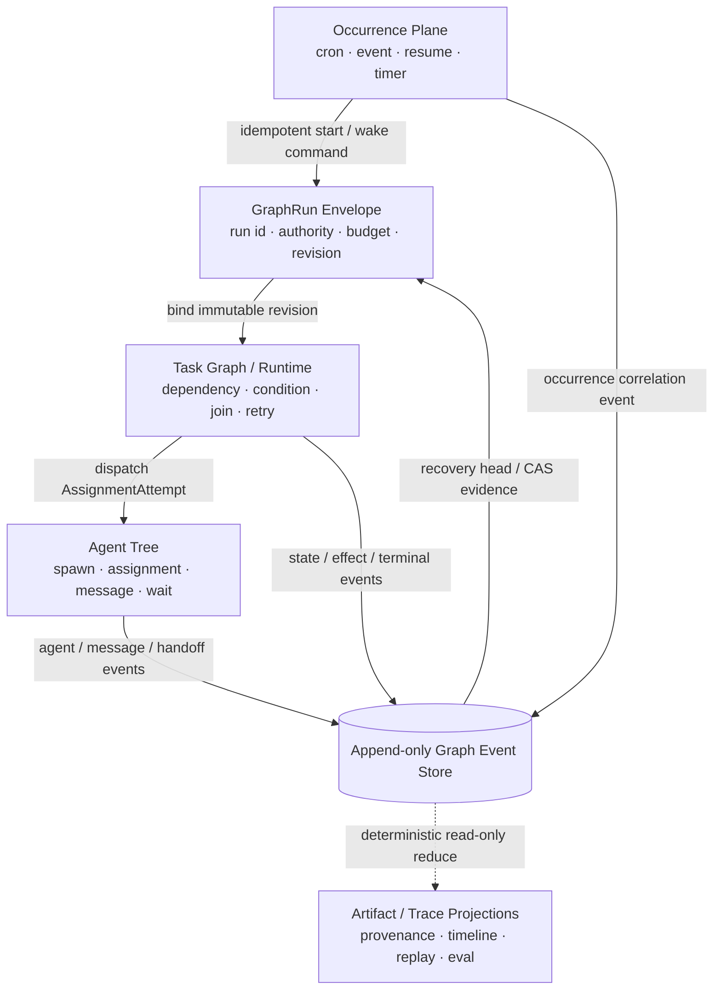

# ChainlessChain 对照 OpenAI Codex 开源架构的差距与优化建议

> 审计日期：2026-08-24  
> 最新进展更新：2026-08-28
> ChainlessChain 基线：`3ec94b795e`  
> 最新 Agent 平台发布验证基线：`40354eb432281c28ed266f2dc6d1458764eb536d`（`v-npm-0-166-0`、`python-agent-sdk-v0.2.0`）
> 最新 Agent Protocol OIDC 发布验证基线：`882c3c9d7f18ee0cc0c766a2b865f8234f7dc4ed`（`agent-protocol-oidc-v0.1.0`）
> 最新 Graph 平台协调发布验证基线：`e6a830f340a8dc3214a56b440ebf495624fc12ff`（`v-npm-0-166-1`、`python-agent-sdk-v0.2.1`、`agent-protocol-oidc-v0.1.1`）
> 最新实时 Team 消息发布验证基线：`f868e142068c33d203601cddd7643fd8ad9c4ffb`（`v-npm-0-166-2`，CLI-only；协议与 SDK 版本不变）
> 最新未发布 Team/Session 消息验证基线：`20b1bb5563239bd3ec2d4653ba6c57bdbb6c0d9a`（CLI-only；CLI CI 已通过；协议与 SDK 内容及版本不变）
> 最新结构化审批正式发布基线：精确提交 `67fdfd25359b7bb6995fed1a89452bcc128daf6d` 已通过协议、CLI、Strict Sandbox、Python SDK、桌面 E2E、通用 CI 与 IDE 权威矩阵，并通过 OIDC 发布 protocol `0.1.2`、TS/Python SDK `0.2.2` 与 CLI `0.166.3`；发布链后继加固提交为 `0830ebea9059bc07d76355ca43c632821ab4faf2`
> 最新 Agent 平台协调发布基线：protocol `0.1.5`、TS/Python SDK `0.2.4` 未发生包字节变化，无需重复发布；CLI `0.166.6` 已在精确提交 `f2a249bf3daf77af32ab84cfe5d567485f08b3e7` 完成 Linux/Windows/macOS CLI CI、CLI Strict Sandbox、OIDC 发布和独立公网制品/provenance 回读，现为生产安装版本；Open VSX `0.37.71` 已公开。JetBrains `0.4.102` 已通过六宿主矩阵并上传 Marketplace，但公开 API 仍为 `0.4.100`，当前只剩外部人工审核，不阻塞继续攻破其他任务
> Codex 源码参考基线：`479c8c8924eaafdeb56e86154cd19ff0805839e4`（2026-08-23）  
> 本机 Codex CLI：`codex-cli 0.149.0`

## 1. 结论先行

ChainlessChain 当前最不缺的是 Agent 功能。CLI、桌面端、IDE、TS/Python SDK、MCP、Skills、Hooks、Worktree、多代理、会话恢复、上下文压缩、沙箱、审批、OTLP 和 Eval 都已有实现。

截至 2026-08-25，初始 Agent 平台与协议首发证据仍分别固定在 `40354eb432281c28ed266f2dc6d1458764eb536d` 和 `882c3c9d7f18ee0cc0c766a2b865f8234f7dc4ed`。在此之后，Graph compensation、bounded loop、digest-pinned subgraph、typed subgraph I/O、durable budget slicing、iteration-scoped effect/receipt/compensation 及内置 v0→v1 migration/rollback corpus 已协调发布：精确提交 `e6a830f340a8dc3214a56b440ebf495624fc12ff` 通过同一 SHA 的 Linux/Windows/macOS CLI、strict sandbox、协议与 Python 矩阵，并公开发布 `chainlesschain@0.166.1`、`@chainlesschain/agent-sdk@0.2.1`、`chainlesschain-agent-sdk==0.2.1` 和 `@chainlesschain/agent-protocol@0.1.1`。三个 npm 包均显示 GitHub Trusted Publisher OIDC 身份和 SLSA provenance；全新临时 npm/Python 环境的安装与导入回读通过。

这关闭了 P1-4/P1-8 在 CLI Graph Kernel、协议与生成绑定上的本轮实现/发包边界，但不等于 canonical Graph Kernel 已成为全产品唯一 authoritative runtime。CLI Team/Cowork/Scheduler、Desktop/Browser 的生产 adapter 切换、旧 writer 下线、真实 provider journey、跨进程长时恢复和 30 分钟 overload/fairness soak 仍未完成，因此 P1-12 与 P2-6 继续保持开放。

在已发布的 `0.166.1` 基线之后，`chainlesschain@0.166.2` CLI-only 补丁补上了真实 `cc team --agent` child 的实时 `team_send / team_receive / team_ack / team_followup` 宿主工具、attempt/lease/fence 绑定的私有本地桥、at-least-once 回执与幂等消费、`--state` mutation checkpoint，以及禁止嵌套 subagent 继承父 attempt 通道的隔离。精确提交 `f868e142068c33d203601cddd7643fd8ad9c4ffb` 已通过 Linux/Windows/macOS `CLI CI` 与 `CLI Strict Sandbox`，并由不可变标签 `v-npm-0-166-2` 通过 GitHub OIDC/Trusted Publishing 正式发布；公共 registry、签名 provenance 和不可变制品字节级回读均通过。

此后的未发布 CLI 源码先完成 idle target followup 新 turn、canonical Team message/handoff 投影和有 custody 的 `team_handoff`；最新增量又把使用 `--state` 的生产 `cc team` 消息 authority 从 Team snapshot 内嵌 mailbox 切换为 [`SessionMessageFabric`](../packages/cli/src/lib/session-message-fabric.js) companion state。新 [`TeamSessionMessageAdapter`](../packages/cli/src/lib/agent-team/team-session-message-adapter.js) 保留 Team 的稳定逻辑消息 ID 和广播语义，同时提供跨进程锁内 admission、offline hold/reconnect、at-least-once receive、read/processed/dead-letter、consumer fencing、幂等、跨进程 rate limit、legacy TeamMailbox v3 migration、单 revision 审计快照和锁内 4 MiB Team pending-byte 上限。精确源码提交 `4109134150d380c202a143f53050bccfd6ab87cb` 的三平台 `CLI Strict Sandbox` 已通过，但 `CLI CI` 因 XSESSION v2 的锁定审计基线未同步而在三平台同一测试失败，故没有发布资格；仅修复 contract 的后继提交 `20b1bb5563239bd3ec2d4653ba6c57bdbb6c0d9a` 已通过完整 CLI CI（52 成功、1 条件跳过）。P1-6 仍因真实 provider、长时离线/poison/reorder 正式 soak、分布式 custody 边界、全产品 authoritative adapter/旧 writer 切换未完成而保持开放；本增量没有修改 Agent Protocol 或 TS/Python SDK 包，当前也不创建 CLI 或协议/SDK 版本。

公开结构化审批增量现已完成发版闭环：canonical schema 生成的 JavaScript/TypeScript/Python validator 与同一份合法/非法 fixture 覆盖协议包、TS SDK、Python SDK 和 CLI App Server；两套 SDK 的回调可返回 `acceptOnce / acceptForTurn / acceptForSession / decline / cancel`，请求携带 exact binding 与最小 `requested_permissions`，非法、异常、binding 缺失或不匹配均失败关闭。CLI 只复用精确匹配 tool、args、cwd、policy 的 grant；turn grant 不落盘，session grant 只有在 tamper-evident authority event 持久化成功后才生效，损坏恢复会全部丢弃，持久化失败降级为 `acceptOnce`。旧 boolean 回调和直接 `respondApproval(..., boolean)` 保留 N-1 wire 兼容。最终发布提交 `67fdfd25359b7bb6995fed1a89452bcc128daf6d` 已通过协议、Python SDK、CLI CI、Strict Sandbox、E2E、通用 CI、IDE 与其他精确 SHA 门禁，并通过 OIDC 发布 protocol `0.1.2`、TS/Python SDK `0.2.2` 和 CLI `0.166.3`。首次 IDE Job `97827116999` 是 GitHub hosted runner 失联，attempt 2 同 SHA 重跑后整个工作流成功；WebShell fixture 与 npm/PyPI 发布链的后续修复见第 12 节。

真正值得从 Codex 学习的，不是继续堆功能，而是把这些能力收敛成一套可验证的产品内核：

1. **一个长期稳定的 Agent Server 协议**，统一桌面端、CLI、IDE、SDK 和移动端。
2. **一个 canonical Agent Kernel**，统一 turn loop、上下文、工具、审批、沙箱、会话和遥测。
3. **一个 canonical Graph Kernel**，明确区分动态 Agent Tree、确定性 Task DAG 和事后 Artifact/Trace Graph，并共享同一运行权限、预算与事件账本。
4. **Schema-first + codegen**，不再由 TypeScript、Python、IDE 和 WebSocket 手工镜像协议。
5. **安全边界默认生效且失败关闭**，审批不能替代操作系统级沙箱。
6. **真实轨迹驱动的契约测试和 Eval**，测试真实对象与真实事件，而不只是 mock 和功能清单。

本次扫描同时发现数个应先于架构重构修复的高置信问题：

- 当前 Codex backend 复用了 Claude Code 参数，实际调用协议错误。
- Desktop Coding Agent 的宿主工具和自动记忆归并存在真实对象契约断裂，但测试 mock 掩盖了问题。
- Desktop `$team` 子进程当前只写进度并直接返回成功；与之相对，CLI `cc team` 已经是真实执行器，不能把两者混为一谈。
- 旧 `cc workflow`、Desktop AgentCoordinator/WorkflowEngine 和 Cowork parallel 的部分路径会产生“幻影成功”，或在多个可写 Agent 共享同一 `cwd` 时并发产生不可归属的副作用。
- Desktop Browser Workflow 的取消可能被覆写成 completed/failed，活跃执行只在内存且进程重启后无法 hydrate/resume；在补恢复契约前不能声明 durable。
- CLI 已有较强安全基础，但 Desktop/Cowork 存在通用 IPC、任意路径写入和直接 host spawn 等平行执行面。
- Desktop MCP 在 policy 加载失败、无权限配置和无 consent UI 时存在 allow 路径，stdio server 还会继承完整环境与敏感连接信息。
- ApprovalGate 初始化失败后会退回允许路径；CLI 默认也不强制技术沙箱。

因此，建议总体策略是：**先修真实性和安全性，再统一协议与内核，最后扩展体验。**

## 2. Codex 实际开放了什么

OpenAI 官方当前列出的开放组件包括 Codex CLI、SDK、Security CLI/SDK、App Server、Skills、Plugins 和通用云环境；IDE 扩展与 Codex cloud 均被官方明确列为 **Not open source**。参见 [OpenAI：Open Source](https://learn.chatgpt.com/docs/open-source)。

这意味着最值得直接研究的是开放的 agent harness 和集成边界，而不是照搬产品 UI：

- **App Server**：以 JSON-RPC 风格协议暴露线程、轮次、事件、审批与工具交互，stdio 是默认传输，WebSocket 仍是实验性传输；官方当前也把 `app-server` 命令整体标为实验性且不支持生产工作负载。因此可以借鉴协议形状，但不能把其成熟度当作 ChainlessChain 的生产保证；它还包含初始化握手、恢复、分支和服务端主动审批请求。参见 [Codex App Server](https://learn.chatgpt.com/docs/app-server)。
- **共享 harness**：Codex 的 CLI、App 和 IDE 共享同一 agent loop；产品层拥有界面、上下文选择、工具与操作边界，harness 负责推理循环、沙箱和生命周期。参见 [Codex as a platform](https://learn.chatgpt.com/blog/codex-as-a-platform)。
- **自动化入口分层**：脚本和 CI 使用 `codex exec`，程序化启动/恢复/事件流使用 SDK，完整产品集成使用 App Server。参见 [Codex CLI](https://learn.chatgpt.com/docs/codex/cli) 与 [Codex as a platform](https://learn.chatgpt.com/blog/codex-as-a-platform)。
- **安全双层模型**：sandbox 是技术边界，approval policy 决定何时询问；两者不能互相替代。参见 [Agent approvals & security](https://learn.chatgpt.com/docs/agent-approvals-security) 与 [Sandboxing](https://learn.chatgpt.com/docs/sandboxing)。
- **Skills 产品化**：除了渐进加载，还可通过 Record & Replay 把稳定、重复的 UI 流程录制成可复用 Skill；但 Codex 当前这项能力仅支持 macOS，且要求 Computer Use 可用并启用，不能误写成现成的跨平台能力。参见 [Record & Replay](https://learn.chatgpt.com/docs/extend/record-and-replay)。
- **多智能体不是通用 DAG 引擎**：Responses API 的 hosted Multi-agent 采用 root/subagent 动态树与 `spawn/send/followup/wait/interrupt/list` 六类协作动作，适合可独立、边界清楚的并行工作；官方将固定、确定性执行图列为 “Prefer one agent” 场景。该 hosted 能力当前仍是 beta，`max_concurrent_subagents` 对整棵树全局生效且默认 3，但官方没有固定树深或累计 subagent 数上限；每个 agent 独立 compact，当前也不支持 `/responses/compact`、`reasoning.summary` 或 `max_tool_calls`。这些限制和默认值不能套到本地 Codex Subagents；后者使用 `agents.max_concurrent_threads_per_session`，官方未声明相同默认。若 ChainlessChain 仍需要固定 DAG，应由自身 Task Graph/Application orchestration 承担，并自行实施深度、累计规模、驻留与预算上限。参见 [Responses Multi-agent](https://developers.openai.com/api/docs/guides/responses-multi-agent) 与 [Codex Subagents](https://learn.chatgpt.com/docs/agent-configuration/subagents)。
- **Codex 源码已有两类“图”，但都不是任务 DAG**：[`agent-graph-store`](https://github.com/openai/codex/tree/479c8c8924eaafdeb56e86154cd19ff0805839e4/codex-rs/agent-graph-store/src) 持久化 parent/child spawn 树；[`rollout-trace`](https://github.com/openai/codex/blob/479c8c8924eaafdeb56e86154cd19ff0805839e4/codex-rs/rollout-trace/README.md) 以 append-only 原始事件和离线 reducer 构造事后语义信息流图。它们分别承载持久 spawn 拓扑/生命周期查询与诊断/回放，不提供声明式依赖、join/barrier 或拓扑调度。

## 3. 本项目已经具备、应保留的能力

以下能力不建议推倒重做：

| 能力                 | 现状证据                                                                                                                                                                                                                                                                                                                                                                                                                                                                       | 判断                                                                                                                                    |
| -------------------- | ------------------------------------------------------------------------------------------------------------------------------------------------------------------------------------------------------------------------------------------------------------------------------------------------------------------------------------------------------------------------------------------------------------------------------------------------------------------------------ | --------------------------------------------------------------------------------------------------------------------------------------- |
| CLI 非交互执行       | [`agent.js`](../packages/cli/src/commands/agent.js#L404) 已支持 text/json/stream-json、schema、权限、worktree、sandbox、OTLP 等                                                                                                                                                                                                                                                                                                                                                | 功能面成熟，适合收敛出稳定 `exec` facade                                                                                                |
| 会话恢复与完整性     | [`jsonl-session-store.js`](../packages/cli/src/harness/jsonl-session-store.js#L2) 已有 append-only、hash chain、resume/fork/checkpoint/compact                                                                                                                                                                                                                                                                                                                                 | 应提升为共享逻辑契约，而不是另造存储                                                                                                    |
| TS/Python SDK        | [`protocol.ts`](../packages/agent-sdk/src/protocol.ts#L5) 和 Python SDK 已存在，IDE 还有共用 fixtures                                                                                                                                                                                                                                                                                                                                                                          | 应改为 schema/codegen，不必重写 SDK                                                                                                     |
| Worktree 安全        | [`agent-worktree.js`](../packages/cli/src/lib/agent-worktree.js#L66) 已有 repo/path/base SHA 与 fail-closed 清理检查                                                                                                                                                                                                                                                                                                                                                           | 应进入统一 Agent Kernel                                                                                                                 |
| Skills 渐进披露      | CLI [`skill-loader.js`](../packages/cli/src/lib/skill-loader.js#L893) 和 Desktop 四层 skill loader 已支持 metadata-first                                                                                                                                                                                                                                                                                                                                                       | 应补激活契约与代码型 Skill 隔离                                                                                                         |
| MCP 安全能力         | CLI 已有一次性 capability、workspace fingerprint 和 host-owned sandbox floor                                                                                                                                                                                                                                                                                                                                                                                                   | 应扩散到 Desktop/Cowork 并消除绕行路径                                                                                                  |
| 进程安全基础         | CLI [`ProcessExecutionBroker`](../packages/cli/src/lib/process-execution-broker/index.js#L979) 已过滤凭据，并能校验真实 sandbox boundary                                                                                                                                                                                                                                                                                                                                       | 应成为全产品唯一进程执行入口                                                                                                            |
| CLI Scheduler Kernel | [`contract.js`](../packages/cli/src/lib/scheduler-kernel/contract.js#L382)、[`store.js`](../packages/cli/src/lib/scheduler-kernel/store.js#L38)、[`runtime.js`](../packages/cli/src/lib/scheduler-kernel/runtime.js#L239) 已有 occurrence 幂等身份、SQLite schema v6、job revision、lease/fencing、retry/dead-letter、authority budget、pause/resume 与未知结果对账；[`service.js`](../packages/cli/src/lib/scheduler-kernel/service.js#L128) 还会串行 tick 并隔离 driver 失败 | 应保留为定时/事件 occurrence 与 admission 层，通过 adapter 触发或恢复 GraphRun；它不是 Task DAG scheduler，不能与 Graph Kernel 重复编排 |
| CLI Cowork 图运行时  | [`cowork-workflow.js`](../packages/cli/src/lib/cowork-workflow.js#L803) 已有 DAG、条件、fan-out、循环、retry/timeout 与无 barrier pipeline；[`dynamic-workflow-runtime.js`](../packages/cli/src/lib/dynamic-workflow-runtime.js#L1499) 已有持久 effect、lineage、暂停和未知结果对账                                                                                                                                                                                            | 应作为动态流程与副作用恢复内核，不应被旧 workflow shell 取代                                                                            |
| CLI Agent Team       | [`team-runner.js`](../packages/cli/src/lib/agent-team/team-runner.js#L1136)、[`task-lease.js`](../packages/cli/src/lib/agent-team/task-lease.js#L287) 与 [`team-worktree.js`](../packages/cli/src/lib/agent-team/team-worktree.js#L1644) 已有真实 Agent、DAG、lease/fencing、预算、worktree、合并和崩溃恢复                                                                                                                                                                    | 应作为任务调度、写隔离与最终化内核，不应误判为模拟器                                                                                    |
| 审计与遥测           | 已有 OTLP、Ed25519/Merkle 审计和 Eval                                                                                                                                                                                                                                                                                                                                                                                                                                          | 应统一事件语义并形成质量闭环                                                                                                            |
| 产品差异化           | 多模型/本地模型、离线优先、Personal Data Hub、P2P/联邦、移动端                                                                                                                                                                                                                                                                                                                                                                                                                 | 这是相对 Codex 的护城河，不应被 OpenAI-only 架构替换                                                                                    |

项目的方向不是“补一个 Codex 克隆”，而是让现有广度建立在更少、更硬的核心契约上。

## 4. 优先级总览

| 优先级 | 建议                                                                           |   投入 | 主要收益                             |
| ------ | ------------------------------------------------------------------------------ | -----: | ------------------------------------ |
| P0     | 修正 Codex backend 的命令和事件协议                                            |     小 | 立即恢复真实可用性                   |
| P0     | 修复 Desktop 真实对象契约，增加非 mock 集成测试                                | 小到中 | 消除“单测绿、生产断”的问题           |
| P0     | 收口 Desktop/Cowork 的 IPC、文件、进程、MCP 与审批入口                         | 中到大 | 消除高危旁路，统一安全保证           |
| P0     | 将 Desktop `$team` 从进度模拟器接入真实内核，并清除其他 Graph shell 的幻影成功 | 中到大 | 让多代理与工作流能力名实相符         |
| P0     | 修复取消/超时后的迟到副作用，并隔离并行可写 Agent 的 workspace                 | 中到大 | 防止隐藏执行、重复写入和不可归属变更 |
| P1     | 建立 CC App Server 与 Thread/Turn/Item 统一模型                                |     大 | 统一多端产品集成边界                 |
| P1     | 建立单一协议 Schema 和多语言 codegen                                           |     中 | 消除 SDK/IDE/WS 漂移                 |
| P1     | 收敛 canonical Graph Kernel、typed Graph IR 与 artifact/handoff 契约           |     大 | 统一调度、协作、恢复和证据语义       |
| P1     | 统一 rollout、上下文压缩、记忆与结构化审批                                     |     大 | 提升恢复、长任务和安全一致性         |
| P1     | 有界队列、背压与模块边界治理                                                   |     中 | 提升长期可维护性和高负载可靠性       |
| P2     | 稳定 `cc exec`、轨迹 Eval、Record & Replay、可选 Codex adapter                 |     中 | 改善自动化、体验和生态兼容           |

### 4.1 P0：真实性、安全边界与终态正确性

以下编号可直接用于 Issue、分支、PR 和验收矩阵；`S/M/L/XL` 仅表示相对投入，不替代实际排期。“已有基础”不代表任务已完成，只有验收标准全部满足后才能关闭。

| 编号 | 任务                                | 真实差距                                                                                                                                                      | 验收标准                                                                                                                                                                                                                                        | 外部条件                                      | 建议        |
| ---- | ----------------------------------- | ------------------------------------------------------------------------------------------------------------------------------------------------------------- | ----------------------------------------------------------------------------------------------------------------------------------------------------------------------------------------------------------------------------------------------- | --------------------------------------------- | ----------- |
| P0-1 | 修正 Codex external-agent adapter   | Codex 与 Claude 共用 Claude 参数和事件 parser，`-p` 被错误当作 prompt，Codex JSONL 也未按真实协议解析                                                         | 独立 `CodexAdapter` 使用 `codex exec --json`；argv、版本能力和脱敏 JSONL fixture contract test 在 Linux/Windows/macOS 通过；失败、取消和未知事件有稳定 exit/error mapping                                                                       | 核心无；真实账号只用于可选 smoke              | 本期，S     |
| P0-2 | 修复 Desktop 真实对象契约           | `callTool/call`、`TraceStore.add/record` 和 `MemoryConsolidator` 构造/调用签名不一致，mock 掩盖生产断裂                                                       | 使用真实 `FunctionCaller/TraceStore/MemoryConsolidator/MCP adapter` 的组件测试覆盖 plan → approval → tool → observation 与 close → trace → consolidate → memory；删除生产不存在的方法 mock                                                      | 无                                            | 本期，S～M  |
| P0-3 | 清除模拟执行和 Graph shell 幻影成功 | Desktop `$team`、旧 workflow、Desktop AgentCoordinator/WorkflowEngine 及部分 Cowork parallel 路径会把 pending、progress 或未检查的 Agent 结果映射为 completed | 所有执行面声明 `simulated/real/durable/isolated` runtime claims；未接入真实内核的入口必须 feature-gate、降级为 designer/simulator 并只能返回 planned/simulated；terminal success 必须绑定 output schema、artifact digest、commit 和测试 receipt | 核心无；真实内核迁移归 P1-3/P1-12             | 本期，M     |
| P0-4 | 修复 Graph 终态与依赖传播           | loop 达到 cap 仍可能 completed；不同引擎对 failed/skipped/upstream failure 的传播互相矛盾；Browser Workflow 的 cancel 还可能被覆写为 completed/failed         | loop cap 未满足条件时进入 `EXHAUSTED/TIMED_OUT` 且不解锁 success edge；cancel 只落 `CANCELLED`；后继稳定落入 `BLOCKED/SKIPPED/UPSTREAM_FAILED/CANCELLED`；run-level terminal algebra 和根因 cut 有单元、属性和恢复测试                          | 无                                            | 本期，S～M  |
| P0-5 | 取消、超时与并行写隔离              | Desktop AgentOrchestrator、Browser Workflow 及 legacy/non-admitted 路径会在调用方返回后留下在途执行；多个可写 Agent 共用 `cwd`，loser 副作用不会撤销或归属    | stop-on-error 不再 dispatch；cancel/timeout 级联 abort descendants、等待物理 settlement，并以 attempt/lease fence 拒绝迟到结果；每个可写 attempt 使用独立 worktree 或经证明不相交的 write scope，只合并 accepted winner                         | 核心无；真实 Git/进程树三平台矩阵需 CI        | 本期，M～L  |
| P0-6 | 关闭 Desktop/Cowork 已知执行旁路    | generic IPC、任意路径写、直接 host spawn、raw MCP/网络工具，以及 Desktop MCP 的 `bypassPolicy`、策略加载失败即 allow 和默认 permissive 权限形成绕过面         | renderer 只能调用固定 allowlist API；路径 realpath 后受 workspace/capability 约束；已知 direct spawn/raw MCP/network/bypass 关闭或先接入现有 Broker；策略缺失/空权限默认拒绝；负向测试覆盖 renderer/Skill/MCP/依赖被攻破场景                    | 核心无；全产品唯一 Broker 迁移归 P1-3/P1-11   | 本期，M～L  |
| P0-7 | 沙箱、审批与审计 fail closed        | ApprovalGate 初始化异常可退回允许；CLI 默认可不启用技术沙箱；Desktop MCP 无主窗口时高风险连接 consent 自动允许，部分审计写入失败被忽略                        | sandbox guarantee 与 approval policy 独立且默认生效；无 UI 或 sandbox/approval/audit/ToolBroker 不可用时高危动作稳定拒绝；审批绑定 operation+args+cwd+workspace+policy digest，过期、重放或参数变化必须重新审批                                 | Linux/macOS/Windows 各需真实 enforcement cell | 本期核心，M |
| P0-8 | 秘密、数据密钥与持久审计迁移        | 私钥/bearer token 可能进入普通数据库；IPFS 数据密钥与密文同库；Desktop stdio MCP 直接继承完整 `process.env` 并注入数据库/GitHub token；高危审计可能只留内存   | 数据库只保存 SecretStore/key reference 或 wrapped DEK；子进程使用最小 allowlist env 和按调用注入的短期 credential；迁移后旧明文被安全清理并可回滚；审计持久、完整、脱敏且无法静默丢失，包含 actor/session/authorization/policy/sandbox/result   | 生产 KMS/HSM 可后移，本地 SecretStore 核心无  | 本期，M     |

#### 4.1.1 P0 实施状态（2026-08-24）

本轮已完成 4.1 中 P0-1～P0-8 的代码修复与契约验证。P0-1～P0-5 提交为 `a14f1c7308`；P0-6～P0-8、安全证据刷新与工作流契约收口分别提交为 `d31757dd45`、`6a6ddd19d6`、`d63322b5e9`。CLI 发布候选为精确提交 `f370514d5518a0dd52906b99c661cceea63f41d5`，已经通过同一 SHA 的 Linux/Windows/macOS 权威矩阵并发布为 `chainlesschain@0.165.9`。这里保留的是 P0 版本的历史发布证据；后续 P1/P2 实现已经另以精确提交 `40354eb432281c28ed266f2dc6d1458764eb536d` 完成独立矩阵、正式发布和公网回读，证据见 4.3.2 与 11.1。仍未通过真实 provider 旅程或产品切换验证的任务继续保持开放，不借用基础发布矩阵冒充路线图全部验收。

发布验收证据：

- [CLI CI（成功）](https://github.com/chainlesschain/chainlesschain/actions/runs/32687406177)：52 个 job 成功，1 个条件式 dry-run job 按设计跳过；包含 Linux、Windows、macOS 分片与三平台 `verify-cli`。
- [CLI Strict Sandbox（成功）](https://github.com/chainlesschain/chainlesschain/actions/runs/32687406040)：Linux、Windows、macOS 三个平台的 strict native boundary 全部通过。
- [npm 正式发布（成功）](https://github.com/chainlesschain/chainlesschain/actions/runs/32689298604)：immutable tag/exact-SHA gate、完整复测、打包校验、provenance publish 与注册表回读全部通过。
- npm 公共包：`chainlesschain@0.165.9`，`latest=0.165.9`，tarball 为 `https://registry.npmjs.org/chainlesschain/-/chainlesschain-0.165.9.tgz`，integrity 为 `sha512-tMKa41cjmF618GvdxsRKIJXW68I3Hp7R13cDKtmlxA+u3LhmI3eBK4KRf+7qLDdWNzWyqYNkw4yC1y4+LdYJmA==`。

| 编号 | 实施状态 | 已落地证据                                                                                                                                                                                                       | 外部验收与范围边界                                                          |
| ---- | -------- | ---------------------------------------------------------------------------------------------------------------------------------------------------------------------------------------------------------------- | --------------------------------------------------------------------------- |
| P0-1 | 已完成   | 独立 Codex `exec --json` adapter、真实 argv/JSONL fixtures、未知事件/取消/超时/非零退出映射                                                                                                                      | 精确 SHA 的三平台 CLI CI 与 `verify-cli` 已通过                             |
| P0-2 | 已完成   | 真实 `FunctionCaller/TraceStore/MemoryConsolidator/MCP adapter` 集成链路，不再依赖生产中不存在的方法 mock                                                                                                        | 精确 SHA 的完整 CLI 发布复测已通过                                          |
| P0-3 | 已完成   | 执行面 runtime claims；未接真实内核的入口降级为 planned/simulated；terminal success 要求证据                                                                                                                     | CLI 发布门禁已通过；唯一 authoritative kernel 的切换仍属于 P1-3/P1-12       |
| P0-4 | 已完成   | loop cap、依赖失败传播、blocked-root cut 与 Browser cancel 终态已修正并覆盖回归                                                                                                                                  | CLI 三平台矩阵已通过；全产品 crash/recovery 持续矩阵属于后续发布门禁        |
| P0-5 | 已完成   | stop-on-error、descendant abort、settlement/fence、per-attempt workspace/write-scope 隔离已落地                                                                                                                  | CLI CI 与 Strict Sandbox 的 Linux/Windows/macOS 矩阵已通过                  |
| P0-6 | 已完成   | generic preload IPC 默认关闭；项目路径 realpath/symlink 边界；Coding Agent/Web Shell raw MCP 强制策略；Cowork code runner/HTTP 与 stdio MCP 强制 Broker；HTTP MCP 有域名、DNS/IP 和大小上限                      | CLI 发布验收已通过；全产品唯一 Broker 的长期收敛仍属于 P1-3/P1-11           |
| P0-7 | 已完成   | ApprovalGate 缺失默认拒绝；CLI 默认 workspace-write/network-off；renderer sandbox 与 sender guard 默认强制；无 consent UI、sandbox、Broker 或持久审计时拒绝                                                      | Strict Sandbox 三个平台的真实 native boundary 已通过                        |
| P0-8 | 已完成   | Agent 私钥进入 SecretStore、bearer 仅留 hash；CLI IPFS 保存 keyRef，Desktop IPFS 保存 wrapped DEK；旧明文迁移支持 dry-run/事务失败回滚；MCP/PTY/Skill 使用最小环境；MCP 与桌面进程审计持久、脱敏且写入失败即拒绝 | 发布候选完整复测与 npm provenance 发布已通过；生产 KMS/HSM 仍可按路线图后移 |

### 4.2 P1：统一协议、Agent Kernel 与 Graph Engineering

| 编号  | 任务                                   | 已有基础与剩余工作                                                                                                                                                                                                                                                                                                                                                                        | 前置依赖                   | 建议期次              |
| ----- | -------------------------------------- | ----------------------------------------------------------------------------------------------------------------------------------------------------------------------------------------------------------------------------------------------------------------------------------------------------------------------------------------------------------------------------------------- | -------------------------- | --------------------- |
| P1-1  | 单一协议 Schema 与多语言 codegen       | TS/Python SDK、IDE fixtures 和多套事件 union 已存在；冻结 canonical ID、Thread/Turn/Item、approval、tool、error、Graph event schema，并生成 TS/Python/Kotlin/Swift client、validator 和兼容 fixture                                                                                                                                                                                       | P0-1～P0-5                 | 第 3～6 周，M         |
| P1-2  | CC App Server                          | CLI/桌面/IDE 已各有会话和事件入口；为 CC 自身实现 initialize 握手、thread start/resume/fork、turn start/interrupt、item delta/completed、server request、backpressure、幂等和 capability negotiation；stdio 先作为项目基线，WebSocket 明确实验级                                                                                                                                          | P1-1 additive schema MVP   | 第 3～6 周，L         |
| P1-3  | canonical Agent Kernel 与 rollout      | CLI agent、JSONL hash chain、Desktop Coding Agent、context/compaction/memory 已有较多实现；统一 turn loop、ToolBroker、approval、sandbox、context projection、checkpoint/compact/resume/fork 与 terminal evidence；把 Desktop `$team` 接入真实内核，并把旧运行时及执行入口改成 adapter                                                                                                    | P0-2、P0-6、P1-1           | 第 3～10 周，L～XL    |
| P1-4  | versioned typed Graph IR 与 Compiler   | Cowork 已有 DAG、condition、fan-out、leaf loop；Browser Workflow 已有 nested region/sub-workflow；补 `TriggerBinding/Region/LoopRegion/SubgraphCall/IterationFrame`、typed port、edge policy、definition/revision digest、N/N-1 migration，并在任何 effect 前完成引用、环、预算和 workspace 检查                                                                                          | P0-4、P1-1                 | 第 3～10 周，L        |
| P1-5  | AssignmentAttempt、任务调度与触发边界  | Scheduler Kernel 已有 occurrence 幂等、lease/fence、retry/dead-letter/authority；TeamRunner/TaskLeaseRegistry 已有 ready frontier、priority、scope lock、worktree。明确前者只产出 start/resume/timer trigger，后者调度 Task/AssignmentAttempt；补 N:M assignment、capacity/residency、priority donation、fairness 与 accepted-attempt finalization                                        | P0-5、P1-4                 | 第 7～10 周，L        |
| P1-6  | 实时消息与有 custody 的 Handoff        | TeamMailbox 和 SessionMessageFabric 已有 durable sequence、TTL、backpressure 和基础 receipt；把 child 的 send/receive/ack/followup 接入生产 adapter，区分 read/processed，补 causation、去重/dead-letter，并实现 offer/accept/commit/revoke/expire 的 handoff/lease 转移                                                                                                                  | P1-1、P1-3、P1-5           | 第 7～10 周，L        |
| P1-7  | 触发关联、动态扩图与 termination       | Scheduler Kernel 与 DistributedQueue 分别已有 occurrence identity/lease/fence 和 lock 内 append/revision/digest/finalization fence；补 occurrence↔GraphRun 幂等关联、expected-revision/request-id/origin lease、预算再准入、`OPEN/SEALED + producer lease`、稳定 quiescence、runtime wait-for graph 与 deadlock/livelock predicate                                                        | P1-4、P1-5、P1-6           | 第 7～10 周，L        |
| P1-8  | Effect、Artifact 与 Trace Graph        | DynamicWorkflowRuntime 已有 durable effect/receipt/reconcile，Team 有 checkpoint/merge，项目已有 OTel/JSONL/ArtifactStore；统一 idempotency/unknown outcome/compensation、transactional outbox/inbox 或等价 dispatch journal、artifact provenance、recipient-visible evidence、append-only raw event 与 deterministic reducer                                                             | P0-4、P0-5、P1-3～P1-7     | 第 7～12 周，L        |
| P1-9  | durable HumanTask 与统一策略事件       | 已有 approval、Hooks、MCP capability 和人工对账原型；定义可认领、可恢复、精确绑定 revision/attempt/operation digest 的 HumanTask/Decision，等待时释放 Agent slot，统一 approval-vs-cancel CAS、多人 quorum、separation-of-duties 与 hook/tool policy event                                                                                                                                | P0-7、P1-1、P1-3、P1-7     | 第 7～10 周，M～L     |
| P1-10 | 有界队列、模块边界与增量 conformance   | 多个超大模块和事件队列已有局部 limit；把 transport/event/message/tool backlog 全部有界化，拆 ports/adapters/state machines；从 P1-1 MVP 起，每个接口合入必须同时提交 fixture，最终再形成 CLI/Desktop/IDE、旧 adapter/新 kernel、crash/recovery 与 migration matrix                                                                                                                        | P1-1 schema/harness MVP    | 持续实施，第 3～12 周 |
| P1-11 | Skill 供应链、数据来源与选择性网络出口 | 已有 AgentAuthority、ContextSourceLedger、MCP effect provenance、Plugin VM、SecretStore、ProcessExecutionBroker 和 Merkle audit；补 Skill containment/签名/capability manifest、Graph 数据的 origin/trust/sensitivity/allowedSinks 与 declassification；webhook 验签/鉴权/body cap；统一 egress broker 覆盖 MCP transport 的 DNS/IP/redirect 重检、超时及 request/response/SSE frame 上限 | P0-6、P0-7、P0-8           | 第 3～10 周，L        |
| P1-12 | Graph Kernel 集成、双写验证与迁移切换  | P1-4～P1-9 分别建设 IR、调度、协作、动态图、effect 与 HumanTask，但还缺唯一 authoritative runtime 的切换任务；将 CLI Team、Cowork、Scheduler Kernel 与 Desktop/Browser 作为 adapter 接入；Browser 未具备 checkpoint/hydration 前标为 non-durable；完成 shadow-run/diff、统一投影、feature flag、回滚和旧 shell 下线                                                                       | P1-4～P1-9；P1-10 增量门禁 | 第 9～12 周，L        |

#### 4.2.1 P1 实施与发布状态（2026-08-24）

本次把可以在仓库内闭环的协议、内核和契约实现落到代码与确定性测试，并随 Agent 平台精确提交完成三操作系统 CLI/sandbox 发布矩阵和 SDK 发布。需要真实产品切换、长时间 soak、真实 provider 或跨产品 conformance 的项目继续保持“待外部验收”，不能因为基础包已经发布而关闭。

| 编号  | 实施/发布状态                               | 本次落地                                                                                                                                                                                                                                                                                                                                                                                               | 尚未关闭的验收边界                                                                                                                                                            |
| ----- | ------------------------------------------- | ------------------------------------------------------------------------------------------------------------------------------------------------------------------------------------------------------------------------------------------------------------------------------------------------------------------------------------------------------------------------------------------------------ | ----------------------------------------------------------------------------------------------------------------------------------------------------------------------------- |
| P1-1  | 已完成并发布                                | canonical JSON Schema；37-event payload union；TS/Python/Kotlin/Swift 确定性 codegen/validator；Android/iOS/Desktop/CLI/VS Code/JetBrains 生产消费与 causal conformance；protocol `0.1.5`、TS/Python SDK `0.2.4`、CLI `0.166.6` 与 VS Code `0.37.71` 已公开，JetBrains `0.4.102` 已上传待人工审核                                                                                                      | 仓库实现、精确候选矩阵与应有发布边界均已关闭；JetBrains Marketplace 公开可见性为外部人工审核状态，不阻塞后续任务                                                              |
| P1-2  | 已完成并发布                                | stdio JSON-RPC、固定 capability Desktop/VS Code pilot、强鉴权/TLS/有界输入输出的实验 WebSocket、过载重试与慢消费者断路均已落地；精确候选矩阵、1,800 秒正式 overload/RSS soak 及 CLI/SDK/IDE 发布和公网回读已成功                                                                                                                                                                                       | —；WebSocket 仍按声明保持 experimental，后续新增 transport 能力必须继续遵守版本化 capability 与有界队列契约                                                                   |
| P1-3  | 🟡 仓库接线 89%～95%                        | App Server 复用真实 CLI agent loop；固定 Graph capability、Desktop `$team`/Specialized Agents/WorkflowManager canonical+shadow adapter、Cowork/Scheduler result receipt、authority generation/lease/head CAS、旧 Desktop writer read-only；CLI Team local/distributed authority、默认 renderer fixed IPC、durable run binding、无输入恢复、应用重启 hydration 与固定审计对账已落地 | 真实 DB/打包 Electron process-kill E2E、逐 store migration/canary/rollback、跨机器 custody/长时恢复及同 SHA 三平台矩阵；详见 §6.9.6.7.5～§6.9.6.7.10 |
| P1-4  | CLI/协议/SDK 结构化控制流增量已发布         | typed/versioned Graph IR、digest、effect-before-compile；多节点 bounded loop；digest-pinned 父子 GraphRun；typed input/output mapping；durable 子图预算预留/实际结算；iteration-scoped effect/receipt/compensation；内置 v0→v1 upcaster、冻结 N/N-1 corpus、备份摘要与回滚恢复                                                                                                                         | CLI Graph Kernel 本轮语义已闭环；CLI Team/Cowork/Scheduler 与 Desktop/Browser 的生产 adapter 切换、shadow equivalence、旧 writer 下线及真实运行中 definition 迁移演练尚未完成 |
| P1-5  | 核心随 CLI 已发布                           | N:M AssignmentAttempt、agent capacity、lease/fence、accepted attempt、优先级 donation/aging/critical boost、预算和 artifact/write provenance                                                                                                                                                                                                                                                           | CLI Team/Cowork 生产 adapter 切换与 3 倍 SLO fairness soak 尚未完成                                                                                                           |
| P1-6  | custody/Session 消息增量已随 CLI 发布       | `0.166.3` 已公开真实 child 消息工具、idle followup 新 turn、canonical message/handoff 投影、完整 custody 状态机，以及 state-backed `cc team` 的 SessionMessageFabric adapter、legacy v3 migration、跨进程 rate limit/offline recovery、processed-before-ACK、poison dead-letter 和锁内总字节背压                                                                                                       | 真实 provider、长时离线/poison/reorder 正式 soak、分布式 custody、全产品 authoritative adapter/旧 writer 切换仍未完成，故 P1-6 仍不关闭                                       |
| P1-7  | 核心随 CLI 已发布                           | occurrence↔GraphRun dispatch journal、动态 revision CAS/request id、producer lease/seal、稳定 quiescence、wait-for deadlock/livelock 与 crash-after-commit 恢复                                                                                                                                                                                                                                        | Scheduler/Cowork 的生产双写与跨进程竞争 soak 尚未完成                                                                                                                         |
| P1-8  | 逐 effect/iteration 补偿与 Trace 增量已发布 | durable Effect/receipt/unknown-outcome/reconcile、取消 fencing、artifact provenance、append-only event、确定性 trace reducer/time travel/diff；可恢复逆依赖补偿、五类 durable cut-point fault injection，以及逐 iteration source/compensation receipt lineage                                                                                                                                          | CLI Graph Kernel 的核心切点与三平台 CI 已闭环；全产品/跨进程 outbox-inbox 切点、长时恢复矩阵尚未完成                                                                          |
| P1-9  | 公开结构化审批增量已发布                    | 可认领/恢复 HumanTask、quorum/职责分离与 cancel/decision CAS；canonical ApprovalDecision、binding/requested permissions、N-1 boolean 兼容已公开到 TS/Python SDK 与 App Server；CLI 已实现 exact turn/session grant；VS Code、JetBrains、Android PDH 与 Desktop 二元审批 UI 已改为最小权限结构化决定并保留 binding                                                                                      | 可审阅的 turn/session grant UI、统一 hook/tool policy event，以及跨产品 approval-vs-cancel/quorum/race/restart conformance 尚未完成                                           |
| P1-10 | 部分随版本发布                              | App Server stdio/WebSocket/SDK、Agent IPC、Desktop Cowork AgentPool、MCP consent、可选 metrics monitor 与 MCP HTTP/stdio SDK 已有队列、帧、输入行、并发、缓存、retention、连接或 admission 上限；生产 MCP stdio 已清除未引用的 direct-spawn 旧旁路并由静态边界测试锁定 Broker 默认路径；接入结构化 `OVERLOADED`、慢消费者断路及 deadline；30 分钟 RSS/过载门、CLI `0.166.6` 回读及相关三平台测试已完成 | 继续普查并有界化或删除其余旧 transport/event/message/tool backlog，拆分剩余超大模块的 ports/adapters/state machines，并扩展 crash/recovery/migration conformance matrix       |
| P1-11 | 部分随 CLI 发布                             | Graph 数据来源/信任/敏感度/allowedSinks 传播与审计 declassification；orchestrate webhook 增加 HMAC、时间窗、delivery replay、body/rate cap，并保留可信 origin；MCP consent 缓存键只保留稳定摘要、不再保留原始参数                                                                                                                                                                                      | Skill 签名/containment、所有 webhook vendor 原生签名和全产品统一 egress broker 迁移尚未完成                                                                                   |
| P1-12 | 仅门禁发布就绪                              | CLI Team/Cowork/Scheduler/Desktop/Browser 的 machine-readable claims、单一 writer 约束、shadow equivalence、terminal-evidence/cutover gate；Browser 明确 non-durable                                                                                                                                                                                                                                   | 未执行 authoritative 切换、回滚演练或旧 writer 下线；因此不得将 P1-12 标为完成                                                                                                |

#### 4.2.2 发布后 Graph compensation 与恢复增量（2026-08-24）

- [`compiler.js`](../packages/cli/src/lib/graph-kernel/compiler.js) 将 `compensationNodeId` 与 compensation edge 编译为不可变索引；拒绝未知/冲突/复用/递归 handler、非 effectful source/target 以及进入正向依赖图的 handler。补偿节点不进入 forward topological order，也不参与正向并行写冲突判定。
- [`runtime.js`](../packages/cli/src/lib/graph-kernel/runtime.js) 将补偿节点初始标记为 `skipped`，只允许对 `failed/partial/cancelled` 且 attempt/effect 已结算的 run 显式启动补偿。执行顺序为正向成功节点的逆拓扑序；每步必须提交补偿 effect receipt，原 effect 随后转为 `compensated` 并记录 `compensationEffectId`；失败或 unknown outcome 转入人工对账。
- [`graph-kernel-fault-injection.test.js`](../packages/cli/__tests__/unit/graph-kernel-fault-injection.test.js) 模拟 durable append 成功后调用方尚未观察结果即崩溃，覆盖 dispatch/lease、state transition、message admission、effect receipt 与 processed/ACK；恢复以已落盘事件为准，验证不重复派发、消息/effect 幂等和 processed receipt 重放。
- [`trace-reducer.js`](../packages/cli/src/lib/graph-kernel/trace-reducer.js) 暴露补偿计划、handler/source lineage 与 compensation edge，并把 handler 从正向 critical path 排除，避免回滚耗时污染正向调度指标。
- 本地定向验证：`graph-kernel-compiler/runtime/fault-injection/observability/adapters` 共 5 个文件、48 项测试通过；本轮修改的 Graph JS 源码与测试 ESLint 通过。精确代码提交 `161d68167a712cb90d59a556428f54e4284d70a5` 的 [CLI CI（成功）](https://github.com/chainlesschain/chainlesschain/actions/runs/32724518661)完成 52 个成功 job（另 1 个按条件跳过），[CLI Strict Sandbox（成功）](https://github.com/chainlesschain/chainlesschain/actions/runs/32724518471)完成 Linux/Windows/macOS 3/3 native boundary；本轮不沿用 `40354eb432...` 的旧结果。

#### 4.2.3 发布后 bounded loop 与 subgraph 执行增量（2026-08-24）

- [`compiler.js`](../packages/cli/src/lib/graph-kernel/compiler.js) 生成不可变 `loops/loopByNode/loopByExitNode` 索引，并在 effect 前拒绝跨 entry/exit 泄漏、不可达 loop 节点、loop 内 subgraph，以及尚无 iteration-scoped receipt/compensation 语义的 effectful loop；`kind=subgraph` 与 pinned `SubgraphCall` 必须一一对应。
- [`runtime.js`](../packages/cli/src/lib/graph-kernel/runtime.js) 将每轮 loop 保存为 durable `IterationFrame`；AssignmentAttempt 携带 `(nodeId, iterationPath, attempt)` 且 ID 由该元组确定生成。整轮成功后停在 `waiting_condition`，只有带 SHA-256 condition evidence 和稳定 request ID 的显式 decision 才能进入下一轮或解锁 exit；条件在 cap 处仍要求继续时，frame/loop 进入 `exhausted`、exit 落 `budget_exhausted`，success edge 不会解锁。
- subgraph 不再作为普通 task 派发；`startSubgraph()` 校验 definition/revision digest、父 definition path 与 `maxDepth`，再以确定性 child run ID 建立可恢复父子 GraphRun。`settleSubgraph()` 只接受真实 child terminal state；父取消会级联 child。父 binding 已落盘但 child 尚未创建的 cut point 可在恢复后安全续建。
- [`trace-reducer.js`](../packages/cli/src/lib/graph-kernel/trace-reducer.js) 新增 `iterationGraph` 与 `subgraphGraph`，保留 frame、attempt iteration path、child revision/status；重复迭代耗时按执行 attempt 累计，补偿 handler 仍不污染正向 critical path。
- 本地确定性回归新增 [`graph-kernel-structured-control.test.js`](../packages/cli/__tests__/unit/graph-kernel-structured-control.test.js)，并扩展 fault injection：覆盖两轮多节点 loop、cap、并行 branch failure、decision-point 重启、digest/depth/recursion、child 重启续建、subgraph settle/取消级联和 trace replay。当前本地 Graph 定向集 6 个文件、57 项通过，修改文件 ESLint 无错误；CLI 全量本地 `npm test` 在 5 分钟内没有产生用例摘要，已主动停止且不计为通过。精确代码提交 `4ea9831bf76982b9566070458987e86011a74192` 的 [CLI CI（成功）](https://github.com/chainlesschain/chainlesschain/actions/runs/32730022085) 与 [CLI Strict Sandbox（成功）](https://github.com/chainlesschain/chainlesschain/actions/runs/32730021938) 已在 Linux/Windows/macOS 通过；该增量仍未进入新的 CLI 标签/包版本。

#### 4.2.4 typed subgraph budget、effectful loop 与 N/N-1 migration 收口（2026-08-25）

- 协议为 `SubgraphCall` 增加 parent↔child typed port binding 和 budget slice，为 `Effect` 增加 base idempotency key 与 iteration path；TypeScript、Python、Kotlin、Swift 绑定及 CLI 内嵌 schema 均由同一 schema 重生。Compiler 在 effect 前拒绝未知/重复/缺失映射、类型不兼容、必填 child input 未绑定及子图预算不足。
- Runtime 在 `subgraph.starting` 时持久预留预算，阻止并行子图 oversubscription；child 使用独立 slice，完成/取消/恢复时只结算实际使用并释放余量。`subgraph.starting` 落盘后崩溃恢复不会重复预留。
- effectful loop 仅在存在隔离补偿 handler 时允许编译；每个 iteration 派生稳定 SHA-256 idempotency key，effect/receipt 绑定 iteration lineage。补偿计划按逆拓扑和逆 iteration 顺序逐 effect 执行，预算耗尽后仍可进入补偿，恢复不会串错 source/compensation receipt。
- GraphDefinition 内置 v0→v1 upcaster，并冻结 minimal/typed 两组 N/N-1 输入/期望输出；migration dry-run 返回不可变原始备份和 domain-separated rollback digest，restore 会拒绝版本错误或被篡改备份。对应提交为 `a20fefcf784dc38b53e46186f3ec77e74dc93e08` 与 `742c638dc5`，最终随协调发布提交 `e6a830f340a8dc3214a56b440ebf495624fc12ff` 出货。
- 本地 Graph 定向集 6 个文件、60 项通过，协议 5 项、TS SDK 53 项（含真实 `cc agent` E2E）、Python SDK 23 项通过，相关 ESLint/codegen/package dry-run 均通过。精确发布 SHA 的远端与发布证据见 4.3.4。

#### 4.2.5 Team canonical message/custody handoff 增量（2026-08-25）

- [`team-graph-projection.js`](../packages/cli/src/lib/agent-team/team-graph-projection.js) 将 TeamMailbox v3 的消息、receipt 与 TaskLeaseRegistry 的 custody 历史确定性投影为 canonical protocol `Message`/`Handoff` 和 Graph edges；广播按接收方展开，只有 read/processed 形成 model-visible edge，并以 revision/authority/source/projection digest 绑定恢复身份。投影不回写 mailbox/registry，snapshot 恢复后保持字节级等价。
- [`task-lease.js`](../packages/cli/src/lib/agent-team/task-lease.js) 实现 `OFFERED → ACCEPTED | REJECTED → COMMITTED | REVOKED | EXPIRED` 状态机。commit 在同一 optimistic task write 中撤销 source lease、建立 target AssignmentAttempt/lease/fencing token 并写入 durable dispatch journal；source 的迟到 complete/fail/heartbeat/reacquire 会被旧 fence 拒绝，未启动 transfer 不会被普通 claim/reconcile 抢走，已启动后崩溃继续走既有 retry/adjudication。
- [`team-message-tools.js`](../packages/cli/src/lib/agent-team/team-message-tools.js) 与 [`team-message-bridge.js`](../packages/cli/src/lib/agent-team/team-message-bridge.js) 为真实 child 增加 `team_handoff` 的 offer/accept/reject/commit/revoke/status；model 不能自行选择 sender、lease 或 fence，父进程每次调用都绑定当前 holder/attempt authority。TeamRunner 在 commit 前预留 session/team budget，持久化 `targetStartedAt` 后才允许 target side effect，并复用原 task key、session、权限、预算、scope/worktree 契约。
- TTL expiry 会撤销未完成 offer、把目标通知 dead-letter 并通知 source；commit-before-dispatch 在恢复时刷新 target fence 后只排队一次。跨两个真实 Node 进程的 fixture 在第一进程 commit 后以非零状态退出，第二进程恢复并证明 target 执行一次、旧 source 写入失效、最终 settlement 绑定新 lease。
- 初始实现提交 `b60e80de0bdb8421e6acec619665de753a7c4b81` 的首次 CLI CI 暴露了真实兼容回归：TeamRunner 把 custody registry 方法误当作所有 adapter 的必需接口，导致 `TeamDistributedQueue.asRegistry()` 在普通调度前失败；同一 SHA 的 Strict Windows 首次 attempt 还发生“JSON 记录 2458 项通过、0 失败但 Vitest teardown 退出 1”的 hosted-runner 假红，attempt 2 在不改 SHA 后通过。该提交不具备发布资格，也未借用其部分结果。
- 修复提交 `982b13a41f4697898d453c46b18621d339b60bad` 对 registry capability 做完整检测：原生 TaskLeaseRegistry 保留 custody/handoff，尚未实现该能力的 durable/distributed adapter 继续普通调度并对 handoff 失败关闭。本地 Team 定向 11 个文件、217 项，distributed queue/agent/CLI 4 个文件、115 项，以及 production soak 8 项通过、1 项条件跳过；修改文件 ESLint、Prettier、`node --check` 与 `git diff --check` 通过。CLI 全量本地 Vitest 在约 5 分钟内仍无总摘要后主动停止，不计为通过。
- [CLI CI（成功）](https://github.com/chainlesschain/chainlesschain/actions/runs/32805253333)：精确绑定 `982b13a41f...`，52 个 job 成功、1 个按条件跳过，Linux/Windows/macOS unit/integration/e2e 与最终 `verify-cli` 全绿。[CLI Strict Sandbox（成功）](https://github.com/chainlesschain/chainlesschain/actions/runs/32805253099)：同一 SHA 的 Linux/Windows/macOS strict native boundary 3/3 一次通过。
- 本增量当时只修改 CLI，不改变 canonical protocol schema、生成绑定或 SDK 包内容；当时 registry 仍为 `chainlesschain@0.166.2`、`@chainlesschain/agent-protocol@0.1.1`、`@chainlesschain/agent-sdk@0.2.1` 与 `chainlesschain-agent-sdk==0.2.1`，因此没有单独重复发布协议/SDK。该 CLI 增量随后与结构化审批一起由新版本和新标签发布为 `0.166.3`，见第 12 节。

### 4.3 P2：体验、生态与质量闭环

| 编号 | 任务                           | 复核后的准确范围                                                                                                                                                                                | 外部条件                              | 建议                           |
| ---- | ------------------------------ | ----------------------------------------------------------------------------------------------------------------------------------------------------------------------------------------------- | ------------------------------------- | ------------------------------ |
| P2-1 | 稳定 `cc exec` facade          | 复用 `cc agent`，稳定 text/json/stream-json、exit code、stderr、output schema、last message、cwd、ephemeral、resume/fork/review；不再新增第三套 agent loop                                      | 无                                    | Graph/Agent Kernel 稳定后，M   |
| P2-2 | Graph topology/timeline 调试器 | 在现有 Team Monitor 上增加 Agent Tree、Task Graph、Trace/Artifact overlay、critical path/slack、lease/worktree/commit、消息因果、审批等待、预算热图、graph diff 和 time-travel replay           | 核心无；依赖 P1-7、P1-8 的统一事件    | P2 试点，M～L                  |
| P2-3 | Rollout 与协作质量 Eval        | 除完成率外，覆盖调度等价性、handoff 完整率、重复劳动、消息丢失/重排、false quiescence、deadlock/livelock、starvation、workspace conflict、成本/延迟/质量 frontier，并保留单 Agent 对照          | 真实模型预算；长期 soak runner 可后移 | 本期先 deterministic/fake，M   |
| P2-4 | Record & Replay → Skill        | 录制 UI 操作和必要上下文，去除秘密/易变数据，生成参数化 Skill 草稿；用户审阅 capability、步骤和失败条件后在沙箱回放，通过才启用                                                                 | 真实 UI/跨平台回放矩阵                | P2 prototype，M                |
| P2-5 | 可选 Codex App Server adapter  | 轻量任务使用 `codex exec --json`；持久会话才在 feature flag 后映射 Codex App Server 到 ChainlessChain Thread/Turn/Item/Approval/OTel，保持 provider-neutral；官方仍标实验性时不得作为生产硬依赖 | Codex 可用环境和兼容版本矩阵          | P1-1/P1-2 稳定后，M            |
| P2-6 | Graph/Agent 真实旅程与发布矩阵 | 建立真实模型、多 Agent、worktree/merge、crash/resume、sandbox、消息恢复和跨端一致性旅程；发布以同一精确 SHA 的 Linux/Windows/macOS workflow matrix 为准，不以本地或旧提交结果关闭任务           | CI、真实 provider、各 OS enforcement  | 持续门禁，不与功能完成混为一谈 |

#### 4.3.1 P2 实施与发布状态（2026-08-24）

| 编号 | 实施/发布状态                  | 本次落地                                                                                                                                                                                                                                                                       | 尚未关闭的验收边界                                                                                     |
| ---- | ------------------------------ | ------------------------------------------------------------------------------------------------------------------------------------------------------------------------------------------------------------------------------------------------------------------------------ | ------------------------------------------------------------------------------------------------------ |
| P2-1 | CLI facade 已发布              | `exec` 作为 `agent` 的稳定 alias，共用同一 Commander command、参数、输出和 agent loop；manifest/help/completion 从同一声明生成；精确 SHA 的完整 CLI 与三平台矩阵已通过                                                                                                         | facade 本身已关闭；真实 provider 的端到端自动化旅程仍归 P2-6                                           |
| P2-2 | CLI 核心与结构化投影增量已发布 | `cc team graph inspect/diff/eval` 可从持久事件生成 Agent Tree、Task Graph、Artifact/Message/Effect/Timeline、critical path、blocked root 和 time-travel；`0.166.1` 已包含补偿 lineage、iteration frame/attempt path 与 subgraph child-run graph，并保持正向 critical path 语义 | Desktop Team Monitor 的交互式 topology/timeline UI 尚未接入；完整预算热图、跨产品交互式回放仍未完成    |
| P2-3 | 确定性阶段已发布               | 多 seed、单 Agent 对照、schedule equivalence 与 correctness/safety/recovery/cost/latency threshold gate 可绑定精确 commit SHA                                                                                                                                                  | 真实模型预算、长期 soak 与真实旅程权威报告尚未完成                                                     |
| P2-4 | 原型随 CLI 发布                | 低风险 UI action 录制、参数化、secret/PII/volatile 扫描、capability/env binding、用户精确审阅和 network-off 沙箱回放；漂移或越权 fail closed                                                                                                                                   | 真实 UI driver 与跨平台回放矩阵尚未完成                                                                |
| P2-5 | 可选原型随 CLI 发布            | feature flag、显式版本兼容矩阵、provider-neutral 事件映射和 fail-closed；只允许 admission 前回退 `codex exec --json`，防止已接纳请求重复副作用                                                                                                                                 | 上游真实版本三平台矩阵和移除演练尚未完成，仍非生产关键依赖                                             |
| P2-6 | 基础发布矩阵已通过             | 精确 SHA 的 CLI CI 与 CLI Strict Sandbox 已在 Linux/Windows/macOS 全绿；正式标签工作流复测、打包、SBOM、provenance 和独立公网回读成功                                                                                                                                          | `graph-agent-real-journey.yml` 尚未使用真实 provider secret 跑出三平台聚合全绿；真实旅程任务保持未关闭 |

#### 4.3.2 Agent 平台正式发布证据（2026-08-24）

发布身份为精确提交 `40354eb432281c28ed266f2dc6d1458764eb536d`（`chore(release): prepare agent platform 0.166.0`）。不可变标签 `v-npm-0-166-0` 与 `python-agent-sdk-v0.2.0` 均解析到该提交；后续 main 上的 IDE 元数据提交不属于本次 Agent 平台发布内容。

- [CLI CI（成功）](https://github.com/chainlesschain/chainlesschain/actions/runs/32707920123)：同一 SHA 的全部分片与 Linux、Windows、macOS `verify-cli` 通过。
- [CLI Strict Sandbox（成功）](https://github.com/chainlesschain/chainlesschain/actions/runs/32707919798)：同一 SHA 的 Linux、Windows、macOS strict native boundary 全部通过。
- [Python Agent SDK（成功）](https://github.com/chainlesschain/chainlesschain/actions/runs/32707919817)：Python 3.10、3.12、3.13 conformance 全部通过。
- [npm 正式发布（成功）](https://github.com/chainlesschain/chainlesschain/actions/runs/32711432194)：精确 SHA gate、完整 CLI/SDK 复测、不可变 CLI tarball、SBOM、provenance publish 与注册表回读全部通过。
- [CLI npm 独立公网回读（成功）](https://github.com/chainlesschain/chainlesschain/actions/runs/32713336762)：验证 npm 签名 provenance，并证明注册表 tarball 与发布 workflow 保存的不可变产物逐字节一致。
- [Python SDK 正式发布（成功）](https://github.com/chainlesschain/chainlesschain/actions/runs/32711233078)及其 [PyPI 公网安装冒烟（成功）](https://github.com/chainlesschain/chainlesschain/actions/runs/32711340937) 均通过。
- npm 公共包：`chainlesschain@0.166.0`（`latest=0.166.0`，integrity `sha512-ZexkPufz7kOCwfUXMsmrSoCOf6qH9wTO1mTBJLMTvwjDBoiabMSGY7PbKcHAsNjJBAjEg5Ni7O4XpjMiPcqndA==`）和 `@chainlesschain/agent-sdk@0.2.0`（`latest=0.2.0`，integrity `sha512-8vOMDXu1s8pDhvQpvTYP/DypjP6MAb6dkact24LmwB8Jv9Uceo6bazIK8R4+sFQdN5/YY9MsU/Fz+5IAsA5Vew==`）；后者已在全新临时项目完成根入口和 `/protocol` 子入口导入。
- PyPI 公共包：`chainlesschain-agent-sdk==0.2.0`，wheel/sdist 可见，声明 Python `>=3.10`，独立环境 wheel 导入与版本一致性验证通过。
- 后续独立发布：本节对应的 Agent 平台版本当时确实没有公开协议包；`@chainlesschain/agent-protocol@0.1.0` 已在后续精确提交和独立 OIDC 门禁下发布，证据见 4.3.3。TS/Python SDK 仍使用随各自包分发的生成绑定且未声明协议包运行时依赖，因此协议包首发不要求重发 SDK。

#### 4.3.3 Agent Protocol 独立 OIDC 发布证据（2026-08-24）

协议包准备提交为 `c5c969448c6c9bcd47b3c7122d68a869d6cca8f4`；tokenless OIDC 工作流收口与最终发布身份为精确提交 `882c3c9d7f18ee0cc0c766a2b865f8234f7dc4ed`（`agent-protocol-oidc-v0.1.0`）。npm 要求包已经存在才能建立 Trusted Publisher，因此先经 maintainer 交互式 2FA 发布仅含 README/LICENSE 的永久 bootstrap `0.0.0`，再绑定 GitHub 仓库与 `workspace-npm-publish.yml`，正式 `0.1.0` 没有使用长期发布 token。

- [Agent Protocol CI（成功）](https://github.com/chainlesschain/chainlesschain/actions/runs/32734852105)：同一精确 SHA 的 Linux、Windows、macOS 全部完成 schema/codegen baseline 检查、5 项协议测试和 public tarball 校验。
- [tokenless OIDC dry-run（成功）](https://github.com/chainlesschain/chainlesschain/actions/runs/32734995197)：固定 Node.js 22.14.0/npm 11.18.0，在依赖安装后删除 registry token 配置，只选择 `agent-protocol` 并重跑 prepublish gate。
- [npm OIDC 正式发布（成功）](https://github.com/chainlesschain/chainlesschain/actions/runs/32735684290)：精确检出 `882c3c9d...`，通过 Trusted Publisher 发布并生成 GitHub Actions 签名 provenance；Sigstore transparency log index 为 [`2581108762`](https://search.sigstore.dev/?logIndex=2581108762)。
- npm 公共包：[`@chainlesschain/agent-protocol@0.1.0`](https://www.npmjs.com/package/@chainlesschain/agent-protocol/v/0.1.0)，`latest=0.1.0`，SHA-1 `7768f84bce6ecfa7a043ac07a5261457801ebd57`，integrity `sha512-UasIl7t1DB/rDSVDAABUeho+kMPXvDrJ7vD0v6wJr/b9iLRwiH6B1MHNySCDcj5cqYaBurGQXenzth2XUlg2Cw==`。
- 未登录全新临时项目已完成根入口、`/schema`、`/compatibility` 导入及 Kotlin/Swift source subpath 解析；wire protocol version 为 `1`，schema digest 为 `sha256:743d32d9f2b265b4f5d730abd748ca73687ca7dd672f896bd28c6f363b280155`。`npm audit signatures --include-attestations` 返回 `invalid=[]`、`missing=[]`，一次性本地 npm 会话随后已注销。

#### 4.3.4 Graph 平台协调补丁发布证据（2026-08-25）

最终发布身份为精确提交 `e6a830f340a8dc3214a56b440ebf495624fc12ff`（`chore(release): prepare graph platform 0.166.1`）。不可变标签 `v-npm-0-166-1`、`python-agent-sdk-v0.2.1`、`agent-protocol-oidc-v0.1.1` 均解析到该提交；协议/SDK/CLI/Python 版本未从本地结果直接发布。

- [CLI CI（最终成功，attempt 2）](https://github.com/chainlesschain/chainlesschain/actions/runs/32741510311)：初次 attempt 的 Windows unit 3/4 在 21 个后台 shell 断言全部通过后，因临时 sandbox helper 未在 teardown 重试窗内删除而单项失败；同文件本机 Windows 21/21 通过，GitHub 仅重跑失败作业后该 shard 与 Linux/Windows/macOS `verify-cli` 均通过，最终 52 个 job 成功、1 个按条件跳过。该重跑仍绑定同一 SHA，不借用旧提交结果。
- [CLI Strict Sandbox（成功）](https://github.com/chainlesschain/chainlesschain/actions/runs/32741510419)、[Agent Protocol CI（成功）](https://github.com/chainlesschain/chainlesschain/actions/runs/32741510076)和 [Python Agent SDK（成功）](https://github.com/chainlesschain/chainlesschain/actions/runs/32741510324)均绑定同一 SHA；Strict/Protocol 为 Linux、Windows、macOS，Python 为 3.10、3.12、3.13。
- [CLI/TS SDK npm 正式发布（成功）](https://github.com/chainlesschain/chainlesschain/actions/runs/32766824005)：再次完成完整 workspace/SDK/Web Panel/CLI 复测、exact-SHA gate、不可变 CLI tarball、SBOM、npm publish、签名 provenance 与 registry tarball 回读。`@chainlesschain/agent-sdk` 的 Sigstore log index 为 [`2581807823`](https://search.sigstore.dev/?logIndex=2581807823)，CLI 为 [`2581807935`](https://search.sigstore.dev/?logIndex=2581807935)。
- [Agent Protocol tokenless OIDC 发布（成功）](https://github.com/chainlesschain/chainlesschain/actions/runs/32766839880)：从 `agent-protocol-oidc-v0.1.1` 精确检出，通过 `workspace-npm-publish.yml` Trusted Publisher 发布；Sigstore log index 为 [`2581790966`](https://search.sigstore.dev/?logIndex=2581790966)。[Python SDK Trusted Publishing（成功）](https://github.com/chainlesschain/chainlesschain/actions/runs/32766823738)从对应不可变标签构建 wheel/sdist 后通过 PyPI OIDC 发布。
- npm 公网回读：`chainlesschain@0.166.1`（integrity `sha512-mvpiFA+bCH4RZFonQsgoQnqjW81qcB/YRYX4aL92sYpm6hL+stDO3KCZCj92ee5rVTw8PQgj2pc7bvH31DMrwQ==`）、`@chainlesschain/agent-sdk@0.2.1`（integrity `sha512-ZOP0oRses9bpKdyA9nNPunXlRt2d3JohVEZNzHusmXGpGRL5mXPF2BKpV2yAAfmlnq4DluZeTo+jPnDYeC//6g==`）与 `@chainlesschain/agent-protocol@0.1.1`（integrity `sha512-kK7FZJx1r4YaZecqp/coHxqEI8lV5KML+F0dRNDgQNltG5L9JxcdGSfK+5F7htR6/eMbp9O4IGCFOuuf7OEy+w==`）均为 `latest`，npm registry 元数据均显示 GitHub Trusted Publisher 与 SLSA provenance；SDK/协议在全新临时 npm 项目完成根入口、`/protocol` 与 JSON `/schema` 导入。
- PyPI 公网回读：`chainlesschain-agent-sdk==0.2.1` 可见；全新 Python 3.12 venv 以 `--no-deps` 安装 wheel 后，distribution metadata、`sdk.__version__` 和预期版本三者一致。

#### 4.3.5 实时 Team 消息 CLI-only 补丁发布证据（2026-08-25）

最终发布身份为精确提交 `f868e142068c33d203601cddd7643fd8ad9c4ffb`（`test(ci): refresh team messaging security evidence`）；不可变标签 `v-npm-0-166-2` 解析到该提交。首个源码提交 `e3be89054e07b01c1152c0ed24ef20e79dda326b` 的 Windows strict job 因修改后的安全映射 producer digest 未刷新而失败，已明确取消发布资格；刷新 fixture 后以新提交重新执行全部门禁，没有借用旧提交或部分矩阵结果。

- [CLI CI（成功）](https://github.com/chainlesschain/chainlesschain/actions/runs/32775668553)：精确 SHA 的 52 个 job 成功、1 个条件式 job 按设计跳过，Linux/Windows/macOS 分片与三平台最终校验全部通过。
- [CLI Strict Sandbox（成功）](https://github.com/chainlesschain/chainlesschain/actions/runs/32775668270)：精确 SHA 的 Linux、Windows、macOS strict native boundary 3/3 通过。
- [CLI npm OIDC 正式发布（成功）](https://github.com/chainlesschain/chainlesschain/actions/runs/32779764184)：exact-SHA gate、完整 workspace/SDK/Web Panel/CLI 复测、不可变 CLI tarball、SBOM、Trusted Publishing、签名 provenance 与发布内公网回读全部通过；Sigstore transparency log index 为 [`2582026933`](https://search.sigstore.dev/?logIndex=2582026933)。
- [CLI npm 独立公网回读（成功）](https://github.com/chainlesschain/chainlesschain/actions/runs/32781738319)：从公共 registry 重新下载 `chainlesschain@0.166.2`，验证签名 provenance 指向 `f868e142...` 与 `refs/tags/v-npm-0-166-2`，并证明 registry tarball 与发布工作流保存的不可变制品逐字节一致。
- npm 公网回读：`chainlesschain@0.166.2` 为 `latest`，tarball 为 `https://registry.npmjs.org/chainlesschain/-/chainlesschain-0.166.2.tgz`，integrity 为 `sha512-4gOuHxZ7ZocEDuo+zoqU5jTiEAyN8V3TvKeBE+lIIjrq32L/nSQs224XefyL2O6JIV7I0xxv5ndNINHk1zZi+w==`；发布前不可变 tarball 的 SHA-256 为 `2d638ad7844e87572fd3e5d5fa77a22c92ab25f0bac1f1361e2fb75d1623ccd3`。
- 本补丁只修改 CLI；Agent Protocol、TypeScript Agent SDK 与 Python Agent SDK 的 schema/生成绑定和包内容均未改变，因此分别保持 `@chainlesschain/agent-protocol@0.1.1`、`@chainlesschain/agent-sdk@0.2.1` 与 `chainlesschain-agent-sdk==0.2.1`，没有为了版本对齐重复发布空包。

## 5. P0：立即修复的真实性与安全问题

### 5.1 Codex backend 当前使用了错误的 CLI 契约

当前路由把 Claude 与 Codex 都交给同一个 `ClaudeCodeAgent`：[`agent-router.js`](../packages/cli/src/lib/agent-router.js#L330)。执行参数固定为：

```text
-p <prompt> --output-format stream-json
```

证据见 [`claude-code-bridge.js`](../packages/cli/src/lib/claude-code-bridge.js#L131)，输出也只按 Claude 的 `result` 和 `assistant.message.content` 解析：[`claude-code-bridge.js`](../packages/cli/src/lib/claude-code-bridge.js#L417)。注释还将 OpenAI Codex 错写成 GitHub Copilot：[`claude-code-bridge.js`](../packages/cli/src/lib/claude-code-bridge.js#L71)。

本机 `codex-cli 0.149.0` 的 `codex exec --help` 显示：

- 正确非交互入口是 `codex exec [PROMPT]`。
- JSONL 事件使用 `--json`。
- `-p` 是 `--profile`，不是 prompt。

现有测试只验证检测和对象字段，没有验证 Codex argv/JSONL 语义：[`claude-code-bridge.test.js`](../packages/cli/__tests__/unit/claude-code-bridge.test.js#L324)。

建议：

1. 抽出 `ExternalAgentAdapter`：`detectVersion()`、`buildArgs()`、`parseEvent()`、`capabilities()`、`cancel()`。
2. 分别实现 Claude 和 Codex adapter，不允许仅替换 executable 名称。
3. 加入 Codex 真实脱敏 JSONL fixture、argv contract test、版本兼容表和离线 `--help` smoke test。
4. 短期可使用 `codex exec --json`；需要持久线程、服务端审批和产品级交互时，再提供可选 Codex App Server adapter。

### 5.2 Desktop Coding Agent 存在真实对象契约断裂

#### 宿主工具调用

`CodingAgentSessionService` 要求并调用 `functionCaller.callTool`：

- [`coding-agent-session-service.js`](../desktop-app-vue/src/main/ai-engine/code-agent/coding-agent-session-service.js#L2247)
- [`coding-agent-session-service.js`](../desktop-app-vue/src/main/ai-engine/code-agent/coding-agent-session-service.js#L2260)

真实 `FunctionCaller` 暴露的是 `call()` 和 `executeAgentTool()`：

- [`function-caller.js`](../desktop-app-vue/src/main/ai-engine/function-caller.js#L1020)
- [`function-caller.js`](../desktop-app-vue/src/main/ai-engine/function-caller.js#L1476)

测试却 mock 了生产对象不存在的 `callTool`：[`coding-agent-session-service.test.js`](../desktop-app-vue/src/main/ai-engine/code-agent/__tests__/coding-agent-session-service.test.js#L1514)。

#### 自动记忆归并

服务调用不存在的 `traceStore.add()`：[`coding-agent-session-service.js`](../desktop-app-vue/src/main/ai-engine/code-agent/coding-agent-session-service.js#L507)，真实 API 是 `record()`：[`trace-store.js`](../packages/session-core/lib/trace-store.js#L44)。

服务构造 `MemoryConsolidator` 时只传 `memoryStore`：[`coding-agent-session-service.js`](../desktop-app-vue/src/main/ai-engine/code-agent/coding-agent-session-service.js#L511)，但真实构造器强制要求 `traceStore`：[`memory-consolidator.js`](../packages/session-core/lib/memory-consolidator.js#L88)，且真实签名为 `consolidate(session, options)`：[`memory-consolidator.js`](../packages/session-core/lib/memory-consolidator.js#L103)。现有测试只 mock `_autoConsolidate` 是否被调用，没有运行真实归并：[`coding-agent-session-service.test.js`](../desktop-app-vue/src/main/ai-engine/code-agent/__tests__/coding-agent-session-service.test.js#L1730)。

建议先定义唯一接口：

```ts
interface ToolBroker {
  execute(
    descriptor: ToolDescriptor,
    args: unknown,
    context: ToolContext,
  ): Promise<ToolResult>;
}
```

然后用真实 `FunctionCaller`、`TraceStore`、`MemoryConsolidator` 和 MCP adapter 做组件集成测试，覆盖：plan → approval → tool → observation，以及 close → trace → consolidate → memory。

### 5.3 Desktop `$team` 当前没有真实执行任务

这里特指 Desktop Coding Agent 的 `$team` 子运行时，不包括 CLI `cc team`。后者已经通过真实 headless `cc agent`、lease/fencing、team/session budget、worktree、checkpoint、merge review 与崩溃对账执行任务：[`team.js`](../packages/cli/src/commands/team.js#L1017)、[`team-runner.js`](../packages/cli/src/lib/agent-team/team-runner.js#L1136)。这是项目应保留并上收为内核的强项。

子进程入口明确不启动 CodingAgentBridge：[`sub-runtime/index.js`](../desktop-app-vue/src/main/sub-runtime/index.js#L26)。实际逻辑只是遍历 plan steps、追加进度：[`sub-runtime/index.js`](../desktop-app-vue/src/main/sub-runtime/index.js#L73)，随后无条件返回 `success: true`：[`sub-runtime/index.js`](../desktop-app-vue/src/main/sub-runtime/index.js#L89)。

调度外壳虽然有 OS 进程隔离、DAG 和 scope group，但它会把未知依赖静默视为已满足：[`sub-runtime-pool.js`](../desktop-app-vue/src/main/ai-engine/code-agent/sub-runtime-pool.js#L95)，structured wave 也明确不强制 `maxSize`：[`sub-runtime-pool.js`](../desktop-app-vue/src/main/ai-engine/code-agent/sub-runtime-pool.js#L437)。

建议：

- 子进程复用 canonical Agent Kernel，而不是维护另一套简化循环。
- 每个 agent 有最小上下文、收窄后的 capability、独立 worktree/file scope、token/step/time/tool budget。
- 全局 semaphore 必须覆盖所有 wave；planner 不能突破硬并发上限。
- 完成条件必须由可验证产物决定，例如 patch、测试结果或结构化报告，不能以“已发 progress”判定成功。

### 5.4 清除其他 Graph shell 的幻影成功与隐形副作用

进一步复核发现，“状态流转存在”被多处误当成“节点已经执行”：

- 公开的旧 `cc workflow` 在拓扑排序后直接把每个 stage 写成 `completed`，没有调用任何 action：[`workflow-engine.js`](../packages/cli/src/lib/workflow-engine.js#L234)；pause 可把已完成执行改成 paused，resume/rollback 也只是改状态或日志：[`workflow-engine.js`](../packages/cli/src/lib/workflow-engine.js#L324)。
- Desktop WorkflowEngine 的 action stage 同样只设置 `completed`：[`workflow-engine.js`](../desktop-app-vue/src/main/ai-engine/workflow/workflow-engine.js#L484)。它保存 `dag.edges`，校验和执行却只读取 `stage.next`，重启时也不恢复 paused/waiting execution。
- Desktop AgentRegistry 创建的是 metadata record，并无 `execute` runtime：[`agent-registry.js`](../desktop-app-vue/src/main/ai-engine/agents/agent-registry.js#L221)。AgentCoordinator 遇到它会先生成 `pending`，随后仍无条件记为 `COMPLETED/success: 1`：[`agent-coordinator.js`](../desktop-app-vue/src/main/ai-engine/agents/agent-coordinator.js#L585)。cancel 只改账，没有中止 handle：[`agent-coordinator.js`](../desktop-app-vue/src/main/ai-engine/agents/agent-coordinator.js#L782)，而这些能力已通过 IPC 暴露：[`agents-ipc.js`](../desktop-app-vue/src/main/ai-engine/agents/agents-ipc.js#L286)。
- `cc orchestrate` 在 `runCI:false` 时不检查 `agentResults[].success` 就完成：[`orchestrator.js`](../packages/cli/src/lib/orchestrator.js#L223)。Cowork parallel 正好走这条路径，AbortSignal 只停止 cron timer，最终 artifact/token/tool 还被固定为空或 0：[`cowork-task-runner.js`](../packages/cli/src/lib/cowork-task-runner.js#L850)。
- AgentRouter 和 ClaudeCodePool 会让多个可写 agent 共享同一 `cwd`：[`agent-router.js`](../packages/cli/src/lib/agent-router.js#L258)、[`claude-code-bridge.js`](../packages/cli/src/lib/claude-code-bridge.js#L323)。`parallel-all` 虽只选择首个成功结果，落选 agent 的文件副作用不会自动撤销或归属。
- Desktop AgentOrchestrator 的 `stopOnError` 在 Promise 已 reject 后仍由 `finally` 继续调度，timeout 也只是 `Promise.race`，不会停止底层 `agent.execute`：[`agent-orchestrator.js`](../desktop-app-vue/src/main/ai-engine/multi-agent/agent-orchestrator.js#L347)、[`agent-orchestrator.js`](../desktop-app-vue/src/main/ai-engine/multi-agent/agent-orchestrator.js#L502)。其消息队列超过 1000 条时直接截成最后 500 条，会静默丢弃尚未确认的消息：[`agent-orchestrator.js`](../desktop-app-vue/src/main/ai-engine/multi-agent/agent-orchestrator.js#L421)。
- Desktop Browser Workflow 的 `cancel()` 只置位，且只在下一 step 开始前检查：[`workflow-engine.js`](../desktop-app-vue/src/main/browser/workflow/workflow-engine.js#L377)、[`workflow-engine.js`](../desktop-app-vue/src/main/browser/workflow/workflow-engine.js#L214)。最后一个在途 step 完成后仍会无条件写 `COMPLETED`；若下一步检测到取消，刚写入的 `CANCELLED` 又会被外层 catch 覆写为 `FAILED`：[`workflow-engine.js`](../desktop-app-vue/src/main/browser/workflow/workflow-engine.js#L134)、[`workflow-engine.js`](../desktop-app-vue/src/main/browser/workflow/workflow-engine.js#L170)、[`workflow-engine.js`](../desktop-app-vue/src/main/browser/workflow/workflow-engine.js#L763)。action/sub-workflow 没有父级 AbortSignal，且 `retryCount` 还是跨步骤共享计数，不是 per-node/attempt budget。
- Cowork 的 `loopWhile/loopUntil` 是单 leaf step 的 post-test 重复；若条件直到 `maxIterations` 仍未满足，`loopExhausted: true` 但 status 仍继承最后一次的 `completed`：[`cowork-workflow.js`](../packages/cli/src/lib/cowork-workflow.js#L1627)。pipeline 随后把它视为成功并解锁下游：[`cowork-workflow.js`](../packages/cli/src/lib/cowork-workflow.js#L1748)。对 wait-until 或质量门禁，这会在退出条件未达成时继续产生副作用。

这些路径应先做“能力真实性”治理：

1. 所有执行面公开 machine-readable runtime claims：`validate-only / simulated / real-execution / durable / crash-safe / isolated-writes`；模拟器只能返回 `planned/simulated`，不能返回生产成功。
2. terminal success 必须由 runtime terminal event 与不可变证据共同派生，例如 output schema、artifact digest、worktree commit、测试 receipt；pending 或任意 result object 均不能直接完成。
3. cancel/timeout/stop-on-error 必须沿 Agent 树传播 AbortSignal，停止新调度，等待所有在途执行物理 settlement，并以 attempt/lease revision fence 拒绝迟到完成。
4. 并行可写节点必须使用 per-attempt worktree 或受证明的互斥 write scope；候选并行只合并被选中的产物。
5. 在任何副作用前完成 Graph compile；尤其要预留 `forEach` 生成 ID 命名空间，避免声明节点 `fan[0]` 与 `fan` 的动态子节点在执行后才碰撞。
6. loop 达到 cap 时进入显式 `EXHAUSTED/TIMED_OUT`，由 edge policy 决定 fail、fallback 或人工处理；除非定义明确允许，否则不得映射为 completed 或解锁 success edge。

### 5.5 统一 Desktop/Cowork 安全执行面

CLI 侧已有较强安全基础，但 Desktop/Cowork 存在绕过路径。组合风险包括：

- preload 暴露通用 `invoke/send/on`：[`preload/index.js`](../desktop-app-vue/src/preload/index.js#L2885)、[`preload/index.js`](../desktop-app-vue/src/preload/index.js#L3441)、[`preload/index.js`](../desktop-app-vue/src/preload/index.js#L3458)。
- renderer 可把任意路径传给 `file:writeContent`，main 进程直接建目录和写文件：[`file-ipc.js`](../desktop-app-vue/src/main/ipc/file-ipc.js#L534)；路径解析还原样接受非项目绝对路径：[`project-config.js`](../desktop-app-vue/src/main/project/project-config.js#L209)。
- Cowork code runner 直接 host `spawn` 并继承全部环境：[`handler.js`](../desktop-app-vue/src/main/ai-engine/cowork/skills/builtin/code-runner/handler.js#L42)。
- Electron terminal 明确跳过危险命令和可信来源门，renderer 可直接写 PTY：[`terminal-ipc.js`](../desktop-app-vue/src/main/terminal/terminal-ipc.js#L25)、[`terminal-ipc.js`](../desktop-app-vue/src/main/terminal/terminal-ipc.js#L112)。
- 主窗口 renderer sandbox 关闭：[`index.js`](../desktop-app-vue/src/main/index.js#L929)。sender guard 内部异常 fail-open：[`ipc-sender-guard.js`](../desktop-app-vue/src/main/ipc/ipc-sender-guard.js#L183)，安装失败也只记录 warning：[`index.js`](../desktop-app-vue/src/main/index.js#L944)。
- Coding Agent 直接调用 raw `mcpManager.callTool`：[`coding-agent-session-service.js`](../desktop-app-vue/src/main/ai-engine/code-agent/coding-agent-session-service.js#L2235)，而 MCP 的完整 `validateToolExecution` 位于另一条 adapter 路径：[`mcp-tool-adapter.js`](../desktop-app-vue/src/main/mcp/mcp-tool-adapter.js#L397)。
- Desktop MCP 自身还有多重 fail-open：共享 policy 加载失败时替换成 allow-all，caller 可传 `bypassPolicy`：[`mcp-client-manager.js`](../desktop-app-vue/src/main/mcp/mcp-client-manager.js#L30)、[`mcp-client-manager.js`](../desktop-app-vue/src/main/mcp/mcp-client-manager.js#L170)；无主窗口时高风险连接 consent 自动允许，无 permission 或空 `allowedPaths` 也默认放行：[`mcp-security-policy.js`](../desktop-app-vue/src/main/mcp/mcp-security-policy.js#L775)、[`mcp-security-policy.js`](../desktop-app-vue/src/main/mcp/mcp-security-policy.js#L801)。stdio server 直接继承完整 `process.env`，还注入数据库 URL/GitHub token 并绕过 ProcessExecutionBroker：[`mcp-client-manager.js`](../desktop-app-vue/src/main/mcp/mcp-client-manager.js#L253)。

这并不代表所有入口都可被远程直接利用，但一旦 renderer、Skill 或依赖被攻破，当前桥接面会显著扩大主机权限。应进行单独威胁建模和验证。

建议：

1. 删除 renderer 可自由指定 channel 的 generic bridge，只暴露按窗口/角色生成的固定 capability API。
2. 文件操作使用 workspace handle 或授权后的 root id；main 端执行 `realpath`、边界与 symlink 校验，不信任 renderer 路径。
3. 所有 CLI/Desktop/Cowork/Skill/Hook/Plugin/MCP/PTY 子进程统一经过 capability-aware ProcessExecutionBroker。
4. ToolBroker 统一 schema、路径、风险、审批、consent、sandbox、timeout、输出上限、取消、脱敏和审计；禁止 Agent 直接访问 raw manager。
5. 高危入口的 guard、policy、sandbox 或 audit 初始化失败时必须拒绝，而不是降级继续运行。

### 5.6 沙箱与审批必须默认生效并失败关闭

当前 CLI 未显式配置时，agent sandbox 返回 `null`：[`agent-sandbox.js`](../packages/cli/src/lib/agent-sandbox.js#L211)，默认还允许 unsandboxed commands 且 sandbox 不可用时不失败：[`agent-sandbox.js`](../packages/cli/src/lib/agent-sandbox.js#L206)。

ApprovalGate 初始化异常后被设置为 `null`：

- [`headless-runner.js`](../packages/cli/src/runtime/headless-runner.js#L1568)
- [`headless-stream.js`](../packages/cli/src/runtime/headless-stream.js#L2122)

而 shell approval 在没有 gate 时明确返回 allow：[`shell-approval.js`](../packages/cli/src/lib/shell-approval.js#L241)。

建议采用与 Codex 一致的双层原则：

- 默认 `workspace-write + network off`；approval 只是是否询问，不能代替技术隔离。
- `off/full-host` 必须显式选择、强提示、可被 managed policy 禁止。
- 当当前模式要求审批时，gate 加载、持久化或审计失败必须 `CONFIG_ERROR/deny`。
- 只有显式 bypass 模式才允许无 gate，并写入不可抵赖的高危审计。
- 继续保留现有“真实 isolation level”报告与域名限制无法无旁路执行时 fail-closed 的优点：[`agent-sandbox.js`](../packages/cli/src/lib/agent-sandbox.js#L330)。

### 5.7 私钥与 bearer token 不应明文落普通数据库

Agent Network 表直接保存 `private_key` 和 auth `token`：[`agent-network.js`](../packages/cli/src/lib/agent-network.js#L75)、[`agent-network.js`](../packages/cli/src/lib/agent-network.js#L124)，创建时写入原始私钥：[`agent-network.js`](../packages/cli/src/lib/agent-network.js#L287)。CLI bootstrap 初始化数据库时未传 encryption key：[`bootstrap.js`](../packages/cli/src/runtime/bootstrap.js#L105)，core DB 还会回退到无加密 `better-sqlite3`：[`database-manager.js`](../packages/core-db/lib/database-manager.js#L62)。`encrypt db` 命令描述本身也明确只是 encryption tracking：[`encrypt.js`](../packages/cli/src/commands/encrypt.js#L131)。

建议：

- 私钥只存 OS-backed SecretStore、TPM/Keychain 或硬件 key reference；普通 DB 只存公钥与 `keyRef`。
- bearer token 只存哈希、有效期与撤销状态。
- 敏感数据域不允许无加密 driver fallback。
- 复用已有 fail-closed SecretStore：[`secret-store.js`](../packages/cli/src/lib/secret-store.js#L3)，不要再发明一套密钥存储。

## 6. P1：最值得借鉴的架构能力

### 6.1 建立 CC App Server，统一所有客户端

当前至少并存以下边界：

- CLI headless NDJSON/stream-json。
- CLI WebSocket gateway 与独立 WS session journal。
- Desktop CodingAgentBridge + legacy IPC/envelope。
- VS Code 直接 spawn CLI。
- TS/Python SDK 手工镜像协议。

建议引入一个稳定的 `CC App Server`，语义借鉴 Codex，但保持 provider-neutral：

```text
Desktop / CLI / VS Code / JetBrains / Mobile / SDK
                       │ generated clients
                       ▼
             CC App Server (JSON-RPC)
       stdio: CC baseline    WebSocket: optional
                       │
                       ▼
              Canonical Agent Kernel
       ┌──────────┬──────────┬──────────┐
       │ Lifecycle│ ToolBroker│ Context  │
       │ Approval │ Sandbox   │ Rollout  │
       │ Skills   │ MCP/Hooks │ OTel/Eval│
       └──────────┴──────────┴──────────┘
                       │ adapters
                       ▼
       Local models / providers / Codex exec or app-server
```

建议的第一版协议原语：

- `initialize`
- `thread/start | resume | fork | read | list | archive`
- `turn/start | interrupt`
- `item/started | delta | completed`
- `approval/requested | resolved`
- `tool/requested | result`
- `subagent/started | completed`

Thread → Turn → Item 比当前“一个大 union 覆盖 stream、background pipe 和 WS relay”更容易做恢复、分支、审批、进度 UI 和兼容性治理。

stdio 应先作为稳定基线；WebSocket 必须增加认证、有界队列、并发配额、`OVERLOADED + retry_after_ms`、`bufferedAmount` 水位和慢消费者断路。当前 WS 收发直接异步处理，缺少完整背压契约：[`ws-server.js`](../packages/cli/src/gateways/ws/ws-server.js#L539)、[`ws-server.js`](../packages/cli/src/gateways/ws/ws-server.js#L1341)。

Codex App Server 当前还支持 Unix socket；其 WebSocket 使用有界队列，并在过载时返回 JSON-RPC `-32001`。官方同时要求远程 WebSocket 配置认证与 TLS。CC 可以借鉴这些具体约束：非 loopback 监听若没有认证/TLS 就启动失败，schema 必须由将要部署的精确 server 版本生成并随兼容矩阵保存，不能拿另一版生成物作为契约。参见 [Codex App Server protocol](https://learn.chatgpt.com/docs/app-server#protocol)。

### 6.2 单一协议 Schema 与自动代码生成

当前协议文件明确要求破坏性变更时手工同步版本和 CLI manifest：[`protocol.ts`](../packages/agent-sdk/src/protocol.ts#L13)，TS/Python 又各自定义 `PROTOCOL_VERSION = 1`：[`protocol.ts`](../packages/agent-sdk/src/protocol.ts#L23)、[`protocol.py`](../packages/agent-sdk-python/src/chainlesschain_agent_sdk/protocol.py#L21)。

建议：

- 建立一个 IDL/JSON Schema 源。
- 生成 TypeScript、Python、Kotlin、Swift 类型和运行时 validator。
- 生成协议文档与 capability manifest。
- CI 做 breaking-change diff、N/N-1 兼容和 SDK/CLI lockstep release gate。
- 保留现有跨 IDE fixtures，升级为所有生成客户端的投影测试。

### 6.3 统一逻辑 rollout store，而不是强行只保留一种物理存储

项目已有优秀的 hash-chained JSONL，不应为了模仿 Codex 而删除。需要统一的是逻辑契约：

```text
start / append / read / resume / fork / checkpoint / compact / archive / migrate
```

每条 canonical event 至少包含：

```text
schema_version, thread_id, turn_id, item_id, event_seq,
tool_use_id, approval_id, trace_id, parent_id, timestamp
```

JSONL、SQLite 和远端同步可以是不同 adapter；任何客户端都不应因为物理存储不同而无法恢复。当前 headless resume 对 DB-only session 存在明确边界：[`agent.js`](../packages/cli/src/commands/agent.js#L1596)，WS 又维护自己的状态 journal：[`ws-session-state.js`](../packages/cli/src/gateways/ws/ws-session-state.js#L2)。

### 6.4 统一上下文压缩与记忆生命周期

当前至少存在：

- CLI `PromptCompressor`：[`prompt-compressor.js`](../packages/cli/src/harness/prompt-compressor.js#L346)
- CLI `CLIContextEngineering`：[`cli-context-engineering.js`](../packages/cli/src/lib/cli-context-engineering.js#L40)
- provider-backed compaction：[`provider-backed-compaction.js`](../packages/cli/src/harness/provider-backed-compaction.js#L116)
- Desktop `PromptCompressor`：[`prompt-compressor.js`](../desktop-app-vue/src/main/llm/prompt-compressor.js#L71)
- 多套永久/层次/MemGPT/session-core memory。

建议抽成共享 Context/Memory Kernel：

- 预算按 system、skills、tools、history、working state 分区。
- 保留计划、pending approval、tool call/result 配对、工作目录、worktree、预算和未完成任务。
- 大工具结果外置，仅保留有内容哈希的引用与摘要。
- compaction 本身写入 rollout，可重放、可评估、可回滚。
- memory 统一 scope、provenance、confidence、retention、deletion 与 privacy。
- 对同一 fixture，在 CLI/Desktop/IDE 上应得到等价的压缩状态和恢复结果。

Codex 官方披露的实践表明，保留推理状态和改进 compaction 能显著提升长任务表现；这比单纯把历史截短更值得借鉴。参见 [Codex as a platform](https://learn.chatgpt.com/blog/codex-as-a-platform)。

### 6.5 将审批升级为结构化决定，并暴露现有安全能力

内部 ApprovalGate 原有 policy、一次性 bound authorization 和防重放：[`approval-gate.js`](../packages/session-core/lib/approval-gate.js#L172)。本轮未发布候选已经消除公开 SDK 只能返回 `approve: boolean` 的断层：[`protocol.ts`](../packages/agent-sdk/src/protocol.ts) 复用生成的 PermissionGrant/ApprovalDecision，[`agent-session.ts`](../packages/agent-sdk/src/agent-session.ts) 与 Python [`session.py`](../packages/agent-sdk-python/src/chainlesschain_agent_sdk/session.py) 接受结构化回调并回显请求 binding；boolean 回调与直接 response 方法仍按 N-1 wire 兼容。

当前公开候选类型为：

```ts
type ApprovalDecision =
  | { kind: "acceptOnce" }
  | { kind: "acceptForTurn"; permissions?: PermissionGrant[] }
  | { kind: "acceptForSession"; permissions?: PermissionGrant[] }
  | { kind: "decline"; reason?: string }
  | { kind: "cancel" };
```

协议包公开 schema-derived validator，并由同一份 [`approval-decisions.json`](../packages/agent-protocol/test/fixtures/approval-decisions.json) 驱动 JavaScript/TypeScript/Python/CLI conformance；非法对象、回调异常、结构化决定与 boolean 不一致、批准时缺 binding 或 binding 不匹配均拒绝。CLI [`approval-grant-ledger.js`](../packages/cli/src/lib/approval-grant-ledger.js) 将长期授权限制为 exact tool + args + cwd + policy scope，最多 64 项：turn grant 只在当前 turn 内存活；session grant 必须先写入带 transcript/index anchor 的 authority event，损坏恢复丢弃全部 grant，写入失败退化为一次性批准而不虚构持久授权。

这关闭了“公开 SDK 只有 boolean”这一实现缺口，但没有关闭整个 P1-9。仍需把结构化决定接入 Desktop/IDE 人机界面，统一 hook/tool policy event，并以跨产品 fixture 覆盖 replan 后旧审批、approval-vs-cancel、多人 quorum、职责分离和 crash/restart race。本段实现时公开包仍为 protocol `0.1.1`、TS/Python SDK `0.2.1`、CLI `0.166.2`；后续已经精确 SHA 门禁和新不可变标签发布为 `0.1.2/0.2.2/0.166.3`，见第 12 节。

### 6.6 按状态机和端口拆分超大模块，但不要为 Rust 而 Rust

本次静态统计中：

- `packages/cli/src/runtime/agent-core.js`：约 14,525 行。
- `packages/cli/src/repl/agent-repl.js`：约 9,850 行。
- `platform-sandbox.js`：约 9,792 行。
- `jsonl-session-store.js`：约 7,147 行。
- `dynamic-workflow-runtime.js`：约 6,300 行。
- `plugin-runtime/install.js`：约 6,097 行。
- `mcp-client.js`：约 5,988 行。

建议在协议和测试先稳定后，按 `lifecycle / context / tool / approval / sandbox / store / transport` 拆分纯状态机与 I/O ports。Codex 的 Rust crate 边界值得参考，但迁移语言不是目标；直接重写为 Rust 会放大风险，先在现有 JS/TS 中建立清晰边界更划算。

### 6.7 合并 Hooks 运行时和信任模型

项目同时存在 observe-only hook registry、settings decision hooks 和 Hooks v2：

- [`hook-manager.js`](../packages/cli/src/lib/hook-manager.js#L1)
- [`settings-hooks.cjs`](../packages/cli/src/lib/settings-hooks.cjs#L18)
- [`hooks-v2-runtime.js`](../packages/cli/src/lib/hooks-v2-runtime.js#L2)

建议统一 typed event、优先级、超时、同步/异步 decision、hash/trust/reapprove 与审计，旧配置仅作为 adapter。Codex 当前的 PreToolUse、PermissionRequest、Pre/PostCompact、UserPromptSubmit、SubagentStop 和 Stop 等生命周期可作为事件完整性清单参考。参见 [Hooks](https://learn.chatgpt.com/docs/hooks)。

### 6.8 补齐 Skill 供应链、网络出口与不可抵赖审计

这些问题适合和统一 ToolBroker 一起修复：

| 问题                                                                                                 | 证据                                                                                                                                                                                                                                | 建议                                                                                                                                                            |
| ---------------------------------------------------------------------------------------------------- | ----------------------------------------------------------------------------------------------------------------------------------------------------------------------------------------------------------------------------------- | --------------------------------------------------------------------------------------------------------------------------------------------------------------- |
| 代码型 Skill 可通过 `./../../...` 逃出目录，并在 Electron main 中直接 `require`                      | [`skill-md-parser.js`](../desktop-app-vue/src/main/ai-engine/cowork/skills/skill-md-parser.js#L291)、[`markdown-skill.js`](../desktop-app-vue/src/main/ai-engine/cowork/skills/markdown-skill.js#L195)                              | `realpath` 后做目录包含校验；引入签名、来源、capability manifest，并在 VM/独立进程中执行                                                                        |
| `api_requester` 可对模型给出的 URL/headers/body 直接发请求                                           | [`extended-tools-3.js`](../desktop-app-vue/src/main/ai-engine/extended-tools-3.js#L399)、[`function-caller.js`](../desktop-app-vue/src/main/ai-engine/function-caller.js#L1068)                                                     | 所有网络走统一 egress broker；默认断网，拒绝 loopback/private/link-local/metadata，并对 DNS 和每次 redirect 重新校验                                            |
| MCP 远程策略只校验 scheme/transport，renderer 可写 server config，HTTP-SSE frame/response 无字节上限 | [`mcp-policy.js`](../packages/session-core/lib/mcp-policy.js#L53)、[`mcp-ipc.js`](../desktop-app-vue/src/main/mcp/mcp-ipc.js#L93)、[`http-sse-transport.js`](../desktop-app-vue/src/main/mcp/transports/http-sse-transport.js#L193) | egress broker 必须覆盖 MCP transport 的 DNS/IP 分类与重绑定、redirect 重检、连接/读取超时、request/response/SSE frame cap 和慢流断路                            |
| `cc orchestrate` webhook 无验签/鉴权/body cap，且把三种 IM 全标成 CLI 来源后直接派给可写 Agent       | [`orchestrate.js`](../packages/cli/src/commands/orchestrate.js#L517)、[`orchestrate.js`](../packages/cli/src/commands/orchestrate.js#L531)、[`orchestrator.js`](../packages/cli/src/lib/orchestrator.js#L248)                       | 每个 channel 使用真实 origin、验签、replay window、body/rate cap；不可信正文只能作为数据，不得生成 approval/control authority，写入前经 policy/declassification |
| `sandbox-v2` 的执行路径目前只是模拟                                                                  | [`sandbox-v2.js`](../packages/cli/src/lib/sandbox-v2.js#L303)                                                                                                                                                                       | 重命名为 policy simulator，或接入真实 ProcessExecutionBroker；产品不得把模拟结果报告成技术隔离                                                                  |
| IPFS 加密将数据密钥与密文放在同一数据库                                                              | [`ipfs-storage.js`](../packages/cli/src/lib/ipfs-storage.js#L94)、[`ipfs-storage.js`](../packages/cli/src/lib/ipfs-storage.js#L323)                                                                                                 | 使用 envelope encryption，数据库只存 wrapped DEK 或 `keyRef`                                                                                                    |
| Desktop process audit 写入失败会被忽略，enterprise audit 无数据库时只留内存                          | [`desktop-process-broker.js`](../desktop-app-vue/src/main/process/desktop-process-broker.js#L144)、[`enterprise-audit-logger.js`](../desktop-app-vue/src/main/audit/enterprise-audit-logger.js#L210)                                | 高危动作无法持久化审计时拒绝；统一 actor/session/authorization/policy/sandbox guarantee/result 事件                                                             |

项目已有可复用的 Plugin VM、SecretStore、MCP capability 和 Merkle audit，应优先复用这些实现，而不是再添加平行安全组件。

另一个容易漏掉的边界是 **Graph 数据流安全**。项目已用 [`agent-authority.js`](../packages/cli/src/lib/agent-authority.js#L28) 保证消息正文不能自称为 user/approval authority，用 [`context-source-ledger.js`](../packages/cli/src/lib/context-source-ledger.js#L16) 记录上下文来源，并把 MCP 声明明确视作不构成宿主授权的提示：[`mcp-effect-contract.js`](../packages/cli/src/lib/mcp-effect-contract.js#L77)。这些能力应上收为统一数据契约：Message、DataRef、ArtifactRef 和 context item 至少携带由可信 dispatch 赋值的 `origin/trust/sensitivity/allowedSinks`，解密、降级或跨信任域发送必须记录显式 declassification 决定。浏览器、RAG、MCP、Skill、channel 或 subagent 的不可信内容可以作为数据输入，但不能通过 prompt injection 自行变成 system 指令、approval、capability、Graph control edge 或新增网络出口。

### 6.9 将多套图收敛为 canonical Graph Kernel

#### 6.9.1 正确判断：不是“没有 Graph”，而是执行面割裂

Codex 公开源码提供动态 Agent Tree 与事后 Trace Graph，ChainlessChain 则已经拥有更接近声明式任务 DAG 的能力。因此目标不应是照抄 Codex 或再造第五套 scheduler，而应将已有强内核收敛成同一套可验证语义：

| 执行面                                     | 已有真实能力                                                                                                                                                                                                                                         | 主要缺口或定位                                                                                                                                                                                                     |
| ------------------------------------------ | ---------------------------------------------------------------------------------------------------------------------------------------------------------------------------------------------------------------------------------------------------- | ------------------------------------------------------------------------------------------------------------------------------------------------------------------------------------------------------------------ |
| CLI Scheduler Kernel                       | occurrence identity、job revision、SQLite schema v6、lease/fencing、retry/dead-letter、authority reservation、pause/resume、migration/rollback 与 unknown-outcome adjudication；已有 agenda/automation/event/cowork cron/saved loop/routine adapters | 应作为 temporal/event trigger 与 admission plane：只产生或唤醒一个幂等 GraphRun，不负责 Task ready frontier、join、handoff 或 Graph 终态；当前还缺 canonical occurrence↔run correlation 和跨内核 dispatch journal  |
| CLI `cc team`                              | 真实 headless Agent、初始 DAG、priority、lease/fencing、预算、scope lock、worktree/checkpoint/merge、分布式恢复；queue 已支持 lock 内 append task、revision/digest 与 finalization fence                                                             | 最适合作为 ready-frontier、任务租约、写隔离和最终化内核；动态扩图仍缺 expected-revision/idempotency/producer seal/budget re-admission，task contract 仍缺 typed output、acceptance、skills/tools 与实时 child 通信 |
| CLI Cowork + Dynamic Workflow              | 条件、fan-out、loop、retry/timeout、pipeline、definition/admission digest、持久 effect/receipt、pause/input/reconcile、ArtifactStore lineage                                                                                                         | 最适合作为 Graph Compiler、动态控制流和副作用恢复内核；并行节点仍共享 `cwd`，数据流主要是字符串 placeholder，token/USD/duration 以预估准入和事后观测为主                                                           |
| Desktop Browser Workflow                   | condition、multi-step loop body、try/catch/finally、group 和 sub-workflow，能递归执行嵌套 block                                                                                                                                                      | 可作为 `Region/LoopRegion/SubgraphCall` adapter 的参考；cancel 终态/级联错误，执行只在内存 Map 且启动不 hydrate，sub-workflow 缺 parent-run/signal binding、call-cycle/depth guard，loop cap 也没有 exhausted 终态 |
| 旧 `cc workflow` + Desktop WorkflowEngine  | DAG CRUD、模板、状态和简单 UI                                                                                                                                                                                                                        | action 实际未执行、rollback 不补偿，必须降级为 designer/simulator 或改接 canonical executor                                                                                                                        |
| Desktop AgentCoordinator + Desktop `$team` | assignment/DAG/process/scope 外壳                                                                                                                                                                                                                    | runtime identity、取消、终态和产物未绑定，存在 pending/进度直接完成                                                                                                                                                |
| `cc orchestrate` + Cowork parallel         | 会真实启动外部 Agent 并聚合输出                                                                                                                                                                                                                      | 失败可能被报成完成、取消不终止在途 Agent、并行写共享 workspace                                                                                                                                                     |
| 大量 `*V2 governance overlay`              | profile/task 生命周期与容量原型                                                                                                                                                                                                                      | 多为 module-level `Map` 和手工 `complete-*` 状态转换，不是可跨 CLI 进程恢复的 runtime；应 feature-gate 或改为事件投影                                                                                              |

推荐用一个 GraphRun envelope 绑定三种互补图，但 envelope 本身不是第四种“万能图”。它只统一运行身份、权限、预算、revision 与耐久事件头；真正的控制权仍属于 Task Graph/runtime，Agent Tree 只描述执行拓扑，Artifact/Trace Graph 只做证据投影：



| 平面                        | 权威职责                                                                              | 明确不负责                                   |
| --------------------------- | ------------------------------------------------------------------------------------- | -------------------------------------------- |
| Trigger / Occurrence        | 外部触发、幂等 admission、start/wake dispatch 与 occurrence 终态                      | Task ready frontier、GraphRun 终态           |
| GraphRun envelope           | 绑定 run id、definition/revision digest、authority、budget、correlation 与 event head | 用父子关系替代任务依赖；用投影反写调度状态   |
| Task Graph / runtime        | 依赖、condition、join、retry、ready frontier、AssignmentAttempt 与终态 predicate      | 表达 Agent 的全部动态协作拓扑                |
| Agent Tree                  | spawn、capacity、executor/participant、message、handoff、wait/interrupt 与 residency  | 定义 Task 依赖；父子 Agent 不自动生成 DAG 边 |
| Artifact / Trace projection | 从耐久事件确定性生成 provenance、因果、timeline、回放、diff 与 Eval                   | 成为 scheduler source of truth 或发起副作用  |

GraphRun 的正常生命周期是：Occurrence 通过幂等准入 → 绑定 immutable revision 并创建/唤醒同一逻辑 run → Task runtime 计算 ready frontier → 向 Agent Tree 分派 `AssignmentAttempt` → runtime 将 attempt、Message/Handoff、Effect/Receipt、Artifact 与终态证据追加到事件账本 → reducer 只读生成 Artifact/Trace 投影。模型可动态 spawn Agent，但这只改变执行拓扑；只有经过 compile、权限/预算复验与 expected-revision CAS 的显式 graph append 才能改变 Task Graph。

失败与恢复必须保持同样边界：Occurrence `succeeded` 只表示 start/wake 已耐久接纳，不代表 GraphRun 成功；“当前无 ready task”也不等于终态；外部 Effect 响应丢失必须依 receipt/reconcile 裁决，不能从 trace 猜测后盲目重放；Trace reducer 可以重建证据，但永远不能反向修改权威 runtime。官方也明确指出固定确定性图并不是多智能体模式的最佳场景，因此不要强迫所有协作消息都变成预声明 DAG 节点。

#### 6.9.2 建立 versioned typed Graph IR 与 effect-before-compile 禁令

建议最少定义并由同一 schema/codegen 生成：

- `GraphDefinition / GraphRevision / GraphRun / TriggerBinding / OccurrenceRef / TaskNode / Region / LoopRegion / SubgraphRef / SubgraphCall / IterationFrame / NodeAttempt / Edge / AgentRuntime / AssignmentAttempt / Message / Handoff / HumanTask / Decision / ArtifactRef / Receipt / WaitReason`。
- `TaskNode` 只声明 capability/role/model-class、tools/skills、typed input/output、acceptance、permission、预算、workspace/write-set、retry、idempotency key、effect class 和 compensation 等执行要求，不固化具体 Agent 或实际 model。
- 边至少区分 control/data/message/review/merge/compensation，并支持 `onSuccess / onFailure / always / timeout / cancel`；join 支持 `all / any / quorum / race` 及 loser cancellation。
- `ArtifactRef` 绑定 producer node/attempt/lease、schema、digest、worktree commit、validation evidence、消费者和 retention，终态只引用不可变产物；Message/DataRef/ArtifactRef 还应携带 origin、trust、sensitivity、allowed sinks 与 declassification evidence，数据来源不能隐式提升控制或执行权限。
- `TaskNode` 与 `AgentRuntime` 不能 1:1 绑定。用一等 `AssignmentAttempt` 表达 selected agent/model、lead/executor/reviewer/judge/observer、capacity slot、grant、attempt lease/fencing 和 participation status：一个 warm Agent 可串行承担多个任务，一个任务也可因 retry/recovery 或 quorum 关联多个 attempt/只读 participant，但可写 mutation authority 只能属于一个被接受且未过期的 attempt。现有 TaskLeaseRegistry 将稳定 task key 与临时 holder/leaseId 分开，是正确范式：[`task-lease.js`](../packages/cli/src/lib/agent-team/task-lease.js#L308)。Desktop 则存在相反例子：先把 subtask 记录给指定 `agentId`，随后 `dispatch` 又重新选 Agent，账面 assignee 与真实 executor 可能不同：[`cowork-orchestrator.js`](../desktop-app-vue/src/main/ai-engine/multi-agent/cowork-orchestrator.js#L343)、[`agent-orchestrator.js`](../desktop-app-vue/src/main/ai-engine/multi-agent/agent-orchestrator.js#L204)。
- `Task Graph` 的声明依赖保持无环；循环、递归和可复用子图必须是显式、可设上限的 `LoopRegion/SubgraphCall`，具有 entry/exit、typed input/output、break/continue/feedback、digest pin、预算切片、cancel/compensation boundary 与 call-cycle/depth guard。每次迭代以 `(nodeId, iterationPath, attempt)` 展开成无环 execution-attempt graph，防止把合法 loop 与非法 back-edge 混为一谈，也避免 child ID、artifact 与幂等键碰撞。

当前 Cowork 的 loop 只重复一个 leaf step，并非 multi-node region：[`cowork-workflow.js`](../packages/cli/src/lib/cowork-workflow.js#L1593)。相反，Desktop Browser Workflow 已能递归执行 condition、multi-step loop、try/catch 和 sub-workflow：[`workflow-engine.js`](../desktop-app-vue/src/main/browser/workflow/workflow-engine.js#L229)、[`workflow-engine.js`](../desktop-app-vue/src/main/browser/workflow/workflow-engine.js#L719)，但 sub-workflow 尚未绑定 parent run/digest/signal，也没有递归调用环和深度保护。它的 active execution 只在内存 `Map`，结束即删除；IPC 初始化不 hydrate 未完成记录，resume 也只查内存：[`workflow-engine.js`](../desktop-app-vue/src/main/browser/workflow/workflow-engine.js#L80)、[`workflow-ipc.js`](../desktop-app-vue/src/main/browser/workflow/workflow-ipc.js#L31)。因此在补齐 checkpoint、version binding、restart hydration 与 reconcile 前只能声明 non-durable。两者应分别作为 leaf-repeat 与 structured-region adapter 接入统一 IR，不宜继续各自扩展。

当前 Cowork workflow 校验了字段类型、依赖和环，却不会静态证明 `${step.X...}` 引用来自传递依赖，也没有提前保留动态 child ID 命名空间：[`cowork-workflow.js`](../packages/cli/src/lib/cowork-workflow.js#L803)。Graph Compiler 必须在第一个 provider/tool/file effect 前完成：未知引用、重复/动态碰撞 ID、非法 dependency cycle、subgraph call-cycle、orphan/unreachable、dependency closure、typed port、权限单调性、预算上界与 workspace 冲突检查。

Codex 的 [`SpawnReservation`](https://github.com/openai/codex/blob/479c8c8924eaafdeb56e86154cd19ff0805839e4/codex-rs/core/src/agent/registry.rs#L304-L401) 值得直接借鉴：真正 spawn 单个 child 前先以 atomic counter 预留一个全局 slot，再在 registry mutex 下预留唯一 AgentPath；只有 commit 后才登记 child，失败或提前返回会回滚计数与路径。它不是“一次原子预留整棵树”。Graph Kernel 可将这种 reservation/commit 思路扩展到动态节点 ID、预算、AssignmentAttempt、lease 与 write scope，而不是先产生副作用再发现冲突。

定义和运行状态还需要 N/N-1 upcaster、迁移 dry-run、备份与 rollback。当前 definition contract 和 durable runtime 都精确绑定 v1：[`workflow-definition-contract.js`](../packages/cli/src/lib/workflow-definition-contract.js#L84)、[`dynamic-workflow-runtime.js`](../packages/cli/src/lib/dynamic-workflow-runtime.js#L1499)；没有迁移链时，长期运行和跨版本恢复会成为升级阻塞点。

#### 6.9.3 把协作从 prompt 快照升级为实时、可恢复的 handoff

截至 2026-08-25，生产 `cc team --agent` adapter 的 prompt-only 断桥已在正式发布的 `chainlesschain@0.166.2` 中补上。父进程为每个真实 child 建立随机 endpoint/token 的私有本地 [`TeamMessageBridge`](../packages/cli/src/lib/agent-team/team-message-bridge.js)，child headless runner 直接挂载宿主持有的 [`team_send / team_receive / team_ack / team_followup`](../packages/cli/src/lib/agent-team/team-message-tools.js)，不会启动另一个 MCP executable，也不会扩大现有 MCP trust surface。每次调用都重新核对 TeamRunner 当前 holder、task、attempt、lease 与 fencing token；凭据不进入 prompt，工具标为 `inheritable:false`，嵌套 subagent 会由 [`subagent-inheritance.js`](../packages/cli/src/lib/subagent-inheritance.js) 剔除该通道。

[`TeamMailbox`](../packages/cli/src/lib/agent-team/team-mailbox.js) v3 继续作为无 `--state` 的 process-local 兼容实现。使用 `--state` 的新 Team 则创建独立 companion message state，由 [`TeamSessionMessageAdapter`](../packages/cli/src/lib/agent-team/team-session-message-adapter.js) 把现有 Team 工具表面映射到 [`SessionMessageFabric`](../packages/cli/src/lib/session-message-fabric.js)：legacy v3 snapshot 可一次性迁移；member running/idle/failed 生命周期映射为 online/offline admission；receive 与 terminal ACK 分离，processed-before-ACK 会重投；稳定 consumer 冲突失败关闭；每次审计/Graph 投影只读取一个 fabric revision。幂等、TTL、顺序、每接收方容量、跨进程 rate limit 及 Team 既有 4 MiB 总消息上限都在持久化锁内判定，避免多进程先检查后写入的越界窗口。

这关闭了真实 CLI child 的 mid-turn adapter、idle target 新 turn admission、Team message/handoff 投影、Team custody 原子交接，以及 state-backed Team 接入 SessionMessageFabric、跨进程 rate limit 与事务级总字节背压等源码缺口。真实进程证据已覆盖 32 进程 admission、offline false-delivery 为 0、processed-before-ACK 恢复、poison dead-letter 和跨进程速率拒绝；commit-before-dispatch fixture 证明 target 副作用只执行一次，handoff 后 source 迟到写由 fencing 稳定拒绝。仍未完成的是更长周期的离线/poison/reorder 与 overload soak、真实 provider 多 Agent 旅程、跨机器/分布式 custody，以及 Desktop/IDE/Cowork/Scheduler 的 authoritative adapter 切换和旧 writer 下线，因此 P1-6 继续开放。

建议：

1. 已完成真实 CLI child 的 holder/attempt/lease-bound `send / receive / ack / followup / handoff`、idle target 持久化新 turn、state-backed Team 的 SessionMessageFabric adapter、legacy v3 migration、跨进程 rate limit 和单 revision 审计投影；下一步把 Desktop/IDE/Cowork/Scheduler 也切到同一 authoritative message/Graph ledger，关闭旧 writer，并补长时恢复与 overload soak。
2. handoff 已从“摘要 payload”提升为 custody 协议：`OFFERED → ACCEPTED | REJECTED → COMMITTED | REVOKED | EXPIRED` 绑定 from/to、task/attempt、GraphRevision、authority digest、artifact refs、preconditions、expiry 和 idempotency key；commit 原子转移 AssignmentAttempt/lease/fence，拒绝、撤销和超时保留 source custody。仍需接入跨产品 adapter、真实 provider 与长时竞争/重排 soak。
3. 已在 Team/Session adapter 明确采用 at-least-once delivery + 幂等 consumer，不宣称 exactly-once，并区分 admitted/delivered/read/processed/dead-letter，记录 causation/correlation、sender attempt/lease 与 payload digest；processed-before-ACK、poison dead-letter、跨进程 rate limit 与 commit-before-dispatch 已有真实进程 fixture。仍需统一 handoff registry 与 authoritative Graph Kernel 的 conversation/revision authority，并补 poison 长时重试及跨 channel 重排矩阵。
4. 稳定层级 `AgentPath` 与 thread UUID 分离，submission 保留 parent/root turn 因果；context fork 支持 `none / all / last-N`，并过滤旧 tool chatter 和父级策略碎片。
5. child 的 approval、permission、cwd、sandbox、budget 和 tool scope 只能继承或收窄；message/handoff 不得成为扩权通道。
6. 已区分 queue 与 wake intent：`team_send` 只排队，`team_followup` 对 active target 只投递，对 idle 且有可恢复 session 的 target 创建真实新 turn，对尚无完成 session 的 target 保持 queued；每条消息 wake 有固定上限，普通完成通知不会无条件唤醒。Codex V2 将二者映射为 [`QueueOnly / TriggerTurn`](https://github.com/openai/codex/blob/479c8c8924eaafdeb56e86154cd19ff0805839e4/codex-rs/core/src/tools/handlers/multi_agents_v2/message_tool.rs#L1-L23)，但这里不从枚举名推导 durable/reliable 保证。
7. Team message/handoff 已有 canonical Graph 只读投影；继续将 `spawn / wait / interrupt / list` 以及 Desktop/IDE adapter 映射到同一 authoritative event ledger，使各端看见同一棵实时 Agent Tree，并完成旧 writer 下线。

#### 6.9.4 统一调度、写隔离、失败传播与补偿

应复用而不是重写现有组件：Scheduler Kernel 负责 trigger/occurrence、幂等身份、temporal admission、lease/fence、retry/dead-letter 与 adjudication：[`contract.js`](../packages/cli/src/lib/scheduler-kernel/contract.js#L382)、[`runtime.js`](../packages/cli/src/lib/scheduler-kernel/runtime.js#L239)；TeamRunner/TaskLeaseRegistry 负责 Task claim/fencing/ready frontier，DynamicWorkflowRuntime 负责 effect/receipt/unknown-outcome reconcile，TeamWorktreeCoordinator 负责写隔离与 merge，SessionResourceBudget 负责整棵 descendant tree 的 concurrency/spawn/depth/turn/token/USD/time 上限：[`session-resource-budget.js`](../packages/cli/src/lib/session-resource-budget.js#L1213)。

仍需补齐以下 Graph 级语义：

- Cowork 并行可写节点默认共用 `cwd`；必须复用 scope lock/worktree，或静态证明 write-set 不相交。workspace checkpoint 只能回滚受覆盖文件，不能替代外部 API、网络、数据库或进程副作用的补偿。
- Scheduler occurrence 与 GraphRun 必须保持两个状态机：occurrence 的 `succeeded` 只表示幂等 start/resume/timer dispatch 已被 Graph Kernel 接收并落账，不得冒充 GraphRun 成功；两者绑定 job revision、occurrence id/idempotency key、Graph definition/revision 与 run id。通过 transactional outbox 或等价 durable dispatch journal 保证同一 occurrence 最多创建一个逻辑 GraphRun，crash/retry 只能重放同一关联。
- 全局 `continueOnError` 不足以表达生产失败策略。每个节点/边应声明 fail-fast、continue、fallback、retry class、compensation 与 downstream terminal policy。
- 当前不同引擎的依赖失败语义相反：Desktop AgentCoordinator 把失败 attempt 也加入 `completed`，下游仍可运行：[`agent-coordinator.js`](../desktop-app-vue/src/main/ai-engine/agents/agent-coordinator.js#L1674)；Agent Team 的失败父节点又可能让后继长期保持 pending；Cowork run 聚合又只剩 completed/partial/failed，全部 skipped 会落到 failed：[`cowork-workflow.js`](../packages/cli/src/lib/cowork-workflow.js#L2392)。统一状态代数、edge propagation 和 blocked-root cut，避免逐个引擎猜终态。
- stop/cancel/timeout 必须停止新节点、级联中止 descendants、等待在途 settlement，再以 fencing 拒绝 late result；不能只让调用方 Promise 先返回。尤其要为 Browser action/sub-workflow 注入父级 AbortSignal，并保证 `CANCELLED` 不会被外层完成/异常分支覆写。
- 动态扩图并非从零开始：TeamDistributedQueue 已在 file lock 内原子增加 task、递增 state revision、刷新 graph/authority/integrity digest 并写回：[`team-distributed-queue.js`](../packages/cli/src/lib/agent-team/team-distributed-queue.js#L3329)、[`team-distributed-queue.js`](../packages/cli/src/lib/agent-team/team-distributed-queue.js#L4959)。真正缺的是 `expectedGraphRevision / requestId / originAttemptLease`，使 stale planner CAS 失败、byte-equivalent replay 幂等，并在扩图时重新检查权限/预算、失败依赖和 write conflict。高风险 rewire/remove 还需审批，不能直接改内存数组。
- Graph 状态、lease、消息和 effect receipt 之间的跨组件提交要有 transactional outbox/inbox 或等价 journal；必须故障注入“状态已提交但消息未发”“任务已派发但 lease 未落账”“effect 已发生但 receipt 丢失”“ACK 已处理但未持久化”等 cut point，并以 inbox dedup、fencing 与 reconciliation 收敛，不能用进程内回调假设原子性。
- GraphRun 必须显式区分 `OPEN / SEALED` 并租约化 planner/producer authority。当前 distributed worker 在同一 revision 看到 `claimable=0 && leased=0` 就退出：[`team-distributed.js`](../packages/cli/src/commands/team-distributed.js#L2399)，但 queue 仍可 append task；只有 graph sealed、所有 producer lease 结束且不存在未对账 effect/input/revision 时，quiescence 才能成为 terminal。
- 现有 TeamScopeLock 一次原子校验并持有全部 scope，已避免经典“分批拿锁”的 lock-order deadlock：[`team-scope-lock.js`](../packages/cli/src/lib/agent-team/team-scope-lock.js#L244)。但 strict priority 仍会让持续到来的 high task 饿死 low task，尤其 high 依赖 low 时会发生 priority inversion；scope scan 上限也可能造成 head-of-line stall：[`team-runner.js`](../packages/cli/src/lib/agent-team/team-runner.js#L1055)。加入 transitive priority donation/critical-path boost、aging/WFQ、lock wait queue、tenant quota、deadline/slack 与 queue-wait SLO。
- “当前无可 claim 节点”不等于完成。现有 TeamRunner 会在 no claimable 且无本地 in-flight 时结束 worker，再单独计算 `allDone`：[`team-runner.js`](../packages/cli/src/lib/agent-team/team-runner.js#L445)、[`task-lease.js`](../packages/cli/src/lib/agent-team/task-lease.js#L839)。统一内核应维护 Task/Agent/Message/Scope/Lease/Timer/Human/Join 的 runtime wait-for graph，以稳定 cut 判定 quiescence；GraphRun 非终态至少有 `WAITING_INPUT / WAITING_EXTERNAL / WAITING_HUMAN / RECONCILIATION_REQUIRED`，终态至少有 `SUCCEEDED / FAILED / PARTIAL / CANCELLED / BLOCKED / DEADLOCKED / BUDGET_EXHAUSTED`，每项都必须有可验证 predicate 和 blocked-root cut。
- 还要检测“有事件但无进展”的 livelock：以 progress epoch、frontier/artifact/terminal digest 和 retry/replan/message budget 识别重复状态或 ping-pong。动态 wait-for SCC 应产生可诊断根因，并按确定性 victim policy、补偿或人工介入解除，而不是静默挂起。
- 把累计 Agent Tree 规模、active concurrency 和 resident context 数分开。Codex V2 的 [residency manager](https://github.com/openai/codex/blob/479c8c8924eaafdeb56e86154cd19ff0805839e4/codex-rs/core/src/agent/control/residency.rs#L48-L158) 只卸载终态、无 active turn、无 pending mailbox 的 child；ChainlessChain 可以采用自己的 depth/total budget，但 eviction 不得破坏寻址、消息或恢复语义。
- Human-in-the-loop 应成为 durable `HumanTask/InputRequest/Decision`，精确绑定 run/revision/node attempt、operation+args/artifact digest、policy version、actor/claim lease、nonce 与 TTL；等待期间释放 Agent capacity 和可释放写锁，resume 时重新验证 digest，approval-vs-cancel/replan 由 CAS/fencing 决胜，多人审批支持 all/any/quorum 与 separation of duties。

#### 6.9.5 Trace Graph、调试器与 Graph Eval

Codex rollout trace 最值得借鉴的是 `observe first, interpret later`：运行时只追加原始有序事件与 payload ref，离线 deterministic reducer 再生成 Spawn/Assign/Message/Result/Close 等语义边。ChainlessChain 可把现有 JSONL hash chain、dynamic effect lineage、OTLP、Team lease/worktree 和 ArtifactStore 统一投影为 Trace Graph，而不让观测逻辑反向污染 scheduler。

边界也要照着学准：Codex rollout trace 是 opt-in、best-effort 的本地诊断 artifact，不是 telemetry、不会上传，也不是 scheduler 的 source of truth；bundle 可能包含 prompt、tool/terminal 输出和路径等敏感内容，必须按敏感本地数据保护。child 与 root 共用同一 bundle，独立顶层 thread 则分别记录。另有 [`trace_id` 与 `rollout_id`](https://github.com/openai/codex/blob/479c8c8924eaafdeb56e86154cd19ff0805839e4/codex-rs/rollout-trace/README.md#L108-L116) 分离，runtime payload 也不自动证明模型看到了相同字节。Message delivery edge 应等到 recipient-side model-visible item 出现才成立，而不是 sender API 返回即成立，Codex reducer 也采用这种 [pending-delivery evidence](https://github.com/openai/codex/blob/479c8c8924eaafdeb56e86154cd19ff0805839e4/codex-rs/rollout-trace/src/reducer/tool/agents.rs#L514-L625)。trace 中的 `CloseAgent/CollabClose` 保留真实 close tool/runtime evidence，但这不证明 Responses hosted 公共 API 在六类动作之外还有第七个 `close_agent`；固定 V2 handler 也未公开该动作：[`agents.rs`](https://github.com/openai/codex/blob/479c8c8924eaafdeb56e86154cd19ff0805839e4/codex-rs/rollout-trace/src/reducer/tool/agents.rs#L99-L115)。

统一事件至少覆盖 graph revision、node/edge/attempt、agent lifecycle、lease、message/ACK、tool/provider effect、approval、artifact、checkpoint、merge、budget 与 terminal evidence。现有 VS Code Team Monitor 已能展示任务、lease、budget 和人工对账，但主要仍是平面表格：[`team-monitor-view.js`](../packages/vscode-extension/src/ui/team-monitor-view.js#L1037)。P2 可增加拓扑 + timeline overlay、critical path/slack、workspace/commit、artifact lineage、消息因果、审批等待、预算热图、graph diff 和 time-travel replay。

Graph Eval 不应只统计“多少任务完成”，还应覆盖：

- property/metamorphic：不同合法调度次序得到等价结果，budget/permission 守恒且只收窄；
- fault/chaos：每个持久化边界 crash、lease 过期、late write、lost/duplicate/processed-before-ACK message、handoff accept-vs-revoke、approval-vs-cancel、unknown provider/tool outcome；
- collaboration quality：handoff 完整率、重复劳动、冲突率、综合结论正确性、单 Agent 对照增益；
- scheduling quality：critical-path utilization、并行 speedup、queue wait、starvation、dynamic wait-cycle、retry/replan livelock、false quiescence、cost/latency/quality frontier；
- workspace/integration：write-set 冲突、merge/review、只合并 winner、测试证据与 artifact provenance。

当前相关单元测试数量和故障覆盖已经很可观，缺口主要是跨运行时 conformance 与真实端到端语义，而不是再堆一批只检查状态枚举的测试。

#### 6.9.6 唯一 authoritative Graph Kernel 的切换方案

这项工作的复杂度应评为 **高（约 8/10）**，但性质是迁移而不是从零重写。共享 Kernel 已经具备 compiler、durable runtime、event store、typed control flow、effect/receipt、artifact/trace 与故障注入基础；真正困难的是在不中断现有任务、不重复外部副作用、不中途丢失 custody/lease 的前提下，把五个生产执行面从“各自写状态”改成“adapter 只提交命令和回读投影，canonical Kernel 是唯一 run-state writer”。

当前仓库已有 [`GraphRuntimeAdapterRegistry`](../packages/cli/src/lib/graph-kernel/adapters.js#L67)、[`compareGraphRuntimeShadow`](../packages/cli/src/lib/graph-kernel/adapters.js#L156) 和 [`assertGraphKernelCutover`](../packages/cli/src/lib/graph-kernel/adapters.js#L207)，能校验 runtime claims、阻止多个 authoritative surface、比较 terminal/causal projection，并要求 shadow 等价、回滚已验证和旧 writer 清零。但截至 2026-08-27，这些门禁除定义外只被 [`graph-kernel-adapters.test.js`](../packages/cli/__tests__/unit/graph-kernel-adapters.test.js) 消费，尚未接入 CLI Team、Cowork、Scheduler、Desktop 或 Browser 的生产启动路径。Team 的 canonical collaboration projection 也明确是只读，`TeamMailbox` 与 `TaskLeaseRegistry` 仍是 authoritative writers：[`team-graph-projection.js`](../packages/cli/src/lib/agent-team/team-graph-projection.js#L261)。因此“切换门禁已具备”只能记为准备完成，不能记为 production cutover 已完成。

##### 6.9.6.1 先修正 authority 模型，再接五个 surface

`surface` 表示命令或产品入口来源，不应成为 run-state authority 的身份。渐进迁移时可能同时有尚未切换的 Desktop run 和已经切换的 CLI Team run；如果只用进程内单个 `authoritativeSurface` 表达全局权威，既不能按 workspace/run 做 canary，也无法安全回滚。建议把注册表扩展为以下两个正交维度：

- `originSurface = cli_team | cowork | scheduler | desktop | browser`：谁提交命令、展示投影或承载兼容 API。
- `authorityMode = legacy | shadow | canonical`：该 run 的状态由谁写入。只有 `canonical` 模式可写 canonical event head；adapter 永远不能因为来自某个 surface 就获得权威写权限。

每个 GraphRun 还要持久绑定 `authorityGeneration / writerId / graphRevisionDigest / eventHead / adapterVersion / cutoverPolicyDigest`。所有 append、settlement、ACK、handoff、cancel 和 terminal transition 都在写入事务内复核 generation 与 writer lease；旧进程、回滚前实例和迟到 attempt 即使仍持有内存对象，也会因 fence 失效而被拒绝。

建议采用单向、有门禁的迁移状态机：

```text
LEGACY_ONLY
  -> SHADOW_REPLAY
  -> CANARY_CANONICAL
  -> CANONICAL_DEFAULT
  -> LEGACY_READ_ONLY
  -> LEGACY_REMOVED
```

- `LEGACY_ONLY`：旧 runtime 唯一写入；只允许补充观测和 writer inventory，不改变行为。
- `SHADOW_REPLAY`：旧 runtime 仍唯一执行真实 provider/tool/file/network effect；canonical Kernel 只消费冻结输入、旧 runtime 已形成的 receipt 和规范化事件，写入隔离的 shadow namespace。禁止调用真实 effect adapter。
- `CANARY_CANONICAL`：只对显式 workspace、测试租户或新建 run 由 canonical Kernel 执行；旧 runtime 只读生成对照投影。canary run 一经创建不得在同一 generation 内偷偷换回旧 writer。
- `CANONICAL_DEFAULT`：新 run 默认走 canonical Kernel；不满足 capability/version 的入口失败关闭或明确降级为 planned/simulated，不能静默回旧执行器。
- `LEGACY_READ_ONLY`：旧状态只允许导入、查询和确定性投影；所有 mutation API 返回稳定的 retired-writer 错误。
- `LEGACY_REMOVED`：删除旧 dispatch/write 路径和 feature flag 反向分支，只保留有期限的 N-1 只读 importer/upcaster。此阶段的版本回滚是回滚到上一版 canonical Kernel，不再复活旧 writer。

状态只能前进一个阶段。`SHADOW_REPLAY` 和 `CANARY_CANONICAL` 可执行控制面回滚；进入 `LEGACY_READ_ONLY` 后，若必须回退，应由已验证的 migration saga 重新选择 writer generation，而不是让两个 store 同时可写。任何已经发生但 receipt 不确定的外部副作用都进入 `RECONCILIATION_REQUIRED`，不能因为“回滚”而盲目重放或假装撤销。

##### 6.9.6.2 Phase 0：冻结契约与完整 writer inventory

第一步不是改入口，而是生成可由 CI 校验的 `graph-runtime-surfaces.json` 或等价 manifest。每个生产入口至少列出：command/IPC/HTTP/trigger 名称、definition parser、run/task/message/effect/artifact store、实际 mutation 函数、恢复入口、runtime claims、当前 authority、目标 adapter、feature flag 和 owner。库存至少覆盖：

| Surface   | 必须纳入 inventory 的现有入口                                                                        | 切换后的边界                                                                                                                      |
| --------- | ---------------------------------------------------------------------------------------------------- | --------------------------------------------------------------------------------------------------------------------------------- |
| CLI Team  | `cc team`、TeamRunner、TaskLeaseRegistry、distributed queue、mailbox/message adapter、worktree/merge | adapter 提交 Graph command；ready frontier、attempt、message、handoff、artifact 与 terminal 只由 Kernel event head 派生           |
| Scheduler | daemon、agenda/automation/event/cowork-cron/loop/routine adapters、migration admin                   | 只拥有 occurrence/trigger authority；通过 durable outbox 创建或唤醒唯一 GraphRun，不再写 Graph terminal                           |
| Cowork    | workflow definition/facade、CoworkWorkflow、DynamicWorkflowRuntime、parallel/orchestrate bridge      | 复用 canonical compiler/runtime/effect journal；旧 facade 只做 schema/CLI 兼容和投影                                              |
| Desktop   | Coding Agent `$team`、AgentCoordinator、WorkflowEngine、Cowork/Workflow IPC                          | main process adapter 调用 App Server/Kernel；renderer 只消费 projection，不能写 runtime state                                     |
| Browser   | workflow builder/engine/storage/IPC 与 sub-workflow                                                  | 先保持 non-durable/feature-gated；只有 checkpoint、restart hydration、version binding、reconcile 完成后才可申请 durable authority |

CI 必须同时维护允许的 canonical writer allowlist 与 legacy writer denylist。新增入口若没有 manifest 条目、runtime claims 或 authority owner，构建直接失败。迁移期间冻结旧 runtime 的新特性，只接受安全、数据兼容和 cutover blocker 修复，避免 shadow 基线持续漂移。

Phase 0 的交付物是：surface/writer manifest、canonical command/event/terminal mapping、volatile-field normalization allowlist、effect classification、状态迁移版本表、feature-flag policy 和逐 surface 的 owner/回滚 runbook。

##### 6.9.6.3 Phase 1：无副作用 shadow replay 与差异归因

shadow 不能把一个用户任务真实运行两遍。正确路径是：

1. 旧 runtime 按当前生产方式执行，并记录规范化 command、scheduler decision、provider/tool result、effect receipt、message delivery/ACK、artifact digest 与 terminal evidence。
2. canonical Kernel 在独立 namespace 中消费同一 definition、同一已冻结的非确定性输入和 receipt；provider/tool/file/network adapter 全部替换为 replay adapter。
3. reducer 分别从旧事件和 canonical events 生成可比较 projection；比较 terminal algebra、artifact digest、causal partial order、attempt/lease/custody、预算守恒和 effect/receipt 数量。
4. 所有差异分类为 `expected-normalization / legacy-bug / canonical-bug / unsupported / nondeterministic-input-leak`；只有显式版本化 allowlist 可忽略时间戳、进程 ID、随机物理 ID 等非语义字段，禁止用删除 status、digest、lease、message 或 evidence 字段来“修绿”。

现有 `compareGraphRuntimeShadow()` 只比较 terminal 与简化 causal events，生产切换前还需加入：Graph definition/revision、run terminal root cause、node/attempt terminal、assignment/executor、message/handoff/custody、effect/receipt/reconciliation、artifact provenance、budget delta、workspace commit/test receipt 与 projection schema version。比较器应接受稳定的逻辑 ID 映射，但映射本身也必须有 digest 并进入报告。

##### 6.9.6.4 Phase 2：按风险逐面切换，不做全产品 big bang

建议切换顺序如下：

1. **CLI Team**：已有真实执行、lease/fence、worktree、SessionMessageFabric 和 canonical collaboration projection，最适合作为首个 canary。先迁 ready frontier 与 AssignmentAttempt，再迁 message/handoff，最后迁 terminal/artifact；任一阶段仍只允许一个 writer。
2. **Scheduler**：将 occurrence→GraphRun durable correlation/outbox 设为唯一边界。Scheduler 的成功只代表 start/wake 已耐久接纳；Graph 终态只能从 canonical projection 回读。先迁新 occurrence，历史 occurrence 保持只读。
3. **Cowork/Dynamic Workflow**：将 definition 编译、loop/subgraph、effect/receipt/reconcile 映射到 canonical IR/runtime。旧 Cowork facade 保留参数和输出兼容，但不得继续维护平行 run state。
4. **Desktop**：先迁 main-process 执行入口，再迁 renderer projection/UI。Desktop `$team`、AgentCoordinator 和旧 WorkflowEngine 未接入前继续 planned/simulated 或 feature-gated，不能为了兼容返回伪 completed。
5. **Browser**：最后处理。若本期不实现 durable checkpoint/hydration，则只作为 canonical definition designer 和 non-durable adapter，不能阻塞其他四个 surface 的 cutover，也不能声称全产品 durable。

每个 surface 都依次经过 `shadow → internal canary → opt-in canary → default-on → legacy read-only`，不能因另一个 surface 已通过就借用其结果。切换粒度至少绑定 workspace + run；已有 run 默认由原 writer 执行到终态，新 run 才进入 canary。只有在可证明的 safe point（无 in-flight effect/attempt、event head 与 checkpoint digest 一致、所有消息/ACK 已对账）才能迁移未完成 run。

##### 6.9.6.5 Phase 3：状态迁移、双读与回滚协议

耐久状态迁移应使用显式 saga，而不是启动时 best-effort copy：

```text
PREPARED -> SNAPSHOT_VERIFIED -> IMPORTED -> SHADOW_VERIFIED
         -> AUTHORITY_ACTIVATED -> LEGACY_FENCED -> RETIRED
```

- `PREPARED` 固定 source store identity、schema/version、head/revision、run/task/message/effect/artifact 数量与目标 Kernel version。
- `SNAPSHOT_VERIFIED` 生成不可变备份及摘要，校验路径、权限、workspace binding 和 writer lease。
- `IMPORTED` 以幂等 migration id 写入 canonical namespace；重复执行只能得到同一 digest。
- `SHADOW_VERIFIED` 要求迁移前后 projection 等价，且未知 outcome、pending HumanTask、timer、message、lease、budget 和 artifact 均有去向。
- `AUTHORITY_ACTIVATED` 用 compare-and-swap 推进 authority generation；从这一点起 canonical writer 生效。
- `LEGACY_FENCED` 让旧进程和旧 mutation API 稳定失败；不能只依赖 UI 隐藏或 feature flag。
- `RETIRED` 在观察窗口和回滚演练通过后移除旧 writer，保留只读证据和有期限的 N-1 importer。

双读只用于比较和兼容查询，不能做“哪个 store 有值就信哪个”的 fallback。每次查询必须公开 `authoritySource / authorityGeneration / eventHead / projectionVersion`；canonical store 损坏或缺失时失败关闭并进入恢复流程，不能静默采用更旧的 legacy row。回滚必须证明 RPO=0 的 authoritative event、已发生 effect receipt 不丢失、fence 单调推进，且回滚后同一 logical run 不会生成第二个 external effect。

##### 6.9.6.6 Phase 4：默认切换、旧 writer 下线与发布节奏

默认切换应与删除旧 writer 分成两个发布阶段：

- **Release A（canonical default）**：新 run 默认 canonical；保留受控 rollback 和只读 legacy projection；持续收集无敏感正文的 authority/divergence/overload/recovery 指标。
- **Release B（legacy read-only）**：所有旧 mutation API 由测试证明失败关闭；仍可导入 N-1 状态和查看历史证据。
- **Release C（legacy removed）**：静态调用图、入口 manifest 和运行期写探针均证明旧 writer 为零后，删除代码和反向 feature flag；发布说明明确旧状态最低可读版本与迁移工具保留期。

任何阶段出现以下条件都立即 NO-GO：未知 writer、semantic shadow divergence、同一 run 两个有效 writer generation、effect 数量不守恒、artifact/terminal digest 不一致、旧 lease 可继续结算、cancel 后出现 accepted late result、恢复依赖未验证的 legacy fallback，或三平台任一权威矩阵未通过。按现有代码基础，adapter/shadow 接线预计 1～2 周，各 surface 与状态迁移 2～4 周，回滚、跨进程恢复和三平台 soak 2～3 周；仓库侧实现约 4～6 周，完整生产验收约 6～9 周。该估算假设真实 provider secret、Linux/Windows/macOS runner 和 Desktop E2E 环境可用。

##### 6.9.6.7 2026-08-27 仓库审计：剩余工作量与 Desktop 切换清单

本节把“Kernel 能力已经存在”和“产品入口已经完成 authoritative cutover”分开计算。前者完成度较高，后者仍是本项的主要剩余工作。以下百分比不是按代码行数机械计算，而是按生产风险、状态迁移、回滚和发布门权重估算：

- 若按整个 Agent/Graph Platform 建设整体计，compiler、Agent loop、Graph runtime、协议、持久事件、effect/receipt、trace/eval、App Server 和安全边界已经构成大部分基础。
- 若只按“唯一内核切换”这个独立 epic 计，2026-08-27 审计起点约完成 **25%～35%**；经 §6.9.6.7.5～§6.9.6.7.9 的隔离实现后，当前严格 production-close 口径约完成 **68%～76%**。剩余权重集中在 Desktop 打包进程重启 hydration、逐 store cutover/rollback 和同一精确 SHA 三平台发布梯子，而不是 Kernel 核心原语。
- 按 Graph authoritative gate 的严格口径，CLI Team、Cowork、Scheduler、Desktop、Browser 当前是 **0/5 完成 production cutover**。这不表示五端都没有使用 Agent Kernel；它表示尚无一个 surface 完成 `shadow → canary → canonical default → legacy read-only` 全链路并关闭旧 writer。

###### 6.9.6.7.1 当前执行入口事实矩阵

| 入口族                                   | 当前真实路径                                                                                                                                                                                                                                                                                         | 已完成部分                                                                                                                                                 | 未完成的唯一内核工作                                                                                                                                                                                                                                                                                                                                                                                                                                         |
| ---------------------------------------- | ---------------------------------------------------------------------------------------------------------------------------------------------------------------------------------------------------------------------------------------------------------------------------------------------------- | ---------------------------------------------------------------------------------------------------------------------------------------------------------- | ------------------------------------------------------------------------------------------------------------------------------------------------------------------------------------------------------------------------------------------------------------------------------------------------------------------------------------------------------------------------------------------------------------------------------------------------------------ |
| CLI 单 Agent / REPL / headless / WS      | `agent-core` 是模型与工具循环真源；WS handler 直接消费 canonical `agentLoop`：[`ws-agent-handler.js`](../packages/cli/src/gateways/ws/ws-agent-handler.js#L15)                                                                                                                                       | 单 Agent Kernel、权限、sandbox、budget、checkpoint、stream 与 terminal evidence 已发布                                                                     | 不属于主要剩余量；只需防止新入口绕过 canonical runner                                                                                                                                                                                                                                                                                                                                                                                                        |
| Desktop 普通 Coding Agent                | `CodingAgentBridge` 通过 Desktop Process Broker 启动 CLI `serve`：[`coding-agent-bridge.js`](../desktop-app-vue/src/main/ai-engine/code-agent/coding-agent-bridge.js#L80)                                                                                                                            | 默认 WS 路径最终进入 CLI `agent-core`；不是第二套模型/工具 loop                                                                                            | App Server pilot 仍默认关闭：[`coding-agent-bootstrap.js`](../desktop-app-vue/src/main/bootstrap/coding-agent-bootstrap.js#L34)；需要选择默认 transport、迁移会话/UI 投影并验证回滚，但不需要重写 Agent loop                                                                                                                                                                                                                                                 |
| Desktop `$team`                          | renderer IPC → `workflow-command-runner` → in-process skill handler；run 创建时固定 `legacy/shadow/canonical`，canonical 通过固定 App Server Graph capability 驱动真实 Agent Kernel child，shadow 不产生 executor attempt，legacy 才保留旧 pool                                                                 | parser/approval/UI 可复用；canonical terminal/cancel/reconcile、shadow observation、legacy read-only gate 已接线                                             | 真实 Desktop IPC/provider crash-resume-reconcile journey、renderer authority projection、staged canary/default/read-only 与三平台同 SHA门                                                                                                                                                                                                                                                                                                                     |
| Desktop Specialized Agents               | `agents:*` IPC 惰性取得同一主进程 App Server pilot；`AgentCoordinator` 保留 plan/selector，canonical 把整份依赖计划编译为 Graph，只有 accepted immutable receipt 后才投影兼容 task；shadow 只观察，legacy 才调用 `agent.execute()`：[`desktop-graph-execution-adapter.js`](../desktop-app-vue/src/main/ai-engine/code-agent/desktop-graph-execution-adapter.js)、[`agent-coordinator.js`](../desktop-app-vue/src/main/ai-engine/agents/agent-coordinator.js) | canonical 不调用旧 registry executor；writer generation/head/projection 与 terminal evidence 持久到兼容历史；cancel unknown 进入 reconciliation             | 真实 IPC/provider 重启恢复与 renderer journey；staged canary/default/read-only；确认旧 registry writer 在 canonical 发布后可物理退休                                                                                                                                                                                                                                                                                                                         |
| Desktop WorkflowManager                  | `workflow:*` IPC 惰性取得同一 App Server pilot；canonical 把 stage 链编译为 dependency-bound Graph 并从 accepted receipt 投影 stage/progress，旧 stage executor 零调用；shadow 失败不影响 legacy writer：[`workflow-pipeline.js`](../desktop-app-vue/src/main/workflow/workflow-pipeline.js)       | start/terminal/cancel 已由 Graph authority 驱动；unknown effect 不假取消；Graph 尚无安全能力的 pause/resume/retry/gate override 显式失败关闭                  | 为需要保留的控制补 canonical Graph/HumanTask command，完成重启 hydration、renderer projection、真实 IPC/provider journey 和 staged canary；在此之前旧 state machine 仅是进程内兼容投影                                                                                                                                                                                                                                                                       |
| Desktop legacy Workflow / Skill Workflow | `ai-engine/workflow` 诚实执行 simulation；Skill Workflow IPC 当前在未注入 engine 的情况下注册：[`phase-16-20-skill-evo.js`](../desktop-app-vue/src/main/ipc/phases/phase-16-20-skill-evo.js#L50)                                                                                                     | 已消除 phantom success；不可用入口会返回失败                                                                                                               | 逐入口决定 `adapter / designer-only / retire`，不能继续保留模糊的第二执行语义                                                                                                                                                                                                                                                                                                                                                                                |
| Browser / Remote Workflow                | Browser workflow、browser action workflow 和 remote workflow 各自维护 execution map、control flow 与 action dispatch                                                                                                                                                                                 | builder、condition/loop/sub-workflow 和远程 action 能力可复用                                                                                              | 本期可明确保持 non-durable + feature-gated；若申请 durable authority，必须先补 checkpoint、restart hydration、parent/version binding、effect reconcile 与 cancel cascade                                                                                                                                                                                                                                                                                     |
| CLI Team                                 | child 的真实 Agent turn 已通过 `cc agent` 进入 Agent Kernel；local TeamRunner 与 distributed queue worker 均可把 dispatch/settle/cancel 交给 Graph writer；旧 registry/mailbox/queue 是兼容投影与 transport                                                                                          | local ready/message/handoff/dynamic/effect 已 canonical；distributed bridge/outbox、唯一 writer、receipt 验证、恢复修复与 stale queue lease fencing 已落地 | 尚未完成 staged canary/default/read-only 发布链、跨机器 custody、长时 crash/reorder soak 和同 SHA 三平台真实 provider journey；legacy mode 仍为兼容入口，不能宣称该 surface 已完整 production cutover                                                                                                                                                                                                                                                        |
| Cowork / Scheduler                       | 各自已有 durable runtime、definition digest、effect/receipt 或 occurrence/lease 能力                                                                                                                                                                                                                 | 可作为 adapter 输入，迁移不是从零实现                                                                                                                      | Cowork run state 和 scheduler trigger/terminal 职责仍需拆开；Scheduler 只保留 occurrence authority，Graph Kernel 成为 run terminal authority                                                                                                                                                                                                                                                                                                                 |

这份矩阵还不是 Phase 0 要求的 machine-readable writer inventory。正式实现必须生成 `graph-runtime-surfaces.json` 或等价 manifest，并把上述每个入口继续展开到具体 IPC/command/trigger、store、mutation function、恢复入口和 feature flag；CI 要证明未分类 writer 为零。

###### 6.9.6.7.2 Desktop `$team` 的建议切换步骤

Desktop `$team` 不应把现有 pool 换成另一套新 pool。建议按以下顺序把可复用的 UI/plan 能力留在 Desktop，把执行 authority 交给共享 Kernel：

1. **冻结输入契约**：保留 `$team` parser、`plan.md` approval 与 `tasks.json` 兼容读取；规范化为 versioned GraphDefinition，并绑定 plan/tasks digest、workspace、permission ceiling、budget 和 write scope。
2. **引入固定 capability adapter**：Desktop main 只通过固定 App Server/SDK 方法提交 `graph/compile`、`graph/run`、`graph/cancel`、`graph/status`、message/handoff/HumanTask 决策；renderer 不获得任意 RPC 或 store 写权限。
3. **替换 child 执行**：每个 AssignmentAttempt 通过 Agent Kernel 创建真实 turn，继承或收窄父级 tool/skill/MCP/permission/budget；不再启动 `src/main/sub-runtime/index.js` 的 simulated child。
4. **统一状态回读**：`WorkflowSession`、Team panel、progress log 和 task status 只消费 canonical event/projection；Desktop 可保留有界 UI cache，但不能据此结算 run/task。
5. **无副作用 shadow**：旧 `$team` scheduler 继续产生 legacy decision/event，Graph Kernel 使用冻结 decision/receipt replay；禁止两个路径都调用 provider、工具或写工作区。
6. **新 run canary**：仅显式 workspace/feature flag 的新 run 进入 canonical generation；已经开始的旧 session 默认由旧 writer 执行到终态，除非满足无 in-flight effect/attempt、消息已对账和 checkpoint digest 一致的 safe point。
7. **退役旧入口**：canary、rollback 和三平台 E2E 通过后，`SubRuntimePool` 与 sub-runtime entry 先变为 retired-writer fail-closed，再删除；旧 session 只保留有期限的 importer/只读 projection。

最低成功语义不是“子进程 exit 0”或 UI 显示 completed，而是 Graph terminal event 同时绑定 output/artifact/commit/test receipt 中至少一类不可变证据。取消、超时、窗口关闭和 App Server 崩溃必须中断 descendants、等待 settlement，并由 fence 拒绝迟到结果。

###### 6.9.6.7.3 人日拆分与范围场景

以下为熟悉现有代码的工程人员估算；同一项中的实现、测试和文档已合并计算，跨项可以有限并行：

| 工作包                        | 主要交付                                                                                                                                  | 估算            |
| ----------------------------- | ----------------------------------------------------------------------------------------------------------------------------------------- | --------------- |
| Authority 基础                | writer manifest、`originSurface/authorityMode`、generation/writer lease、cutover state machine、CI allow/deny list                        | 4～6 人日       |
| Shared shadow / migration     | replay-only effect adapter、完整 projection comparator、logical ID mapping、migration saga、双读 provenance                               | 5～8 人日       |
| CLI Team / Cowork / Scheduler | 三个 surface 的生产 adapter、首个 canary、occurrence→GraphRun outbox、旧 terminal writer fencing                                          | 8～12 人日      |
| Desktop `$team` 与旧入口      | `$team` Graph adapter、Agent Kernel child、projection/UI；AgentCoordinator/WorkflowManager/Skill Workflow 的 adapter/designer/retire 分流 | 8～12 人日      |
| 下线与权威验证                | legacy read-only/removed、rollback drill、crash-cut recovery、Desktop real E2E、三平台 matrix、soak/canary                                | 7～12 人日      |
| **合计**                      | Browser 保持 non-durable + feature-gated 的完整仓库 cutover                                                                               | **32～50 人日** |

范围不同，工期不能混用：

| 范围                                 | 仓库实现                   | 完整验收                           | 说明                                                                                                                           |
| ------------------------------------ | -------------------------- | ---------------------------------- | ------------------------------------------------------------------------------------------------------------------------------ |
| 只把 Desktop `$team` 接入已有 Kernel | 6～9 人日                  | 约 2～3 周                         | 不处理其他 Desktop legacy writer，只能关闭 `$team` 子项，不能把 P1-3/P1-12 标为完成                                            |
| Desktop surface 全收口               | 16～24 人日                | 约 3～5 周                         | 包含 `$team`、AgentCoordinator、WorkflowManager、Skill/Cowork IPC 与 renderer projection；Browser/Remote 只做明确 feature gate |
| 五 surface 完整仓库 cutover          | 32～50 人日                | 仓库侧约 4～6 周，生产侧约 6～9 周 | 假设 2 名左右熟悉代码的工程人员有限并行，并有真实 provider secret、三平台 runner 和 Desktop E2E 环境                           |
| Browser 同期升级为 durable authority | 在上项基础上增加 5～8 人日 | 通常再增加 1～2 周风险窗口         | 若保持 non-durable + feature-gated，则不应阻塞其余 surface，也不能宣称 Browser durable                                         |

若由单人基本串行推进，32～50 人日约等于 **7～10 个工作周**；多人并行能压缩日历时间，但 authority model、首个 Team canary、migration saga 和 rollback gate 存在先后依赖，不能简单按人数线性相除。

这里的“旧 runtime”必须区分两种含义：

- 仅指 `packages/cli/src/lib/*` 中已经退化为 `@deprecated` re-export 的 shim：主要是删除窗口、全仓 consumer 扫描和兼容说明，约 1～2 人日，不是当前大头。
- 指仍拥有 run/task/message/effect mutation 的 Desktop/Team/Cowork/Scheduler/Browser legacy writer：这才是 P1-3/P1-12 的完整关闭范围，也是上述 32～50 人日估算对象。

###### 6.9.6.7.4 可关闭 P1-3/P1-12 的最小完成定义

必须同时满足以下条件，不能只完成 Desktop `$team` 后提前改绿：

1. machine-readable inventory 覆盖全部生产入口，未知 writer 为零；新增未声明入口会让 CI 失败。
2. 每个新 run 持久公开 `authoritySource / authorityGeneration / writerId / eventHead / projectionVersion`，同一 logical run 同时最多一个有效 writer。
3. 五个 surface 分别完成 shadow 等价、internal/opt-in canary、canonical default 和 legacy read-only；Browser 若选择 non-durable 路线，claim 与 feature gate 必须保持真实且不参与 durable 完成声明。
4. shadow 的真实 provider/tool/file/network/message effect 调用数为零；receipt 缺失、伪造或重复消费全部失败关闭。
5. migration saga 在每个持久化 cut point 强杀后可恢复；authoritative event RPO=0，unknown effect 进入 reconciliation，不依赖 legacy fallback。
6. 旧 mutation API、旧进程、stale generation/lease/attempt 和迟到结果均由自动化测试证明无法结算 canonical state。
7. Desktop 真实 IPC/main/renderer journey 与 CLI Team/Cowork/Scheduler crash/resume/cancel/reconcile journey 在 Linux、Windows、macOS 的同一精确 SHA 上通过；发布证据不借用旧提交、本地-only 或部分矩阵。

###### 6.9.6.7.5 2026-08-27 P1-3 隔离实现结果与更新后剩余量

本轮在独立 worktree、独立分支 `feature/p1-3-kernel-cutover` 中完成第一批可提交实现，没有在 P1-10 正在使用的主工作区上直接改写文件。该批次关闭的是“共享 authority、固定 Graph capability、Desktop `$team` 真实 Agent Kernel 路径、Cowork/Scheduler terminal adapter、旧 Desktop writer 封禁”这一仓库切片；**尚不能据此把 P1-3 或 P1-12 整体改为已完成**，因为默认切换、逐面 canary 和精确 SHA 三平台门仍未发生。

本轮已落地：

1. **GraphRun authority 成为持久契约**：每个 run/event/projection 公开 `originSurface / authorityMode / authoritySource / authorityGeneration / writerId / writerLeaseId / eventHead / projectionVersion`；所有 mutation 在事务内校验 writer、lease、generation 和 event-head CAS。恢复必须绑定精确 head 并使用更高 generation；旧 writer、同 generation 第二 writer 和过期 lease 均失败关闭。
2. **machine-readable writer inventory**：新增 `graph-runtime-surfaces.json` 及静态发现/校验器，覆盖五个 surface、11 个入口族；当前定向 CI 断言未分类 writer 为零。inventory 已纳入 CLI Team local/distributed、Cowork、Scheduler、Desktop `$team`/Specialized Agents/WorkflowManager/legacy Workflow/Skill Workflow、Browser 与 Remote Workflow。
3. **固定 App Server Graph capability**：协议和 TS/Python/Kotlin/Swift generated bindings 增加 `graph/compile`、`graph/run`、`graph/status`、`graph/cancel`、`graph/reconcile`；Desktop/VS Code vendored SDK 同步。App Server 以真实 `CliAgentKernelAdapter.startTurn()` 执行 Graph node，要求不可变 terminal evidence，并在取消时等待物理 Agent turn settlement。
4. **Desktop `$team` 不再以新 pool 替换旧 pool**：shadow/canonical 模式通过 main-process-only 的固定 App Server capability 提交 versioned GraphDefinition；canonical 每个 node 进入真实 Agent Kernel，renderer 不能注入 pilot。shadow 只建立隔离投影，不额外调用 provider/tool/file/network；canonical 下 `SubRuntimePool` 和 `src/main/sub-runtime/index.js` 返回稳定的 `CC_DESKTOP_LEGACY_RUNTIME_READ_ONLY`。
5. **Desktop 旧执行 writer 分流**：AgentCoordinator 只保留 plan/template/query 能力；WorkflowPipeline、legacy WorkflowEngine、SkillWorkflowEngine 和 Workflow Automation 的执行/暂停/恢复/取消 mutation 在 canonical 或 legacy-read-only 阶段统一失败关闭，不再形成第二套 task/run terminal。Browser 与 Remote Workflow 明确为 `non_durable`，默认由 `CHAINLESSCHAIN_BROWSER_WORKFLOW_EXPERIMENTAL` 关闭。
6. **CLI Team、Cowork、Scheduler adapter**：CLI Team 将任务 definition、attempt、effect 和 terminal evidence 投影到 Graph；Cowork facade 和 Scheduler occurrence adapter 在 canonical 下先持久化真实结果 receipt，再结算 Graph，最后写兼容投影。shadow 复用旧路径已产生的结果，不执行第二次真实 effect。
7. **crash cut-point 与 unknown outcome**：Cowork、Scheduler 和 Desktop App Server Graph 均持久绑定请求/结果 receipt；“结果已提交、Graph effect/attempt 尚未完成”恢复时使用 receipt 自动对账且不重放 provider/adapter。缺失或不匹配 receipt 进入 `RECONCILIATION_REQUIRED`；authority mode 变化必须经过 migration saga。新增 saga 原语覆盖 safe point、snapshot/head 校验、authority switch、legacy read-only 和 rollback drill。

本地确定性验证结果：

- Graph Kernel 原有 runtime/structured-control/fault-injection 恢复 fixture 已升级为显式 higher-generation takeover，相关 31/31 通过；Graph authority/inventory、migration、adapter、observability 及 Team/Cowork/Scheduler/App Server 定向套件通过。
- Desktop `$team` canonical/shadow、固定 App Server capability、旧 runtime read-only 与 Browser truthful claim 定向测试 95/95 通过。
- Agent Protocol codegen `--check` 与 13/13 Node conformance 通过；Agent SDK build 及 26/26 协议/client 测试通过。
- Scheduler SQLite 全套在本机仍被 Node 22 对应的 `better-sqlite3.node` 缺失阻断；Graph occurrence adapter 的纯内存 crash/recovery/reconcile 测试已通过，不能用后者替代 native store 矩阵。

更新后的判断：

- 按 **P1-3 仓库代码接线** 口径，当前约 **65%～75%**，剩余 **25%～35%**。
- 按 §6.9.6.7.4 的 **P1-3/P1-12 严格 production close** 口径，当前约 **50%～60%**，仍剩 **40%～50%**；五个 surface 仍是 **0/5 完成完整 production cutover**，因为没有任何一个 surface 已在同一精确 SHA 上完成 `shadow → internal canary → opt-in canary → canonical default → legacy read-only` 及三平台发布门。
- 熟悉代码的工程人员继续推进，仓库侧约还需 **15～26 人日**：CLI Team message/handoff/ready frontier 与 distributed queue 的单写者收口 4～6 人日；Desktop Specialized/Workflow 的功能性 Graph adapter 与 UI projection 3～5 人日；逐 store migration/cut-point/rollback 3～5 人日；真实 Desktop/CLI 三平台 crash/cancel/reconcile、canary 与 soak 5～10 人日。Browser 继续保持 non-durable；若同期升级为 durable authority，另加 5～8 人日。

下一提交不能提前做的声明包括：不能把 feature flag 默认值直接改成 canonical 来跳过 shadow/canary；不能把已封禁但尚未提供 Graph 功能替代的旧 Workflow 入口称为“功能迁移完成”；不能把本地 Windows 定向测试当成 Linux/Windows/macOS 同 SHA 证据；不能把 Graph 对 legacy scheduler/queue 的投影误称为 Graph 已独占全部 ready/message/handoff writer。

###### 6.9.6.7.6 2026-08-27 CLI Team 单写者第二批次

隔离分支提交 `f778ac439d` 在第一批 authority/adapter 基线上继续收口生产 `cc team`，范围仍局限于 P1-3，不与主工作区同期 P1-10 的 renderer/remote 状态上限改动共享文件。该提交把 **local `cc team run`** 的 ready frontier、动态任务、message、handoff、effect 与 terminal mutation 切到同一 Graph writer；`TaskLeaseRegistry`、`TeamMailbox`/`SessionMessageFabric` 继续作为兼容投影和真实 transport，不再有权先行结算 canonical task/message/custody。

本批次新增的具体约束如下：

1. **Graph-first local Team**：TeamRunner 从 Graph ready frontier 取任务；canonical assignment/effect/terminal 先提交，旧 registry 后投影。旧 projection 拒绝 canonical 结果时 run 失败关闭，不再把 legacy 成功视作 Graph 成功。真实 `cc team run --exec` 两任务 journey 已覆盖该路径；shell 成功由 canonical writer 对 operation digest 与已检查 exit code 生成不可变 execution receipt。
2. **动态 follow-up 与 quiescence**：canonical run 以 `OPEN + producer lease` 接受动态 follow-up，`appendGraph` 使用 revision CAS、request idempotency 和完整 task-definition metadata；结束时先释放 producer 再 seal。没有 worktree 的动态写任务按声明 scope 自动补安全依赖，默认未知 scope 为 `**`，不会引入未排序并行双写。
3. **canonical message/ACK**：task sender 必须绑定活动 Graph AssignmentAttempt；coordinator 使用 writer-bound system source。Graph admission 先于 legacy transport，恢复会把已 admission 未投影的消息补入 mailbox；processed consumer key 冲突、第二 consumer、dead-letter/ACK 漂移失败关闭。该语义仍是 at-least-once + 幂等 consumer，不宣称 exactly-once。
4. **custody handoff**：offer/accept/reject/commit/revoke 先进入 Graph；commit 原子换 AssignmentAttempt/lease/fence，并把 started effect custody 转给 target，source 迟到 settlement 被拒绝。Graph commit 已落盘而 legacy commit 未发生的 cut point 会按 Graph handoff binding 修复 registry；旧 generation 中尚未 commit 的 offer/accept 在 takeover 时显式 expire，不会悬挂或暗中转移 custody。
5. **attempt generation fencing**：AssignmentAttempt 持久记录 `authorityGeneration / writerId`；新 writer 不能使用旧 attempt 的 lease/fence 直接结算。无 effect 的 dispatch 回到 ready frontier；已有 terminal receipt 的 attempt 必须通过显式 `resumeAttempt` 换新 lease/fence 后结算；started/unknown effect 只进入 reconciliation。跨进程 JSONL writer 竞争 fixture 证明同 generation 只有一个 authority-transfer 胜者，旧进程的后续 terminal mutation 被 head CAS 拒绝。
6. **RPO=0 projection repair**：effect receipt 已提交而 attempt/legacy task 未提交时，新 generation 复用 receipt、换代 attempt、完成 Graph terminal，并用带 run/node/revision/generation/head 的 projection digest 修复 legacy task。Graph 动态 append 或 message admission 赢得崩溃竞态时也分别补回 task/mailbox 投影，不重放真实 command/provider effect。
7. **distributed registry 基础能力（当时状态）**：`TeamDistributedQueue` 已在同一文件锁事务中提供 custody handoff、target lease/fence、预算 reservation 转移、恢复刷新以及 canonical task/handoff projection API；该批次时 distributed CLI 进程尚未建立唯一 Graph dispatch writer/outbox。后继完成情况见 §6.9.6.7.7。

本地提交前验证共 **259 项通过**：Graph Kernel 8 文件 68 项；Team ready/message/handoff/dynamic/distributed 8 文件 175 项；真实 CLI command 与跨进程 writer 2 文件 16 项。新增单独 writer race 再跑 1/1 通过；修改文件经 Prettier、`node --check` 与 `git diff --check` 通过。本机 ESLint 启动被现有依赖树缺失 `@eslint-community/eslint-utils` 阻断，未把该项计为通过；也尚无 `f778ac439d` 的 Linux/Windows/macOS 同 SHA GitHub Actions 证据。

据此更新当前剩余量：

- 按 **P1-3 仓库代码接线** 口径，约 **70%～80%**，剩余 **20%～30%**。
- 按 §6.9.6.7.4 的 **严格 production close** 口径，约 **55%～63%**，仍剩 **37%～45%**；五个 surface 仍是 **0/5 完成完整 production cutover**，因为 staged canary、canonical default、legacy read-only 和同 SHA 三平台门尚未完成。
- 熟悉代码的工程人员继续推进，该批次时仓库及验收侧约剩 **13～23 人日**。其中 CLI Team distributed writer/outbox 与 shadow/cancel 子项现已由 §6.9.6.7.7 关闭；当前剩余量以该节的 **10～18 人日** 为准。Browser 仍保持 truthful non-durable；升级为 durable 另计。

因此，`f778ac439d` 关闭的是 **CLI Team local canonical 单写者与主要 RPO=0 cut point**，不是 P1-3/P1-12 总任务。下一安全切片应优先做 distributed Team 的单 Graph dispatch writer/outbox 与 shadow equivalence，随后再进入 Desktop Specialized/Workflow 功能迁移；在完成逐面 canary 前仍不得把默认值直接切成 canonical。

###### 6.9.6.7.7 2026-08-28 CLI Team distributed writer、shadow 与取消收口

隔离分支后续提交 `e02363e5ef`、`d619129c62` 与 `4ec2115142` 完成 §6.9.6.7.6 所列的下一安全切片，并持续与主工作区 P1-10 保持路径隔离。它们关闭的是 **CLI Team distributed dispatch authority、shadow collaboration observation 与整 run 取消 fencing**，仍不等于五个 surface 已完成 production cutover。

本批次落地的边界如下：

1. **distributed authority journal**：queue snapshot 持久固定 `graphAuthorityMode`；canonical 队列使用独立 append-only Graph bridge 与 Graph-run store。旧 snapshot 缺少该字段时按 `legacy` 恢复，不会因升级静默夺取已有 run 的 writer authority。
2. **唯一 Graph dispatch writer**：新增 `cc team queue graph-writer`。worker 先提交 lease/fence/attempt-bound dispatch request，唯一 writer 建立 Graph AssignmentAttempt 与 effect，返回绑定 authority generation、event head 和 effect identity 的 response；worker 在进入 executor 前重新读取 Graph hash-chain 状态并验证整份 response。缺失、伪造、重复或 stale response 全部失败关闭。
3. **terminal receipt 与投影顺序**：executor 结果先作为 settle request 交给 Graph writer，Graph terminal/effect receipt 成功后才更新旧 distributed queue。Graph 已终态但 bridge response 丢失时可从 append-only journal 修复；dispatch response 未确认时不得假定 executor 已获授权。
4. **崩溃与对账**：dispatch request 已写、writer 未响应可安全重试；Graph dispatch 已应用但结果未知时进入 reconciliation；Graph terminal 已落盘、legacy queue 未更新时由 recovery receipt 修复投影且不重放 executor。exact queue lease、Graph attempt lease、writer generation/head 任一陈旧均不能结算。
5. **shadow message/handoff**：shadow proxy 永远先执行 legacy mailbox/registry transition，再以稳定 legacy message ID、payload digest、consumer key 和 handoff custody 映射观察 Graph；Graph observer 或 divergence sink 失败不会改变 legacy 结果。shadow Graph 保持 `OPEN + producer lease` 以观察动态 follow-up，结束时显式 release/seal，不再留下假 quiescence。
6. **整 run cancel 与迟到结果**：TeamRunner 保持同步 `abortRun()` API，但 canonical 模式会先请求 Graph cancel，并在运行结束前等待权威取消 settlement；取消写失败以 `CC_TEAM_GRAPH_CANCEL_FAILED` 失败关闭。Graph 将未结算 effect 固定为 `unknown/reconciliation_required`，Runner 不再用已撤销的 attempt 重写 failure terminal，忽略 AbortSignal 的迟到成功也无法改变 canonical state。shadow cancel 只记录 divergence，不成为执行 authority。
7. **legacy 可用性与 fail-closed 分界**：没有 Graph writer 的 canonical distributed worker 不进入 executor，request 保留 pending 供恢复；显式 legacy queue 仍沿旧路径运行。该兼容并非“有哪个 store 就信哪个”的 fallback，而是 run 创建时固定且可审计的 authority mode。

本地验证证据：

- distributed Graph writer 单元测试 6/6；Team/Graph 相关 7 文件 93/93；真实 `cc team queue graph-writer` 进程配合 worktree worker 的 dispatch/settle journey 通过，无 writer 场景证明 executor 调用数为零。
- shadow/cancel 提交验证 Team 7 文件 **139/139**，Graph Kernel 8 文件 **69/69**；另一个聚焦组合 68/68，覆盖 mailbox processed/dead-letter 映射、handoff commit、canonical cancel 等待、cancel writer 失败和 late result rejection。
- `team-distributed-cli.test.js` 的 22 条 baseline 在一次整文件运行中 19 条通过、3 条因共享测试目录 transaction lock 残留失败；三条分别隔离运行均通过。由于整文件没有一次全绿，本报告不把它算作完整套件通过，也不能替代三平台 CI。
- 修改文件通过 Prettier、`node --check` 与 `git diff --check`。命令 manifest/help 生成在本机被既有依赖缺失 `@inquirer/prompts` 阻断；新增的是既有 `team queue` 下的子命令，仍需在正式依赖环境执行生成一致性门。

更新后的工作量：

- 按 **P1-3 仓库代码接线** 口径，约 **76%～84%**，剩余 **16%～24%**。
- 按 §6.9.6.7.4 的 **严格 production close** 口径，约 **60%～68%**，仍剩 **32%～40%**；五个 surface 仍为 **0/5 完整 production cutover**，因为没有一个 surface 已完成 staged canary、canonical default、legacy read-only 与同 SHA 三平台门。
- 熟悉代码的工程人员继续推进，仓库及验收侧约剩 **10～18 人日**：Desktop Specialized/Workflow 功能性 Graph adapter 与 canonical UI projection 3～5 人日；逐 store migration/cut-point/rollback 2～4 人日；CLI Team 跨机器 custody/长时恢复与 Desktop/CLI 真实 provider 三平台 journey、canary/soak 5～9 人日。Browser 保持 truthful non-durable；升级 durable 另计 5～8 人日。

下一安全切片应进入 **Desktop Specialized Agents 与 WorkflowManager 的功能性 Graph adapter**，先迁 main-process command/terminal authority，再迁 renderer projection；旧入口在 adapter 可用前保持 read-only 或 designer-only。之后才做逐 store migration/canary/rollback，不能直接把 canonical flag 改为默认来跳过发布梯子。

###### 6.9.6.7.8 2026-08-28 Desktop Specialized Agents 与 WorkflowManager 主进程切核

隔离分支提交 `99aa7a8dbd` 完成了 §6.9.6.7.7 指定的下一批主进程工作：两个生产 IPC 入口都通过惰性 provider 复用 `codingAgentBootstrap.appServerPilot`，不会因为 IPC 注册早于 Coding Agent bootstrap 而捕获空客户端；同一 adapter 只调用固定的 `graphRun/graphStatus/graphCancel` capability。该提交关闭的是 **Desktop Specialized Agents 与 WorkflowManager 的 main-process command/terminal authority**，不是 Desktop surface 的完整发布切换。

具体边界如下：

1. **共用严格 Desktop Graph adapter**：新增 `DesktopGraphExecutionAdapter`，校验 exact run ID、`authorityMode/authoritySource`、正整数 generation、writer ID、SHA-256 event head 与 projection version。canonical wait 必须得到 Graph 终态；`reconciliation_required` 不得伪装成普通失败或成功。shadow projection 只要出现任何 executor attempt 就以 `CC_DESKTOP_GRAPH_SHADOW_EFFECT_DETECTED` 失败，确保观察路径零真实副作用。
2. **Specialized Agents 单写者**：plan/agent selector 继续留在 Desktop，但 canonical orchestration 把全部 subtask 与 dependency 编译为一份 Graph definition，direct assignment 编译为单节点 Graph。旧 `agentRegistry.getInstance(...).execute()` 在 canonical 路径调用数为零；只有 `succeeded` node、`accepted` attempt 与格式有效的 immutable terminal evidence 同时存在时才投影 completed。writer generation、writer ID、event head、projection version、Graph run/attempt 与 receipt 会写入兼容 `agent_task_history.result`，内存淘汰后仍可审计。
3. **Specialized cancel/reconcile**：cancel 只有在 Graph 明确返回 `cancelled` 后才写兼容 cancelled；unknown effect、capability/transport 异常或其他 Graph 状态全部保持 `reconciliation_required`，不会用旧 task map 覆盖权威结果。IPC handler 已等待异步 Graph cancel 后再回复。
4. **WorkflowManager Graph authority**：六个 stage 被编译成 dependency-bound Graph node；canonical 完成后从 accepted receipt 投影旧 stage/progress/event 形状，不再调用旧 stage executor 或本地 quality-gate writer。shadow Graph 失败只记有界 divergence，legacy stage 继续作为唯一 writer。
5. **控制面失败关闭**：当前固定 Graph capability 已有 start/status/cancel/reconcile，但没有可证明等价的 pause/resume/retry/quality-gate override。canonical Workflow 对后四类操作返回稳定 `CC_DESKTOP_GRAPH_CONTROL_UNSUPPORTED`，而不是偷偷修改旧 state machine。删除运行中 workflow 必须先等待 authoritative cancel；cancel 未决时拒绝删除。
6. **启动顺序与真实入口接线**：Phase 8/9 Workflow 与 Phase 13 Agents 注册都传入 `() => app?.codingAgentBootstrap?.appServerPilot || null`，执行时才取客户端。capability 未启用或 bootstrap 未就绪时 canonical 失败关闭，不 fallback 到旧 executor。

本地验证证据：

- 新增 adapter、production surface、AgentCoordinator authority、Workflow authority 测试；Agents/Workflow 扩大回归 **12 文件 148/148** 通过，聚焦新增组合 **4 文件 22/22** 通过。
- 使用真实 `AppServerGraphRuntime` 而非 adapter mock 执行两节点 dependency Graph：最终 `succeeded`，单一 writer generation 为 1，2/2 节点均从 accepted immutable receipt 投影成功。
- 修改文件通过 Prettier、`node --check` 与 `git diff --check`。本机 ESLint 仍被现有共享依赖树缺少 `@eslint-community/eslint-utils` 阻断；Desktop 默认 jsdom 配置还被共享依赖树缺少 `@csstools/css-calc` 阻断，因此上述 Node 环境回归不能替代正式 Desktop 矩阵。
- 尚未完成真实 Electron renderer ↔ IPC ↔ App Server provider 的 crash/resume/cancel/reconcile E2E，也没有 `99aa7a8dbd` 的 Linux/Windows/macOS 同 SHA CI 证据。

更新后的工作量：

- 按 **P1-3 仓库代码接线** 口径，约 **81%～89%**，剩余 **11%～19%**。
- 按 §6.9.6.7.4 的 **严格 production close** 口径，约 **64%～72%**，仍剩 **28%～36%**；五个 surface 仍为 **0/5 完整 production cutover**，因为本批次没有跳过 staged canary、canonical default、legacy read-only、rollback 与同 SHA 三平台门。
- 熟悉代码的工程人员继续推进，仓库及验收侧约剩 **8～15 人日**：Desktop 真实 IPC/provider crash-resume-reconcile、renderer projection 与缺失控制命令 1～3 人日；逐 store migration/cut-point/rollback 2～4 人日；CLI Team 跨机器 custody/长时恢复 2～3 人日；同 SHA 三平台 journey、canary/rollback/soak 3～5 人日。Browser 继续保持 truthful non-durable；若升级 durable 另计 5～8 人日。

下一安全切片应先完成 **真实 Desktop IPC provider journey 与 authority projection**，用进程重启、cancel race、unknown-effect reconcile 证明这批 adapter 不只在单元测试中成立；随后执行逐 store migration/rollback 演练。只有 shadow equivalence 和 rollback gate 通过后，才可进入 internal/opt-in canary，不能现在直接把 `CHAINLESSCHAIN_GRAPH_DESKTOP` 默认改成 canonical。

###### 6.9.6.7.9 2026-08-28 Desktop 固定 IPC、对账投影与跨 generation receipt 恢复

隔离分支提交 `4fc9b2e20b` 完成 renderer 到 main-process 的默认可达路径，提交 `5de54077d6` 同时修正扩大回归发现的 receipt 恢复 fencing 缺口。前一批 `99aa7a8dbd` 已让 main-process command/terminal authority 切核，但生产 renderer 仍使用默认关闭的 generic IPC，且 Specialized Agents 的旧 channel 名与真实 `agents:*` handler 不一致；因此当时“主进程已切核”不等于默认 UI 真能到达该路径。本批关闭了这个接线断点，并增加真实 handler + `AppServerGraphRuntime` journey，但仍不把它记作打包 Electron 三平台 E2E 或完整 production cutover。

具体完成项：

1. **固定 preload capability**：新增 `electronAPI.specializedAgents` 与 `electronAPI.workflowManager`，只暴露枚举后的 exact channel 和固定 payload 转换；Agents store、Workflow store、`WorkflowProgress` 与 `WorkflowMonitorPage` 不再依赖 `CC_ENABLE_LEGACY_GENERIC_IPC=1`，也不再调用错误的 `agents:task-*`/`agents:template-*` channel。事件订阅返回精确 disposer，页面/Store 销毁时只移除自己的 listener。
2. **renderer authority 真值保留**：Agents 的 `taskId/agentId` 兼容形状会规范化，同时保留 `graphRunId`、`authoritySource`、generation/writer/head/projection 与 `reconciliationRequired`；Workflow 增加 `reconciliation_required` 显式状态。取消只有 Graph 投影为 `cancelled` 才显示已取消；已开始写操作的 outcome 无法证明时，IPC 与 UI 保留 Graph authority 并显示需要对账，不降级为普通失败或假取消。
3. **真实 main IPC journey**：测试注册真实 `agents-ipc.js`、`workflow-ipc.js`、`AgentCoordinator`、`WorkflowManager` 与真实 `AppServerGraphRuntime`。bootstrap provider 尚未就绪时 canonical 请求稳定返回 `CC_DESKTOP_GRAPH_CAPABILITY_UNAVAILABLE` 且旧 executor 调用为 0；provider 就绪后单节点 Agents 与六阶段 Workflow 共执行 7 个 Graph node，全部从 accepted immutable receipt 投影，旧 executor 仍为 0。
4. **unknown effect 与 cancel race**：真实 runtime 的 executor 在 dispatch 后失联时，Agents IPC 返回 `CC_GRAPH_RECONCILIATION_REQUIRED`、明确的 effect ID 和 exact writer authority；Workflow 在 in-flight workspace write 上取消时，晚到 executor 退出不能把 unknown effect 覆盖成 cancelled，main IPC 与 renderer 均投影 `reconciliation_required`。
5. **跨 generation receipt fencing**：App Server、Cowork 与 Scheduler 恢复 durable result/effect receipt 时，不再用旧 generation 的 attempt/lease/fence 直接结算。恢复 writer 先调用 `resumeAttempt` 产生新 attempt/lease/fence，再使用不可变 receipt 结算；App Server 会沿 `resumedFromAttemptId` custody chain 找回原 receipt。新增测试覆盖 `effect.settled` 后崩溃、generation 2 在 `assignment.resumed` 后再次崩溃、generation 3 恢复成功，全程 executor replay 为 0。
6. **与并行 P1-10 的冲突审计**：P1-3 始终在独立 worktree/分支完成。以 merge base `1f52714216`、P1-3 `4fc9b2e20b`、本地 `main` `ef1e8dc24c` 计算，P1-10/main 一侧改动 63 个文件、P1-3 一侧 99 个文件，交集为 **0**；`git merge-tree` 未报告 content conflict。因此截至这些精确 SHA **没有代码冲突**。这只是当前快照结论；合并前仍应在最新 main 重跑 merge-tree 和专项测试。

本地验证证据：

- Graph/Desktop 扩大专项回归 **22 文件 182/182** 通过；Agents/Workflow renderer store（happy-dom）**2 文件 26/26** 通过。
- 新增真实 IPC journey 自身覆盖 3 条路径：正常执行、unknown-effect reconcile、cancel race；所有 canonical 路径旧 executor 调用数为 0。
- `app-server-graph-runtime` 与 `graph-kernel-runtime` **2 文件 22/22** 通过；其中 App Server receipt 用例证明连续两个恢复写入 cut point 后 generation 3 无 executor replay。
- 修改 JS 通过 `node --check`，全部修改通过 `git diff --check`。全量 `vue-tsc --noEmit` 仍以 code 2 结束，但过滤本批 preload/renderer 文件没有命中错误；该结果不能替代现有全仓类型债清零或正式 Desktop CI。

更新后的工作量：

- 按 **P1-3 仓库代码接线** 口径，约 **85%～92%**，剩余 **8%～15%**。
- 按 §6.9.6.7.4 的 **严格 production close** 口径，约 **68%～76%**，仍剩 **24%～32%**；五个 surface 仍为 **0/5 完整 production cutover**，因为 staged canary、canonical default、legacy read-only、rollback 与同 SHA 三平台门尚未完成。
- 熟悉代码的工程人员继续推进，仓库及验收侧约剩 **6～12 人日**：Desktop 打包 Electron main/renderer/provider 的应用重启 hydration、status/cancel/reconcile E2E 1～2 人日；逐 store migration/cut-point/rollback 1～3 人日；CLI Team 跨机器 custody/长时恢复 1～2 人日；同 SHA Linux/Windows/macOS journey、canary/rollback/soak 3～5 人日。Browser 继续保持 truthful non-durable；升级 durable 另计 5～8 人日。

下一安全切片应做 **Desktop 进程重启后的 durable run registry/hydration**：新 `AgentCoordinator`/`WorkflowManager` 不能只依赖进程内 Map，必须从 Graph status 与兼容 store 恢复 run binding，并证明重启后的 status/cancel/reconcile 不猜测终态。随后执行逐 store migration/rollback drill 和跨平台发布梯子；当前仍不得把 canonical flag 直接改为默认。

###### 6.9.6.7.10 2026-08-28 Desktop durable run binding、重启 hydration 与审计对账

隔离分支提交 `b3f6e87a37` 完成了 §6.9.6.7.9 指定的 Desktop 重启恢复切片。该提交不再把 `AgentCoordinator.activeTasks` 或 `WorkflowManager.workflows` 的进程内 Map 当作恢复事实源：Desktop 只持久化 surface/entity/Graph run binding、authority mode、生命周期投影和非敏感展示 metadata；原始 Graph definition 与 inputs 仍由 App Server 的 durable request receipt 唯一保管，Desktop 恢复时只提交 run ID，避免再复制一份 prompt/input 并产生双重事实源。

具体完成项：

1. **Desktop durable run registry**：新增 `desktop_graph_run_bindings` 表与 `DesktopGraphRunRegistry`。binding 在首次 Graph dispatch 前写入，记录 `surface/entityId/graphRunId/authorityMode/lifecycleStatus/lastProjection`，并限制标识符和序列化体积；损坏 JSON fail closed。Workflow 删除会同步删除 binding，但 `reconciliation_required` 状态禁止删除，防止通过第二次删除绕过审计。
2. **App Server 无输入恢复**：`graph/run` 增加明确的 `resume:true` 分支，`AppServerGraphRuntime.resume(runId)` 从 durable request receipt 读取 exact definition/inputs，再按新 writer generation 恢复；Desktop 不得在重启后重构或猜测输入。测试在 generation 1 只持久化 pre-dispatch request，销毁 runtime 后由 generation 2 使用原 prompt 完成，旧 runtime executor 调用为 0。
3. **Agent/Workflow 应用重启 hydration**：新的 `AgentCoordinator` 可从 binding 恢复 task，新的 `WorkflowManager` 可恢复 workflow 与六阶段 projection；真实 `agents:get-task-status` / `workflow:get-status` handler 会调用 Graph status，并仅对 resumable lifecycle 触发后台 resume。fresh runtime、fresh coordinator/manager 和共享 durable-store facade 的 journey 中，单节点 Agent 与六节点 Workflow 均由 generation 2 完成，共 7 次 executor 调用，没有 Desktop legacy executor fallback。
4. **固定人工对账入口**：新增 `agents:reconcile-task`、`workflow:reconcile` 及对应 preload/type/store capability。committed 决定必须同时给出审计 ID、合法 immutable receipt digest 与 terminal evidence；terminal evidence 在 mutation 前校验，缺失或 forged receipt 不得先改变 effect 状态。合法 committed 对账以新 fenced attempt 从审计证据结算，原 executor 不重放；若此前已发出取消，剩余节点保持取消语义，最终投影 `partial/failed` 而不是伪 completed。
5. **重启后的 status/cancel/reconcile 真值**：binding 始终保存最后一份 exact Graph authority；transport 结果不确定时状态保持 `reconciliation_required`。canonical cancel 只有 Graph 返回 `cancelled` 才投影取消；进程重启后仍可按 binding 找到 run，不能因内存对象消失而回落旧 writer。
6. **与并行 P1-10 的最新冲突审计**：以 merge base `1f52714216`、本地 `main` `85e42626ab`、P1-3 `b3f6e87a37` 计算，main/P1-10 一侧改动 64 个文件，P1-3 一侧 102 个文件，交集只有本分析文档 1 个；**生产代码交集为 0**。`git merge-tree` 已显示该文档末尾任务表存在 content conflict，因此现在不能再写“完全无冲突”：代码可并行，合并前需要手工合并本 Markdown，并在最新 main 重跑专项测试。

本地验证证据：

- kernel/App Server/Cowork/Scheduler **12 文件 119/119**，Team 单元与跨进程 writer fencing **8 文件 146/146**，Desktop main/真实 IPC **10 文件 142/142**，Agents/Workflow renderer store（happy-dom）**2 文件 28/28**；四组共 **435 项通过**。
- `git diff --check`、Prettier 与修改 JS 的 `node --check` 通过。全量 `vue-tsc --noEmit` 仅输出共享依赖树缺少 `@ant-design/icons-vue` 的既有错误，没有命中本批 stores/types；ESLint 启动被共享依赖缺少 `@eslint-community/eslint-utils` 阻断，默认 jsdom 又缺少 `@csstools/css-calc`，因此 renderer 改用已安装的 happy-dom 完成确定性回归。
- 既有 `team-distributed-cli.test.js` 单文件在本机运行 3 分钟没有测试进度或退出结果，已中止；它不在本批修改文件中，但该挂起意味着本地结果不能替代正式 Team distributed/三平台 CI。

更新后的工作量：

- 按 **P1-3 仓库代码接线** 口径，约 **89%～95%**，剩余 **5%～11%**。
- 按 §6.9.6.7.4 的 **严格 production close** 口径，约 **72%～80%**，仍剩 **20%～28%**；五个 surface 仍为 **0/5 完整 production cutover**，因为 staged canary、canonical default、legacy read-only、逐 store rollback 与同 SHA 三平台门尚未全部完成。
- 熟悉代码的工程人员继续推进，仓库及验收侧约剩 **5～9 人日**：真实 DB + 打包 Electron process-kill/reopen cut-point E2E 约 0.5～1 人日；逐 store migration/双读/canary/rollback 1～2 人日；CLI Team 跨机器 custody、长时恢复及挂起集成测试收口 1～2 人日；同 SHA Linux/Windows/macOS journey、发布梯子与 soak 2～4 人日。Browser 继续保持 truthful non-durable；升级 durable 另计 5～8 人日。

下一安全切片应进入 **逐 store migration/cut-point/rollback drill**，同时把真实 SQLite 与打包 Electron crash/reopen 加入 Desktop journey；随后补 CLI Team 跨机器 custody/长时恢复，再进入 internal → opt-in → default 的 canary 梯子。没有同 SHA 三平台证据、rollback gate 和旧 writer read-only 证明前，仍不得把五个 surface 计为 production cutover。

## 7. P2：产品体验和生态增强

### 7.1 提供稳定的 `cc exec` facade

无需重写已有 `cc agent`。可增加面向机器的稳定 facade：

- stdout 只输出 final result 或 JSONL，诊断只到 stderr。
- 稳定 exit codes。
- `--output-schema`、`--output-last-message`、`--cwd`、`--ephemeral`。
- `resume/fork/review` 子命令。
- 明确版本化并纳入跨平台 CI。

这会让脚本/CI 使用方式与完整 App Server 集成解耦。

### 7.2 把 Eval 从结果测试升级为 rollout 质量闭环

现有 Eval 已有客观文件断言和 OTLP，但任务集偏小，执行时还可能只保存 text 输出：[`tasks.js`](../packages/cli/src/lib/eval/tasks.js#L7)、[`eval.js`](../packages/cli/src/commands/eval.js#L113)。

建议增加：

- 真实 issue → patch → test 任务。
- 多 seed、模型、provider、OS 和版本矩阵。
- 保存 canonical JSONL trajectory。
- 评分 patch 正确性、测试通过率、tool error、approval precision、恢复成功率、compaction retention、成本和延迟。
- 为 Codex/Claude/本地模型 adapter 使用同一任务和同一评分器。
- 把协议兼容、安全 fail-closed、真实 sandbox guarantee 和队列 overload 纳入 CI gate。

### 7.3 Record & Replay → Skill

项目已经有完整 Skill 体系，但没有看到“用户演示一次稳定桌面/浏览器流程，系统自动生成 Skill 草稿”的产品闭环。Codex 当前 Record & Replay 只支持 macOS 且依赖启用的 Computer Use；因此 ChainlessChain 的 Windows/Linux/多浏览器回放是自研目标，不是直接接入即可获得的 parity。可以先针对本地、低风险、可重复的流程做 POC：

1. 录制操作和必要上下文。
2. 去除秘密与易变数据。
3. 合成参数化 Skill 草稿。
4. 用户审阅权限、步骤和失败条件。
5. 在沙箱中回放验证后才启用。

对于跨团队分发，再打包为 Plugin；不要把录制结果未经审阅直接变成可执行代码。

### 7.4 可选 Codex App Server adapter，而不是深度 fork

保留 ChainlessChain 自有、provider-neutral 的 Agent Kernel。对希望使用 OpenAI Codex 的用户，可提供：

- 轻量任务：`codex exec --json` adapter。
- 持久会话：以 feature flag、版本兼容矩阵和降级路径保护的 Codex App Server adapter。
- 统一映射到 ChainlessChain 的 Thread/Turn/Item、Approval 和 OTel schema。

这样既能借用 Codex harness，也不会牺牲本地模型、离线能力和 P2P 产品方向。由于官方当前仍将 `app-server` 标为实验性且不支持生产工作负载，该 adapter 在上游成熟前只能是可选兼容层，不能成为 ChainlessChain 会话恢复或发布可用性的单点依赖。

## 8. 90 天建议路线图

### 第 0–2 周：真实性与安全止血

- `[P0-1]` 修正 Codex adapter、注释、argv 与 JSONL parser，补真实 fixtures。
- `[P0-2]` 修复 `callTool/call`、TraceStore、MemoryConsolidator 契约，并用真实对象补 Desktop 组件集成测试。
- `[P0-3]` 明确 Desktop `$team` 当前状态：在真实执行完成前，UI 不得宣称任务成功；保留并复用真实 CLI `cc team`。
- `[P0-3]` 下线、feature-gate 或重命名旧 `cc workflow`、Desktop workflow/AgentCoordinator 与 `*V2` 手工状态 shell，禁止 pending/simulated 进入 completed。
- `[P0-4/P0-5]` 修复 stop-on-error/cancel/timeout 后继续执行、Browser cancel 被覆写为 completed/failed、并行共享 `cwd`、依赖失败语义、loop cap 仍报 completed 与动态 child ID 碰撞。
- `[P1-1/P1-3/P1-4]` 冻结新协议、新 Agent loop 和新图运行时；产出 Agent Kernel、Graph Kernel、ToolBroker、Event Schema ADR。
- `[P0-6]` 收紧 generic IPC、任意路径写、直接 host spawn、raw MCP/`bypassPolicy`；Desktop MCP policy 缺失、空权限或无 UI 时改为拒绝。
- `[P0-7]` ApprovalGate/安全审计/MCP consent 初始化或交互失败改为 fail-closed。
- `[P0-8/P1-11]` 将私钥/token 迁移到 SecretStore/key reference，stdio MCP 改为最小 env，并给网络工具/MCP transport 加默认拒绝的 egress policy。

### 第 3–6 周：统一协议与执行入口

- `[P1-1]` 实现协议 IDL 和 TS/Python/Kotlin/Swift codegen。
- `[P1-2]` 实现 CC App Server MVP：initialize、thread start/resume/fork、turn start/interrupt、item events、approval。
- `[P1-1/P1-2]` 让 CLI、VS Code 和一个 Desktop pilot 共用生成 client。
- `[P0-6/P1-3]` 建立唯一 ToolBroker 与 ProcessExecutionBroker 路径。
- `[P1-4]` 定义 versioned `GraphDefinition/GraphRevision/GraphRun/TaskNode/Region/LoopRegion/SubgraphCall/IterationFrame/NodeAttempt/AssignmentAttempt/Edge/ArtifactRef/Handoff/HumanTask`，实现 effect-before-compile 的静态 Graph Compiler。
- `[P1-4/P1-5/P1-6/P1-7]` 定义 `cc team`、Cowork、Scheduler Kernel 与 Desktop 的 adapter contract/prototype，冻结 occurrence↔GraphRun、AssignmentAttempt、实时消息和 handoff 语义；本阶段不宣称 authoritative runtime 已切换。
- `[P1-10]` 为 WS 增加有界队列和 overload 契约；从协议 MVP 起，每个 P1 接口随实现提交 conformance fixture。

### 第 7–10 周：统一状态与长任务能力

- `[P1-3/P1-8]` 抽象 canonical rollout API，接入 JSONL/SQLite adapters。
- `[P1-3]` 统一 context/compaction，修复 memory consolidation。
- `[P1-9]` 将结构化审批和 capability grant 暴露到 SDK/各 UI。
- `[P0-3/P0-5/P1-3/P1-5]` 让 Desktop `$team` 子进程执行真实 Agent Kernel，并接入 worktree、terminal evidence、全局 descendant budget 和 cancellation tree。
- `[P1-5/P1-6/P1-7]` 接通真实 Task scheduler、child send/receive/ack/followup 与 custody handoff；Scheduler Kernel 仅通过幂等 adapter 触发/唤醒 GraphRun，不承担 Task DAG 调度。
- `[P1-4/P1-6/P1-7/P1-8/P1-9]` 统一失败传播、outbox/inbox、补偿/receipt、`OPEN/SEALED + producer lease`、dynamic wait-for/quiescence、handoff custody、durable HumanTask、动态 GraphRevision CAS、schema N/N-1 migration 与 trace projection。
- `[P1-11]` 让 Message/DataRef/ArtifactRef/context item 携带可信来源赋值的 origin/trust/sensitivity/allowedSinks；为 orchestrate webhook 增加 channel 验签/auth/body cap，并在统一 egress broker 对 MCP transport 执行显式 declassification、DNS/IP/redirect 重检与 response/SSE cap。

### 第 11–12 周：质量闭环与体验验证

- `[P1-10]` 建立跨 CLI/Desktop/IDE 的协议和恢复 conformance matrix。
- `[P1-12]` 对 CLI Team、Cowork、Scheduler 与 Desktop/Browser adapter 做 shadow-run/diff；Browser 在 checkpoint、restart hydration、version binding 与 reconcile 完成前保持 non-durable/feature-gated。核对状态、事件、产物与终态后切换 authoritative Graph Kernel，保留可验证回滚并下线旧 shell 写路径。
- `[P1-4～P1-12/P2-3]` Graph/轨迹 Eval 覆盖调度等价性、loop-cap/subgraph recursion、lost/duplicate/processed-before-ACK message、handoff 与审批竞争、producer-seal race、occurrence duplicate/crash、dynamic deadlock/livelock、false quiescence、priority inversion、assignee/executor 一致性、依赖失败、lease/write race、预算守恒、compaction、防重放、崩溃恢复和 sandbox guarantee。
- `[P2-2/P2-3]` 试点 graph topology/timeline/critical-path/artifact-lineage 调试器，并加入 starvation 与 workspace-conflict 指标。
- `[P2-1/P2-4/P2-5]` 试点 `cc exec` facade、Record & Replay 或可选 Codex App Server adapter；后两者不要同时大规模展开，Codex adapter 不进入生产关键路径。
- `[P2-6]` 用同一精确 SHA 的 Linux/Windows/macOS 真实旅程矩阵作为发布门禁。
- 以成功率、安全拒绝准确率、恢复率、成本和 p95 延迟决定下一季度投资。

## 9. 建议验收标准

### 9.1 P0/P1 发布门槛

1. `[P1-1]` 同一协议 schema 自动生成所有客户端类型和 validator，仓库中不再存在手工镜像的事件 union；兼容 fixture 能证明 additive change 与拒绝 breaking change。
2. `[P1-1/P1-2/P1-10]` 同一 fixture 经 CLI/Desktop/IDE 运行，得到相同 causal partial order、approval binding、terminal projection 和已声明的并发等价类，而不是强求并发事件的单一全序。
3. `[P0-1]` Codex adapter 的 argv、版本能力和脱敏 JSONL fixture contract test 在 Linux/Windows/macOS 均通过；未知事件、取消、超时和非零退出有稳定映射。
4. `[P0-2/P1-3]` 使用真实 `FunctionCaller/TraceStore/MemoryConsolidator/MCP adapter` 的组件测试覆盖 plan → approval → tool → observation 与 close → trace → consolidate → memory；生产不存在的方法 mock 数量为零。
5. `[P0-7/P1-3]` ApprovalGate、sandbox、audit、ToolBroker 或 MCP consent UI 不可用时，高危动作稳定拒绝；审批绑定 operation、规范化参数、cwd/workspace、policy digest、nonce 与 TTL，重放或参数漂移失败。
6. `[P0-6/P1-3/P1-11]` renderer 不能指定任意 IPC channel/绝对路径或直接启动 host process；已知 direct spawn/raw MCP/network/`bypassPolicy` 旁路清零，policy 缺失或权限空白默认拒绝；迁移后的所有入口通过同一 broker contract test。
7. `[P0-3/P1-12]` 所有执行面公开 machine-readable runtime claims；未接入真实内核者只能返回 planned/simulated。Graph success 必须绑定真实 terminal event 与 output/artifact/commit/test evidence，pending/progress/任意 result object 均不能完成。
8. `[P0-4/P0-5/P1-5]` stop-on-error 后不再 dispatch；cancel/timeout 级联中止 descendants、等待在途物理 settlement，并以 attempt/lease fence 拒绝迟到结果；Browser 最后一步/下一步/paused/sub-workflow 的取消都只产生 `CANCELLED`，不会被覆写为 completed/failed。
9. `[P0-4]` 失败节点的所有后继都有确定的 `BLOCKED/SKIPPED/UPSTREAM_FAILED/CANCELLED` 终态和 blocked-root cut，不会继续误跑或永久 pending；all-skipped 和 partial failure 有固定 run-level 代数。
10. `[P0-5/P1-5]` 任意两个并行可写 attempt 使用独立 worktree 或经验证不相交的 write scope，只合并 accepted winner 的 commit/artifact；loser 和 lease-expired writer 的迟到写被拒绝。
11. `[P1-4/P1-7]` Graph Compiler 在任何 effect 前拒绝未知引用、dependency/subgraph call-cycle、动态 ID 碰撞、typed port 不匹配、越权、预算上界和 workspace 冲突；bounded loop/subgraph 按 iteration path 展开且 execution-attempt graph 保持无环。
12. `[P1-5/P1-6]` Agent–Task 通过 N:M AssignmentAttempt 关联，账面 assignee 等于真实 executor且重派不改变 Task identity；handoff 完成 offer/accept/commit 或 reject/revoke/expire 后才转移 custody，新 lease 生效后 sender 迟到写稳定失败。
13. `[P1-6/P1-8]` child Agent 可实时 send/receive/ack/followup；消息使用 at-least-once + 幂等消费，区分 admitted/delivered/read/processed/dead-letter 并保留 causation。背压、重复投递、接收方离线及 processed-before-ACK 后恢复均不静默丢失或扩权。
14. `[P1-5/P1-7]` Scheduler occurrence 与 GraphRun 分别持久化终态并保留可查询关联；同一 job revision + occurrence idempotency key 在 crash/retry/双 worker 竞争下只创建一个逻辑 GraphRun，scheduler success 不会被投影为 Graph success。
15. `[P1-7]` Graph 未 sealed 或仍有 producer lease 时，no-ready 不得宣告终止；sealed 后也只有在无 in-flight attempt/effect/lease、无可解锁 message/timer/child/revision 且外部等待均已分类时，quiescence 才能转为有 predicate 的明确终态。
16. `[P1-8]` 对枚举的每个 durable cut point 执行 fault-injection matrix，至少覆盖 state-commit/message-send、dispatch/lease、effect/receipt、processed/ACK；恢复不重复非幂等副作用，未知结果进入 reconciliation，raw event 重放生成相同 Graph/Artifact/Trace projection 与 provenance。
17. `[P1-1/P1-4/P1-8]` 协议、Graph definition 和 durable runtime 支持 N/N-1 读取、迁移 dry-run、备份与回滚，run 始终绑定 definition/revision digest，失败迁移不留下半升级状态。
18. `[P1-3/P1-10]` compaction/resume/fork 前后保留 pending approval、tool pair、plan、Agent Tree、Graph frontier、worktree、未完成任务和数据来源标签；旧 runtime adapter 与新 kernel 通过同一恢复 fixture。
19. `[P0-4/P1-4/P1-8]` fan-out child ID/顺序和聚合结果可确定重放；`all/any/quorum/race` 覆盖 partial failure，race winner 由原子 CAS 决定且 loser 被物理停止并 fencing；loop cap 未满足条件不得成功；补偿按逆依赖序幂等执行，补偿失败进入 `RECONCILIATION_REQUIRED`。
20. `[P1-5]` high task 依赖 low task或等待其 scope 时触发 priority donation/critical-path boost；先定义 queue-wait/aging SLO，再用持续高优先级流和 scope-conflict workload 跑至少 3 倍 SLO 窗口，低优先级依赖与无冲突后继均在界内获得服务。
21. `[P1-9]` HumanTask/Decision 可跨重启恢复并精确绑定 revision/attempt/operation digest；等待不占 Agent slot，旧审批不能批准 replan 后的新动作，approval-vs-cancel 与多人 quorum/separation-of-duties 可确定复现。
22. `[P0-8]` 私钥不出 SecretStore，普通数据库不保存原始 bearer token；数据只保存 wrapped DEK/keyRef，MCP/Plugin/Hook 子进程只获得 capability 所需的最小 env 与短期 credential。迁移支持 dry-run/备份/回滚，旧明文清理可验证，高危审计持久、脱敏且写入失败时拒绝动作。
23. `[P1-2/P1-10]` CC App Server 设定 per-connection/session queue cap、`OVERLOADED + retry_after_ms` 和慢消费者断路；至少 30 分钟 overload soak 后无队列越界，warm-up 后 RSS 增长趋势低于预先冻结的阈值（建议 10%）。
24. `[P1-11]` Message/DataRef/ArtifactRef/context item 的 origin/trust/sensitivity/allowedSinks 由可信边界赋值且随派生传播；orchestrate/webhook channel 验签并保留真实 origin，设 body/rate/replay cap；不可信内容不能铸造 approval/capability/control edge。网络和 MCP transport 默认拒绝 loopback/private/link-local/metadata，DNS/redirect 重检，并限制 request/response/SSE frame 与慢流，declassification 可审计。
25. `[P1-12]` CLI Team、Cowork、Scheduler 与 Desktop/Browser adapter 的 shadow-run 在冻结 fixture 上得到等价 terminal/artifact/event projection；Browser crash/restart 可从 checkpoint hydrate，或明确保持 non-durable/feature-gated；切换有旧新双读、回滚演练和旧 shell 写入口清零，之后只有 canonical Graph Kernel 能写 authoritative run state。

#### 9.1.1 P1-12 authoritative cutover 专项验收矩阵

以下门禁是第 25 项的展开，全部为阻断项。证据必须来自同一精确候选 SHA；本地测试、旧提交、部分平台成功、仅 schema/单元测试通过或“功能看起来正常”都不能替代。指标阈值和 canary 样本必须在运行前随候选提交冻结，失败后不得通过缩小样本、删除字段或放宽 normalization allowlist 使结果转绿。

| Gate                        | 必须证明                                                                                   | 最小通过条件与权威证据                                                                                                                                                                                                                                                                                                                                                                 |
| --------------------------- | ------------------------------------------------------------------------------------------ | -------------------------------------------------------------------------------------------------------------------------------------------------------------------------------------------------------------------------------------------------------------------------------------------------------------------------------------------------------------------------------------- |
| G0 Surface/writer inventory | 所有可能创建、更新、恢复、取消、结算 Graph run/task/message/effect/artifact 的入口均已归类 | machine-readable manifest 覆盖 CLI Team、Cowork、Scheduler、Desktop、Browser 的 command/IPC/trigger/store/mutation function；未分类入口为 0；CI 对新增入口、未知 writer 和缺失 runtime claims 失败                                                                                                                                                                                     |
| G1 Authority 与 fencing     | 任一 workspace + logical run + generation 同时只有一个有效 writer                          | 跨进程竞争、旧进程迟到写、重复 daemon、Desktop 重启和 flag 翻转测试中 canonical append 只有一个胜者；stale generation/lease/attempt 的 append、ACK、handoff、effect settlement 和 terminal transition 100% 被拒绝；查询公开 writerId/generation/head                                                                                                                                   |
| G2 Shadow 语义等价          | 旧 runtime 与 canonical replay 表达相同业务结果，而非只比较 completed/failed               | 冻结 corpus 覆盖 success、partial、cancel、timeout、retry、loop exhausted、subgraph、dynamic append、deadlock/livelock、HumanTask、handoff、unknown outcome 与 compensation；terminal/root cause、node/attempt、causal partial order、artifact/commit/test receipt、budget 和 effect/receipt projection 无未解释差异；至少 10,000 个确定性 schedule/fault seeds 零 semantic divergence |
| G3 Shadow 零副作用          | shadow 不会重复调用 provider/tool、写文件、发网络请求、发送消息或占用真实 scheduler lease  | replay adapter 和 effect spy 证明 shadow namespace 的真实 effect 调用数为 0；旧执行形成的每个 receipt 最多被 canonical reducer 消费一次；恶意/缺失 receipt 失败关闭，不能 fallback 到真实 adapter                                                                                                                                                                                      |
| G4 Definition 与状态迁移    | fresh、N-1 和允许迁移的 in-flight run 可确定导入且不会产生半升级状态                       | migration dry-run、备份摘要、幂等 migration id、source/target head 与 entity count 全部一致；在 saga 每个 phase 强杀后重启均收敛到同一 projection；重复导入不新增 event/effect；future schema 和损坏状态失败关闭                                                                                                                                                                       |
| G5 Durable recovery         | canonical authority 在进程/宿主异常后恢复同一 logical run，RPO 不依赖 legacy fallback      | 对 event append、dispatch、lease、message/ACK、effect/receipt、artifact/checkpoint、authority activation 等持久化 cut point 做 kill/restart；authoritative event RPO=0；恢复后 task/message/effect 不丢失，非幂等 effect 不重放，unknown outcome 进入 reconciliation；自动恢复 RTO 目标预先冻结，建议 CLI/service 不高于 5 分钟                                                        |
| G6 取消、终态与竞争         | 切换没有重新引入幻影成功、迟到完成或双重 custody                                           | cancel/timeout/stop-on-error 物理停止 descendants 并等待 settlement；late result 被 fence；approval-vs-cancel、handoff commit-vs-revoke、race winner、producer seal-vs-append、occurrence duplicate 和 terminal CAS 均只有一个确定胜者；blocked-root cut 与 run terminal 可重放                                                                                                        |
| G7 负载、公平性与资源边界   | 新 Kernel 不靠无界队列或饥饿换取等价结果                                                   | 每个生产 adapter 跑至少 30 分钟、达到预先冻结峰值并发/消息/effect 负载的 3 倍；所有 queue/bytes/clients/RPC/attempt 上限不越界，overload 有结构化拒绝且无静默丢失；warm-up 后 RSS 增长建议不超过 10%，P95 延迟回退建议不超过旧基线 10%；fairness 跑满 3 倍 queue-wait SLO 窗口无 starvation                                                                                            |
| G8 安全与权限单调性         | adapter/cutover 不能绕过 Broker、sandbox、approval、audit 或扩大 child 权限                | Linux/Windows/macOS Strict Sandbox 与负向 IPC/path/process/MCP/network 测试通过；legacy flag、importer、shadow/replay 和 rollback 路径同样经过 capability/authority 校验；child grant、data allowedSinks 和 budget 只可继承或收窄；审计失败时高风险 mutation 拒绝                                                                                                                      |
| G9 产品与真实旅程           | 合成 replay 之外，真实入口能够完成同一 Graph 生命周期                                      | Linux/Windows/macOS 使用真实 provider secret 完成 compile→run→spawn→message/handoff→tool/effect→artifact/test→merge→terminal，以及 cancel、crash/resume 和 reconciliation；Desktop 通过真实 IPC/main/renderer E2E；Scheduler 通过 duplicate occurrence/crash；Browser 满足 durable journey 或维持 non-durable + feature-gated claim                                                    |
| G10 Canary 与默认切换       | 少量成功样例不能直接升级为全量默认                                                         | 每个 surface 先完成内部和显式 opt-in canary；默认建议至少 1,000 个 replay/synthetic logical runs 加 100 个真实/受控 canary runs，低流量 surface 则覆盖不少于 7 个自然日且全部 eligible runs 纳入；semantic divergence、duplicate effect、authority conflict、lost message/task 和 unexplained terminal change 均为 0                                                                   |
| G11 回滚演练                | 切换开关、authority CAS 或升级失败时能回到已知状态，且不伪造外部副作用回滚                 | 分别在 activation 前、activation 后无 effect、effect committed、effect outcome unknown、legacy fenced 和进程崩溃窗口演练；authoritative event RPO=0，writer generation 单调，恢复时间目标预先冻结（建议不高于 15 分钟）；rollback 后同一 logical run 不创建第二次非幂等 effect                                                                                                         |
| G12 旧 writer 下线          | 完成态不是“默认走新内核但旧路径仍可写”                                                     | `assertGraphKernelCutover` 输入的 legacyWriteEntrypoints 为空；静态调用图、manifest、运行期 write probe 与负向 API 测试共同证明旧 mutation 为 0；旧入口只读或返回稳定 retired 错误；至少经过一个完整 canonical-default 发布观察窗口和一次回滚演练后才删除反向 flag                                                                                                                     |
| G13 可观测与证据            | 线上差异、恢复和 authority 归属可诊断，但不泄漏正文/秘密                                   | 每个 run 可查询 origin surface、authority mode/generation、definition/revision、event head、adapter/projection version、shadow report digest、migration id、terminal/root-cause 与 receipt/artifact refs；指标有界且只含摘要/计数；trace 重放得到同一 projection digest                                                                                                                |

逐 surface 至少还要完成以下专项 journey，不能用另一个 surface 的通过结果代替：

| Surface   | 必跑 journey                                                                                                                                                                                | 切换后禁止继续存在的行为                                                                                                                 |
| --------- | ------------------------------------------------------------------------------------------------------------------------------------------------------------------------------------------- | ---------------------------------------------------------------------------------------------------------------------------------------- |
| CLI Team  | priority/ready frontier、N:M AssignmentAttempt、dynamic append + seal、real child、offline/poison/reorder message、custody handoff、worktree winner merge、cancel/late result、crash/resume | Team snapshot、TaskLeaseRegistry 或旧 mailbox 绕过 canonical generation 直接改变 run terminal/custody；progress/pending 被映射为 success |
| Scheduler | duplicate occurrence、双 worker claim、lease expiry、outbox response-lost、daemon kill/restart、timer/backlog/DST、pause/resume 与 unknown-outcome adjudication                             | occurrence succeeded 直接写 Graph succeeded；一次重试创建第二个 logical GraphRun；Scheduler 自己计算 ready frontier                      |
| Cowork    | typed input/output、parallel write isolation、condition/fan-out、multi-node loop、subgraph digest/depth、effect receipt/reconcile、pause/input、compensation                                | facade、CoworkWorkflow 或 DynamicWorkflowRuntime 维护第二份可写 run terminal；并行节点共享未证明安全的 cwd；loop cap 仍成功              |
| Desktop   | `$team`、Coding Agent tool/approval、AgentCoordinator、Workflow IPC、窗口关闭/重开、应用 crash/restart、renderer 订阅丢失后重连                                                             | renderer 或 generic IPC 直接写 runtime；旧 engine 返回伪 completed；无主窗口时高风险审批自动允许；重启从内存对象猜状态                   |
| Browser   | nested region、loop、try/catch/finally、sub-workflow、cancel propagation、页面/进程重启                                                                                                     | 未实现 hydration 却声明 durable/authoritative；最后一步 cancel 被 completed/failed 覆盖；Browser projection 反写 canonical state         |

最终 GO 判定需要同时满足：G0～G13 全绿、五个 surface 的适用 journey 全绿、同一精确 SHA 的 CLI CI/Strict Sandbox/Desktop E2E/受影响 IDE 与真实 provider 三平台聚合 job 全绿，并且不存在开放的 P0/P1 数据损坏、重复副作用、越权或恢复阻断问题。若 Browser 选择继续 non-durable，则可以不取得 Browser durable recovery 证据，但必须 machine-readable 标记 `non_durable + featureGated`，其运行不得冒充 P1-12 的 durable authoritative coverage。

### 9.2 P2 Definition of Done

| 编号 | 可关闭任务的最小证据                                                                                                                                                                                                              |
| ---- | --------------------------------------------------------------------------------------------------------------------------------------------------------------------------------------------------------------------------------- |
| P2-1 | `cc exec` 的 text/json/stream-json、exit code、stderr、schema、last-message、cwd、ephemeral、resume/fork/review fixtures 在三平台通过；与 `cc agent` 共用 Agent Kernel，代码扫描与调用图证明没有第三套 loop。                     |
| P2-2 | 调试器能从任一 GraphRun 跳转 Agent Tree、Task Graph 与 Artifact/Trace overlay，查看 critical path、lease/worktree/commit、消息/审批因果和 revision diff；对固定故障 fixture 可仅凭持久事件定位 blocked root 并 time-travel 重放。 |
| P2-3 | 固定 Eval 集含单 Agent 对照、多 seed、故障注入与调度等价类，冻结 correctness/safety/recovery/cost/latency 阈值；同一精确 SHA 的回归报告可重复生成并阻断超过阈值的发布。                                                           |
| P2-4 | 录制产物通过 secret/PII/易变值扫描，用户审阅参数、capability manifest 和失败条件；至少一个低风险流程在隔离环境与跨平台 fixture 中重放成功，任何越权或环境漂移均 fail closed。                                                     |
| P2-5 | Codex App Server adapter 有 feature flag、上游版本兼容矩阵、协议 fixtures、`codex exec --json` 降级路径与移除演练；官方仍标实验性时不进入生产关键路径，adapter 故障不影响本地/其他 provider 会话。                                |
| P2-6 | 真实模型、多 Agent、worktree/merge、crash/resume、sandbox、消息恢复与跨端一致性旅程在同一精确 release SHA 的 Linux/Windows/macOS 权威 workflow matrix 全绿；本地结果、部分矩阵、超时或旧提交检查均不能关闭发布任务。              |

## 10. 不建议照搬的部分

- **不要因为 Codex 使用 Rust 就先做语言重写。** 先稳定协议、状态机与 ports，收益更直接。
- **不要改成 OpenAI-only。** 多 provider、本地模型和离线优先是项目的重要差异化。
- **不要深 fork Codex 并长期追 upstream。** 优先通过 `exec`/App Server adapter 集成。
- **不要复制未开放的 IDE/cloud 产品外壳。** 学习开放 harness、协议和安全边界即可。
- **不要把 Agent Tree、Task DAG 和 Trace Graph 合成一种含义模糊的“万能图”。** 三者共享 GraphRun 身份和事件，但分别承担动态协作、确定性控制和事后证据。
- **不要把每次 Agent 协作都预先固化成 DAG。** 读取/研究等独立工作适合动态 subagent tree；固定依赖、写入与副作用才进入声明式 Task Graph。
- **不要把状态机 façade 当作执行器。** `register/start/complete` 只有在由真实 runtime event 和 durable CAS projection 驱动时才是能力，而不是手工 CLI 生命周期按钮。
- **不要再以功能清单代替生产证据。** 每项能力必须有真实执行、失败路径和跨端契约测试。

## 11. 审计范围与限制

本报告基于：

- ChainlessChain 当前工作树静态扫描。
- OpenAI Codex 官方文档与对应开源仓库快照的架构对照。
- 本机 `codex exec --help`/`codex --version` 的只读核验。
- 对关键接口的源码级契约核对。
- 定向执行 Graph/Team 单元测试：`workflow-engine`、`cowork-workflow`、`dynamic-workflow-facade`、`team-task-contract`、`team-mailbox`、`team-runner` 共 6 个文件、324 个测试全部通过。
- 继续执行 durable/distributed/real-git 相关 5 个文件时，3 个文件通过；共 101 个测试通过、1 个跳过，另有 [`team-distributed-soak.test.js`](../packages/cli/__tests__/integration/team-distributed-soak.test.js#L477) 的 5 秒 timeout 与 [`team-worktree-real-git.test.js`](../packages/cli/__tests__/integration/team-worktree-real-git.test.js#L56) 的 120 秒 timeout。两项需要单独性能复跑和环境归因，本报告不把 timeout 直接解释为逻辑断言失败。
- 最终全量枚举补发现此前漏记的 `packages/cli/src/lib/scheduler-kernel/`：源码静态核对覆盖 schema v6、occurrence identity、job revision、lease/fence、retry/dead-letter、authority、pause/resume、migration/rollback、adjudication 及 6 类 adapter，因此已将其定位为 Graph Kernel 的 trigger/occurrence 层，而不是待重写的 Task DAG scheduler。
- 补跑 `scheduler-kernel-service/store/runtime` 3 个单测文件：共 19 项通过（service 8 项、store 11 项）；其余 57 项（store 42 项、runtime 15 项）在进入业务断言前因本机 Node `22.22.2`/Windows x64 缺少 `better-sqlite3` 原生 binding 而失败。该结果记为环境阻塞，不解释为逻辑回归；必须在具备匹配 binding 的权威 CI cell 重跑后才能给 SQLite 路径下结论。
- 只读最小探针令 `loopUntil:false, maxIterations:2` 的每轮任务都返回 completed，实际得到 `{"status":"completed","loopExhausted":true,"loopStop":"cap","iterations":2}`，确认 loop-cap 终态问题可复现；现有单测只断言 exhausted/stop/count，没有断言 status：[`cowork-workflow.test.js`](../packages/cli/__tests__/unit/cowork-workflow.test.js#L1140)。

### 11.1 本次 P1/P2 实现回归（更新至 2026-08-26）

- canonical protocol codegen freshness、兼容性与跨语言关键字检查通过；协议/codegen 单测 3 项通过，TypeScript SDK build 通过，SDK 53 项测试通过。发布后的 `@chainlesschain/agent-sdk@0.2.0` 又在全新临时项目完成 npm 安装及根入口、`/protocol` 子入口导入。
- Python SDK 23 项单测通过；权威 Actions 在 Python 3.10、3.12、3.13 完成 conformance，发布后的 `chainlesschain-agent-sdk==0.2.0` 由独立 PyPI smoke workflow 完成 wheel 安装、导入和版本一致性验证。本机默认 Python 3.8 低于包声明的 `>=3.10`，未作为支持环境计入。
- App Server/rollout、外部 Agent adapter、Graph compiler/runtime/trace/eval/adapters、Record & Replay、Webhook security 共 10 个单测文件、68 项测试通过。SQLite adapter 使用 Node `node:sqlite`，测试通过但 Node 仍输出 experimental warning。
- orchestrate Webhook 的 DingTalk 与 Feishu 定向 E2E 2 项通过；同文件其余 17 项因 `-t "webhook server"` 过滤而跳过，不解释为全文件验收。
- CLI command manifest/help index/shell completions freshness 检查通过；`cc exec --help` 和 `cc team graph --help` 真实入口探针通过；本次新增/修改的 JS/MJS 源码 ESLint 无错误。精确提交 `40354eb432281c28ed266f2dc6d1458764eb536d` 的 CLI CI、CLI Strict Sandbox 和正式标签完整复测均通过，`chainlesschain@0.166.0` 的 npm provenance 与独立公网 tarball 回读也通过。

发布后 Graph 增量又完成以下回归；前两阶段先形成精确代码 SHA 的远端基础门禁，最终已随 4.3.4 的协调补丁版本发布：

- Graph Compiler 新增 compensation 索引与静态拒绝规则；Graph Kernel 新增持久化逆依赖补偿、receipt 关联、恢复与对账终态；Trace reducer 新增补偿 lineage，并隔离正向 critical path。
- durable cut-point fault injection 覆盖 dispatch/lease、state transition、message admission、effect receipt 和 processed/ACK 五类落盘后崩溃；连同 compiler/runtime/observability/adapters 共 5 个测试文件、48 项通过。
- 本轮修改的 Graph JS 源码和测试通过 ESLint；精确代码提交 `161d68167a712cb90d59a556428f54e4284d70a5` 的 [CLI CI](https://github.com/chainlesschain/chainlesschain/actions/runs/32724518661) 与 [CLI Strict Sandbox](https://github.com/chainlesschain/chainlesschain/actions/runs/32724518471) 均成功，后者 Linux/Windows/macOS 3/3 全绿。[`graph-agent-real-journey.yml`](../.github/workflows/graph-agent-real-journey.yml) 已把 fault-injection 文件加入三平台确定性前置门禁，但该手动 workflow 仍需真实 provider secret，尚未执行，不能据此关闭 P2-6。

在该精确 SHA 之后，Graph structured-control 增量继续完成：

- bounded multi-node loop 以 durable iteration frame 展开，attempt identity 绑定 iteration path；condition decision 绑定 evidence digest/request ID，cap 未满足时稳定进入 `budget_exhausted` 并阻断 success edge。loop decision 落盘后崩溃可恢复到唯一下一 frontier。
- digest-pinned subgraph 以父子 GraphRun 执行，具备确定性 child ID、parent/revision binding、call-depth 与 runtime recursion guard、terminal settlement、重启续建和取消级联；parent binding 落盘而 child 尚未创建的 cut point 已有 fault-injection fixture。
- Trace projection 新增 iteration/subgraph graph。本地 Graph 定向集共 6 个文件、57 项通过，修改文件 ESLint 无错误；CLI 全量本地 `npm test` 运行 5 分钟仍未给出用例摘要后已主动停止，不计为通过。精确提交 `4ea9831bf76982b9566070458987e86011a74192` 的 CLI CI 与 CLI Strict Sandbox 已在 Linux/Windows/macOS 通过，但本增量仍未创建新的 CLI npm 版本。

在 structured-control 基础上，精确提交 `a20fefcf784dc38b53e46186f3ec77e74dc93e08` 又完成 typed subgraph I/O、durable budget slicing、iteration-scoped effect/receipt/compensation 与逐 effect 逆序补偿；提交 `742c638dc5` 补齐内置 v0→v1 upcaster、冻结 N/N-1 corpus、不可变备份摘要和 tamper-evident restore。最终版本提交 `e6a830f340a8dc3214a56b440ebf495624fc12ff` 的 Graph 定向 60 项、协议 5 项、TS SDK 53 项和 Python SDK 23 项本地回归通过，并完成 4.3.4 所列完整远端矩阵、OIDC 发布、provenance 与公网安装回读。

在 `0.166.1` 发布基线之后，P1-6 真实 child 消息 adapter 的 `0.166.2` CLI-only 补丁又完成以下增量：

- `cc team --agent` child 获得固定的 `team_send/team_receive/team_ack/team_followup` 宿主工具；父进程私有本地桥在每次调用前复核 holder/task/attempt/lease/fence，凭据不写入 prompt，nested subagent 不继承该 attempt 通道。
- TeamMailbox v3 增加 at-least-once delivery receipt、read/processed/dead-letter ACK、稳定 consumer 冲突、out-of-order cursor、message-id 幂等、payload digest、causation/correlation 与 attempt metadata；ACK batch 先完整校验再原子写入，terminal receipt 不可降级重开，receipt history 保持有界且 snapshot 可恢复。
- `--state` 为 bridge mutation 写入 team snapshot；无 state 时明确标为 process-local。`send` 仅排队；`followup` 当前区分 active/queued wake intent，不虚构 idle turn 已启动。
- 定向运行 `team-mailbox/team-message-bridge/team-command-broker/team-runner/headless-runner/subagent-inheritance` 6 个文件、192 项通过；精确枚举全部 `team-*.test.js` unit 文件后 22 个文件、364 项通过。修改文件 Prettier/diff 检查通过，ESLint 为 0 error（历史大文件已有 warning 保持不变）。一次过宽的 `team-` 过滤误纳入并发分布式 integration/soak，出现长时超时且串行 soak 无摘要后手动停止，不计为通过，也不借此关闭跨进程恢复矩阵。
- 补丁仅修改 CLI；Agent Protocol 与 TS/Python SDK 内容和版本均不变。精确提交 `f868e142068c33d203601cddd7643fd8ad9c4ffb` 已通过 Linux/Windows/macOS `CLI CI` 与 `CLI Strict Sandbox`，不可变标签 `v-npm-0-166-2` 已通过 GitHub OIDC 发布 `chainlesschain@0.166.2`；签名 provenance、公共 registry 元数据和独立制品字节级回读均通过，完整证据见 4.3.5。

在 `0.166.2` 发布后，本地工作树继续完成了尚未发布的 idle followup 恢复增量：

- followup admission 先写 TeamMailbox，再由 TeamRunner 创建目标 holder 专属的高优先级动态 task；该 task 有自己的 lease/fence 和有界 wake attempt，但通过 `sessionTaskKey` 复用原 collaboration unit/session、权限、预算、scope 与 worktree contract。原 unit 在整个 Team run 最终聚合前保持 non-terminal，避免第一 turn 完成后冻结后续 followup。
- runner 启动与 target 转 idle 时都会对账未终态 followup；已有 pending/in-progress wake 幂等复用，已 processed/dead-letter 不再唤醒，连续 3 个完成 turn 仍未 ACK 时以 `followup_wake_attempts_exhausted` 死信。新增动态 task 数也有独立硬上限，持久化 hook 失败会中止协调器并要求 adjudication。
- [`team-followup-process-recovery.test.js`](../packages/cli/__tests__/integration/team-followup-process-recovery.test.js) 使用两个真实 Node 进程覆盖 processed-before-ACK cut：第一进程在副作用与 task settlement 落盘后以非零状态退出，第二进程恢复 registry/mailbox/member session，创建第 2 个 lease-bound turn，只补幂等 ACK，副作用 marker 仍为 1。
- 本地验证：TeamRunner/bridge/broker 定向 3 文件 77 项通过；扩展 Team + 跨进程恢复回归 11 文件 181 项通过；全部修改 JS/MJS ESLint 0 error，Prettier 与 `git diff --check` 通过。精确代码提交 `44d42bd3792ad0aa5fd388661740f45530f24812` 的 [CLI CI（成功）](https://github.com/chainlesschain/chainlesschain/actions/runs/32784030278) 与 [CLI Strict Sandbox（成功）](https://github.com/chainlesschain/chainlesschain/actions/runs/32784029989) 已完成 Linux/Windows/macOS 权威矩阵；本次仍不发布、不改协议或 SDK 版本，待剩余 projection/custody 边界形成可发布增量后再决定 CLI patch。

在该 idle followup 基线上，最终精确验证提交 `982b13a41f4697898d453c46b18621d339b60bad` 又完成尚未发布的 canonical message/custody handoff 增量：

- TeamMailbox 消息/receipt 与 TaskLeaseRegistry custody history 可确定性投影为协议 `Message`/`Handoff` 及 canonical Graph edges；广播逐接收方展开，只有 read/processed 对 model 可见，投影携带 revision/authority/source/projection digest 且恢复后字节级等价。
- 新 `team_handoff` child 工具覆盖 offer/accept/reject/commit/revoke/status，调用绑定父进程当前 attempt/lease/fence；commit 以同一 CAS 转移 custody 与 target AssignmentAttempt/lease/fence，source 迟到写稳定失败，TTL expiry 会死信 offer 通知并显式通知 source。
- commit-before-dispatch 两进程 fixture 证明第一进程提交后崩溃，第二进程刷新 target fence、先落盘 started marker 再执行 side effect，target 只运行一次。相关回归 11 个文件、217 项通过；兼容修复后的 distributed queue/agent/CLI 4 个文件、115 项与 production soak 8 项也通过（另 1 项条件跳过），ESLint/Prettier/语法/diff 检查通过；CLI 全量本地 Vitest 没有总摘要，未计为通过。
- 初始 `b60e80de...` 的 CLI CI 发现 TeamDistributedQueue adapter 缺少新增 registry method 的真实回归，因此没有获得发布资格；最终 `982b13a41f...` 以能力检测修复并重新跑完整矩阵，[CLI CI](https://github.com/chainlesschain/chainlesschain/actions/runs/32805253333) 为 52 成功、1 条件跳过，[CLI Strict Sandbox](https://github.com/chainlesschain/chainlesschain/actions/runs/32805253099) 为 Linux/Windows/macOS 3/3 成功。
- 本增量没有修改协议 schema 或 TS/Python SDK 内容，故不重发 `@chainlesschain/agent-protocol@0.1.1` 或 SDK `0.2.1`。CLI 公网仍为 `0.166.2`；现在可以选择创建新的 CLI patch 版本，但旧 `v-npm-0-166-2` 标签不可复用。本轮为继续聚合 P1-6 剩余边界，暂不创建版本或发布 npm。

在 custody/handoff 基线上，提交 `60ba9886db503c13367735c9eb65e6dd9af94a47` 与 `4109134150d380c202a143f53050bccfd6ab87cb` 又完成 state-backed Team 的 SessionMessageFabric authority 收敛：

- `TeamSessionMessageAdapter` 提供 TeamMailbox-compatible API，但消息写入 per-state companion fabric；支持 legacy v3 migration、member offline/online 生命周期、广播展开、幂等/TTL/顺序、read/processed/dead-letter、consumer fencing、单 revision audit snapshot、跨进程 rate limit 和锁内 4 MiB pending-byte cap。无 `--state` 路径仍明确保持 process-local TeamMailbox，未夸大为跨进程 durable。
- 本地相关 Team/session-message 回归共 28 个文件、433 项通过；精确 `4109134150...` 的 evidence 脚本以 32 个真实进程通过，并验证 aggregate byte cap、offline false-delivery=0、processed recovery、poison dead-letter 和 cross-process rate limit。ESLint 为 0 error（保留 1 条既有未使用成员 warning），语法、Prettier 与 diff 检查通过；本机全量 CLI 测试受当前 Node 22.22.2 缺失 `better-sqlite3` native binding 影响，未计为通过。
- [`4109134` 的 CLI Strict Sandbox（成功）](https://github.com/chainlesschain/chainlesschain/actions/runs/32814806325)在 Linux/Windows/macOS 3/3 通过；但同 SHA 的 [`CLI CI`（失败）](https://github.com/chainlesschain/chainlesschain/actions/runs/32814806526)在三平台都只有 `unit 2/4` 的 `claude-code-increment-audit` 一项失败，原因是 XSESSION producer 已升级 v2 而锁定 contract 仍为 v1。该 SHA 明确没有发布资格，不能用 Strict 的部分成功替代 CLI CI。
- 提交 `20b1bb5563239bd3ec2d4653ba6c57bdbb6c0d9a` 已把 XSESSION v2 profile、21 个 test ID 与新增 producer paths 同步到锁定 contract；对应审计/消息定向 5 个文件、50 项本地回归通过。[新 CLI CI（成功）](https://github.com/chainlesschain/chainlesschain/actions/runs/32823305089)在该 SHA 上完成 52 个成功 job、1 个条件式跳过、0 个失败。该提交只改审计 contract，Strict 所覆盖的运行时代码仍逐字节等同于已在三平台通过的 `4109134`；若要发布，仍须由新的实际 release commit 同时重跑 CLI CI 与 Strict，不能把这两个 SHA 拼接成发布门禁。
- 本轮没有协议 schema、生成绑定或 SDK 实现变更，因此 `@chainlesschain/agent-protocol@0.1.1`、`@chainlesschain/agent-sdk@0.2.1` 与 `chainlesschain-agent-sdk==0.2.1` 均不重发。CLI 也继续保持公网 `0.166.2`；若后续决定发布，必须创建新的 CLI patch 版本和不可变标签，并以实际 release commit 重新通过完整三平台 CLI CI 与 Strict Sandbox，不能复用旧标签或当前部分矩阵。

在该消息基线上，当前未发布候选又完成公开结构化审批与作用域授权：

- Agent Protocol 根入口公开 schema-derived `validateProtocolMessage / validateProtocolDefinition / validateApprovalDecision`；确定性 codegen 为 TS/Python SDK 生成相同 validator，协议包、两套 SDK 与 CLI 共用合法/非法 ApprovalDecision fixture。TS SDK 全量 8 文件 58 项（含真实 CLI E2E）、Python SDK 28 项、协议 7 项和 codegen freshness 均在本地通过。
- TS/Python SDK 审批回调可返回五类 canonical decision，并携带 binding/requested permissions/resolved decision；无效或抛错回调失败关闭。旧 boolean callback 会规范化为一次性决定并回显 binding，而直接 boolean response 继续发送旧 wire，保证 N-1 caller 不因缺少新 binding 而被意外拒绝。
- CLI headless/App Server 使用完整 schema validation，拒绝结构化与 legacy bit 冲突、缺失/错误 binding 和非法权限；`acceptForTurn/acceptForSession` 只授予 exact tool + args + cwd + policy 的最小 capability。session grant 从验证过的 authority event 恢复，损坏时全部丢弃，持久化失败退化为 `acceptOnce`。审批/App Server/会话隔离组合回归 6 文件 74 项通过，grant ledger 定向测试包含 exact scope、turn reset、expiry、broader-scope clamp、session restore 与损坏恢复。
- [`E2E Tests` 运行 32841347952](https://github.com/chainlesschain/chainlesschain/actions/runs/32841347952) 的 Windows/macOS/Linux 三个 job 曾在 `simple-api.e2e.test.ts` 以 `[IPC] invoke unavailable for channel "initial-setup:get-status"` 失败。根因是 `sandbox: true` 的 Electron preload 顶层引入相对 CommonJS 模块，导致 preload 在 `contextBridge` 暴露 typed API 前整体终止；精确提交 `dc855f9adc5027281d113b8b51559497c9a6c534` 已把很小的 legacy IPC gate 保持在单文件内，增加“sandboxed preload 只能 require electron”的静态回归，并让 E2E helper 只使用 `initialSetup` 与 `team` typed capability。[后继三平台 E2E](https://github.com/chainlesschain/chainlesschain/actions/runs/32847784364) 的 Windows/macOS/Linux 与汇总 job 全绿，原事故已关闭。
- 同一 `dc855f9...` 提交的 [Agent Protocol CI](https://github.com/chainlesschain/chainlesschain/actions/runs/32847784396)、[CLI CI](https://github.com/chainlesschain/chainlesschain/actions/runs/32847784780)、[CLI Strict Sandbox](https://github.com/chainlesschain/chainlesschain/actions/runs/32847784362) 和 [Python Agent SDK](https://github.com/chainlesschain/chainlesschain/actions/runs/32847784405) 均成功；CLI CI 为 52 成功、1 条件跳过、0 失败，Strict 与 Python 分别完成三平台和 Python 3.10/3.12/3.13 矩阵。
- [通用 `CI Tests` 初次运行](https://github.com/chainlesschain/chainlesschain/actions/runs/32847784569) 的 Full Test Suite、构建、数据库、PDH、代码质量和 CLI 安装均成功，但三平台 Unit Tests 的 fail-closed 全量 fallback 同时在 `web-shell-integration.test.js` 两项失败；其余分别有约 28,229 项通过。原因是安全收紧后 `mcp.call_tool` 与 `mcp.read_resource` 已要求显式 MCP policy，集成测试仍只注入 manager，因而正确收到 `ok:false`。提交 `7afc49b93d35eb65b9637cb7a1f7185404dbce01` 为测试注入 allow-policy stub，并额外断言 tool/resource 调用确实先经过 policy；[后继 `CI Tests`](https://github.com/chainlesschain/chainlesschain/actions/runs/32851568759) 已整体成功，Windows/macOS/Linux 的 WebShell 真实 WS 集成均为 10/10，三平台 Unit Tests 各有 1,281 个文件通过，Windows 28,230 项、macOS/Ubuntu 28,231 项通过（平台条件式跳过数不同），Full Test Suite 同时成功。该错误已权威关闭。
- 协调版本候选的本地复测为协议/codegen 7 项、TS SDK 8 文件 58 项、Python 3.12 SDK 28 项、CLI 审批相关 5 文件 70 项全部通过；三个 npm 包 `pack --dry-run` 和 Python `0.2.2` wheel/sdist 构建通过。TS SDK 真实 CLI E2E 另修正启动竞态：等待 `system/init` readiness，并在发送输入前注册 result waiter；同一真实写文件、审批与 resume 旅程重跑通过。
- 本增量实质修改 protocol、TS/Python SDK 和 CLI 四个发布包，因此准备了 protocol `0.1.2` → TS/Python SDK `0.2.2` → CLI `0.166.3` 的协调补丁。其后已形成并验证实际 release commit `67fdfd2535`，各不可变标签、exact-SHA Linux/Windows/macOS 门禁、OIDC 发布和公网回读均已闭环；完整证据见第 12 节，旧标签和旧 SHA 的成功结果没有被复用。

本次已经完成同一精确 SHA 的 Linux/Windows/macOS CLI、strict sandbox、协议和 Python SDK 矩阵，并发布 `chainlesschain@0.166.1`、`@chainlesschain/agent-sdk@0.2.1`、`chainlesschain-agent-sdk==0.2.1` 与 `@chainlesschain/agent-protocol@0.1.1`，不再将“Graph 增量未发包”列为限制。但仍没有执行完整桌面 E2E、30 分钟 overload/fairness soak、真实模型多智能体旅程、全产品 crash/recovery conformance 或渗透测试；`graph-agent-real-journey.yml` 尚未在真实 provider secret 下得到 Linux/Windows/macOS 聚合 job 全绿。因此 P1-12 的 authoritative 产品切换与 P2-6 的真实旅程仍保持未关闭；公开包全绿不等于旧客户端 union 迁移、跨端 conformance、生产 adapter 切换或旧 writer 下线已经完成。

## 12. 结构化审批协调补丁发布与 CI 事故收口（2026-08-25）

最终发布身份为精确提交 `67fdfd25359b7bb6995fed1a89452bcc128daf6d`（`chore(release): prepare scoped approval patches`）。不可变标签 `agent-protocol-oidc-v0.1.2`、`python-agent-sdk-v0.2.2` 与 `v-npm-0-166-3` 均解析到该提交；失败的 `agent-sdk-oidc-v0.2.2` 也保持不可变，不删除、不强推、不复用，TypeScript SDK 改由其 Trusted Publisher 实际绑定的专用 CLI/SDK 工作流发布。

- 精确 SHA 权威门禁：[Agent Protocol CI](https://github.com/chainlesschain/chainlesschain/actions/runs/32855662716)、[Python Agent SDK](https://github.com/chainlesschain/chainlesschain/actions/runs/32855662710)、[CLI CI](https://github.com/chainlesschain/chainlesschain/actions/runs/32855663231)、[CLI Strict Sandbox](https://github.com/chainlesschain/chainlesschain/actions/runs/32855662747)、[E2E Tests](https://github.com/chainlesschain/chainlesschain/actions/runs/32855662896)、[CI Tests](https://github.com/chainlesschain/chainlesschain/actions/runs/32855662888)及 Full Test Automation、Code Quality、Project Management E2E 均成功。CLI CI 为 52 个成功 job、1 个条件式跳过；Strict Sandbox 为 Linux/Windows/macOS 3/3。
- 用户指出的 [IDE Job `97827116999`](https://github.com/chainlesschain/chainlesschain/actions/runs/32855662862/job/97827116999) 没有测试断言失败，GitHub 注解为 hosted runner 与服务器失联。同 SHA 仅重跑失败项后，替代 Job `97847339417` 成功，最终 [IDE Extensions attempt 2](https://github.com/chainlesschain/chainlesschain/actions/runs/32855662862) 为 18 个成功、1 个按条件跳过、0 个失败。
- [Agent Protocol OIDC 发布](https://github.com/chainlesschain/chainlesschain/actions/runs/32860352774)成功；`@chainlesschain/agent-protocol@0.1.2` 的 `gitHead` 为 `67fdfd...`，integrity 为 `sha512-o1pNxcO/0GGwvBFH46YBn6vMmH1zuBb/YhTUkw4yYaQwxDJy+M8VyqysD/lshdNQjRtLB5dZzOX9nZ8AbcJ73A==`，registry 元数据含 SLSA provenance。
- 首次以通用 workspace 工作流处理 `agent-sdk-oidc-v0.2.2` 时，[运行 `32860891908`](https://github.com/chainlesschain/chainlesschain/actions/runs/32860891908) 在 `npm publish` 返回 `ENEEDAUTH`。根因不是包内容，而是 npm Trusted Publisher 绑定 `.github/workflows/npm-publish.yml`，通用 `.github/workflows/workspace-npm-publish.yml` 不具备该身份。失败运行没有发布版本；随后 [专用 CLI/SDK OIDC 工作流](https://github.com/chainlesschain/chainlesschain/actions/runs/32861981998)从 `v-npm-0-166-3` 成功发布 SDK 与 CLI。本次后继修复把 Agent SDK 与 CLI 一起从通用发布检测器中排除，并为专用工作流新增 SDK registry tarball SHA-512 与签名 provenance 回读，防止发布步骤成功但公网尚不可见时提前变绿。
- `@chainlesschain/agent-sdk@0.2.2` 已公开，`gitHead` 为 `67fdfd...`，integrity 为 `sha512-ZKdN/Ufw92kTRcWAmZn9L9AEtcjo3kKiptFx4/TpIS5GfkxDzAbMLPue7xKu+1W2id5AOOCayh31p+37gGfi5A==`，并具有 npm SLSA provenance。
- [Python SDK Trusted Publishing](https://github.com/chainlesschain/chainlesschain/actions/runs/32861353922)成功发布 `chainlesschain-agent-sdk==0.2.2`；wheel SHA-256 为 `0050a92a5ad4bb44e29cda56ecabb90151075c3af25da470d72d924b0599ec16`，sdist SHA-256 为 `c6106b6589011dd5f3aa3af5ec0daad136187a03ccdcec613f75ef4a6d651e98`。自动 [PyPI smoke](https://github.com/chainlesschain/chainlesschain/actions/runs/32861455690) 首次在约 50 秒内仍只看到旧 simple-index 缓存而失败；版本随后公开，同 SHA attempt 2 安装/导入通过。后继修复把公共、禁用 pip cache 的等待窗扩展到约 3 分钟。
- `chainlesschain@0.166.3` 已公开，integrity 为 `sha512-Q181wMhEaY5NF3hesAIJqOJk+Irs0igHBETGT4EPzemjNGvmlWmh1s5QIQF1jV/B7iUI88n2zsxWY3vs3ceeKg==`。发布工作流内完成签名 provenance 检查；[独立公网回读](https://github.com/chainlesschain/chainlesschain/actions/runs/32864484809)又证明 registry tarball 与不可变发布制品逐字节一致，并绑定 `67fdfd...` 与 `refs/tags/v-npm-0-166-3`。
- 原 `E2E Tests` preload 事故和通用 CI WebShell fixture 事故分别由 `dc855f9...` 与 `7afc49b...` 修复；本次发布 SHA 上三平台 E2E、通用 CI fallback/Full Suite 和 IDE 重跑均成功。发布链已闭合，但这些结果不替代真实 provider、长时 soak、跨产品迁移与 authoritative cutover。

### 12.1 发布后 CI 加固与 Windows 失败收口（2026-08-26）

发布后加固提交 `0830ebea9059bc07d76355ca43c632821ab4faf2` 已补齐专用 SDK 公网 tarball/provenance 回读、PyPI 缓存传播等待和通用发布入口隔离。该提交的 Docs、Code Quality、协议、CLI CI、CLI Strict Sandbox、E2E、IDE 与 macOS launcher 等门禁成功；后续检查又发现两个不应以重跑掩盖的问题：

- [`Full Test Automation` 运行 `32867101438`](https://github.com/chainlesschain/chainlesschain/actions/runs/32867101438) 仅 Windows job `97864949422` 失败。首次单测在高负载下把并发同步的 `727ms` 墙钟耗时与固定 `<550ms` 阈值比较；诊断重试则在 ASAR 重打包后立即读取到尚未写完、含 NUL 的 `package.json`。当前后继修复改为直接断言活跃数、排队数和峰值并发上限，并依据 ASAR header 声明的完整 payload 长度等待输出落稳后再验证和清理 staging，不再依赖 runner 调度速度。
- [`CI Tests` 运行 `32867101941`](https://github.com/chainlesschain/chainlesschain/actions/runs/32867101941) 的 Windows Unit job `97864951880` 被取消，并非测试断言失败。push checkout 后 `origin/main` 已等于 `HEAD`，选择器仍比较 `origin/main...HEAD`，错误地产生 `NO_CHANGED_FILES` 并转入完整 fallback；Windows 在 45 分钟 job 上限前仍持续通过测试，最终被平台取消。当前后继修复改用 push 事件的 `before` SHA，严格校验 40 位非零 commit ID，以参数数组执行 diff；完整 fail-closed fallback 上限同步调为 75 分钟，工作流本身也纳入 CI 完整性契约。
- 本地确定性验证：CI 完整性契约 20/20；同步队列与 ASAR 两文件 25/25，并连续 5 轮共 125 项零失败；ESLint、Prettier 与 `git diff --check` 通过。
- 后继提交 `e5745e5e957f53175e6d5485ccf59483aa814ad4` 已取得干净 runner 的权威关闭证据：[`Full Test Automation` 运行 `32873850112`](https://github.com/chainlesschain/chainlesschain/actions/runs/32873850112) 成功，其中 [Windows 全量 job `97886986058`](https://github.com/chainlesschain/chainlesschain/actions/runs/32873850112/job/97886986058) 与 Ubuntu 全量 job 均成功；[`CI Tests` 运行 `32873850214`](https://github.com/chainlesschain/chainlesschain/actions/runs/32873850214) 成功，其中 [Windows Unit job `97886986598`](https://github.com/chainlesschain/chainlesschain/actions/runs/32873850214/job/97886986598)、Windows build、Windows PDH、macOS/Linux unit 与 Full Test Suite 全部成功。此前两个 Windows 事故据此关闭；这只是 CI 稳定性修复，不构成新 npm/PyPI 版本发布理由。

### 12.2 P1-1 旧客户端审批协议迁移增量（2026-08-26）

本轮继续按“攻破一个、减少一个”的方式迁移旧客户端手工审批事件，但不提前把整个 P1-1 标为完成：

- VS Code 不再依赖陈旧的 SDK 镜像：vendored Agent SDK 从 `0.1.5` 同步到当前 `0.2.2`，同步标记同时绑定源树与输出树 SHA-256；`--check`、单元测试和 IDE workflow 会在 SDK 或 canonical protocol 变化后拒绝陈旧镜像。二元审批 UI 只生成 `acceptOnce`/`decline`，保留 N-1 boolean 兼容位并原样回显 exact-call binding，Webview 不能借此申请 turn/session grant；canonical `ApprovalDecision` fixture 与生成 validator 均纳入测试。
- JetBrains chat 保留审批请求 binding，并通过单一 helper 发出同样的最小权限结构化决定；测试直接读取 canonical fixture。该插件构建要求 Java 21，而当前本机没有 JDK 21 toolchain、最高可用编译器为 Java 17，故 Gradle 门禁无法在本机执行；不降低 toolchain，`MiniJson`、`ChatEvents` 与 `ApprovalResponses` 的纯 Java 17 兼容编译已通过，最终结论交由本提交的 Java 21 IDE Actions 矩阵给出。
- Android PDH chat 保留并回显审批 binding，发出结构化决定与 N-1 boolean 兼容位；会话与 ViewModel 测试覆盖 canonical fixture、blank binding 拒绝传播以及 exact-call binding 透传。本地目标测试共 90/90 通过（`PdhAgentSessionTest` 38 项、`PdhChatViewModelTest` 52 项，零失败/错误/跳过）；远端 Android workflow 结果随本提交记录。
- 精确提交 `bc5c969f30d9a72e05bb192364aab370ac494bb7` 的 [IDE Extensions](https://github.com/chainlesschain/chainlesschain/actions/runs/32879576006) 18 个 job 全部成功，VS Code immutable candidate、Windows/macOS host、Remote SSH 及 JetBrains Ubuntu/macOS/Windows Java 21 矩阵均通过；[Android Tests](https://github.com/chainlesschain/chainlesschain/actions/runs/32879576063)、[Android CI](https://github.com/chainlesschain/chainlesschain/actions/runs/32879575972)、[Android E2E](https://github.com/chainlesschain/chainlesschain/actions/runs/32879576345)、[CI Tests](https://github.com/chainlesschain/chainlesschain/actions/runs/32879576119) 与 Full Test Automation 的 workflow 也完成。但该 SHA 另有两个被软失败/独立 check 暴露的 Android 红项，不把 workflow 顶层绿标误写成“零失败”；根因与当前修复见 12.3。
- 这个增量不修改 protocol/SDK/CLI 的公开包内容或版本，因此无需再次发布 `agent-protocol@0.1.2`、SDK `0.2.2` 或 CLI `0.166.3`。只有后续更改包内容并由新精确 SHA 的权威矩阵验证后，才创建不可变新版本。
- P1-1 仍保持“部分完成”：Desktop pilot、其余客户端手工 union、生成 Kotlin/Swift client 的生产消费，以及 CLI/Desktop/IDE 完整事件流 conformance 尚未关闭；P1-9 也仍缺统一策略事件和跨产品 cancel/quorum/race/restart 验证。

### 12.3 Kotlin/Swift 审批 union 与 Kotlin 客户端生产消费（2026-08-26）

继续拆分 P1-1 后，本增量完成“生成类型可校验、Kotlin 客户端实际消费”这一块，但不把尚未接入生产 Swift 客户端的范围算作完成：

- 确定性生成器现在从 canonical `ApprovalDecision.oneOf` 生成 Kotlin sealed union 与 Swift `Codable/Sendable` enum；固定支持 `acceptOnce / acceptForTurn / acceptForSession / decline / cancel`，schema 分支漂移会要求显式更新 renderer。两种生成类型都拒绝未知 kind、额外字段、非法 permissions/reason；Kotlin 的 `toWireValue()` 与 Swift encoder 也在输出端重复执行边界校验，不能靠手工构造类型绕过 schema。
- Swift 所有公开生成 model 获得公开 initializer；macOS 协议门禁直接用 `swiftc` 编译完整生成文件，并让同一份 9 条合法/非法 fixture 经 `JSONDecoder → ApprovalDecision → JSONEncoder` 往返。当前 Windows 主机没有 Swift toolchain，因此 Swift 编译结论明确交给待提交精确 SHA 的 macOS Agent Protocol CI，不以本机文本检查替代。
- Android App 与 JetBrains Plugin 的 source set 直接编译 canonical Kotlin 生成文件，不再各自维护审批 decision map；Android PDH 与 JetBrains helper 的生产响应由生成 union 序列化，并继续只给二元 UI 发最小权限 `acceptOnce/decline`。Android 与 JetBrains 测试均逐条重放 canonical fixture；本地 Kotlin 1.9.24 编译、9 条 fixture smoke 与 JetBrains Java helper 联合编译通过。
- 上一客户端迁移提交 `bc5c969f30d9a72e05bb192364aab370ac494bb7` 的 Android 汇总额外暴露 `CcExecServiceTest.executeArgv timeout kills runaway` 偶发失败：超时只杀直接子进程，而后代仍持有 stdout/stderr 管道，drain 协程等待到 `sleep 30` 自然退出并触发 `UncompletedCoroutinesError`。精确提交 `6aa70d8247c87e19810ba1329fe6dc182c928cbc` 已改为在超时/取消时终止完整进程树，再关闭管道并等待 drain 物理收敛；同一提交的 [Agent Protocol CI](https://github.com/chainlesschain/chainlesschain/actions/runs/32894040357) Linux/Windows/macOS 三个 job 全部成功，Swift 6 编译与 fixture 往返据此获得权威证据。
- 同一轮还发现一个被 job 级 `continue-on-error` 隐藏的红项：Android CI/CD `Security Scan` 拉取 MobSF `latest` 后调用不存在的 `python manage.py scan`，实际从未扫描 APK。现已固定 MobSF v4.5.2 多架构镜像摘要，启动官方服务入口，以随机 API key 调用 `/api/v1/upload`、`/api/v1/scan`、`/api/v1/report_json`，校验 JSON 并上传报告；该 job 已移除软失败，协议生成源码变化也会触发 Android CI/CD。`6aa70d...` 的 [Android CI/CD Pipeline](https://github.com/chainlesschain/chainlesschain/actions/runs/32893915566) 与 [Android CI](https://github.com/chainlesschain/chainlesschain/actions/runs/32893915593) 已成功，但同 SHA 的 [Android Tests](https://github.com/chainlesschain/chainlesschain/actions/runs/32893915599) 因剩余模块聚合测试超过 90 分钟而被取消，不能据此发布协议包；后续门禁修复见 12.4。
- 生成绑定属于 `@chainlesschain/agent-protocol` 公共 tarball 内容，因此已准备新的 patch 候选 `0.1.3`，绝不复用已发布的 `0.1.2` 标签。只有本增量的精确 release commit 通过 Agent Protocol Linux/Windows/macOS、IDE Java 21 与 Android 相关门禁后，才创建新的不可变 OIDC 标签并发布；TS/Python SDK schema 与实现、CLI 包内容均未改变，不因版本对齐重发空包。
- 本节完成时，P1-1 剩余范围缩小为 Desktop/其余客户端手工 union、Swift 生成类型的真实生产消费，以及 CLI/Desktop/IDE 完整事件流 conformance；随后完成的 Desktop 切片见 12.4。P1-9 的统一策略事件与跨产品 cancel/quorum/race/restart 仍未关闭。

### 12.4 Desktop 审批消费与 Android 真实门禁收口（2026-08-26）

本增量继续关闭可独立验证的范围，并把外部 hosted runner 验证与代码完成状态分开记录：

- Desktop Coding Agent 的主进程审批响应现在动态加载 canonical validator，以生成的 `ApprovalDecision` 类型校验并发送 `acceptOnce / decline / cancel`；renderer 二元 UI 只发最小权限决定，不能申请 turn/session grant。旧字符串仅保留为 N-1 入站适配器，当前界面无法审阅的持久 grant 决定会显式拒绝而不是静默降级。相关单元/集成测试、类型检查、ESLint 与 Prettier 在独立工作树共 204 项通过；合入后的最终结论仍由新 SHA 的 Desktop Actions 给出。
- `6aa70d...` 的 Android Tests 取消并非再次证明 `CcExec` 挂死：修复后根聚合测试能够越过原先的早期失败，随后串行执行全部模块直到 job 的 90 分钟上限。进一步审计还确认旧 instrumented matrix 因错误工作目录返回 `127`、coverage 重新运行测试却软失败、Lint 的 2 个 error 被 `continue-on-error` 隐藏，汇总 job 又把 cancelled/skipped 当作可接受结果；因此此前顶层绿色不能作为发布证据。
- Android workflow 现从 `android-app` 执行真实 emulator 测试；剩余模块测试使用有界并行与 45 分钟 step timeout；JaCoCo 报告生成和缺失 artifact 会阻断，现有尚未达到的 85/80/75 覆盖率目标明确保留为 advisory debt；Lint 与最终汇总要求所有依赖 job 精确为 `success`。应用源码同时消除 `longValueExact` 的 API 31 限制，并以静态 bridge 接口证明所有 `addJavascriptInterface` 方法均有运行时注解。CI 门禁完整性测试 26/26、格式和 diff 检查通过；本地全量 Lint/定向 Android 单测因 Windows 构建耗时主动停止，不冒充通过，交给 GitHub Actions 验证。
- 本节完成时，`@chainlesschain/agent-protocol@0.1.3` 仍是未发布候选。只有包含上述 Android 门禁与 Desktop 迁移的同一精确 SHA 在 Agent Protocol 三平台、IDE、Desktop 和 Android 相关矩阵全部成功后，才创建新的不可变 OIDC 标签并发布；后续门禁修复与正式发布结论见 12.5。

### 12.5 跨端审批收口、Android 死锁修复与 Protocol 0.1.3 发布（2026-08-26）

12.4 的候选门禁随后继续按“发现一个、修复一个”收口，最终形成精确发布提交 `7eac0f3bd2ea56cdf12db0f7d55c0a8d2b64ac42`：

- canonical `ApprovalDecision` 的生产消费已从 Android PDH、JetBrains 和 Desktop 扩展到 iOS RemoteSession、Android 手机 RemoteSession、Phone↔Wear 审批链及 Web Panel/CLI remote bridge。iOS 直接通过 Swift Package 消费生成的严格 union；Android 手机与 Wear 共用 `core-agent-protocol` envelope；Web ingress 在进入 broker 前执行 canonical 校验。各端继续保留有界 N-1 boolean 兼容，但无法表示持久 grant 时会失败闭合，不把它降级成一次性批准。
- VS Code `0.37.68` 消费 CLI `0.166.3` 的结构化审批事件，允许用户在宿主可信边界内选择单次、当前回合或当前会话授权，并保留 exact capability/scope/binding。Team Monitor 新增只读的 canonical message/handoff/custody 汇总；进入 Webview 的只有有界计数和状态，不含消息正文、attempt、agent 或 artifact 身份。该扩展此前已由独立不可变标签 `ide-vscode-v0.37.68` 发布并从 Open VSX 回读，本轮没有重复发布。
- Actions 先后暴露并修复真实阻断项：CLI/Vite 对 protocol schema JSON 的 bundler-safe 导入、WorkManager 前台服务类型和本地终端网络权限、P2P/Performance/Project 的全项目 Lint，以及 Android 剩余模块聚合测试的调度器死锁。最后一项根因为 `FakePtyNative.readQueue.take()` 阻塞 `StandardTestDispatcher` 所在线程，使 `runTest` 的 timeout 与 cleanup 也无法执行；`7eac0f3...` 改为非阻塞、确定性的 EOF 脚本后，同一步骤从 45 分钟超时降为 2 分 47 秒成功，并用 CI 完整性测试禁止 `take()` 回归。
- 同一精确 SHA 的 [Agent Protocol CI](https://github.com/chainlesschain/chainlesschain/actions/runs/32941851007) 在 Linux/Windows/macOS 3/3 成功，包含生成 freshness、兼容基线、包测试、macOS Swift 编译/fixture 往返和 tarball 检查；[IDE Extensions](https://github.com/chainlesschain/chainlesschain/actions/runs/32941851026) 的 immutable VSIX、Windows/macOS/Linux host、Remote SSH、三平台浏览器及 JetBrains 2024.2/2025.2 六个 Java 21 cell 全部成功；[E2E Tests](https://github.com/chainlesschain/chainlesschain/actions/runs/32941715465) 的 Windows/macOS/Linux 3/3 成功。
- 同一精确 SHA 的 [Android Tests](https://github.com/chainlesschain/chainlesschain/actions/runs/32941715642) 已由 Unit、API 28、API 30、Lint/Detekt、Coverage、Summary 和最终严格汇总共同判定成功；[Android CI](https://github.com/chainlesschain/chainlesschain/actions/runs/32941715558)、[Android E2E](https://github.com/chainlesschain/chainlesschain/actions/runs/32941715587)、[Android CI/CD](https://github.com/chainlesschain/chainlesschain/actions/runs/32941715631)（含阻断式 MobSF 扫描）与 [Local Terminal Bundle](https://github.com/chainlesschain/chainlesschain/actions/runs/32941715481) 也成功。后续纯文档提交触发并取消的旧 Full/Code Quality run 不作为该代码候选的失败或发布证据。
- 注释标签 `agent-protocol-oidc-v0.1.3` 精确指向 `7eac0f3...`；[tokenless OIDC 发布](https://github.com/chainlesschain/chainlesschain/actions/runs/32944813829) 成功发布 `@chainlesschain/agent-protocol@0.1.3`。npm registry 回读的 `gitHead` 与候选 SHA 一致，`dist.integrity`、shasum、签名和 SLSA provenance attestation 均存在；独立公网 `npm pack` 得到相同字节摘要，全新临时项目安装、根入口导入及合法/非法审批 validator smoke 通过。
- 发布清单审计确认本轮唯一新增且具备版本、门禁和 OIDC 身份的 npm 制品是 protocol `0.1.3`。CLI `0.166.3`、TS SDK `0.2.2`、其余 workspace 公共包当前版本及 IDE 市场版本均已存在，Desktop 应用也不是该 npm workflow 的分发目标，因此没有重发空包或误带关联包。
- P1-1 与 P1-9 仍保持“部分完成”：本切片关闭的是 `ApprovalDecision` 多语言生成、主要产品消费和公共包发布；完整 Agent/Graph 事件 union 的全语言生产消费、CLI/Desktop/IDE 端到端事件流 conformance、其余产品可审阅的 turn/session grant UI，以及统一 hook/tool policy 与 cancel/quorum/race/restart 矩阵仍需逐项攻破。

### 12.6 canonical Agent stream 事件清单与四包协调发布（2026-08-26）

本轮继续攻破 P1-1 中“各 SDK/IDE 手工维护事件 discriminator”的独立切片，并将本地耗时或无输出的全量验证交给 GitHub Actions：

- canonical schema 新增 `AgentStreamEventType` 与 `AgentStreamEventEnvelope`，冻结 37 个现有 Agent stream discriminator，并通过 `agent_stream_events` feature 暴露能力。确定性 generator 从同一 schema 生成 TypeScript/Python 常量、类型与严格 validator，以及 Kotlin/Swift 真正的 enum/envelope；协议包、TS SDK、Python SDK 和 VS Code vendored SDK 共用同一合法/非法 fixture。TS SDK 的 `isKnownAgentEvent` 用于严格识别，既有 `isAgentEvent` 保持前向兼容，不因未来 additive event 让旧客户端误拒绝整条流。
- 实现提交为 `c62483be34ded1726388fe3fec53a3555a80849e`。首次 macOS 协议 job 暴露 workflow 错把包含真实 CLI E2E 的 SDK 全量测试当作协议 contract；`e7a059d3ed759832d63bbfc33127bd472390ed70` 将三平台门禁收敛为 SDK build、协议定向测试和 macOS Swift 编译，而没有降低 schema/codegen/fixture/tarball 要求。[Agent Protocol CI](https://github.com/chainlesschain/chainlesschain/actions/runs/32949605906) 的 Linux/Windows/macOS 3/3 成功，[Python Agent SDK](https://github.com/chainlesschain/chainlesschain/actions/runs/32949751699) 的 Python 3.10/3.12/3.13 3/3 成功。
- 不可变标签 `agent-protocol-oidc-v0.1.4` 与 `python-agent-sdk-v0.2.3` 均指向 `e7a059d3...`；[Protocol OIDC 发布](https://github.com/chainlesschain/chainlesschain/actions/runs/32950458273) 和 [Python SDK Trusted Publishing](https://github.com/chainlesschain/chainlesschain/actions/runs/32950443189) 成功，后者的[公网安装 smoke](https://github.com/chainlesschain/chainlesschain/actions/runs/32950638545) 也成功。registry/PyPI 回读确认版本、精确源码提交与公开制品一致；npm protocol attestation 为 SLSA provenance。
- 同一代码切片的 CLI 发布候选首先在 Windows unit shard 4/4 的 Vitest forks teardown 遇到 `write EPIPE`，此前全部测试断言已通过但 JUnit 制品为 0 字节，故安全重试机制正确拒绝把它当成可重试测试失败。`541868cd0c` 只把 Windows unit 分为 8 shard，Linux/macOS 仍为 4 shard；首次验证又暴露 workflow 自测仍断言旧 `inputs.shards`，最终提交 `6b1619926c5aadc4586e17994b607169b2ae58ae` 同步自测并防止 Windows 调用方丢失 `unit-shards: 8`。
- `6b161992...` 的 [CLI CI](https://github.com/chainlesschain/chainlesschain/actions/runs/32954164746) 共 56 个成功 job、1 个条件式跳过、0 失败；[CLI Strict Sandbox](https://github.com/chainlesschain/chainlesschain/actions/runs/32954183220) 的 Linux/Windows/macOS 3/3 成功，[macOS MCP Launcher Release Gate](https://github.com/chainlesschain/chainlesschain/actions/runs/32954164413) 成功。不可变标签 `v-npm-0-166-4` 随后触发 [CLI/SDK OIDC 发布](https://github.com/chainlesschain/chainlesschain/actions/runs/32959864584)，发布前完整测试、精确 SHA gate、不可变 CLI tarball/SBOM、TS SDK/CLI 公网字节和 provenance 回读全部成功。
- 已公开发布 `@chainlesschain/agent-protocol@0.1.4`、`chainlesschain-agent-sdk==0.2.3`、`@chainlesschain/agent-sdk@0.2.3` 与 `chainlesschain@0.166.4`。TS SDK registry `gitHead` 精确为 `6b161992...`；TS SDK 与 CLI 的 `dist.integrity` 分别为 `sha512-1kWNi7D4...` 和 `sha512-MBxlMxag...`，两者均带 SLSA provenance。其余 workspace 包版本已存在，发布工作流只验证并跳过，没有重发空包。
- IDE 发布候选同样固定在 `6b161992...`：[IDE Extensions](https://github.com/chainlesschain/chainlesschain/actions/runs/32961749013) 覆盖三平台 browser、Windows/macOS/Linux VS Code host、Remote-SSH、JetBrains 六个真实 host 单元和不可变制品聚合，[IDE Extensions ARM64](https://github.com/chainlesschain/chainlesschain/actions/runs/32963333951) 又覆盖 11 个原生 ARM64/聚合单元，二者均全绿。不可变标签 `ide-vscode-v0.37.69` 触发的[发布运行](https://github.com/chainlesschain/chainlesschain/actions/runs/32965087372) 复跑全部必需门禁并成功发布 Open VSX；公网 API 确认 `0.37.69` 为可下载的 `latest`，工作流也核对了公开 VSIX 与不可变候选摘要。官方 VS Code Marketplace 回填仍因仓库未配置 `VSCE_PAT` 及对应 Azure Marketplace publisher 而保持外部阻碍，本轮没有绕过凭据门禁或误触发该可选渠道。
- 不可变标签 `ide-jetbrains-v0.4.99` 也精确指向 `6b161992...`；其[发布运行](https://github.com/chainlesschain/chainlesschain/actions/runs/32967311372) 的 JetBrains 2024.2/2025.2 × Linux/Windows/macOS 真实 host 6/6 成功，随后通过 pure-logic、JUnit、插件结构与兼容性检查并完成 Marketplace 上传。该版本发布后曾处于人工审核 pending，公开 API 现已确认 `approve=true`、`listed=true`、`hidden=false`；仓库仍未配置可选的作者签名三项 secret，工作流明确告警并沿用现有未签名发布路径。
- 为避免本地 Android 构建长时间无输出，本轮手动派发精确 `6b161992...` 的 [Android CI/CD Pipeline](https://github.com/chainlesschain/chainlesschain/actions/runs/32969201556)：Unit、Lint、API 30 Instrumentation、Debug APK 和阻断式 MobSF 安全扫描 5/5 成功，MobSF 生成并上传了真实 JSON 报告；没有用本地结果、旧提交或软失败替代该候选的产品验证。
- P1-1 仍保持“部分完成”：本切片消除了事件 discriminator 清单在 TS/Python/Kotlin/Swift 与 VS Code vendor 间的手工漂移，但每种事件的 payload 级 discriminated union 尚未全部由 schema 生成，Kotlin/Swift 新事件 envelope 尚未完成所有生产消费者迁移，CLI/Desktop/IDE 也仍缺同一 fixture 的端到端 causal event-stream conformance。

### 12.7 JetBrains 生产事件枚举消费与 0.4.100 发布（2026-08-26）

本轮继续按“攻破一个、减少一个”关闭 P1-1 的 Kotlin 生产消费切片。本机没有项目要求的 JDK 21，因此本地 Gradle 在 toolchain 解析阶段即停止；没有降低 Java 版本或以本地部分编译替代发布门禁，而是把完整验证交给精确提交的 GitHub Actions：

- JetBrains 生产 `ChatEvents` mapper 不再手写 20 个 Agent stream discriminator，而是通过 schema-generated Kotlin `AgentStreamEventType` 解码并按 enum 分派；`AgentChatSession` 的 raw stdout fallback 与 `ConversationView` 的 system/result 生命周期检查也改用同一生成类型。未来 additive event 仍可由 NDJSON transport 接收，但在当前插件未实现其 UI projection 前保持 UI-silent；新增回归测试固定这一前向兼容行为。
- 首个候选提交 `55358d458a1d673d12902915f30b0a2729691b24` 的 [IDE ARM64 Host Validation](https://github.com/chainlesschain/chainlesschain/actions/runs/32974469718) 11-cell 全绿，[IDE Extensions](https://github.com/chainlesschain/chainlesschain/actions/runs/32974469729) 的 JetBrains 2024.2/2025.2 × Linux/Windows/macOS 真实 host 6/6 也成功，但最终 pure-logic smoke 失败，JUnit/build 被安全阻断。根因是插件在真实 IDE 中使用平台提供的 Kotlin stdlib，而隔离 `smokeTest` JVM 因 `kotlin.stdlib.default.dependency=false` 缺少 `kotlin.enums.EnumEntriesKt`；真实 host 成功不能掩盖独立测试运行时缺失。
- 修复提交 `33603c631eaeffa9c6dd036a53fddb3bcb1dd8b9` 只给 test runtime 显式加入与插件编译器一致的 Kotlin stdlib `1.9.24`，继续禁止把 stdlib 重复打进插件 zip。该 SHA 的 [IDE ARM64 Host Validation](https://github.com/chainlesschain/chainlesschain/actions/runs/32977315786) 11-cell 全绿；[IDE Extensions](https://github.com/chainlesschain/chainlesschain/actions/runs/32977315932) 的 6/6 真实 JetBrains host、三平台 browser、三平台 VS Code、Remote-SSH、smoke、JUnit、build、结构、兼容性及 artifact 全部成功，首次失败被同一权威门禁明确关闭。
- 轻量不可变标签 `ide-jetbrains-v0.4.100` 精确指向 `33603c631e...`；其[发布运行](https://github.com/chainlesschain/chainlesschain/actions/runs/32980125431) 再次完成 6/6 JetBrains 真实 host、smoke、JUnit、build、结构、兼容性与 artifact 门禁，并成功执行 Marketplace upload。post-publish 公网验证在 12 次有界重试后报告 `status=pending`、`reason=version-not-visible`，即上传已完成但仍等待 JetBrains 人工审核/上架；这是外部审核阻碍，不回写成公开可安装完成。
- 本切片没有修改 protocol、TS/Python SDK、CLI 或 VS Code 包内容及版本，因此没有重发 `@chainlesschain/agent-protocol@0.1.4`、SDK `0.2.3`、CLI `0.166.4` 或 Open VSX `0.37.69`。P1-1 仍为“部分完成”：JetBrains 的 Kotlin 生产分派已迁移，但 Android/其余 Kotlin consumer、Swift event envelope 生产消费、payload 级完整生成 union，以及 CLI/Desktop/IDE 端到端 causal event-stream conformance 尚未关闭。

### 12.8 iOS RemoteSession 生产消费 Swift event envelope（2026-08-26）

在 JetBrains Kotlin 切片完成后，本轮继续迁移仓库中承载远端 Agent event 的 Swift 生产入口：

- 精确提交 `afe376246bddf3c86a7b8b87bc82628351892465` 让 iOS `RemoteSessionEvent` 对已知 discriminator 解码 schema-generated Swift `AgentStreamEventEnvelope`，并校验 envelope type 与外层 raw type 一致；完整解密 JSON 仍原样保留，因此未知或未来 additive event 不会被旧客户端丢弃，只是不被错误提升为已知 typed event。`RemoteSessionEvent` 的既有 wire-level equality 语义保持不变。
- 回归测试同时覆盖已知 `token_usage` 的 `type/seq/trace_id` typed projection，以及未知 `assistant.delta` 的 raw JSON 保留和 typed envelope 为空；现有 E2EE pairing、审批、断线恢复、retry exhaustion 与 revoke 路径继续由同一测试套件覆盖。
- 本机 Windows 没有 Swift/Xcode，故没有安装非项目 toolchain 或以静态检查冒充产品门禁。[iOS CI/CD Pipeline](https://github.com/chainlesschain/chainlesschain/actions/runs/32982963969) 的 Security Analysis、SwiftLint、Simulator SPM build、CoreP2P tests 与 unsigned Release SPM 4/4 成功；[iOS App Remote Session Recovery](https://github.com/chainlesschain/chainlesschain/actions/runs/32982964047) 在精确 SHA 上完成 package resolve、RemoteSession tests、完整 unsigned Simulator app build、bundle 大小检查和 artifact 上传。
- 该提交没有改变 protocol/TS/Python SDK/CLI/IDE 包字节，也没有提升 iOS 应用版本或形成签名 App Store 候选，因此本轮没有新增可发布版本。P1-1 仍为“部分完成”：Swift RemoteSession 已消费生成 envelope，但 Android/其余 Kotlin 与其他产品事件 consumer、payload 级完整生成 union，以及 CLI/Desktop/IDE 端到端 causal event-stream conformance 仍需继续攻破。

### 12.9 P1-1 payload union、生产消费与 causal conformance 实现收口（2026-08-27）

本轮继续逐项关闭 P1-1 剩余实现范围；截至本节记录时，代码验收范围已收口，但 GitHub Actions 正处于官方重大故障，因此仍不提前把 P1-1 写成“已完成”或发布候选包：

- Android 提交 `b33a7121b1baf3f957155ecaf05c8688936783b3` 让 `PdhAgentSession` 和 Firebase/HMS/Vivo/Xiaomi push 生产入口统一消费 schema-generated `AgentStreamEventType`，保留 legacy/custom event 的前向兼容分支。该提交触发的 Android/CI/E2E 运行均在创建 job 前以 `startup_failure` 停止；这与 [GitHub Actions 官方 `major_outage` 状态](https://www.githubstatus.com/api/v2/components.json)及[未解决事故](https://www.githubstatus.com/api/v2/incidents/unresolved.json)一致，不能视为产品测试失败，也不能视为通过。
- 提交 `e84fa20744` 把 37 个 discriminator 对应的 payload 约束全部纳入 canonical schema，并确定性生成 TypeScript/Python discriminated union 与严格 validator、Kotlin sealed payload、Swift Codable associated-value enum；`CanonicalAgentStreamEvent` 由公共 envelope 与 payload union 组合，生成器会拒绝 discriminator/payload 成员或顺序漂移。VS Code 生产 mapper 已直接消费生成清单。候选版本为 protocol `0.1.5`、TS/Python SDK `0.2.4`、CLI `0.166.5`、VS Code `0.37.70` 与 JetBrains `0.4.101`，在精确门禁完成前不创建发布标签。
- 提交 `9ba64b5eef` 新增同一 turn 的两种合法并行 tool interleaving fixture，冻结 causal partial order、approval binding、terminal projection 与显式并发等价类。协议、TS/Python SDK、CLI、Desktop、VS Code 与 JetBrains 读取同一份 fixture；Desktop 生产 `CodingAgentSessionService` 通过有界 trace-to-session 关联消费 canonical stream，CLI 提供语义投影且未知未来事件保持 transport 可见。CLI 三平台 `verify-cli`、Desktop Code Quality 与协议路径触发器均新增不可软失败的聚焦门禁。
- 提交 `c8b15e1ff8` 删除 SDK 最后两份手工 wire union：TypeScript `KnownAgentStreamEvent` 直接别名到生成的 `CanonicalAgentStreamEvent`，Python 则把 lossless 解析层保持为开放 `AgentEvent` 类层级，并从子类自动发现便捷 handler 清单。旧命名 interface/dataclass 继续作为兼容投影，但不再重复声明协议 discriminator inventory；协议测试会拒绝恢复手写 TS/Python union。
- 本地确定性验证包括 protocol 13/13、TS SDK build、生成物 drift check、VS Code vendor 7/7、Python 3.12 协议与 CI consumer 19/19，以及 JSON/YAML/Node 语法和差异检查。CLI/Desktop 聚焦 Vitest 在断言前因本地不完整根依赖树缺少 `@jridgewell/sourcemap-codec` 而无法启动；没有以临时下载或旧结果替代权威门禁，干净依赖环境的精确 SHA 验证继续交给 GitHub Actions。
- P1-1 当前为“实现已收口、权威验证与发布待完成”：Actions 恢复后必须把包含上述提交的同一精确 SHA 推送并跑齐 Agent Protocol、Python SDK、CLI CI、CLI Strict Sandbox、IDE/ARM64、Android、iOS/RemoteSession 与 Desktop 聚焦门禁；全部成功后才发布有字节变化的 protocol/SDK/CLI/IDE 版本并进行公网安装、摘要与 provenance 回读。Android/iOS 本轮没有应用版本提升或签名商店候选，不因协议消费改动单独发应用商店版本。

### 12.10 P1-2 Desktop/VS Code App Server pilot（2026-08-27）

P1-1 等待 GitHub Actions 官方故障恢复期间，继续攻破不依赖外部服务的 P1-2 产品接入切片。实现提交为 `d565f76310`：

- Agent SDK 新增 `AppServerPilotClient`，只暴露 schema 已冻结的 `thread/start|resume|fork|read|list|archive` 与 `turn/start|interrupt`，没有 generic `request()` 产品面；它复用既有 initialize/capability negotiation、NDJSON、超时和 pending-request cap，初始化失败会关闭 transport，server 意外退出后可以替换进程重连。未配置产品审批 handler 时继续返回 canonical `decline`，不把试点变成审批旁路。
- VS Code 新增默认关闭的 `chainlesschain.appServer.pilot.enabled` 与 status/start-thread/start-turn/interrupt 固定命令。启用后使用已解析的 CLI 和当前 workspace 启动 stdio App Server，只记录通知方法及 stderr 字节数，不把 stderr 正文写入扩展日志。
- Desktop 在 `CHAINLESSCHAIN_CC_APP_SERVER_PILOT=1` 下创建同一客户端，所有 spawn 强制经过 `DesktopProcessBroker` 并记录固定 origin/provenance；preload 只暴露 11 个固定 lifecycle/Thread/Turn IPC，参数必须是普通 JSON object 且不超过 256 KiB，不存在 renderer 可控的任意 RPC 方法。应用退出会同时关闭旧 Coding Agent service 与 pilot。
- VS Code 与 Desktop 的 CJS vendor 由同一同步脚本从 SDK source 构建，CI 会检查 source digest、各自 output digest、文件清单及逐字节一致性。Code Quality 的不可软失败步骤已加入 Desktop pilot、固定 IPC、bootstrap 生命周期与原 canonical stream 聚焦测试。
- 本地证据：Agent SDK ESM/CJS build 成功，VS Code unit 132/132、vendor/pilot 聚焦 10/10 通过，Desktop `build:main` 成功且 source/dist pilot 可真实加载。Desktop Vitest 因本机既有不完整依赖树缺少 `@jridgewell/sourcemap-codec` 无法启动，未以临时安装或手工脚本冒充正式测试；精确 SHA 的 Desktop/IDE Actions 仍是关闭该切片的权威门禁。
- 在该 pilot 提交时，P1-2 仍为“部分完成”：Desktop/VS Code 实现边界已关闭但权威矩阵尚未通过，实验 WebSocket transport 与至少 30 分钟 overload/RSS soak 尚待完成。后续 WebSocket 实现见 12.11；SDK `0.2.4` 与 VS Code `0.37.70` 仍不在精确门禁前发包，也不为 Desktop feature flag 单独提升应用商店版本。

### 12.11 P1-2 实验 WebSocket 与有界过载门禁（2026-08-27）

实现提交 `32a6ecfb01c794f3c3fbbaba2dac2b9a6bd4d2ad` 关闭了 P1-2 剩余的仓库内 WebSocket 实现边界，并把长时验收交给同一 SHA 的专用 Actions：

- CLI 新增 `chainlesschain serve --app-server --app-server-websocket`，固定使用 `/app-server` 与 `chainlesschain.app-server.experimental.v1` 子协议。所有绑定均要求至少 32 字节 token；推荐通过 `CHAINLESSCHAIN_APP_SERVER_TOKEN` 注入，URL query token 不被采信，浏览器只能把 token 放在不回显的 bearer 子协议中。非 loopback 绑定还必须显式 `--allow-remote` 并提供成对 TLS 证书/私钥。
- TLS 文件拒绝符号链接、空文件、非普通文件和超过 1 MiB 的输入；非 Windows 私钥拒绝 group/other 权限，证书与私钥会先由 TLS context 解析并校验匹配。服务只回显固定 App Server 子协议，不回显 bearer token，日志只输出无 token 的监听 URL。
- 每连接独立持有 canonical `CcAppServer` 状态；连接数、text payload、待处理 receive、服务请求队列、输出消息/字节和底层 WebSocket buffer 均有上限。输入过载返回 JSON-RPC `-32001` 与 `retry_after_ms`，输出慢消费者以 1013 断路，异常或永不结束的 receive 受连接清理 deadline 约束。原 stdio 路径保持默认且 initialize 会准确报告当前 transport。
- 新 `App Server Overload Soak` workflow 对 push/main 或手工指定的 40 位精确 SHA 跑真实 WebSocket、真实 `CcAppServer` 与真实有界队列。正式模式固定至少 1,800 秒、5 分钟 warm-up、10 秒采样，要求产生可重试过载、请求全部排空、队列不越界、无意外 RPC 错误且 warm-up 后首尾 RSS 中位数增长不超过 10%；结果以不可变 JSON artifact 上传。PR 仅运行 5 秒、明确标记不具备关闭资格的 smoke。
- 精确实现提交的本地非资格 smoke 运行 5.30 秒：发送/回收 1,919 个请求，其中 1,808 个为预期 `OVERLOADED`，意外错误 0、未排空请求 0、最大 outstanding 41、服务队列最大 8 项/568 字节，均未超过 8 项/256 KiB 的冻结上限。短时 RSS 增长 19.00% 不用于正式判定；正式模式有独立 5 分钟 warm-up，仍必须由 30 分钟 Actions 证明低于 10%。Node/JSON/YAML 语法、Prettier、命令 help 精确同步、无 token（含 query token）拒绝、固定协议鉴权及真实 initialize 均在本地通过。
- 本机根依赖仍缺少 `@jridgewell/sourcemap-codec` 与 ESLint 的传递依赖，Vitest/ESLint 在加载测试前失败，未将其记为产品失败或通过，也未临时下载依赖替代权威结果。GitHub Actions 官方仍将 Actions 标为 `major_outage`，因此正式 30 分钟 soak、CLI 三平台、Strict、Desktop 与 IDE 矩阵尚未启动；P1-2 和 P1-10 继续保持“部分完成”。

### 12.12 P1-1/P1-2 权威矩阵、正式 soak 与协调发布收口（2026-08-27）

GitHub Actions 恢复后，以最终候选提交 `2f5b0f263a142fd31daca1396456a8735c2a7ee6` 重新执行权威门禁并完成协调发布；P1-1 与 P1-2 的仓库实现、验证和应有发布边界据此关闭：

- 同一精确候选的 [CLI CI](https://github.com/chainlesschain/chainlesschain/actions/runs/33006394588)、[CLI Strict Sandbox](https://github.com/chainlesschain/chainlesschain/actions/runs/33006393969)、[Agent Protocol](https://github.com/chainlesschain/chainlesschain/actions/runs/33006393605)、[Python SDK](https://github.com/chainlesschain/chainlesschain/actions/runs/33006393608)、[IDE Roadmap Safety](https://github.com/chainlesschain/chainlesschain/actions/runs/33006393945)、[Android](https://github.com/chainlesschain/chainlesschain/actions/runs/33006393702)、[iOS/RemoteSession](https://github.com/chainlesschain/chainlesschain/actions/runs/33006393811)、[E2E](https://github.com/chainlesschain/chainlesschain/actions/runs/33006289015)、[CI Tests](https://github.com/chainlesschain/chainlesschain/actions/runs/33006288894)、[Code Quality](https://github.com/chainlesschain/chainlesschain/actions/runs/33006289267)、[IDE Extensions](https://github.com/chainlesschain/chainlesschain/actions/runs/33006289032)、[IDE ARM64](https://github.com/chainlesschain/chainlesschain/actions/runs/33006289018)、[Full Test Automation](https://github.com/chainlesschain/chainlesschain/actions/runs/33006289128) 与 [CLI macOS launcher](https://github.com/chainlesschain/chainlesschain/actions/runs/33006289270) 均成功。最终提交相对 protocol/Python 发布提交只改变 IDE Remote-SSH 测试与重试驱动，协议和 Python 包源码逐字节无差异。
- [App Server Overload Soak](https://github.com/chainlesschain/chainlesschain/actions/runs/33006394148) 在精确 SHA 上运行 1,800.21 秒（300 秒 warm-up）：发送并回收 2,427,887 个请求，51,236 个成功、2,376,651 个预期 `OVERLOADED`，意外错误与 drain 后遗留请求均为 0；最大 outstanding 41，服务队列最大 8 项/592 字节，未超过 8 项/256 KiB；RSS 从 136,460,288 增至 137,500,672 字节，warm-up 后增长 0.762%，低于冻结的 10% 阈值，违规清单为空。该证据关闭 P1-2，也关闭 P1-10 的正式 30 分钟 RSS/过载验收子项。
- `@chainlesschain/agent-protocol@0.1.5` 由 OIDC 标签 `agent-protocol-oidc-v0.1.5` 发布，[release](https://github.com/chainlesschain/chainlesschain/actions/runs/33004959740) 成功；npm 公网 tarball 的 SHA-1 为 `3b44aeab9e64cd1d81ee1958eb8821ed7ad73b6a`，registry 字节与候选 artifact 一致且 provenance 有效。`chainlesschain-agent-sdk==0.2.4` 的 [Trusted Publisher release](https://github.com/chainlesschain/chainlesschain/actions/runs/33005495305) 与 [PyPI clean-install smoke](https://github.com/chainlesschain/chainlesschain/actions/runs/33005930289) 成功；wheel SHA-256 为 `bb1b8f485470a3817d082f18e23e53b2c40c0b2ab8c69f158f0c9227fd088324`，PyPI provenance 精确绑定 release workflow、标签和提交。
- 精确标签 `v-npm-0-166-5` 的 [npm release](https://github.com/chainlesschain/chainlesschain/actions/runs/33018507001)、[tag CLI CI](https://github.com/chainlesschain/chainlesschain/actions/runs/33018507231) 与 [tag Strict Sandbox](https://github.com/chainlesschain/chainlesschain/actions/runs/33018506963) 全部成功；`@chainlesschain/agent-sdk@0.2.4` 和 `chainlesschain@0.166.5` 已从 npm 干净安装，CLI 版本、37-event SDK 导入和 `npm audit signatures --include-attestations` 均通过，签名审计为 0 invalid/0 missing。
- 精确标签 `ide-vscode-v0.37.70` 的 [IDE 发布运行](https://github.com/chainlesschain/chainlesschain/actions/runs/33020292108) 成功：immutable VSIX、Linux/Windows/macOS stable/minimum host、真实 Remote-SSH container、三操作系统浏览器证据均通过，Open VSX `0.37.70` 已公开并完成 exact VSIX 回读。精确标签 `ide-jetbrains-v0.4.101` 的 [JetBrains 发布运行](https://github.com/chainlesschain/chainlesschain/actions/runs/33020297343) 也成功：Ubuntu/macOS/Windows × 2024.2/2025.2 六个真实宿主、构建、结构、兼容性与 Marketplace 上传均通过；公开列表仍等待 JetBrains 人工审核。该外部审核状态已记录但不阻塞 P1-1 关闭或后续任务推进。
- Android/iOS 本轮没有应用版本提升、签名商店 artifact 或用户可安装应用候选，因此没有为协议消费变更单独发布移动应用版本。VS Code Marketplace 官方商店仍按 workflow 设计保留为显式手工 backfill；Open VSX 已完成本轮公开发布边界。

### 12.13 CLI 0.166.6 首次发布异常阶段记录（已由 12.14 闭环，2026-08-27）

协调发布完成后，`main` 继续把 P1-10 从 App Server 扩展到 Agent IPC 和既有产品入口。精确提交 `7f18511fbcf87e536add6d5818ebcb9e4d0f7a10` 的 `packages/cli/package.json` 为 `0.166.6`；不可变 tag `v-npm-0-166-6` 已创建，npm 公网回读为 `latest=0.166.6`。但同一 SHA 的 [CLI CI](https://github.com/chainlesschain/chainlesschain/actions/runs/33029434942) 被取消，[CLI Strict Sandbox](https://github.com/chainlesschain/chainlesschain/actions/runs/33029434768) 失败，不满足仓库规定的 exact-SHA Linux/Windows/macOS 发布门。本节因此同时记录实现与不完整发布事实：

- Agent IPC 现在分别限制累计 Agent（默认 64）、pending interaction（全局 128 / 每 Agent 16）、pending Agent request（全局 256 / 每 Agent 32）、stdout 单行（1 MiB）、stderr chunk（64 KiB）和 stdin frame/queue（1 MiB；128 条 / 4 MiB），并为 initialize、heartbeat、interaction、request 和 drain 建立 deadline；超限返回结构化 `OVERLOADED`，不先创建无界 Promise/Map/缓冲。
- 旧 WebSocket Gateway、MCP stdio/HTTP-SSE、browser request/control、P2P command/sync、user-mediated permission、媒体流与签名请求也在产生副作用前执行数量/字节 admission。该普查不表示这些入口已迁入 canonical Agent Kernel，更不表示它们共享同一公网协议。
- 最新性能门继续验证 `SessionMessageFabric`/消息路径的容量不变量；`7f18511fbc` 又把 Vitest worker 基础设施重试串行化，并补测试锁定重试选择/环境，避免重试分片互相争抢资源或 runner 噪声把既有门禁静默降级。虽然 npm 已接收该版本，它仍必须在同一精确 SHA 上重新完成 Linux/Windows/macOS CLI CI、Strict Sandbox、专项 soak、不可变制品和 registry readback，才能获得生产发布资格。

因此在本阶段快照中，生产安装仍固定为 `chainlesschain@0.166.5`；不带版本的 npm 安装会得到 `0.166.6`，但当时不得把 registry 可见、tag 存在或后续主线修复表述成该精确发布提交已经完成三平台矩阵、签名制品或生产授权。该临时限制已经由下一节的精确候选重打标、完整矩阵和独立公网回读解除，当前生产版本为 `chainlesschain@0.166.6`。

### 12.14 CLI 0.166.6 与 IDE 协调发布闭环（2026-08-27）

本轮先修复 GitHub Actions 暴露出的 Windows 进程枚举超时、Vitest forks worker 假失败和 npm registry 索引短暂不可见问题，再把不可变发布标签落到真正通过门禁的精确候选。当前发布结论如下：

- CLI 精确候选为 `f2a249bf3daf77af32ab84cfe5d567485f08b3e7`，标签 `v-npm-0-166-6` 指向该提交。[CLI CI](https://github.com/chainlesschain/chainlesschain/actions/runs/33030279940) 的 52 个测试/E2E/集成/打包与最终三平台校验全部成功，[CLI Strict Sandbox](https://github.com/chainlesschain/chainlesschain/actions/runs/33030279716) 的 Linux、Windows、macOS 也全部成功；这取代 12.13 中已取消/失败的旧候选结果。
- [npm 发布运行](https://github.com/chainlesschain/chainlesschain/actions/runs/33032033178) 已通过 OIDC 实际发布 `chainlesschain@0.166.6` 和签名 provenance；运行最终红色来自发布后立即执行的无重试安装遇到 registry 索引传播期 `ETARGET`，不是发布或测试失败。`10b8525144` 已把干净安装纳入有界重试，[独立公网回读](https://github.com/chainlesschain/chainlesschain/actions/runs/33033884686) 随后验证 registry tarball 与不可变 workflow artifact 字节一致、provenance 身份正确。公网包的 integrity 为 `sha512-Mr89UDS12aAxvg5VXgcXaL3Wql5jqQbzo8pRrTB9INdA/p0shfrLD0cPJQOpqFMaVfqs5a2ShUB5efnqwD7rcA==`，shasum 为 `904d000a33545066874c1890a7a655c1f9326d6a`。
- IDE 发布候选为 `42d516c0dd3f0d108f8577bfac457141e60c0594`。[IDE Extensions](https://github.com/chainlesschain/chainlesschain/actions/runs/33034138444) 与 [ARM64 Host Validation](https://github.com/chainlesschain/chainlesschain/actions/runs/33034138409) 全绿后，标签 `ide-vscode-v0.37.71` 的[发布运行](https://github.com/chainlesschain/chainlesschain/actions/runs/33036035942)成功，Open VSX `0.37.71` 已公开且 Overview、包描述和推荐 CLI 均已对齐实际版本。
- 同一候选的标签 `ide-jetbrains-v0.4.102` [发布运行](https://github.com/chainlesschain/chainlesschain/actions/runs/33036035744)成功：Windows/macOS/Linux × IDEA 2024.2/2025.2 六宿主、兼容性、构建与 Marketplace 上传均通过。JetBrains 公开 API 仍显示 `0.4.100`，`0.4.102` 的唯一剩余事项是 Marketplace 外部人工审核；记录原因后直接推进下一个仓库内任务，不为等待审核占用主线。
- protocol `0.1.5`、TS/Python SDK `0.2.4` 在本候选没有包字节变化，因此没有重复发布。Agent IPC 全局/per-agent 有界流控及旧入口 admission 这一 P1-10 子项已经随 CLI `0.166.6` 关闭；P1-10 整体仍保持“部分完成”，下一步继续普查其余 backlog、拆分模块并扩展 crash/recovery/migration conformance。

### 12.15 P1-10 Desktop Cowork AgentPool 有界 admission（2026-08-27）

继续按“攻破一个、减少一个”的方式审计旧 message/task backlog，本切片关闭 Desktop Cowork `AgentPool` 的无界等待队列和已分配 waiter 计时器残留：

- `c64c4bcac6` 为等待 admission 增加默认 128 项的 `maxWaitQueue` 硬上限；队列满时不再创建 Promise/timer，而是返回带 `code=OVERLOADED`、`retryAfterMs=100` 的结构化错误，递增 `waitOverloads` 并发出 `wait-queue-overloaded` 事件。`getStatus()` 同时公开 `maxWaiting`，使运行时容量可观测。
- `releaseAgent()` 在把 Agent 分配给 waiter 时立即清除其 timeout，避免已完成请求的计时器继续存活、延迟触发并错误增加 `waitTimeouts`。回归测试迁入 CI 选择器可识别的 `tests/unit/ai-engine/cowork/agent-pool.test.js`，锁定容量拒绝、状态/统计和 timer 生命周期。
- 本地 Node 行为 smoke 通过；本地 Vitest 因根依赖缺失 `@jridgewell/sourcemap-codec` 在加载测试前停止，未记作产品失败或通过。精确 SHA `a8484915fa88047d191094e08b47d6eb089f872d` 的 [CI Tests](https://github.com/chainlesschain/chainlesschain/actions/runs/33038527868) 最终全绿，新增 2 条测试在 Linux/macOS/Windows 完整 unit roots 中分别用时 54/54/77 ms；[Full Test Automation](https://github.com/chainlesschain/chainlesschain/actions/runs/33038527827) 的 Ubuntu/Windows 综合套件也成功，并分别以 58/90 ms 复验该文件。[Code Quality & Security](https://github.com/chainlesschain/chainlesschain/actions/runs/33038527838) 与 [E2E Tests](https://github.com/chainlesschain/chainlesschain/actions/runs/33038527816) 同 SHA 成功，未发现其他错误。
- 本切片没有修改 npm/IDE/桌面应用版本或形成签名桌面安装包，因此不发布新版本。它只关闭 P1-10 的 Desktop Cowork AgentPool admission 子项；P1-10 整体仍为“部分完成”，继续处理其余旧 transport/event/message/tool backlog、模块拆分和 crash/recovery/migration matrix。

### 12.16 P1-10 Desktop MCP consent backlog 与缓存边界（2026-08-27）

继续审计高危工具授权入口后，精确提交 `269361d26be2ffe07aec5519aa0ca6d92c897c88` 关闭了 Desktop MCP consent 的无界 Promise/timer backlog 和决定缓存增长，同时减少敏感参数在内存键中的驻留：

- 待授权请求默认限制为全局 64 项、单个 MCP server 8 项；达到任一上限时，在创建 Promise/timer 和向 renderer 派发之前返回 `code=OVERLOADED`、`retryAfterMs=1000`，并公开 overload、当前占用和容量统计。renderer IPC 或事件 listener 同步抛错时会立即清除 timeout 与 pending 项，不遗留幽灵请求。
- `always_allow`/`always_deny` 缓存默认最多 1,024 项，超过后按最旧插入顺序淘汰并记录 eviction；缓存键改为 server/tool/params 的 SHA-256，只保留 64 位十六进制摘要，不再把路径、prompt、token 等原始参数拼进长期 `Map` key。该项同时形成 P1-11 的最小数据驻留增量，但不代表统一 egress broker 或 Skill containment 已完成。
- 本地 Prettier、Node 语法与独立行为 smoke 通过；本地 Vitest/ESLint 仍在加载测试前被缺失的 `@jridgewell/sourcemap-codec` / `@eslint-community/eslint-utils` 阻断，未把环境故障记为产品通过。精确 SHA 的 [CI Tests](https://github.com/chainlesschain/chainlesschain/actions/runs/33041151714) 成功，`mcp-security-policy.test.js` 的 105 条测试在 Ubuntu/macOS/Windows 分别用时 323/432/672 ms；完整单测和 coverage 同样成功。[Full Test Automation](https://github.com/chainlesschain/chainlesschain/actions/runs/33041151729) 的 Ubuntu/Windows 原始综合运行均成功且未进入诊断重跑；[Code Quality & Security](https://github.com/chainlesschain/chainlesschain/actions/runs/33041151752)、[E2E Tests](https://github.com/chainlesschain/chainlesschain/actions/runs/33041151739)、[Documentation Generation](https://github.com/chainlesschain/chainlesschain/actions/runs/33041151740) 与 [macOS MCP launcher gate](https://github.com/chainlesschain/chainlesschain/actions/runs/33041151694) 也全部成功。
- 本切片没有改变 npm、IDE 或桌面应用版本，也没有形成新的签名安装包，因此无需发布。JetBrains `0.4.102` 已在既有发布运行中上传，公开 API 仍显示 `0.4.100`，剩余事项只有 Marketplace 外部人工审核，不重复上传、不阻塞后续任务。P1-10 整体仍为“部分完成”；下一项定位为 MCP performance monitor 的无界 latency series/维度 Map，其闭环见 12.17。

### 12.17 P1-10 MCP performance metrics 有界 retention（2026-08-27）

精确提交 `2cef0b5586713089681a57edc48c0c6e1083289a` 关闭了 MCP performance monitor 中连接时间、逐工具/逐服务 latency array 和高基数维度 Map 的无界增长，并把原先只对 error/memory 数量做的局部限制升级为明确的数量与字节契约：

- 默认只保留最近 512 个连接样本、每个 series 512 个 latency、256 个工具 series、128 个服务 series、100 个 memory 样本和 100 条 error；每项配置还有不可突破的硬上限。生命周期总调用/成功/失败计数保持精确，平均值和 percentile 明确只描述公开的 retained window。
- 达到维度上限后，未见过的工具或服务名统一进入固定 `__other__` bucket，不再创建新 Map key；维度名默认最多 256 bytes，超长名称和保留名只驻留 `sha256:` 摘要。error type/message/stack 默认各不超过 8 KiB，context 默认不超过 16 KiB；大 context 只保留 byteLength 和 SHA-256，避免把大块或敏感原文长期驻留在 metrics。所有 drop、overflow、hash 和 truncation 均通过 `getSummary().retention` 可观测，`reset()` 同时清零这些统计。
- 该类目前只被 MCP 示例和 benchmark 引用，不是 `MCPClientManager` 的生产 transport/metrics 主路径；本切片关闭的是已存在可选模块的内存边界，不能据此宣称生产 telemetry 已统一。下一步直接处理生产管理器旁边仍留存、但已无引用的 direct-spawn 旧 `StdioTransport`，删除旁路而不是继续维护第二套 adapter。
- 本地 Prettier、Node 语法与独立 retention smoke 通过；Vitest 仍因本机缺少 `@jridgewell/sourcemap-codec` 在启动前停止。精确 SHA 的 [CI Tests](https://github.com/chainlesschain/chainlesschain/actions/runs/33043659423) 成功，`mcp-performance-monitor.test.js` 的 37 条测试在 Ubuntu/macOS/Windows 分别用时 112/60/251 ms，完整 unit 与 coverage 同样成功。[Full Test Automation](https://github.com/chainlesschain/chainlesschain/actions/runs/33043659363) 的 Ubuntu/Windows 原始综合运行成功且未使用诊断重跑；[Code Quality & Security](https://github.com/chainlesschain/chainlesschain/actions/runs/33043659366)、[E2E Tests](https://github.com/chainlesschain/chainlesschain/actions/runs/33043659411)、[Documentation Generation](https://github.com/chainlesschain/chainlesschain/actions/runs/33043659427) 与 [macOS MCP launcher gate](https://github.com/chainlesschain/chainlesschain/actions/runs/33043659474) 全部成功。
- 本切片未改变 npm、IDE 或桌面应用版本，也未产生签名安装包，因此无需发布；P1-10 仍为“部分完成”。

### 12.18 P1-10 移除 Desktop MCP direct-spawn stdio 旁路（2026-08-27）

精确提交 `64cfb1752c77a2a813dfd63e8c69c44610958109` 删除了生产 MCP 目录中最后一个直接导入 `child_process` 的旧 `StdioTransport`，保留 `BrokeredStdioClientTransport` 作为生产管理器默认的唯一 stdio adapter：

- 全仓引用核对证明旧 `transports/stdio-transport.js` 只引用自身和三处目录文档，没有任何 import/require 消费方；`MCPClientManager` 已默认构造 `BrokeredStdioClientTransport`，后者通过 `ProcessExecutionBroker` 启动进程，固定要求 filesystem/network sandbox，并已有 frame、待写消息/字节和 drain deadline 上限。因此本次删除的是 456 行无人使用的直启进程旁路，不是删除 MCP stdio 能力。
- 三处模块树已改为记录 brokered adapter；新增 `mcp-stdio-transport-boundary.test.js` 锁定旧文件保持不存在、生产管理器继续默认引用 Broker，并递归检查生产 MCP JavaScript 不得通过 `require`、ESM `from` 或动态 `import()` 重新引入 `child_process`。本地 Prettier、Node 语法、文件/引用边界检查通过；Vitest 仍因本机缺少 `@jridgewell/sourcemap-codec` 在加载测试前停止，未记作产品结果。
- 精确 SHA 的 [CI Tests](https://github.com/chainlesschain/chainlesschain/actions/runs/33046567589) 成功；删除文件无法由 selector 建立反向 import 映射时，Linux/macOS/Windows 按设计进入完整 stable fallback，三平台、完整 unit 与 coverage 均通过。[Full Test Automation](https://github.com/chainlesschain/chainlesschain/actions/runs/33046567551) 的 Ubuntu/Windows 原始综合套件成功且没有诊断重跑；[Code Quality & Security](https://github.com/chainlesschain/chainlesschain/actions/runs/33046567545)、[E2E Tests](https://github.com/chainlesschain/chainlesschain/actions/runs/33046567548)、[Documentation Generation](https://github.com/chainlesschain/chainlesschain/actions/runs/33046567569) 与 [macOS MCP launcher gate](https://github.com/chainlesschain/chainlesschain/actions/runs/33046567591) 也全部成功。
- 本切片没有改变 npm、IDE 或桌面应用版本，也没有形成签名安装包，因此无需发布或重复上传 JetBrains `0.4.102`。P1-10 仍为“部分完成”；下一项审计已定位到 MCP HTTP SDK 的无界 SSE client admission、并发 RPC 和慢消费者写入边界。

### 12.19 P1-10 MCP HTTP SDK 有界 admission 与 SSE 背压（2026-08-27）

精确提交 `f64c50bc1a95120c55e95d749406da8b57080311` 关闭了 MCP HTTP SDK server 的无界 SSE client、并发 JSON-RPC handler、请求体 retained bytes 和慢消费者输出路径：

- 默认最多接纳 64 个 SSE client 和 64 个在途 RPC；调用方配置还分别受 1,024/4,096 的硬上限约束。达到容量时在注册连接或安装请求 handler 前返回 HTTP 503、`error=OVERLOADED`、`scope`、`retryAfterMs=1000` 和 `Retry-After: 1`，同时通过 stats 与 `overload` event 暴露拒绝原因；每个 RPC 的 admission 只在解析、中间件和实际 method handler 物理 settlement 后释放。
- 请求体保留原有 10 MiB 默认兼容值，但改按 UTF-8 实际字节而不是 JavaScript 字符数计量，并设 16 MiB 不可突破硬上限；超大 `Content-Length` 在安装 data listener 前拒绝，流式超限则立即丢弃已收 chunks、返回 413 且不再进入 method router。
- 单个 SSE event 默认最多 256 KiB、每个 client 待写缓冲默认最多 1 MiB，并分别有 1/16 MiB 硬上限；超大 event 不广播，已有 `writableLength + event bytes` 越界或 `write()` 返回 false 的慢消费者立即移出 registry、结束响应并清理 heartbeat timer。server stop 和 client close 共用单次清理路径，health/stats 同时公开 limits、active RPC 与所有 overload/drop/slow-consumer 计数。
- 本地 Prettier、Node 语法和独立 SSE/RPC/UTF-8 byte 行为 smoke 通过；Vitest/ESLint 仍在加载前被本机缺失的 `@jridgewell/sourcemap-codec` / `@eslint-community/eslint-utils` 阻断，未记作产品结果。新增 7 条回归覆盖默认/硬上限、SSE admission、buffer/write 背压、超大 event、RPC overload、UTF-8 body 和声明长度早拒绝。
- 精确 SHA 的 [CI Tests](https://github.com/chainlesschain/chainlesschain/actions/runs/33049982282) 成功，Linux/macOS/Windows stable unit、完整 unit 与 coverage 全部通过；[Full Test Automation](https://github.com/chainlesschain/chainlesschain/actions/runs/33049982263) 的 Ubuntu/Windows 原始综合套件成功且没有诊断重跑。[Code Quality & Security](https://github.com/chainlesschain/chainlesschain/actions/runs/33049982267)、[E2E Tests](https://github.com/chainlesschain/chainlesschain/actions/runs/33049982278)、[Documentation Generation](https://github.com/chainlesschain/chainlesschain/actions/runs/33049982288) 与 [macOS MCP launcher gate](https://github.com/chainlesschain/chainlesschain/actions/runs/33049982384) 也全部成功。
- 本切片仅改变桌面仓库内置 MCP server SDK 源码，没有改变已公开的 Agent Protocol、TS/Python SDK、CLI、IDE 或签名桌面制品版本，因此无需发布。P1-10 仍为“部分完成”；下一项处理同目录 `MCPStdioServer` 的无界输入行、并发 handler 和 stdout 背压。

### 12.20 P1-10 MCP stdio SDK 有界输入、并发与输出背压（2026-08-27）

实现提交 `34ff495546f89fd502e9863ec477c38e877f74ac` 将 `MCPStdioServer` 从 `readline` 和直接 `stdout.write()` 改为具有明确硬边界的增量字节读取、handler admission 与 FIFO 输出队列；修复提交 `cd29f0e5d9563c977e4e00c0f53583164ab4472a` 随后关闭了 Actions 暴露的立即写入 settlement 缺陷：

- 新 `BoundedLineReader` 按原始字节增量拼装行，正确处理跨 chunk UTF-8 和 CRLF，默认单行最多 1 MiB、硬上限 16 MiB；超限时清空已保留分片并失败关闭，短尾部会复制到独立 Buffer，避免继续持有巨型父 chunk。server 收到超大行或首个 handler admission overload 后暂停输入并停止消费同一 chunk 的剩余消息，只输出一次 JSON-RPC `-32001 OVERLOADED`。
- 在途 message 默认最多 64、硬上限 4,096，容量只在真实 method handler settlement 后释放。输出单条消息默认最多 1 MiB、硬上限 16 MiB；队列默认最多 256 条/8 MiB，硬上限 4,096 条/64 MiB；`write(false)` 后按 FIFO 等待 `drain`，默认 5 秒、硬上限 60 秒仍不恢复即判定慢消费者并清空队列。过大 response 会替换为有界 `-32001` 错误，过大 notification 则丢弃，limits、active/queued 与所有拒绝/慢消费者计数均通过 stats 公开。
- 新增 11 条回归覆盖默认值与硬上限、拆分 UTF-8、超长输入清理、父 Buffer 释放、并发拒绝、同 chunk 停止消费、输出顺序、队列满、超大 response 替换和永不 drain 的消费者。初始 [CI Tests](https://github.com/chainlesschain/chainlesschain/actions/runs/33053977742) 的 Full Test Suite 在第 151/205/254 行暴露 3 个 60 秒超时：立即成功的写入没有 `onDrain`，settlement 却无条件执行 `removeListener`，抛错后 Promise 未结算。`cd29f0e5d9` 改为只对真实注册过的 listener 清理，本地独立并发/背压异步 smoke 随即通过；本机 Vitest/ESLint 仍因缺少 `@jridgewell/sourcemap-codec` / `@eslint-community/eslint-utils` 在加载前停止，未记作产品结果。
- 修复后的精确 SHA `cd29f0e5d9563c977e4e00c0f53583164ab4472a` 已由 [CI Tests](https://github.com/chainlesschain/chainlesschain/actions/runs/33055293150) 验证 Linux/macOS/Windows stable unit、全量 unit 与 coverage 全绿；[Full Test Automation](https://github.com/chainlesschain/chainlesschain/actions/runs/33055293223) 的 Ubuntu/Windows 原始综合套件成功且没有诊断重跑。[Code Quality & Security](https://github.com/chainlesschain/chainlesschain/actions/runs/33055293195)、[E2E Tests](https://github.com/chainlesschain/chainlesschain/actions/runs/33055293114)、[Documentation Generation](https://github.com/chainlesschain/chainlesschain/actions/runs/33055293165) 与 [macOS MCP launcher gate](https://github.com/chainlesschain/chainlesschain/actions/runs/33055293159) 同 SHA 全部成功。
- 本切片没有修改 Agent Protocol、TS/Python SDK、CLI、IDE 或签名桌面制品版本，因此无需发布。P1-10 整体仍为“部分完成”；下一项已定位到 `community-registry.js` 聚合 registry HTTP response 时无界 `chunks.push(chunk)`，继续补 response body 字节上限与异常流清理。

### 12.21 P1-10 MCP community registry 有界响应与异常流清理（2026-08-27）

精确提交 `0e6e9c8d00ab2fb097cda28e55315f7ee2238e6b` 关闭了 Desktop `CommunityRegistry` 拉取远端 catalog 时无界聚合 HTTP response、异常流可能保留 chunks 以及只依赖 request timeout 的资源边界：

- 远端 registry response 默认最多保留 2 MiB，调用方配置受 16 MiB 硬上限约束；request timeout 保持 10 秒默认值并增加 60 秒不可突破硬上限。合法 `Content-Length` 超限会在安装 `data` 聚合路径前早拒绝，非法或非安全整数长度同样失败关闭；chunked response 则按实际 Buffer/UTF-8 字节累计，越界立即清空已保留分片并销毁响应流。
- resolve/reject 统一经过单次 settlement，非 200 response 会主动 drain，`aborted`、response `error`、request timeout/error 与 JSON parse 失败均释放 retained chunks；迟到的 `data/end/error` 事件不能二次结算或重新保留数据。配置值的默认、取整与硬上限通过导出常量固定，避免调用方把“可配置”重新变成无界。
- 本地 Prettier、Node 语法和独立 response-byte 行为 smoke 通过；本机 Vitest 仍在加载前被缺失的 `@jridgewell/sourcemap-codec` 阻断，未记作产品结果。更新后的 `community-registry-remote.test.js` 共 14 条测试，覆盖默认/硬上限、声明长度早拒绝、UTF-8 流式超限、aborted/error 与既有成功/降级路径。
- 精确 SHA 的 [CI Tests](https://github.com/chainlesschain/chainlesschain/actions/runs/33058669769) 成功：目标测试在 Linux/macOS/Windows 分别以 66/51/174 ms 完成 14/14；完整 unit 为 608 个文件、14,413 条通过，coverage 为 1,364 个文件、29,906 条通过且 Codecov 上传成功。[Full Test Automation](https://github.com/chainlesschain/chainlesschain/actions/runs/33058669782) 的 Ubuntu/Windows 原始综合套件成功且没有诊断重跑；[Code Quality & Security](https://github.com/chainlesschain/chainlesschain/actions/runs/33058669763)、[E2E Tests](https://github.com/chainlesschain/chainlesschain/actions/runs/33058669721)、[Documentation Generation](https://github.com/chainlesschain/chainlesschain/actions/runs/33058669804) 与 [macOS MCP launcher gate](https://github.com/chainlesschain/chainlesschain/actions/runs/33058669672) 同 SHA 全部成功。
- 本切片只修改桌面 MCP registry 源码和回归，没有改变 Agent Protocol、TS/Python SDK、CLI、IDE 或签名桌面制品版本，因此无需发布。P1-10 整体仍为“部分完成”；下一项已定位到 Remote AI `activeStreams` 的无界 provider admission、完成态保留条目、每流 chunk/UTF-8 bytes 与全局 retained bytes。

## 13. 全量任务完成情况（截至 2026-08-27）

状态口径：`✅ 已完成` 表示该编号自己的代码、确定性验证及应有发布边界已经关闭；`🟡 部分完成` 表示核心或公开基线已落地，但该编号定义的产品切换、跨端矩阵或外部验收尚未全部完成；`⏳ 待完成` 表示目前主要只有门禁或设计准备，关键目标尚未执行。总计 26 项：11 项已完成、14 项部分完成、1 项待完成。

| 优先级 | 编号  | 任务                                   | 当前状态    | 已完成范围 / 最新证据                                                                                                                                                                                                                                                                                                                                                                | 剩余关闭条件                                                                                                                                                                                               |
| ------ | ----- | -------------------------------------- | ----------- | ------------------------------------------------------------------------------------------------------------------------------------------------------------------------------------------------------------------------------------------------------------------------------------------------------------------------------------------------------------------------------------ | ---------------------------------------------------------------------------------------------------------------------------------------------------------------------------------------------------------- |
| P0     | P0-1  | 修正 Codex external-agent adapter      | ✅ 已完成   | 独立 `codex exec --json` argv/parser、脱敏 fixture、取消/错误映射；三平台发布矩阵通过                                                                                                                                                                                                                                                                                                | —                                                                                                                                                                                                          |
| P0     | P0-2  | 修复 Desktop 真实对象契约              | ✅ 已完成   | 真实 FunctionCaller、TraceStore、MemoryConsolidator、MCP adapter 集成链路与回归已落地                                                                                                                                                                                                                                                                                                | —                                                                                                                                                                                                          |
| P0     | P0-3  | 清除模拟执行和 Graph 幻影成功          | ✅ 已完成   | runtime claims、planned/simulated 降级与 terminal evidence 已强制；后续唯一内核切换拆入 P1-3/P1-12                                                                                                                                                                                                                                                                                   | —                                                                                                                                                                                                          |
| P0     | P0-4  | 修复 Graph 终态与依赖传播              | ✅ 已完成   | exhausted/cancelled/upstream failure 终态代数、根因传播与恢复测试通过                                                                                                                                                                                                                                                                                                                | —                                                                                                                                                                                                          |
| P0     | P0-5  | 取消、超时与并行写隔离                 | ✅ 已完成   | descendant abort、物理 settlement、lease/fence、attempt workspace/write scope 已落地；三平台 Strict 通过                                                                                                                                                                                                                                                                             | —                                                                                                                                                                                                          |
| P0     | P0-6  | 关闭 Desktop/Cowork 已知执行旁路       | ✅ 已完成   | 固定 IPC capability、realpath 边界、raw MCP/network/Broker fail-closed 与负向测试已完成                                                                                                                                                                                                                                                                                              | —（全产品唯一 Broker 收敛归 P1-3/P1-11）                                                                                                                                                                   |
| P0     | P0-7  | 沙箱、审批与审计 fail closed           | ✅ 已完成   | workspace-write/network-off 默认边界，无 UI/gate/audit 时拒绝；三平台 native strict boundary 通过                                                                                                                                                                                                                                                                                    | —                                                                                                                                                                                                          |
| P0     | P0-8  | 秘密、数据密钥与持久审计迁移           | ✅ 已完成   | SecretStore/keyRef/wrapped DEK、最小子进程环境、事务迁移及持久脱敏审计已落地                                                                                                                                                                                                                                                                                                         | —（生产 KMS/HSM 可后续增强）                                                                                                                                                                               |
| P1     | P1-1  | 单一协议 Schema 与多语言 codegen       | ✅ 已完成   | `2f5b0f263a` 的协议/多端实现矩阵已关闭；后继精确候选又完成 CLI/Strict/IDE/ARM64 发布门。37-event payload union、四语言 codegen/validator、主要生产消费与跨端 causal conformance 已闭环；protocol `0.1.5`、TS/Python SDK `0.2.4`、CLI `0.166.6`、Open VSX `0.37.71` 已公开，JetBrains `0.4.102` 上传成功                                                                              | —；JetBrains `0.4.102` 公开可见性等待外部人工审核，公开 API 暂为 `0.4.100`，不改变仓库侧完成状态                                                                                                           |
| P1     | P1-2  | CC App Server                          | ✅ 已完成   | stdio、Desktop/VS Code 固定 capability pilot、实验 WebSocket 强鉴权/TLS/有界队列/过载与慢消费者契约均已落地；精确 SHA 的 Desktop/IDE/CLI/Strict 门禁、1,800 秒正式 soak、相关 SDK/CLI/IDE 发布与公网回读全部成功                                                                                                                                                                     | —；WebSocket 继续明确标记 experimental                                                                                                                                                                     |
| P1     | P1-3  | canonical Agent Kernel 与 rollout      | 🟡 部分完成 | 真实 CLI loop、固定 App Server Graph capability、Desktop `$team`/Specialized Agents/WorkflowManager canonical+shadow adapter、Cowork/Scheduler receipt-first terminal adapter、authority generation/lease/head CAS、旧 Desktop writer read-only；CLI Team local/distributed canonical dispatch、ready/message/handoff/dynamic/effect、shadow collaboration、cancel/reconcile 与主要 RPO=0 cut point 已落地；`b3f6e87a37` 又完成 Desktop durable run binding、App Server 无输入恢复、应用重启 hydration 与固定审计对账，仓库接线约 89%～95% | 真实 DB/打包 Electron process-kill E2E、逐 store canary/migration/rollback、跨机器 custody/长时恢复及同 SHA 三平台矩阵；剩余约 5～9 人日，详见 §6.9.6.7.5～§6.9.6.7.10 |
| P1     | P1-4  | versioned typed Graph IR 与 Compiler   | 🟡 部分完成 | typed IR、structured loop/subgraph、budget/effect/compensation、N/N-1 migration 已发布                                                                                                                                                                                                                                                                                               | CLI Team/Cowork/Scheduler、Desktop/Browser adapter 切换、shadow equivalence、旧 writer 下线                                                                                                                |
| P1     | P1-5  | AssignmentAttempt、调度与触发边界      | 🟡 部分完成 | N:M attempt、capacity、lease/fence、accepted attempt、priority donation/aging 与 provenance 已发布                                                                                                                                                                                                                                                                                   | 生产 adapter 切换与 3 倍 SLO fairness soak                                                                                                                                                                 |
| P1     | P1-6  | 实时消息与有 custody 的 Handoff        | 🟡 部分完成 | CLI `0.166.3` 已发布 child message/handoff、custody、idle followup、SessionMessageFabric、恢复/背压/dead-letter                                                                                                                                                                                                                                                                      | 真实 provider、长时离线/poison/reorder soak、分布式 custody 与全产品 authoritative adapter                                                                                                                 |
| P1     | P1-7  | 触发关联、动态扩图与 termination       | 🟡 部分完成 | occurrence/GraphRun journal、revision CAS、producer lease/seal、quiescence 与 deadlock/livelock 已发布                                                                                                                                                                                                                                                                               | Scheduler/Cowork 生产双写与跨进程竞争 soak                                                                                                                                                                 |
| P1     | P1-8  | Effect、Artifact 与 Trace Graph        | 🟡 部分完成 | durable receipt/reconcile/compensation、artifact provenance、append-only event、trace replay/diff 已发布                                                                                                                                                                                                                                                                             | 全产品/跨进程 outbox-inbox 切点与长时恢复矩阵                                                                                                                                                              |
| P1     | P1-9  | durable HumanTask 与统一策略事件       | 🟡 部分完成 | HumanTask 核心与 protocol `0.1.3` 已发布；VS Code 可审阅 exact turn/session grant，其余主要端发出 canonical 最小权限决定并保留 binding                                                                                                                                                                                                                                               | Desktop/JetBrains/Android/iOS/Web 的可审阅持久 grant UI、统一 hook/tool policy event、跨产品 cancel/quorum/race/restart conformance                                                                        |
| P1     | P1-10 | 有界队列、模块边界与增量 conformance   | 🟡 部分完成 | App Server/Agent IPC、Cowork AgentPool、MCP consent/metrics 与 direct-spawn 旁路子项已关闭；MCP HTTP/stdio SDK 已补 SSE/RPC/body/input/output/admission 上限与背压，`0e6e9c8d00` 又关闭 community registry 无界 response 聚合、异常流 retained chunks，并通过三平台、完整 unit/coverage 与综合门禁                                                                                   | 下一项为 Remote AI `activeStreams` 增加 provider admission、完成态保留条目、每流 chunk/UTF-8 bytes 与全局 retained-byte 上限；之后继续其余 backlog、模块拆分及 crash/recovery/migration conformance matrix |
| P1     | P1-11 | Skill 供应链、数据来源与选择性网络出口 | 🟡 部分完成 | Graph data lineage/declassification 与 webhook HMAC/replay/body/rate cap 已发布；MCP consent 缓存键已改为 SHA-256，不再驻留原始授权参数                                                                                                                                                                                                                                              | Skill 签名/containment、vendor 原生签名、全产品统一 egress broker                                                                                                                                          |
| P1     | P1-12 | Graph Kernel 集成、双写验证与迁移切换  | 🟡 部分完成 | 五 surface/11 入口 machine-readable inventory、run-scoped authority、shadow adapter、migration saga 原语与 receipt cut-point recovery 已落地；Browser 标明 non-durable 且默认关闭                                                                                                                                                                                                    | 五 surface 分别完成 shadow/canary/default/read-only、完整 projection equivalence、回滚演练、旧 writer/旧 shell 下线与三平台同 SHA 门；关闭条件见 §6.9.6.7.4                                                |
| P2     | P2-1  | 稳定 `cc exec` facade                  | ✅ 已完成   | `exec` 与 `agent` 共用同一 command/loop/输出契约；manifest/help/completion 和发布矩阵通过                                                                                                                                                                                                                                                                                            | —（真实 provider 旅程归 P2-6）                                                                                                                                                                             |
| P2     | P2-2  | Graph topology/timeline 调试器         | 🟡 部分完成 | CLI inspect/diff/eval、完整 topology/timeline 与 time travel 已发布；VS Code Team Monitor 已投影无正文 message/handoff/custody 状态                                                                                                                                                                                                                                                  | Desktop 统一交互 overlay、预算热图、因果下钻与跨产品回放                                                                                                                                                   |
| P2     | P2-3  | Rollout 与协作质量 Eval                | 🟡 部分完成 | deterministic multi-seed、单 Agent 对照、schedule equivalence 与阈值 gate 已发布                                                                                                                                                                                                                                                                                                     | 真实模型预算、长期 soak 与权威报告                                                                                                                                                                         |
| P2     | P2-4  | Record & Replay → Skill                | 🟡 部分完成 | 低风险录制、参数化、秘密/PII 扫描、capability 审阅与 network-off 回放原型已发布                                                                                                                                                                                                                                                                                                      | 真实 UI driver 与跨平台回放矩阵                                                                                                                                                                            |
| P2     | P2-5  | 可选 Codex App Server adapter          | 🟡 部分完成 | feature flag、版本矩阵、provider-neutral 映射与 admission 前 fail-closed fallback 原型已发布                                                                                                                                                                                                                                                                                         | 上游真实版本三平台矩阵与移除演练；仍不得作为生产硬依赖                                                                                                                                                     |
| P2     | P2-6  | Graph/Agent 真实旅程与发布矩阵         | ⏳ 待完成   | 基础发布矩阵持续全绿；CLI `0.166.6@f2a249bf3d` 已完成 CLI/Strict 三平台和独立公网回读，Open VSX `0.37.71` 已公开，JetBrains `0.4.102` 已通过六宿主并上传；protocol `0.1.5`、SDK `0.2.4` 无字节变化未重发                                                                                                                                                                             | 使用真实 provider secret 跑出 Linux/Windows/macOS Graph/Agent 聚合全绿，并完成 crash/resume/merge/消息恢复旅程；JetBrains 公开审核为外部状态，不阻塞该任务推进                                             |
