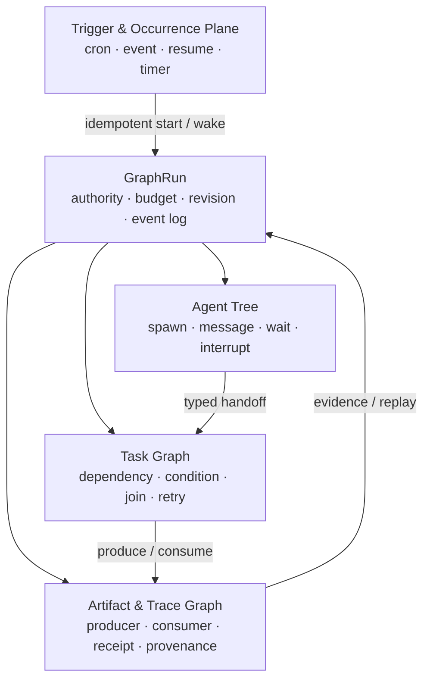

# ChainlessChain 对照 OpenAI Codex 开源架构的差距与优化建议

> 审计日期：2026-08-24  
> ChainlessChain 基线：`3ec94b795e`  
> Codex 源码参考基线：`479c8c8924eaafdeb56e86154cd19ff0805839e4`（2026-08-23）  
> 本机 Codex CLI：`codex-cli 0.149.0`

## 1. 结论先行

ChainlessChain 当前最不缺的是 Agent 功能。CLI、桌面端、IDE、TS/Python SDK、MCP、Skills、Hooks、Worktree、多代理、会话恢复、上下文压缩、沙箱、审批、OTLP 和 Eval 都已有实现。

真正值得从 Codex 学习的，不是继续堆功能，而是把这些能力收敛成一套可验证的产品内核：

1. **一个长期稳定的 Agent Server 协议**，统一桌面端、CLI、IDE、SDK 和移动端。
2. **一个 canonical Agent Kernel**，统一 turn loop、上下文、工具、审批、沙箱、会话和遥测。
3. **一个 canonical Graph Kernel**，明确区分动态 Agent Tree、确定性 Task DAG 和事后 Artifact/Trace Graph，并共享同一运行权限、预算与事件账本。
4. **Schema-first + codegen**，不再由 TypeScript、Python、IDE 和 WebSocket 手工镜像协议。
5. **安全边界默认生效且失败关闭**，审批不能替代操作系统级沙箱。
6. **真实轨迹驱动的契约测试和 Eval**，测试真实对象与真实事件，而不只是 mock 和功能清单。

本次扫描同时发现数个应先于架构重构修复的高置信问题：

- 当前 Codex backend 复用了 Claude Code 参数，实际调用协议错误。
- Desktop Coding Agent 的宿主工具和自动记忆归并存在真实对象契约断裂，但测试 mock 掩盖了问题。
- Desktop `$team` 子进程当前只写进度并直接返回成功；与之相对，CLI `cc team` 已经是真实执行器，不能把两者混为一谈。
- 旧 `cc workflow`、Desktop AgentCoordinator/WorkflowEngine 和 Cowork parallel 的部分路径会产生“幻影成功”，或在多个可写 Agent 共享同一 `cwd` 时并发产生不可归属的副作用。
- Desktop Browser Workflow 的取消可能被覆写成 completed/failed，活跃执行只在内存且进程重启后无法 hydrate/resume；在补恢复契约前不能声明 durable。
- CLI 已有较强安全基础，但 Desktop/Cowork 存在通用 IPC、任意路径写入和直接 host spawn 等平行执行面。
- Desktop MCP 在 policy 加载失败、无权限配置和无 consent UI 时存在 allow 路径，stdio server 还会继承完整环境与敏感连接信息。
- ApprovalGate 初始化失败后会退回允许路径；CLI 默认也不强制技术沙箱。

因此，建议总体策略是：**先修真实性和安全性，再统一协议与内核，最后扩展体验。**

## 2. Codex 实际开放了什么

OpenAI 官方当前列出的开放组件包括 Codex CLI、SDK、Security CLI/SDK、App Server、Skills、Plugins 和通用云环境；IDE 扩展与 Codex cloud 均被官方明确列为 **Not open source**。参见 [OpenAI：Open Source](https://learn.chatgpt.com/docs/open-source)。

这意味着最值得直接研究的是开放的 agent harness 和集成边界，而不是照搬产品 UI：

- **App Server**：以 JSON-RPC 风格协议暴露线程、轮次、事件、审批与工具交互，stdio 是默认传输，WebSocket 仍是实验性传输；官方当前也把 `app-server` 命令整体标为实验性且不支持生产工作负载。因此可以借鉴协议形状，但不能把其成熟度当作 ChainlessChain 的生产保证；它还包含初始化握手、恢复、分支和服务端主动审批请求。参见 [Codex App Server](https://learn.chatgpt.com/docs/app-server)。
- **共享 harness**：Codex 的 CLI、App 和 IDE 共享同一 agent loop；产品层拥有界面、上下文选择、工具与操作边界，harness 负责推理循环、沙箱和生命周期。参见 [Codex as a platform](https://learn.chatgpt.com/blog/codex-as-a-platform)。
- **自动化入口分层**：脚本和 CI 使用 `codex exec`，程序化启动/恢复/事件流使用 SDK，完整产品集成使用 App Server。参见 [Codex CLI](https://learn.chatgpt.com/docs/codex/cli) 与 [Codex as a platform](https://learn.chatgpt.com/blog/codex-as-a-platform)。
- **安全双层模型**：sandbox 是技术边界，approval policy 决定何时询问；两者不能互相替代。参见 [Agent approvals & security](https://learn.chatgpt.com/docs/agent-approvals-security) 与 [Sandboxing](https://learn.chatgpt.com/docs/sandboxing)。
- **Skills 产品化**：除了渐进加载，还可通过 Record & Replay 把稳定、重复的 UI 流程录制成可复用 Skill；但 Codex 当前这项能力仅支持 macOS，且要求 Computer Use 可用并启用，不能误写成现成的跨平台能力。参见 [Record & Replay](https://learn.chatgpt.com/docs/extend/record-and-replay)。
- **多智能体不是通用 DAG 引擎**：Responses API 的 hosted Multi-agent 采用 root/subagent 动态树与 `spawn/send/followup/wait/interrupt/list` 六类协作动作，适合可独立、边界清楚的并行工作；官方将固定、确定性执行图列为 “Prefer one agent” 场景。该 hosted 能力当前仍是 beta，`max_concurrent_subagents` 对整棵树全局生效且默认 3，但官方没有固定树深或累计 subagent 数上限；每个 agent 独立 compact，当前也不支持 `/responses/compact`、`reasoning.summary` 或 `max_tool_calls`。这些限制和默认值不能套到本地 Codex Subagents；后者使用 `agents.max_concurrent_threads_per_session`，官方未声明相同默认。若 ChainlessChain 仍需要固定 DAG，应由自身 Task Graph/Application orchestration 承担，并自行实施深度、累计规模、驻留与预算上限。参见 [Responses Multi-agent](https://developers.openai.com/api/docs/guides/responses-multi-agent) 与 [Codex Subagents](https://learn.chatgpt.com/docs/agent-configuration/subagents)。
- **Codex 源码已有两类“图”，但都不是任务 DAG**：[`agent-graph-store`](https://github.com/openai/codex/tree/479c8c8924eaafdeb56e86154cd19ff0805839e4/codex-rs/agent-graph-store/src) 持久化 parent/child spawn 树；[`rollout-trace`](https://github.com/openai/codex/blob/479c8c8924eaafdeb56e86154cd19ff0805839e4/codex-rs/rollout-trace/README.md) 以 append-only 原始事件和离线 reducer 构造事后语义信息流图。它们分别承载持久 spawn 拓扑/生命周期查询与诊断/回放，不提供声明式依赖、join/barrier 或拓扑调度。

## 3. 本项目已经具备、应保留的能力

以下能力不建议推倒重做：

| 能力                 | 现状证据                                                                                                                                                                                                                                                                                                                                                                                                                                                                       | 判断                                                                                                                                    |
| -------------------- | ------------------------------------------------------------------------------------------------------------------------------------------------------------------------------------------------------------------------------------------------------------------------------------------------------------------------------------------------------------------------------------------------------------------------------------------------------------------------------ | --------------------------------------------------------------------------------------------------------------------------------------- |
| CLI 非交互执行       | [`agent.js`](../packages/cli/src/commands/agent.js#L404) 已支持 text/json/stream-json、schema、权限、worktree、sandbox、OTLP 等                                                                                                                                                                                                                                                                                                                                                | 功能面成熟，适合收敛出稳定 `exec` facade                                                                                                |
| 会话恢复与完整性     | [`jsonl-session-store.js`](../packages/cli/src/harness/jsonl-session-store.js#L2) 已有 append-only、hash chain、resume/fork/checkpoint/compact                                                                                                                                                                                                                                                                                                                                 | 应提升为共享逻辑契约，而不是另造存储                                                                                                    |
| TS/Python SDK        | [`protocol.ts`](../packages/agent-sdk/src/protocol.ts#L5) 和 Python SDK 已存在，IDE 还有共用 fixtures                                                                                                                                                                                                                                                                                                                                                                          | 应改为 schema/codegen，不必重写 SDK                                                                                                     |
| Worktree 安全        | [`agent-worktree.js`](../packages/cli/src/lib/agent-worktree.js#L66) 已有 repo/path/base SHA 与 fail-closed 清理检查                                                                                                                                                                                                                                                                                                                                                           | 应进入统一 Agent Kernel                                                                                                                 |
| Skills 渐进披露      | CLI [`skill-loader.js`](../packages/cli/src/lib/skill-loader.js#L893) 和 Desktop 四层 skill loader 已支持 metadata-first                                                                                                                                                                                                                                                                                                                                                       | 应补激活契约与代码型 Skill 隔离                                                                                                         |
| MCP 安全能力         | CLI 已有一次性 capability、workspace fingerprint 和 host-owned sandbox floor                                                                                                                                                                                                                                                                                                                                                                                                   | 应扩散到 Desktop/Cowork 并消除绕行路径                                                                                                  |
| 进程安全基础         | CLI [`ProcessExecutionBroker`](../packages/cli/src/lib/process-execution-broker/index.js#L979) 已过滤凭据，并能校验真实 sandbox boundary                                                                                                                                                                                                                                                                                                                                       | 应成为全产品唯一进程执行入口                                                                                                            |
| CLI Scheduler Kernel | [`contract.js`](../packages/cli/src/lib/scheduler-kernel/contract.js#L382)、[`store.js`](../packages/cli/src/lib/scheduler-kernel/store.js#L38)、[`runtime.js`](../packages/cli/src/lib/scheduler-kernel/runtime.js#L239) 已有 occurrence 幂等身份、SQLite schema v6、job revision、lease/fencing、retry/dead-letter、authority budget、pause/resume 与未知结果对账；[`service.js`](../packages/cli/src/lib/scheduler-kernel/service.js#L128) 还会串行 tick 并隔离 driver 失败 | 应保留为定时/事件 occurrence 与 admission 层，通过 adapter 触发或恢复 GraphRun；它不是 Task DAG scheduler，不能与 Graph Kernel 重复编排 |
| CLI Cowork 图运行时  | [`cowork-workflow.js`](../packages/cli/src/lib/cowork-workflow.js#L803) 已有 DAG、条件、fan-out、循环、retry/timeout 与无 barrier pipeline；[`dynamic-workflow-runtime.js`](../packages/cli/src/lib/dynamic-workflow-runtime.js#L1499) 已有持久 effect、lineage、暂停和未知结果对账                                                                                                                                                                                            | 应作为动态流程与副作用恢复内核，不应被旧 workflow shell 取代                                                                            |
| CLI Agent Team       | [`team-runner.js`](../packages/cli/src/lib/agent-team/team-runner.js#L1136)、[`task-lease.js`](../packages/cli/src/lib/agent-team/task-lease.js#L287) 与 [`team-worktree.js`](../packages/cli/src/lib/agent-team/team-worktree.js#L1644) 已有真实 Agent、DAG、lease/fencing、预算、worktree、合并和崩溃恢复                                                                                                                                                                    | 应作为任务调度、写隔离与最终化内核，不应误判为模拟器                                                                                    |
| 审计与遥测           | 已有 OTLP、Ed25519/Merkle 审计和 Eval                                                                                                                                                                                                                                                                                                                                                                                                                                          | 应统一事件语义并形成质量闭环                                                                                                            |
| 产品差异化           | 多模型/本地模型、离线优先、Personal Data Hub、P2P/联邦、移动端                                                                                                                                                                                                                                                                                                                                                                                                                 | 这是相对 Codex 的护城河，不应被 OpenAI-only 架构替换                                                                                    |

项目的方向不是“补一个 Codex 克隆”，而是让现有广度建立在更少、更硬的核心契约上。

## 4. 优先级总览

| 优先级 | 建议                                                                           |   投入 | 主要收益                             |
| ------ | ------------------------------------------------------------------------------ | -----: | ------------------------------------ |
| P0     | 修正 Codex backend 的命令和事件协议                                            |     小 | 立即恢复真实可用性                   |
| P0     | 修复 Desktop 真实对象契约，增加非 mock 集成测试                                | 小到中 | 消除“单测绿、生产断”的问题           |
| P0     | 收口 Desktop/Cowork 的 IPC、文件、进程、MCP 与审批入口                         | 中到大 | 消除高危旁路，统一安全保证           |
| P0     | 将 Desktop `$team` 从进度模拟器接入真实内核，并清除其他 Graph shell 的幻影成功 | 中到大 | 让多代理与工作流能力名实相符         |
| P0     | 修复取消/超时后的迟到副作用，并隔离并行可写 Agent 的 workspace                 | 中到大 | 防止隐藏执行、重复写入和不可归属变更 |
| P1     | 建立 CC App Server 与 Thread/Turn/Item 统一模型                                |     大 | 统一多端产品集成边界                 |
| P1     | 建立单一协议 Schema 和多语言 codegen                                           |     中 | 消除 SDK/IDE/WS 漂移                 |
| P1     | 收敛 canonical Graph Kernel、typed Graph IR 与 artifact/handoff 契约           |     大 | 统一调度、协作、恢复和证据语义       |
| P1     | 统一 rollout、上下文压缩、记忆与结构化审批                                     |     大 | 提升恢复、长任务和安全一致性         |
| P1     | 有界队列、背压与模块边界治理                                                   |     中 | 提升长期可维护性和高负载可靠性       |
| P2     | 稳定 `cc exec`、轨迹 Eval、Record & Replay、可选 Codex adapter                 |     中 | 改善自动化、体验和生态兼容           |

### 4.1 P0：真实性、安全边界与终态正确性

以下编号可直接用于 Issue、分支、PR 和验收矩阵；`S/M/L/XL` 仅表示相对投入，不替代实际排期。“已有基础”不代表任务已完成，只有验收标准全部满足后才能关闭。

| 编号 | 任务                                | 真实差距                                                                                                                                                      | 验收标准                                                                                                                                                                                                                                        | 外部条件                                      | 建议        |
| ---- | ----------------------------------- | ------------------------------------------------------------------------------------------------------------------------------------------------------------- | ----------------------------------------------------------------------------------------------------------------------------------------------------------------------------------------------------------------------------------------------- | --------------------------------------------- | ----------- |
| P0-1 | 修正 Codex external-agent adapter   | Codex 与 Claude 共用 Claude 参数和事件 parser，`-p` 被错误当作 prompt，Codex JSONL 也未按真实协议解析                                                         | 独立 `CodexAdapter` 使用 `codex exec --json`；argv、版本能力和脱敏 JSONL fixture contract test 在 Linux/Windows/macOS 通过；失败、取消和未知事件有稳定 exit/error mapping                                                                       | 核心无；真实账号只用于可选 smoke              | 本期，S     |
| P0-2 | 修复 Desktop 真实对象契约           | `callTool/call`、`TraceStore.add/record` 和 `MemoryConsolidator` 构造/调用签名不一致，mock 掩盖生产断裂                                                       | 使用真实 `FunctionCaller/TraceStore/MemoryConsolidator/MCP adapter` 的组件测试覆盖 plan → approval → tool → observation 与 close → trace → consolidate → memory；删除生产不存在的方法 mock                                                      | 无                                            | 本期，S～M  |
| P0-3 | 清除模拟执行和 Graph shell 幻影成功 | Desktop `$team`、旧 workflow、Desktop AgentCoordinator/WorkflowEngine 及部分 Cowork parallel 路径会把 pending、progress 或未检查的 Agent 结果映射为 completed | 所有执行面声明 `simulated/real/durable/isolated` runtime claims；未接入真实内核的入口必须 feature-gate、降级为 designer/simulator 并只能返回 planned/simulated；terminal success 必须绑定 output schema、artifact digest、commit 和测试 receipt | 核心无；真实内核迁移归 P1-3/P1-12             | 本期，M     |
| P0-4 | 修复 Graph 终态与依赖传播           | loop 达到 cap 仍可能 completed；不同引擎对 failed/skipped/upstream failure 的传播互相矛盾；Browser Workflow 的 cancel 还可能被覆写为 completed/failed         | loop cap 未满足条件时进入 `EXHAUSTED/TIMED_OUT` 且不解锁 success edge；cancel 只落 `CANCELLED`；后继稳定落入 `BLOCKED/SKIPPED/UPSTREAM_FAILED/CANCELLED`；run-level terminal algebra 和根因 cut 有单元、属性和恢复测试                          | 无                                            | 本期，S～M  |
| P0-5 | 取消、超时与并行写隔离              | Desktop AgentOrchestrator、Browser Workflow 及 legacy/non-admitted 路径会在调用方返回后留下在途执行；多个可写 Agent 共用 `cwd`，loser 副作用不会撤销或归属    | stop-on-error 不再 dispatch；cancel/timeout 级联 abort descendants、等待物理 settlement，并以 attempt/lease fence 拒绝迟到结果；每个可写 attempt 使用独立 worktree 或经证明不相交的 write scope，只合并 accepted winner                         | 核心无；真实 Git/进程树三平台矩阵需 CI        | 本期，M～L  |
| P0-6 | 关闭 Desktop/Cowork 已知执行旁路    | generic IPC、任意路径写、直接 host spawn、raw MCP/网络工具，以及 Desktop MCP 的 `bypassPolicy`、策略加载失败即 allow 和默认 permissive 权限形成绕过面         | renderer 只能调用固定 allowlist API；路径 realpath 后受 workspace/capability 约束；已知 direct spawn/raw MCP/network/bypass 关闭或先接入现有 Broker；策略缺失/空权限默认拒绝；负向测试覆盖 renderer/Skill/MCP/依赖被攻破场景                    | 核心无；全产品唯一 Broker 迁移归 P1-3/P1-11   | 本期，M～L  |
| P0-7 | 沙箱、审批与审计 fail closed        | ApprovalGate 初始化异常可退回允许；CLI 默认可不启用技术沙箱；Desktop MCP 无主窗口时高风险连接 consent 自动允许，部分审计写入失败被忽略                        | sandbox guarantee 与 approval policy 独立且默认生效；无 UI 或 sandbox/approval/audit/ToolBroker 不可用时高危动作稳定拒绝；审批绑定 operation+args+cwd+workspace+policy digest，过期、重放或参数变化必须重新审批                                 | Linux/macOS/Windows 各需真实 enforcement cell | 本期核心，M |
| P0-8 | 秘密、数据密钥与持久审计迁移        | 私钥/bearer token 可能进入普通数据库；IPFS 数据密钥与密文同库；Desktop stdio MCP 直接继承完整 `process.env` 并注入数据库/GitHub token；高危审计可能只留内存   | 数据库只保存 SecretStore/key reference 或 wrapped DEK；子进程使用最小 allowlist env 和按调用注入的短期 credential；迁移后旧明文被安全清理并可回滚；审计持久、完整、脱敏且无法静默丢失，包含 actor/session/authorization/policy/sandbox/result   | 生产 KMS/HSM 可后移，本地 SecretStore 核心无  | 本期，M     |

#### 4.1.1 P0 实施状态（2026-08-24）

本轮已完成 4.1 中 P0-1～P0-8 的代码修复与本地契约验证。P0-1～P0-5 已提交为 `a14f1c7308`；P0-6～P0-8 与本状态更新属于后续安全收口提交。这里的“代码完成”不替代发布门禁：凡验收标准明确要求 Linux/Windows/macOS 的项目，仍须在同一精确提交上通过权威 GitHub Actions 矩阵后才能标记为“发布验收完成”。4.2、4.3 的 P1/P2 是后续架构路线图，不在本轮冒充已完成能力。

| 编号 | 本地状态 | 已落地证据                                                                                                                                                                                                       | 仍需外部验收                                           |
| ---- | -------- | ---------------------------------------------------------------------------------------------------------------------------------------------------------------------------------------------------------------- | ------------------------------------------------------ |
| P0-1 | 代码完成 | 独立 Codex `exec --json` adapter、真实 argv/JSONL fixtures、未知事件/取消/超时/非零退出映射                                                                                                                      | 同一提交的 Linux/Windows/macOS adapter matrix          |
| P0-2 | 代码完成 | 真实 `FunctionCaller/TraceStore/MemoryConsolidator/MCP adapter` 集成链路，不再依赖生产中不存在的方法 mock                                                                                                        | 发布矩阵复跑                                           |
| P0-3 | 代码完成 | 执行面 runtime claims；未接真实内核的入口降级为 planned/simulated；terminal success 要求证据                                                                                                                     | 后续 P1-3/P1-12 才切换唯一 authoritative kernel        |
| P0-4 | 代码完成 | loop cap、依赖失败传播、blocked-root cut 与 Browser cancel 终态已修正并覆盖回归                                                                                                                                  | crash/recovery 与跨端矩阵复跑                          |
| P0-5 | 代码完成 | stop-on-error、descendant abort、settlement/fence、per-attempt workspace/write-scope 隔离已落地                                                                                                                  | 真实 Git/进程树三平台矩阵                              |
| P0-6 | 代码完成 | generic preload IPC 默认关闭；项目路径 realpath/symlink 边界；Coding Agent/Web Shell raw MCP 强制策略；Cowork code runner/HTTP 与 stdio MCP 强制 Broker；HTTP MCP 有域名、DNS/IP 和大小上限                      | 全产品唯一 Broker 的长期收敛仍属于 P1-3/P1-11          |
| P0-7 | 代码完成 | ApprovalGate 缺失默认拒绝；CLI 默认 workspace-write/network-off；renderer sandbox 与 sender guard 默认强制；无 consent UI、sandbox、Broker 或持久审计时拒绝                                                      | Linux/macOS/Windows 各自真实 enforcement cell          |
| P0-8 | 代码完成 | Agent 私钥进入 SecretStore、bearer 仅留 hash；CLI IPFS 保存 keyRef，Desktop IPFS 保存 wrapped DEK；旧明文迁移支持 dry-run/事务失败回滚；MCP/PTY/Skill 使用最小环境；MCP 与桌面进程审计持久、脱敏且写入失败即拒绝 | 生产 KMS/HSM 可后移；升级/降级演练须在发布候选提交执行 |

### 4.2 P1：统一协议、Agent Kernel 与 Graph Engineering

| 编号  | 任务                                   | 已有基础与剩余工作                                                                                                                                                                                                                                                                                                                                                                        | 前置依赖                   | 建议期次              |
| ----- | -------------------------------------- | ----------------------------------------------------------------------------------------------------------------------------------------------------------------------------------------------------------------------------------------------------------------------------------------------------------------------------------------------------------------------------------------- | -------------------------- | --------------------- |
| P1-1  | 单一协议 Schema 与多语言 codegen       | TS/Python SDK、IDE fixtures 和多套事件 union 已存在；冻结 canonical ID、Thread/Turn/Item、approval、tool、error、Graph event schema，并生成 TS/Python/Kotlin/Swift client、validator 和兼容 fixture                                                                                                                                                                                       | P0-1～P0-5                 | 第 3～6 周，M         |
| P1-2  | CC App Server                          | CLI/桌面/IDE 已各有会话和事件入口；为 CC 自身实现 initialize 握手、thread start/resume/fork、turn start/interrupt、item delta/completed、server request、backpressure、幂等和 capability negotiation；stdio 先作为项目基线，WebSocket 明确实验级                                                                                                                                          | P1-1 additive schema MVP   | 第 3～6 周，L         |
| P1-3  | canonical Agent Kernel 与 rollout      | CLI agent、JSONL hash chain、Desktop Coding Agent、context/compaction/memory 已有较多实现；统一 turn loop、ToolBroker、approval、sandbox、context projection、checkpoint/compact/resume/fork 与 terminal evidence；把 Desktop `$team` 接入真实内核，并把旧运行时及执行入口改成 adapter                                                                                                    | P0-2、P0-6、P1-1           | 第 3～10 周，L～XL    |
| P1-4  | versioned typed Graph IR 与 Compiler   | Cowork 已有 DAG、condition、fan-out、leaf loop；Browser Workflow 已有 nested region/sub-workflow；补 `TriggerBinding/Region/LoopRegion/SubgraphCall/IterationFrame`、typed port、edge policy、definition/revision digest、N/N-1 migration，并在任何 effect 前完成引用、环、预算和 workspace 检查                                                                                          | P0-4、P1-1                 | 第 3～10 周，L        |
| P1-5  | AssignmentAttempt、任务调度与触发边界  | Scheduler Kernel 已有 occurrence 幂等、lease/fence、retry/dead-letter/authority；TeamRunner/TaskLeaseRegistry 已有 ready frontier、priority、scope lock、worktree。明确前者只产出 start/resume/timer trigger，后者调度 Task/AssignmentAttempt；补 N:M assignment、capacity/residency、priority donation、fairness 与 accepted-attempt finalization                                        | P0-5、P1-4                 | 第 7～10 周，L        |
| P1-6  | 实时消息与有 custody 的 Handoff        | TeamMailbox 和 SessionMessageFabric 已有 durable sequence、TTL、backpressure 和基础 receipt；把 child 的 send/receive/ack/followup 接入生产 adapter，区分 read/processed，补 causation、去重/dead-letter，并实现 offer/accept/commit/revoke/expire 的 handoff/lease 转移                                                                                                                  | P1-1、P1-3、P1-5           | 第 7～10 周，L        |
| P1-7  | 触发关联、动态扩图与 termination       | Scheduler Kernel 与 DistributedQueue 分别已有 occurrence identity/lease/fence 和 lock 内 append/revision/digest/finalization fence；补 occurrence↔GraphRun 幂等关联、expected-revision/request-id/origin lease、预算再准入、`OPEN/SEALED + producer lease`、稳定 quiescence、runtime wait-for graph 与 deadlock/livelock predicate                                                        | P1-4、P1-5、P1-6           | 第 7～10 周，L        |
| P1-8  | Effect、Artifact 与 Trace Graph        | DynamicWorkflowRuntime 已有 durable effect/receipt/reconcile，Team 有 checkpoint/merge，项目已有 OTel/JSONL/ArtifactStore；统一 idempotency/unknown outcome/compensation、transactional outbox/inbox 或等价 dispatch journal、artifact provenance、recipient-visible evidence、append-only raw event 与 deterministic reducer                                                             | P0-4、P0-5、P1-3～P1-7     | 第 7～12 周，L        |
| P1-9  | durable HumanTask 与统一策略事件       | 已有 approval、Hooks、MCP capability 和人工对账原型；定义可认领、可恢复、精确绑定 revision/attempt/operation digest 的 HumanTask/Decision，等待时释放 Agent slot，统一 approval-vs-cancel CAS、多人 quorum、separation-of-duties 与 hook/tool policy event                                                                                                                                | P0-7、P1-1、P1-3、P1-7     | 第 7～10 周，M～L     |
| P1-10 | 有界队列、模块边界与增量 conformance   | 多个超大模块和事件队列已有局部 limit；把 transport/event/message/tool backlog 全部有界化，拆 ports/adapters/state machines；从 P1-1 MVP 起，每个接口合入必须同时提交 fixture，最终再形成 CLI/Desktop/IDE、旧 adapter/新 kernel、crash/recovery 与 migration matrix                                                                                                                        | P1-1 schema/harness MVP    | 持续实施，第 3～12 周 |
| P1-11 | Skill 供应链、数据来源与选择性网络出口 | 已有 AgentAuthority、ContextSourceLedger、MCP effect provenance、Plugin VM、SecretStore、ProcessExecutionBroker 和 Merkle audit；补 Skill containment/签名/capability manifest、Graph 数据的 origin/trust/sensitivity/allowedSinks 与 declassification；webhook 验签/鉴权/body cap；统一 egress broker 覆盖 MCP transport 的 DNS/IP/redirect 重检、超时及 request/response/SSE frame 上限 | P0-6、P0-7、P0-8           | 第 3～10 周，L        |
| P1-12 | Graph Kernel 集成、双写验证与迁移切换  | P1-4～P1-9 分别建设 IR、调度、协作、动态图、effect 与 HumanTask，但还缺唯一 authoritative runtime 的切换任务；将 CLI Team、Cowork、Scheduler Kernel 与 Desktop/Browser 作为 adapter 接入；Browser 未具备 checkpoint/hydration 前标为 non-durable；完成 shadow-run/diff、统一投影、feature flag、回滚和旧 shell 下线                                                                       | P1-4～P1-9；P1-10 增量门禁 | 第 9～12 周，L        |

### 4.3 P2：体验、生态与质量闭环

| 编号 | 任务                           | 复核后的准确范围                                                                                                                                                                                | 外部条件                              | 建议                           |
| ---- | ------------------------------ | ----------------------------------------------------------------------------------------------------------------------------------------------------------------------------------------------- | ------------------------------------- | ------------------------------ |
| P2-1 | 稳定 `cc exec` facade          | 复用 `cc agent`，稳定 text/json/stream-json、exit code、stderr、output schema、last message、cwd、ephemeral、resume/fork/review；不再新增第三套 agent loop                                      | 无                                    | Graph/Agent Kernel 稳定后，M   |
| P2-2 | Graph topology/timeline 调试器 | 在现有 Team Monitor 上增加 Agent Tree、Task Graph、Trace/Artifact overlay、critical path/slack、lease/worktree/commit、消息因果、审批等待、预算热图、graph diff 和 time-travel replay           | 核心无；依赖 P1-7、P1-8 的统一事件    | P2 试点，M～L                  |
| P2-3 | Rollout 与协作质量 Eval        | 除完成率外，覆盖调度等价性、handoff 完整率、重复劳动、消息丢失/重排、false quiescence、deadlock/livelock、starvation、workspace conflict、成本/延迟/质量 frontier，并保留单 Agent 对照          | 真实模型预算；长期 soak runner 可后移 | 本期先 deterministic/fake，M   |
| P2-4 | Record & Replay → Skill        | 录制 UI 操作和必要上下文，去除秘密/易变数据，生成参数化 Skill 草稿；用户审阅 capability、步骤和失败条件后在沙箱回放，通过才启用                                                                 | 真实 UI/跨平台回放矩阵                | P2 prototype，M                |
| P2-5 | 可选 Codex App Server adapter  | 轻量任务使用 `codex exec --json`；持久会话才在 feature flag 后映射 Codex App Server 到 ChainlessChain Thread/Turn/Item/Approval/OTel，保持 provider-neutral；官方仍标实验性时不得作为生产硬依赖 | Codex 可用环境和兼容版本矩阵          | P1-1/P1-2 稳定后，M            |
| P2-6 | Graph/Agent 真实旅程与发布矩阵 | 建立真实模型、多 Agent、worktree/merge、crash/resume、sandbox、消息恢复和跨端一致性旅程；发布以同一精确 SHA 的 Linux/Windows/macOS workflow matrix 为准，不以本地或旧提交结果关闭任务           | CI、真实 provider、各 OS enforcement  | 持续门禁，不与功能完成混为一谈 |

## 5. P0：立即修复的真实性与安全问题

### 5.1 Codex backend 当前使用了错误的 CLI 契约

当前路由把 Claude 与 Codex 都交给同一个 `ClaudeCodeAgent`：[`agent-router.js`](../packages/cli/src/lib/agent-router.js#L330)。执行参数固定为：

```text
-p <prompt> --output-format stream-json
```

证据见 [`claude-code-bridge.js`](../packages/cli/src/lib/claude-code-bridge.js#L131)，输出也只按 Claude 的 `result` 和 `assistant.message.content` 解析：[`claude-code-bridge.js`](../packages/cli/src/lib/claude-code-bridge.js#L417)。注释还将 OpenAI Codex 错写成 GitHub Copilot：[`claude-code-bridge.js`](../packages/cli/src/lib/claude-code-bridge.js#L71)。

本机 `codex-cli 0.149.0` 的 `codex exec --help` 显示：

- 正确非交互入口是 `codex exec [PROMPT]`。
- JSONL 事件使用 `--json`。
- `-p` 是 `--profile`，不是 prompt。

现有测试只验证检测和对象字段，没有验证 Codex argv/JSONL 语义：[`claude-code-bridge.test.js`](../packages/cli/__tests__/unit/claude-code-bridge.test.js#L324)。

建议：

1. 抽出 `ExternalAgentAdapter`：`detectVersion()`、`buildArgs()`、`parseEvent()`、`capabilities()`、`cancel()`。
2. 分别实现 Claude 和 Codex adapter，不允许仅替换 executable 名称。
3. 加入 Codex 真实脱敏 JSONL fixture、argv contract test、版本兼容表和离线 `--help` smoke test。
4. 短期可使用 `codex exec --json`；需要持久线程、服务端审批和产品级交互时，再提供可选 Codex App Server adapter。

### 5.2 Desktop Coding Agent 存在真实对象契约断裂

#### 宿主工具调用

`CodingAgentSessionService` 要求并调用 `functionCaller.callTool`：

- [`coding-agent-session-service.js`](../desktop-app-vue/src/main/ai-engine/code-agent/coding-agent-session-service.js#L2247)
- [`coding-agent-session-service.js`](../desktop-app-vue/src/main/ai-engine/code-agent/coding-agent-session-service.js#L2260)

真实 `FunctionCaller` 暴露的是 `call()` 和 `executeAgentTool()`：

- [`function-caller.js`](../desktop-app-vue/src/main/ai-engine/function-caller.js#L1020)
- [`function-caller.js`](../desktop-app-vue/src/main/ai-engine/function-caller.js#L1476)

测试却 mock 了生产对象不存在的 `callTool`：[`coding-agent-session-service.test.js`](../desktop-app-vue/src/main/ai-engine/code-agent/__tests__/coding-agent-session-service.test.js#L1514)。

#### 自动记忆归并

服务调用不存在的 `traceStore.add()`：[`coding-agent-session-service.js`](../desktop-app-vue/src/main/ai-engine/code-agent/coding-agent-session-service.js#L507)，真实 API 是 `record()`：[`trace-store.js`](../packages/session-core/lib/trace-store.js#L44)。

服务构造 `MemoryConsolidator` 时只传 `memoryStore`：[`coding-agent-session-service.js`](../desktop-app-vue/src/main/ai-engine/code-agent/coding-agent-session-service.js#L511)，但真实构造器强制要求 `traceStore`：[`memory-consolidator.js`](../packages/session-core/lib/memory-consolidator.js#L88)，且真实签名为 `consolidate(session, options)`：[`memory-consolidator.js`](../packages/session-core/lib/memory-consolidator.js#L103)。现有测试只 mock `_autoConsolidate` 是否被调用，没有运行真实归并：[`coding-agent-session-service.test.js`](../desktop-app-vue/src/main/ai-engine/code-agent/__tests__/coding-agent-session-service.test.js#L1730)。

建议先定义唯一接口：

```ts
interface ToolBroker {
  execute(
    descriptor: ToolDescriptor,
    args: unknown,
    context: ToolContext,
  ): Promise<ToolResult>;
}
```

然后用真实 `FunctionCaller`、`TraceStore`、`MemoryConsolidator` 和 MCP adapter 做组件集成测试，覆盖：plan → approval → tool → observation，以及 close → trace → consolidate → memory。

### 5.3 Desktop `$team` 当前没有真实执行任务

这里特指 Desktop Coding Agent 的 `$team` 子运行时，不包括 CLI `cc team`。后者已经通过真实 headless `cc agent`、lease/fencing、team/session budget、worktree、checkpoint、merge review 与崩溃对账执行任务：[`team.js`](../packages/cli/src/commands/team.js#L1017)、[`team-runner.js`](../packages/cli/src/lib/agent-team/team-runner.js#L1136)。这是项目应保留并上收为内核的强项。

子进程入口明确不启动 CodingAgentBridge：[`sub-runtime/index.js`](../desktop-app-vue/src/main/sub-runtime/index.js#L26)。实际逻辑只是遍历 plan steps、追加进度：[`sub-runtime/index.js`](../desktop-app-vue/src/main/sub-runtime/index.js#L73)，随后无条件返回 `success: true`：[`sub-runtime/index.js`](../desktop-app-vue/src/main/sub-runtime/index.js#L89)。

调度外壳虽然有 OS 进程隔离、DAG 和 scope group，但它会把未知依赖静默视为已满足：[`sub-runtime-pool.js`](../desktop-app-vue/src/main/ai-engine/code-agent/sub-runtime-pool.js#L95)，structured wave 也明确不强制 `maxSize`：[`sub-runtime-pool.js`](../desktop-app-vue/src/main/ai-engine/code-agent/sub-runtime-pool.js#L437)。

建议：

- 子进程复用 canonical Agent Kernel，而不是维护另一套简化循环。
- 每个 agent 有最小上下文、收窄后的 capability、独立 worktree/file scope、token/step/time/tool budget。
- 全局 semaphore 必须覆盖所有 wave；planner 不能突破硬并发上限。
- 完成条件必须由可验证产物决定，例如 patch、测试结果或结构化报告，不能以“已发 progress”判定成功。

### 5.4 清除其他 Graph shell 的幻影成功与隐形副作用

进一步复核发现，“状态流转存在”被多处误当成“节点已经执行”：

- 公开的旧 `cc workflow` 在拓扑排序后直接把每个 stage 写成 `completed`，没有调用任何 action：[`workflow-engine.js`](../packages/cli/src/lib/workflow-engine.js#L234)；pause 可把已完成执行改成 paused，resume/rollback 也只是改状态或日志：[`workflow-engine.js`](../packages/cli/src/lib/workflow-engine.js#L324)。
- Desktop WorkflowEngine 的 action stage 同样只设置 `completed`：[`workflow-engine.js`](../desktop-app-vue/src/main/ai-engine/workflow/workflow-engine.js#L484)。它保存 `dag.edges`，校验和执行却只读取 `stage.next`，重启时也不恢复 paused/waiting execution。
- Desktop AgentRegistry 创建的是 metadata record，并无 `execute` runtime：[`agent-registry.js`](../desktop-app-vue/src/main/ai-engine/agents/agent-registry.js#L221)。AgentCoordinator 遇到它会先生成 `pending`，随后仍无条件记为 `COMPLETED/success: 1`：[`agent-coordinator.js`](../desktop-app-vue/src/main/ai-engine/agents/agent-coordinator.js#L585)。cancel 只改账，没有中止 handle：[`agent-coordinator.js`](../desktop-app-vue/src/main/ai-engine/agents/agent-coordinator.js#L782)，而这些能力已通过 IPC 暴露：[`agents-ipc.js`](../desktop-app-vue/src/main/ai-engine/agents/agents-ipc.js#L286)。
- `cc orchestrate` 在 `runCI:false` 时不检查 `agentResults[].success` 就完成：[`orchestrator.js`](../packages/cli/src/lib/orchestrator.js#L223)。Cowork parallel 正好走这条路径，AbortSignal 只停止 cron timer，最终 artifact/token/tool 还被固定为空或 0：[`cowork-task-runner.js`](../packages/cli/src/lib/cowork-task-runner.js#L850)。
- AgentRouter 和 ClaudeCodePool 会让多个可写 agent 共享同一 `cwd`：[`agent-router.js`](../packages/cli/src/lib/agent-router.js#L258)、[`claude-code-bridge.js`](../packages/cli/src/lib/claude-code-bridge.js#L323)。`parallel-all` 虽只选择首个成功结果，落选 agent 的文件副作用不会自动撤销或归属。
- Desktop AgentOrchestrator 的 `stopOnError` 在 Promise 已 reject 后仍由 `finally` 继续调度，timeout 也只是 `Promise.race`，不会停止底层 `agent.execute`：[`agent-orchestrator.js`](../desktop-app-vue/src/main/ai-engine/multi-agent/agent-orchestrator.js#L347)、[`agent-orchestrator.js`](../desktop-app-vue/src/main/ai-engine/multi-agent/agent-orchestrator.js#L502)。其消息队列超过 1000 条时直接截成最后 500 条，会静默丢弃尚未确认的消息：[`agent-orchestrator.js`](../desktop-app-vue/src/main/ai-engine/multi-agent/agent-orchestrator.js#L421)。
- Desktop Browser Workflow 的 `cancel()` 只置位，且只在下一 step 开始前检查：[`workflow-engine.js`](../desktop-app-vue/src/main/browser/workflow/workflow-engine.js#L377)、[`workflow-engine.js`](../desktop-app-vue/src/main/browser/workflow/workflow-engine.js#L214)。最后一个在途 step 完成后仍会无条件写 `COMPLETED`；若下一步检测到取消，刚写入的 `CANCELLED` 又会被外层 catch 覆写为 `FAILED`：[`workflow-engine.js`](../desktop-app-vue/src/main/browser/workflow/workflow-engine.js#L134)、[`workflow-engine.js`](../desktop-app-vue/src/main/browser/workflow/workflow-engine.js#L170)、[`workflow-engine.js`](../desktop-app-vue/src/main/browser/workflow/workflow-engine.js#L763)。action/sub-workflow 没有父级 AbortSignal，且 `retryCount` 还是跨步骤共享计数，不是 per-node/attempt budget。
- Cowork 的 `loopWhile/loopUntil` 是单 leaf step 的 post-test 重复；若条件直到 `maxIterations` 仍未满足，`loopExhausted: true` 但 status 仍继承最后一次的 `completed`：[`cowork-workflow.js`](../packages/cli/src/lib/cowork-workflow.js#L1627)。pipeline 随后把它视为成功并解锁下游：[`cowork-workflow.js`](../packages/cli/src/lib/cowork-workflow.js#L1748)。对 wait-until 或质量门禁，这会在退出条件未达成时继续产生副作用。

这些路径应先做“能力真实性”治理：

1. 所有执行面公开 machine-readable runtime claims：`validate-only / simulated / real-execution / durable / crash-safe / isolated-writes`；模拟器只能返回 `planned/simulated`，不能返回生产成功。
2. terminal success 必须由 runtime terminal event 与不可变证据共同派生，例如 output schema、artifact digest、worktree commit、测试 receipt；pending 或任意 result object 均不能直接完成。
3. cancel/timeout/stop-on-error 必须沿 Agent 树传播 AbortSignal，停止新调度，等待所有在途执行物理 settlement，并以 attempt/lease revision fence 拒绝迟到完成。
4. 并行可写节点必须使用 per-attempt worktree 或受证明的互斥 write scope；候选并行只合并被选中的产物。
5. 在任何副作用前完成 Graph compile；尤其要预留 `forEach` 生成 ID 命名空间，避免声明节点 `fan[0]` 与 `fan` 的动态子节点在执行后才碰撞。
6. loop 达到 cap 时进入显式 `EXHAUSTED/TIMED_OUT`，由 edge policy 决定 fail、fallback 或人工处理；除非定义明确允许，否则不得映射为 completed 或解锁 success edge。

### 5.5 统一 Desktop/Cowork 安全执行面

CLI 侧已有较强安全基础，但 Desktop/Cowork 存在绕过路径。组合风险包括：

- preload 暴露通用 `invoke/send/on`：[`preload/index.js`](../desktop-app-vue/src/preload/index.js#L2885)、[`preload/index.js`](../desktop-app-vue/src/preload/index.js#L3441)、[`preload/index.js`](../desktop-app-vue/src/preload/index.js#L3458)。
- renderer 可把任意路径传给 `file:writeContent`，main 进程直接建目录和写文件：[`file-ipc.js`](../desktop-app-vue/src/main/ipc/file-ipc.js#L534)；路径解析还原样接受非项目绝对路径：[`project-config.js`](../desktop-app-vue/src/main/project/project-config.js#L209)。
- Cowork code runner 直接 host `spawn` 并继承全部环境：[`handler.js`](../desktop-app-vue/src/main/ai-engine/cowork/skills/builtin/code-runner/handler.js#L42)。
- Electron terminal 明确跳过危险命令和可信来源门，renderer 可直接写 PTY：[`terminal-ipc.js`](../desktop-app-vue/src/main/terminal/terminal-ipc.js#L25)、[`terminal-ipc.js`](../desktop-app-vue/src/main/terminal/terminal-ipc.js#L112)。
- 主窗口 renderer sandbox 关闭：[`index.js`](../desktop-app-vue/src/main/index.js#L929)。sender guard 内部异常 fail-open：[`ipc-sender-guard.js`](../desktop-app-vue/src/main/ipc/ipc-sender-guard.js#L183)，安装失败也只记录 warning：[`index.js`](../desktop-app-vue/src/main/index.js#L944)。
- Coding Agent 直接调用 raw `mcpManager.callTool`：[`coding-agent-session-service.js`](../desktop-app-vue/src/main/ai-engine/code-agent/coding-agent-session-service.js#L2235)，而 MCP 的完整 `validateToolExecution` 位于另一条 adapter 路径：[`mcp-tool-adapter.js`](../desktop-app-vue/src/main/mcp/mcp-tool-adapter.js#L397)。
- Desktop MCP 自身还有多重 fail-open：共享 policy 加载失败时替换成 allow-all，caller 可传 `bypassPolicy`：[`mcp-client-manager.js`](../desktop-app-vue/src/main/mcp/mcp-client-manager.js#L30)、[`mcp-client-manager.js`](../desktop-app-vue/src/main/mcp/mcp-client-manager.js#L170)；无主窗口时高风险连接 consent 自动允许，无 permission 或空 `allowedPaths` 也默认放行：[`mcp-security-policy.js`](../desktop-app-vue/src/main/mcp/mcp-security-policy.js#L775)、[`mcp-security-policy.js`](../desktop-app-vue/src/main/mcp/mcp-security-policy.js#L801)。stdio server 直接继承完整 `process.env`，还注入数据库 URL/GitHub token 并绕过 ProcessExecutionBroker：[`mcp-client-manager.js`](../desktop-app-vue/src/main/mcp/mcp-client-manager.js#L253)。

这并不代表所有入口都可被远程直接利用，但一旦 renderer、Skill 或依赖被攻破，当前桥接面会显著扩大主机权限。应进行单独威胁建模和验证。

建议：

1. 删除 renderer 可自由指定 channel 的 generic bridge，只暴露按窗口/角色生成的固定 capability API。
2. 文件操作使用 workspace handle 或授权后的 root id；main 端执行 `realpath`、边界与 symlink 校验，不信任 renderer 路径。
3. 所有 CLI/Desktop/Cowork/Skill/Hook/Plugin/MCP/PTY 子进程统一经过 capability-aware ProcessExecutionBroker。
4. ToolBroker 统一 schema、路径、风险、审批、consent、sandbox、timeout、输出上限、取消、脱敏和审计；禁止 Agent 直接访问 raw manager。
5. 高危入口的 guard、policy、sandbox 或 audit 初始化失败时必须拒绝，而不是降级继续运行。

### 5.6 沙箱与审批必须默认生效并失败关闭

当前 CLI 未显式配置时，agent sandbox 返回 `null`：[`agent-sandbox.js`](../packages/cli/src/lib/agent-sandbox.js#L211)，默认还允许 unsandboxed commands 且 sandbox 不可用时不失败：[`agent-sandbox.js`](../packages/cli/src/lib/agent-sandbox.js#L206)。

ApprovalGate 初始化异常后被设置为 `null`：

- [`headless-runner.js`](../packages/cli/src/runtime/headless-runner.js#L1568)
- [`headless-stream.js`](../packages/cli/src/runtime/headless-stream.js#L2122)

而 shell approval 在没有 gate 时明确返回 allow：[`shell-approval.js`](../packages/cli/src/lib/shell-approval.js#L241)。

建议采用与 Codex 一致的双层原则：

- 默认 `workspace-write + network off`；approval 只是是否询问，不能代替技术隔离。
- `off/full-host` 必须显式选择、强提示、可被 managed policy 禁止。
- 当当前模式要求审批时，gate 加载、持久化或审计失败必须 `CONFIG_ERROR/deny`。
- 只有显式 bypass 模式才允许无 gate，并写入不可抵赖的高危审计。
- 继续保留现有“真实 isolation level”报告与域名限制无法无旁路执行时 fail-closed 的优点：[`agent-sandbox.js`](../packages/cli/src/lib/agent-sandbox.js#L330)。

### 5.7 私钥与 bearer token 不应明文落普通数据库

Agent Network 表直接保存 `private_key` 和 auth `token`：[`agent-network.js`](../packages/cli/src/lib/agent-network.js#L75)、[`agent-network.js`](../packages/cli/src/lib/agent-network.js#L124)，创建时写入原始私钥：[`agent-network.js`](../packages/cli/src/lib/agent-network.js#L287)。CLI bootstrap 初始化数据库时未传 encryption key：[`bootstrap.js`](../packages/cli/src/runtime/bootstrap.js#L105)，core DB 还会回退到无加密 `better-sqlite3`：[`database-manager.js`](../packages/core-db/lib/database-manager.js#L62)。`encrypt db` 命令描述本身也明确只是 encryption tracking：[`encrypt.js`](../packages/cli/src/commands/encrypt.js#L131)。

建议：

- 私钥只存 OS-backed SecretStore、TPM/Keychain 或硬件 key reference；普通 DB 只存公钥与 `keyRef`。
- bearer token 只存哈希、有效期与撤销状态。
- 敏感数据域不允许无加密 driver fallback。
- 复用已有 fail-closed SecretStore：[`secret-store.js`](../packages/cli/src/lib/secret-store.js#L3)，不要再发明一套密钥存储。

## 6. P1：最值得借鉴的架构能力

### 6.1 建立 CC App Server，统一所有客户端

当前至少并存以下边界：

- CLI headless NDJSON/stream-json。
- CLI WebSocket gateway 与独立 WS session journal。
- Desktop CodingAgentBridge + legacy IPC/envelope。
- VS Code 直接 spawn CLI。
- TS/Python SDK 手工镜像协议。

建议引入一个稳定的 `CC App Server`，语义借鉴 Codex，但保持 provider-neutral：

```text
Desktop / CLI / VS Code / JetBrains / Mobile / SDK
                       │ generated clients
                       ▼
             CC App Server (JSON-RPC)
       stdio: CC baseline    WebSocket: optional
                       │
                       ▼
              Canonical Agent Kernel
       ┌──────────┬──────────┬──────────┐
       │ Lifecycle│ ToolBroker│ Context  │
       │ Approval │ Sandbox   │ Rollout  │
       │ Skills   │ MCP/Hooks │ OTel/Eval│
       └──────────┴──────────┴──────────┘
                       │ adapters
                       ▼
       Local models / providers / Codex exec or app-server
```

建议的第一版协议原语：

- `initialize`
- `thread/start | resume | fork | read | list | archive`
- `turn/start | interrupt`
- `item/started | delta | completed`
- `approval/requested | resolved`
- `tool/requested | result`
- `subagent/started | completed`

Thread → Turn → Item 比当前“一个大 union 覆盖 stream、background pipe 和 WS relay”更容易做恢复、分支、审批、进度 UI 和兼容性治理。

stdio 应先作为稳定基线；WebSocket 必须增加认证、有界队列、并发配额、`OVERLOADED + retry_after_ms`、`bufferedAmount` 水位和慢消费者断路。当前 WS 收发直接异步处理，缺少完整背压契约：[`ws-server.js`](../packages/cli/src/gateways/ws/ws-server.js#L539)、[`ws-server.js`](../packages/cli/src/gateways/ws/ws-server.js#L1341)。

Codex App Server 当前还支持 Unix socket；其 WebSocket 使用有界队列，并在过载时返回 JSON-RPC `-32001`。官方同时要求远程 WebSocket 配置认证与 TLS。CC 可以借鉴这些具体约束：非 loopback 监听若没有认证/TLS 就启动失败，schema 必须由将要部署的精确 server 版本生成并随兼容矩阵保存，不能拿另一版生成物作为契约。参见 [Codex App Server protocol](https://learn.chatgpt.com/docs/app-server#protocol)。

### 6.2 单一协议 Schema 与自动代码生成

当前协议文件明确要求破坏性变更时手工同步版本和 CLI manifest：[`protocol.ts`](../packages/agent-sdk/src/protocol.ts#L13)，TS/Python 又各自定义 `PROTOCOL_VERSION = 1`：[`protocol.ts`](../packages/agent-sdk/src/protocol.ts#L23)、[`protocol.py`](../packages/agent-sdk-python/src/chainlesschain_agent_sdk/protocol.py#L21)。

建议：

- 建立一个 IDL/JSON Schema 源。
- 生成 TypeScript、Python、Kotlin、Swift 类型和运行时 validator。
- 生成协议文档与 capability manifest。
- CI 做 breaking-change diff、N/N-1 兼容和 SDK/CLI lockstep release gate。
- 保留现有跨 IDE fixtures，升级为所有生成客户端的投影测试。

### 6.3 统一逻辑 rollout store，而不是强行只保留一种物理存储

项目已有优秀的 hash-chained JSONL，不应为了模仿 Codex 而删除。需要统一的是逻辑契约：

```text
start / append / read / resume / fork / checkpoint / compact / archive / migrate
```

每条 canonical event 至少包含：

```text
schema_version, thread_id, turn_id, item_id, event_seq,
tool_use_id, approval_id, trace_id, parent_id, timestamp
```

JSONL、SQLite 和远端同步可以是不同 adapter；任何客户端都不应因为物理存储不同而无法恢复。当前 headless resume 对 DB-only session 存在明确边界：[`agent.js`](../packages/cli/src/commands/agent.js#L1596)，WS 又维护自己的状态 journal：[`ws-session-state.js`](../packages/cli/src/gateways/ws/ws-session-state.js#L2)。

### 6.4 统一上下文压缩与记忆生命周期

当前至少存在：

- CLI `PromptCompressor`：[`prompt-compressor.js`](../packages/cli/src/harness/prompt-compressor.js#L346)
- CLI `CLIContextEngineering`：[`cli-context-engineering.js`](../packages/cli/src/lib/cli-context-engineering.js#L40)
- provider-backed compaction：[`provider-backed-compaction.js`](../packages/cli/src/harness/provider-backed-compaction.js#L116)
- Desktop `PromptCompressor`：[`prompt-compressor.js`](../desktop-app-vue/src/main/llm/prompt-compressor.js#L71)
- 多套永久/层次/MemGPT/session-core memory。

建议抽成共享 Context/Memory Kernel：

- 预算按 system、skills、tools、history、working state 分区。
- 保留计划、pending approval、tool call/result 配对、工作目录、worktree、预算和未完成任务。
- 大工具结果外置，仅保留有内容哈希的引用与摘要。
- compaction 本身写入 rollout，可重放、可评估、可回滚。
- memory 统一 scope、provenance、confidence、retention、deletion 与 privacy。
- 对同一 fixture，在 CLI/Desktop/IDE 上应得到等价的压缩状态和恢复结果。

Codex 官方披露的实践表明，保留推理状态和改进 compaction 能显著提升长任务表现；这比单纯把历史截短更值得借鉴。参见 [Codex as a platform](https://learn.chatgpt.com/blog/codex-as-a-platform)。

### 6.5 将审批升级为结构化决定，并暴露现有安全能力

内部 ApprovalGate 已有 policy、一次性 bound authorization 和防重放：[`approval-gate.js`](../packages/session-core/lib/approval-gate.js#L172)。但公开 Agent SDK 仍只有 `approve: boolean`：[`protocol.ts`](../packages/agent-sdk/src/protocol.ts#L488)，回调也只返回 boolean：[`agent-session.ts`](../packages/agent-sdk/src/agent-session.ts#L104)。

建议升级为：

```ts
type ApprovalDecision =
  | { kind: "acceptOnce" }
  | { kind: "acceptForTurn"; permissions?: PermissionGrant[] }
  | { kind: "acceptForSession"; permissions?: PermissionGrant[] }
  | { kind: "decline"; reason?: string }
  | { kind: "cancel" };
```

审批请求携带 thread/turn/item、规范化命令、cwd、workspace、目标域、文件动作、风险理由、policy digest 和 operation fingerprint。长期授权必须按最小范围授予，复用现有一次性 capability 与防重放实现。

### 6.6 按状态机和端口拆分超大模块，但不要为 Rust 而 Rust

本次静态统计中：

- `packages/cli/src/runtime/agent-core.js`：约 14,525 行。
- `packages/cli/src/repl/agent-repl.js`：约 9,850 行。
- `platform-sandbox.js`：约 9,792 行。
- `jsonl-session-store.js`：约 7,147 行。
- `dynamic-workflow-runtime.js`：约 6,300 行。
- `plugin-runtime/install.js`：约 6,097 行。
- `mcp-client.js`：约 5,988 行。

建议在协议和测试先稳定后，按 `lifecycle / context / tool / approval / sandbox / store / transport` 拆分纯状态机与 I/O ports。Codex 的 Rust crate 边界值得参考，但迁移语言不是目标；直接重写为 Rust 会放大风险，先在现有 JS/TS 中建立清晰边界更划算。

### 6.7 合并 Hooks 运行时和信任模型

项目同时存在 observe-only hook registry、settings decision hooks 和 Hooks v2：

- [`hook-manager.js`](../packages/cli/src/lib/hook-manager.js#L1)
- [`settings-hooks.cjs`](../packages/cli/src/lib/settings-hooks.cjs#L18)
- [`hooks-v2-runtime.js`](../packages/cli/src/lib/hooks-v2-runtime.js#L2)

建议统一 typed event、优先级、超时、同步/异步 decision、hash/trust/reapprove 与审计，旧配置仅作为 adapter。Codex 当前的 PreToolUse、PermissionRequest、Pre/PostCompact、UserPromptSubmit、SubagentStop 和 Stop 等生命周期可作为事件完整性清单参考。参见 [Hooks](https://learn.chatgpt.com/docs/hooks)。

### 6.8 补齐 Skill 供应链、网络出口与不可抵赖审计

这些问题适合和统一 ToolBroker 一起修复：

| 问题                                                                                                 | 证据                                                                                                                                                                                                                                | 建议                                                                                                                                                            |
| ---------------------------------------------------------------------------------------------------- | ----------------------------------------------------------------------------------------------------------------------------------------------------------------------------------------------------------------------------------- | --------------------------------------------------------------------------------------------------------------------------------------------------------------- |
| 代码型 Skill 可通过 `./../../...` 逃出目录，并在 Electron main 中直接 `require`                      | [`skill-md-parser.js`](../desktop-app-vue/src/main/ai-engine/cowork/skills/skill-md-parser.js#L291)、[`markdown-skill.js`](../desktop-app-vue/src/main/ai-engine/cowork/skills/markdown-skill.js#L195)                              | `realpath` 后做目录包含校验；引入签名、来源、capability manifest，并在 VM/独立进程中执行                                                                        |
| `api_requester` 可对模型给出的 URL/headers/body 直接发请求                                           | [`extended-tools-3.js`](../desktop-app-vue/src/main/ai-engine/extended-tools-3.js#L399)、[`function-caller.js`](../desktop-app-vue/src/main/ai-engine/function-caller.js#L1068)                                                     | 所有网络走统一 egress broker；默认断网，拒绝 loopback/private/link-local/metadata，并对 DNS 和每次 redirect 重新校验                                            |
| MCP 远程策略只校验 scheme/transport，renderer 可写 server config，HTTP-SSE frame/response 无字节上限 | [`mcp-policy.js`](../packages/session-core/lib/mcp-policy.js#L53)、[`mcp-ipc.js`](../desktop-app-vue/src/main/mcp/mcp-ipc.js#L93)、[`http-sse-transport.js`](../desktop-app-vue/src/main/mcp/transports/http-sse-transport.js#L193) | egress broker 必须覆盖 MCP transport 的 DNS/IP 分类与重绑定、redirect 重检、连接/读取超时、request/response/SSE frame cap 和慢流断路                            |
| `cc orchestrate` webhook 无验签/鉴权/body cap，且把三种 IM 全标成 CLI 来源后直接派给可写 Agent       | [`orchestrate.js`](../packages/cli/src/commands/orchestrate.js#L517)、[`orchestrate.js`](../packages/cli/src/commands/orchestrate.js#L531)、[`orchestrator.js`](../packages/cli/src/lib/orchestrator.js#L248)                       | 每个 channel 使用真实 origin、验签、replay window、body/rate cap；不可信正文只能作为数据，不得生成 approval/control authority，写入前经 policy/declassification |
| `sandbox-v2` 的执行路径目前只是模拟                                                                  | [`sandbox-v2.js`](../packages/cli/src/lib/sandbox-v2.js#L303)                                                                                                                                                                       | 重命名为 policy simulator，或接入真实 ProcessExecutionBroker；产品不得把模拟结果报告成技术隔离                                                                  |
| IPFS 加密将数据密钥与密文放在同一数据库                                                              | [`ipfs-storage.js`](../packages/cli/src/lib/ipfs-storage.js#L94)、[`ipfs-storage.js`](../packages/cli/src/lib/ipfs-storage.js#L323)                                                                                                 | 使用 envelope encryption，数据库只存 wrapped DEK 或 `keyRef`                                                                                                    |
| Desktop process audit 写入失败会被忽略，enterprise audit 无数据库时只留内存                          | [`desktop-process-broker.js`](../desktop-app-vue/src/main/process/desktop-process-broker.js#L144)、[`enterprise-audit-logger.js`](../desktop-app-vue/src/main/audit/enterprise-audit-logger.js#L210)                                | 高危动作无法持久化审计时拒绝；统一 actor/session/authorization/policy/sandbox guarantee/result 事件                                                             |

项目已有可复用的 Plugin VM、SecretStore、MCP capability 和 Merkle audit，应优先复用这些实现，而不是再添加平行安全组件。

另一个容易漏掉的边界是 **Graph 数据流安全**。项目已用 [`agent-authority.js`](../packages/cli/src/lib/agent-authority.js#L28) 保证消息正文不能自称为 user/approval authority，用 [`context-source-ledger.js`](../packages/cli/src/lib/context-source-ledger.js#L16) 记录上下文来源，并把 MCP 声明明确视作不构成宿主授权的提示：[`mcp-effect-contract.js`](../packages/cli/src/lib/mcp-effect-contract.js#L77)。这些能力应上收为统一数据契约：Message、DataRef、ArtifactRef 和 context item 至少携带由可信 dispatch 赋值的 `origin/trust/sensitivity/allowedSinks`，解密、降级或跨信任域发送必须记录显式 declassification 决定。浏览器、RAG、MCP、Skill、channel 或 subagent 的不可信内容可以作为数据输入，但不能通过 prompt injection 自行变成 system 指令、approval、capability、Graph control edge 或新增网络出口。

### 6.9 将多套图收敛为 canonical Graph Kernel

#### 6.9.1 正确判断：不是“没有 Graph”，而是执行面割裂

Codex 公开源码提供动态 Agent Tree 与事后 Trace Graph，ChainlessChain 则已经拥有更接近声明式任务 DAG 的能力。因此目标不应是照抄 Codex 或再造第五套 scheduler，而应将已有强内核收敛成同一套可验证语义：

| 执行面                                     | 已有真实能力                                                                                                                                                                                                                                         | 主要缺口或定位                                                                                                                                                                                                     |
| ------------------------------------------ | ---------------------------------------------------------------------------------------------------------------------------------------------------------------------------------------------------------------------------------------------------- | ------------------------------------------------------------------------------------------------------------------------------------------------------------------------------------------------------------------ |
| CLI Scheduler Kernel                       | occurrence identity、job revision、SQLite schema v6、lease/fencing、retry/dead-letter、authority reservation、pause/resume、migration/rollback 与 unknown-outcome adjudication；已有 agenda/automation/event/cowork cron/saved loop/routine adapters | 应作为 temporal/event trigger 与 admission plane：只产生或唤醒一个幂等 GraphRun，不负责 Task ready frontier、join、handoff 或 Graph 终态；当前还缺 canonical occurrence↔run correlation 和跨内核 dispatch journal  |
| CLI `cc team`                              | 真实 headless Agent、初始 DAG、priority、lease/fencing、预算、scope lock、worktree/checkpoint/merge、分布式恢复；queue 已支持 lock 内 append task、revision/digest 与 finalization fence                                                             | 最适合作为 ready-frontier、任务租约、写隔离和最终化内核；动态扩图仍缺 expected-revision/idempotency/producer seal/budget re-admission，task contract 仍缺 typed output、acceptance、skills/tools 与实时 child 通信 |
| CLI Cowork + Dynamic Workflow              | 条件、fan-out、loop、retry/timeout、pipeline、definition/admission digest、持久 effect/receipt、pause/input/reconcile、ArtifactStore lineage                                                                                                         | 最适合作为 Graph Compiler、动态控制流和副作用恢复内核；并行节点仍共享 `cwd`，数据流主要是字符串 placeholder，token/USD/duration 以预估准入和事后观测为主                                                           |
| Desktop Browser Workflow                   | condition、multi-step loop body、try/catch/finally、group 和 sub-workflow，能递归执行嵌套 block                                                                                                                                                      | 可作为 `Region/LoopRegion/SubgraphCall` adapter 的参考；cancel 终态/级联错误，执行只在内存 Map 且启动不 hydrate，sub-workflow 缺 parent-run/signal binding、call-cycle/depth guard，loop cap 也没有 exhausted 终态 |
| 旧 `cc workflow` + Desktop WorkflowEngine  | DAG CRUD、模板、状态和简单 UI                                                                                                                                                                                                                        | action 实际未执行、rollback 不补偿，必须降级为 designer/simulator 或改接 canonical executor                                                                                                                        |
| Desktop AgentCoordinator + Desktop `$team` | assignment/DAG/process/scope 外壳                                                                                                                                                                                                                    | runtime identity、取消、终态和产物未绑定，存在 pending/进度直接完成                                                                                                                                                |
| `cc orchestrate` + Cowork parallel         | 会真实启动外部 Agent 并聚合输出                                                                                                                                                                                                                      | 失败可能被报成完成、取消不终止在途 Agent、并行写共享 workspace                                                                                                                                                     |
| 大量 `*V2 governance overlay`              | profile/task 生命周期与容量原型                                                                                                                                                                                                                      | 多为 module-level `Map` 和手工 `complete-*` 状态转换，不是可跨 CLI 进程恢复的 runtime；应 feature-gate 或改为事件投影                                                                                              |

推荐用一个 GraphRun envelope 管理三种互补图，而不是把它们混成含义不明的单图：



其中 Agent Tree 可以由模型动态扩展，Task Graph 负责确定性依赖和副作用边界，Artifact/Trace Graph 负责证据、因果关系、回放与 Eval。官方也明确指出固定确定性图并不是多智能体模式的最佳场景，因此不要强迫所有协作消息都变成预声明 DAG 节点。

#### 6.9.2 建立 versioned typed Graph IR 与 effect-before-compile 禁令

建议最少定义并由同一 schema/codegen 生成：

- `GraphDefinition / GraphRevision / GraphRun / TriggerBinding / OccurrenceRef / TaskNode / Region / LoopRegion / SubgraphRef / SubgraphCall / IterationFrame / NodeAttempt / Edge / AgentRuntime / AssignmentAttempt / Message / Handoff / HumanTask / Decision / ArtifactRef / Receipt / WaitReason`。
- `TaskNode` 只声明 capability/role/model-class、tools/skills、typed input/output、acceptance、permission、预算、workspace/write-set、retry、idempotency key、effect class 和 compensation 等执行要求，不固化具体 Agent 或实际 model。
- 边至少区分 control/data/message/review/merge/compensation，并支持 `onSuccess / onFailure / always / timeout / cancel`；join 支持 `all / any / quorum / race` 及 loser cancellation。
- `ArtifactRef` 绑定 producer node/attempt/lease、schema、digest、worktree commit、validation evidence、消费者和 retention，终态只引用不可变产物；Message/DataRef/ArtifactRef 还应携带 origin、trust、sensitivity、allowed sinks 与 declassification evidence，数据来源不能隐式提升控制或执行权限。
- `TaskNode` 与 `AgentRuntime` 不能 1:1 绑定。用一等 `AssignmentAttempt` 表达 selected agent/model、lead/executor/reviewer/judge/observer、capacity slot、grant、attempt lease/fencing 和 participation status：一个 warm Agent 可串行承担多个任务，一个任务也可因 retry/recovery 或 quorum 关联多个 attempt/只读 participant，但可写 mutation authority 只能属于一个被接受且未过期的 attempt。现有 TaskLeaseRegistry 将稳定 task key 与临时 holder/leaseId 分开，是正确范式：[`task-lease.js`](../packages/cli/src/lib/agent-team/task-lease.js#L308)。Desktop 则存在相反例子：先把 subtask 记录给指定 `agentId`，随后 `dispatch` 又重新选 Agent，账面 assignee 与真实 executor 可能不同：[`cowork-orchestrator.js`](../desktop-app-vue/src/main/ai-engine/multi-agent/cowork-orchestrator.js#L343)、[`agent-orchestrator.js`](../desktop-app-vue/src/main/ai-engine/multi-agent/agent-orchestrator.js#L204)。
- `Task Graph` 的声明依赖保持无环；循环、递归和可复用子图必须是显式、可设上限的 `LoopRegion/SubgraphCall`，具有 entry/exit、typed input/output、break/continue/feedback、digest pin、预算切片、cancel/compensation boundary 与 call-cycle/depth guard。每次迭代以 `(nodeId, iterationPath, attempt)` 展开成无环 execution-attempt graph，防止把合法 loop 与非法 back-edge 混为一谈，也避免 child ID、artifact 与幂等键碰撞。

当前 Cowork 的 loop 只重复一个 leaf step，并非 multi-node region：[`cowork-workflow.js`](../packages/cli/src/lib/cowork-workflow.js#L1593)。相反，Desktop Browser Workflow 已能递归执行 condition、multi-step loop、try/catch 和 sub-workflow：[`workflow-engine.js`](../desktop-app-vue/src/main/browser/workflow/workflow-engine.js#L229)、[`workflow-engine.js`](../desktop-app-vue/src/main/browser/workflow/workflow-engine.js#L719)，但 sub-workflow 尚未绑定 parent run/digest/signal，也没有递归调用环和深度保护。它的 active execution 只在内存 `Map`，结束即删除；IPC 初始化不 hydrate 未完成记录，resume 也只查内存：[`workflow-engine.js`](../desktop-app-vue/src/main/browser/workflow/workflow-engine.js#L80)、[`workflow-ipc.js`](../desktop-app-vue/src/main/browser/workflow/workflow-ipc.js#L31)。因此在补齐 checkpoint、version binding、restart hydration 与 reconcile 前只能声明 non-durable。两者应分别作为 leaf-repeat 与 structured-region adapter 接入统一 IR，不宜继续各自扩展。

当前 Cowork workflow 校验了字段类型、依赖和环，却不会静态证明 `${step.X...}` 引用来自传递依赖，也没有提前保留动态 child ID 命名空间：[`cowork-workflow.js`](../packages/cli/src/lib/cowork-workflow.js#L803)。Graph Compiler 必须在第一个 provider/tool/file effect 前完成：未知引用、重复/动态碰撞 ID、非法 dependency cycle、subgraph call-cycle、orphan/unreachable、dependency closure、typed port、权限单调性、预算上界与 workspace 冲突检查。

Codex 的 [`SpawnReservation`](https://github.com/openai/codex/blob/479c8c8924eaafdeb56e86154cd19ff0805839e4/codex-rs/core/src/agent/registry.rs#L304-L401) 值得直接借鉴：真正 spawn 单个 child 前先以 atomic counter 预留一个全局 slot，再在 registry mutex 下预留唯一 AgentPath；只有 commit 后才登记 child，失败或提前返回会回滚计数与路径。它不是“一次原子预留整棵树”。Graph Kernel 可将这种 reservation/commit 思路扩展到动态节点 ID、预算、AssignmentAttempt、lease 与 write scope，而不是先产生副作用再发现冲突。

定义和运行状态还需要 N/N-1 upcaster、迁移 dry-run、备份与 rollback。当前 definition contract 和 durable runtime 都精确绑定 v1：[`workflow-definition-contract.js`](../packages/cli/src/lib/workflow-definition-contract.js#L84)、[`dynamic-workflow-runtime.js`](../packages/cli/src/lib/dynamic-workflow-runtime.js#L1499)；没有迁移链时，长期运行和跨版本恢复会成为升级阻塞点。

#### 6.9.3 把协作从 prompt 快照升级为实时、可恢复的 handoff

CLI TeamMailbox 本身已有 directed/broadcast、per-recipient cursor、有界容量、safe compaction、snapshot 与 fail-closed backpressure：[`team-mailbox.js`](../packages/cli/src/lib/agent-team/team-mailbox.js#L61)。但生产 `cc team --agent` adapter 只在子进程启动前把 inbox 拼进 prompt，并没有把 TeamRunner 提供的 `sendMessage` 暴露给 child：[`team-runner.js`](../packages/cli/src/lib/agent-team/team-runner.js#L1145)、[`team.js`](../packages/cli/src/commands/team.js#L1331)。因此当前真实 teammate 不能 mid-turn send/receive/ACK，文档中的“Agent 间消息”与生产 adapter 仍有一段断桥。

建议：

1. 复用更成熟的 [`session-message-fabric.js`](../packages/cli/src/lib/session-message-fabric.js#L1)，为 child 注入与 holder/attempt/lease 绑定的 `send / receive / ack / followup` 工具；消息使用 durable sequence、TTL、rate limit 和 backpressure。
2. 把 handoff 从“摘要 payload”提升为所有权转移协议。现有 [`structured-handoff.js`](../packages/cli/src/harness/structured-handoff.js#L8) 已严格约束 summary 内容，但尚未表达 custody；应定义 `OFFERED → ACCEPTED | REJECTED → COMMITTED | REVOKED | EXPIRED`，绑定 from/to、task/attempt、GraphRevision、authority digest、artifact refs、preconditions、expiry 和 idempotency key。接收方接受后获得新的 AssignmentAttempt/lease，发送方的迟到写由 fencing 拒绝；拒绝或超时则明确由谁接回任务。
3. 明确采用 at-least-once delivery + 幂等 consumer，不宣称 exactly-once。当前 fabric 的 receipt 主要表达 delivered/held/refused 等 admission 状态，[`inbox(..., acknowledge)`](../packages/cli/src/lib/session-message-fabric.js#L1164) 实际只写 `readAt`；Graph Kernel 还应区分 admitted/delivered/read/processed/dead-letter，并记录 causation/correlation/conversation、sender attempt/lease、revision 和 payload digest，覆盖“已处理但 ACK 丢失”、poison message、重投去重及跨 channel 重排。
4. 稳定层级 `AgentPath` 与 thread UUID 分离，submission 保留 parent/root turn 因果；context fork 支持 `none / all / last-N`，并过滤旧 tool chatter 和父级策略碎片。
5. child 的 approval、permission、cwd、sandbox、budget 和 tool scope 只能继承或收窄；message/handoff 不得成为扩权通道。
6. 区分 queue 与 wake：Codex V2 将二者映射为 [`QueueOnly / TriggerTurn`](https://github.com/openai/codex/blob/479c8c8924eaafdeb56e86154cd19ff0805839e4/codex-rs/core/src/tools/handlers/multi_agents_v2/message_tool.rs#L1-L23)，即 `send` 只排队、`followup` 才在目标空闲时触发新 turn；这里不从枚举名推导 durable/reliable 保证，ChainlessChain 仍需自行定义持久化与投递契约。完成通知也不应无条件唤醒，这种分离有助于限制消息风暴和意外重入。
7. 将 `spawn / send / followup / wait / interrupt / list` 映射为 canonical graph events，使 CLI、Desktop 与 IDE 看见同一棵实时 Agent Tree。

#### 6.9.4 统一调度、写隔离、失败传播与补偿

应复用而不是重写现有组件：Scheduler Kernel 负责 trigger/occurrence、幂等身份、temporal admission、lease/fence、retry/dead-letter 与 adjudication：[`contract.js`](../packages/cli/src/lib/scheduler-kernel/contract.js#L382)、[`runtime.js`](../packages/cli/src/lib/scheduler-kernel/runtime.js#L239)；TeamRunner/TaskLeaseRegistry 负责 Task claim/fencing/ready frontier，DynamicWorkflowRuntime 负责 effect/receipt/unknown-outcome reconcile，TeamWorktreeCoordinator 负责写隔离与 merge，SessionResourceBudget 负责整棵 descendant tree 的 concurrency/spawn/depth/turn/token/USD/time 上限：[`session-resource-budget.js`](../packages/cli/src/lib/session-resource-budget.js#L1213)。

仍需补齐以下 Graph 级语义：

- Cowork 并行可写节点默认共用 `cwd`；必须复用 scope lock/worktree，或静态证明 write-set 不相交。workspace checkpoint 只能回滚受覆盖文件，不能替代外部 API、网络、数据库或进程副作用的补偿。
- Scheduler occurrence 与 GraphRun 必须保持两个状态机：occurrence 的 `succeeded` 只表示幂等 start/resume/timer dispatch 已被 Graph Kernel 接收并落账，不得冒充 GraphRun 成功；两者绑定 job revision、occurrence id/idempotency key、Graph definition/revision 与 run id。通过 transactional outbox 或等价 durable dispatch journal 保证同一 occurrence 最多创建一个逻辑 GraphRun，crash/retry 只能重放同一关联。
- 全局 `continueOnError` 不足以表达生产失败策略。每个节点/边应声明 fail-fast、continue、fallback、retry class、compensation 与 downstream terminal policy。
- 当前不同引擎的依赖失败语义相反：Desktop AgentCoordinator 把失败 attempt 也加入 `completed`，下游仍可运行：[`agent-coordinator.js`](../desktop-app-vue/src/main/ai-engine/agents/agent-coordinator.js#L1674)；Agent Team 的失败父节点又可能让后继长期保持 pending；Cowork run 聚合又只剩 completed/partial/failed，全部 skipped 会落到 failed：[`cowork-workflow.js`](../packages/cli/src/lib/cowork-workflow.js#L2392)。统一状态代数、edge propagation 和 blocked-root cut，避免逐个引擎猜终态。
- stop/cancel/timeout 必须停止新节点、级联中止 descendants、等待在途 settlement，再以 fencing 拒绝 late result；不能只让调用方 Promise 先返回。尤其要为 Browser action/sub-workflow 注入父级 AbortSignal，并保证 `CANCELLED` 不会被外层完成/异常分支覆写。
- 动态扩图并非从零开始：TeamDistributedQueue 已在 file lock 内原子增加 task、递增 state revision、刷新 graph/authority/integrity digest 并写回：[`team-distributed-queue.js`](../packages/cli/src/lib/agent-team/team-distributed-queue.js#L3329)、[`team-distributed-queue.js`](../packages/cli/src/lib/agent-team/team-distributed-queue.js#L4959)。真正缺的是 `expectedGraphRevision / requestId / originAttemptLease`，使 stale planner CAS 失败、byte-equivalent replay 幂等，并在扩图时重新检查权限/预算、失败依赖和 write conflict。高风险 rewire/remove 还需审批，不能直接改内存数组。
- Graph 状态、lease、消息和 effect receipt 之间的跨组件提交要有 transactional outbox/inbox 或等价 journal；必须故障注入“状态已提交但消息未发”“任务已派发但 lease 未落账”“effect 已发生但 receipt 丢失”“ACK 已处理但未持久化”等 cut point，并以 inbox dedup、fencing 与 reconciliation 收敛，不能用进程内回调假设原子性。
- GraphRun 必须显式区分 `OPEN / SEALED` 并租约化 planner/producer authority。当前 distributed worker 在同一 revision 看到 `claimable=0 && leased=0` 就退出：[`team-distributed.js`](../packages/cli/src/commands/team-distributed.js#L2399)，但 queue 仍可 append task；只有 graph sealed、所有 producer lease 结束且不存在未对账 effect/input/revision 时，quiescence 才能成为 terminal。
- 现有 TeamScopeLock 一次原子校验并持有全部 scope，已避免经典“分批拿锁”的 lock-order deadlock：[`team-scope-lock.js`](../packages/cli/src/lib/agent-team/team-scope-lock.js#L244)。但 strict priority 仍会让持续到来的 high task 饿死 low task，尤其 high 依赖 low 时会发生 priority inversion；scope scan 上限也可能造成 head-of-line stall：[`team-runner.js`](../packages/cli/src/lib/agent-team/team-runner.js#L1055)。加入 transitive priority donation/critical-path boost、aging/WFQ、lock wait queue、tenant quota、deadline/slack 与 queue-wait SLO。
- “当前无可 claim 节点”不等于完成。现有 TeamRunner 会在 no claimable 且无本地 in-flight 时结束 worker，再单独计算 `allDone`：[`team-runner.js`](../packages/cli/src/lib/agent-team/team-runner.js#L445)、[`task-lease.js`](../packages/cli/src/lib/agent-team/task-lease.js#L839)。统一内核应维护 Task/Agent/Message/Scope/Lease/Timer/Human/Join 的 runtime wait-for graph，以稳定 cut 判定 quiescence；GraphRun 非终态至少有 `WAITING_INPUT / WAITING_EXTERNAL / WAITING_HUMAN / RECONCILIATION_REQUIRED`，终态至少有 `SUCCEEDED / FAILED / PARTIAL / CANCELLED / BLOCKED / DEADLOCKED / BUDGET_EXHAUSTED`，每项都必须有可验证 predicate 和 blocked-root cut。
- 还要检测“有事件但无进展”的 livelock：以 progress epoch、frontier/artifact/terminal digest 和 retry/replan/message budget 识别重复状态或 ping-pong。动态 wait-for SCC 应产生可诊断根因，并按确定性 victim policy、补偿或人工介入解除，而不是静默挂起。
- 把累计 Agent Tree 规模、active concurrency 和 resident context 数分开。Codex V2 的 [residency manager](https://github.com/openai/codex/blob/479c8c8924eaafdeb56e86154cd19ff0805839e4/codex-rs/core/src/agent/control/residency.rs#L48-L158) 只卸载终态、无 active turn、无 pending mailbox 的 child；ChainlessChain 可以采用自己的 depth/total budget，但 eviction 不得破坏寻址、消息或恢复语义。
- Human-in-the-loop 应成为 durable `HumanTask/InputRequest/Decision`，精确绑定 run/revision/node attempt、operation+args/artifact digest、policy version、actor/claim lease、nonce 与 TTL；等待期间释放 Agent capacity 和可释放写锁，resume 时重新验证 digest，approval-vs-cancel/replan 由 CAS/fencing 决胜，多人审批支持 all/any/quorum 与 separation of duties。

#### 6.9.5 Trace Graph、调试器与 Graph Eval

Codex rollout trace 最值得借鉴的是 `observe first, interpret later`：运行时只追加原始有序事件与 payload ref，离线 deterministic reducer 再生成 Spawn/Assign/Message/Result/Close 等语义边。ChainlessChain 可把现有 JSONL hash chain、dynamic effect lineage、OTLP、Team lease/worktree 和 ArtifactStore 统一投影为 Trace Graph，而不让观测逻辑反向污染 scheduler。

边界也要照着学准：Codex rollout trace 是 opt-in、best-effort 的本地诊断 artifact，不是 telemetry、不会上传，也不是 scheduler 的 source of truth；bundle 可能包含 prompt、tool/terminal 输出和路径等敏感内容，必须按敏感本地数据保护。child 与 root 共用同一 bundle，独立顶层 thread 则分别记录。另有 [`trace_id` 与 `rollout_id`](https://github.com/openai/codex/blob/479c8c8924eaafdeb56e86154cd19ff0805839e4/codex-rs/rollout-trace/README.md#L108-L116) 分离，runtime payload 也不自动证明模型看到了相同字节。Message delivery edge 应等到 recipient-side model-visible item 出现才成立，而不是 sender API 返回即成立，Codex reducer 也采用这种 [pending-delivery evidence](https://github.com/openai/codex/blob/479c8c8924eaafdeb56e86154cd19ff0805839e4/codex-rs/rollout-trace/src/reducer/tool/agents.rs#L514-L625)。trace 中的 `CloseAgent/CollabClose` 保留真实 close tool/runtime evidence，但这不证明 Responses hosted 公共 API 在六类动作之外还有第七个 `close_agent`；固定 V2 handler 也未公开该动作：[`agents.rs`](https://github.com/openai/codex/blob/479c8c8924eaafdeb56e86154cd19ff0805839e4/codex-rs/rollout-trace/src/reducer/tool/agents.rs#L99-L115)。

统一事件至少覆盖 graph revision、node/edge/attempt、agent lifecycle、lease、message/ACK、tool/provider effect、approval、artifact、checkpoint、merge、budget 与 terminal evidence。现有 VS Code Team Monitor 已能展示任务、lease、budget 和人工对账，但主要仍是平面表格：[`team-monitor-view.js`](../packages/vscode-extension/src/ui/team-monitor-view.js#L1037)。P2 可增加拓扑 + timeline overlay、critical path/slack、workspace/commit、artifact lineage、消息因果、审批等待、预算热图、graph diff 和 time-travel replay。

Graph Eval 不应只统计“多少任务完成”，还应覆盖：

- property/metamorphic：不同合法调度次序得到等价结果，budget/permission 守恒且只收窄；
- fault/chaos：每个持久化边界 crash、lease 过期、late write、lost/duplicate/processed-before-ACK message、handoff accept-vs-revoke、approval-vs-cancel、unknown provider/tool outcome；
- collaboration quality：handoff 完整率、重复劳动、冲突率、综合结论正确性、单 Agent 对照增益；
- scheduling quality：critical-path utilization、并行 speedup、queue wait、starvation、dynamic wait-cycle、retry/replan livelock、false quiescence、cost/latency/quality frontier；
- workspace/integration：write-set 冲突、merge/review、只合并 winner、测试证据与 artifact provenance。

当前相关单元测试数量和故障覆盖已经很可观，缺口主要是跨运行时 conformance 与真实端到端语义，而不是再堆一批只检查状态枚举的测试。

## 7. P2：产品体验和生态增强

### 7.1 提供稳定的 `cc exec` facade

无需重写已有 `cc agent`。可增加面向机器的稳定 facade：

- stdout 只输出 final result 或 JSONL，诊断只到 stderr。
- 稳定 exit codes。
- `--output-schema`、`--output-last-message`、`--cwd`、`--ephemeral`。
- `resume/fork/review` 子命令。
- 明确版本化并纳入跨平台 CI。

这会让脚本/CI 使用方式与完整 App Server 集成解耦。

### 7.2 把 Eval 从结果测试升级为 rollout 质量闭环

现有 Eval 已有客观文件断言和 OTLP，但任务集偏小，执行时还可能只保存 text 输出：[`tasks.js`](../packages/cli/src/lib/eval/tasks.js#L7)、[`eval.js`](../packages/cli/src/commands/eval.js#L113)。

建议增加：

- 真实 issue → patch → test 任务。
- 多 seed、模型、provider、OS 和版本矩阵。
- 保存 canonical JSONL trajectory。
- 评分 patch 正确性、测试通过率、tool error、approval precision、恢复成功率、compaction retention、成本和延迟。
- 为 Codex/Claude/本地模型 adapter 使用同一任务和同一评分器。
- 把协议兼容、安全 fail-closed、真实 sandbox guarantee 和队列 overload 纳入 CI gate。

### 7.3 Record & Replay → Skill

项目已经有完整 Skill 体系，但没有看到“用户演示一次稳定桌面/浏览器流程，系统自动生成 Skill 草稿”的产品闭环。Codex 当前 Record & Replay 只支持 macOS 且依赖启用的 Computer Use；因此 ChainlessChain 的 Windows/Linux/多浏览器回放是自研目标，不是直接接入即可获得的 parity。可以先针对本地、低风险、可重复的流程做 POC：

1. 录制操作和必要上下文。
2. 去除秘密与易变数据。
3. 合成参数化 Skill 草稿。
4. 用户审阅权限、步骤和失败条件。
5. 在沙箱中回放验证后才启用。

对于跨团队分发，再打包为 Plugin；不要把录制结果未经审阅直接变成可执行代码。

### 7.4 可选 Codex App Server adapter，而不是深度 fork

保留 ChainlessChain 自有、provider-neutral 的 Agent Kernel。对希望使用 OpenAI Codex 的用户，可提供：

- 轻量任务：`codex exec --json` adapter。
- 持久会话：以 feature flag、版本兼容矩阵和降级路径保护的 Codex App Server adapter。
- 统一映射到 ChainlessChain 的 Thread/Turn/Item、Approval 和 OTel schema。

这样既能借用 Codex harness，也不会牺牲本地模型、离线能力和 P2P 产品方向。由于官方当前仍将 `app-server` 标为实验性且不支持生产工作负载，该 adapter 在上游成熟前只能是可选兼容层，不能成为 ChainlessChain 会话恢复或发布可用性的单点依赖。

## 8. 90 天建议路线图

### 第 0–2 周：真实性与安全止血

- `[P0-1]` 修正 Codex adapter、注释、argv 与 JSONL parser，补真实 fixtures。
- `[P0-2]` 修复 `callTool/call`、TraceStore、MemoryConsolidator 契约，并用真实对象补 Desktop 组件集成测试。
- `[P0-3]` 明确 Desktop `$team` 当前状态：在真实执行完成前，UI 不得宣称任务成功；保留并复用真实 CLI `cc team`。
- `[P0-3]` 下线、feature-gate 或重命名旧 `cc workflow`、Desktop workflow/AgentCoordinator 与 `*V2` 手工状态 shell，禁止 pending/simulated 进入 completed。
- `[P0-4/P0-5]` 修复 stop-on-error/cancel/timeout 后继续执行、Browser cancel 被覆写为 completed/failed、并行共享 `cwd`、依赖失败语义、loop cap 仍报 completed 与动态 child ID 碰撞。
- `[P1-1/P1-3/P1-4]` 冻结新协议、新 Agent loop 和新图运行时；产出 Agent Kernel、Graph Kernel、ToolBroker、Event Schema ADR。
- `[P0-6]` 收紧 generic IPC、任意路径写、直接 host spawn、raw MCP/`bypassPolicy`；Desktop MCP policy 缺失、空权限或无 UI 时改为拒绝。
- `[P0-7]` ApprovalGate/安全审计/MCP consent 初始化或交互失败改为 fail-closed。
- `[P0-8/P1-11]` 将私钥/token 迁移到 SecretStore/key reference，stdio MCP 改为最小 env，并给网络工具/MCP transport 加默认拒绝的 egress policy。

### 第 3–6 周：统一协议与执行入口

- `[P1-1]` 实现协议 IDL 和 TS/Python/Kotlin/Swift codegen。
- `[P1-2]` 实现 CC App Server MVP：initialize、thread start/resume/fork、turn start/interrupt、item events、approval。
- `[P1-1/P1-2]` 让 CLI、VS Code 和一个 Desktop pilot 共用生成 client。
- `[P0-6/P1-3]` 建立唯一 ToolBroker 与 ProcessExecutionBroker 路径。
- `[P1-4]` 定义 versioned `GraphDefinition/GraphRevision/GraphRun/TaskNode/Region/LoopRegion/SubgraphCall/IterationFrame/NodeAttempt/AssignmentAttempt/Edge/ArtifactRef/Handoff/HumanTask`，实现 effect-before-compile 的静态 Graph Compiler。
- `[P1-4/P1-5/P1-6/P1-7]` 定义 `cc team`、Cowork、Scheduler Kernel 与 Desktop 的 adapter contract/prototype，冻结 occurrence↔GraphRun、AssignmentAttempt、实时消息和 handoff 语义；本阶段不宣称 authoritative runtime 已切换。
- `[P1-10]` 为 WS 增加有界队列和 overload 契约；从协议 MVP 起，每个 P1 接口随实现提交 conformance fixture。

### 第 7–10 周：统一状态与长任务能力

- `[P1-3/P1-8]` 抽象 canonical rollout API，接入 JSONL/SQLite adapters。
- `[P1-3]` 统一 context/compaction，修复 memory consolidation。
- `[P1-9]` 将结构化审批和 capability grant 暴露到 SDK/各 UI。
- `[P0-3/P0-5/P1-3/P1-5]` 让 Desktop `$team` 子进程执行真实 Agent Kernel，并接入 worktree、terminal evidence、全局 descendant budget 和 cancellation tree。
- `[P1-5/P1-6/P1-7]` 接通真实 Task scheduler、child send/receive/ack/followup 与 custody handoff；Scheduler Kernel 仅通过幂等 adapter 触发/唤醒 GraphRun，不承担 Task DAG 调度。
- `[P1-4/P1-6/P1-7/P1-8/P1-9]` 统一失败传播、outbox/inbox、补偿/receipt、`OPEN/SEALED + producer lease`、dynamic wait-for/quiescence、handoff custody、durable HumanTask、动态 GraphRevision CAS、schema N/N-1 migration 与 trace projection。
- `[P1-11]` 让 Message/DataRef/ArtifactRef/context item 携带可信来源赋值的 origin/trust/sensitivity/allowedSinks；为 orchestrate webhook 增加 channel 验签/auth/body cap，并在统一 egress broker 对 MCP transport 执行显式 declassification、DNS/IP/redirect 重检与 response/SSE cap。

### 第 11–12 周：质量闭环与体验验证

- `[P1-10]` 建立跨 CLI/Desktop/IDE 的协议和恢复 conformance matrix。
- `[P1-12]` 对 CLI Team、Cowork、Scheduler 与 Desktop/Browser adapter 做 shadow-run/diff；Browser 在 checkpoint、restart hydration、version binding 与 reconcile 完成前保持 non-durable/feature-gated。核对状态、事件、产物与终态后切换 authoritative Graph Kernel，保留可验证回滚并下线旧 shell 写路径。
- `[P1-4～P1-12/P2-3]` Graph/轨迹 Eval 覆盖调度等价性、loop-cap/subgraph recursion、lost/duplicate/processed-before-ACK message、handoff 与审批竞争、producer-seal race、occurrence duplicate/crash、dynamic deadlock/livelock、false quiescence、priority inversion、assignee/executor 一致性、依赖失败、lease/write race、预算守恒、compaction、防重放、崩溃恢复和 sandbox guarantee。
- `[P2-2/P2-3]` 试点 graph topology/timeline/critical-path/artifact-lineage 调试器，并加入 starvation 与 workspace-conflict 指标。
- `[P2-1/P2-4/P2-5]` 试点 `cc exec` facade、Record & Replay 或可选 Codex App Server adapter；后两者不要同时大规模展开，Codex adapter 不进入生产关键路径。
- `[P2-6]` 用同一精确 SHA 的 Linux/Windows/macOS 真实旅程矩阵作为发布门禁。
- 以成功率、安全拒绝准确率、恢复率、成本和 p95 延迟决定下一季度投资。

## 9. 建议验收标准

### 9.1 P0/P1 发布门槛

1. `[P1-1]` 同一协议 schema 自动生成所有客户端类型和 validator，仓库中不再存在手工镜像的事件 union；兼容 fixture 能证明 additive change 与拒绝 breaking change。
2. `[P1-1/P1-2/P1-10]` 同一 fixture 经 CLI/Desktop/IDE 运行，得到相同 causal partial order、approval binding、terminal projection 和已声明的并发等价类，而不是强求并发事件的单一全序。
3. `[P0-1]` Codex adapter 的 argv、版本能力和脱敏 JSONL fixture contract test 在 Linux/Windows/macOS 均通过；未知事件、取消、超时和非零退出有稳定映射。
4. `[P0-2/P1-3]` 使用真实 `FunctionCaller/TraceStore/MemoryConsolidator/MCP adapter` 的组件测试覆盖 plan → approval → tool → observation 与 close → trace → consolidate → memory；生产不存在的方法 mock 数量为零。
5. `[P0-7/P1-3]` ApprovalGate、sandbox、audit、ToolBroker 或 MCP consent UI 不可用时，高危动作稳定拒绝；审批绑定 operation、规范化参数、cwd/workspace、policy digest、nonce 与 TTL，重放或参数漂移失败。
6. `[P0-6/P1-3/P1-11]` renderer 不能指定任意 IPC channel/绝对路径或直接启动 host process；已知 direct spawn/raw MCP/network/`bypassPolicy` 旁路清零，policy 缺失或权限空白默认拒绝；迁移后的所有入口通过同一 broker contract test。
7. `[P0-3/P1-12]` 所有执行面公开 machine-readable runtime claims；未接入真实内核者只能返回 planned/simulated。Graph success 必须绑定真实 terminal event 与 output/artifact/commit/test evidence，pending/progress/任意 result object 均不能完成。
8. `[P0-4/P0-5/P1-5]` stop-on-error 后不再 dispatch；cancel/timeout 级联中止 descendants、等待在途物理 settlement，并以 attempt/lease fence 拒绝迟到结果；Browser 最后一步/下一步/paused/sub-workflow 的取消都只产生 `CANCELLED`，不会被覆写为 completed/failed。
9. `[P0-4]` 失败节点的所有后继都有确定的 `BLOCKED/SKIPPED/UPSTREAM_FAILED/CANCELLED` 终态和 blocked-root cut，不会继续误跑或永久 pending；all-skipped 和 partial failure 有固定 run-level 代数。
10. `[P0-5/P1-5]` 任意两个并行可写 attempt 使用独立 worktree 或经验证不相交的 write scope，只合并 accepted winner 的 commit/artifact；loser 和 lease-expired writer 的迟到写被拒绝。
11. `[P1-4/P1-7]` Graph Compiler 在任何 effect 前拒绝未知引用、dependency/subgraph call-cycle、动态 ID 碰撞、typed port 不匹配、越权、预算上界和 workspace 冲突；bounded loop/subgraph 按 iteration path 展开且 execution-attempt graph 保持无环。
12. `[P1-5/P1-6]` Agent–Task 通过 N:M AssignmentAttempt 关联，账面 assignee 等于真实 executor且重派不改变 Task identity；handoff 完成 offer/accept/commit 或 reject/revoke/expire 后才转移 custody，新 lease 生效后 sender 迟到写稳定失败。
13. `[P1-6/P1-8]` child Agent 可实时 send/receive/ack/followup；消息使用 at-least-once + 幂等消费，区分 admitted/delivered/read/processed/dead-letter 并保留 causation。背压、重复投递、接收方离线及 processed-before-ACK 后恢复均不静默丢失或扩权。
14. `[P1-5/P1-7]` Scheduler occurrence 与 GraphRun 分别持久化终态并保留可查询关联；同一 job revision + occurrence idempotency key 在 crash/retry/双 worker 竞争下只创建一个逻辑 GraphRun，scheduler success 不会被投影为 Graph success。
15. `[P1-7]` Graph 未 sealed 或仍有 producer lease 时，no-ready 不得宣告终止；sealed 后也只有在无 in-flight attempt/effect/lease、无可解锁 message/timer/child/revision 且外部等待均已分类时，quiescence 才能转为有 predicate 的明确终态。
16. `[P1-8]` 对枚举的每个 durable cut point 执行 fault-injection matrix，至少覆盖 state-commit/message-send、dispatch/lease、effect/receipt、processed/ACK；恢复不重复非幂等副作用，未知结果进入 reconciliation，raw event 重放生成相同 Graph/Artifact/Trace projection 与 provenance。
17. `[P1-1/P1-4/P1-8]` 协议、Graph definition 和 durable runtime 支持 N/N-1 读取、迁移 dry-run、备份与回滚，run 始终绑定 definition/revision digest，失败迁移不留下半升级状态。
18. `[P1-3/P1-10]` compaction/resume/fork 前后保留 pending approval、tool pair、plan、Agent Tree、Graph frontier、worktree、未完成任务和数据来源标签；旧 runtime adapter 与新 kernel 通过同一恢复 fixture。
19. `[P0-4/P1-4/P1-8]` fan-out child ID/顺序和聚合结果可确定重放；`all/any/quorum/race` 覆盖 partial failure，race winner 由原子 CAS 决定且 loser 被物理停止并 fencing；loop cap 未满足条件不得成功；补偿按逆依赖序幂等执行，补偿失败进入 `RECONCILIATION_REQUIRED`。
20. `[P1-5]` high task 依赖 low task或等待其 scope 时触发 priority donation/critical-path boost；先定义 queue-wait/aging SLO，再用持续高优先级流和 scope-conflict workload 跑至少 3 倍 SLO 窗口，低优先级依赖与无冲突后继均在界内获得服务。
21. `[P1-9]` HumanTask/Decision 可跨重启恢复并精确绑定 revision/attempt/operation digest；等待不占 Agent slot，旧审批不能批准 replan 后的新动作，approval-vs-cancel 与多人 quorum/separation-of-duties 可确定复现。
22. `[P0-8]` 私钥不出 SecretStore，普通数据库不保存原始 bearer token；数据只保存 wrapped DEK/keyRef，MCP/Plugin/Hook 子进程只获得 capability 所需的最小 env 与短期 credential。迁移支持 dry-run/备份/回滚，旧明文清理可验证，高危审计持久、脱敏且写入失败时拒绝动作。
23. `[P1-2/P1-10]` CC App Server 设定 per-connection/session queue cap、`OVERLOADED + retry_after_ms` 和慢消费者断路；至少 30 分钟 overload soak 后无队列越界，warm-up 后 RSS 增长趋势低于预先冻结的阈值（建议 10%）。
24. `[P1-11]` Message/DataRef/ArtifactRef/context item 的 origin/trust/sensitivity/allowedSinks 由可信边界赋值且随派生传播；orchestrate/webhook channel 验签并保留真实 origin，设 body/rate/replay cap；不可信内容不能铸造 approval/capability/control edge。网络和 MCP transport 默认拒绝 loopback/private/link-local/metadata，DNS/redirect 重检，并限制 request/response/SSE frame 与慢流，declassification 可审计。
25. `[P1-12]` CLI Team、Cowork、Scheduler 与 Desktop/Browser adapter 的 shadow-run 在冻结 fixture 上得到等价 terminal/artifact/event projection；Browser crash/restart 可从 checkpoint hydrate，或明确保持 non-durable/feature-gated；切换有旧新双读、回滚演练和旧 shell 写入口清零，之后只有 canonical Graph Kernel 能写 authoritative run state。

### 9.2 P2 Definition of Done

| 编号 | 可关闭任务的最小证据                                                                                                                                                                                                              |
| ---- | --------------------------------------------------------------------------------------------------------------------------------------------------------------------------------------------------------------------------------- |
| P2-1 | `cc exec` 的 text/json/stream-json、exit code、stderr、schema、last-message、cwd、ephemeral、resume/fork/review fixtures 在三平台通过；与 `cc agent` 共用 Agent Kernel，代码扫描与调用图证明没有第三套 loop。                     |
| P2-2 | 调试器能从任一 GraphRun 跳转 Agent Tree、Task Graph 与 Artifact/Trace overlay，查看 critical path、lease/worktree/commit、消息/审批因果和 revision diff；对固定故障 fixture 可仅凭持久事件定位 blocked root 并 time-travel 重放。 |
| P2-3 | 固定 Eval 集含单 Agent 对照、多 seed、故障注入与调度等价类，冻结 correctness/safety/recovery/cost/latency 阈值；同一精确 SHA 的回归报告可重复生成并阻断超过阈值的发布。                                                           |
| P2-4 | 录制产物通过 secret/PII/易变值扫描，用户审阅参数、capability manifest 和失败条件；至少一个低风险流程在隔离环境与跨平台 fixture 中重放成功，任何越权或环境漂移均 fail closed。                                                     |
| P2-5 | Codex App Server adapter 有 feature flag、上游版本兼容矩阵、协议 fixtures、`codex exec --json` 降级路径与移除演练；官方仍标实验性时不进入生产关键路径，adapter 故障不影响本地/其他 provider 会话。                                |
| P2-6 | 真实模型、多 Agent、worktree/merge、crash/resume、sandbox、消息恢复与跨端一致性旅程在同一精确 release SHA 的 Linux/Windows/macOS 权威 workflow matrix 全绿；本地结果、部分矩阵、超时或旧提交检查均不能关闭发布任务。              |

## 10. 不建议照搬的部分

- **不要因为 Codex 使用 Rust 就先做语言重写。** 先稳定协议、状态机与 ports，收益更直接。
- **不要改成 OpenAI-only。** 多 provider、本地模型和离线优先是项目的重要差异化。
- **不要深 fork Codex 并长期追 upstream。** 优先通过 `exec`/App Server adapter 集成。
- **不要复制未开放的 IDE/cloud 产品外壳。** 学习开放 harness、协议和安全边界即可。
- **不要把 Agent Tree、Task DAG 和 Trace Graph 合成一种含义模糊的“万能图”。** 三者共享 GraphRun 身份和事件，但分别承担动态协作、确定性控制和事后证据。
- **不要把每次 Agent 协作都预先固化成 DAG。** 读取/研究等独立工作适合动态 subagent tree；固定依赖、写入与副作用才进入声明式 Task Graph。
- **不要把状态机 façade 当作执行器。** `register/start/complete` 只有在由真实 runtime event 和 durable CAS projection 驱动时才是能力，而不是手工 CLI 生命周期按钮。
- **不要再以功能清单代替生产证据。** 每项能力必须有真实执行、失败路径和跨端契约测试。

## 11. 审计范围与限制

本报告基于：

- ChainlessChain 当前工作树静态扫描。
- OpenAI Codex 官方文档与对应开源仓库快照的架构对照。
- 本机 `codex exec --help`/`codex --version` 的只读核验。
- 对关键接口的源码级契约核对。
- 定向执行 Graph/Team 单元测试：`workflow-engine`、`cowork-workflow`、`dynamic-workflow-facade`、`team-task-contract`、`team-mailbox`、`team-runner` 共 6 个文件、324 个测试全部通过。
- 继续执行 durable/distributed/real-git 相关 5 个文件时，3 个文件通过；共 101 个测试通过、1 个跳过，另有 [`team-distributed-soak.test.js`](../packages/cli/__tests__/integration/team-distributed-soak.test.js#L477) 的 5 秒 timeout 与 [`team-worktree-real-git.test.js`](../packages/cli/__tests__/integration/team-worktree-real-git.test.js#L56) 的 120 秒 timeout。两项需要单独性能复跑和环境归因，本报告不把 timeout 直接解释为逻辑断言失败。
- 最终全量枚举补发现此前漏记的 `packages/cli/src/lib/scheduler-kernel/`：源码静态核对覆盖 schema v6、occurrence identity、job revision、lease/fence、retry/dead-letter、authority、pause/resume、migration/rollback、adjudication 及 6 类 adapter，因此已将其定位为 Graph Kernel 的 trigger/occurrence 层，而不是待重写的 Task DAG scheduler。
- 补跑 `scheduler-kernel-service/store/runtime` 3 个单测文件：共 19 项通过（service 8 项、store 11 项）；其余 57 项（store 42 项、runtime 15 项）在进入业务断言前因本机 Node `22.22.2`/Windows x64 缺少 `better-sqlite3` 原生 binding 而失败。该结果记为环境阻塞，不解释为逻辑回归；必须在具备匹配 binding 的权威 CI cell 重跑后才能给 SQLite 路径下结论。
- 只读最小探针令 `loopUntil:false, maxIterations:2` 的每轮任务都返回 completed，实际得到 `{"status":"completed","loopExhausted":true,"loopStop":"cap","iterations":2}`，确认 loop-cap 终态问题可复现；现有单测只断言 exhausted/stop/count，没有断言 status：[`cowork-workflow.test.js`](../packages/cli/__tests__/unit/cowork-workflow.test.js#L1140)。

本次没有执行完整桌面 E2E、真实模型多智能体旅程、全部 OS sandbox matrix 或渗透测试。因此安全与 Graph 项是高置信代码路径/契约发现，仍应通过独立威胁建模、最小复现、性能复跑和修复后的跨端回归完成闭环。
