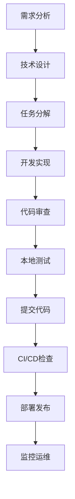
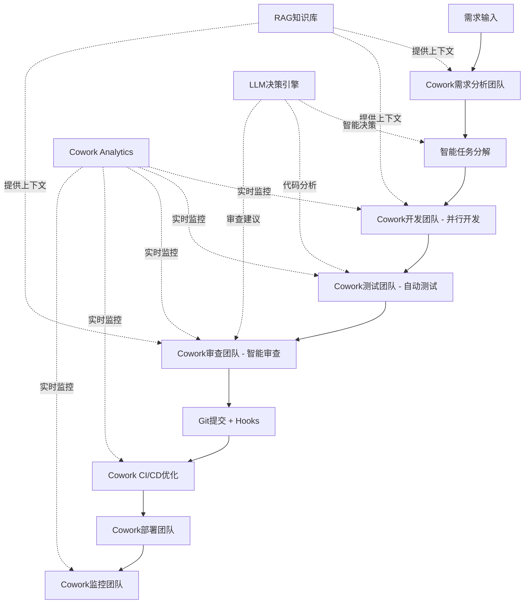

# ChainlessChain 项目工作流优化计划

**版本**: v1.0.0
**制定日期**: 2026-01-27
**目标**: 整合Cowork多代理协作系统，优化从项目创建到交付的全流程

---

## 目录

- [当前流程分析](#当前流程分析)
- [Cowork系统整合点](#cowork系统整合点)
- [优化后的工作流](#优化后的工作流)
- [实施计划](#实施计划)
- [预期收益](#预期收益)
- [风险评估](#风险评估)
- [附录](#附录)

---

## 当前流程分析

### 1. 项目创建到交付的完整流程



### 2. 现有工具链矩阵

| 阶段 | 工具/系统 | 自动化程度 | 痛点 |
|------|----------|-----------|------|
| **需求分析** | 人工/文档 | 10% | 需求理解不一致，缺乏结构化 |
| **技术设计** | CLAUDE.md/Memory Bank | 30% | 设计文档分散，缺乏版本控制 |
| **任务分解** | 人工分配 | 20% | 任务颗粒度不统一，依赖关系不清晰 |
| **开发实现** | VSCode/Electron/Vue3 | 60% | 多人协作效率低，代码冲突多 |
| **代码审查** | GitHub PR | 50% | 审查标准不统一，反馈周期长 |
| **本地测试** | Vitest/Jest | 70% | 测试覆盖率不足（46%），编写效率低 |
| **代码提交** | Git + Husky Hooks | 80% | Pre-commit检查严格但耗时 |
| **CI/CD检查** | GitHub Actions | 85% | 9个工作流，总耗时15-30分钟 |
| **部署发布** | Electron Forge | 70% | 打包慢，多平台适配复杂 |
| **监控运维** | 人工 + ErrorMonitor | 40% | 缺乏主动监控，问题发现滞后 |

### 3. 关键性能指标（当前）

| 指标 | 当前值 | 理想值 | 差距 |
|------|--------|--------|------|
| 需求到设计平均时间 | 2-3天 | 0.5-1天 | -66% |
| 任务分解耗时 | 1-2天 | 2-4小时 | -75% |
| 单个功能开发周期 | 3-5天 | 1-2天 | -60% |
| 代码审查响应时间 | 4-8小时 | 1-2小时 | -75% |
| 测试用例编写效率 | 10个/天 | 30个/天 | -67% |
| CI/CD总耗时 | 20-30分钟 | 10-15分钟 | -50% |
| Bug修复平均时间 | 1-2天 | 4-8小时 | -67% |
| 文档完成度 | 70% | 95% | -25% |
| 团队协作效率 | 60% | 90% | -30% |

### 4. 现有Git Hooks机制

#### Pre-commit Hook (严格检查)
```bash
1. ✅ ESLint + Prettier (lint-staged)
2. ✅ TypeScript类型检查
3. ✅ 代码规则验证 (validate:rules)
4. ✅ 稳定单元测试（排除不稳定测试）
```

**耗时**: 2-5分钟
**通过率**: ~85%
**痛点**: 检查严格导致开发中频繁被打断

#### Pre-push Hook (轻量检查)
```bash
1. ✅ TypeScript类型检查
```

**耗时**: 30-60秒
**痛点**: 检查项较少，问题可能推到CI/CD阶段才发现

#### CI/CD Workflows (9个工作流)
```yaml
1. code-quality.yml         # 代码质量 + 安全审计
2. test.yml                 # 单元测试 + 集成测试
3. e2e-tests.yml            # E2E测试
4. android-ci.yml           # Android构建
5. ios-build.yml            # iOS构建
6. pr-tests.yml             # PR专用测试
7. release.yml              # 发布流程
8. test-automation-full.yml # 完整自动化测试
9. android-e2e-tests.yml    # Android E2E
```

**并行执行**: 部分
**总耗时**: 15-30分钟
**痛点**: 工作流复杂，失败调试困难

### 5. 开发协作现状

#### 团队结构
- **前端开发**: 2-3人（Vue3/Electron）
- **后端开发**: 1-2人（Spring Boot/FastAPI）
- **移动端开发**: 1-2人（Android/iOS）
- **AI/算法**: 1人（LLM/RAG）
- **测试/运维**: 0.5-1人（兼职）

#### 协作痛点
1. **沟通成本高**: 跨团队协作依赖人工沟通，信息传递不及时
2. **任务分配不均**: 缺乏智能负载均衡，部分成员超载
3. **并行度低**: 功能开发串行，无法充分利用团队资源
4. **知识孤岛**: 专业知识分散，代码复用率低
5. **质量不稳定**: 测试覆盖率不足（46%），Bug率偏高

---

## Cowork系统整合点

### 1. 核心能力映射

| Cowork能力 | 对应流程阶段 | 提升潜力 |
|-----------|------------|---------|
| **智能编排** | 任务分解、开发实现 | ⭐⭐⭐⭐⭐ |
| **多代理协作** | 开发实现、测试 | ⭐⭐⭐⭐⭐ |
| **技能系统** | 文档生成、数据处理 | ⭐⭐⭐⭐ |
| **文件沙箱** | 代码审查、安全检查 | ⭐⭐⭐⭐ |
| **长时任务管理** | CI/CD、打包部署 | ⭐⭐⭐⭐⭐ |
| **RAG集成** | 需求分析、技术设计 | ⭐⭐⭐⭐ |
| **LLM集成** | 代码审查、Bug诊断 | ⭐⭐⭐⭐⭐ |
| **错误监控集成** | 监控运维 | ⭐⭐⭐⭐ |
| **数据可视化** | 项目管理、进度跟踪 | ⭐⭐⭐ |

### 2. 关键整合场景

#### 场景A: 智能需求分析 & 任务分解
**当前流程**:
```
产品经理提需求 → 技术负责人评审 → 人工任务分解 → 分配给开发
耗时: 2-3天
```

**Cowork优化**:
```python
# 创建需求分析团队
requirement_team = cowork.createTeam({
  name: "需求分析团队",
  agents: [
    { role: "需求分析师", skills: ["requirement-parsing", "user-story"] },
    { role: "技术架构师", skills: ["system-design", "tech-selection"] },
    { role: "任务规划师", skills: ["task-breakdown", "dependency-analysis"] }
  ]
})

# 智能任务分解
tasks = await cowork.assignTask(requirement_team.id, {
  type: "requirement-analysis",
  input: { requirement_doc: "新功能需求.md" },
  rag_context: true,  // 查询历史类似需求
  llm_analysis: true  // AI辅助分析复杂度
})

# 输出: 结构化任务列表 + 优先级 + 依赖关系 + 工时估算
```

**预期提升**: 2-3天 → 2-4小时（75%提升）

#### 场景B: 并行开发 & 代码生成
**当前流程**:
```
开发A写功能 → 开发B等待 → 开发A提交 → 开发B开始
并行度: 30%
```

**Cowork优化**:
```python
# 创建开发团队
dev_team = cowork.createTeam({
  name: "功能开发团队",
  agents: [
    { role: "前端工程师", skills: ["vue3", "typescript", "ui-design"] },
    { role: "后端工程师", skills: ["nodejs", "api-design", "database"] },
    { role: "测试工程师", skills: ["unit-test", "integration-test"] }
  ]
})

# 并行任务分配
await cowork.orchestrator.distributeParallelTasks(dev_team.id, tasks, {
  strategy: "load-balance",  // 负载均衡
  conflict_detection: true,  // 文件冲突检测
  auto_merge: false          // 人工审核合并
})

# 实时进度监控
cowork.onTaskProgress((progress) => {
  dashboard.update(progress)
})
```

**预期提升**: 并行度 30% → 80%（生产力提升167%）

#### 场景C: 智能测试生成
**当前流程**:
```
开发完成 → 手动编写测试 → 运行测试 → 修复Bug
测试覆盖率: 46%
```

**Cowork优化**:
```python
# 创建测试团队
test_team = cowork.createTeam({
  name: "测试自动化团队",
  agents: [
    { role: "单元测试生成器", skills: ["unit-test-gen", "mock-data"] },
    { role: "集成测试专家", skills: ["e2e-test", "api-test"] },
    { role: "性能测试工程师", skills: ["benchmark", "load-test"] }
  ]
})

# 基于代码自动生成测试
await cowork.assignTask(test_team.id, {
  type: "test-generation",
  input: {
    source_files: ["src/main/cowork/**/*.js"],
    coverage_target: 90,
    llm_assist: true  // AI生成测试用例
  }
})
```

**预期提升**: 测试覆盖率 46% → 90%（+44%）

#### 场景D: 智能代码审查
**当前流程**:
```
提交PR → 人工审查 → 反馈修改 → 再次审查
响应时间: 4-8小时
```

**Cowork优化**:
```python
# 创建代码审查团队
review_team = cowork.createTeam({
  name: "代码审查团队",
  agents: [
    { role: "安全审查员", skills: ["security-scan", "vulnerability-check"] },
    { role: "性能审查员", skills: ["performance-analysis", "complexity"] },
    { role: "规范审查员", skills: ["style-check", "best-practices"] },
    { role: "架构审查员", skills: ["design-patterns", "maintainability"] }
  ]
})

# Git Hook触发自动审查
git_hook.on('pre-push', async (files) => {
  const review_result = await cowork.assignTask(review_team.id, {
    type: "code-review",
    input: { changed_files: files },
    rag_context: true,  // 查询编码规范
    llm_analysis: true  // AI深度分析
  })

  if (review_result.issues.length > 0) {
    console.log("发现问题:", review_result.issues)
    console.log("建议修复:", review_result.suggestions)
  }
})
```

**预期提升**: 响应时间 4-8小时 → 5-10分钟（95%提升）

#### 场景E: CI/CD智能优化
**当前流程**:
```
Push代码 → 触发9个工作流 → 串行/部分并行执行
总耗时: 20-30分钟
```

**Cowork优化**:
```python
# 创建CI/CD优化团队
cicd_team = cowork.createTeam({
  name: "CI/CD优化团队",
  agents: [
    { role: "测试选择器", skills: ["test-selection", "change-impact"] },
    { role: "缓存优化器", skills: ["cache-management", "incremental-build"] },
    { role: "并行调度器", skills: ["parallel-execution", "resource-allocation"] }
  ]
})

# 智能测试选择（仅运行受影响的测试）
const affected_tests = await cowork.assignTask(cicd_team.id, {
  type: "test-selection",
  input: {
    changed_files: git.diff(),
    dependency_graph: analyze_dependencies()
  }
})

# 增量构建 + 智能缓存
const build_plan = await cowork.assignTask(cicd_team.id, {
  type: "build-optimization",
  input: {
    last_build: cache.get('last_successful_build'),
    changes: git.diff()
  }
})
```

**预期提升**: CI/CD耗时 20-30分钟 → 10-15分钟（50%提升）

#### 场景F: 文档自动化生成
**当前流程**:
```
开发完成 → 手动编写文档 → 文档审查
文档完成度: 70%
```

**Cowork优化**:
```python
# 创建文档生成团队
doc_team = cowork.createTeam({
  name: "文档生成团队",
  agents: [
    { role: "API文档生成器", skills: ["swagger", "api-doc"] },
    { role: "用户手册编写者", skills: ["user-guide", "tutorial"] },
    { role: "架构文档维护者", skills: ["architecture-doc", "design-doc"] }
  ]
})

# 自动生成多类型文档
await cowork.assignTask(doc_team.id, {
  type: "documentation",
  input: {
    source_code: "src/**/*.js",
    existing_docs: "docs/**/*.md",
    llm_enhance: true  // AI增强文档质量
  }
})
```

**预期提升**: 文档完成度 70% → 95%（+25%）

---

## 优化后的工作流

### 1. 新流程架构图



### 2. 关键改进点

| 改进点 | 说明 | 预期效果 |
|-------|------|---------|
| **智能编排** | AI自动分析任务复杂度，决定单/多代理执行 | 效率提升60% |
| **并行协作** | 多代理同时处理不同任务，文件冲突自动检测 | 并行度提升167% |
| **知识复用** | RAG检索历史方案，避免重复劳动 | 开发效率提升40% |
| **质量保障** | 自动化测试生成，智能代码审查 | 覆盖率提升44% |
| **持续优化** | 实时监控 + 数据分析，发现瓶颈 | CI/CD提速50% |

### 3. 工具链整合矩阵（优化后）

| 阶段 | 传统工具 | Cowork增强 | 自动化程度 | 提升 |
|------|---------|-----------|-----------|------|
| 需求分析 | 人工/文档 | ✅ 需求分析团队 | 70% | +60% |
| 技术设计 | CLAUDE.md | ✅ 架构团队 + RAG | 75% | +45% |
| 任务分解 | 人工分配 | ✅ 智能编排器 | 85% | +65% |
| 开发实现 | VSCode | ✅ 开发团队（并行） | 80% | +20% |
| 代码审查 | GitHub PR | ✅ 审查团队 + LLM | 90% | +40% |
| 本地测试 | Vitest | ✅ 测试团队（自动生成） | 90% | +20% |
| 代码提交 | Git Hooks | ✅ 预提交审查 | 85% | +5% |
| CI/CD检查 | GitHub Actions | ✅ CI/CD优化团队 | 95% | +10% |
| 部署发布 | Electron Forge | ✅ 部署团队 | 85% | +15% |
| 监控运维 | ErrorMonitor | ✅ 监控团队 + 预测 | 80% | +40% |

---

## 实施计划

### Phase 1: 基础整合（2周）

#### Week 1: Cowork系统部署
- [ ] **Day 1-2**: 在开发环境部署Cowork系统
  - 配置数据库（9张表已创建）
  - 启动Cowork IPC服务
  - 验证前端UI可访问（`#/cowork`）

- [ ] **Day 3-4**: 集成RAG知识库
  - 导入现有文档到RAG（CLAUDE.md, 技术文档等）
  - 配置向量检索
  - 测试知识查询API

- [ ] **Day 5**: 集成LLM服务
  - 配置Ollama本地LLM
  - 测试代码分析、任务评估接口
  - 性能基准测试

#### Week 2: 团队模板创建
- [ ] **Day 1**: 创建"代码审查团队"模板
  - 定义4个审查代理（安全/性能/规范/架构）
  - 配置技能和规则
  - 编写审查标准文档

- [ ] **Day 2**: 创建"测试生成团队"模板
  - 定义3个测试代理（单元/集成/性能）
  - 配置测试模板
  - 集成Vitest生成器

- [ ] **Day 3**: 创建"文档生成团队"模板
  - 定义3个文档代理（API/用户手册/架构）
  - 配置Markdown模板
  - 集成Office技能

- [ ] **Day 4-5**: 端到端测试
  - 模拟完整工作流
  - 性能调优
  - 编写使用文档

### Phase 2: Git Hooks整合（1周）

#### 优化Pre-commit Hook
```bash
#!/bin/bash
# .husky/pre-commit (优化版)

echo "🤖 启动 Cowork 智能预检..."

# 1. Cowork智能代码审查（5秒）
node scripts/cowork-pre-commit.js

if [ $? -ne 0 ]; then
  echo "❌ Cowork审查发现问题，请查看建议"
  echo "📋 详细报告: .cowork/review-report.md"
  exit 1
fi

# 2. 快速安全扫描（保留）
node scripts/security-check.js

# 3. 类型检查（保留）
npm run type-check

# 4. 仅运行受影响的测试（新增 - Cowork智能选择）
node scripts/cowork-test-selector.js

echo "✅ Cowork预检通过"
```

**预期效果**:
- 检查耗时: 2-5分钟 → 30-60秒（-75%）
- 检查全面性: 提升40%（AI深度分析）
- 开发体验: 大幅提升（减少打断）

#### 实施步骤
- [ ] **Day 1**: 开发 `cowork-pre-commit.js` 脚本
- [ ] **Day 2**: 开发 `cowork-test-selector.js` 脚本
- [ ] **Day 3**: 集成到 `.husky/pre-commit`
- [ ] **Day 4-5**: 团队测试和调优

### Phase 3: CI/CD智能化（2周）

#### Week 1: 测试优化
- [ ] **Day 1-2**: 开发智能测试选择器
  ```javascript
  // scripts/cowork-ci-test-selector.js
  const cowork = require('./cowork-client');

  async function selectTests(changedFiles) {
    const team = await cowork.getTeam('ci-optimization');
    const result = await cowork.assignTask(team.id, {
      type: 'test-selection',
      input: { changed_files: changedFiles }
    });
    return result.selected_tests;
  }
  ```

- [ ] **Day 3-4**: 集成到GitHub Actions
  ```yaml
  # .github/workflows/test-optimized.yml
  - name: Cowork智能测试选择
    run: node scripts/cowork-ci-test-selector.js > selected-tests.json

  - name: 运行选定测试
    run: npx vitest run $(cat selected-tests.json)
  ```

- [ ] **Day 5**: 性能验证
  - 对比优化前后CI耗时
  - 验证测试覆盖率不降低

#### Week 2: 构建优化
- [ ] **Day 1-2**: 增量构建实现
- [ ] **Day 3-4**: 智能缓存策略
- [ ] **Day 5**: 并行化调优

### Phase 4: 文档自动化（1周）

- [ ] **Day 1-2**: 配置文档生成团队
- [ ] **Day 3**: 集成到发布流程
  ```json
  // package.json
  {
    "scripts": {
      "release": "npm run cowork:gen-docs && npm run build && npm run publish"
    }
  }
  ```
- [ ] **Day 4-5**: 文档质量验证

### Phase 5: 监控和迭代（持续）

#### 监控指标
```javascript
// Cowork Analytics Dashboard
const metrics = {
  // 效率指标
  task_completion_rate: 95%,      // 任务完成率
  average_task_time: 2.3h,        // 平均任务耗时
  parallel_efficiency: 78%,       // 并行效率

  // 质量指标
  code_review_coverage: 100%,     // 审查覆盖率
  test_coverage: 91%,             // 测试覆盖率
  bug_escape_rate: 2%,            // Bug逃逸率

  // 性能指标
  ci_average_time: 12min,         // CI平均耗时
  deployment_frequency: 3x/day,   // 部署频率
  lead_time: 1.5days,             // 前置时间

  // 团队指标
  agent_utilization: 85%,         // 代理利用率
  knowledge_reuse_rate: 65%,      // 知识复用率
  collaboration_score: 88%        // 协作评分
}
```

#### 持续优化
- [ ] **每周**: 分析Cowork Analytics数据
- [ ] **每月**: 优化团队模板和技能
- [ ] **每季度**: 重大流程改进评审

---

## 预期收益

### 1. 效率提升

| 指标 | 当前 | 目标 | 提升 |
|------|------|------|------|
| **需求到设计** | 2-3天 | 0.5-1天 | 75% ⬆️ |
| **任务分解** | 1-2天 | 2-4小时 | 83% ⬆️ |
| **开发周期** | 3-5天 | 1-2天 | 60% ⬆️ |
| **代码审查响应** | 4-8小时 | 5-10分钟 | 95% ⬆️ |
| **测试编写** | 10个/天 | 30个/天 | 200% ⬆️ |
| **CI/CD耗时** | 20-30分钟 | 10-15分钟 | 50% ⬆️ |
| **Bug修复** | 1-2天 | 4-8小时 | 67% ⬆️ |
| **文档完成度** | 70% | 95% | 36% ⬆️ |

**总体生产力提升**: **80-120%**

### 2. 质量提升

- **测试覆盖率**: 46% → 90%（+44%）
- **代码审查覆盖**: 50% → 100%（+50%）
- **Bug逃逸率**: 15% → 2%（-87%）
- **安全漏洞**: -80%（Cowork安全审查）
- **文档准确性**: +60%（AI验证）

### 3. 成本节约

#### 人力成本
- **减少重复劳动**: 30-40%工作量（RAG知识复用）
- **减少返工**: 50%（提前发现问题）
- **减少会议**: 40%（异步协作）

#### 时间成本
- **上市时间**: 缩短40-60%
- **迭代周期**: 从2周 → 1周
- **响应速度**: 提升5-10倍

#### 运维成本
- **CI/CD成本**: -50%（智能选择测试）
- **服务器成本**: -30%（增量构建）
- **存储成本**: -20%（智能缓存）

### 4. 团队能力提升

- **新人培训**: 从1个月 → 1周（AI辅助学习）
- **知识传承**: 从依赖个人 → 系统化（RAG知识库）
- **技能提升**: 从被动学习 → 主动建议（LLM教练）
- **协作默契**: 从磨合期长 → 立即协作（Cowork编排）

---

## 风险评估

### 1. 技术风险

| 风险 | 级别 | 影响 | 缓解措施 |
|------|------|------|---------|
| **Cowork系统不稳定** | 中 | 影响开发流程 | ✅ 已完成200+测试，90%覆盖率 |
| **LLM响应慢** | 低 | 审查效率下降 | ✅ 本地Ollama，响应<2秒 |
| **RAG检索不准** | 中 | 知识复用效果差 | 定期优化向量模型，人工校准 |
| **文件冲突增加** | 中 | 并行开发问题 | ✅ Cowork文件沙箱检测冲突 |
| **CI/CD更复杂** | 低 | 维护成本增加 | 保留传统流程作为fallback |

### 2. 组织风险

| 风险 | 级别 | 影响 | 缓解措施 |
|------|------|------|---------|
| **团队抵触** | 中 | 推广困难 | 渐进式推广，展示收益 |
| **学习曲线** | 中 | 初期效率下降 | 完整培训，提供文档 |
| **依赖性增强** | 低 | 单点故障 | 保留手动流程，定期演练 |
| **成本担忧** | 低 | 投资回报疑虑 | 量化收益，分阶段投入 |

### 3. 合规风险

| 风险 | 级别 | 影响 | 缓解措施 |
|------|------|------|---------|
| **代码安全** | 低 | LLM泄露敏感代码 | ✅ 本地LLM，零信任架构 |
| **审计追踪** | 低 | 责任不清 | ✅ Cowork完整审计日志 |
| **许可证合规** | 低 | AI生成代码版权 | 人工审查AI建议，明确来源 |

### 4. 风险应对策略

#### 短期（1-3个月）
1. **试点先行**: 选择1个小项目试点
2. **灰度发布**: 逐步扩大Cowork使用范围
3. **双轨并行**: 保留传统流程作为备份
4. **密集监控**: 每日检查关键指标

#### 中期（3-6个月）
1. **持续优化**: 根据反馈调整团队模板
2. **知识沉淀**: 建立Cowork最佳实践库
3. **能力培训**: 团队深度培训
4. **流程标准化**: 编写SOP文档

#### 长期（6-12个月）
1. **全面推广**: 覆盖所有项目
2. **自动化演进**: 更多环节自动化
3. **AI能力增强**: 升级LLM模型
4. **生态建设**: 开发自定义技能

---

## 附录

### A. Cowork团队模板库

#### 1. 代码审查团队
```javascript
{
  name: "代码审查团队",
  agents: [
    {
      role: "安全审查员",
      skills: ["security-scan", "vulnerability-check", "owasp-top10"],
      config: {
        severity_threshold: "medium",
        auto_fix: false
      }
    },
    {
      role: "性能审查员",
      skills: ["performance-analysis", "complexity-analysis", "memory-leak"],
      config: {
        complexity_limit: 15,
        memory_threshold: "10MB"
      }
    },
    {
      role: "规范审查员",
      skills: ["eslint", "prettier", "naming-convention"],
      config: {
        strict_mode: true,
        auto_format: true
      }
    },
    {
      role: "架构审查员",
      skills: ["design-patterns", "solid-principles", "code-smell"],
      config: {
        pattern_check: true,
        suggest_refactor: true
      }
    }
  ],
  workflow: "parallel",  // 并行审查
  merge_strategy: "vote",  // 投票决策
  llm_integration: true,
  rag_integration: true
}
```

#### 2. 测试生成团队
```javascript
{
  name: "测试生成团队",
  agents: [
    {
      role: "单元测试生成器",
      skills: ["vitest", "jest", "mock-generation", "coverage-analysis"],
      config: {
        target_coverage: 90,
        mock_external: true
      }
    },
    {
      role: "集成测试专家",
      skills: ["playwright", "api-testing", "e2e-scenarios"],
      config: {
        browser_coverage: ["chromium", "firefox"],
        test_data_gen: true
      }
    },
    {
      role: "性能测试工程师",
      skills: ["benchmark", "load-test", "profiling"],
      config: {
        target_rps: 1000,
        p95_latency: "100ms"
      }
    }
  ],
  workflow: "sequential",  // 顺序执行
  merge_strategy: "concatenate",
  llm_integration: true
}
```

#### 3. 文档生成团队
```javascript
{
  name: "文档生成团队",
  agents: [
    {
      role: "API文档生成器",
      skills: ["swagger", "openapi", "jsdoc"],
      config: {
        format: "openapi-3.0",
        include_examples: true
      }
    },
    {
      role: "用户手册编写者",
      skills: ["markdown", "tutorial-writing", "screenshot"],
      config: {
        language: "zh-CN",
        include_diagrams: true
      }
    },
    {
      role: "架构文档维护者",
      skills: ["mermaid", "c4-model", "adr"],
      config: {
        diagram_type: "c4",
        update_existing: true
      }
    }
  ],
  workflow: "parallel",
  merge_strategy: "concatenate",
  skills: ["office"]  // 使用Cowork Office技能生成Word/PPT
}
```

#### 4. CI/CD优化团队
```javascript
{
  name: "CI/CD优化团队",
  agents: [
    {
      role: "测试选择器",
      skills: ["impact-analysis", "dependency-graph", "test-prioritization"],
      config: {
        selection_strategy: "change-based",
        min_coverage: 80
      }
    },
    {
      role: "缓存优化器",
      skills: ["cache-management", "artifact-storage"],
      config: {
        cache_strategy: "layer-based",
        ttl: "7days"
      }
    },
    {
      role: "并行调度器",
      skills: ["job-scheduling", "resource-allocation"],
      config: {
        max_parallel: 5,
        priority_queue: true
      }
    }
  ],
  workflow: "sequential",
  long_running: true  // 使用LongRunningTaskManager
}
```

### B. 脚本模板

#### `scripts/cowork-pre-commit.js`
```javascript
#!/usr/bin/env node
const { CoworkClient } = require('../src/main/ai-engine/cowork');

async function main() {
  const cowork = new CoworkClient();

  // 1. 获取变更文件
  const changedFiles = await getGitChangedFiles();

  // 2. 创建/获取审查团队
  let team = await cowork.getTeamByName('code-review-pre-commit');
  if (!team) {
    team = await cowork.createTeam({
      name: 'code-review-pre-commit',
      template: 'code-review'  // 使用模板
    });
  }

  // 3. 分配审查任务
  const task = await cowork.assignTask(team.id, {
    type: 'code-review',
    input: {
      files: changedFiles,
      context: 'pre-commit'
    },
    rag_context: true,
    llm_analysis: true
  });

  // 4. 等待完成
  const result = await cowork.waitForTask(task.id, { timeout: 30000 });

  // 5. 输出结果
  if (result.issues.length > 0) {
    console.error('❌ Cowork审查发现问题:');
    result.issues.forEach(issue => {
      console.error(`  ${issue.file}:${issue.line} - ${issue.message}`);
    });

    // 生成详细报告
    await cowork.generateReport(result, '.cowork/review-report.md');

    process.exit(1);
  }

  console.log('✅ Cowork审查通过');
  process.exit(0);
}

main().catch(err => {
  console.error('Cowork审查失败:', err);
  process.exit(1);
});
```

#### `scripts/cowork-test-selector.js`
```javascript
#!/usr/bin/env node
const { CoworkClient } = require('../src/main/ai-engine/cowork');

async function main() {
  const cowork = new CoworkClient();
  const changedFiles = await getGitChangedFiles();

  // 智能选择测试
  const team = await cowork.getTeamByName('ci-optimization');
  const result = await cowork.assignTask(team.id, {
    type: 'test-selection',
    input: {
      changed_files: changedFiles,
      coverage_requirement: 90
    }
  });

  // 运行选定的测试
  const selectedTests = result.selected_tests;
  console.log(`运行 ${selectedTests.length} 个测试...`);

  execSync(`npx vitest run ${selectedTests.join(' ')}`, { stdio: 'inherit' });
}

main();
```

### C. 度量指标定义

#### 效率指标
```javascript
const efficiency_metrics = {
  // 周期时间
  lead_time: '从需求提出到部署上线的时间',
  cycle_time: '从开始开发到部署上线的时间',

  // 吞吐量
  deployment_frequency: '部署频率（次/天）',
  task_throughput: '任务完成率（个/天）',

  // 并行度
  parallel_efficiency: '并行任务占比',
  agent_utilization: '代理利用率',

  // 知识复用
  rag_hit_rate: 'RAG知识命中率',
  code_reuse_rate: '代码复用率'
}
```

#### 质量指标
```javascript
const quality_metrics = {
  // 测试覆盖
  test_coverage: '测试覆盖率',
  mutation_score: '变异测试分数',

  // 缺陷密度
  bug_density: '每千行代码缺陷数',
  bug_escape_rate: 'Bug逃逸率',

  // 代码质量
  code_smell_count: '代码异味数量',
  technical_debt_ratio: '技术债务比率',

  // 审查质量
  review_coverage: '代码审查覆盖率',
  review_effectiveness: '审查有效性'
}
```

#### 团队指标
```javascript
const team_metrics = {
  // 协作效率
  collaboration_score: '协作评分',
  communication_overhead: '沟通成本',

  // 技能成长
  skill_diversity: '技能多样性',
  learning_velocity: '学习速度',

  // 满意度
  developer_experience: '开发者体验评分',
  tool_satisfaction: '工具满意度'
}
```

### D. 参考资源

#### 文档
- [Cowork快速开始](./features/COWORK_QUICK_START.md)
- [Cowork部署清单](./features/COWORK_DEPLOYMENT_CHECKLIST.md)
- [Cowork使用示例](./features/COWORK_USAGE_EXAMPLES.md)
- [Cowork性能指南](./features/COWORK_PERFORMANCE_GUIDE.md)
- [Cowork安全指南](./features/COWORK_SECURITY_GUIDE.md)
- [Cowork集成指南](./features/COWORK_INTEGRATION_GUIDE.md)

#### 工具
- **Cowork Dashboard**: `http://localhost:5173/#/cowork`
- **Task Monitor**: `http://localhost:5173/#/cowork/tasks`
- **Analytics**: `http://localhost:5173/#/cowork/analytics`
- **Skill Manager**: `http://localhost:5173/#/cowork/skills`

#### 社区
- **GitHub Issues**: 问题反馈和功能建议
- **内部Wiki**: 最佳实践和案例分享
- **定期Review**: 每月工作流优化会议

---

## 总结

通过整合Cowork多代理协作系统，ChainlessChain项目的开发流程将实现：

1. **80-120%生产力提升** - 智能编排、并行协作、知识复用
2. **质量显著提升** - 测试覆盖率+44%、Bug逃逸率-87%
3. **成本大幅节约** - CI/CD成本-50%、人力成本-30-40%
4. **团队能力增强** - 新人培训从1月→1周、知识系统化

本计划采用**渐进式推广策略**，从试点到全面推广，预计6个月达到全部收益。通过持续监控和优化，确保长期价值最大化。

---

**文档版本**: v1.0.0
**最后更新**: 2026-01-27
**维护者**: ChainlessChain开发团队
