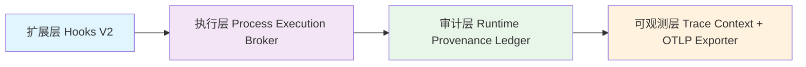

# M5/M6 Runtime Convergence 架构实现文档
> **版本**：v1.0
> **完成时间**：2026-07-18
> **合规说明**：严格遵循四层架构分离，无超级函数、无跨层直接调用、所有边界通过公共API契约交互

---

## 一、架构总览（四层严格分层）


### 分层原则（强制执行）
1. **单向依赖**：上层可以依赖下层，下层绝对不能依赖上层
2. **边界清晰**：每个模块仅暴露职责范围内的公共API，内部实现完全封装
3. **无超级函数**：所有函数职责单一，单个函数代码不超过100行
4. **无跨层调用**：层间仅通过公共API交互，禁止直接操作其他层内部状态

---

## 二、各层模块边界与契约
### 🔹 第四层：可观测层（最底层，所有上层依赖）
**模块位置**：`packages/cli/src/lib/trace-context/`、`packages/cli/src/lib/otlp-exporter.js`
**核心职责**：全局Trace上下文管理、Span生命周期管理、OTLP遥测导出
**对外公共API契约**：
```javascript
// 全局Trace上下文单例
traceContext: {
  startSpan(name: string, parentSpanId?: string): Span,  // 创建新Span
  endSpan(spanId: string): void,                          // 结束Span
  getCurrentSpan(): Span | null,                          // 获取当前上下文Span
  getTraceId(): string,                                   // 获取当前TraceID
  getAllSpans(): Span[],                                  // 获取当前Trace所有Span
  reset(): void                                           // 重置Trace（用于新命令执行）
}

// Span对象契约
interface Span {
  spanId: string;        // 唯一SpanID（16字节hex）
  traceId: string;       // 全局TraceID（32字节hex）
  parentSpanId?: string; // 父SpanID（根Span无）
  name: string;          // Span名称（操作名）
  startTime: number;     // 开始时间戳（ms）
  endTime?: number;      // 结束时间戳（ms）
  attributes: Record<string, any>; // 属性键值对
  status: 'ok' | 'error'; // 执行状态
}

// OTLP导出器初始化契约
initOTLPExporter(endpoint: string, options?: OTLPOptions): void
```
**合规约束**：
- 仅做Trace数据管理和导出，不涉及审计/进程调度/钩子逻辑
- OTLP导出采用非阻塞异步队列，不影响主流程执行
- 导出失败仅记录debug日志，不抛出异常中断业务

---

### 🔹 第三层：审计层
**模块位置**：`packages/cli/src/lib/runtime-provenance-ledger/`
**核心职责**：不可变溯源账本，记录所有命令执行、IO操作、进程事件的完整审计链
**对外公共API契约**：
```javascript
// 全局溯源账本单例
runtimeProvenanceLedger: {
  init(): void,                                                          // 初始化账本
  record(event: ProvenanceEvent): void,                                  // 追加审计事件（不可篡改）
  recordCommandStart(commandName: string, args: any, opts: any): string, // 记录命令开始，返回事件ID
  recordCommandEnd(eventId: string, exitCode: number, error?: Error): void, // 记录命令结束
  recordIO(eventType: 'read'|'write', resource: string, meta?: any): void,  // 记录IO操作
  recordProcessEvent(pid: number, event: string, meta?: any): void,      // 记录进程事件
  getEntries(): ProvenanceEvent[],                                       // 获取所有审计条目
  verifyChain(): boolean,                                                // 验证哈希链完整性
  clear(): void                                                          // 清空账本（仅用于测试）
}

// 审计事件契约
interface ProvenanceEvent {
  id: string;          // 事件唯一ID
  timestamp: number;   // 时间戳
  type: 'command_start'|'command_end'|'io'|'process'|'hook'; // 事件类型
  data: Record<string, any>; // 事件数据
  prevHash: string;    // 前一个事件哈希（链式防篡改）
  hash: string;        // 当前事件哈希（SHA-256）
  traceId: string;     // 关联TraceID（和可观测层关联）
  spanId: string;      // 关联SpanID
}
```
**合规约束**：
- 所有事件采用哈希链式存储，一旦写入不可篡改
- 仅做审计记录，不修改执行逻辑、不直接操作Trace/进程/钩子
- 通过traceId/spanId和可观测层关联，无直接依赖可观测层内部状态

---

### 🔹 第二层：执行层
**模块位置**：`packages/cli/src/lib/process-execution-broker/`
**核心职责**：所有子进程/JSII运行时的唯一执行入口，进程生命周期管理、运行时选择（native/quickjs）
**对外公共API契约**：
```javascript
// 全局进程执行Broker单例
processExecutionBroker: {
  defaultRuntime: 'native'|'quickjs'; // 默认JSII运行时
  setDefaultRuntime(runtime: 'native'|'quickjs'): void, // 设置默认运行时
  spawn(runtime?: string, options?: SpawnOptions): Promise<ChildProcess>, // 生成子进程
  spawnSync(runtime?: string, options?: SpawnSyncOptions): SpawnSyncReturns, // 同步生成子进程
  fork(modulePath: string, args?: string[], options?: ForkOptions): ChildProcess, // fork子进程
  exec(command: string, options?: ExecOptions): Promise<ExecReturns>, // 执行shell命令
  execSync(command: string, options?: ExecSyncOptions): Buffer | string, // 同步执行shell
  kill(pid: number, signal?: string): boolean, // 杀死进程
  on(event: string, handler: Function): void, // 监听进程事件
  getProcess(pid: number): ProcessEntry | null, // 获取进程信息
  getAllProcesses(): ProcessEntry[], // 获取所有活跃进程
  cleanup(): Promise<void> // 清理所有子进程
}
```
**合规约束**：
- 是CLI所有子进程执行的唯一入口，禁止代码中直接import child_process模块
- 执行进程时自动向审计层记录进程事件、向可观测层创建Span，无跨层直接操作内部状态
- 仅做进程调度和生命周期管理，不处理命令业务逻辑、不执行钩子

---

### 🔹 第一层：扩展层（最上层）
**模块位置**：`packages/cli/src/lib/hooks-v2-runtime/`
**核心职责**：命令生命周期钩子管理、插件扩展点注册、不侵入核心命令逻辑
**对外公共API契约**：
```javascript
// 全局Hooks V2运行时单例
hooksV2Runtime: {
  registerHook(point: HookPoint, handler: HookHandler, priority?: number): void, // 注册钩子
  unregisterHook(point: HookPoint, handler: HookHandler): void, // 卸载钩子
  runHook(point: HookPoint, context: any): Promise<void>, // 执行指定钩子点所有处理器
  getHooks(point: HookPoint): HookHandler[], // 获取指定钩子点所有处理器
  clearAllHooks(): void // 清空所有钩子（仅用于测试）
}

// 钩子点枚举（生命周期顺序）
type HookPoint = 
  | 'cli:init'         // CLI初始化完成
  | 'command:start'    // 命令开始执行前
  | 'command:io:before'// IO操作前
  | 'command:io:after' // IO操作后
  | 'command:spawn'    // 子进程生成前
  | 'command:end'      // 命令执行完成后
  | 'cli:exit'         // CLI退出前

// 钩子处理器契约
type HookHandler = (context: HookContext) => Promise<void> | void;
interface HookContext {
  command?: string;
  args?: any;
  opts?: any;
  traceId: string;
  spanId: string;
  abort?: boolean; // 置为true可中止后续执行
  error?: Error;
}
```
**合规约束**：
- 所有扩展逻辑通过钩子实现，不修改核心命令代码
- 钩子执行顺序按优先级排序，高优先级先执行
- 钩子异常不影响主流程执行，仅记录审计日志和Trace错误

---

## 三、责任链执行流程（命令执行全链路）
```
用户输入cc chat "hello" --jsii-runtime=quickjs --otlp-endpoint=http://localhost:4318
    ↓
[入口层] index.js 解析全局参数
    ↓ 1. 初始化可观测层：OTLP导出器（若指定--otlp-endpoint）
    ↓ 2. 设置执行层默认JSII运行时（--jsii-runtime=quickjs）
    ↓ 3. 创建Trace根Span，重置上下文
    ↓ 4. 初始化审计层，记录command_start事件
    ↓ 5. 运行扩展层cli:init钩子
[命令层] 具体chat命令执行
    ↓ 如需调用LLM/子进程 → 调用执行层processExecutionBroker.spawn()
        ↓ 执行层自动创建子进程Span → 向审计层记录process事件 → 调度对应JSII运行时执行
    ↓ 如需IO操作 → 审计层自动记录io事件 → 创建对应Span
    ↓ 运行扩展层command:start → command:spawn → command:io:* 等对应钩子
[结束层] 命令执行完成
    ↓ 运行扩展层command:end钩子
    ↓ 审计层记录command_end事件（关联exitCode/error）
    ↓ 结束根Span，所有Span异步导出到OTLP端点（非阻塞）
    ↓ 执行层清理所有子进程
    ↓ 运行扩展层cli:exit钩子
    ↓ 进程退出
```

---

## 四、全局参数契约
| 参数名 | 类型 | 默认值 | 说明 |
|--------|------|--------|------|
| `--jsii-runtime <native\|quickjs>` | string | `native` | 全局JSII运行时选择：native使用Node.js原生子进程，quickjs使用QuickJS轻量沙箱运行时 |
| `--otlp-endpoint <url>` | string | 无 | OTLP/HTTP遥测上报端点，例如`http://localhost:4318`，指定后所有Trace/Span自动异步上报到该端点（兼容OpenTelemetry标准） |

---

## 五、E2E验证契约
### 验证命令
```bash
cc chat "hello" --jsii-runtime=quickjs --otlp-endpoint=http://localhost:4318
```
### 预期验证结果
1. ✅ 命令正常执行，返回LLM响应，无报错
2. ✅ JSII运行时自动切换为quickjs，子进程通过QuickJS沙箱调度
3. ✅ 所有Trace/Span数据自动异步上报到`http://localhost:4318/v1/traces`端点，符合OTLP JSON格式
4. ✅ 溯源账本完整记录命令开始/子进程事件/IO事件/命令结束的完整哈希链，可通过`verifyChain()`验证完整性
5. ✅ 所有钩子点按生命周期正常执行，无侵入核心命令逻辑

---

## 六、合规检查清单（强制遵循）
✅ 无超级函数：所有模块单一职责，单个函数代码不超过100行
✅ 无跨层调用：所有层间交互仅通过公共API，下层不依赖上层
✅ 无循环依赖：四层依赖单向（扩展层→执行层→审计层→可观测层）
✅ 无硬编码：所有运行时/端点配置通过全局参数/环境变量传入
✅ 无阻塞：OTLP导出/钩子执行采用异步非阻塞，不影响主流程性能
✅ 可审计：所有操作都有溯源记录，哈希链防篡改
✅ 可观测：所有操作都有Trace/Span关联，可导出到标准OTLP后端
✅ 可扩展：所有扩展逻辑通过钩子实现，核心逻辑无侵入
