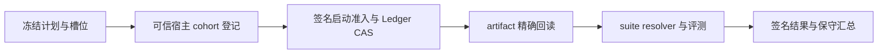

# Agent 运行时与评测证据增量设计（2026-09-26）

本次按 `main@a231bc79df9661ea2fbcbbb9e806661b54299113` 核对代码和 Git 记录。本文补充系统主设计、模块 110 的发行边界和模块 112 的评测证据设计；历史验收只适用于其记录的提交。

## 发行与源码身份

| 组件                    | 2026-09-26 回读状态                              | 精确源码                                   |
| ----------------------- | ------------------------------------------------ | ------------------------------------------ |
| npm CLI                 | `0.166.76`，`latest`，标签 `v-npm-0-166-76`      | `b9d64ffd92106681d6e71451d87bbf13eacc9b28` |
| Open VSX                | `0.37.117` 已公开，推荐 CLI `0.166.76`           | `f88fb58fc3`                               |
| JetBrains Marketplace   | 公开列表为 `0.4.137`，内置推荐 CLI `0.166.74`    | `0bc6186742`                               |
| JetBrains 新版          | `0.4.138` 已完成发布工作流，尚未在公开列表回读到 | `f88fb58fc3`                               |
| Desktop / Android / iOS | 独立产品发行 `v5.0.3.138`                        | `eb48ffa311`                               |

CLI 精确提交的 [CLI CI](https://github.com/chainlesschain/chainlesschain/actions/runs/36211826047)、[Strict Sandbox](https://github.com/chainlesschain/chainlesschain/actions/runs/36211825883) 已通过全部配置的 Linux、Windows、macOS 任务；[npm OIDC 发行](https://github.com/chainlesschain/chainlesschain/actions/runs/36215737936)与[独立公开安装回读](https://github.com/chainlesschain/chainlesschain/actions/runs/36216267726)成功。[Open VSX 发布](https://github.com/chainlesschain/chainlesschain/actions/runs/36216442080)及 [JetBrains 发布](https://github.com/chainlesschain/chainlesschain/actions/runs/36216442040)工作流成功，但后者的上传成功不能替代公开 listing。Microsoft Marketplace 仍无公开发行。

## PM 效果证据与保守统计

`6019e9f95f` 引入的 PM effect 工作流先冻结 v2 计划、seed、任务族群、baseline/candidate 预算和 cohort slot manifest，再对收集结果复算。`packages/cli/scripts/pm-exploration-effect.mjs` 提供 `plan`、`inspect`、`report`、`verify`、`slots`、`verify-slots` 六个离线入口；输入只读、输出为 JSON，不执行模型调用。

`pm-exploration-benchmark.js` 与 `evolution-eval-gate.js` 将逐项签名报告、准备阶段 settlement 归因和 Eval 执行用量绑定到计划与槽位。缺失、拒绝、失败或尚未解析的运行不能从冻结分母中删除。签名零执行预检拒绝可以记录零执行用量，但不代表整个实验没有准备成本。已认证执行小计不能宣称覆盖全部 provider/tool 账单。

摘要一致只能证明字节绑定；事前登记时间、签名信任根、外部回执和实际启动全集仍需独立认证。离线统计过门不会授予 Pilot、Skill 发布或 active promotion 权限。

## Eval 启动准入与 cohort 登记

`99cac45a06` 在 `EvolutionEvalGate` 的 `run`、`runWithEvidence`、`runWithFailureEvidence` 共用路径中加入可选的 `launchAdmission`。每次生成独立 `runId/runNonce` 后，必须先完成计划摘要核对、Ed25519 签名、Ledger CAS 占槽和 artifact 耐久精确回读，才可调用 suite resolver。重复启动、跨截止时间、存储不一致或签名错误均在 suite 执行前拒绝。

`084941234b` 进一步提供 `evolution-eval-cohort-enrollment.js`。Skill Target Matrix 在 `launchAdmissionMode: "enrolled-cohort"` 模式下检查各目标的 tenant、登记摘要与启动绑定，拒绝混用登记或缺失绑定；恢复只回读已提交证据，不重新授权启动。

上述入口是宿主集成能力，尚无目标部署强制接管全部实际启动的证据。`cohortCompletenessAuthenticated` 与 `promotionAuthority` 不能由单槽准入推导为真。真实 PM 对照、完整准备成本、真实 provider 账单和 Pilot 验收仍待完成；G08 保持部分完成，automatic active promotion 保持 HOLD。

## 运行时可靠性修复

| 提交                       | 问题与处理                                                                                                                       | 保持的边界                         |
| -------------------------- | -------------------------------------------------------------------------------------------------------------------------------- | ---------------------------------- |
| `3083393523`               | 调查循环将 Git/CI 查询、日志解析和仓库检查统一计入进度，压缩后保留已有证据；Windows Bash 经 stdin 传入源码，避免临时路径解释错误 | 命令审批和沙箱不变                 |
| `f51ed9d776`               | 抽取无依赖的 `evolution-eval-contracts.js`，消除循环导入在初始化前读取 attestation purpose 的错误                                | Gate 原有导出和合同不变            |
| `e8fd51d10c`、`b9d64ffd92` | 文件锁交接记录已完成 release；原 owner 清理不得删除新 owner 的锁，也不得在事务已提交后误报 lost ownership                        | 身份校验和竞争串行化仍生效         |
| `2e7266d76b`、`f88fb58fc3` | JetBrains UI 测试按 dialog 所属窗口关闭，并保留标题字符串类型                                                                    | 属于测试可靠性修复，无新增用户权限 |

## 验证与部署验收

定向回归覆盖 fresh-process 导入次序、真实文件锁并发交接、cohort 绑定、签名篡改、CAS 冲突、丢失应答恢复和离线报告复算。当前公开 CLI 的完整三系统门禁见本文发行记录；源码测试使用的 authority 与存储替身不代替生产密钥、独立 witness/grader、断电耐久或跨主机灾备验收。

## 相关设计

- [系统设计主文档](系统设计_主文档.md)
- [模块 110：发行与运行时边界](modules/110-agent-platform-release-boundaries.md)
- [模块 112：受治理 Skill 演进](modules/112-governed-skill-evolution-design.md)
- [发布与升级指南](https://docs.chainlesschain.com/chainlesschain/agent-platform-release.html)
- [PM 效果评测用户指南](https://docs.chainlesschain.com/chainlesschain/pm-effect-evaluation.html)
