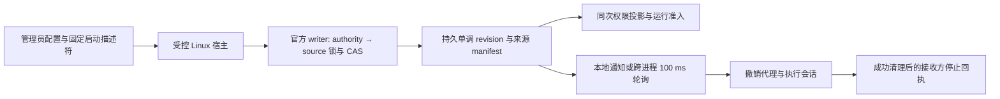
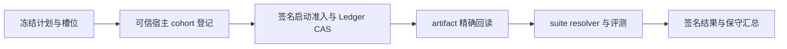

# Agent 运行时与评测证据增量设计（2026-09-26）

> 当前状态已更新至[2026-10-05 增量设计](agent-runtime-update-2026-10-05.md)：公开 CLI 0.166.86、Open VSX 0.37.131、JetBrains 0.4.149；以下按日期保留历史快照。

## 2026-10-04 历史：公开发行、耐久权限接线与 IDE 图片边界

源码核对基线为 `main@443a74596248394d7d03371e176c7ec85acf1b66`。公开 CLI **0.166.85** 与 Open VSX **0.37.130** 绑定 `84f204db944d92124d95b2348814ac562bde5841`；JetBrains 公开版仍为 **0.4.146@d93c9c9766**，推荐 CLI `0.166.84`，源码候选为 **0.4.149**。Desktop/Android/iOS 继续独立发行 `v5.0.3.138`。

最新冻结候选 `b2aa3aba08` 配对 CLI **0.166.86**、VS Code **0.37.131**、JetBrains **0.4.149**，均待准确提交完整发布门和公共回读。新增 canonical Memory v2 分片：保留单文件 64 MiB，活动 bucket 合计上限 1 GiB；旧 v1 客户端拒绝 v2，降级需兼容快照，默认 shadow 不迁移。Windows formal 的 1K/10K/100K 新进程重开、读取、更新、删除与审计后验已验证；100K 点读 p95 110.072 ms、全量查询 p95 13,954.915 ms，不能据此宣称索引或全局 SLO。Windows 超过 260 字符的图片草稿路径创建与清理已修复；这些是发布后的源码进展。

最新容量、ARM64 真容器独立回读与 updater 诊断见[实施状态](https://github.com/chainlesschain/chainlesschain/blob/main/docs/research/cli-ide-gap-implementation-2026-09-27.md)。旧 ARM64 失败与新独立诊断成功均保留：先行安装器/Bash/测试顺序尚未对齐，不能推导原失败的唯一原因或完整 native 发布门已通过。

### 发行与验收

`84f204db94` 的 [CLI CI](https://github.com/chainlesschain/chainlesschain/actions/runs/37182926499) 68/68、[Strict Sandbox](https://github.com/chainlesschain/chainlesschain/actions/runs/37182926341) 5/5、[IDE Extensions](https://github.com/chainlesschain/chainlesschain/actions/runs/37182926528) 18 成功/1 预期跳过均通过；[OIDC 发布](https://github.com/chainlesschain/chainlesschain/actions/runs/37186498386)与 [Open VSX 发布](https://github.com/chainlesschain/chainlesschain/actions/runs/37187468724)成功。公共 tarball/VSIX 与不可变制品字节一致；13 个子包与源码及内部版本声明已复查。此门禁仅属于该精确提交。

公开 CLI 加入有界耐久记忆、scoped 权限安全 revision、有限资源的真实打包请求与异步 updater ready 等待；公开 VS Code 包含长回复的有界追加、选择保持及图片草稿页面实例隔离。JetBrains `0.4.147` 发布测试发现诊断 debounce/flush 重复提交，未发布；`fe8de1b830` 在 `0.4.148` 修复并增加确定性交错回归，本机完整 JUnit 929 项、0 失败、3 平台跳过不替代发布门。

六平台 [native 复验](https://github.com/chainlesschain/chainlesschain/actions/runs/37189753288)有五个平台成功；Windows ARM64 构建及 version/status 通过，但 updater 完整文件 64 通过/5 失败，汇总跳过，整轮失败。没有签名 native 制品发行或六平台通过结论。较早主线 `a72aa19828` 的 [Strict Sandbox](https://github.com/chainlesschain/chainlesschain/actions/runs/37192116215)已失败，CLI CI/IDE 门仍需独立核对，不能沿用公开发行的成功。

### NET-02：显式 Linux 持久权限宿主

`21a76756a5` 的 `packages/cli/src/runtime/permission-authority-host.js` 接通 settings/scoped 官方写口、同次观察的权限投影、provider 和 headless/stream runner。此源码晚于 npm `0.166.85`，普通 CLI 没有默认开启开关。管理员先在真实、私有且排除所有工作区与可写根的目录中配置 domain；固定启动描述符绑定 context、发现输入与 settings/scoped 路径，经可信通道交给每个进程/Worker。Windows/macOS 明确拒绝持久域初始化与重开。

官方写口先取 authority 锁，再取 source 锁，并使用准备阶段捕获的准确 revision/CAS，避免丢失并发 writer 更新。settings 和 scoped 从同次已验证观察投影，环境与 expiry 投影后再检查。官方 deny→revoke 即使恢复原规则也消耗单调修订，不复活旧执行许可；未绑定 writer 或原始文件修改会破坏 source manifest，拒绝继续授权。

本进程同步锁存撤销；跨进程/Worker 每 **100 ms** 轮询持久状态，调度可能延迟。writer 成功返回不证明全部接收方已停止。Docker egress 的 `authorityFailure.stopAcknowledgement` 仅在 proxy abort 与 session close 成功、清理全部结束且监控停止后产生；使用不可变 `stopIdentity` 对照唯一 `receiverId`、`sessionId` 和准入 `policyVersion`。旧回执不能释放其他接收方；清理失败不发回执。

```mermaid
flowchart LR
  A[管理员配置与固定启动描述符] --> H[受控 Linux 宿主]
  H --> W[官方 writer: authority → source 锁与 CAS]
  W --> D[持久单调 revision 与来源 manifest]
  D --> P[同次权限投影与运行准入]
  D --> R[本地通知或跨进程 100 ms 轮询]
  R --> C[撤销代理与执行会话]
  C --> S[成功清理后的接收方停止回执]
```

原生 child/Worker 与代理探针不等于 Docker 强制出口验收；新提交的 Linux x64/ARM64 真实容器门仍须通过。不承诺非协作 ABA、敌对同 UID 回滚、受损宿主、分布式 quorum、自动注册/迁移/恢复或所有 legacy callback。管理员调用示例、错误码与恢复合同见 [受控宿主指南](https://github.com/chainlesschain/chainlesschain/blob/main/docs/cli/NET02_CONTROLLED_HOST.md)。NET-02 继续局部完成。

### IDE：页面草稿隔离与发布后的图片解码预算

公开 VS Code `0.37.130` 每次脚本执行生成页面 ID，并同时校验当前 HTML nonce；Reload Webviews 复用 HTML 时仍区分实例。save/restore/discard/check 与 ACK 绑定页面，manifest rename 前重验实例，过期写入清理本次新图；空草稿先提交 manifest 移除再完成图片清理。恢复不会自动发送。

发布后的 `48fd92562a` 在预览解码前解析 PNG/JPEG/GIF/WebP 容器，校验完整性、画布与动画帧预算；累计不超过 **200 帧 / 4000 万解码画布像素**，包含 fallback 画布。VS Code 与 JetBrains 的文件附件使用有界快照并检查文件身份/前后状态。40px CSS 缩略图尺寸不能充当解码资源上限；这些源码保护尚未纳入已公开 VSIX/ZIP，不推导全局性能 SLO 或所有图片路径已认证。

实施 SHA、原始报告与失败日志见 [共享实施状态](https://github.com/chainlesschain/chainlesschain/blob/main/docs/research/cli-ide-gap-implementation-2026-09-27.md)。真实 PM 收益、完整启动与成本证据、真人辅助技术及 automatic active Skill promotion 仍未验收。

以下 2026-10-02 与更早章节保留历史时点。

## 2026-10-02：作用域撤销与 settings 事务基础

**2026-10-02 当前核对**：源码 `main@2bfaea2fa9`；公开 CLI `0.166.84@d93c9c9766`、Open VSX `0.37.126`、JetBrains `0.4.146`，两个 IDE 均推荐 CLI `0.166.84`。发布提交的 CLI CI 68/68 作业、Strict Sandbox 五个配置作业及 IDE 宿主矩阵通过；npm OIDC/provenance 与公共包字节回读成功，两个插件均已公开。公开版包含 WS 策略修订、无人值守入口、冻结工具上限，以及同一进程/模块实例内官方 settings 和 scoped 权限写口的同步 Shell 撤销；恢复原规则不能复活旧许可。设置来源只读观察与显式 Linux 事务基础已在代码中，但事务基础尚未接入默认权限准入或官方 settings writer。跨进程/Worker 即时通知、任意外部编辑与 legacy callback 仍未闭合。产品发行保持独立 v5.0.3.138；真实 PM 收益、完整启动覆盖和总成本未认证，自动晋升保持 HOLD。

[CLI CI](https://github.com/chainlesschain/chainlesschain/actions/runs/36996293721)、[CLI Strict Sandbox](https://github.com/chainlesschain/chainlesschain/actions/runs/36996293555)和 [npm OIDC 发布](https://github.com/chainlesschain/chainlesschain/actions/runs/37007309162)成功。CLI CI 的 68 个作业全部通过，Strict 的 Linux x64/ARM64、Windows、macOS 15/latest 五个作业全部通过；[独立公共回读](https://github.com/chainlesschain/chainlesschain/actions/runs/37012507322)确认 tarball 与工作流产物字节一致。 [IDE 精确提交宿主门](https://github.com/chainlesschain/chainlesschain/actions/runs/36996293161)、[Open VSX 发布](https://github.com/chainlesschain/chainlesschain/actions/runs/37013013953)和 [JetBrains 发布](https://github.com/chainlesschain/chainlesschain/actions/runs/37013013151)成功。2026-10-02 独立商店回读确认 Open VSX `latest=0.37.126`，JetBrains `0.4.146` 为 `approve/listed=true`、`hidden=false`；两个 IDE 均推荐 CLI `0.166.84`，源码同为 `d93c9c9766`。

### 同步撤销接线

`d93c9c9766` 将 `ScopedPermissionStore.add/revoke` 的写入放在严格文件锁内；验证、CAS、容量和锁准入完成后，持久写入前推进私有进程级 revision 并同步通知。通知前固定文件目标、workspace 副本与依赖；回调重入的读取/写入直接拒绝。内容未变化的重复撤销不写文件、不推进 revision。确定未提交的失败仍保留新 revision；已提交但锁清理失败明确报告 committed；rename 后持久化未知锁存 invalid，恢复旧文件也不能恢复权限。

`permission-authority.js` 组合 settings/scoped 两个 owner 的稳定快照，在读取前后核对各自修订；显式 baseRules 保留替换 scoped 规则的语义。现有 Shell 生命周期在首次 await 前绑定许可，并覆盖审批、Broker 启动、容器创建、运行及回执。已建立代理同步锁存撤销并开始关闭，迟到容器不执行，旧结果不能签发成功回执；结束后移除两层订阅。通知保守覆盖同一模块实例的全部项目，不承诺独立终端、Worker、未知 callback 或外部编辑的即时通知。

### 来源观察与显式事务 API

`4569eb98dc` 的 `inspectSettingsSources()` 返回有序候选的只读 inventory，包含缺失、重复、未贡献权限的来源及物理文件/最近存在父目录的身份和摘要；`19335b8d04` 补齐最终 fstat 的冻结 fileIdentity。观察不注册外锚、不推进 generation、不授予权限，也不证明整个 inventory 的原子快照。默认 loadSettings 行为保持既有接线。

`settings-authority-record.cjs` 是纯记录协议，校验完整 context manifest、inverse physical heads、别名、epoch/generation 与 guard 证明，不做 I/O 或权限准入。`settings-authority-domain.cjs` 是显式、协作型 Linux 持久化 API，要求预先持久化的私有外部目录与完整 rollbackable config/admitted writable roots；固定目录 FD 与 namespace witness，严格按 authority → settings source 顺序加锁。没有默认目录或隐式 enrollment。

写入顺序为同步 local revoke → durable guard → prepared ledger → settings replace → ready ledger → guard unlink + directory fsync。fresh reader 重读 ledger A/B、完整来源、guard/namespace，并 bracket 本地 revision；显式恢复绑定原 transactionId 与完整 before/after 内容。恢复旧内容也消耗保留的 generation，ready 清理必须反算完整 digest，缺失、损坏和 neither 状态失败闭合。settings commitState 与 authority readiness 分别报告。

这两个事务模块已随源码包含，但尚未接入默认权限准入或官方 settings writer；Windows/macOS 无等价持久屏障时拒绝该 API。合作进程、Worker 的描述符传递能力不等于现有运行时已使用它。敌对同 UID 删除/回滚整个外锚、原始 settings 在观察间的 ABA 与 parent swap-and-restore 仍不在证明内。

### 验收与制品身份

发布精确 SHA 的 CLI CI 为 68/68 作业成功，Strict 为五个配置作业成功。独立 ARM64 原始 Docker 报告为 20/20、0 跳过，新增 scoped-revoke/scoped-deny-aba 两条真实持续隧道撤销轨迹；x64 对应步骤成功，但未独立回读专项 JSON，不能扩展为所有原始报告零跳过。npm 公共 tarball SHA-256 为 `16b153ddae4738a17e7ade4e86a256ffff8acaf3382b5b559c2be67c9552ff12`，签名来源绑定同一提交/tag/run。子包复用先完成公共字节审计与 registry-only 安装，再发布 CLI，之后发布 IDE。

JetBrains 首次回执仅证明上传成功、尚不可见；2026-10-02 后续独立商店查询确认 0.4.146 已批准并上架，保留原回执时点。上述 CLI/IDE 门禁不转移为独立 v5.0.3.138 安装包或未完成的生产 PM/Skill 晋升资格。

## 2026-10-01 历史核对：调查恢复与执行策略源码边界

**2026-10-01 历史核对**：源码 `main@e96062008f`；公开 CLI `0.166.82@1954ba867d`、Open VSX `0.37.124`、JetBrains `0.4.144`，两个 IDE 均推荐 CLI `0.166.82`。CLI 精确提交的 CI、Strict Sandbox（含 Linux ARM64）和 npm 发布流程均成功。公开版恢复 Issue/CI 调查并在压缩、重启和任务交接中保留测试失败证据；继承 Plan/ApprovalGate 与 Auto Mode 修订。发布后的 WS 宿主策略、无人值守入口、冻结工具上限和官方 settings 写口撤销属于源码增量，尚未进入该 npm 制品；当前主线 CI/Strict 为 failure。外部编辑、跨进程修订与 legacy callback 仍未闭合。真实 PM 收益、完整启动覆盖和总成本未认证，自动晋升保持 HOLD。

[CLI CI](https://github.com/chainlesschain/chainlesschain/actions/runs/36746102772)、[CLI Strict Sandbox](https://github.com/chainlesschain/chainlesschain/actions/runs/36746102363)和 [npm OIDC 发布](https://github.com/chainlesschain/chainlesschain/actions/runs/36798445319)均成功，前两者已通过精确发布提交全部配置任务，Strict 包括 Linux x64/ARM64、Windows 和 macOS。公共 registry 已回读版本、latest 与 integrity。 IDE 发布源码为 `fb267f569d6235307a495cd0438977bbda4e1ef6`：[VS Code 宿主与发布](https://github.com/chainlesschain/chainlesschain/actions/runs/36807095974)和 [JetBrains 宿主与商店回读](https://github.com/chainlesschain/chainlesschain/actions/runs/36807095586)成功。JetBrains 公共 API 为 `approve/listed=true`、`hidden=false`；Microsoft Marketplace 未发行。

| 提交                        | 行为与适用范围                                                                                                                                                      | 发行及验证边界                                                                                                                                                                                                              |
| --------------------------- | ------------------------------------------------------------------------------------------------------------------------------------------------------------------- | --------------------------------------------------------------------------------------------------------------------------------------------------------------------------------------------------------------------------- |
| `1954ba867d` / CLI 0.166.82 | Issue、artifact 下载和日志解析统一调查预算；重复 Issue 跨路由归一，PR/run 保持独立；测试失败断言、源码位置和 verdict 在压缩、重启、交接中保留；修正 GitHub 工具路由 | 已公开；精确提交 CI/Strict/npm 成功                                                                                                                                                                                         |
| `46505a2e4b`                | 扩展 TCP/UDP × IPv4/IPv6 DNS 正反对照与真实 Auto Mode 撤销探针                                                                                                      | 发布后源码；ARM64 独立原始报告 14/14、0 跳过，仅证明所测路径                                                                                                                                                                |
| `399ebe5984`                | WS owner/revision 同步提交；ABA 变化撤销旧许可；DB/canonical 恢复保留策略，失败撤销 owner；子代理继承父动态限制                                                     | 发布后源码；该提交 Strict 五作业成功，ARM64 原始报告 16/16、0 跳过；不转移为后续提交验收                                                                                                                                    |
| `1283f39fd7`                | 实际 runner/stream/REPL/child 入口执行无人值守动作分类，发布、合并、部署及外部消息需满足既有策略                                                                    | 发布后源码；该提交 Strict 成功；分类不隔离 npm 脚本或 Git helper 的间接副作用                                                                                                                                               |
| `a519ee9404`                | 首次 await 前深复制冻结静态配置；allow 交集、deny 累加；空工具列表 deny-all；child 不能扩大父工具和目录权限                                                         | 发布后源码；本地定向回归；精确 CI/Strict cancelled                                                                                                                                                                          |
| `e96062008f`                | 官方 `addRule()` 在写入前提交进程内 revision 并同步锁存 shell 撤销；审批、启动、运行及回执保留重验；不确定落盘拒绝重新授权                                          | 发布后源码；[CLI CI](https://github.com/chainlesschain/chainlesschain/actions/runs/36818263238)与 [Strict Sandbox](https://github.com/chainlesschain/chainlesschain/actions/runs/36818262980)为 failure，不宣称完整矩阵通过 |

调查元数据读取成功、日志下载成功和修复验证成功是不同证据；无关命令报错不会抹掉已验证记录。模型应由已知断言和源码提出可证伪假设，再执行定向复现和验证；PR 合并或诊断重试通过不等于原问题解决。重复读取的恢复预算仍有界，不保证任意任务自动完成。

官方 settings 修订仅覆盖同一执行环境、同一模块实例中通过 `addRule()` 开始的修改，保守撤销该进程所有 settings provider 的 shell。同步保证是锁存并启动清理，容器退出仍异步；文件恢复原内容也不恢复旧许可。跨进程/worker、外部编辑、其他写口、ScopedPermissionStore、持久 generation 与 legacy sampled callback 尚未闭合。静态冻结不替代持续动态授权。完整状态和原始证据见[CLI/IDE 实施记录](https://github.com/chainlesschain/chainlesschain/blob/main/docs/research/cli-ide-gap-implementation-2026-09-27.md)。

以下 2026-09-30 与更早章节保留其历史时点。

## 2026-09-30：策略修订、公开发行与发布后的 Auto Mode 修复

核对源码 `main@012cefe7acbf54e3d9d4cec7963854a785866ab1` 与 Git 标签：公开 npm `chainlesschain@0.166.81` 的 `v-npm-0-166-81` 固定为 `a63101f3cc32f4cbdc644a6f0d9d1295589fe380`。[CLI CI](https://github.com/chainlesschain/chainlesschain/actions/runs/36704892264) 与 [CLI Strict Sandbox](https://github.com/chainlesschain/chainlesschain/actions/runs/36704891847)已通过该精确提交的全部配置任务，Strict 包括 Linux x64/ARM64、Windows 和 macOS。npm 公共 registry 已回读 `latest`、版本和 integrity；[npm 发布工作流](https://github.com/chainlesschain/chainlesschain/actions/runs/36715700885)当前结论仍为 failure，不能写成发布流程全绿或精确制品验收闭环。Open VSX `0.37.123` 和 JetBrains `0.4.143` 均已公开并推荐 CLI `0.166.81`，源码为 `165093796d286f45387d54c7d3ac887465192d48`；[VS Code 宿主与发布门](https://github.com/chainlesschain/chainlesschain/actions/runs/36725119550)和[JetBrains 宿主与商店回读](https://github.com/chainlesschain/chainlesschain/actions/runs/36725120159)分别通过。Session Core `0.3.14` 已公开，产品安装包仍按 `v5.0.3.138` 独立发行。

| 提交 / 组件                           | 实现与适用范围                                                                                          | 证据边界                                                     |
| ------------------------------------- | ------------------------------------------------------------------------------------------------------- | ------------------------------------------------------------ |
| `e89474dcf4` / Plan                   | 在首个异步 shell 权限读取前捕获计划快照，执行中订阅已提交修订；旧快照不能继续授权                       | 已进入 CLI 0.166.81                                          |
| `8540d2837f` / ApprovalGate           | Session Core 0.3.14 提供会话级单调修订；变化时撤销 broker、活动连接和目标容器，拒绝成功回执             | 支持的进程内审批更新；不证明外部写入完整覆盖                 |
| `d52a33546f` / 只读投影               | Plan 快照读取不再触发修订；VS Code 模式动作使用选择器                                                   | CLI/公开 IDE 继承对应修复                                    |
| `f9081da244`、`3bbfc44275` / IDE 桥接 | Windows 桥接目录与空锁在 token 写入前应用并回读受保护单用户 ACL；验证目录后清理，保留活跃 writer 临时锁 | 已进入公开 IDE；拒绝异主目录                                 |
| `9ed9dccb0a`、`c7b10fdc9d` / ARM64    | 原生 Linux ARM64 Strict 门与按架构计算的匿名 tmpfile 标志                                               | 精确发布 SHA 的 ARM64 Strict 成功；不代表所有后端/协议已验证 |
| `b0aaa5a81f` / Auto Mode              | 执行规则深拷贝并冻结；setActive 同步递增修订并通知订阅者，REPL 切换复用同一 authority                   | 发布后的源码；415 项相关本地回归通过，未进入公开 tarball     |

Auto Mode 的新修订机制捕获激活状态变更，即使状态在轮询前恢复原值，已捕获的权限也保持撤销。回归覆盖审批等待、环境准备、目标启动、运行和回执阶段；相同值重复设置不产生新修订。legacy `isActive` callback 仍只是采样，外部 settings/宿主策略写入尚未统一到不可逆 generation，因此不能宣称所有策略变化已无遗漏覆盖。新提交的完整托管门禁必须重新核对，不能沿用 `a63101f3cc` 的成功结果。

Linux `docker-egress` 仍须显式选择、固定主/relay 镜像摘要、声明域名规则并开启网络；拒绝 strict、排除命令和细粒度额外文件规则，能力不足时失败闭合。新增真实 HTTP/WebSocket 活连接撤销与直连 UDP DNS 拒绝探针属于限定产品路径验证；其余 DNS 传输、网络协议、长期运行和目标环境仍待验收。普通 Docker/bubblewrap 代理环境变量不构成强制域名边界。PM 收益、完整启动覆盖、全部成本和自动 active Skill 晋升仍为 HOLD。

以下 2026-09-29 与更早章节为历史快照。

## 2026-09-29：CLI 0.166.80 与 Docker 出站边界

按 `main@dd6b131837` 和公开渠道复核：npm `latest` 为 `chainlesschain@0.166.80`，不可变标签 `v-npm-0-166-80` 指向同一提交。该 SHA 的 [CLI CI](https://github.com/chainlesschain/chainlesschain/actions/runs/36554790810)、[CLI Strict Sandbox](https://github.com/chainlesschain/chainlesschain/actions/runs/36554998759) 和 [npm 发布及公共回读](https://github.com/chainlesschain/chainlesschain/actions/runs/36555954429)成功；npm 发布首次运行在成功上传后遇到注册表 `ETARGET` 可见性延迟，重跑完成精确字节与签名 provenance 验证。Open VSX `0.37.121`、JetBrains Marketplace `0.4.141` 已公开，制品均推荐 CLI `0.166.79`；源码 VS Code `0.37.122`、JetBrains `0.4.142` 配对 `0.166.80`，不能视为已公开商店制品。Desktop/native 仍按 `v5.0.3.138` 独立发行。

`0.166.79–0.166.80` 在既有 Agent shell 路径中加入显式选用的 `docker-egress` 后端。它只支持 Linux x64/arm64，要求显式开启 `--sandbox-network`、在 settings 的 `sandbox.network.allowedDomains` 或 `deniedDomains` 中声明域名规则，以及为主容器和 relay 容器配置 SHA-256 固定镜像；`strict` 模式、命令排除规则和细粒度额外文件路径均不支持。容器以无网络模式运行，出站流量经私有 Unix socket、relay 和独立 worker 的策略代理；代理绑定经过校验的 HTTP 目标，DNS/IP 和域名策略由 CLI 宿主执行。代理不可用、能力不满足或策略身份变化时失败闭合，不退回无沙箱 shell。

命令审批发生在 shell 分派前。运行时持续重验有效策略、插件 authority 和代理 revision；策略撤销会关闭活动连接与 shell，无法确认执行结果或清理结果时不自动重试。该机制仍需目标 Linux 主机的 Docker、网络、镜像和长期运行验证；Linux 限定的证据不能外推到 macOS/Windows，也不改变 PM/Pilot 收益和 automatic active Skill promotion 的 `HOLD`。`dd6b131837` 还修复 VS Code Agent 初始化超时后的回收与重新初始化；该修复属于尚未公开的 `0.37.122` 源码版本。

以下 2026-09-28 章节保留当时的发行快照；其中版本号不代表当前 `latest`。

## 2026-09-28 历史快照

2026-09-28 按 `main@c2ff6d036e40cfeb25cfb819fa9cef2d02055445` 核对代码、标签与公开渠道。发布标签仍指向 `3400318446`；后续主线提交 `c2ff6d036e` 修正 IDE 清单的版本配对。`24f0cb6fb1` 已包含在 CLI `0.166.78` 的发布提交中。本文补充系统主设计、模块 110 的发行边界和模块 112 的评测证据设计；历史验收只适用于其记录的提交。

## 发行与源码身份

| 组件                    | 2026-09-28 回读状态                         | 精确源码     |
| ----------------------- | ------------------------------------------- | ------------ |
| npm CLI                 | `0.166.78`，`latest`，标签 `v-npm-0-166-78` | `3400318446` |
| Open VSX                | `0.37.119` 已公开，推荐 CLI `0.166.78`      | `3400318446` |
| JetBrains Marketplace   | `0.4.140` 已批准并公开，推荐 CLI `0.166.78` | `3400318446` |
| Desktop / Android / iOS | 独立产品发行 `v5.0.3.138`                   | `eb48ffa311` |
| 逐槽 PM 对账            | `24f0cb6fb1` 已纳入公开 CLI 的源码身份      | `24f0cb6fb1` |

CLI 精确提交的 [CLI CI](https://github.com/chainlesschain/chainlesschain/actions/runs/36395803981)、[Strict Sandbox](https://github.com/chainlesschain/chainlesschain/actions/runs/36395803887) 已通过全部配置的 Linux、Windows、macOS 任务；[npm 精确提交发布](https://github.com/chainlesschain/chainlesschain/actions/runs/36412680675)成功，公共 registry `latest` 回读为 `0.166.78`。Open VSX API 回读 `0.37.119`；JetBrains 公共更新列表的 `0.4.140` 返回 `approve=true`、`listed=true`、`hidden=false`。Microsoft Marketplace 仍无公开发行。

`0.166.78` 将 CLI、VS Code 与 JetBrains 的会话历史分页、已提交消息引用及草稿恢复接入同一耐久会话记录；Stop、重启和后台完成后的 UI 状态需要与 CLI 权威记录重新对齐。Linux 外部 Agent 子进程由打包的本机 supervisor 持有并清理后代，Windows 本地目标启动保持有界 ACL/启动等待。IDE 继续只投影会话与审批结果，执行、沙箱和恢复裁决仍由 CLI 宿主负责。上述版本证据不替代目标环境长期运行或真实 PM 收益验证。

## PM 效果证据与保守统计

`6019e9f95f` 引入的 PM effect 工作流先冻结 v2 计划、seed、任务族群、baseline/candidate 预算和 cohort slot manifest，再对收集结果复算。`packages/cli/scripts/pm-exploration-effect.mjs` 提供 `plan`、`inspect`、`report`、`verify`、`slots`、`verify-slots` 六个离线入口；输入只读、输出为 JSON，不执行模型调用。

`pm-exploration-benchmark.js` 与 `evolution-eval-gate.js` 将逐项签名报告、准备阶段 settlement 归因和 Eval 执行用量绑定到计划与槽位。缺失、拒绝、失败或尚未解析的运行不能从冻结分母中删除。签名零执行预检拒绝可以记录零执行用量，但不代表整个实验没有准备成本。已认证执行小计不能宣称覆盖全部 provider/tool 账单。

摘要一致只能证明字节绑定；事前登记时间、签名信任根、外部回执和实际启动全集仍需独立认证。离线统计过门不会授予 Pilot、Skill 发布或 active promotion 权限。

提交 `24f0cb6fb1` 另外实现封存准入与**提交给接口的**逐槽签名最终回执对账，并将已认证 PM 尝试绑定到冻结槽位分母。它已纳入 `0.166.78@3400318446` 的源码身份。已准入但缺回执与未准入均保留为未解析观察，不能删去；接口不证明最终回执来源全集、全部目标启动入口覆盖、Actor 实际执行或完整成本，也不输出独立耐久效果报告。`receiptSetCompletenessAuthenticated`、`executionCoverageAuthenticated`、`cohortCompletenessAuthenticated`、`reportAuthenticated` 和 `qualifiesForPromotion` 均保持 `false`。

## Eval 启动准入与 cohort 登记

`99cac45a06` 在 `EvolutionEvalGate` 的 `run`、`runWithEvidence`、`runWithFailureEvidence` 共用路径中加入可选的 `launchAdmission`。每次生成独立 `runId/runNonce` 后，必须先完成计划摘要核对、Ed25519 签名、Ledger CAS 占槽和 artifact 耐久精确回读，才可调用 suite resolver。重复启动、跨截止时间、存储不一致或签名错误均在 suite 执行前拒绝。

`084941234b` 进一步提供 `evolution-eval-cohort-enrollment.js`。Skill Target Matrix 在 `launchAdmissionMode: "enrolled-cohort"` 模式下检查各目标的 tenant、登记摘要与启动绑定，拒绝混用登记或缺失绑定；恢复只回读已提交证据，不重新授权启动。

```mermaid
flowchart LR
  P[冻结计划与槽位] --> E[可信宿主 cohort 登记]
  E --> A[签名启动准入与 Ledger CAS]
  A --> R[artifact 精确回读]
  R --> S[suite resolver 与评测]
  S --> V[签名结果与保守汇总]
```

上述入口是宿主集成能力，尚无目标部署强制接管全部实际启动的证据。`cohortCompletenessAuthenticated` 与 `promotionAuthority` 不能由单槽准入推导为真。真实 PM 对照、完整准备成本、真实 provider 账单和 Pilot 验收仍待完成；G08 保持部分完成，automatic active promotion 保持 HOLD。

## 运行时可靠性修复

| 提交                       | 问题与处理                                                                                                                       | 保持的边界                              |
| -------------------------- | -------------------------------------------------------------------------------------------------------------------------------- | --------------------------------------- |
| `3083393523`               | 调查循环将 Git/CI 查询、日志解析和仓库检查统一计入进度，压缩后保留已有证据；Windows Bash 经 stdin 传入源码，避免临时路径解释错误 | 命令审批和沙箱不变                      |
| `f51ed9d776`               | 抽取无依赖的 `evolution-eval-contracts.js`，消除循环导入在初始化前读取 attestation purpose 的错误                                | Gate 原有导出和合同不变                 |
| `e8fd51d10c`、`b9d64ffd92` | 文件锁交接记录已完成 release；原 owner 清理不得删除新 owner 的锁，也不得在事务已提交后误报 lost ownership                        | 身份校验和竞争串行化仍生效              |
| `2e7266d76b`、`f88fb58fc3` | JetBrains UI 测试按 dialog 所属窗口关闭，并保留标题字符串类型                                                                    | 属于测试可靠性修复，无新增用户权限      |
| `8d97c58153`               | 决策 HTTP 请求与响应各限制为 256 KiB；未知模型用量不产生 Skill 建议，同一耐久会话后续决策 provider 调用被阻断                    | 决策模式默认关闭；不授予 Skill 执行权限 |

## 验证与部署验收

定向回归覆盖 fresh-process 导入次序、真实文件锁并发交接、cohort 绑定、签名篡改、CAS 冲突、丢失应答恢复和离线报告复算。当前公开 CLI 的完整三系统门禁见本文发行记录；源码测试使用的 authority 与存储替身不代替生产密钥、独立 witness/grader、断电耐久或跨主机灾备验收。

## 相关设计

- [系统设计主文档](系统设计_主文档.md)
- [模块 110：发行与运行时边界](modules/110-agent-platform-release-boundaries.md)
- [模块 112：受治理 Skill 演进](modules/112-governed-skill-evolution-design.md)
- [发布与升级指南](https://docs.chainlesschain.com/chainlesschain/agent-platform-release.html)
- [PM 效果评测用户指南](https://docs.chainlesschain.com/chainlesschain/pm-effect-evaluation.html)
