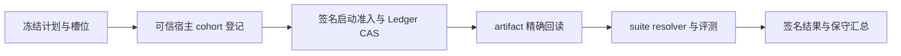

# Agent 运行时与评测证据增量设计（2026-09-26）

## 2026-09-29：CLI 0.166.80 与 Docker 出站边界

按 `main@dd6b131837` 和公开渠道复核：npm `latest` 为 `chainlesschain@0.166.80`，不可变标签 `v-npm-0-166-80` 指向同一提交。该 SHA 的 [CLI CI](https://github.com/chainlesschain/chainlesschain/actions/runs/36554790810)、[CLI Strict Sandbox](https://github.com/chainlesschain/chainlesschain/actions/runs/36554998759) 和 [npm 发布及公共回读](https://github.com/chainlesschain/chainlesschain/actions/runs/36555954429)成功；npm 发布首次运行在成功上传后遇到注册表 `ETARGET` 可见性延迟，重跑完成精确字节与签名 provenance 验证。Open VSX `0.37.121`、JetBrains Marketplace `0.4.141` 已公开，制品均推荐 CLI `0.166.79`；源码 VS Code `0.37.122`、JetBrains `0.4.142` 配对 `0.166.80`，不能视为已公开商店制品。Desktop/native 仍按 `v5.0.3.138` 独立发行。

`0.166.79–0.166.80` 在既有 Agent shell 路径中加入显式选用的 `docker-egress` 后端。它只支持 Linux x64/arm64，要求显式开启 `--sandbox-network`、在 settings 的 `sandbox.network.allowedDomains` 或 `deniedDomains` 中声明域名规则，以及为主容器和 relay 容器配置 SHA-256 固定镜像；`strict` 模式、命令排除规则和细粒度额外文件路径均不支持。容器以无网络模式运行，出站流量经私有 Unix socket、relay 和独立 worker 的策略代理；代理绑定经过校验的 HTTP 目标，DNS/IP 和域名策略由 CLI 宿主执行。代理不可用、能力不满足或策略身份变化时失败闭合，不退回无沙箱 shell。

命令审批发生在 shell 分派前。运行时持续重验有效策略、插件 authority 和代理 revision；策略撤销会关闭活动连接与 shell，无法确认执行结果或清理结果时不自动重试。该机制仍需目标 Linux 主机的 Docker、网络、镜像和长期运行验证；Linux 限定的证据不能外推到 macOS/Windows，也不改变 PM/Pilot 收益和 automatic active Skill promotion 的 `HOLD`。`dd6b131837` 还修复 VS Code Agent 初始化超时后的回收与重新初始化；该修复属于尚未公开的 `0.37.122` 源码版本。

以下 2026-09-28 章节保留当时的发行快照；其中版本号不代表当前 `latest`。

## 2026-09-28 历史快照

2026-09-28 按 `main@c2ff6d036e40cfeb25cfb819fa9cef2d02055445` 核对代码、标签与公开渠道。发布标签仍指向 `3400318446`；后续主线提交 `c2ff6d036e` 修正 IDE 清单的版本配对。`24f0cb6fb1` 已包含在 CLI `0.166.78` 的发布提交中。本文补充系统主设计、模块 110 的发行边界和模块 112 的评测证据设计；历史验收只适用于其记录的提交。

## 发行与源码身份

| 组件                    | 2026-09-28 回读状态                            | 精确源码     |
| ----------------------- | ---------------------------------------------- | ------------ |
| npm CLI                 | `0.166.78`，`latest`，标签 `v-npm-0-166-78`    | `3400318446` |
| Open VSX                | `0.37.119` 已公开，推荐 CLI `0.166.78`         | `3400318446` |
| JetBrains Marketplace   | `0.4.140` 已批准并公开，推荐 CLI `0.166.78`    | `3400318446` |
| Desktop / Android / iOS | 独立产品发行 `v5.0.3.138`                      | `eb48ffa311` |
| 逐槽 PM 对账            | `24f0cb6fb1` 已纳入公开 CLI 的源码身份        | `24f0cb6fb1` |

CLI 精确提交的 [CLI CI](https://github.com/chainlesschain/chainlesschain/actions/runs/36395803981)、[Strict Sandbox](https://github.com/chainlesschain/chainlesschain/actions/runs/36395803887) 已通过全部配置的 Linux、Windows、macOS 任务；[npm 精确提交发布](https://github.com/chainlesschain/chainlesschain/actions/runs/36412680675)成功，公共 registry `latest` 回读为 `0.166.78`。Open VSX API 回读 `0.37.119`；JetBrains 公共更新列表的 `0.4.140` 返回 `approve=true`、`listed=true`、`hidden=false`。Microsoft Marketplace 仍无公开发行。

`0.166.78` 将 CLI、VS Code 与 JetBrains 的会话历史分页、已提交消息引用及草稿恢复接入同一耐久会话记录；Stop、重启和后台完成后的 UI 状态需要与 CLI 权威记录重新对齐。Linux 外部 Agent 子进程由打包的本机 supervisor 持有并清理后代，Windows 本地目标启动保持有界 ACL/启动等待。IDE 继续只投影会话与审批结果，执行、沙箱和恢复裁决仍由 CLI 宿主负责。上述版本证据不替代目标环境长期运行或真实 PM 收益验证。

## PM 效果证据与保守统计

`6019e9f95f` 引入的 PM effect 工作流先冻结 v2 计划、seed、任务族群、baseline/candidate 预算和 cohort slot manifest，再对收集结果复算。`packages/cli/scripts/pm-exploration-effect.mjs` 提供 `plan`、`inspect`、`report`、`verify`、`slots`、`verify-slots` 六个离线入口；输入只读、输出为 JSON，不执行模型调用。

`pm-exploration-benchmark.js` 与 `evolution-eval-gate.js` 将逐项签名报告、准备阶段 settlement 归因和 Eval 执行用量绑定到计划与槽位。缺失、拒绝、失败或尚未解析的运行不能从冻结分母中删除。签名零执行预检拒绝可以记录零执行用量，但不代表整个实验没有准备成本。已认证执行小计不能宣称覆盖全部 provider/tool 账单。

摘要一致只能证明字节绑定；事前登记时间、签名信任根、外部回执和实际启动全集仍需独立认证。离线统计过门不会授予 Pilot、Skill 发布或 active promotion 权限。

提交 `24f0cb6fb1` 另外实现封存准入与**提交给接口的**逐槽签名最终回执对账，并将已认证 PM 尝试绑定到冻结槽位分母。它已纳入 `0.166.78@3400318446` 的源码身份。已准入但缺回执与未准入均保留为未解析观察，不能删去；接口不证明最终回执来源全集、全部目标启动入口覆盖、Actor 实际执行或完整成本，也不输出独立耐久效果报告。`receiptSetCompletenessAuthenticated`、`executionCoverageAuthenticated`、`cohortCompletenessAuthenticated`、`reportAuthenticated` 和 `qualifiesForPromotion` 均保持 `false`。

## Eval 启动准入与 cohort 登记

`99cac45a06` 在 `EvolutionEvalGate` 的 `run`、`runWithEvidence`、`runWithFailureEvidence` 共用路径中加入可选的 `launchAdmission`。每次生成独立 `runId/runNonce` 后，必须先完成计划摘要核对、Ed25519 签名、Ledger CAS 占槽和 artifact 耐久精确回读，才可调用 suite resolver。重复启动、跨截止时间、存储不一致或签名错误均在 suite 执行前拒绝。

`084941234b` 进一步提供 `evolution-eval-cohort-enrollment.js`。Skill Target Matrix 在 `launchAdmissionMode: "enrolled-cohort"` 模式下检查各目标的 tenant、登记摘要与启动绑定，拒绝混用登记或缺失绑定；恢复只回读已提交证据，不重新授权启动。

```mermaid
flowchart LR
  P[冻结计划与槽位] --> E[可信宿主 cohort 登记]
  E --> A[签名启动准入与 Ledger CAS]
  A --> R[artifact 精确回读]
  R --> S[suite resolver 与评测]
  S --> V[签名结果与保守汇总]
```

上述入口是宿主集成能力，尚无目标部署强制接管全部实际启动的证据。`cohortCompletenessAuthenticated` 与 `promotionAuthority` 不能由单槽准入推导为真。真实 PM 对照、完整准备成本、真实 provider 账单和 Pilot 验收仍待完成；G08 保持部分完成，automatic active promotion 保持 HOLD。

## 运行时可靠性修复

| 提交                       | 问题与处理                                                                                                                       | 保持的边界                              |
| -------------------------- | -------------------------------------------------------------------------------------------------------------------------------- | --------------------------------------- |
| `3083393523`               | 调查循环将 Git/CI 查询、日志解析和仓库检查统一计入进度，压缩后保留已有证据；Windows Bash 经 stdin 传入源码，避免临时路径解释错误 | 命令审批和沙箱不变                      |
| `f51ed9d776`               | 抽取无依赖的 `evolution-eval-contracts.js`，消除循环导入在初始化前读取 attestation purpose 的错误                                | Gate 原有导出和合同不变                 |
| `e8fd51d10c`、`b9d64ffd92` | 文件锁交接记录已完成 release；原 owner 清理不得删除新 owner 的锁，也不得在事务已提交后误报 lost ownership                        | 身份校验和竞争串行化仍生效              |
| `2e7266d76b`、`f88fb58fc3` | JetBrains UI 测试按 dialog 所属窗口关闭，并保留标题字符串类型                                                                    | 属于测试可靠性修复，无新增用户权限      |
| `8d97c58153`               | 决策 HTTP 请求与响应各限制为 256 KiB；未知模型用量不产生 Skill 建议，同一耐久会话后续决策 provider 调用被阻断                    | 决策模式默认关闭；不授予 Skill 执行权限 |

## 验证与部署验收

定向回归覆盖 fresh-process 导入次序、真实文件锁并发交接、cohort 绑定、签名篡改、CAS 冲突、丢失应答恢复和离线报告复算。当前公开 CLI 的完整三系统门禁见本文发行记录；源码测试使用的 authority 与存储替身不代替生产密钥、独立 witness/grader、断电耐久或跨主机灾备验收。

## 相关设计

- [系统设计主文档](系统设计_主文档.md)
- [模块 110：发行与运行时边界](modules/110-agent-platform-release-boundaries.md)
- [模块 112：受治理 Skill 演进](modules/112-governed-skill-evolution-design.md)
- [发布与升级指南](https://docs.chainlesschain.com/chainlesschain/agent-platform-release.html)
- [PM 效果评测用户指南](https://docs.chainlesschain.com/chainlesschain/pm-effect-evaluation.html)
