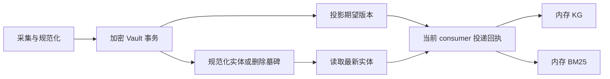
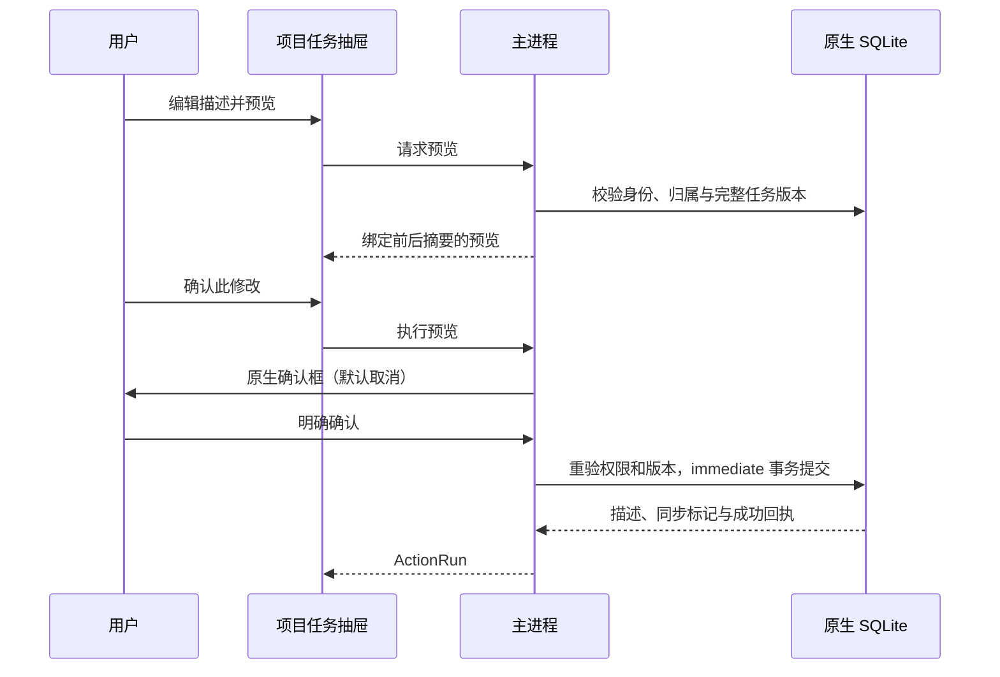

# 数据投影恢复与项目受控动作增量设计（2026-10-06）

2026-10-06 发布后核对：npm CLI **0.166.90** 与 Open VSX **0.37.135** 已公开，发行标签绑定 `28cff6adc8`，Open VSX 推荐 CLI `0.166.90`。Session Core **0.3.15**、Agent SDK **0.2.13**、PDH **0.4.63** 已先于 CLI 经 OIDC 发布并下载核验。JetBrains 当前公开 **0.4.152**，其制品仍推荐 CLI `0.166.89`；`0.4.153` 标签发布进行中，尚未确认公开上架。文档核对源码为 `main@f6f9998654`；桌面与移动端产品包保持独立 **v5.0.3.138**，新增桌面任务工作区须运行本轮源码，不能从 npm/IDE 发布推断已进入该安装包。 操作说明见[用户指南](https://docs.chainlesschain.com/chainlesschain/data-actions-current.html)。

## Git 变更与设计范围

| 提交                                                      | 已实现范围                                                               |
| --------------------------------------------------------- | ------------------------------------------------------------------------ |
| `59e3107d95`                                              | 企业能力真实状态、RAG 内容更新与删除顺序、CLI 审计脱敏                   |
| `736427f984`                                              | PDH 耐久投影意图与恢复、共享业务对象契约                                 |
| `afd099a51a`                                              | 任务描述受控动作、确定性风险评估、退休 consumer 回执清理                 |
| `9f28073673`                                              | 项目任务抽屉、主进程身份及确认、风险检查历史                             |
| `2c3e3ca851`                                              | 相关子包、CLI 和 IDE 的版本及精确依赖准备                                |
| `01dad7e9ba` / `28cff6adc8`                               | proxy-addr 与 SDK 测试依赖安全更新；PDH 可移植性合同对齐与完整发布门绑定 |
| `f6f9998654`                                              | 记录子 npm 包与 CLI OIDC 发布、签名来源及公开归档核验                    |
| `3d234bd884` / `2f96e07a57` / `50496cb9b0` / `85181932ae` | PDH 三平台原生及跨包 CI 门，拒绝隐式跳过关键用例                         |

业务对象契约定义版本化 Project、Task、Document、Person、Decision、ActionRun 引用，以及动作请求和运行回执。契约和摘要绑定内容；它们不授予身份或执行权限，也不代表完整企业业务本体已经落地。

## PDH 权威数据与派生投影

实体写入、更新或删除与投影期望版本在同一个加密数据库事务中提交。KG、RAG 各自确认投递；采集 checkpoint 已前进不能推出所有索引已更新。调用方检查 `derivationStatus`，用 `derivation-state` 查询单个实体的投递状态，用 `retry-derivations` 处理可重试积压。

恢复读取当前规范化实体及墓碑，不重放原始采集归档。同一 consumer 的未知 `running` 投递不因超时被自动抢占或重放。实体类型为 `event/person/place/item/topic`；不同类型不能复用已有裸 ID，包含墓碑的冲突返回 `DERIVATION_ID_CONFLICT`。

CLI 与桌面生产 wiring 目前使用内存 KG 和 BM25。新宿主创建新 consumer generation 并从权威数据重建索引；初始化最多排空 100 页、每页 1000 次投递，剩余积压可查询和重试。可注入向量桥接器，但当前两个宿主均没有连接 vector 目的地，不能宣称自动写入持久向量数据库。

RAG 用内容指纹区分修订，BM25 先移除旧内容再索引新内容；可选 vector 与 BM25 分别确认。写入及删除串行化，避免旧异步写覆盖新版本。向量 adapter 必须具备幂等 index/remove，桥接器本身不承担重试调度。

删除规范化实体会排队移除派生索引，原始归档仍保留。显式重新导入或重派生可能恢复该实体；该动作不构成隐私擦除，也不会删除来源平台的记录。

## Consumer 生命周期与回执保留

consumer 登记为 ephemeral 或 persistent。正常空闲关闭可以退休；CLI 在成功初始化后注册同步退出钩子，只有退出码 0 才尝试退休。异常退出、忙碌、SIGKILL 或未知状态继续保留活动记录，不以进程年龄推断完成。

`prune-derivations` 要求明确选择 1–100 个已退休 ephemeral consumer ID，并显式 `--confirm`。所选 ID 中混入活动、persistent、升级前没有登记或其他不符合退休 ephemeral 条件的 consumer 时整批拒绝。合法批次每次最多删除 1000 条非 running 回执，未知 running 保留。源投影意图、墓碑、依赖与生命周期记录保留，不自动清理，也没有强制退休别的进程的 CLI。

清理结果的 `retainedRunning` 表示未知回执被保护，`remainingReceipts` 非零不自动构成失败。`not-retained` 可能从未投递或已清理，不能表示成功。筛选 adapter/scope 仅筛选数据，现有 Vault 认证边界继续生效，筛选参数不构成对象权限。

## 项目任务受控执行

真实入口是 `/projects/:id` → “项目任务”，读取 `project_tasks` 中已保存任务。它不读取团队看板 `team_tasks`，不把 AI 临时计划转换成任务，也不创建示例数据。

仅主进程当前 DID 精确匹配 `projects.user_id` 的个人项目可操作；组织、工作区字段或资源关联存在即拒绝。`default-user` 和设备 ID 不自动映射为 DID。项目须为 `draft/active`，任务须为 `pending`；仅更新 `description`。修改前后描述各最多 8192 UTF-8 字节，完整任务快照另受共享契约预算约束。

每次新执行使用独立 strict/high ApprovalGate。确认后重新检查当前身份、所有权和完整任务版本，描述更新、递增 `updated_at`、`sync_status='pending'` 与成功回执在同一原生 SQLite immediate 事务中提交。取消或拒绝不能表示成功，只有 `succeeded` 表示提交完成。

`running/queued/unknown` 回执阻止同任务新修改；改幂等键、刷新或重开不能绕过。重复原请求返回既有回执，不自动重试或强制重放未知结果。回执保留摘要与证据，不保存描述正文或原始幂等键。旧任务 CRUD 尚未全部迁移到该服务，不能声称全部任务操作已受控。

| Preload 方法                     | 主进程 IPC                            |
| -------------------------------- | ------------------------------------- |
| `task.listControlledTasks`       | `task:controlled-list`                |
| `task.readControlledTask`        | `task:controlled-read`                |
| `task.previewDescriptionUpdate`  | `task:controlled-description-preview` |
| `task.executeDescriptionUpdate`  | `task:controlled-description-execute` |
| `task.listDescriptionActionRuns` | `task:controlled-description-runs`    |
| `task.getDescriptionActionRun`   | `task:controlled-description-run`     |
| `project.evaluateRisk`           | `project:risk-evaluate`               |
| `project.getRiskReview`          | `project:risk-review`                 |

任务列表默认 50、最多 100 条，按 ID 翻页；修改历史默认 20、最多 50 条，按插入顺序倒序翻页。CLI `task-description-preview` 仅预览离线 JSON，返回 `authority: "unverified-snapshot"`；没有 live execute 子命令。

## 风险规则与检查历史

规则确定性识别未完成任务逾期、直接依赖未完成，不做 AI 风险评分、交付预测或传递依赖推断。在线读取 `desktop.project-tasks/v1` 的 `pending/running/completed/failed` 状态；离线还可显式指定 `desktop.task-manager/v1`，两者状态不可混用。

最多 1000 个任务、每任务 1000 个依赖，总计最多 10000 条边。缺列、截断读取、无效依赖等返回不完整数据状态，不能解释为零风险。SQL `blocked_by IS NULL` 可规范化为空数组，损坏 JSON 不能。

在线检查在 immediate 事务中读取选定字段、计算规则并保存检查。历史固定其 `asOf` 与快照；重读必须验证当前项目所有权、历史任务归属及未删除状态，验证摘要并重算规则。任务移出、删除或撤权后可能拒绝读取。修改描述不会改变状态、截止时间和依赖，不能据此声称风险已解决。

风险检查与 ActionRun 目前尚未形成不可分割的端到端业务血缘，也没有外部签名或跨服务可信证明。

## 能力状态和审计

- 自动化实际执行为 `live:false, simulation:true`；普通执行返回 `unsupported`，显式模拟返回 `simulated`。连接器目录不表示真实 SaaS 传输已实现，历史不明回执保留 `legacy-unverified`。
- 低代码预览为 `design-preview`、`previewUrl:null`、`deployed:false`；发布仅为 `design-published`、`runtimeStatus:"unsupported"`；数据源测试为 `probed:false`。保存设计不产生运行部署。
- 此处 SCIM outbound provider 返回 `success:false, status:"unsupported", executed:false`；不泛化为所有 inbound SCIM 接口不可用。
- CLI `audit-sanitizer.js` 脱敏结构化凭据、URL userinfo/query/fragment、Bearer/Basic、headers 和错误链，处理循环对象及大小预算，避免执行 getter/toJSON；它不是任意自然语言秘密识别器，也不证明全平台审计都已迁移。

## 验证与发布

已有测试覆盖真实 SQLite 事务、加密 Vault 派生恢复、权限和版本变化、未知回执、回滚、consumer 清理保护、IPC 及 Vue 交互。不将单元/组件测试称为真实 Electron GUI E2E，不将离线风险规则称为业务效果验证。

准确发行提交 `28cff6adc8` 的 [CLI CI](https://github.com/chainlesschain/chainlesschain/actions/runs/37407644585)（70 成功）、[Strict Sandbox](https://github.com/chainlesschain/chainlesschain/actions/runs/37407644409)（5/5）和 [IDE 宿主门](https://github.com/chainlesschain/chainlesschain/actions/runs/37407686847)（18 成功）通过；条件跳过项不计为通过。[质量与安全](https://github.com/chainlesschain/chainlesschain/actions/runs/37407644385)（9/9）、[npm OIDC 发布](https://github.com/chainlesschain/chainlesschain/actions/runs/37413002340)及 [Open VSX 发布](https://github.com/chainlesschain/chainlesschain/actions/runs/37414359683)成功。PDH 原生完整测试在 Linux、Windows、macOS 各 4482 项通过、0 失败，125 项显式停用的历史用例跳过；Session Core 各 709 项、SDK 各 83 项通过且无跳过。CLI 公开归档精确依赖 Session Core `0.3.15` 与 PDH `0.4.63`，签名来源绑定本次标签、提交和发布工作流。

本轮完整门禁和 npm 发布证明均绑定 `28cff6adc8`；历史失败/取消记录保留。Open VSX `0.37.135` 已公开，JetBrains `0.4.153` 发布与公开审批仍分别核验。公共状态见[发布后版本观察](https://github.com/chainlesschain/chainlesschain/blob/feature/docs-release-sync-20261006/docs/research/cli/evidence/documentation-release-status-2026-10-06-after-release.json)。设计中的桌面 IPC/UI 接线属于本轮源码，不能借 CLI/IDE 发布声明旧桌面安装包已包含新功能。

## 关键文件

- `packages/personal-data-hub/lib/derivation-store.js`、`registry.js`、`vault.js`：权威投影意图、consumer 和回执。
- `packages/personal-data-hub/lib/bridges/cc-rag-sink.js`、`cc-kg-sink.js`：KG/RAG 投递。
- `packages/session-core/lib/business-object-contract.js`：业务引用及动作合同。
- `packages/session-core/lib/task-description-action-service.js`：描述动作 authority 与事务。
- `packages/session-core/lib/project-risk-evaluation.js`、`project-risk-review-service.js`：规则及在线历史。
- `packages/cli/src/commands/project.js`、`hub.js`：离线预览及投影维护命令。
- `desktop-app-vue/src/main/task/task-description-ipc.js`：DID、主进程确认及固定 IPC。
- `desktop-app-vue/src/renderer/components/projects/ProjectTaskDescriptionDrawer.vue`：项目任务工作区。
- `packages/cli/src/lib/audit-sanitizer.js`：CLI 结构化审计脱敏。
