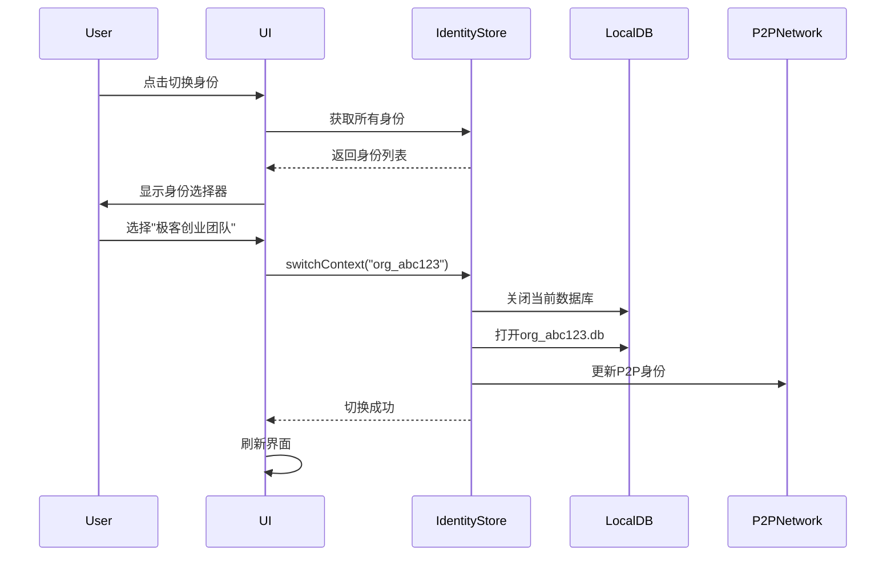

# ChainlessChain 企业版技术设计方案

**版本**: v2.0
**日期**: 2025-12-30
**状态**: 设计阶段
**架构模式**: 去中心化组织 (Decentralized Organization)

---

## 目录

1. [概述](#1-概述)
2. [核心设计理念](#2-核心设计理念)
3. [身份切换机制](#3-身份切换机制)
4. [去中心化组织架构](#4-去中心化组织架构)
5. [组织数据模型](#5-组织数据模型)
6. [团队协作功能](#6-团队协作功能)
7. [组织权限管理](#7-组织权限管理)
8. [P2P组织同步](#8-p2p组织同步)
9. [数据库设计](#9-数据库设计)
10. [技术选型](#10-技术选型)
11. [实施路线图](#11-实施路线图)
12. [与个人版对比](#12-与个人版对比)

---

## 1. 概述

### 1.1 设计目标

ChainlessChain 企业版采用**去中心化组织**架构，让每个用户都能创建和管理自己的组织，同时可以加入多个组织进行协作。

**核心特性**:
- **多身份切换**: 一个账号，多个身份（个人、组织A、组织B...）
- **人人可创建**: 任何用户都可以创建组织，成为组织Owner
- **去中心化**: 无需私有化部署，基于P2P和DID的去中心化协作
- **灵活加入**: 通过邀请码或DID邀请加入组织
- **数据自主**: 个人数据本地存储，组织数据可选云端或P2P同步

### 1.2 使用场景

**个人用户**:
```
张三的使用场景：
- 个人身份：管理个人知识库、私人项目
- 公司A员工：作为技术部成员，协作公司项目
- 创业团队Owner：创建了自己的创业团队组织
- 开源社区Member：加入了某开源项目组织
```

**组织创建者**:
```
李四创建组织：
1. 点击"创建组织"
2. 填写组织名称、描述
3. 邀请成员（通过邀请码或DID）
4. 设置成员角色和权限
5. 开始协作
```

### 1.3 设计原则

1. **去中心化优先**: 无中心服务器依赖，P2P驱动
2. **身份自主**: 用户完全掌控自己的DID身份
3. **数据主权**: 个人数据本地，组织数据可选
4. **平等协作**: 组织之间平等，无层级关系
5. **灵活扩展**: 从个人到小团队到大组织平滑扩展

---

## 2. 核心设计理念

### 2.1 去中心化组织 vs 传统企业

| 维度 | 传统企业版 | 去中心化组织版 |
|-----|----------|--------------|
| 部署方式 | 私有化部署 | 无需部署，桌面应用直接使用 |
| 管理员 | 超级管理员 | 组织Owner（平等的） |
| 组织创建 | IT部门统一创建 | 任何用户都可创建 |
| 用户归属 | 单一企业 | 可加入多个组织 |
| 数据存储 | 企业中心服务器 | 个人本地 + 组织云端/P2P |
| 身份认证 | LDAP/SSO | DID去中心化身份 |
| 组织间关系 | 层级结构 | 平等网络 |
| 扩展性 | 受服务器限制 | P2P网络无限扩展 |

### 2.2 架构对比

#### 传统企业版架构（已废弃）
```
┌─────────────────────────────────────┐
│     Enterprise Central Server       │
│  ┌──────────────────────────────┐   │
│  │  Multi-Tenant Database       │   │
│  │  Central Admin Console       │   │
│  │  SSO/LDAP Integration        │   │
│  └──────────────────────────────┘   │
└─────────────────────────────────────┘
              ↓
    ┌─────────┴─────────┐
    ↓                   ↓
[User A]            [User B]
(单一企业)          (单一企业)
```

#### 去中心化组织版架构（新设计）
```
┌──────────────────────────────────────────────────┐
│              P2P Network Layer                   │
│   (libp2p + DHT + Signal Protocol)               │
└──────────────────────────────────────────────────┘
         ↓           ↓           ↓
    ┌────────┐  ┌────────┐  ┌────────┐
    │ User A │  │ User B │  │ User C │
    └────────┘  └────────┘  └────────┘
         │           │           │
    ┌────┴───────────┴───────────┴────┐
    │       Identity Context           │
    ├──────────────────────────────────┤
    │ 👤 Personal (Default)            │
    │ 🏢 Org1 (Member)                 │
    │ 🏢 Org2 (Owner)                  │
    │ 🏢 Org3 (Admin)                  │
    └──────────────────────────────────┘
         │           │           │
    ┌────┴───────────┴───────────┴────┐
    │       Local Storage              │
    ├──────────────────────────────────┤
    │ Personal Data (SQLite)           │
    │ Org1 Synced Data (SQLite)        │
    │ Org2 Synced Data (SQLite)        │
    └──────────────────────────────────┘
```

### 2.3 类比现有产品

| 产品 | 组织模式 | ChainlessChain企业版 |
|-----|---------|-------------------|
| Slack | Workspace | ✅ 组织 (Organization) |
| Discord | Server | ✅ 组织 (Organization) |
| Notion | Workspace | ✅ 组织 (Organization) |
| Figma | Team | ✅ 组织 (Organization) |
| GitHub | Organization | ✅ 组织 (Organization) |

**核心差异**: 我们是**去中心化**的，基于P2P + DID，无需中心服务器！

---

## 3. 身份切换机制

### 3.1 身份上下文 (Identity Context)

每个用户有一个**主DID**，但可以在多个**身份上下文**中切换：

```javascript
// 用户的身份上下文
const userIdentities = {
  primaryDID: "did:key:z6MkhaXgBZDvotDkL5257faiztiGiC2QtKLGpbnnEGta2doK",
  currentContext: "personal", // 当前激活的上下文
  contexts: {
    personal: {
      type: "personal",
      displayName: "张三 (个人)",
      avatar: "avatar_personal.jpg",
      localDB: "data/personal.db"
    },
    "org_abc123": {
      type: "organization",
      orgId: "org_abc123",
      orgName: "极客创业团队",
      role: "owner",
      permissions: ["admin", "create", "delete"],
      displayName: "张三@极客创业团队",
      avatar: "org_abc123_avatar.jpg",
      localDB: "data/org_abc123.db"
    },
    "org_xyz789": {
      type: "organization",
      orgId: "org_xyz789",
      orgName: "开源社区XYZ",
      role: "member",
      permissions: ["read", "write"],
      displayName: "张三@开源社区XYZ",
      localDB: "data/org_xyz789.db"
    }
  }
};
```

### 3.2 身份切换UI

```vue
<!-- Desktop App身份切换器 -->
<template>
  <div class="identity-switcher">
    <!-- 当前身份 -->
    <div class="current-identity" @click="showSwitcher = true">
      <a-avatar :src="currentIdentity.avatar" />
      <div class="identity-info">
        <div class="identity-name">{{ currentIdentity.displayName }}</div>
        <div class="identity-type">
          {{ currentIdentity.type === 'personal' ? '个人' : currentIdentity.orgName }}
        </div>
      </div>
      <a-icon type="swap" />
    </div>

    <!-- 身份切换菜单 -->
    <a-modal v-model:visible="showSwitcher" title="切换身份">
      <!-- 个人身份 -->
      <div class="identity-item" @click="switchTo('personal')">
        <a-avatar :src="identities.personal.avatar" />
        <span>👤 个人</span>
      </div>

      <!-- 组织身份列表 -->
      <div v-for="org in organizationIdentities" :key="org.orgId"
           class="identity-item" @click="switchTo(org.orgId)">
        <a-avatar :src="org.avatar" />
        <span>🏢 {{ org.orgName }}</span>
        <a-tag>{{ org.role }}</a-tag>
      </div>

      <a-divider />

      <!-- 创建组织 -->
      <a-button type="dashed" block @click="createOrganization">
        ➕ 创建新组织
      </a-button>

      <!-- 加入组织 -->
      <a-button type="dashed" block @click="joinOrganization">
        🔗 加入组织
      </a-button>
    </a-modal>
  </div>
</template>

<script setup>
import { ref, computed } from 'vue';
import { useIdentityStore } from '@/stores/identity';

const identityStore = useIdentityStore();
const showSwitcher = ref(false);

const currentIdentity = computed(() => identityStore.getCurrentIdentity());
const organizationIdentities = computed(() => identityStore.getOrganizationIdentities());

const switchTo = async (contextId) => {
  await identityStore.switchContext(contextId);
  showSwitcher.value = false;
  // 刷新UI，重新加载该身份的数据
  location.reload();
};

const createOrganization = () => {
  // 打开创建组织对话框
};

const joinOrganization = () => {
  // 打开加入组织对话框（输入邀请码）
};
</script>
```

### 3.3 身份切换流程



### 3.4 数据隔离

每个身份上下文有独立的数据库文件：

```
data/
├── personal.db                    # 个人数据
├── org_abc123.db                  # 极客创业团队数据
├── org_xyz789.db                  # 开源社区XYZ数据
└── identity-contexts.db           # 身份上下文元数据（加密）
```

**安全机制**:
- 每个数据库使用不同的加密密钥（从U-Key派生）
- 切换身份时自动关闭旧数据库，打开新数据库
- 个人数据与组织数据完全隔离

---

## 4. 去中心化组织架构

### 4.1 组织生命周期

```
1. 创建组织 (Create)
   ├─ 用户点击"创建组织"
   ├─ 填写组织名称、描述、类型
   ├─ 生成组织DID (did:key:org_abc123)
   ├─ 创建者自动成为Owner
   └─ 生成邀请码

2. 邀请成员 (Invite)
   ├─ Owner/Admin生成邀请链接或邀请码
   ├─ 或直接通过DID邀请
   └─ 被邀请者收到P2P通知

3. 加入组织 (Join)
   ├─ 用户输入邀请码或点击邀请链接
   ├─ 验证邀请码有效性
   ├─ 通过P2P连接组织网络
   ├─ 同步组织元数据和初始数据
   └─ 创建组织身份上下文

4. 协作 (Collaborate)
   ├─ 切换到组织身份
   ├─ 访问组织知识库和项目
   ├─ 实时协同编辑
   └─ P2P消息通信

5. 离开组织 (Leave)
   ├─ 用户主动离开或被移除
   ├─ 删除本地组织数据（可选备份）
   └─ 断开P2P连接
```

### 4.2 组织元数据模型

```javascript
// 组织元数据 (存储在区块链或IPFS)
const organizationMetadata = {
  // 基本信息
  orgId: "org_abc123",
  orgDID: "did:key:z6MkorgABC123...",
  name: "极客创业团队",
  description: "专注AI和区块链的创业团队",
  type: "startup", // startup, company, community, opensource, education
  avatar: "ipfs://QmXxx...",
  createdAt: 1735542000000,

  // 创建者
  owner: {
    did: "did:key:z6MkhaXgBZDvotDkL5257...",
    displayName: "张三",
    joinedAt: 1735542000000
  },

  // 成员列表（只存储DID和基本信息）
  members: [
    {
      did: "did:key:z6MkhaXgBZDvotDkL5257...",
      role: "owner",
      displayName: "张三",
      joinedAt: 1735542000000
    },
    {
      did: "did:key:z6MkuserBxxx...",
      role: "admin",
      displayName: "李四",
      joinedAt: 1735542100000
    },
    {
      did: "did:key:z6MkuserCxxx...",
      role: "member",
      displayName: "王五",
      joinedAt: 1735542200000
    }
  ],

  // P2P网络信息
  p2pNetwork: {
    rendezvousPoint: "/chainlesschain/org/abc123",
    bootstrapPeers: [
      "/ip4/203.0.113.1/tcp/4001/p2p/QmOwnerPeerID",
      "/ip4/203.0.113.2/tcp/4001/p2p/QmAdminPeerID"
    ],
    topicName: "org_abc123_sync"
  },

  // 邀请设置
  invitation: {
    enabled: true,
    requireApproval: false, // 是否需要审批
    inviteCode: "GEEK2025", // 公开邀请码（可选）
    inviteLink: "chainlesschain://join/org_abc123?code=xxx"
  },

  // 组织配置
  settings: {
    visibility: "private", // public, private, invite-only
    maxMembers: 100,
    allowMemberInvite: true,
    defaultMemberRole: "member"
  },

  // 签名（使用Owner的DID签名）
  signature: "0x123abc..."
};
```

### 4.3 组织发现机制

**方式1: 邀请码加入**
```javascript
// 用户输入邀请码
const inviteCode = "GEEK2025";

// 1. 通过DHT查询组织元数据
const orgMetadata = await dht.get(`/org/invite/${inviteCode}`);

// 2. 验证组织签名
const isValid = await verifyOrgSignature(orgMetadata);

// 3. 显示组织信息，用户确认加入
if (isValid) {
  showOrganizationInfo(orgMetadata);
  // 用户点击"加入"
}
```

**方式2: DID直接邀请**
```javascript
// Owner通过DID邀请
const invitation = {
  type: "organization_invitation",
  orgId: "org_abc123",
  orgDID: "did:key:z6MkorgABC123...",
  invitedBy: "did:key:z6MkhaXgBZDvotDkL5257...",
  role: "member",
  expireAt: Date.now() + 7 * 24 * 3600 * 1000, // 7天有效
  signature: "0xabc..."
};

// 通过P2P发送邀请消息
await p2p.sendMessage(targetUserDID, invitation);

// 被邀请者收到通知
onP2PMessage((message) => {
  if (message.type === "organization_invitation") {
    showInvitationNotification(message);
  }
});
```

**方式3: 公开组织列表（可选）**
```javascript
// 通过DHT发布组织（公开组织）
if (orgMetadata.settings.visibility === "public") {
  await dht.put(`/org/public/${orgId}`, orgMetadata);
}

// 用户浏览公开组织
const publicOrgs = await dht.query("/org/public/*");
```

### 4.4 组织数据同步

**混合同步策略**:

```javascript
// 组织数据存储策略
const orgDataStrategy = {
  // 策略1: 纯P2P同步（小型团队，< 10人）
  p2pOnly: {
    storage: "local",
    sync: "p2p-gossip",
    pros: "完全去中心化，无成本",
    cons: "需要成员在线，同步延迟"
  },

  // 策略2: 云端存储 + P2P加速（中型团队，10-100人）
  cloudWithP2P: {
    storage: "cloud", // MinIO / S3 / IPFS
    sync: "cloud-primary, p2p-secondary",
    pros: "高可用，离线可访问",
    cons: "需要云存储成本"
  },

  // 策略3: 混合模式（推荐）
  hybrid: {
    metadata: "blockchain/ipfs", // 组织元数据上链或IPFS
    hotData: "cloud", // 活跃数据云端
    coldData: "p2p", // 历史数据P2P
    realtime: "p2p-pubsub" // 实时协作P2P
  }
};
```

**实施方案（混合模式）**:

```javascript
// 组织数据管理器
class OrganizationDataManager {
  constructor(orgId) {
    this.orgId = orgId;
    this.localDB = new SQLiteDB(`data/org_${orgId}.db`);
    this.p2pSync = new P2PSyncEngine(orgId);
    this.cloudSync = new CloudSyncEngine(orgId); // 可选
  }

  /**
   * 创建知识库条目
   */
  async createKnowledge(data) {
    // 1. 写入本地数据库
    const knowledge = await this.localDB.insert('knowledge_items', {
      ...data,
      org_id: this.orgId,
      created_by: getCurrentUserDID(),
      created_at: Date.now()
    });

    // 2. 生成CID（内容寻址）
    const cid = await ipfs.add(JSON.stringify(knowledge));

    // 3. 通过P2P广播变更
    await this.p2pSync.broadcast({
      type: 'knowledge_created',
      orgId: this.orgId,
      knowledgeId: knowledge.id,
      cid: cid,
      timestamp: Date.now()
    });

    // 4. 上传到云端（如果启用）
    if (this.cloudSync.enabled) {
      await this.cloudSync.upload(knowledge);
    }

    return knowledge;
  }

  /**
   * 监听P2P同步事件
   */
  async onP2PSyncEvent(event) {
    if (event.type === 'knowledge_created') {
      // 从IPFS或P2P peer获取数据
      const data = await this.p2pSync.fetch(event.cid);

      // 写入本地数据库
      await this.localDB.insert('knowledge_items', data);

      // 触发UI更新
      eventBus.emit('knowledge:updated');
    }
  }
}
```

---

## 5. 组织数据模型

### 5.1 Desktop App数据库设计

每个组织有独立的SQLite数据库文件：

```sql
-- org_abc123.db

-- 组织元数据表
CREATE TABLE organization_info (
    org_id TEXT PRIMARY KEY,
    org_did TEXT NOT NULL,
    name TEXT NOT NULL,
    description TEXT,
    type TEXT,
    avatar TEXT,
    owner_did TEXT NOT NULL,
    settings_json TEXT, -- JSON格式配置
    created_at INTEGER NOT NULL,
    updated_at INTEGER NOT NULL
);

-- 组织成员表
CREATE TABLE organization_members (
    id TEXT PRIMARY KEY,
    org_id TEXT NOT NULL,
    member_did TEXT NOT NULL,
    display_name TEXT,
    avatar TEXT,
    role TEXT NOT NULL, -- 'owner', 'admin', 'member', 'viewer'
    permissions TEXT, -- JSON数组: ["read", "write", "delete"]
    joined_at INTEGER NOT NULL,
    last_active_at INTEGER,
    status TEXT DEFAULT 'active', -- 'active', 'inactive', 'removed'
    UNIQUE(org_id, member_did)
);

-- 组织知识库表（复用个人版schema，增加org_id）
CREATE TABLE knowledge_items (
    id TEXT PRIMARY KEY,
    org_id TEXT NOT NULL,
    title TEXT NOT NULL,
    type TEXT NOT NULL,
    content TEXT,
    created_by TEXT NOT NULL, -- DID
    created_at INTEGER NOT NULL,
    updated_at INTEGER NOT NULL,
    updated_by TEXT,
    share_scope TEXT DEFAULT 'org', -- 'org', 'team', 'private'
    version INTEGER DEFAULT 1,
    parent_version_id TEXT, -- 版本链
    cid TEXT -- IPFS CID
);

-- 组织项目表
CREATE TABLE organization_projects (
    id TEXT PRIMARY KEY,
    org_id TEXT NOT NULL,
    name TEXT NOT NULL,
    description TEXT,
    owner_did TEXT NOT NULL,
    created_at INTEGER NOT NULL,
    updated_at INTEGER NOT NULL
);

-- 组织角色表
CREATE TABLE organization_roles (
    id TEXT PRIMARY KEY,
    org_id TEXT NOT NULL,
    name TEXT NOT NULL,
    description TEXT,
    permissions TEXT, -- JSON数组
    is_builtin BOOLEAN DEFAULT FALSE,
    created_at INTEGER NOT NULL,
    UNIQUE(org_id, name)
);

-- 组织邀请表
CREATE TABLE organization_invitations (
    id TEXT PRIMARY KEY,
    org_id TEXT NOT NULL,
    invite_code TEXT UNIQUE,
    invited_by TEXT NOT NULL,
    role TEXT DEFAULT 'member',
    max_uses INTEGER DEFAULT 1,
    used_count INTEGER DEFAULT 0,
    expire_at INTEGER,
    created_at INTEGER NOT NULL
);

-- 组织活动日志表
CREATE TABLE organization_activities (
    id TEXT PRIMARY KEY,
    org_id TEXT NOT NULL,
    actor_did TEXT NOT NULL,
    action TEXT NOT NULL, -- 'create_knowledge', 'update_project', 'invite_member'
    resource_type TEXT,
    resource_id TEXT,
    metadata TEXT, -- JSON
    timestamp INTEGER NOT NULL
);

-- P2P同步状态表
CREATE TABLE p2p_sync_state (
    id TEXT PRIMARY KEY,
    org_id TEXT NOT NULL,
    resource_type TEXT NOT NULL,
    resource_id TEXT NOT NULL,
    local_version INTEGER DEFAULT 1,
    remote_version INTEGER DEFAULT 1,
    cid TEXT, -- IPFS CID
    sync_status TEXT DEFAULT 'synced', -- 'synced', 'pending', 'conflict'
    last_synced_at INTEGER,
    UNIQUE(org_id, resource_type, resource_id)
);
```

### 5.2 用户身份上下文表

```sql
-- identity-contexts.db（用户级别，加密）

-- 身份上下文表
CREATE TABLE identity_contexts (
    context_id TEXT PRIMARY KEY,
    user_did TEXT NOT NULL, -- 用户主DID
    context_type TEXT NOT NULL, -- 'personal', 'organization'
    org_id TEXT, -- 如果是组织身份
    org_name TEXT,
    org_avatar TEXT,
    role TEXT,
    display_name TEXT,
    db_path TEXT NOT NULL, -- 数据库文件路径
    is_active BOOLEAN DEFAULT FALSE, -- 当前激活的身份
    created_at INTEGER NOT NULL,
    last_accessed_at INTEGER
);

-- 当前只能有一个active context
CREATE UNIQUE INDEX idx_active_context ON identity_contexts(is_active) WHERE is_active = TRUE;

-- 组织成员关系表（缓存）
CREATE TABLE organization_memberships (
    id TEXT PRIMARY KEY,
    user_did TEXT NOT NULL,
    org_id TEXT NOT NULL,
    org_did TEXT NOT NULL,
    role TEXT NOT NULL,
    joined_at INTEGER NOT NULL,
    UNIQUE(user_did, org_id)
);
```

---

## 6. 团队协作功能

### 6.1 协作功能矩阵

| 功能 | 个人版 | 组织版 | 实现方式 |
|-----|-------|-------|---------|
| 知识库共享 | ❌ | ✅ | 组织内所有成员可见（根据权限） |
| 实时协同编辑 | ❌ | ✅ | Y.js CRDT + P2P Pubsub |
| 评论批注 | ⚠️ | ✅ | 增强版，支持@提醒 |
| 版本历史 | ⚠️ | ✅ | Git + IPFS内容寻址 |
| 成员管理 | ❌ | ✅ | 邀请、移除、角色管理 |
| 权限控制 | ❌ | ✅ | RBAC + 资源级ACL |
| 组织消息 | ❌ | ✅ | P2P群组消息（类Discord频道） |
| 活动日志 | ⚠️ | ✅ | 组织级操作审计 |

### 6.2 知识库共享机制

**共享范围**:

```javascript
// 知识库共享范围
const ShareScope = {
  PRIVATE: 'private',     // 仅创建者可见
  TEAM: 'team',          // 特定团队可见（未来扩展）
  ORG: 'org',            // 整个组织可见（默认）
  PUBLIC: 'public'       // 公开（跨组织）
};

// 创建知识库时设置共享范围
const knowledge = {
  id: 'knowledge_123',
  title: '产品设计文档',
  content: '...',
  org_id: 'org_abc123',
  created_by: 'did:key:z6MkhaXgBZDvot...',
  share_scope: ShareScope.ORG, // 组织内共享
  permissions: {
    // 可以覆盖默认权限，给特定成员特殊权限
    'did:key:z6MkuserB...': 'admin', // 李四可以管理
    'did:key:z6MkuserC...': 'read'   // 王五只读
  }
};
```

**权限检查**:

```javascript
// 权限检查服务
class PermissionService {
  /**
   * 检查用户是否有权限访问知识库
   */
  async canAccessKnowledge(userDID, knowledgeId, action = 'read') {
    const knowledge = await db.query('knowledge_items', { id: knowledgeId });

    // 1. 检查是否是创建者
    if (knowledge.created_by === userDID) {
      return true;
    }

    // 2. 检查共享范围
    if (knowledge.share_scope === 'private') {
      return false; // 私有，只有创建者可访问
    }

    // 3. 检查组织成员
    const member = await db.query('organization_members', {
      org_id: knowledge.org_id,
      member_did: userDID,
      status: 'active'
    });

    if (!member) {
      return false; // 不是组织成员
    }

    // 4. 检查特定权限
    if (knowledge.permissions && knowledge.permissions[userDID]) {
      const permission = knowledge.permissions[userDID];
      return this.hasPermission(permission, action);
    }

    // 5. 检查角色权限
    const role = await db.query('organization_roles', {
      org_id: knowledge.org_id,
      name: member.role
    });

    return this.roleHasPermission(role, 'knowledge', action);
  }

  hasPermission(permission, action) {
    const permissionMap = {
      'admin': ['read', 'write', 'delete', 'share'],
      'write': ['read', 'write'],
      'read': ['read']
    };
    return permissionMap[permission]?.includes(action) || false;
  }
}
```

### 6.3 实时协同编辑

**基于Y.js的CRDT协同**:

```javascript
// 协同编辑管理器
class CollaborativeEditor {
  constructor(knowledgeId, orgId) {
    this.knowledgeId = knowledgeId;
    this.orgId = orgId;
    this.ydoc = new Y.Doc();
    this.provider = null;
  }

  /**
   * 初始化协同编辑
   */
  async init() {
    // 1. 创建Y.js文档
    this.ytext = this.ydoc.getText('content');

    // 2. 创建P2P提供者
    this.provider = new P2PProvider(
      `org_${this.orgId}_knowledge_${this.knowledgeId}`,
      this.ydoc,
      {
        awareness: new awarenessProtocol.Awareness(this.ydoc),
        userInfo: {
          did: getCurrentUserDID(),
          name: getCurrentUserName(),
          color: getRandomColor()
        }
      }
    );

    // 3. 加载初始内容
    const knowledge = await loadKnowledge(this.knowledgeId);
    if (knowledge.content) {
      this.ytext.insert(0, knowledge.content);
    }

    // 4. 监听变更，自动保存
    this.ydoc.on('update', debounce(async (update) => {
      await this.saveToLocal();
      await this.broadcastUpdate(update);
    }, 1000));

    // 5. 显示其他用户光标
    this.provider.awareness.on('change', (changes) => {
      this.updateAwarenessUI(changes);
    });
  }

  /**
   * 保存到本地数据库
   */
  async saveToLocal() {
    const content = this.ytext.toString();
    const version = this.ydoc.getVersion();

    await db.update('knowledge_items', {
      id: this.knowledgeId
    }, {
      content: content,
      version: version,
      updated_at: Date.now(),
      updated_by: getCurrentUserDID()
    });
  }

  /**
   * 通过P2P广播更新
   */
  async broadcastUpdate(update) {
    const message = {
      type: 'yjs_update',
      orgId: this.orgId,
      knowledgeId: this.knowledgeId,
      update: Array.from(update), // Uint8Array转数组
      timestamp: Date.now()
    };

    await p2p.pubsub.publish(`org_${this.orgId}_sync`, message);
  }

  /**
   * 显示其他用户的光标和选区
   */
  updateAwarenessUI(changes) {
    const states = this.provider.awareness.getStates();

    states.forEach((state, clientId) => {
      if (clientId === this.ydoc.clientID) return; // 跳过自己

      // 显示用户信息
      const { did, name, color, cursor, selection } = state;

      if (cursor) {
        showRemoteCursor(clientId, { name, color, position: cursor });
      }

      if (selection) {
        showRemoteSelection(clientId, { color, range: selection });
      }
    });
  }
}
```

**P2P Provider实现**:

```javascript
// 基于libp2p的Y.js Provider
class P2PProvider extends Observable {
  constructor(room, ydoc, { awareness, userInfo }) {
    super();
    this.room = room;
    this.doc = ydoc;
    this.awareness = awareness;
    this.userInfo = userInfo;

    this.init();
  }

  async init() {
    // 1. 订阅P2P topic
    await p2p.pubsub.subscribe(this.room, (msg) => {
      this.onP2PMessage(msg);
    });

    // 2. 广播自己的awareness
    this.awareness.setLocalState({
      ...this.userInfo,
      cursor: null,
      selection: null
    });

    // 3. 监听本地Y.js更新
    this.doc.on('update', (update, origin) => {
      if (origin !== this) {
        this.broadcastUpdate(update);
      }
    });

    // 4. 定期同步状态
    this.syncInterval = setInterval(() => {
      this.syncState();
    }, 30000); // 30秒
  }

  onP2PMessage(msg) {
    try {
      const data = JSON.parse(msg.data.toString());

      if (data.type === 'yjs_update') {
        // 应用Y.js更新
        const update = new Uint8Array(data.update);
        Y.applyUpdate(this.doc, update, this);
      } else if (data.type === 'awareness_update') {
        // 更新awareness
        this.awareness.applyUpdate(new Uint8Array(data.update), 'remote');
      }
    } catch (err) {
      console.error('Failed to process P2P message:', err);
    }
  }

  broadcastUpdate(update) {
    const message = {
      type: 'yjs_update',
      update: Array.from(update),
      timestamp: Date.now()
    };

    p2p.pubsub.publish(this.room, JSON.stringify(message));
  }
}
```

### 6.4 组织消息和通知

```javascript
// 组织消息系统
class OrganizationMessaging {
  constructor(orgId) {
    this.orgId = orgId;
    this.topic = `org_${orgId}_messages`;
  }

  /**
   * 发送组织消息
   */
  async sendMessage(content, options = {}) {
    const message = {
      id: uuidv4(),
      type: 'org_message',
      orgId: this.orgId,
      sender: getCurrentUserDID(),
      senderName: getCurrentUserName(),
      content: content,
      mentions: options.mentions || [], // @提醒的DID列表
      replyTo: options.replyTo, // 回复的消息ID
      timestamp: Date.now()
    };

    // 1. 保存到本地
    await db.insert('organization_messages', message);

    // 2. P2P广播
    await p2p.pubsub.publish(this.topic, message);

    // 3. 如果有@提醒，发送P2P通知
    if (message.mentions.length > 0) {
      for (const did of message.mentions) {
        await this.sendNotification(did, message);
      }
    }

    return message;
  }

  /**
   * 监听组织消息
   */
  async subscribe(callback) {
    await p2p.pubsub.subscribe(this.topic, (msg) => {
      const message = JSON.parse(msg.data.toString());

      // 保存到本地
      db.insert('organization_messages', message);

      // 触发回调
      callback(message);

      // 如果被@了，显示通知
      if (message.mentions.includes(getCurrentUserDID())) {
        this.showNotification(message);
      }
    });
  }

  async sendNotification(targetDID, message) {
    await p2p.sendDirectMessage(targetDID, {
      type: 'mention_notification',
      orgId: this.orgId,
      messageId: message.id,
      sender: message.senderName,
      content: message.content.substring(0, 100)
    });
  }
}
```

---

## 7. 组织权限管理

### 7.1 内置角色

```javascript
// 组织内置角色
const BuiltinRoles = {
  OWNER: {
    name: 'owner',
    displayName: '所有者',
    permissions: ['*'], // 所有权限
    description: '组织创建者，拥有最高权限'
  },

  ADMIN: {
    name: 'admin',
    displayName: '管理员',
    permissions: [
      'org.manage',
      'member.invite',
      'member.remove',
      'member.manage',
      'knowledge.create',
      'knowledge.read',
      'knowledge.write',
      'knowledge.delete',
      'project.create',
      'project.delete',
      'role.create',
      'role.assign'
    ],
    description: '管理员，可以管理成员和内容'
  },

  MEMBER: {
    name: 'member',
    displayName: '成员',
    permissions: [
      'knowledge.create',
      'knowledge.read',
      'knowledge.write',
      'project.create',
      'project.read',
      'project.write',
      'message.send'
    ],
    description: '普通成员，可以创建和编辑内容'
  },

  VIEWER: {
    name: 'viewer',
    displayName: '访客',
    permissions: [
      'knowledge.read',
      'project.read',
      'message.read'
    ],
    description: '只读成员，只能查看内容'
  }
};
```

### 7.2 自定义角色

```javascript
// 组织管理页面 - 创建自定义角色
const createCustomRole = async (orgId, roleData) => {
  const role = {
    id: uuidv4(),
    org_id: orgId,
    name: roleData.name,
    display_name: roleData.displayName,
    description: roleData.description,
    permissions: roleData.permissions, // 权限数组
    is_builtin: false,
    created_at: Date.now()
  };

  // 保存到本地数据库
  await db.insert('organization_roles', role);

  // 广播到组织成员
  await orgSync.broadcast({
    type: 'role_created',
    orgId: orgId,
    role: role
  });

  return role;
};

// 示例：创建"内容审核员"角色
const contentModeratorRole = {
  name: 'content_moderator',
  displayName: '内容审核员',
  description: '负责审核和管理知识库内容',
  permissions: [
    'knowledge.read',
    'knowledge.write',
    'knowledge.delete', // 可以删除不当内容
    'comment.moderate'  // 可以审核评论
  ]
};
```

### 7.3 权限检查流程

```javascript
// 权限检查中间件
class PermissionMiddleware {
  /**
   * 检查用户是否有权限执行操作
   */
  static async check(userDID, orgId, resource, action) {
    // 1. 获取用户在组织中的成员信息
    const member = await db.query('organization_members', {
      org_id: orgId,
      member_did: userDID,
      status: 'active'
    });

    if (!member) {
      throw new PermissionError('不是组织成员');
    }

    // 2. 获取用户角色
    const role = await db.query('organization_roles', {
      org_id: orgId,
      name: member.role
    });

    if (!role) {
      throw new Error('角色不存在');
    }

    // 3. 检查角色权限
    const permission = `${resource}.${action}`;

    // Owner有所有权限
    if (role.name === 'owner' || role.permissions.includes('*')) {
      return true;
    }

    // 检查具体权限
    if (role.permissions.includes(permission)) {
      return true;
    }

    // 检查通配符权限 (例如: knowledge.* 包含 knowledge.read)
    const wildcardPermission = `${resource}.*`;
    if (role.permissions.includes(wildcardPermission)) {
      return true;
    }

    throw new PermissionError(`没有权限: ${permission}`);
  }

  /**
   * 检查资源级权限（ACL）
   */
  static async checkResourcePermission(userDID, resourceType, resourceId, action) {
    // 1. 获取资源
    const resource = await db.query(resourceType, { id: resourceId });

    if (!resource) {
      throw new Error('资源不存在');
    }

    // 2. 检查是否是创建者
    if (resource.created_by === userDID) {
      return true;
    }

    // 3. 检查组织权限
    await this.check(userDID, resource.org_id, resourceType.replace('_', ''), action);

    // 4. 检查资源特定权限
    if (resource.permissions && resource.permissions[userDID]) {
      const permission = resource.permissions[userDID];
      return this.hasPermission(permission, action);
    }

    return true;
  }
}

// 使用示例
try {
  await PermissionMiddleware.check(
    currentUserDID,
    currentOrgId,
    'knowledge',
    'delete'
  );

  // 有权限，执行删除
  await deleteKnowledge(knowledgeId);
} catch (err) {
  if (err instanceof PermissionError) {
    showError('您没有权限删除此知识库');
  }
}
```

---

## 8. P2P组织同步

### 8.1 P2P网络拓扑

```
组织P2P网络拓扑（org_abc123）:

          ┌─────────────┐
          │  Bootstrap  │
          │   Nodes     │
          └──────┬──────┘
                 │
        ┌────────┴────────┐
        │                 │
   ┌────▼────┐      ┌────▼────┐
   │ Owner   │◄────►│ Admin   │
   │ (在线)  │      │ (在线)  │
   └────┬────┘      └────┬────┘
        │                │
    ┌───┴───┐        ┌───┴───┐
    │       │        │       │
┌───▼──┐ ┌─▼───┐ ┌──▼──┐ ┌──▼──┐
│Member│ │Member│ │Member│ │Viewer│
│(在线)│ │(离线)│ │(在线)│ │(在线)│
└──────┘ └──────┘ └─────┘ └──────┘

特点:
- Owner和Admin通常作为Bootstrap节点
- 成员之间P2P直连
- 离线成员上线后自动同步
- 支持NAT穿透（WebRTC/STUN/TURN）
```

### 8.2 同步机制

**增量同步**:

```javascript
// P2P同步引擎
class P2PSyncEngine {
  constructor(orgId) {
    this.orgId = orgId;
    this.topic = `org_${orgId}_sync`;
    this.syncState = new Map(); // 本地同步状态
  }

  /**
   * 初始化同步
   */
  async init() {
    // 1. 订阅组织同步topic
    await p2p.pubsub.subscribe(this.topic, (msg) => {
      this.onSyncMessage(msg);
    });

    // 2. 加载本地同步状态
    await this.loadSyncState();

    // 3. 请求增量同步
    await this.requestIncrementalSync();

    // 4. 定期同步
    this.syncInterval = setInterval(() => {
      this.requestIncrementalSync();
    }, 60000); // 每分钟
  }

  /**
   * 请求增量同步
   */
  async requestIncrementalSync() {
    // 获取本地最新版本号
    const localVersion = await this.getLocalVersion();

    // 广播同步请求
    const request = {
      type: 'sync_request',
      orgId: this.orgId,
      requester: getCurrentUserDID(),
      localVersion: localVersion,
      timestamp: Date.now()
    };

    await p2p.pubsub.publish(this.topic, request);
  }

  /**
   * 处理同步消息
   */
  async onSyncMessage(msg) {
    const data = JSON.parse(msg.data.toString());

    switch (data.type) {
      case 'sync_request':
        // 收到同步请求，发送增量数据
        await this.sendIncrementalData(data.requester, data.localVersion);
        break;

      case 'sync_data':
        // 收到同步数据，应用到本地
        await this.applyIncrementalData(data);
        break;

      case 'sync_conflict':
        // 检测到冲突，进入冲突解决流程
        await this.resolveConflict(data);
        break;
    }
  }

  /**
   * 发送增量数据
   */
  async sendIncrementalData(targetDID, sinceVersion) {
    // 查询大于sinceVersion的所有变更
    const changes = await db.query('organization_activities', {
      org_id: this.orgId,
      version: { $gt: sinceVersion }
    });

    if (changes.length === 0) {
      return; // 没有新数据
    }

    // 打包数据
    const syncData = {
      type: 'sync_data',
      orgId: this.orgId,
      sender: getCurrentUserDID(),
      sinceVersion: sinceVersion,
      toVersion: await this.getLocalVersion(),
      changes: changes,
      timestamp: Date.now()
    };

    // 直接发送给请求者
    await p2p.sendDirectMessage(targetDID, syncData);
  }

  /**
   * 应用增量数据
   */
  async applyIncrementalData(syncData) {
    const { changes } = syncData;

    for (const change of changes) {
      try {
        // 检查是否有冲突
        const hasConflict = await this.checkConflict(change);

        if (hasConflict) {
          await this.handleConflict(change);
          continue;
        }

        // 应用变更
        await this.applyChange(change);

        // 更新同步状态
        await this.updateSyncState(change);

      } catch (err) {
        console.error('Failed to apply change:', change, err);
      }
    }

    // 触发UI刷新
    eventBus.emit('org:synced', this.orgId);
  }

  /**
   * 冲突检测
   */
  async checkConflict(change) {
    const { resource_type, resource_id, version } = change;

    // 查询本地资源
    const localResource = await db.query(resource_type, { id: resource_id });

    if (!localResource) {
      return false; // 本地没有，不冲突
    }

    // 检查版本号
    if (localResource.version > version) {
      return true; // 本地版本更新，冲突
    }

    // 检查内容哈希
    const localHash = await this.computeHash(localResource);
    const remoteHash = change.content_hash;

    if (localHash !== remoteHash && localResource.updated_at > change.timestamp) {
      return true; // 内容不同且本地更新，冲突
    }

    return false;
  }

  /**
   * 冲突解决
   */
  async resolveConflict(change) {
    // 策略1: Last-Write-Wins (默认)
    if (change.timestamp > localResource.updated_at) {
      // 远程更新，覆盖本地
      await this.applyChange(change);
    } else {
      // 本地更新，保留本地
      // 但需要通知用户
      notificationService.show({
        type: 'warning',
        title: '检测到同步冲突',
        message: `${change.resource_type}#${change.resource_id} 存在冲突，已保留本地版本`
      });
    }

    // 策略2: 三方合并（复杂场景）
    // const merged = await this.threewayMerge(localResource, change, commonAncestor);

    // 策略3: 用户手动选择
    // const choice = await this.askUserResolveConflict(localResource, change);
  }
}
```

### 8.3 离线支持

```javascript
// 离线队列管理
class OfflineQueueManager {
  constructor(orgId) {
    this.orgId = orgId;
    this.queueDB = new SQLiteDB('data/offline_queue.db');
  }

  /**
   * 添加离线操作到队列
   */
  async enqueue(operation) {
    const queueItem = {
      id: uuidv4(),
      org_id: this.orgId,
      operation: operation.type,
      resource_type: operation.resourceType,
      resource_id: operation.resourceId,
      data: JSON.stringify(operation.data),
      created_at: Date.now(),
      retry_count: 0,
      status: 'pending'
    };

    await this.queueDB.insert('offline_queue', queueItem);

    // 如果在线，立即尝试同步
    if (p2p.isOnline()) {
      await this.processQueue();
    }
  }

  /**
   * 处理离线队列
   */
  async processQueue() {
    const pendingItems = await this.queueDB.query('offline_queue', {
      org_id: this.orgId,
      status: 'pending'
    });

    for (const item of pendingItems) {
      try {
        // 执行操作
        await this.executeOperation(item);

        // 标记为完成
        await this.queueDB.update('offline_queue', { id: item.id }, {
          status: 'completed',
          completed_at: Date.now()
        });

      } catch (err) {
        // 增加重试次数
        await this.queueDB.update('offline_queue', { id: item.id }, {
          retry_count: item.retry_count + 1,
          last_error: err.message
        });

        // 超过3次重试，标记为失败
        if (item.retry_count >= 3) {
          await this.queueDB.update('offline_queue', { id: item.id }, {
            status: 'failed'
          });
        }
      }
    }
  }

  /**
   * 监听网络状态
   */
  onNetworkChange(isOnline) {
    if (isOnline) {
      // 上线后处理队列
      this.processQueue();
    }
  }
}
```

---

## 9. 数据库设计

### 9.1 完整Schema

参见第5节"组织数据模型"，包含：

- `organization_info` - 组织基本信息
- `organization_members` - 组织成员
- `organization_roles` - 组织角色
- `organization_invitations` - 组织邀请
- `knowledge_items` - 组织知识库
- `organization_projects` - 组织项目
- `organization_activities` - 组织活动日志
- `p2p_sync_state` - P2P同步状态
- `identity_contexts` - 用户身份上下文
- `organization_memberships` - 组织成员关系

### 9.2 索引优化

```sql
-- 组织成员查询优化
CREATE INDEX idx_org_members_org_did ON organization_members(org_id, member_did);
CREATE INDEX idx_org_members_role ON organization_members(org_id, role);

-- 知识库查询优化
CREATE INDEX idx_knowledge_org_id ON knowledge_items(org_id, created_at DESC);
CREATE INDEX idx_knowledge_created_by ON knowledge_items(created_by);
CREATE INDEX idx_knowledge_share_scope ON knowledge_items(share_scope);

-- 活动日志查询优化
CREATE INDEX idx_activities_org_timestamp ON organization_activities(org_id, timestamp DESC);
CREATE INDEX idx_activities_actor ON organization_activities(actor_did);

-- P2P同步状态优化
CREATE INDEX idx_sync_state_status ON p2p_sync_state(org_id, sync_status);
CREATE INDEX idx_sync_state_version ON p2p_sync_state(org_id, resource_type, remote_version);
```

---

## 10. 技术选型

### 10.1 核心技术栈

| 组件 | 技术选型 | 版本 | 说明 |
|-----|---------|------|------|
| Desktop App | Electron + Vue3 | 现有 | 保持不变 |
| 本地数据库 | SQLite + SQLCipher | 现有 | 每个组织独立DB文件 |
| P2P网络 | libp2p | 现有 | 组织成员发现和通信 |
| DID身份 | did:key | 现有 | 去中心化身份 |
| 实时协同 | Y.js + y-protocols | 新增 | CRDT协同编辑 |
| 内容寻址 | IPFS (js-ipfs) | 可选 | 内容版本化和分发 |
| 加密通信 | Signal Protocol | 现有 | E2E加密消息 |
| 状态管理 | Pinia | 现有 | 身份上下文管理 |

### 10.2 新增依赖

```json
// package.json
{
  "dependencies": {
    // 现有依赖...

    // 协同编辑
    "yjs": "^13.6.10",
    "y-protocols": "^1.0.6",

    // IPFS (可选)
    "ipfs-core": "^0.18.1",
    "orbit-db": "^1.0.1",

    // 工具库
    "nanoid": "^5.0.4",
    "debounce": "^2.0.0"
  }
}
```

### 10.3 架构分层

```
┌─────────────────────────────────────────┐
│         Presentation Layer              │
│  (Vue3 Components + Pinia Stores)       │
└─────────────────┬───────────────────────┘
                  │
┌─────────────────▼───────────────────────┐
│         Application Layer               │
│  - IdentityManager (身份切换)           │
│  - OrganizationManager (组织管理)       │
│  - CollaborationManager (协同编辑)      │
│  - PermissionManager (权限控制)         │
└─────────────────┬───────────────────────┘
                  │
┌─────────────────▼───────────────────────┐
│         Domain Layer                    │
│  - Organization (组织实体)              │
│  - Member (成员实体)                    │
│  - Knowledge (知识库实体)               │
│  - Role (角色实体)                      │
└─────────────────┬───────────────────────┘
                  │
┌─────────────────▼───────────────────────┐
│         Infrastructure Layer            │
│  - SQLiteRepository (本地存储)          │
│  - P2PSyncService (P2P同步)             │
│  - IPFSService (内容寻址,可选)          │
│  - DIDService (DID身份)                 │
└─────────────────────────────────────────┘
```

---

## 11. 实施路线图

### 11.1 阶段划分

#### Phase 1: 身份切换基础 (2周)

**目标**: 实现多身份切换机制

**任务**:
- [ ] 设计身份上下文数据模型
- [ ] 实现IdentityStore (Pinia)
- [ ] 开发身份切换UI组件
- [ ] 实现数据库文件隔离
- [ ] 身份切换时的数据加载/卸载

**交付物**:
- 可以切换个人/组织身份
- 每个身份独立数据库

#### Phase 2: 组织创建和管理 (3周)

**目标**: 用户可以创建和加入组织

**任务**:
- [ ] 组织创建流程
- [ ] 组织元数据设计
- [ ] 邀请码生成和验证
- [ ] DID邀请机制
- [ ] 组织成员管理UI
- [ ] 组织设置页面

**交付物**:
- 创建组织功能
- 邀请成员功能
- 组织管理页面

#### Phase 3: P2P组织网络 (3周)

**目标**: 组织成员通过P2P连接

**任务**:
- [ ] 组织P2P网络初始化
- [ ] 成员发现和连接
- [ ] P2P消息路由
- [ ] 组织消息系统
- [ ] 在线状态同步

**交付物**:
- P2P组织网络
- 组织消息功能

#### Phase 4: 知识库协作 (3周)

**目标**: 组织内知识库共享和协同

**任务**:
- [ ] 知识库共享机制
- [ ] 权限控制 (RBAC)
- [ ] Y.js协同编辑集成
- [ ] P2P Provider实现
- [ ] 协同编辑UI (光标、选区)
- [ ] 版本历史

**交付物**:
- 知识库共享
- 实时协同编辑
- 权限控制

#### Phase 5: 数据同步和离线 (2周)

**目标**: P2P增量同步和离线支持

**任务**:
- [ ] P2P同步引擎
- [ ] 增量同步算法
- [ ] 冲突检测和解决
- [ ] 离线队列
- [ ] 网络状态监听

**交付物**:
- 增量同步
- 离线支持
- 冲突解决

#### Phase 6: 测试和优化 (2周)

**目标**: 测试和性能优化

**任务**:
- [ ] 单元测试
- [ ] P2P网络压力测试
- [ ] 协同编辑性能优化
- [ ] 同步性能优化
- [ ] 用户体验优化

**交付物**:
- 测试报告
- 性能优化报告
- 企业版v1.0发布

### 11.2 里程碑

| 里程碑 | 时间 | 目标 |
|-------|------|------|
| M1: 身份切换 | 第2周 | 可以切换身份 |
| M2: 组织创建 | 第5周 | 可以创建和加入组织 |
| M3: P2P网络 | 第8周 | 组织成员P2P连接 |
| M4: 协同编辑 | 第11周 | 实时协同编辑可用 |
| M5: 数据同步 | 第13周 | 增量同步和离线 |
| M6: 正式发布 | 第15周 | 企业版v1.0 |

### 11.3 人员配置

**推荐团队**: 3-4人

- **全栈开发**: 2人 (Electron + Vue3 + P2P)
- **前端开发**: 1人 (Vue3 UI)
- **测试**: 0.5人 (兼职)

---

## 12. 与个人版对比

### 12.1 功能对比

| 功能 | 个人版 | 企业版(去中心化组织) |
|-----|-------|-------------------|
| 身份 | 单一DID | 多身份切换 |
| 知识库 | 个人私有 | 组织共享 + 个人私有 |
| 协作 | P2P点对点 | 组织内协作 |
| 协同编辑 | ❌ | ✅ Y.js CRDT |
| 权限管理 | ❌ | ✅ RBAC + ACL |
| 组织管理 | ❌ | ✅ 创建/加入/管理 |
| 数据存储 | 本地SQLite | 本地SQLite (多DB) |
| 部署方式 | 桌面应用 | 桌面应用（无变化） |
| 成本 | 免费 | 免费（可选云存储） |

### 12.2 架构对比

**个人版**:
```
User (单一DID)
  └─ Personal DB (personal.db)
      ├─ Knowledge
      ├─ Projects
      └─ P2P Messages
```

**企业版**:
```
User (单一DID + 多身份)
  ├─ Personal Identity
  │   └─ Personal DB (personal.db)
  ├─ Org1 Identity (Member)
  │   └─ Org1 DB (org_abc123.db)
  │       ├─ Shared Knowledge
  │       ├─ Org Projects
  │       └─ Org Messages
  └─ Org2 Identity (Owner)
      └─ Org2 DB (org_xyz789.db)
          ├─ Shared Knowledge
          ├─ Org Projects
          └─ Org Messages
```

### 12.3 数据迁移

个人版用户升级到企业版：

```javascript
// 数据迁移脚本
async function migrateToEnterpriseVersion() {
  // 1. 重命名现有数据库
  fs.renameSync('data/chainlesschain.db', 'data/personal.db');

  // 2. 创建身份上下文数据库
  const identityDB = new SQLiteDB('data/identity-contexts.db');
  await identityDB.createTables(identityContextsSchema);

  // 3. 创建默认个人身份
  await identityDB.insert('identity_contexts', {
    context_id: 'personal',
    user_did: getCurrentUserDID(),
    context_type: 'personal',
    org_id: null,
    display_name: getUserDisplayName() + ' (个人)',
    db_path: 'data/personal.db',
    is_active: true,
    created_at: Date.now()
  });

  console.log('✅ 升级到企业版完成！');
}
```

---

## 13. 未来扩展

### 13.1 云端存储（可选）

对于不希望完全依赖P2P的组织，提供可选的云端存储：

```javascript
// 云端存储配置（可选）
const cloudStorageOptions = {
  // 选项1: IPFS + Filecoin
  ipfs: {
    provider: 'web3.storage',
    apiKey: 'xxx'
  },

  // 选项2: 自建MinIO
  minio: {
    endpoint: 'https://minio.mycompany.com',
    accessKey: 'xxx',
    secretKey: 'xxx'
  },

  // 选项3: 云服务商对象存储
  s3: {
    bucket: 'my-org-data',
    region: 'us-west-1',
    credentials: {...}
  }
};
```

### 13.2 跨组织协作

未来支持组织间协作：

```javascript
// 组织联盟
const orgAlliance = {
  id: 'alliance_openai_research',
  name: 'AI研究联盟',
  member_orgs: [
    'org_abc123', // 极客创业团队
    'org_xyz789', // 开源社区XYZ
    'org_def456'  // AI研究所
  ],
  shared_knowledge_pool: true,
  cross_org_messaging: true
};
```

### 13.3 DAO治理（长期）

组织可以升级为DAO（去中心化自治组织）：

- 基于投票的决策
- 智能合约管理组织资产
- Token激励机制

---

## 14. 总结

### 14.1 核心优势

1. **真正的去中心化**: 无需中心服务器，P2P驱动
2. **零部署成本**: 桌面应用直接使用，无需私有化部署
3. **灵活身份**: 一个账号，多个身份，自由切换
4. **人人平等**: 任何人都可以创建组织，无层级
5. **数据主权**: 用户完全掌控自己的数据
6. **平滑升级**: 个人版用户无缝升级

### 14.2 与传统企业版的差异

| 维度 | 传统企业版 | 去中心化组织版 |
|-----|----------|--------------|
| 理念 | 中心化控制 | 去中心化协作 |
| 部署 | 私有化部署 | 无需部署 |
| 成本 | 高（服务器+运维） | 低（可选云存储） |
| 灵活性 | 低（固定企业） | 高（多组织自由切换） |
| 扩展性 | 受限 | 无限 |

### 14.3 适用场景

✅ **适合**:
- 创业团队
- 开源社区
- 兴趣小组
- 学习组织
- 临时项目组
- 远程协作团队

⚠️ **不太适合**:
- 大型传统企业（需要LDAP/SSO）
- 严格合规要求（金融、医疗）
- 需要中心化管理的场景

对于后者，可以提供**混合版**：去中心化组织 + 可选的中心化管理后台。

---

**文档变更历史**:

| 版本 | 日期 | 作者 | 变更说明 |
|-----|------|------|---------|
| v1.0 | 2025-12-30 | Claude Code | 初始版本（私有化部署） |
| v2.0 | 2025-12-30 | Claude Code | 重构为去中心化组织架构 |

---

**相关文档**:
- `README.md` - 项目总览
- `系统设计_个人移动AI管理系统.md` - 个人版设计
- `IMPLEMENTATION_COMPLETE.md` - 实现状态

**下一步**:
1. 技术POC验证（Y.js + P2P协同编辑）
2. UI/UX设计（身份切换、组织管理）
3. 启动Phase 1开发
