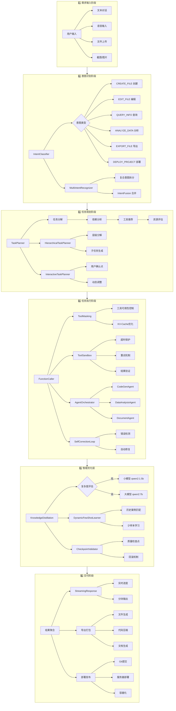
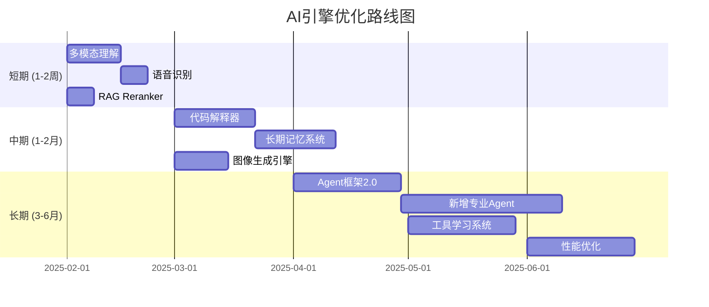

# PC版项目创建到交付流程图

> 版本: v1.0.0 | 更新时间: 2025-01-26
> 本文档描述 ChainlessChain Desktop 从项目创建到最终交付的完整流程，重点说明 AI 引擎模块的使用

---

## 目录

1. [整体流程概览](#1-整体流程概览)
2. [详细流程图](#2-详细流程图)
3. [AI引擎模块详解](#3-ai引擎模块详解)
4. [未集成AI引擎分析](#4-未集成ai引擎分析)
5. [优化方案](#5-优化方案)

---

## 1. 整体流程概览

```
┌─────────────────────────────────────────────────────────────────────────────┐
│                        PC版项目创建到交付流程                                  │
├─────────────────────────────────────────────────────────────────────────────┤
│                                                                             │
│  ┌──────────┐    ┌──────────┐    ┌──────────┐    ┌──────────┐    ┌────────┐ │
│  │ 需求输入  │ →  │ 意图识别  │ →  │ 任务规划  │ →  │ 任务执行  │ →  │ 交付验收 │ │
│  └──────────┘    └──────────┘    └──────────┘    └──────────┘    └────────┘ │
│       ↓              ↓              ↓              ↓              ↓        │
│  ┌──────────┐    ┌──────────┐    ┌──────────┐    ┌──────────┐    ┌────────┐ │
│  │  用户对话  │    │ AI引擎层  │    │ 任务分解  │    │ 工具调用  │    │ 结果输出 │ │
│  │  语音输入  │    │ 意图分类  │    │ 依赖分析  │    │ 多Agent   │    │ 部署发布 │ │
│  │  文件上传  │    │ 实体提取  │    │ 优先级    │    │ 沙箱执行  │    │ 导出打包 │ │
│  └──────────┘    └──────────┘    └──────────┘    └──────────┘    └────────┘ │
│                                                                             │
└─────────────────────────────────────────────────────────────────────────────┘
```

---

## 2. 详细流程图

### 2.1 完整交付流程



### 2.2 AI引擎处理流水线

```
┌─────────────────────────────────────────────────────────────────────────────────────┐
│                              AI Engine Processing Pipeline                           │
├─────────────────────────────────────────────────────────────────────────────────────┤
│                                                                                     │
│  用户输入                                                                            │
│     │                                                                               │
│     ▼                                                                               │
│  ┌─────────────────────────────────────────────────────────────────────────────┐    │
│  │                         Phase 0: 核心处理                                    │    │
│  │  ┌──────────────┐   ┌──────────────┐   ┌──────────────┐                    │    │
│  │  │ SlotFiller   │ → │ IntentClass  │ → │ TaskPlanner  │                    │    │
│  │  │ 参数自动补全  │   │ 意图分类      │   │ 任务规划      │                    │    │
│  │  └──────────────┘   └──────────────┘   └──────────────┘                    │    │
│  └─────────────────────────────────────────────────────────────────────────────┘    │
│     │                                                                               │
│     ▼                                                                               │
│  ┌─────────────────────────────────────────────────────────────────────────────┐    │
│  │                         Phase 1: 智能增强                                    │    │
│  │  ┌──────────────┐   ┌──────────────┐   ┌──────────────┐                    │    │
│  │  │ MultiIntent  │ → │ FewShot      │ → │ Hierarchical │                    │    │
│  │  │ 多意图识别    │   │ 少样本学习    │   │ 层级规划      │                    │    │
│  │  └──────────────┘   └──────────────┘   └──────────────┘                    │    │
│  └─────────────────────────────────────────────────────────────────────────────┘    │
│     │                                                                               │
│     ▼                                                                               │
│  ┌─────────────────────────────────────────────────────────────────────────────┐    │
│  │                         Phase 2: 执行优化                                    │    │
│  │  ┌──────────────┐   ┌──────────────┐   ┌──────────────┐                    │    │
│  │  │ Knowledge    │ → │ ToolMasking  │ → │ ToolSandbox  │                    │    │
│  │  │ Distillation │   │ 工具遮罩      │   │ 沙箱执行      │                    │    │
│  │  │ 知识蒸馏      │   │              │   │              │                    │    │
│  │  └──────────────┘   └──────────────┘   └──────────────┘                    │    │
│  └─────────────────────────────────────────────────────────────────────────────┘    │
│     │                                                                               │
│     ▼                                                                               │
│  ┌─────────────────────────────────────────────────────────────────────────────┐    │
│  │                       Phase 3: 多Agent协作                                   │    │
│  │  ┌──────────────┐   ┌──────────────┐   ┌──────────────┐                    │    │
│  │  │ Orchestrator │ → │ Specialized  │ → │ MessagePass  │                    │    │
│  │  │ Agent调度     │   │ Agents       │   │ Agent通信     │                    │    │
│  │  │              │   │ 专业Agent     │   │              │                    │    │
│  │  └──────────────┘   └──────────────┘   └──────────────┘                    │    │
│  └─────────────────────────────────────────────────────────────────────────────┘    │
│     │                                                                               │
│     ▼                                                                               │
│  ┌─────────────────────────────────────────────────────────────────────────────┐    │
│  │                       Phase 4: 质量保障                                      │    │
│  │  ┌──────────────┐   ┌──────────────┐   ┌──────────────┐                    │    │
│  │  │ Checkpoint   │ → │ SelfCorrect  │ → │ Streaming    │                    │    │
│  │  │ Validator    │   │ Loop         │   │ Response     │                    │    │
│  │  │ 检查点验证    │   │ 自我修正      │   │ 流式响应      │                    │    │
│  │  └──────────────┘   └──────────────┘   └──────────────┘                    │    │
│  └─────────────────────────────────────────────────────────────────────────────┘    │
│     │                                                                               │
│     ▼                                                                               │
│  输出结果                                                                            │
│                                                                                     │
└─────────────────────────────────────────────────────────────────────────────────────┘
```

---

## 3. AI引擎模块详解

### 3.1 模块架构图

```
desktop-app-vue/src/main/ai-engine/
├── 🎯 核心管理器
│   ├── ai-engine-manager.js              # 基础编排器
│   ├── ai-engine-manager-optimized.js    # 优化版(含沙箱+监控)
│   ├── ai-engine-manager-p1.js           # P1增强版
│   ├── ai-engine-manager-p2.js           # P2增强版
│   └── ai-engine-config.js               # 统一配置 v0.18.0
│
├── 🧠 意图识别层
│   ├── intent-classifier.js              # 6类意图分类器
│   ├── intent-recognizer.js              # 高级意图识别
│   ├── multi-intent-recognizer.js        # 多意图处理
│   ├── intent-fusion.js                  # 意图合并/融合
│   ├── followup-intent-classifier.js     # 追问意图检测
│   └── followup-intent-ipc.js            # 追问IPC
│
├── 📋 任务规划层
│   ├── task-planner.js                   # 核心任务分解
│   ├── task-planner-enhanced.js          # 增强规划器
│   ├── task-planner-interactive.js       # 交互式规划
│   ├── hierarchical-task-planner.js      # 层级分解
│   ├── task-decomposition-enhancement.js # 分解增强
│   ├── task-executor.js                  # 任务执行引擎
│   └── interactive-planning-ipc.js       # 交互规划IPC
│
├── 🔧 工具调用层
│   ├── function-caller.js                # 主工具调用器(Manus集成)
│   ├── extended-tools.js                 # 基础工具(1-12)
│   ├── extended-tools-2.js ~ -12.js      # 分类工具套件
│   ├── extended-tools-office.js          # Office工具
│   ├── extended-tools-datascience.js     # 数据科学工具
│   ├── extended-tools-project.js         # 项目工具
│   ├── tool-masking.js                   # 🔥 工具遮罩(Manus)
│   ├── tool-sandbox.js                   # 工具沙箱
│   ├── tool-composition-system.js        # 工具组合链
│   └── ml-tool-matcher.js                # ML工具匹配
│
├── ⚡ 优化模块 (P0-P2)
│   ├── slot-filler.js                    # 参数补全(P0)
│   ├── checkpoint-validator.js           # 质量验证(P1)
│   ├── self-correction-loop.js           # 自动修正(P1)
│   ├── dynamic-few-shot-learner.js       # 少样本学习(P1)
│   ├── knowledge-distillation.js         # 知识蒸馏(P2)
│   ├── streaming-response.js             # 实时进度(P2)
│   ├── history-memory-optimization.js    # 记忆优化
│   └── response-parser.js                # 响应解析
│
├── 🤖 多Agent系统
│   └── multi-agent/
│       ├── agent-orchestrator.js         # Agent协调器(OpenManus)
│       ├── specialized-agent.js          # 基础Agent类
│       ├── index.js                      # 导出
│       ├── multi-agent-ipc.js            # IPC通信
│       └── agents/
│           ├── code-generation-agent.js  # 代码生成专家
│           ├── data-analysis-agent.js    # 数据分析专家
│           └── document-agent.js         # 文档处理专家
│
├── 📊 智能推荐层 (v0.24.0)
│   ├── data-collector.js                 # 用户行为数据
│   ├── user-profile-manager.js           # 用户画像
│   ├── feature-extractor.js              # 特征提取
│   ├── collaborative-filter.js           # 协同过滤
│   ├── content-recommender.js            # 内容推荐
│   ├── hybrid-recommender.js             # 混合推荐
│   └── conversation-executor.js          # 对话管理
│
├── 📝 任务追踪
│   ├── task-tracker-file.js              # 文件追踪
│   ├── task-tracker-ipc.js               # IPC追踪
│   └── real-implementations.js           # 实现细节
│
└── 🔌 IPC通信
    ├── ai-engine-ipc.js                  # 主IPC处理
    └── multi-agent/multi-agent-ipc.js    # 多Agent IPC
```

### 3.2 已集成的AI引擎/工具

| 类别 | 引擎/工具 | 状态 | 用途 |
|------|-----------|------|------|
| **LLM Provider** | Ollama (本地) | ✅ 已集成 | qwen2:7b, qwen2:1.5b |
| | OpenAI | ✅ 已集成 | GPT-3.5, GPT-4 |
| | Anthropic | ✅ 已集成 | Claude 系列 |
| | Google | ✅ 已集成 | Gemini 系列 |
| | 14+ 云服务商 | ✅ 已集成 | 多样化选择 |
| **引擎类型** | Web Engine | ✅ 已集成 | HTML/CSS/JS 生成 |
| | Document Engine | ✅ 已集成 | Word/PDF/MD 处理 |
| | Data Engine | ✅ 已集成 | Excel/CSV 分析 |
| | PPT Engine | ✅ 已集成 | PowerPoint 生成 |
| | Code Engine | ✅ 已集成 | 代码生成与开发 |
| | Image Engine | ✅ 已集成 | 图片处理 |
| | Video Engine | ✅ 已集成 | 视频处理 |
| **工具数量** | 100+ 工具 | ✅ 已集成 | 16个工具套件 |

### 3.3 工具分类详情

```
┌─────────────────────────────────────────────────────────────────────────────┐
│                            工具套件总览 (100+ 工具)                          │
├─────────────────────────────────────────────────────────────────────────────┤
│                                                                             │
│  📁 文件操作工具 (file_*)          │  🌐 网络请求工具 (http_*)              │
│  ├── file_read                    │  ├── http_get                         │
│  ├── file_write                   │  ├── http_post                        │
│  ├── file_delete                  │  ├── http_put                         │
│  ├── file_copy                    │  └── api_client                       │
│  └── file_move                    │                                       │
│                                    │                                       │
│  📝 文档处理工具 (doc_*)           │  🔧 Git操作工具 (git_*)               │
│  ├── word_create                  │  ├── git_commit                       │
│  ├── word_edit                    │  ├── git_push                         │
│  ├── markdown_processor           │  ├── git_pull                         │
│  └── pdf_generator                │  └── git_branch                       │
│                                    │                                       │
│  📊 数据分析工具 (data_*)          │  💻 代码工具 (code_*)                 │
│  ├── excel_create                 │  ├── code_formatter                   │
│  ├── excel_analysis               │  ├── code_analyzer                    │
│  ├── csv_parser                   │  ├── test_runner                      │
│  └── chart_generator              │  └── lint_checker                     │
│                                    │                                       │
│  🖼️ 多媒体工具 (media_*)          │  🚀 部署工具 (deploy_*)               │
│  ├── image_process                │  ├── project_build                    │
│  ├── image_resize                 │  ├── docker_deploy                    │
│  ├── ocr_extract                  │  ├── server_upload                    │
│  └── video_process                │  └── ci_cd_trigger                    │
│                                    │                                       │
│  🔬 数据科学工具                   │  📦 项目管理工具                       │
│  ├── data_preprocessing           │  ├── project_initialize               │
│  ├── feature_engineering          │  ├── dependency_install               │
│  ├── ml_model_training            │  ├── build_project                    │
│  └── result_visualization         │  └── test_suite                       │
│                                    │                                       │
└─────────────────────────────────────────────────────────────────────────────┘
```

---

## 4. 未集成AI引擎分析

### 4.1 缺失的AI能力

| 类别 | 缺失能力 | 重要程度 | 说明 |
|------|----------|----------|------|
| **视觉AI** | 图像生成 (DALL-E/SD) | 🔴 高 | 仅有处理，无生成能力 |
| | 图像理解 (GPT-4V) | 🔴 高 | 多模态理解缺失 |
| | OCR增强 (DocTR/PaddleOCR) | 🟡 中 | Tesseract精度有限 |
| **语音AI** | 语音识别 (Whisper) | 🔴 高 | 无本地语音转文字 |
| | 语音合成 (TTS) | 🟡 中 | 无文字转语音 |
| | 语音克隆 | 🟢 低 | 高级功能 |
| **代码AI** | 代码补全 (Copilot式) | 🔴 高 | 实时补全缺失 |
| | 代码审查 (静态分析) | 🟡 中 | 自动化审查 |
| | 代码解释器 (Sandbox) | 🔴 高 | Python沙箱执行 |
| **推理AI** | 推理链 (CoT增强) | 🟡 中 | 复杂推理优化 |
| | 数学求解器 | 🟡 中 | 数学公式求解 |
| | 逻辑验证器 | 🟢 低 | 形式化验证 |
| **专业AI** | RAG重排序 (Reranker) | 🔴 高 | 检索精度提升 |
| | 向量数据库 (本地) | 🟡 中 | 当前依赖Qdrant远程 |
| | 知识图谱 | 🟡 中 | 结构化知识推理 |
| **Agent增强** | 工具学习 (Tool Learning) | 🟡 中 | 动态工具发现 |
| | 反思机制 (Reflexion) | 🟡 中 | 深度自我反思 |
| | 记忆系统 (MemGPT式) | 🔴 高 | 长期记忆管理 |

### 4.2 详细缺失分析

```
┌─────────────────────────────────────────────────────────────────────────────┐
│                            未集成AI引擎详细分析                              │
├─────────────────────────────────────────────────────────────────────────────┤
│                                                                             │
│  🔴 高优先级缺失 (影响核心体验)                                               │
│  ┌────────────────────────────────────────────────────────────────────┐     │
│  │  1. 多模态理解                                                      │     │
│  │     - 图片理解 (GPT-4V, Claude 3 Vision)                           │     │
│  │     - 视频理解 (帧分析+LLM)                                         │     │
│  │     - 音频理解 (Whisper + LLM)                                     │     │
│  │     影响: 无法处理用户上传的图片/视频/音频内容                         │     │
│  │                                                                    │     │
│  │  2. 图像生成                                                        │     │
│  │     - Stable Diffusion (本地)                                      │     │
│  │     - DALL-E 3 (API)                                               │     │
│  │     - Midjourney (API)                                             │     │
│  │     影响: 无法生成设计稿/图标/插图                                    │     │
│  │                                                                    │     │
│  │  3. 代码解释器 (Sandbox)                                            │     │
│  │     - Python沙箱执行                                                │     │
│  │     - 数据可视化自动生成                                             │     │
│  │     - 复杂计算执行                                                   │     │
│  │     影响: 无法执行动态代码，数据分析受限                               │     │
│  │                                                                    │     │
│  │  4. 语音识别 (Whisper)                                              │     │
│  │     - 本地Whisper模型                                               │     │
│  │     - 实时语音转文字                                                 │     │
│  │     影响: 不支持语音交互                                              │     │
│  │                                                                    │     │
│  │  5. RAG Reranker                                                   │     │
│  │     - BGE Reranker                                                 │     │
│  │     - Cohere Rerank                                                │     │
│  │     影响: 检索结果排序不够精准                                        │     │
│  │                                                                    │     │
│  │  6. 长期记忆系统 (MemGPT式)                                          │     │
│  │     - 分层记忆存储                                                   │     │
│  │     - 记忆检索与遗忘                                                 │     │
│  │     影响: 跨会话上下文丢失                                            │     │
│  └────────────────────────────────────────────────────────────────────┘     │
│                                                                             │
│  🟡 中优先级缺失 (提升用户体验)                                              │
│  ┌────────────────────────────────────────────────────────────────────┐     │
│  │  7. 语音合成 (TTS)                                                  │     │
│  │     - Edge TTS / Azure TTS                                         │     │
│  │     - 本地TTS引擎                                                   │     │
│  │                                                                    │     │
│  │  8. 知识图谱引擎                                                     │     │
│  │     - Neo4j集成                                                    │     │
│  │     - 图推理能力                                                    │     │
│  │                                                                    │     │
│  │  9. 本地向量数据库                                                   │     │
│  │     - LanceDB / ChromaDB                                           │     │
│  │     - 减少远程依赖                                                   │     │
│  │                                                                    │     │
│  │  10. 工具学习 (Tool Learning)                                       │     │
│  │      - 动态工具发现与学习                                            │     │
│  │      - API自动探索                                                  │     │
│  │                                                                    │     │
│  │  11. 反思机制 (Reflexion)                                           │     │
│  │      - 执行后反思                                                   │     │
│  │      - 策略优化                                                     │     │
│  └────────────────────────────────────────────────────────────────────┘     │
│                                                                             │
└─────────────────────────────────────────────────────────────────────────────┘
```

---

## 5. 优化方案

### 5.1 短期优化 (1-2周)

#### 5.1.1 集成多模态理解

```javascript
// 新增文件: desktop-app-vue/src/main/ai-engine/vision-engine.js

/**
 * VisionEngine - 多模态视觉理解
 *
 * 功能:
 * 1. 图片理解 (GPT-4V/Claude 3 Vision)
 * 2. OCR增强 (DocTR/PaddleOCR)
 * 3. 图表解析
 */
class VisionEngine {
  constructor(llmManager) {
    this.llmManager = llmManager;
    this.providers = {
      openai: 'gpt-4-vision-preview',
      anthropic: 'claude-3-opus-20240229',
      local: 'llava:7b'  // Ollama本地多模态
    };
  }

  async analyzeImage(imagePath, prompt) {
    const base64 = await this.encodeImage(imagePath);
    return this.llmManager.chatWithVision(base64, prompt);
  }

  async extractText(imagePath) {
    // 优先使用本地OCR，失败后降级到云端
    try {
      return await this.localOCR(imagePath);
    } catch {
      return await this.cloudOCR(imagePath);
    }
  }
}
```

**集成步骤:**
1. 在 `llm-manager.js` 添加 `chatWithVision` 方法
2. 创建 `vision-engine.js` 模块
3. 注册 `vision_analyze` 工具到 FunctionCaller
4. 添加 IPC 通道 `ai:analyzeImage`

#### 5.1.2 集成语音识别 (Whisper)

```javascript
// 新增文件: desktop-app-vue/src/main/ai-engine/speech-engine.js

const { spawn } = require('child_process');
const path = require('path');

/**
 * SpeechEngine - 语音识别与合成
 */
class SpeechEngine {
  constructor() {
    this.whisperPath = path.join(__dirname, '../../bin/whisper.cpp');
    this.model = 'base';  // tiny, base, small, medium, large
  }

  async transcribe(audioPath, options = {}) {
    const { language = 'zh', translate = false } = options;

    return new Promise((resolve, reject) => {
      const args = [
        '-m', `models/ggml-${this.model}.bin`,
        '-f', audioPath,
        '-l', language,
        '--output-json'
      ];

      if (translate) args.push('--translate');

      const whisper = spawn(this.whisperPath, args);
      let output = '';

      whisper.stdout.on('data', (data) => output += data);
      whisper.on('close', (code) => {
        if (code === 0) resolve(JSON.parse(output));
        else reject(new Error(`Whisper exited with code ${code}`));
      });
    });
  }

  async synthesize(text, options = {}) {
    // 集成 Edge TTS
    const edgeTTS = require('edge-tts');
    return edgeTTS.synthesize(text, options);
  }
}
```

#### 5.1.3 添加 RAG Reranker

```javascript
// 新增文件: desktop-app-vue/src/main/rag/reranker.js

/**
 * Reranker - 检索结果重排序
 */
class Reranker {
  constructor(options = {}) {
    this.provider = options.provider || 'local';  // local | cohere | bge
    this.model = options.model || 'BAAI/bge-reranker-base';
  }

  async rerank(query, documents, topK = 5) {
    if (this.provider === 'local') {
      return this.localRerank(query, documents, topK);
    }
    return this.cohereRerank(query, documents, topK);
  }

  async localRerank(query, documents, topK) {
    // 使用 Ollama 运行本地 reranker
    const scores = await Promise.all(
      documents.map(doc => this.scoreDocument(query, doc))
    );

    return documents
      .map((doc, i) => ({ ...doc, score: scores[i] }))
      .sort((a, b) => b.score - a.score)
      .slice(0, topK);
  }

  async scoreDocument(query, doc) {
    // 使用交叉编码器计算相关性分数
    const prompt = `Query: ${query}\nDocument: ${doc.content}\nRelevance (0-1):`;
    const response = await this.llm.generate(prompt);
    return parseFloat(response);
  }
}
```

### 5.2 中期优化 (1-2月)

#### 5.2.1 代码解释器 (Python Sandbox)

```javascript
// 新增文件: desktop-app-vue/src/main/ai-engine/code-interpreter.js

const { PythonShell } = require('python-shell');
const Docker = require('dockerode');

/**
 * CodeInterpreter - Python代码沙箱执行
 */
class CodeInterpreter {
  constructor() {
    this.docker = new Docker();
    this.containerImage = 'python:3.11-slim';
    this.timeout = 30000;  // 30秒超时
  }

  async execute(code, context = {}) {
    // 创建临时容器执行代码
    const container = await this.docker.createContainer({
      Image: this.containerImage,
      Cmd: ['python', '-c', code],
      HostConfig: {
        Memory: 512 * 1024 * 1024,  // 512MB限制
        CpuPeriod: 100000,
        CpuQuota: 50000,  // 50% CPU
        NetworkMode: 'none'  // 禁用网络
      }
    });

    await container.start();

    const result = await new Promise((resolve, reject) => {
      const timer = setTimeout(() => {
        container.kill();
        reject(new Error('Execution timeout'));
      }, this.timeout);

      container.wait((err, data) => {
        clearTimeout(timer);
        if (err) reject(err);
        else resolve(data);
      });
    });

    const logs = await container.logs({ stdout: true, stderr: true });
    await container.remove();

    return {
      success: result.StatusCode === 0,
      output: logs.toString(),
      executionTime: Date.now() - startTime
    };
  }

  async visualize(data, chartType = 'line') {
    const code = this.generateVisualizationCode(data, chartType);
    return this.execute(code);
  }
}
```

#### 5.2.2 长期记忆系统 (MemGPT式)

```javascript
// 新增文件: desktop-app-vue/src/main/ai-engine/memory-manager.js

/**
 * MemoryManager - 分层记忆系统
 *
 * 架构:
 * - 工作记忆 (Working Memory): 当前会话上下文
 * - 短期记忆 (Short-term): 最近N轮对话
 * - 长期记忆 (Long-term): 向量化存储
 * - 核心记忆 (Core): 用户偏好/重要事实
 */
class MemoryManager {
  constructor(options = {}) {
    this.workingMemory = [];
    this.shortTermLimit = options.shortTermLimit || 10;
    this.vectorDB = options.vectorDB;
    this.coreMemory = new Map();
  }

  // 记忆写入
  async memorize(content, type = 'conversation') {
    const memory = {
      id: generateId(),
      content,
      type,
      timestamp: Date.now(),
      importance: await this.assessImportance(content)
    };

    if (type === 'core') {
      this.coreMemory.set(memory.id, memory);
    } else {
      // 向量化存储到长期记忆
      const embedding = await this.embed(content);
      await this.vectorDB.upsert(memory.id, embedding, memory);
    }

    return memory;
  }

  // 记忆检索
  async recall(query, options = {}) {
    const { limit = 5, includeCore = true } = options;

    // 1. 检索核心记忆
    const coreResults = includeCore ?
      this.searchCoreMemory(query) : [];

    // 2. 向量检索长期记忆
    const queryEmbedding = await this.embed(query);
    const longTermResults = await this.vectorDB.search(queryEmbedding, limit);

    // 3. 合并并排序
    return this.mergeAndRank([...coreResults, ...longTermResults]);
  }

  // 记忆整合 (定期运行)
  async consolidate() {
    // 将短期记忆中的重要内容转移到长期记忆
    for (const memory of this.workingMemory) {
      if (memory.importance > 0.7) {
        await this.memorize(memory.content, 'long-term');
      }
    }

    // 清理工作记忆
    this.workingMemory = this.workingMemory.slice(-this.shortTermLimit);
  }

  // 遗忘机制
  async forget(criteria) {
    // 基于时间衰减和重要性的遗忘策略
    const candidates = await this.vectorDB.query(criteria);
    for (const memory of candidates) {
      const decayFactor = this.calculateDecay(memory);
      if (decayFactor < 0.1) {
        await this.vectorDB.delete(memory.id);
      }
    }
  }
}
```

#### 5.2.3 图像生成引擎

```javascript
// 新增文件: desktop-app-vue/src/main/ai-engine/image-generator.js

/**
 * ImageGenerator - 图像生成引擎
 *
 * 支持:
 * - Stable Diffusion (本地)
 * - DALL-E 3 (API)
 * - Replicate (多模型)
 */
class ImageGenerator {
  constructor(options = {}) {
    this.providers = {
      local: new SDLocalProvider(),
      openai: new DALLEProvider(options.openaiKey),
      replicate: new ReplicateProvider(options.replicateKey)
    };
    this.defaultProvider = options.defaultProvider || 'local';
  }

  async generate(prompt, options = {}) {
    const {
      provider = this.defaultProvider,
      size = '1024x1024',
      style = 'vivid',
      negativePrompt = ''
    } = options;

    const generator = this.providers[provider];

    // 优化提示词
    const enhancedPrompt = await this.enhancePrompt(prompt);

    return generator.generate({
      prompt: enhancedPrompt,
      negativePrompt,
      size,
      style
    });
  }

  async enhancePrompt(prompt) {
    // 使用LLM优化图像生成提示词
    const systemPrompt = `你是一个专业的AI绘图提示词优化专家。
    将用户的简单描述转换为详细的、适合AI绘图的英文提示词。
    包含：主体描述、风格、光照、构图、细节等。`;

    return this.llm.chat(systemPrompt, prompt);
  }
}
```

### 5.3 长期优化 (3-6月)

#### 5.3.1 完整Agent框架升级

```
┌─────────────────────────────────────────────────────────────────────────────┐
│                         Agent Framework 2.0                                  │
├─────────────────────────────────────────────────────────────────────────────┤
│                                                                             │
│  ┌───────────────────────────────────────────────────────────────────┐      │
│  │                      Agent Orchestrator 2.0                       │      │
│  │  ┌─────────────┐ ┌─────────────┐ ┌─────────────┐ ┌─────────────┐ │      │
│  │  │ Planning    │ │ Reflection  │ │ Tool Learn  │ │ Memory      │ │      │
│  │  │ Agent       │ │ Agent       │ │ Agent       │ │ Agent       │ │      │
│  │  └─────────────┘ └─────────────┘ └─────────────┘ └─────────────┘ │      │
│  └───────────────────────────────────────────────────────────────────┘      │
│                              ↓ ↑                                            │
│  ┌───────────────────────────────────────────────────────────────────┐      │
│  │                    Specialized Agents (扩展)                       │      │
│  │  ┌─────────┐ ┌─────────┐ ┌─────────┐ ┌─────────┐ ┌─────────────┐ │      │
│  │  │ Code    │ │ Data    │ │ Doc     │ │ Design  │ │ Research    │ │      │
│  │  │ Agent   │ │ Agent   │ │ Agent   │ │ Agent   │ │ Agent       │ │      │
│  │  └─────────┘ └─────────┘ └─────────┘ └─────────┘ └─────────────┘ │      │
│  │  ┌─────────┐ ┌─────────┐ ┌─────────┐ ┌─────────┐ ┌─────────────┐ │      │
│  │  │ Vision  │ │ Audio   │ │ Browser │ │ API     │ │ Security    │ │      │
│  │  │ Agent   │ │ Agent   │ │ Agent   │ │ Agent   │ │ Agent       │ │      │
│  │  └─────────┘ └─────────┘ └─────────┘ └─────────┘ └─────────────┘ │      │
│  └───────────────────────────────────────────────────────────────────┘      │
│                              ↓ ↑                                            │
│  ┌───────────────────────────────────────────────────────────────────┐      │
│  │                      Shared Infrastructure                         │      │
│  │  ┌─────────────┐ ┌─────────────┐ ┌─────────────┐ ┌─────────────┐ │      │
│  │  │ Unified     │ │ Tool        │ │ Memory      │ │ Event       │ │      │
│  │  │ Context     │ │ Registry    │ │ Store       │ │ Bus         │ │      │
│  │  └─────────────┘ └─────────────┘ └─────────────┘ └─────────────┘ │      │
│  └───────────────────────────────────────────────────────────────────┘      │
│                                                                             │
└─────────────────────────────────────────────────────────────────────────────┘
```

#### 5.3.2 新增专业Agent

| Agent | 功能 | 依赖 |
|-------|------|------|
| **VisionAgent** | 图像理解/生成/编辑 | VisionEngine, ImageGenerator |
| **AudioAgent** | 语音识别/合成/处理 | SpeechEngine |
| **BrowserAgent** | 网页浏览/数据抓取 | Playwright |
| **APIAgent** | API探索/测试/集成 | HTTP Client |
| **SecurityAgent** | 代码审计/漏洞扫描 | ESLint, Security Rules |
| **ResearchAgent** | 信息检索/知识综合 | WebSearch, RAG |
| **DesignAgent** | UI设计/原型生成 | ImageGenerator, SVG Tools |

#### 5.3.3 优化路线图



### 5.4 配置集成示例

```javascript
// ai-engine-config.js 新增配置

module.exports = {
  // ... 现有配置

  // 新增: 多模态配置
  vision: {
    enabled: true,
    provider: 'local',  // local | openai | anthropic
    models: {
      local: 'llava:7b',
      openai: 'gpt-4-vision-preview',
      anthropic: 'claude-3-opus-20240229'
    }
  },

  // 新增: 语音配置
  speech: {
    enabled: true,
    whisperModel: 'base',  // tiny | base | small | medium | large
    ttsProvider: 'edge',   // edge | azure | local
    language: 'zh'
  },

  // 新增: 代码解释器配置
  codeInterpreter: {
    enabled: true,
    sandbox: 'docker',  // docker | pyodide
    timeout: 30000,
    memoryLimit: '512m',
    cpuLimit: 0.5
  },

  // 新增: 图像生成配置
  imageGeneration: {
    enabled: true,
    provider: 'local',  // local | openai | replicate
    localModel: 'sd-xl-base-1.0',
    defaultSize: '1024x1024'
  },

  // 新增: 记忆系统配置
  memory: {
    enabled: true,
    shortTermLimit: 10,
    consolidationInterval: 3600000,  // 1小时
    forgetThreshold: 0.1
  },

  // 新增: Reranker配置
  reranker: {
    enabled: true,
    provider: 'local',  // local | cohere
    model: 'BAAI/bge-reranker-base',
    topK: 5
  }
};
```

---

## 6. 总结

### 6.1 当前状态

| 维度 | 完成度 | 说明 |
|------|--------|------|
| 核心流程 | 95% | 完整的意图识别→任务规划→执行流水线 |
| LLM集成 | 90% | 14+云服务商 + Ollama本地 |
| 工具系统 | 90% | 100+工具，16个工具套件 |
| 多Agent | 80% | 3个专业Agent，需扩展 |
| 多模态 | 30% | 仅OCR，缺图像/语音 |
| 记忆系统 | 50% | 有历史记忆，缺长期记忆 |

### 6.2 优先级建议

1. **P0 (立即)**: 多模态理解 + RAG Reranker
2. **P1 (1月内)**: 语音识别 + 代码解释器
3. **P2 (3月内)**: 长期记忆 + 图像生成
4. **P3 (6月内)**: Agent框架2.0 + 全面专业Agent

### 6.3 预期收益

- **多模态**: 用户可上传图片/音频，AI能理解和处理
- **代码解释器**: 复杂数据分析能力提升50%+
- **长期记忆**: 跨会话连续性，用户体验提升
- **图像生成**: 设计辅助能力，创意工作支持

---

*文档路径: `docs/flows/PC_PROJECT_DELIVERY_FLOW.md`*
*相关代码: `desktop-app-vue/src/main/ai-engine/`*
