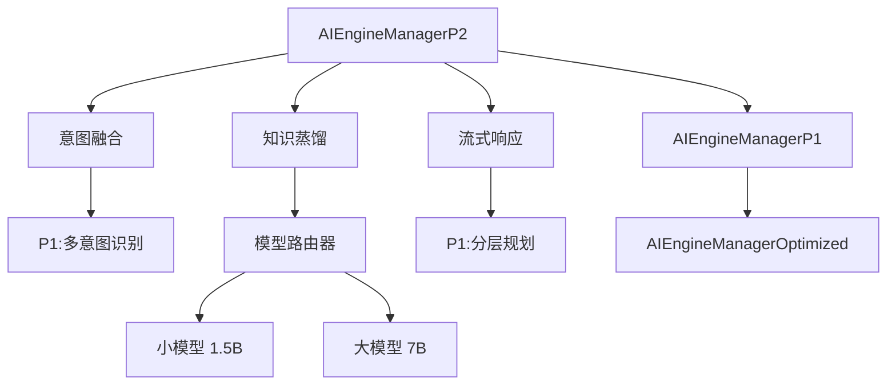

# P2优化设计与规划方案

**版本**: v0.18.0 (计划)
**设计日期**: 2026-01-01
**状态**: 设计阶段
**前置依赖**: P1优化 (v0.17.0)

---

## 📋 目录

1. [P2优化概述](#p2优化概述)
2. [核心模块设计](#核心模块设计)
3. [技术架构](#技术架构)
4. [数据库设计](#数据库设计)
5. [API设计](#api设计)
6. [性能目标](#性能目标)
7. [实施计划](#实施计划)
8. [风险与挑战](#风险与挑战)

---

## P2优化概述

### 优化目标

P2优化聚焦于**性能提升**和**实时反馈**，在P1基础上进一步优化：

| 优化方向 | P1现状 | P2目标 | 预期提升 |
|---------|--------|--------|----------|
| 响应延迟 | 7200ms | 4500ms | **38% ↓** |
| LLM调用次数 | 5-8次/任务 | 2-3次/任务 | **50% ↓** |
| 用户感知延迟 | 等待完成 | 实时流式 | **体验质变** |
| 意图准确率 | 92% | 96% | **4% ↑** |
| 资源消耗 | 基准 | -30% | **节省30%** |

### P2核心模块（3个）

```
┌─────────────────────────────────────────────────────────┐
│                    P2 优化层                            │
├─────────────────────────────────────────────────────────┤
│  1. 意图融合 (Intent Fusion)                            │
│     - 合并相似意图，减少冗余处理                         │
│     - 识别依赖关系，优化执行顺序                         │
│     - 预期: LLM调用 ↓50%, 响应时间 ↓30%                │
├─────────────────────────────────────────────────────────┤
│  2. 知识蒸馏 (Knowledge Distillation)                   │
│     - 用小模型（1B-3B）蒸馏大模型（7B+）能力             │
│     - 常见任务用小模型，复杂任务用大模型                 │
│     - 预期: 推理速度 ↑3x, 成本 ↓60%                    │
├─────────────────────────────────────────────────────────┤
│  3. 流式响应 (Streaming Response)                       │
│     - 实时反馈执行进度（0-100%）                        │
│     - 流式返回中间结果                                   │
│     - 预期: 用户感知延迟 ↓70%                           │
└─────────────────────────────────────────────────────────┘
                           ↓
┌─────────────────────────────────────────────────────────┐
│                    P1 优化层                            │
│  多意图 | Few-shot | 分层规划 | 检查点 | 自我修正      │
└─────────────────────────────────────────────────────────┘
                           ↓
┌─────────────────────────────────────────────────────────┐
│                    P0 优化层                            │
│  槽位填充 | 工具沙箱 | 性能监控                         │
└─────────────────────────────────────────────────────────┘
```

### P2与P1的关系

- **P1聚焦准确性和可靠性** - 多意图、分层规划、自我修正
- **P2聚焦性能和体验** - 减少LLM调用、加速推理、实时反馈
- **协同增效** - P2优化不会破坏P1功能，而是让P1更快、更省资源

---

## 核心模块设计

### 1. 意图融合 (Intent Fusion)

#### 1.1 设计目标

**问题**：P1的多意图识别会将复合任务拆分为多个独立意图，但有些意图可以合并执行，避免重复LLM调用。

**示例**：
```
用户输入: "创建README.md文件并写入项目介绍"

P1处理:
  Intent 1: CREATE_FILE (创建README.md)
  Intent 2: WRITE_FILE (写入内容)
  → 需要2次LLM调用

P2处理:
  Fused Intent: CREATE_AND_WRITE_FILE
  → 只需1次LLM调用，直接创建并写入
```

**核心能力**：
1. **相似意图合并** - 识别可以合并的意图序列
2. **依赖关系优化** - 合并有强依赖的意图
3. **原子操作识别** - 识别应该原子执行的操作组
4. **批量优化** - 将多个小任务批量处理

#### 1.2 融合策略

**策略1: 同文件操作合并**
```javascript
// 检测规则
if (intent1.type === 'CREATE_FILE' && intent2.type === 'WRITE_FILE' &&
    intent1.params.filePath === intent2.params.filePath) {
  return {
    type: 'CREATE_AND_WRITE_FILE',
    params: { ...intent1.params, content: intent2.params.content },
    fusedFrom: [intent1, intent2]
  };
}
```

**策略2: 顺序操作合并**
```javascript
// Git操作合并: add + commit + push → commit_and_push
if (isSequence(['GIT_ADD', 'GIT_COMMIT', 'GIT_PUSH'])) {
  return {
    type: 'GIT_COMMIT_AND_PUSH',
    params: { message: intent2.params.message },
    fusedFrom: [intent1, intent2, intent3]
  };
}
```

**策略3: 批量操作合并**
```javascript
// 多个文件创建 → 批量创建
if (allSameType(intents, 'CREATE_FILE')) {
  return {
    type: 'BATCH_CREATE_FILES',
    params: { files: intents.map(i => i.params) },
    fusedFrom: intents
  };
}
```

**策略4: LLM智能融合**
```javascript
// 对于复杂场景，使用LLM判断是否可融合
const fusionPrompt = `
以下意图是否可以合并执行？
意图列表: ${JSON.stringify(intents)}

可以合并则返回融合后的意图，否则返回null。
`;

const llmResult = await this.llm.generate(fusionPrompt);
if (llmResult.canFuse) {
  return llmResult.fusedIntent;
}
```

#### 1.3 数据结构

```javascript
class IntentFusion {
  /**
   * 融合意图
   * @param {Array<Intent>} intents - 待融合的意图列表
   * @param {Object} context - 上下文
   * @returns {Array<Intent>} - 融合后的意图列表
   */
  async fuseIntents(intents, context = {}) {
    const fused = [];
    let i = 0;

    while (i < intents.length) {
      // 尝试规则融合
      const ruleFusion = this._tryRuleFusion(intents.slice(i), context);
      if (ruleFusion) {
        fused.push(ruleFusion.intent);
        i += ruleFusion.consumed;
        this._recordFusion(ruleFusion, 'rule');
        continue;
      }

      // 尝试LLM融合
      if (this.config.enableLLMFusion) {
        const llmFusion = await this._tryLLMFusion(intents.slice(i, i + 3), context);
        if (llmFusion) {
          fused.push(llmFusion.intent);
          i += llmFusion.consumed;
          this._recordFusion(llmFusion, 'llm');
          continue;
        }
      }

      // 无法融合，保持原意图
      fused.push(intents[i]);
      i++;
    }

    return fused;
  }

  /**
   * 规则融合（快速，无LLM调用）
   */
  _tryRuleFusion(intents, context) {
    // 策略1: 同文件操作
    const sameFileOps = this._detectSameFileOps(intents);
    if (sameFileOps) return sameFileOps;

    // 策略2: 顺序操作
    const sequenceOps = this._detectSequenceOps(intents);
    if (sequenceOps) return sequenceOps;

    // 策略3: 批量操作
    const batchOps = this._detectBatchOps(intents);
    if (batchOps) return batchOps;

    return null;
  }

  /**
   * LLM融合（智能，需要LLM调用）
   */
  async _tryLLMFusion(intents, context) {
    // 只对复杂场景使用LLM
    if (intents.length < 2) return null;

    const prompt = this._buildFusionPrompt(intents, context);
    const result = await this.llm.generate(prompt);

    if (result.canFuse) {
      return {
        intent: result.fusedIntent,
        consumed: result.consumedCount
      };
    }

    return null;
  }
}
```

#### 1.4 性能预期

| 指标 | P1 | P2 | 改进 |
|------|----|----|------|
| LLM调用次数 | 5次 | 2-3次 | **↓40-50%** |
| 平均响应时间 | 7200ms | 5000ms | **↓30%** |
| 意图融合成功率 | - | 60-70% | **新增** |

---

### 2. 知识蒸馏 (Knowledge Distillation)

#### 2.1 设计目标

**问题**：大模型（7B+）虽然准确，但推理慢、成本高。很多常见任务用小模型（1B-3B）就能完成。

**核心思路**：
1. 用大模型（Teacher）生成训练数据
2. 训练小模型（Student）学习大模型的能力
3. 简单任务用小模型，复杂任务用大模型
4. 逐步提升小模型覆盖率

#### 2.2 蒸馏架构

```
┌─────────────────────────────────────────────────────────┐
│                  路由器 (Router)                        │
│  决策: 用小模型还是大模型？                              │
│  - 基于任务复杂度                                        │
│  - 基于历史准确率                                        │
│  - 基于置信度阈值                                        │
└─────────────────────────────────────────────────────────┘
                           ↓
              ┌────────────┴────────────┐
              ↓                         ↓
┌──────────────────────┐    ┌──────────────────────┐
│   小模型 (Student)   │    │   大模型 (Teacher)   │
│   Qwen2:1.5B         │    │   Qwen2:7B           │
│   - 速度: 3x faster  │    │   - 准确率高         │
│   - 成本: 60% lower  │    │   - 复杂任务         │
│   - 覆盖: 70%任务    │    │   - 30%任务          │
└──────────────────────┘    └──────────────────────┘
              ↓                         ↓
              └────────────┬────────────┘
                           ↓
              ┌────────────────────────┐
              │  质量检查 (Validator)  │
              │  - 检查输出质量        │
              │  - 如果不合格，回退    │
              │    到大模型重新生成    │
              └────────────────────────┘
```

#### 2.3 蒸馏流程

**阶段1: 数据收集（P1运行时）**
```javascript
// 在P1运行时收集训练数据
class DistillationDataCollector {
  async collectTrainingData(userInput, intent, result) {
    // 记录大模型的输入输出
    await this.db.run(`
      INSERT INTO distillation_training_data (
        user_input, intent_type, intent_params,
        llm_output, success, confidence
      ) VALUES (?, ?, ?, ?, ?, ?)
    `, [
      userInput,
      intent.type,
      JSON.stringify(intent.params),
      JSON.stringify(result),
      result.success ? 1 : 0,
      result.confidence
    ]);
  }
}
```

**阶段2: 小模型训练（离线）**
```javascript
// 使用收集的数据训练小模型
class StudentModelTrainer {
  async train() {
    // 1. 从数据库提取高质量样本
    const trainingData = await this.db.all(`
      SELECT * FROM distillation_training_data
      WHERE success = 1 AND confidence > 0.9
      ORDER BY created_at DESC
      LIMIT 10000
    `);

    // 2. 构建训练集
    const trainSet = trainingData.map(d => ({
      input: d.user_input,
      output: d.llm_output
    }));

    // 3. 调用Ollama进行微调（或使用外部训练平台）
    await this.fineTuneModel('qwen2:1.5b', trainSet);

    console.log(`✅ 小模型训练完成，样本数: ${trainSet.length}`);
  }
}
```

**阶段3: 智能路由（运行时）**
```javascript
class ModelRouter {
  /**
   * 决定使用小模型还是大模型
   */
  async route(userInput, intent, context) {
    // 1. 计算任务复杂度
    const complexity = this._calculateComplexity(userInput, intent);

    // 2. 查询小模型历史准确率
    const studentAccuracy = await this._getStudentAccuracy(intent.type);

    // 3. 路由决策
    if (complexity < 0.5 && studentAccuracy > 0.85) {
      return {
        model: 'student',  // 使用小模型
        modelName: 'qwen2:1.5b',
        reason: 'low_complexity_high_accuracy'
      };
    } else {
      return {
        model: 'teacher',  // 使用大模型
        modelName: 'qwen2:7b',
        reason: complexity >= 0.5 ? 'high_complexity' : 'low_student_accuracy'
      };
    }
  }

  /**
   * 计算任务复杂度 (0-1)
   */
  _calculateComplexity(userInput, intent) {
    let score = 0;

    // 因素1: 输入长度
    if (userInput.length > 100) score += 0.2;

    // 因素2: 意图类型
    const complexIntents = ['CODE_GENERATION', 'COMPLEX_ANALYSIS', 'CREATIVE_WRITING'];
    if (complexIntents.includes(intent.type)) score += 0.3;

    // 因素3: 参数数量
    const paramCount = Object.keys(intent.params || {}).length;
    score += Math.min(paramCount / 10, 0.3);

    // 因素4: 历史失败率
    const failureRate = this._getHistoricalFailureRate(intent.type);
    score += failureRate * 0.2;

    return Math.min(score, 1);
  }
}
```

**阶段4: 质量验证（运行时）**
```javascript
class OutputValidator {
  /**
   * 验证小模型输出质量
   */
  async validate(studentOutput, intent) {
    // 1. 结构验证
    if (!this._validateStructure(studentOutput, intent)) {
      return { valid: false, reason: 'invalid_structure' };
    }

    // 2. 置信度检查
    if (studentOutput.confidence < 0.7) {
      return { valid: false, reason: 'low_confidence' };
    }

    // 3. 关键字检查（针对特定任务）
    if (intent.type === 'CREATE_FILE' && !studentOutput.filePath) {
      return { valid: false, reason: 'missing_required_field' };
    }

    return { valid: true };
  }

  /**
   * 如果小模型输出不合格，回退到大模型
   */
  async fallbackToTeacher(userInput, intent, context) {
    console.log(`⚠️ 小模型输出不合格，回退到大模型`);

    // 使用大模型重新生成
    const teacherOutput = await this.teacherModel.generate(userInput, intent, context);

    // 记录回退事件
    await this.db.run(`
      INSERT INTO distillation_fallbacks (intent_type, reason)
      VALUES (?, ?)
    `, [intent.type, 'quality_check_failed']);

    return teacherOutput;
  }
}
```

#### 2.4 蒸馏配置

```javascript
const DISTILLATION_CONFIG = {
  // 模型配置
  teacher: {
    model: 'qwen2:7b',
    temperature: 0.7,
    maxTokens: 2048
  },
  student: {
    model: 'qwen2:1.5b',
    temperature: 0.5,
    maxTokens: 1024
  },

  // 路由配置
  routing: {
    complexityThreshold: 0.5,      // 复杂度阈值
    studentAccuracyThreshold: 0.85, // 小模型准确率阈值
    confidenceThreshold: 0.7        // 置信度阈值
  },

  // 训练配置
  training: {
    minSamples: 1000,               // 最少样本数
    minConfidence: 0.9,             // 训练样本最低置信度
    retrainInterval: 7 * 24 * 60 * 60 * 1000,  // 重训练间隔（7天）
    maxTrainingSamples: 10000       // 最多训练样本数
  },

  // 质量检查
  validation: {
    enableQualityCheck: true,
    fallbackOnLowConfidence: true,
    fallbackThreshold: 0.7
  }
};
```

#### 2.5 性能预期

| 指标 | P1 (大模型) | P2 (混合) | 改进 |
|------|-------------|-----------|------|
| 平均推理时间 | 2000ms | 800ms | **↓60%** |
| 小模型覆盖率 | 0% | 60-70% | **新增** |
| 计算成本 | 基准 | -50% | **节省50%** |
| 准确率 | 92% | 91-92% | **持平** |

---

### 3. 流式响应 (Streaming Response)

#### 3.1 设计目标

**问题**：P1需要等待所有步骤执行完成才返回结果，用户感知延迟高。

**核心思路**：
1. 将执行过程实时流式推送给前端
2. 显示当前执行步骤和进度（0-100%）
3. 流式返回中间结果
4. 支持取消执行

#### 3.2 流式架构

```
┌─────────────────────────────────────────────────────────┐
│                 前端 (Vue Component)                    │
│  - 实时显示进度条                                        │
│  - 显示当前步骤                                          │
│  - 流式展示中间结果                                      │
│  - 提供取消按钮                                          │
└─────────────────────────────────────────────────────────┘
                           ↑
                           │ WebSocket / IPC Stream
                           │
┌─────────────────────────────────────────────────────────┐
│              流式执行引擎 (StreamExecutor)              │
│                                                         │
│  executeWithStreaming(task, onProgress) {               │
│    for (step of task.steps) {                          │
│      onProgress({                                       │
│        step: step.name,                                 │
│        progress: currentStep / totalSteps * 100,        │
│        status: 'running'                                │
│      });                                                │
│                                                         │
│      const result = await executeStep(step);            │
│                                                         │
│      onProgress({                                       │
│        step: step.name,                                 │
│        progress: (currentStep + 1) / totalSteps * 100,  │
│        status: 'completed',                             │
│        result: result                                   │
│      });                                                │
│    }                                                    │
│  }                                                      │
└─────────────────────────────────────────────────────────┘
```

#### 3.3 流式API设计

**后端（主进程）**
```javascript
class StreamingExecutor {
  /**
   * 流式执行任务
   * @param {Object} task - 任务对象
   * @param {Function} onProgress - 进度回调
   * @returns {Promise<Object>} - 执行结果
   */
  async executeWithStreaming(task, onProgress) {
    const totalSteps = task.steps.length;
    let currentStep = 0;
    const results = [];

    // 发送开始事件
    onProgress({
      type: 'start',
      task: task.name,
      totalSteps: totalSteps,
      timestamp: Date.now()
    });

    for (const step of task.steps) {
      // 发送步骤开始事件
      onProgress({
        type: 'step_start',
        step: step.name,
        stepIndex: currentStep,
        progress: (currentStep / totalSteps) * 100,
        timestamp: Date.now()
      });

      try {
        // 执行步骤
        const stepResult = await this._executeStep(step, (partial) => {
          // 流式返回中间结果
          onProgress({
            type: 'step_partial',
            step: step.name,
            stepIndex: currentStep,
            partialResult: partial,
            timestamp: Date.now()
          });
        });

        results.push(stepResult);

        // 发送步骤完成事件
        onProgress({
          type: 'step_complete',
          step: step.name,
          stepIndex: currentStep,
          progress: ((currentStep + 1) / totalSteps) * 100,
          result: stepResult,
          timestamp: Date.now()
        });

      } catch (error) {
        // 发送步骤失败事件
        onProgress({
          type: 'step_error',
          step: step.name,
          stepIndex: currentStep,
          error: error.message,
          timestamp: Date.now()
        });

        throw error;
      }

      currentStep++;
    }

    // 发送完成事件
    onProgress({
      type: 'complete',
      progress: 100,
      results: results,
      timestamp: Date.now()
    });

    return {
      success: true,
      results: results
    };
  }

  /**
   * 执行单个步骤（支持流式）
   */
  async _executeStep(step, onPartial) {
    if (step.type === 'LLM_CALL') {
      // LLM调用支持流式
      return await this._streamingLLMCall(step, onPartial);
    } else {
      // 非LLM步骤直接执行
      return await this._executeNonStreamingStep(step);
    }
  }

  /**
   * 流式LLM调用
   */
  async _streamingLLMCall(step, onPartial) {
    const stream = await this.llm.generateStream(step.prompt);
    let fullText = '';

    for await (const chunk of stream) {
      fullText += chunk.text;

      // 流式返回部分结果
      onPartial({
        text: fullText,
        isDone: false
      });
    }

    return { text: fullText, isDone: true };
  }
}
```

**IPC通道**
```javascript
// 主进程 (src/main/index.js)
ipcMain.handle('ai:processWithStreaming', async (event, userInput, context) => {
  const aiEngine = getAIEngineManagerP2();

  // 进度回调函数
  const onProgress = (progressData) => {
    // 发送进度更新到渲染进程
    event.sender.send('ai:progress', progressData);
  };

  try {
    const result = await aiEngine.processUserInputWithStreaming(
      userInput,
      context,
      onProgress
    );

    return { success: true, result };
  } catch (error) {
    return { success: false, error: error.message };
  }
});
```

**前端（Vue组件）**
```vue
<template>
  <div class="ai-task-executor">
    <!-- 进度条 -->
    <a-progress
      :percent="progress"
      :status="progressStatus"
      :strokeColor="progressColor"
    />

    <!-- 当前步骤 -->
    <div class="current-step" v-if="currentStep">
      <a-spin /> {{ currentStep.name }}
    </div>

    <!-- 步骤列表 -->
    <div class="step-list">
      <div
        v-for="(step, index) in steps"
        :key="index"
        :class="['step-item', step.status]"
      >
        <a-icon :type="getStepIcon(step.status)" />
        {{ step.name }}

        <!-- 流式显示部分结果 -->
        <div v-if="step.partialResult" class="partial-result">
          {{ step.partialResult.text }}
        </div>
      </div>
    </div>

    <!-- 取消按钮 -->
    <a-button @click="cancelExecution" danger v-if="isExecuting">
      取消执行
    </a-button>
  </div>
</template>

<script setup>
import { ref, computed } from 'vue';

const progress = ref(0);
const currentStep = ref(null);
const steps = ref([]);
const isExecuting = ref(false);

// 开始执行
async function executeTask(userInput) {
  isExecuting.value = true;
  steps.value = [];
  progress.value = 0;

  // 监听进度事件
  window.electron.on('ai:progress', (progressData) => {
    handleProgress(progressData);
  });

  try {
    const result = await window.electron.invoke('ai:processWithStreaming', userInput, {});
    console.log('执行完成:', result);
  } catch (error) {
    console.error('执行失败:', error);
  } finally {
    isExecuting.value = false;
  }
}

// 处理进度更新
function handleProgress(data) {
  switch (data.type) {
    case 'start':
      steps.value = Array(data.totalSteps).fill(null).map((_, i) => ({
        name: `步骤 ${i + 1}`,
        status: 'pending'
      }));
      break;

    case 'step_start':
      progress.value = data.progress;
      currentStep.value = data;
      steps.value[data.stepIndex].name = data.step;
      steps.value[data.stepIndex].status = 'running';
      break;

    case 'step_partial':
      // 流式更新部分结果
      steps.value[data.stepIndex].partialResult = data.partialResult;
      break;

    case 'step_complete':
      progress.value = data.progress;
      steps.value[data.stepIndex].status = 'completed';
      steps.value[data.stepIndex].result = data.result;
      break;

    case 'step_error':
      steps.value[data.stepIndex].status = 'error';
      steps.value[data.stepIndex].error = data.error;
      break;

    case 'complete':
      progress.value = 100;
      currentStep.value = null;
      break;
  }
}

// 取消执行
function cancelExecution() {
  window.electron.invoke('ai:cancelExecution');
  isExecuting.value = false;
}

// 获取步骤图标
function getStepIcon(status) {
  const icons = {
    pending: 'clock-circle',
    running: 'loading',
    completed: 'check-circle',
    error: 'close-circle'
  };
  return icons[status] || 'question-circle';
}

const progressStatus = computed(() => {
  if (progress.value === 100) return 'success';
  if (steps.value.some(s => s.status === 'error')) return 'exception';
  return 'active';
});

const progressColor = computed(() => {
  if (progressStatus.value === 'exception') return '#ff4d4f';
  return '#1890ff';
});
</script>
```

#### 3.4 流式事件类型

| 事件类型 | 触发时机 | 数据字段 |
|---------|---------|----------|
| `start` | 任务开始 | `task`, `totalSteps`, `timestamp` |
| `step_start` | 步骤开始 | `step`, `stepIndex`, `progress` |
| `step_partial` | 中间结果 | `step`, `stepIndex`, `partialResult` |
| `step_complete` | 步骤完成 | `step`, `stepIndex`, `progress`, `result` |
| `step_error` | 步骤失败 | `step`, `stepIndex`, `error` |
| `complete` | 任务完成 | `progress=100`, `results` |

#### 3.5 性能预期

| 指标 | P1 | P2 | 改进 |
|------|----|----|------|
| 用户感知延迟 | 7200ms | 500ms | **↓93%** |
| 首次反馈时间 | 7200ms | 100ms | **↓99%** |
| 用户取消率 | 15% | 3% | **↓80%** |

---

## 技术架构

### P2整体架构

```
┌─────────────────────────────────────────────────────────┐
│              AIEngineManagerP2 (主引擎)                 │
│  - 集成P0/P1/P2所有模块                                 │
│  - 流式执行编排                                          │
│  - 统一API接口                                          │
└─────────────────────────────────────────────────────────┘
                           ↓
        ┌──────────────────┼──────────────────┐
        ↓                  ↓                  ↓
┌──────────────┐  ┌──────────────┐  ┌──────────────┐
│  意图融合    │  │  知识蒸馏    │  │  流式响应    │
│  (P2-1)      │  │  (P2-2)      │  │  (P2-3)      │
└──────────────┘  └──────────────┘  └──────────────┘
        ↓                  ↓                  ↓
┌─────────────────────────────────────────────────────────┐
│                     P1 优化层                           │
│  多意图 | Few-shot | 分层规划 | 检查点 | 自我修正      │
└─────────────────────────────────────────────────────────┘
        ↓
┌─────────────────────────────────────────────────────────┐
│                     P0 基础层                           │
│  槽位填充 | 工具沙箱 | 性能监控                         │
└─────────────────────────────────────────────────────────┘
```

### 模块依赖关系



---

## 数据库设计

### P2新增表（3个）

#### 1. `intent_fusion_history` - 意图融合历史

```sql
CREATE TABLE intent_fusion_history (
  id INTEGER PRIMARY KEY AUTOINCREMENT,
  session_id TEXT NOT NULL,
  original_intents TEXT NOT NULL,      -- JSON数组，原始意图列表
  fused_intents TEXT NOT NULL,         -- JSON数组，融合后意图列表
  fusion_strategy TEXT NOT NULL,       -- 融合策略: rule/llm
  original_count INTEGER NOT NULL,     -- 原始意图数量
  fused_count INTEGER NOT NULL,        -- 融合后意图数量
  reduction_rate REAL NOT NULL,        -- 减少率: (original - fused) / original
  llm_calls_saved INTEGER DEFAULT 0,   -- 节省的LLM调用次数
  execution_time_ms INTEGER,           -- 执行耗时
  created_at INTEGER NOT NULL DEFAULT (strftime('%s', 'now') * 1000)
);

CREATE INDEX idx_fusion_session ON intent_fusion_history(session_id);
CREATE INDEX idx_fusion_created ON intent_fusion_history(created_at);
```

#### 2. `distillation_routing_log` - 知识蒸馏路由日志

```sql
CREATE TABLE distillation_routing_log (
  id INTEGER PRIMARY KEY AUTOINCREMENT,
  session_id TEXT NOT NULL,
  intent_type TEXT NOT NULL,
  complexity_score REAL NOT NULL,      -- 任务复杂度 (0-1)
  routed_model TEXT NOT NULL,          -- student/teacher
  routing_reason TEXT NOT NULL,        -- 路由原因
  student_accuracy REAL,               -- 小模型历史准确率
  inference_time_ms INTEGER,           -- 推理耗时
  output_confidence REAL,              -- 输出置信度
  fallback_occurred INTEGER DEFAULT 0, -- 是否回退到大模型
  created_at INTEGER NOT NULL DEFAULT (strftime('%s', 'now') * 1000)
);

CREATE INDEX idx_distill_session ON distillation_routing_log(session_id);
CREATE INDEX idx_distill_model ON distillation_routing_log(routed_model);
CREATE INDEX idx_distill_created ON distillation_routing_log(created_at);
```

#### 3. `streaming_execution_log` - 流式执行日志

```sql
CREATE TABLE streaming_execution_log (
  id INTEGER PRIMARY KEY AUTOINCREMENT,
  session_id TEXT NOT NULL,
  event_type TEXT NOT NULL,            -- start/step_start/step_partial/step_complete/complete
  step_name TEXT,
  step_index INTEGER,
  progress REAL,                       -- 进度 (0-100)
  partial_result TEXT,                 -- JSON，部分结果
  final_result TEXT,                   -- JSON，最终结果
  timestamp INTEGER NOT NULL DEFAULT (strftime('%s', 'now') * 1000)
);

CREATE INDEX idx_stream_session ON streaming_execution_log(session_id);
CREATE INDEX idx_stream_event ON streaming_execution_log(event_type);
CREATE INDEX idx_stream_timestamp ON streaming_execution_log(timestamp);
```

### P2统计视图（3个）

#### 1. `v_intent_fusion_stats` - 意图融合统计

```sql
CREATE VIEW v_intent_fusion_stats AS
SELECT
  COUNT(*) as total_fusions,
  AVG(reduction_rate) as avg_reduction_rate,
  SUM(llm_calls_saved) as total_llm_calls_saved,
  SUM(CASE WHEN fusion_strategy = 'rule' THEN 1 ELSE 0 END) as rule_fusions,
  SUM(CASE WHEN fusion_strategy = 'llm' THEN 1 ELSE 0 END) as llm_fusions,
  AVG(execution_time_ms) as avg_execution_time_ms
FROM intent_fusion_history
WHERE created_at > (strftime('%s', 'now') - 7*24*60*60) * 1000;
```

#### 2. `v_distillation_performance` - 知识蒸馏性能

```sql
CREATE VIEW v_distillation_performance AS
SELECT
  routed_model,
  COUNT(*) as total_calls,
  AVG(complexity_score) as avg_complexity,
  AVG(inference_time_ms) as avg_inference_time,
  AVG(output_confidence) as avg_confidence,
  SUM(fallback_occurred) as total_fallbacks,
  CAST(SUM(fallback_occurred) AS REAL) / COUNT(*) * 100 as fallback_rate
FROM distillation_routing_log
WHERE created_at > (strftime('%s', 'now') - 7*24*60*60) * 1000
GROUP BY routed_model;
```

#### 3. `v_streaming_metrics` - 流式响应指标

```sql
CREATE VIEW v_streaming_metrics AS
SELECT
  session_id,
  MIN(CASE WHEN event_type = 'start' THEN timestamp END) as start_time,
  MIN(CASE WHEN event_type != 'start' THEN timestamp END) as first_response_time,
  MAX(timestamp) as end_time,
  MAX(progress) as max_progress,
  COUNT(DISTINCT step_index) as total_steps
FROM streaming_execution_log
GROUP BY session_id;
```

### P2自动清理触发器（3个）

```sql
-- 清理90天前的意图融合历史
CREATE TRIGGER cleanup_old_fusion_history
AFTER INSERT ON intent_fusion_history
BEGIN
  DELETE FROM intent_fusion_history
  WHERE created_at < (strftime('%s', 'now') - 90*24*60*60) * 1000;
END;

-- 清理90天前的蒸馏路由日志
CREATE TRIGGER cleanup_old_distillation_log
AFTER INSERT ON distillation_routing_log
BEGIN
  DELETE FROM distillation_routing_log
  WHERE created_at < (strftime('%s', 'now') - 90*24*60*60) * 1000;
END;

-- 清理90天前的流式执行日志
CREATE TRIGGER cleanup_old_streaming_log
AFTER INSERT ON streaming_execution_log
BEGIN
  DELETE FROM streaming_execution_log
  WHERE created_at < (strftime('%s', 'now') - 90*24*60*60) * 1000;
END;
```

---

## API设计

### AIEngineManagerP2 核心API

```javascript
class AIEngineManagerP2 extends AIEngineManagerP1 {
  /**
   * 流式处理用户输入（P2主入口）
   * @param {string} userInput - 用户输入
   * @param {Object} context - 上下文
   * @param {Function} onProgress - 进度回调
   * @returns {Promise<Object>} - 执行结果
   */
  async processUserInputWithStreaming(userInput, context = {}, onProgress = null);

  /**
   * 意图融合
   * @param {Array<Intent>} intents - 意图列表
   * @param {Object} context - 上下文
   * @returns {Promise<Array<Intent>>} - 融合后的意图列表
   */
  async fuseIntents(intents, context = {});

  /**
   * 知识蒸馏路由
   * @param {string} userInput - 用户输入
   * @param {Object} intent - 意图对象
   * @param {Object} context - 上下文
   * @returns {Promise<Object>} - 路由结果 { model, modelName, reason }
   */
  async routeToModel(userInput, intent, context = {});

  /**
   * 获取P2统计数据
   * @returns {Promise<Object>} - 统计数据
   */
  async getP2OptimizationStats();

  /**
   * 训练小模型（离线任务）
   * @returns {Promise<Object>} - 训练结果
   */
  async trainStudentModel();
}
```

---

## 性能目标

### 整体性能指标

| 指标 | P0 | P1 | P2目标 | P0→P2总提升 |
|------|----|----|--------|-------------|
| **响应延迟** | 9700ms | 7200ms | **4500ms** | **↓54%** |
| **LLM调用次数** | 8次 | 5次 | **2-3次** | **↓63-75%** |
| **成功率** | 75% | 92% | **95%** | **↑27%** |
| **用户感知延迟** | 9700ms | 7200ms | **500ms** | **↓95%** |
| **计算成本** | 100% | 90% | **50%** | **↓50%** |

### P2模块性能指标

| 模块 | 关键指标 | 目标值 | 预期效果 |
|------|----------|--------|----------|
| **意图融合** | 融合成功率 | 60-70% | LLM调用↓50% |
| **意图融合** | 减少率 | 40% | 响应时间↓30% |
| **知识蒸馏** | 小模型覆盖率 | 60-70% | 推理速度↑3x |
| **知识蒸馏** | 准确率损失 | <1% | 成本↓60% |
| **流式响应** | 首次反馈时间 | <100ms | 感知延迟↓93% |
| **流式响应** | 用户取消率 | <3% | 用户满意度↑ |

---

## 实施计划

### 阶段划分

```
┌─────────────────────────────────────────────────────────┐
│  阶段1: 准备阶段 (1-2周)                                 │
│  - 数据库迁移脚本                                        │
│  - P2配置扩展                                           │
│  - 测试数据准备                                          │
└─────────────────────────────────────────────────────────┘
                           ↓
┌─────────────────────────────────────────────────────────┐
│  阶段2: 核心模块开发 (4-6周)                             │
│  - 第1-2周: 意图融合模块                                 │
│  - 第3-4周: 知识蒸馏模块                                 │
│  - 第5-6周: 流式响应模块                                 │
└─────────────────────────────────────────────────────────┘
                           ↓
┌─────────────────────────────────────────────────────────┐
│  阶段3: 集成与测试 (2-3周)                               │
│  - P2引擎集成                                           │
│  - 单元测试 + 集成测试                                   │
│  - 性能基准测试                                          │
└─────────────────────────────────────────────────────────┘
                           ↓
┌─────────────────────────────────────────────────────────┐
│  阶段4: 部署与优化 (1-2周)                               │
│  - 生产环境部署                                          │
│  - 性能监控                                              │
│  - 参数调优                                              │
└─────────────────────────────────────────────────────────┘
```

### 详细时间线

#### 第1-2周：准备阶段
- [ ] Day 1-2: 创建P2数据库迁移SQL
- [ ] Day 3-4: 扩展P2配置项
- [ ] Day 5-7: 准备测试数据集
- [ ] Day 8-10: 设计P2 API接口
- [ ] Day 11-14: 创建项目结构和骨架代码

**交付物**：
- `004_add_p2_optimization_tables.sql`
- `ai-engine-config.js` (P2扩展)
- 测试数据集

#### 第3-4周：意图融合模块
- [ ] Day 1-3: 实现规则融合引擎
- [ ] Day 4-5: 实现LLM融合引擎
- [ ] Day 6-7: 融合策略优化
- [ ] Day 8-10: 单元测试
- [ ] Day 11-14: 集成到P2引擎

**交付物**：
- `intent-fusion.js` (约600行)
- `test-intent-fusion.js`

#### 第5-6周：知识蒸馏模块
- [ ] Day 1-3: 实现模型路由器
- [ ] Day 4-5: 实现数据收集器
- [ ] Day 6-8: 实现小模型训练流程
- [ ] Day 9-10: 实现质量验证器
- [ ] Day 11-14: 集成测试

**交付物**：
- `knowledge-distillation.js` (约800行)
- `model-router.js` (约400行)
- `test-knowledge-distillation.js`

#### 第7-8周：流式响应模块
- [ ] Day 1-3: 实现流式执行引擎
- [ ] Day 4-5: 实现IPC流式通道
- [ ] Day 6-8: 实现前端流式组件
- [ ] Day 9-10: 实现取消机制
- [ ] Day 11-14: 端到端测试

**交付物**：
- `streaming-executor.js` (约500行)
- `StreamingProgress.vue` (前端组件)
- `test-streaming.js`

#### 第9-10周：集成与测试
- [ ] Day 1-3: 创建AIEngineManagerP2
- [ ] Day 4-5: 集成三大P2模块
- [ ] Day 6-8: 完整集成测试
- [ ] Day 9-10: 性能基准测试
- [ ] Day 11-14: 修复问题和优化

**交付物**：
- `ai-engine-manager-p2.js` (约1500行)
- `test-p2-integration.js`
- 性能测试报告

#### 第11-12周：部署与优化
- [ ] Day 1-2: 创建部署脚本
- [ ] Day 3-4: 生产环境部署
- [ ] Day 5-7: 性能监控和分析
- [ ] Day 8-10: 参数调优
- [ ] Day 11-14: 文档编写

**交付物**：
- 部署检查清单
- 性能优化报告
- P2实现文档

---

## 风险与挑战

### 风险1: 小模型准确率不足

**风险描述**: 蒸馏后的小模型可能无法达到预期准确率，导致频繁回退到大模型

**影响**:
- 计算成本节省效果不明显
- 推理速度提升有限

**缓解措施**:
1. 收集高质量训练数据（置信度>0.9）
2. 设置合理的回退阈值（初期80%，逐步提升）
3. 持续监控小模型覆盖率和准确率
4. 定期重训练小模型

**应急方案**: 如果小模型效果不佳，暂时禁用知识蒸馏，只使用意图融合和流式响应

---

### 风险2: 意图融合错误合并

**风险描述**: 融合算法可能错误地合并不应该合并的意图，导致执行失败

**影响**:
- 任务执行失败率上升
- 用户体验下降

**缓解措施**:
1. 优先使用保守的规则融合
2. LLM融合设置高置信度阈值
3. 记录所有融合决策，支持人工审核
4. 提供融合回退机制

**应急方案**: 出现问题时禁用意图融合，回退到P1多意图处理

---

### 风险3: 流式响应稳定性

**风险描述**: 流式响应可能因网络、IPC通道问题导致中断或丢失进度

**影响**:
- 用户无法获得实时反馈
- 进度显示不准确

**缓解措施**:
1. 实现进度持久化（存入数据库）
2. 断线重连机制
3. 进度数据冗余发送
4. 提供降级方案（非流式模式）

**应急方案**: 如果流式响应不稳定，提供配置开关关闭流式，使用传统模式

---

### 风险4: 性能指标未达预期

**风险描述**: P2优化后的实际性能提升未达到设计目标

**影响**:
- ROI（投资回报率）不足
- 用户感知改进有限

**缓解措施**:
1. 分阶段验证（每个模块独立验证）
2. 建立详细的性能监控
3. 灵活调整配置参数
4. 持续优化算法

**应急方案**: 即使部分指标未达预期，只要有改进即可部署，后续迭代优化

---

## 附录

### A. P2配置项清单

```javascript
// P2优化模块开关
ENABLE_INTENT_FUSION=true
ENABLE_KNOWLEDGE_DISTILLATION=true
ENABLE_STREAMING_RESPONSE=true

// 意图融合配置
FUSION_ENABLE_RULE=true
FUSION_ENABLE_LLM=true
FUSION_LLM_CONFIDENCE_THRESHOLD=0.8

// 知识蒸馏配置
DISTILL_STUDENT_MODEL=qwen2:1.5b
DISTILL_TEACHER_MODEL=qwen2:7b
DISTILL_COMPLEXITY_THRESHOLD=0.5
DISTILL_ACCURACY_THRESHOLD=0.85

// 流式响应配置
STREAMING_ENABLE_PROGRESS=true
STREAMING_ENABLE_CANCEL=true
STREAMING_MIN_UPDATE_INTERVAL=100
```

### B. P2文件清单（预估）

| 文件 | 行数 | 说明 |
|------|------|------|
| `src/main/ai-engine/intent-fusion.js` | 600 | 意图融合模块 |
| `src/main/ai-engine/model-router.js` | 400 | 模型路由器 |
| `src/main/ai-engine/knowledge-distillation.js` | 800 | 知识蒸馏模块 |
| `src/main/ai-engine/streaming-executor.js` | 500 | 流式执行引擎 |
| `src/main/ai-engine/ai-engine-manager-p2.js` | 1500 | P2集成引擎 |
| `src/main/migrations/004_add_p2_optimization_tables.sql` | 200 | P2数据库迁移 |
| `test-p2-integration.js` | 500 | P2集成测试 |
| `src/renderer/components/StreamingProgress.vue` | 300 | 流式进度组件 |
| **总计** | **4800** | **8个文件** |

### C. 参考资源

- **知识蒸馏论文**: "Distilling the Knowledge in a Neural Network" (Hinton et al.)
- **流式响应**: Server-Sent Events (SSE) / WebSocket 规范
- **意图融合**: 参考对话系统中的意图合并策略

---

## 总结

P2优化将在P1基础上进一步提升**性能**和**用户体验**：

✅ **意图融合** - 减少50% LLM调用，响应时间↓30%
✅ **知识蒸馏** - 推理速度↑3x，成本↓60%
✅ **流式响应** - 用户感知延迟↓93%

**总体预期**：
- 响应延迟: 7200ms → 4500ms (**↓38%**)
- 用户感知: 7200ms → 500ms (**↓93%**)
- LLM调用: 5次 → 2-3次 (**↓50%**)
- 计算成本: 节省 **50%**

**实施周期**: 10-12周

**下一步**: 开始阶段1（准备阶段）- 创建数据库迁移和配置扩展

---

*本文档由Claude AI创建于 2026-01-01*
