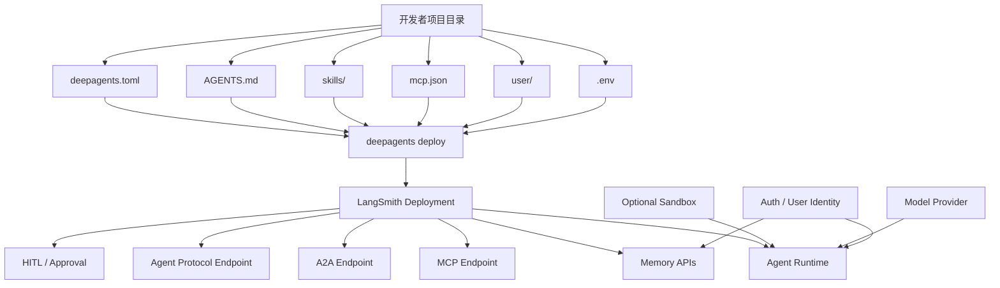

# Deep Agents Deploy 中文速记

基于 LangChain / LangGraph 官方文档、官方博客与开源仓库整理。

- 更新时间: 2026-04-16
- 适用范围: 想快速理解 `deepagents deploy` 是什么、部署了什么、怎么配、有哪些边界
- 一句话总结: `deepagents deploy` 会把一个基于 Deep Agents 的开放式 agent harness 打包成一个可生产部署的 LangSmith Deployment 服务

## 1. 先记住这 7 句话

1. `deepagents deploy` 不是只发一个聊天页面，而是部署一个完整 agent 服务。
2. 它部署的是 Deep Agents harness + memory + endpoints + 可选 sandbox。
3. 它是开放方案，不绑单一模型厂商，也不绑单一沙箱厂商。
4. Agent 的核心指令来自 `AGENTS.md`，不是散落在代码里的 prompt。
5. `skills/` 是技能目录，负责补充专门知识和动作。
6. 线上部署的 `mcp.json` 只支持 `http` / `sse`，不支持 `stdio`。
7. 如果 agent 需要跑命令、装包、改工作区，应该启用 `sandbox`。

## 2. 它到底部署了什么

`deepagents deploy` 会把本地 agent 配置打包并部署成一个 LangSmith Deployment。官方把它描述为一个可横向扩展的 server，并且默认暴露多种面向 agent 的接口。

部署结果通常包含这些能力：

- Agent orchestration: Deep Agents 的编排逻辑
- Memory: 短期 / 长期记忆访问
- Protocol endpoints: `MCP`、`A2A`、`Agent Protocol`
- HITL: human-in-the-loop 审批 / 中断
- Optional sandbox: 代码执行隔离环境
- Persistence / durability: 基于 LangGraph 的持久化与 checkpoint

## 3. 最小心智模型



## 4. 项目目录约定

官方部署依赖约定式目录结构，最常见的是：

```text
my-agent/
├── deepagents.toml
├── AGENTS.md
├── .env
├── mcp.json
├── skills/
│   ├── code-review/
│   │   └── SKILL.md
│   └── data-analysis/
│       └── SKILL.md
└── user/
    └── AGENTS.md
```

各部分职责：

- `deepagents.toml`: agent 身份与 sandbox 配置
- `AGENTS.md`: agent 启动时固定加载的核心指令
- `skills/`: 技能定义目录，每个技能子目录至少有一个 `SKILL.md`
- `mcp.json`: MCP 工具配置
- `user/AGENTS.md`: 每个用户独立可写的记忆模板
- `.env`: 模型、LangSmith、sandbox 等密钥

## 5. 关键文件怎么理解

### `AGENTS.md`

这是 Deep Agents Deploy 的核心配置入口之一，建议把它理解成：

- agent 的系统级行为约束
- 项目约定
- 输出风格
- 工具使用边界
- 执行优先级

它在运行时默认是只读的。要改共享指令，改源文件后重新部署。

### `skills/`

适合放两类东西：

- 专项知识
- 专项动作

比如：

- `review`
- `deploy`
- `release-check`
- `repo-conventions`

线上运行时，skills 会被同步进 sandbox，供 agent 在执行时读取或调用。

### `user/AGENTS.md`

这是很多人第一次看文档时会忽略的点。它不是全局 prompt，而是每个用户自己的长期可写记忆。

适合存：

- 用户偏好
- 常用输出格式
- 用户长期背景
- 该用户专属约束

不适合存：

- 全局组织策略
- 所有用户共享的敏感规则

## 6. 最小配置示例

只部署一个最小 agent 时，`deepagents.toml` 可以非常简单：

```toml
[agent]
name = "research-assistant"
model = "openai:gpt-4.1"
```

如果是要运行代码的 coding agent，建议显式启用 sandbox：

```toml
[agent]
name = "coding-agent"
model = "openai:gpt-4.1"

[sandbox]
provider = "langsmith"
template = "coding-agent"
image = "python:3.12"
scope = "assistant"
```

## 7. CLI 常用命令

```bash
deepagents init my-agent
deepagents dev --port 2024
deepagents deploy
deepagents deploy --dry-run
deepagents deploy --config path/to/deepagents.toml
```

实用记忆：

- `init`: 初始化骨架
- `dev`: 本地调试
- `deploy`: 真正打包部署
- `deploy` 每次都会 full rebuild，并创建新 revision

所以开发节奏通常是：

```text
init -> 改 AGENTS.md / skills / mcp / sandbox -> dev -> deploy
```

## 8. Sandbox 该怎么选

官方文档里列出的 provider：

- `none`
- `daytona`
- `modal`
- `runloop`
- `langsmith`

决策可以这样记：

- 只读写文件，不跑命令: 不一定需要 sandbox
- 需要 shell / 安装依赖 / 执行脚本: 需要 sandbox
- 多会话共享代码工作区: 用 `scope = "assistant"`
- 每个会话都要干净环境: 用 `scope = "thread"`

## 9. Memory 该怎么想

Deep Agents 的生产心智模型不是“上下文窗口加大”，而是“把记忆当成一个可管理的文件系统 + 存储路由”。

官方生产指南里最值得记的三层作用域：

- `thread`: 单次会话级，默认临时工作区
- `user`: 用户级，适合用户偏好与私有记忆
- `assistant`: assistant 级，适合共享工作区或共享规则

推荐默认策略：

- 临时中间产物: `thread`
- 用户偏好: `user`
- 某个 agent 的共享只读规范: `assistant`

需要特别注意：

- 跨用户共享可写 memory 容易引入 prompt injection
- 组织级策略最好只读，不要允许 agent 自己改

## 10. Protocol 与接口层

部署后的服务不是只有一个聊天入口，而是多个协议入口：

- `MCP`: 把 agent 当工具给别的 agent 调
- `A2A`: 多 agent 协作
- `Agent Protocol`: 给前端 / UI 接入标准 API
- `Human-in-the-loop`: 敏感操作审批
- `Memory APIs`: 访问短期 / 长期记忆

这意味着 Deep Agents Deploy 更像“agent runtime server”，不是普通网页后端。

## 11. 生产环境边界与坑

### 必记限制

- `mcp.json` 在部署态只支持 `http` / `sse`
- `stdio` 型 MCP server 会在 bundle 阶段被拒绝
- 不能依赖本机进程模型去启动工具
- 官方文档明确写了 deployed agents 不要直接使用宿主机型 backend
- `AGENTS.md` 和 `skills/` 在运行时是只读的
- 当前是 Beta，配置格式和行为还可能变化

### 高频踩坑

1. 把本地 `stdio` MCP 直接搬到线上
2. 把需要 shell 的 agent 当成纯文件型 agent
3. 想让共享 workspace 跨线程保留，却还在用 `scope = "thread"`
4. 把用户可写记忆和组织级只读策略混在一起
5. 把 `deploy` 当本地热更新用

## 12. 跟 Claude Managed Agents 的对比速记

官方文档强调的差异点：

- 模型支持更开放: 不限 Anthropic
- harness 开源: MIT
- 支持 `AGENTS.md`
- sandbox 可替换
- 协议更开放: `MCP` / `A2A` / `Agent Protocol`
- 支持 self-host

一句话理解：

```text
Claude Managed Agents 更像封闭托管产品，
Deep Agents Deploy 更像开放、可组合、可替换组件的 agent 部署框架。
```

## 13. 典型落地场景

### 场景 A: 内容生产 agent

特点：

- 不一定需要 shell
- 需要长期记住用户偏好
- 需要前端可接入接口

建议：

- 启用 `user/AGENTS.md`
- sandbox 可先关闭
- 用 `Agent Protocol` 接前端

### 场景 B: Coding agent

特点：

- 要读仓库
- 要跑命令
- 要安装依赖
- 可能需要跨会话保留工作区

建议：

- 启用 sandbox
- repo 型工作区通常选 `scope = "assistant"`
- 把仓库约定放入 `AGENTS.md`
- 把专项操作流程放入 `skills/`

### 场景 C: 多 agent 协同系统

特点：

- agent 之间互调
- 外部系统需要标准协议接入

建议：

- 明确区分主 agent 与工具型 agent
- 通过 `MCP` / `A2A` 暴露能力
- 敏感动作接 `HITL`

## 14. 对这个仓库的迁移提示

结合当前仓库结构，若要把现有 agent 能力迁到 Deep Agents Deploy，最可能碰到的改造点有这些：

- 仓库已有 `AGENTS.md`，说明核心指令迁移成本不高
- 若现有工具依赖本地进程拉起，需要改造成 `http` / `sse` MCP
- 若需要实际执行命令、读写仓库、安装依赖，需要引入 sandbox
- 若需要保存用户偏好、用户长期上下文，可单独接入 `user/AGENTS.md`
- 若未来要给别的 agent 或前端系统调用，优先围绕 `MCP` / `A2A` / `Agent Protocol` 设计接口

## 15. 30 秒记忆版

```text
Deep Agents Deploy = AGENTS.md + skills + mcp + memory + optional sandbox
                     -> 打包成一个可生产部署的 agent server
                     -> 自带开放协议端点
                     -> 不绑单一模型和单一厂商
```

## 16. 推荐阅读顺序

1. 先看 Deploy with the CLI
2. 再看 Going to production
3. 最后看 sandbox / memory / skills 细节

## 17. 官方来源

- Deploy with the CLI
  - https://docs.langchain.com/oss/python/deepagents/deploy
- Going to production
  - https://docs.langchain.com/oss/javascript/deepagents/going-to-production
- 官方博客: Deep Agents Deploy
  - https://blog.langchain.com/deep-agents-deploy-an-open-alternative-to-claude-managed-agents/
- 开源仓库
  - https://github.com/langchain-ai/deepagents
