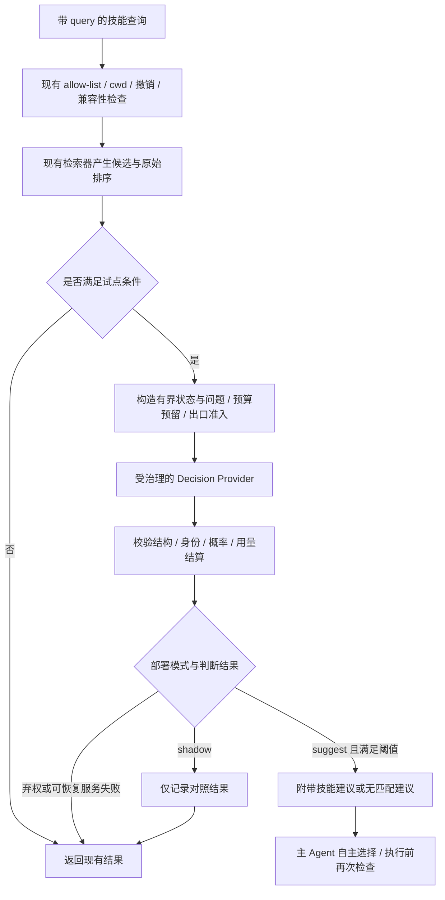

# Jev 决策层借鉴与接入可行方案

评估日期：2026-09-22
代码基线：`54773e1209fa54e802b7c48e6e6f2920b276ce7a`
状态：CLI P0 工程试点已实现；默认仍关闭，尚未运行真实 Jev 模型评测或生产放量。
范围：ChainlessChain CLI 优先，后续评估桌面端复用。

## 1. 建议与可行性结论

建议先验证 **Skill 候选选择**，再考虑上下文筛选、浏览器动作选择。项目已具备技能检索、版本摘要、撤销检查、模型调用治理、预算和结果记录等基础，适合增加一个可替换的类型化决策适配层。

Jev 最值得借鉴的机制是：给定有限状态和明确候选，返回结构化判断及概率；应用程序决定是否采纳、如何验证和执行。复杂规划、代码生成、精确计算和权限裁决继续使用各自现有机制。

| 维度                    | 判断                                   | 条件                                                 |
| ----------------------- | -------------------------------------- | ---------------------------------------------------- |
| 技术接入                | 可行，但需要新增受治理的类型化请求适配 | 不能把现有聊天接口视为天然支持 `/v1/systemone`       |
| Skill 路由价值          | 有明确试验空间                         | 同时验证候选召回、错误建议、无匹配任务和真实选用效果 |
| 降低成本与延迟          | 尚未证实                               | 当前规则检索本身很便宜；增加调用可能提高总成本与延迟 |
| 云端 Jev                | 适合可控试点                           | 使用配置允许的数据出口、固定模型版本和调用预算       |
| 本地 Kev                | 适合后续对照实验                       | 独立评估准确率、中文表现、并发、资源与许可           |
| 全面替换现有 Agent 决策 | 不在本方案范围                         | 小型决策模型无法承担全部推理、生成和业务验收         |

第一阶段的交付目标是：形成可信的比较报告，并在达到门槛后提供可关闭的技能建议。未证明收益时，保留关闭状态也属于有效的实验结论。

### 1.1 当前实现状态（2026-09-22）

已先按 CLI 优先完成工程接线：

- 新增类型化请求/响应契约、候选摘要绑定、TypeSafe `/v1/systemone` provider、`off / shadow / suggest` runtime 和异步 benchmark。
- `cc agent` 的单次 headless 运行支持 `--decision-mode`、`--decision-model`、`--decision-base-url`、`--decision-timeout-ms`。
- 非 `off` 模式必须使用持久会话，且不能与 `--ephemeral` 组合；API key 仅从 `TYPESAFE_API_KEY` 或受管 credential transport 读取，不提供 Jev key 的 argv 参数。
- 决策调用复用会话预算和模型用量账本，使用 `operationId=decision:<id>`；决策观察写为 `skill_decision_observation`。账本写入失败、会话预算终止和用户取消保持终止性。
- `list_skills(query)` 仍先运行原检索与准入，仅将前 5 个已准入候选交给决策层。`shadow` 不改变 Agent 可见结果；`suggest` 只新增 `routing.decisionSuggestion`，不替换 `routing.selectedDigest`，更不执行 Skill。
- 已增加契约、provider、runtime、benchmark、Agent 工具入口和 headless CLI 接线测试；现有 headless 与 Skill 路由回归测试保持通过。

当前可用的隔离试点命令如下；应先使用 `shadow` 收集评测证据：

```powershell
$env:TYPESAFE_API_KEY = "<secret>"
cc agent --session jev-pilot-1 --decision-mode shadow -p "检查并修复单元测试"
```

切换为 Agent 可见的附加建议时，将模式改为 `suggest`。删除 `--decision-mode` 或使用 `--decision-mode off` 即恢复原路径。当前不支持 interactive REPL 和 `--input-format stream-json`；尚未完成真实 API 兼容性探针、冻结模型版本、数据出口证据扩展、质量/延迟/费用报告及放量门槛验证，因此不能据此宣称 Jev 已带来质量或成本收益。

## 2. 外部依据及适用边界

### 2.1 Jev 的基本接口

根据 TypeSafe 官方文档，Jev 接收文本或 JSON 状态和类型化问题：

- `Choice`：在给定候选中选择，返回各候选概率和 `confidence`。
- `Score`：对有序等级评分，返回等级分布、期望分数和 `confidence`。
- `Noul`：返回某个是非命题为真的概率，不另带 `confidence`。

`confidence` 是由概率分布计算的统计量，不等于某次判断的正确率。模型在其他数据集上的校准结果，不能直接替代本项目中文、技能目录和用户任务上的校准。不同问题、不同模型及不同 primitive 的阈值不能直接复用。

### 2.2 值得借鉴的实现

| 来源                             | 已核查的机制                                                           | 在本项目中的用法             | 边界                                                         |
| -------------------------------- | ---------------------------------------------------------------------- | ---------------------------- | ------------------------------------------------------------ |
| TypeSafe 官方 Skill suggestion   | 先排序，再细读少量候选；另问是否需要技能，允许拒绝全部候选             | 候选召回后增加语义选择与弃权 | 官方效果来自其特定模型、目录和样本，不是本项目实测           |
| `tamaratran/fast-jev-compaction` | 分别判断工具调用与结果是否保留；保留、截断或成对删除；异常回退         | 工具历史的价值筛选           | 模型看不到完整工具结果，保留原文不代表整体语义无损           |
| `browser-use/jev-ultrafast`      | DOM 生成动作及目标候选；并行询问，执行选中动作对应目标；执行前验证节点 | 浏览器观察与动作选择         | 演示速度包括其他工程优化；模型选择 `DONE` 不等于通过业务验收 |
| `jaredpalmer/kev`                | 提供 Jev-like 模型、训练与校准流程、兼容接口                           | 本地部署及领域微调对照组     | 不是官方 Jev 权重；接口兼容不代表能力或概率语义等价          |

前两个应用仓库和官方 JavaScript SDK 为 MIT；Kev 仓库为 Apache-2.0。真正复用时固定提交并保留相应声明，另核对模型权重、基础模型和训练数据的许可。开源 SDK 或应用代码不能证明 Jev 模型权重开放。

## 3. 项目现状与准确接入位置

以下是代码现状，不代表这些模块已完成全部生产部署验收。

| 现有位置                                                                              | 当前行为                                                                                         | 本方案动作                                                           |
| ------------------------------------------------------------------------------------- | ------------------------------------------------------------------------------------------------ | -------------------------------------------------------------------- |
| [Skill 检索器](../../../packages/cli/src/lib/skill-retrieval-router.js)               | BM25、可选向量、历史结果加权；检查摘要、范围、兼容性和撤销；报告歧义                             | 保留同步纯函数，在上层增加异步决策适配                               |
| [Agent 运行时](../../../packages/cli/src/runtime/agent-core.js) 的 `list_skills`      | 先应用目录/allow-list 过滤；有 `query` 时调用检索；返回候选及 `selectedDigest`，描述最多 80 字符 | 首个运行时试点入口；新增独立建议字段，不自动执行技能                 |
| [Skill 命令](../../../packages/cli/src/commands/skill.js)                             | 也消费相同检索器                                                                                 | 默认维持本地检索；将来通过显式选项试验，避免普通列表命令隐式付费联网 |
| [现有检索基准](../../../packages/cli/src/lib/skill-retrieval-router-benchmark.js)     | 同步、要求唯一 `expectedDigest`；用 `ambiguityMargin: 0` 测规则检索                              | 保留原基准，另建支持异步模型、无匹配和多正确答案的评测               |
| [微压缩](../../../packages/cli/src/lib/micro-compact.js)                              | 按位置和长度裁剪旧工具输出                                                                       | 后续比较语义筛选的增量价值                                           |
| [Context/Memory Kernel](../../../packages/context-memory-kernel/lib/compaction.js)    | 保护关键上下文、工具配对和派生内容来源；验证用量回执                                             | 决策结果只能成为规划输入，提交仍经过 Kernel                          |
| [模型 ingress](../../../packages/cli/src/lib/evolution/agent-evolution-ingress.js)    | 请求/响应证据、来源与账本控制                                                                    | 扩展类型化请求的受治理适配，不在路由器直接调用外部 SDK               |
| [浏览器 Agent](../../../desktop-app-vue/src/main/browser/browser-automation-agent.js) | 页面快照、自然语言命令解析和步骤执行，受工作流边界约束                                           | 第二轮试点再设计候选动作接口                                         |

注意：当前 `list_skills` 的 `selectedDigest` 是检索建议，不是技能已执行的证明。无 `query` 的列表请求不经过这条检索分支。P0 收益范围必须按实际触发入口统计，不能宣称覆盖每个 Agent turn。

当前运行时传给检索器的 `target` 仅含操作系统，其他过滤部分由前置 allow-list/cwd 检查承担；不能把检索器支持的全部可选 capability/path 检查描述为此入口已启用。当前返回候选上限为 64，决策层的 5–8 个候选是额外的有界子集，原始列表保持可用。

### 3.1 反馈质量的先行整改

发现以下旧路径问题，应列为独立、带回归测试的实现任务：

1. [Decision KB](../../../desktop-app-vue/src/main/ai-engine/cowork/decision-knowledge-base.js) 的 `recordVotingResult()` 将 `consensusScore` 写入 `successRate`。
2. [桌面评审](../../../desktop-app-vue/src/main/ai-engine/cowork/debate-review.js) 将 `APPROVE` 映射为成功率 `1.0`，尚无真实任务验收的含义。
3. [旧 LLM 决策引擎](../../../desktop-app-vue/src/main/ai-engine/llm-decision-engine.js) 直接消费模型 JSON 中的策略和分数，`success_rate || 1.0` 还会把明确的零变成一。

不能据此推断 CLI 的受治理 outcome 数据全部有同样问题。P0 应核查自己的实际数据来源，并禁止把上述旧分数作为成功标签。历史记录保留原值与来源，标记为 `legacy-opinion`；没有可验证结果时使用 `unknown`，不回填推测成功。

## 4. P0：Skill 决策层设计

### 4.1 数据流



治理准入、账本持久化、预算终止和用户取消等终止性错误不进入图中的普通服务失败回退，应按现有模型失败策略向上抛出。

### 4.2 模式与触发范围

| 模式      | 行为                                                             |
| --------- | ---------------------------------------------------------------- |
| `off`     | 默认值；不调用决策模型，不改变现有结果                           |
| `shadow`  | 在已允许的试点会话记录模型建议；不改变排序和 Agent 可见建议      |
| `suggest` | 保留原候选及原始选中项，附带新建议；不直接加载、执行或发布 Skill |

P0 不提供自动执行模式。用户明确指定技能、无 `query`、无候选、同名多版本冲突、预算不足或出口不允许时，跳过增强。对于语义分数接近的候选可以提供建议，但保留原歧义标记；同名不同摘要等身份冲突必须由现有机制解决。

`shadow` 也会产生网络请求、费用和数据处理，必须使用与正式调用相同的治理与预算。P0 使用有截止时间、被宿主管理并完成用量结算的调用；不启动脱离会话生命周期的后台请求。

### 4.3 状态与问题

使用现有检索的前 5 个候选起步；仅在开发集证明召回不足时将上限调整到 8，并重新冻结评测配置。召回之外的正确技能无法被决策模型找回，应单独记录 `retrieval-miss`。

状态只含当前查询、最小必要任务约束、候选用途与明确边界。描述从已解析的技能描述对象中读取，不使用列表输出中截断后的 80 字符作为完整语义输入。P0 不读取和外发完整技能正文、会话档案或仓库文件。若确需正文，作为单独的数据范围扩展评估。

每个请求用临时候选 ID，例如 `c1`、`c2`；宿主保存其到 `namespace + skillId + contentDigest` 的完整映射。Skill 名称、路径和模型输出都不能代替内容摘要进行身份校验。

同一有界请求批量询问：

| 问题                             | 类型              | 用途                       |
| -------------------------------- | ----------------- | -------------------------- |
| 当前任务是否需要候选中的某项技能 | Noul              | 检测无匹配任务             |
| 哪个候选最合适，或全部不适合     | Choice，含 `none` | 相对排序与明确的无匹配结果 |
| 各候选是否满足任务的必要条件     | 每候选一个 Noul   | 防止“相对最好但仍不适合”   |

问题数量最多为候选数加 2。独立问题可能不一致；例如选中 `c1` 但其适合概率很低，应弃权而不是强行修正分数。`none` 是明确的无匹配建议，`abstain` 是不确定，`unavailable` 是调用未产生有效判断，三者分别统计。

P0 采用一次请求；官方 cookbook 的二次细读作为后续对照项，只有额外质量收益覆盖延迟、费用和数据范围后才考虑开启。

### 4.4 建议新增的契约

以下为拟议接口，不是已存在的导出或已支持的配置。

```ts
type DecisionRequest = {
  requestId: string;
  purpose: "skill-routing";
  state: JsonValue;
  questions: TypedQuestionMap;
  binding: {
    tenantId: string;
    sessionId: string;
    candidateSetDigest: string;
    policyDigest: string;
    contextRevision: string;
  };
  deadlineMs: number;
  signal: AbortSignal;
};

type DecisionOutcome = {
  status: "suggestion" | "no-match" | "abstain" | "unavailable";
  selectedCandidateId: string | null;
  answers: ValidatedTypedAnswers | null;
  reasonCode: string;
  receiptRef: string;
};
```

宿主通过依赖注入提供 provider、准入 authority、预算和账本端口。上述 `binding` 是证据绑定字段，不是授权凭证；不能凭调用方传入的字符串或布尔值授予权限。

返回前至少校验：

- 问题 ID、答案类型与请求一一对应；拒绝缺字段、额外问题和未知候选。
- 概率为有限数且处于 `[0, 1]`，分布总和在预注册浮点容差内；Score 范围与等级对应。
- provider 特有的输出转换保持含义；不把 Noul 概率伪造为统一 `confidence`。
- 请求绑定的候选摘要、策略版本和上下文版本仍有效；建议消费前重新检查撤销与技能身份。
- receipt 包含实际 provider、模型版本、问题模板版本、延迟、用量及结算状态。

P0 不需要决策模型生成解释文本。面向用户的理由来自规则化 `reasonCode` 和可追溯候选信息，不能伪造模型没有返回的证据或解释。

### 4.5 预算、缓存与回退

初始工程预算为每次技能查询最多 1 个请求、5 个候选、800 ms 总截止时间；评测目标为增量 p95 不超过 500 ms。它们是待验证的项目预算，不是 Jev 的性能承诺。状态和问题另设字节/token 上限，按固定模型实际限制确定，并统计截断和超限弃权。

P0 禁用应用级决策缓存，先获取可解释的基线。后续缓存键必须包括 tenant、允许外发的数据投影摘要、候选集与顺序、模型版本、问题模板、策略/撤销版本及阈值版本；命中后仍重验准入和身份。缓存不能跨租户、跨撤销或绕过记录流程。

普通超时、限流、网络故障或无效响应可以结算并记录后返回原有检索结果；P0 不自动重试、不隐式切换到更贵的强模型。用户取消、`CC_AGENT_EVOLUTION_INGRESS_FAILED`、账本持久化失败和 session budget 终止遵循 [model-failure-policy.js](../../../packages/cli/src/lib/model-failure-policy.js)，不能包装成普通 `unavailable`。

断路器仅针对可恢复 provider 故障；开启后跳过增强并记录降级。关闭开关必须取消仍在运行的试点调用、完成已发生用量的结算，并使未消费建议失效。

## 5. 模块拆分与实现任务

先在 CLI 内实现，待第二个消费端出现后再抽公共包。

| 拟新增或调整位置                                              | 职责                                         | 依赖                              |
| ------------------------------------------------------------- | -------------------------------------------- | --------------------------------- |
| `packages/cli/src/lib/decision-layer/contracts.js`            | 请求/响应 schema、有界问题、候选绑定与阈值   | 固定契约与已解析 Skill 描述       |
| `packages/cli/src/lib/decision-layer/runtime.js`              | 模式、生命周期、预算、取消、回执与降级       | 现有会话治理端口                  |
| `packages/cli/src/lib/decision-layer/typesafe-provider.js`    | 类型化 API 序列化与 provider authority       | HTTPS/loopback 传输与固定请求投影 |
| `packages/cli/src/lib/decision-layer/provider-authority.js`   | 品牌化 provider、模型与调用能力              | 显式依赖注入                      |
| `packages/cli/src/runtime/agent-core.js`                      | 在带 query 的 `list_skills` 分支注入建议能力 | 上述 runtime，默认 off            |
| `packages/cli/src/runtime/headless-runner.js`                 | 创建持久会话绑定的决策 runtime 与账本端口    | session store、预算、credential   |
| `packages/cli/src/commands/agent.js`                          | CLI 显式开关、密钥预检与运行模式约束         | 单次 headless 模式                |
| `packages/cli/src/lib/decision-layer/benchmark.js`            | 异步对照评测、分层统计与报告                 | 冻结样本、实际用量回执            |
| `packages/cli/__tests__/unit/decision-layer-*.test.js`        | 契约、模式、错误与预算行为                   | mock provider                     |
| `packages/cli/__tests__/integration/decision-layer-*.test.js` | 实际工具入口、撤销、取消、结算及提示消费     | 受控本地服务和测试治理宿主        |

第一项工程探针是验证现有模型请求投影、传输和结算能否承载 `state + questions`。如果不支持，应显式新增请求种类或 adapter，并覆盖 ingress 的证据、出口及用量契约。不能通过将 JSON 塞入聊天文本、直接 `fetch` 外部地址或借用测试 authority 来宣称完成治理接入。

已核查的具体适配缺口：

- [agent-model-projection.js](../../../packages/cli/src/lib/evolution/agent-model-projection.js) 当前快照接受 `{messages, tools}`；原生 Jev 请求需新增可校验的投影类型，绑定最终外发的 `state + questions`，不能先审批摘要再发送未投影原文。
- [direct-model-usage.js](../../../packages/cli/src/lib/direct-model-usage.js) 可供复用调用生命周期，但没有 session 时存在直接执行路径；试点 runtime 必须拒绝缺少所需 session/budget authority 的模型调用。
- [runtime-usage-ledger.js](../../../packages/cli/src/lib/runtime-usage-ledger.js) 的来源枚举目前为 `model / semantic-compaction / subagent`。P0 优先使用 `source=model` 并以 `operationId=decision:<id>` 区分，若新增来源则显式升级契约，不能假设 `source=decision` 已受支持。
- provider 用量必须能映射到真实的输入/输出 token 和费用字段；缺失或无法证实的用量按现有 unknown settlement 策略处理，不能用虚构的零填平。是否允许继续原路由由结算与预算策略决定。

建议在工具结果新增版本化 `decisionSuggestion`，包括状态、选中摘要、原因代码和回执引用，保留原 `routing.selectedDigest` 的含义。Agent 是否阅读并遵循这个字段需单独验证；只修改输出字段不算完成产品接入。

## 6. 真实反馈与数据闭环

每个建议用 `decisionId` 关联到后续真实技能调用及验收。至少分开记录：

| 数据                            | 含义                                   |
| ------------------------------- | -------------------------------------- |
| `predictedProbabilities`        | 模型对固定问题的预测                   |
| `consensusScore`                | 多个评审是否一致；如果没有多评审则为空 |
| `suggestionAdopted`             | 主 Agent 是否实际采用建议              |
| `invocationOutcome`             | 工具调用成功、失败、取消或未知         |
| `verificationOutcome`           | 独立业务条件通过、失败或无法验证       |
| `userCorrection`                | 用户是否纠正技能选择及纠正类别         |
| `cost / latency / modelVersion` | 完整链路开销和版本                     |

调用返回成功不必然等于任务目标达成。没有独立验证时保留未知，不进入成功率分母。区分 provider 故障、权限拒绝、召回遗漏、选择错误和技能执行错误，避免把所有失败归因于 Skill。

反馈用于离线分析和受控调整问题模板/阈值。P0 不进行在线自动训练、不自动改写 active Skill，不改变现有自进化发布门槛或 automatic promotion 的 HOLD 状态。

## 7. 评测与准入门槛

### 7.1 数据集与对照组

建议准备 800 条经授权、脱敏、人工核对的任务：400 条开发/阈值校准集，400 条冻结测试集。按会话、来源或任务模板分组切分，避免同一任务改写同时进入开发和测试。冻结测试集至少包含 160 条“无需/无匹配 Skill”任务；数量不足时只作探索报告。

其余样本覆盖单正确技能、多可接受技能、相近技能边界、中文/英文、信息缺失、选项顺序扰动和召回遗漏。撤销、身份冲突、权限拒绝、恶意描述与陈旧上下文另有确定性的对抗用例，不靠平均准确率抵消失败。

标签允许 `acceptableDigests: []` 和多个可接受摘要，另有 `insufficient-evidence`；由两名标注者处理争议，无法裁定的样本单列。模型自身打分不得充当唯一真值。

比较至少三组：现有检索与实际 Agent 行为；相同候选上的规则弃权策略；相同候选上的 Jev 建议。固定候选、上下文、主模型、工具版本和预算，评估增量作用。Kev 可在 P0 稳定后加入第四组。

### 7.2 指标定义

- 候选召回率：有可接受技能的任务中，候选包含至少一个可接受摘要的比例。
- 接受建议错误率：已给出肯定技能建议的任务中，建议不在可接受集合的比例。
- 无匹配误建议率：真值为无需/无匹配技能的任务中，仍给出技能建议的比例。
- 肯定建议覆盖率：有可接受候选的任务中，给出肯定建议的比例；防止全部弃权“刷高准确率”。
- 实际误调用率：端到端任务中确实加载或执行错误技能的比例，与建议错误分开报告。
- 校准：按固定问题类型报告 Brier score、ECE、可靠性分桶及样本数；不混合不同 primitive。
- 开销：真实调用次数、token、失败调用费用、增量 p50/p95、每个独立验收成功任务的总费用。

原检索基准的 `falseInvocationRate` 实际测的是选中摘要是否匹配唯一真值，并未执行技能，也没有无匹配样本。新报告使用明确名称，不能复用旧字段作为端到端成效。

### 7.3 建议门槛

以下为拟议验收标准，应在开发集阶段确认并冻结，不能看过测试结果后放宽。

| 门槛         | 从 shadow/隔离验证进入线上 suggest 的要求                                                            |
| ------------ | ---------------------------------------------------------------------------------------------------- |
| 治理不变量   | 未授权候选、撤销失效、跨租户混用、未结算成功响应等对抗测试全部通过；任何违规阻断试点                 |
| 候选召回     | Recall@K ≥ 95%；不足时先改召回，不以更换决策模型补偿                                                 |
| 无匹配误建议 | 单侧 95% 二项置信上界 ≤ 2%；160 个负例零误报约可满足，不能用零样本或很小样本宣布通过                 |
| 接受建议错误 | 单侧 95% 置信上界 ≤ 5%，且肯定建议覆盖率 ≥ 50%；样本不足继续收集                                     |
| 端到端效果   | 相比现有路径的实际误调用点估计相对下降 ≥ 20%，配对置信区间支持改善；若基线错误过少则扩样，不宣称改善 |
| 任务成功率   | 独立验收成功率差值的 95% 置信下界不低于 -1 个百分点；统计不足时不扩大使用                            |
| 延迟         | 增量 p95 ≤ 500 ms，单次总截止 ≤ 800 ms；统计冷启动、热路径及失败请求                                 |
| 费用         | 每成功任务总费用不高于基线 5%，且在预设会话/每日硬预算内；不预先宣称节省费用                         |

置信区间使用冻结的方法：比例上界采用单侧精确二项区间；成对比较按独立任务或会话分组 bootstrap。对关键中文/无匹配切片分别报告；总体平均不能掩盖关键切片退化。800 条是启动样本量，不保证能证明小幅非劣或低错误率，必要时按预先的扩样计划补足，避免反复窥视测试集调参。

shadow 只能验证建议准确性、弃权、稳定性及额外开销，不能证明建议被采用后的任务效果。进入线上 suggest 前，用隔离端到端试验让主 Agent 实际消费建议，测量误调用、独立验收和总费用；之后线上小流量再次核验。检索函数、完整路由链和整项任务的延迟分别命名，禁止直接比较不同计时边界的 p95。

离线选择评测不执行付费或有副作用的技能。端到端验证使用隔离工作区和受控工具，优先确定性可验收任务；联网模型评测独立于普通 CI，固定预算和模型版本。持久保存经过脱敏的逐题结果、配置摘要和用量回执，不只保存汇总百分比。

## 8. 后续阶段

### P1：上下文价值筛选

仅在 P0 验证类型化适配与费用结算后开始。针对已经由 Kernel 判定可压缩的工具历史，提出保留、截断、归档引用建议；审批、用户约束、待完成调用和恢复信息仍由确定性规则保护。

必须验证：工具调用/结果保持配对；原始档案按既有保留策略可追溯；不能靠重放写操作恢复证据；压缩后关键条件和任务验收不退化。决策输入需包含受治理的实际输出片段，或在没有足够信息时保守保留，不能把只有字符数的判断称为语义筛选。

当前 Kernel 会检测同一 item ID 的内容摘要被改写。截断或派生内容需使用符合 Kernel 契约的新身份和来源信息；若现有 summary 类型不支持目标变换，先扩展版本化契约与不变量测试，不能直接原地改写消息。根据真实 tokenizer 计量收益，并计入判断费用、后续重新读取和重复工作成本。

### P2：浏览器候选动作

从当前 DOM 快照生成有限动作及目标，以页面状态摘要和候选 ID 绑定。可一次预测动作与多个相容目标，仅消费最终动作所需字段；自由文本输入使用现有生成能力。

执行前检查快照新鲜度、节点存在/可见/可用、权限及一次性执行标识。超时或执行结果未知时先观察真实状态，不能盲目重放点击。`DONE` 只能触发独立的任务验收；业务条件未满足时不得记录成功。先选择搜索、筛选等有明确验收的流程试验，沿用现有浏览器 authority。

### P3：本地 Kev 与领域微调

使用与 Jev 相同的冻结测试集，比较本地硬件上的中文效果、选择错误、校准、p95、峰值内存和并发吞吐。API 兼容性、模型概率语义及许可证分别验证。先采用已有权重，只有足够真实标签且基线不足时才评估微调；训练、校准和最终测试数据严格分离。

## 9. 实施顺序、投入与停止条件

以下为单名熟悉 CLI 的工程师的工作量估计，另需标注/评审协助；不是交付承诺。

| 阶段 | 工作包                                     | 预计投入 | 完成条件                                     |
| ---- | ------------------------------------------ | -------- | -------------------------------------------- |
| D0   | 确认入口、冻结基线、梳理反馈来源和投影契约 | 1–2 人日 | 确认模型请求可以合规进入现有治理链；列清缺口 |
| D1   | 契约、provider、预算/取消/结算及 mock 测试 | 3–5 人日 | off 零调用；shadow 不改变行为；失败分类正确  |
| D2   | 样本、异步评测、校准与端到端提示消费验证   | 3–5 人日 | 逐题可复跑的比较报告；样本不足明确标记       |
| D3   | 可关闭的 suggest、受控试点和回退演练       | 2–3 人日 | 达到第 7 节门槛后才扩大试点                  |

P0 合计约 9–15 工程人日，不包含标注、预算审批、外部服务等待、统计扩样和生产治理宿主尚缺能力的建设。D0 若发现必须大幅扩展模型出口与账本，则重新估算，先完成离线可行性报告。P1/P2/P3 在 P0 报告后分别立项。

停止或回退条件：无匹配误建议超标；中文关键切片退化；质量收益不抵额外开销；服务稳定性不足；任何权限、身份、撤销或用量结算错误。处理方式为关闭增强、使未消费建议失效并继续使用既有路径；终止性治理错误按原规则停止，不能通过切回旧模型绕过。

本方案不要求发布 npm 包。未来如果进入发布阶段，仍须验证准确发布提交上的 GitHub Actions：CLI CI 与 CLI Strict Sandbox 的 Linux、Windows、macOS 全部通过；本地试验和模型质量报告不能替代该发布门槛。

## 10. 首批交付清单

- [ ] 冻结问题模板、候选身份规则和模型版本，确认类型化模型出口适配。
- [ ] 建立独立的预测、建议采纳、调用结果和业务验收字段；隔离旧意见分数。
- [x] 完成 CLI 单次 headless 的 off/shadow/suggest 生命周期、预算、取消、结算和错误分流。
- [ ] 形成包含无匹配、多正确答案、中文和对抗场景的冻结评测集。
- [ ] 输出规则基线与 Jev 建议的逐题质量、延迟和完整费用报告。
- [ ] 验证主 Agent 消费建议的实际效果，完成关闭开关及建议失效演练。
- [ ] 根据预注册门槛作出启用、继续采样或停止的决定。

## 11. 参考资料

资料访问/核查日期为 2026-09-22。官方文档和未固定提交的 README 后续可能变化；实施时应将使用版本与模板一起冻结。本次仅做文档和源码阅读，没有复现外部性能数字。

1. [TypeSafe System One](https://docs.typesafe.ai/concepts/system-one)：类型化判断、文本输入和能力范围。
2. [TypeSafe Confidence](https://docs.typesafe.ai/confidence)：概率与 confidence 的区别。
3. [Jev 1.13 已知限制](https://docs.typesafe.ai/model-jaggedness/jev-1.13)：数学、日期、多跳推理、长状态和对抗内容；限制对应具体版本。
4. [官方 Skill suggestion](https://docs.typesafe.ai/cookbooks/skill_suggestion)：候选筛选、独立适合性判断和允许全部拒绝。
5. [官方 JavaScript SDK](https://github.com/typesafe-ai/typesafe-sdk-js)：Node.js/TypeScript 接入参考。
6. [fast-jev-compaction 决策实现](https://github.com/tamaratran/fast-jev-compaction/blob/e3f262a7f4d42bd8dd32ced30d26176f7cb545b0/src/compact.ts#L101) 与 [输入状态](https://github.com/tamaratran/fast-jev-compaction/blob/e3f262a7f4d42bd8dd32ced30d26176f7cb545b0/src/state.ts#L105)。
7. [jev-ultrafast 候选决策](https://github.com/browser-use/jev-ultrafast/blob/1231850a0bf1a0c0341fe408ef1668dbbfdfac46/jev_ultrafast/model.py#L81)、[执行校验](https://github.com/browser-use/jev-ultrafast/blob/1231850a0bf1a0c0341fe408ef1668dbbfdfac46/jev_ultrafast/browser.py#L88) 与 [性能报告边界](https://github.com/browser-use/jev-ultrafast/blob/1231850a0bf1a0c0341fe408ef1668dbbfdfac46/docs/performance.md)。
8. [Kev](https://github.com/jaredpalmer/kev)：可本地运行的独立 Jev-like 实现、训练与评测方法。
9. [awesome-jev](https://github.com/yibie/awesome-jev)：生态发现索引；收录不等于成熟度或安全性背书。
10. [项目受治理 Skill 自进化设计](../../design/modules/112-governed-skill-evolution-design.md)：现有发布、证据和生产部署边界。
