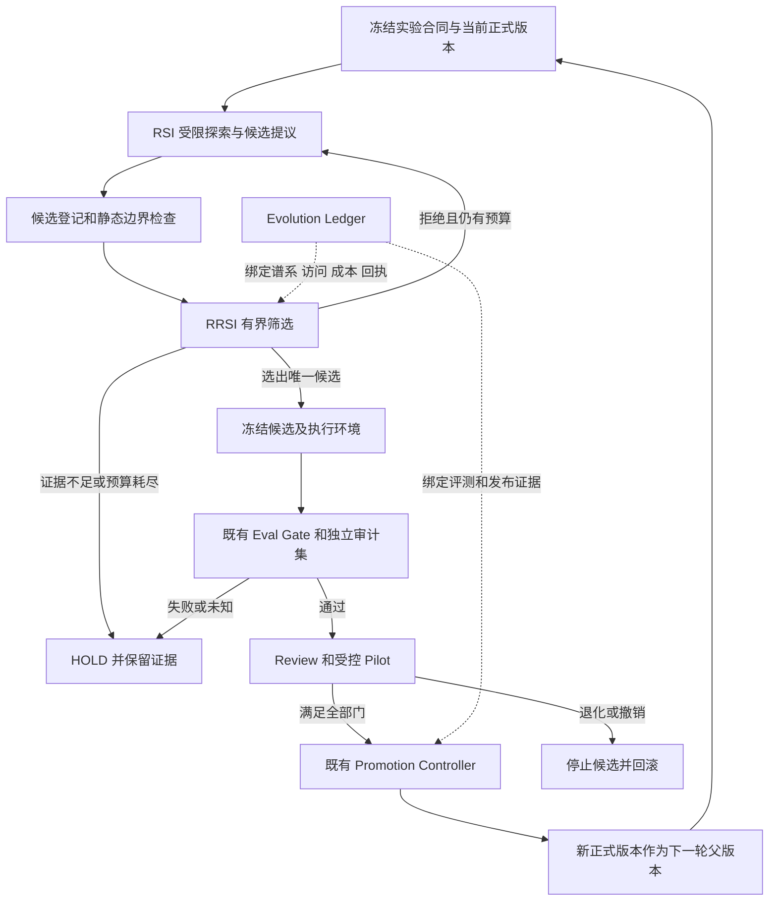

# ChainlessChain RRSI 实施方案

日期：2026-10-07。状态：RR-01 合同与离线回放、RR-02 耐久选择与终评控制已实施，真实基线及完整费用接线待就绪。方案代码核对基线：`e943e4e99ad32e6581a973771caf33f2c749230e`。当前代码、测试与批次状态见 [实施进度](./rrsi-implementation-progress-2026-10-07.md)。

在已有 RSI 探索、候选 Memory、Skill 和受治理晋级链路上，增加 RRSI（Regularized Recursive Self-Improvement，正则化递归自我改进）的**候选筛选与跨轮约束**。首个试点延续结构化 PM 任务，先验证新经验在未见任务上是否有效，再扩展到 CLI 编码任务。复用既有 Eval Gate、Evolution Ledger、Review、Pilot 和回滚机制；新增重点是选择偏差控制、完整成本、扰动稳健性及演化历史约束。

首期交付目标是跑通“生成候选 → 有界筛选 → 冻结版本 → 独立评测 → 受控试用 → 保留或回滚”，并产出可复核的三组等预算对照结果。工程链路可用、泛化收益成立、允许生产晋级分别验收。没有收益的候选被正确拒绝，也属于工程闭环成功。

## 1 依据与适用范围

用户提供的截图提出四个筛选维度：泛化能力、推理成本、噪声干扰和修改历史，并强调将“提议”与“筛选”分离。本方案据此设计项目内的工程实现。截图没有提供可核对的论文全文、公式或实验协议，因此下文的打分、阈值和实验规模均为**本项目设计建议**，不作为谷歌原论文复现或效果承诺。

主要承接材料：

- [RSI 差距与累计实施状态](../../reports/rsiagent/rsiagent-gap-analysis-2026-09-17.md)：已有 G01–G08、逐轮探索与真实 PM 对照要求。
- [RSI 第 218 批](../../reports/rsiagent/rsiagent-two-hundred-eighteenth-batch-implementation-2026-09-26.md)：PM 计划分母与封存准入逐槽绑定，仍保留回执全集和真实效果边界。
- [CLI 差距分析](../cli/cli-claude-code-codex-gap-analysis-2026-10-05.md)、[后续实施状态](../cli-ide-gap-implementation-2026-10-05.md)、[续做验证](../cli-ide-gap-validation-2026-10-05.md)：按 10 月 6 日更新理解依赖，原审计正文保留历史含义。
- [受治理技能自进化设计](../../design/modules/112-governed-skill-evolution-design.md)：沿用候选、评测、审核、试用、晋级和撤销边界。

本期改进对象是候选 Memory、Skill 的策略说明和受限工作流参数，不更新基础模型权重。模型目录、价格、权限策略、grader、评测集和发布门属于独立维护对象，不能被被测候选自行修改。

## 2 RSI 基础与 RRSI 增量

### 2.1 已有基础

| 已有能力                                                       | 代码或记录                                                                                                                                                                                                                       | 本期处理                                                 |
| -------------------------------------------------------------- | -------------------------------------------------------------------------------------------------------------------------------------------------------------------------------------------------------------------------------- | -------------------------------------------------------- |
| Broad/Deep 探索、逐轮候选记忆、冻结与恢复                      | [pm-exploration-rounds.js](../../../packages/cli/src/lib/evolution/pm-exploration-rounds.js)                                                                                                                                     | 保留探索机制，给候选追加父版本、变更范围和筛选预算       |
| PM 分组、等预算对照、严格完整成功率                            | [pm-exploration-benchmark.js](../../../packages/cli/src/lib/evolution/pm-exploration-benchmark.js)                                                                                                                               | 复用 `task-group-component` 分组统计，增加 RRSI 实验编排 |
| train/validation/test 分区、来源绑定、配对比较和成本门         | [evolution-eval-gate.js](../../../packages/cli/src/lib/evolution/evolution-eval-gate.js)                                                                                                                                         | 保留 Gate，扩展此前的筛选阶段和跨轮留出集使用约束        |
| 启动槽位、封存 cohort、最终回执对账                            | [evolution-eval-cohort-receipt-reconciliation.js](../../../packages/cli/src/lib/evolution/evolution-eval-cohort-receipt-reconciliation.js)                                                                                       | 扩展整个 campaign 的候选、启动、成本和缺失分母覆盖       |
| Wiki → Propose → Candidate → Eval → Review → Pilot → Promotion | [evolution-release-train-domain-stages.js](../../../packages/cli/src/lib/evolution/evolution-release-train-domain-stages.js)                                                                                                     | 将筛选回执绑定到既有 Eval/Review 输入，保留唯一晋级权威  |
| 有界改进循环与 progressive Canary                              | [bounded-skill-improvement-pilot.js](../../../packages/cli/src/lib/evolution/bounded-skill-improvement-pilot.js)、[statistical-progressive-canary.js](../../../packages/cli/src/lib/evolution/statistical-progressive-canary.js) | 复用预算、停止和流量阶段，补抗选择偏差和持久历史约束     |
| 版本晋级、回滚及环境变化后重新验证                             | [skill-promotion-controller.js](../../../packages/cli/src/lib/evolution/skill-promotion-controller.js)、[skill-runtime-revalidation.js](../../../packages/cli/src/lib/evolution/skill-runtime-revalidation.js)                   | RRSI 只提供必要证据，不获得直接写入正式版本的权限        |

现有 Eval Policy 已要求至少 30 个训练任务、20 个验证任务、20 个测试任务以及 3–32 个不同 seed。质量路径要求配对成功率增益下界至少 5 个百分点，效率路径要求成功率和质量下界不下降，并至少一项 token、延迟或工具调用改善达到 10%。这些是现有合同下限，不能为 RRSI 小样本试验直接调低。

PM 效果报告已经使用任务族连通分量重采样；本期继续使用该统计单位。它和 Eval Gate 的逐任务配对统计含义不同，应同时满足适用的门，不把同一任务的多 seed 扩大成独立任务数量。

RSI 累计记录仍将 G01–G08 标为部分完成，真实 PM 等预算效果与生产晋级未闭环。第 218 批的逐槽绑定不能证明启动全集或完整费用。RRSI 从这个边界继续实施，不以模块数量或历史单测数量认定效果已经成立。

### 2.2 本期新增能力

| RRSI 增量            | 解决的问题                                     | 必要交付                                                 |
| -------------------- | ---------------------------------------------- | -------------------------------------------------------- |
| 提议与筛选分离       | 生成者通过看答案、改 grader 或自报成功保留候选 | 独立筛选端口、受限结果投影、冻结候选摘要                 |
| 跨轮评测隔离         | 反复试同一留出集导致隐性过拟合                 | 数据族隔离、题库访问账本、固定候选数和最终留出集使用次数 |
| 完整成本正则化       | 靠增加探索、重试、上下文取得表面收益           | 准备到执行的逐请求归因、成本上限、等预算对照             |
| 噪声与扰动稳健性     | 单 seed 幸运、提示顺序或工具延迟偶然有利       | 配对重复、语义保持扰动、组级置信区间                     |
| 修改历史与复杂度约束 | 反复震荡、记忆膨胀、连续微调造成累积退化       | 谱系、变化预算、历史锚点回归、停止和回滚规则             |

## 3 对齐 CLI 差距分析的实施依赖

| 参考项                           | 更新后的工程事实                                                        | RRSI 接入要求                                                                             |
| -------------------------------- | ----------------------------------------------------------------------- | ----------------------------------------------------------------------------------------- |
| MODEL-03 / MODEL-04              | 精确模型合同、价格 terms 和目录漂移审查已有实施记录                     | 每个实验固定 provider、endpoint、model revision、推理配置、价格合同摘要；新模型另开比较组 |
| VERIFY-02                        | setup/check、反例、执行和 IDE 采集已有接线；正式 36+9 仍未运行          | 借用独立验收和终态采集方式；为 RRSI 建新计划，不改写原冻结分母                            |
| PERF-03                          | canonical Memory 查询索引、过滤下推和游标已有实现                       | 同时测经验收益与检索成本；1K/10K/100K 作为扩展性能层，SLO 在实测前冻结                    |
| PERF-02                          | 已有火山 usage 与压缩小样本，官方账户和账单仍独立待验                   | 按实际请求计成本，区分 usage 估算、账单核对与 unknown；采样证据不外推到全部模型           |
| NET-02 / PLATFORM-02 / BRIDGE-02 | 显式 Linux 受控宿主及恢复有证据；Windows/macOS durable 权威仍未同等交付 | 首个效果试点选择已有准入的目标组合；跨平台源码测试与平台效果声明分开                      |
| CODEX-02 / MCP-02                | 新协议探针和 MCP 参考服务互操作已有记录                                 | 外部 Agent 只有通过逐请求治理才进入实验；协议测试不代替生产执行准入                       |
| RELEASE                          | 沿用准确提交的完整 Actions 与 OIDC                                      | 效果证据不替代发行门，发行成功也不替代效果证据                                            |

原 36+9 的任务和验收器已在仓库公开，不能直接当作 RRSI 私有未见集。它可以作为公开回归和独立产品验收；新建未见集必须有独立来源、权限和使用记录。其历史预算也不能自动转作 RRSI 预算。

## 4 目标架构与闭环



一次 `campaign` 是固定目标、父版本、任务来源、预算和筛选策略下的有界搜索。它包含多个候选，但最多向独立最终评测提交一个冻结候选。只有完成既有晋级链路的版本才能成为下一轮生产父版本；中间高分候选只存在于隔离分支。

| 阶段       | 输入与产物                                          | 退出条件                                                   |
| ---------- | --------------------------------------------------- | ---------------------------------------------------------- |
| 提议       | 训练轨迹、已准入经验 → 候选、假设、父摘要、变化清单 | 只能读取训练视图；不能改验收器、隐藏集或权限               |
| 初筛       | 候选静态检查、公开训练回归 → 可执行候选             | 身份、环境、预算或变化范围不合法即拒绝                     |
| 筛选       | 私有选择集结果、成本、扰动、历史 → 排序与结构化理由 | 固定轮次、候选数和查询上限；低分不能靠更换 ID 重置预算     |
| 冻结       | 唯一候选 + 配置 + 依赖 + grader → 不可变版本        | 摘要变化须重新登记，并消耗原 campaign 剩余额度             |
| 独立评测   | 冻结版本 → Gate 回执、外部审计回执                  | 失败结束本次申请；不依据隐藏失败细节即时修补再测同一留出集 |
| 试用与保留 | 评测、审核、Canary → 晋级或回滚回执                 | 复用原权限；成功后才能成为下一轮的正式父版本               |

`selected` 只表示进入最终评测；`eligibleForReview` 只表示新增 RRSI 门通过；二者均不能设置 `qualifiesForPromotion:true`。真实晋级由既有控制器结合全部证据决定。

## 5 正则化筛选规则

### 5.1 先检查不可抵消的条件

候选必须满足来源、数据隔离、权限、终态、预算和证据完整性要求。安全违规、修改 grader、访问隐藏答案、缺最终回执、未知费用、摘要不一致或未清理的执行，均不能通过其他维度高分抵消。

已确认违规返回 `REJECT`；缺失、未知或统计能力不足返回 `HOLD`。拒绝和搁置都保留原槽位及已消耗费用。已有无法恢复的终态按原协议处置，不自动重放带副作用的工具。

### 5.2 筛选分数

在满足硬条件的候选中使用以下工程评分，所有权重和归一化尺度在 campaign 启动前冻结：

```text
J(c) = LCB(ΔQ_select)
       - λg × G(c)
       - λc × C(c)
       - λn × N(c)
       - λh × H(c)
       - λm × M(c)
```

| 项    | 操作定义                                                                   | 证据来源                                                     |
| ----- | -------------------------------------------------------------------------- | ------------------------------------------------------------ |
| `Q`   | 独立 grader 判断的严格完整成功率，范围 0–1；主比较为候选减冻结父版本       | 逐任务、逐 seed、逐组的配对结果；人工补救不算原始成功        |
| `LCB` | 按任务族连通分量计算的增益置信下界                                         | 固定重采样协议；样本不足不补写为零方差                       |
| `G`   | `max(0, ΔQ_train - ΔQ_select)`，衡量训练收益与选择集收益落差               | 同一版本、同一预算口径；只用于筛选，选择集不宣称未见泛化     |
| `C`   | 成本与延迟超额的加权和：`wc × max(0, Δcost / Sc) + wl × max(0, Δp95 / Sl)` | 完整 usage/结算与实际运行时间；`Sc`、`Sl` 为事前固定的正尺度 |
| `N`   | 各合法扰动下的额外退化：`max_j max(0, ΔQ_clean - ΔQ_perturb_j)`            | 提示改写、工具返回顺序、受限延迟等保持任务语义的变体         |
| `H`   | 历史窗口内的内容震荡次数与重复失败模式命中数，各自除以冻结上限后加权       | 父子谱系、内容摘要、拒绝和回滚回执；正常首次修改不额外惩罚   |
| `M`   | Skill/Memory 大小、工作流节点和变更面超出目标的比例加权和                  | 规范化产物差异、运行时实际加载体积；超硬上限直接拒绝         |

成本尺度用事前上限或冻结参考值，不能除以可能为零的历史费用。所有原始值、权重和贡献分别保存，不能只记录最终分数。缺少任何必需项不参与排序。

筛选时只使用截至该阶段已经发生并结算的费用，同时预留最终评测预算；尚未执行的评测费用不能伪装成实测值。最终接受结论再核对全生命周期实际费用。候选按 `J` 降序排列；同分依次比较较低的已知成本、较小的产物体积和内容摘要，保证回放顺序确定。无满足预登记质量或效率筛选条件的候选时结束为 `HOLD`，不强制选出胜者。

首轮在开发集校准权重，以“同样成功时优先保留更便宜、更稳定、更小的候选”为约束，冻结后再进入真实 campaign。权重没有完成校准时只能做 shadow 排序，不能给出准入结论。`N` 衡量环境扰动导致的脆弱性，置信下界衡量采样不确定性，两者分别记录。

`J` 只决定有限候选的筛选顺序，最终仍要通过现有 Eval Gate。质量路径保留既有至少 5 个百分点的下界门；效率路径保留既有至少 10% 的改善门，并增加完整成本不劣要求。不得用加权总分掩盖实际成功率下降。

### 5.3 历史锚点与停止条件

每次申请同时对照直接父版本和 campaign 系列初始稳定版本。父版本比较用于判断本次增益；稳定锚点的冻结回归用于发现连续“小退化”累积。涉及权限、数据完整性和关键业务的回归必须全部通过，其他分层非劣界在运行前登记。

首期建议限制为最多 3 轮、每轮最多 2 个新候选，每次只修改一个 Skill 或一个 Memory 策略，限制最多 3 个声明内产物文件。连续 2 轮无合格收益、候选出现重复内容、触及任一预算上限、撤销或环境漂移即停止。数值是试点起点，须随策略版本冻结；不能由候选自行修改。

递归深度、总提议数、拒绝数和费用按整条谱系统计。重启进程、分叉候选、复制候选 ID、回滚或新开会话均不清零。对合法恢复仅允许按已有执行身份读回和对账。

## 6 数据隔离与统计方案

### 6.1 五个用途明确的数据池

| 数据池              | 谁能读取               | 用途                                   | 首期准备规模建议 |
| ------------------- | ---------------------- | -------------------------------------- | ---------------- |
| `D_train`           | 提议器和执行器         | 探索、生成候选、开发调试               | 至少 60 个任务   |
| `D_select`          | 独立筛选执行器         | 有界比较多个候选                       | 至少 40 个任务   |
| `D_gate_validation` | 既有 Eval 的隔离执行器 | 冻结候选的正式验证                     | 至少 40 个任务   |
| `D_gate_test`       | 既有 Eval 的隔离执行器 | 冻结候选的正式测试                     | 至少 40 个任务   |
| `D_audit`           | 独立审计执行器         | 一次性确认未见任务或后续时间窗口的迁移 | 至少 40 个任务   |

这 220 个任务是数据准备起点，不是统计功效承诺。每个池按 `template/project/principal/timeWindow` 的来源关系构建连通分量并整组划分；跨池不共享来源组。只改名字、参数顺序或随机 seed 的变体仍归入原任务族。正式验证、测试和审计池各至少准备 20 个独立连通分量；不足则继续补数据，不能拆组凑数。

映射到既有 Eval Suite 时，`training = D_train`、`validation = D_gate_validation`、`test = D_gate_test`；`D_select` 由新增筛选适配层管理，不向既有 schema 塞入未声明字段。`D_audit` 使用独立冻结的审计计划和回执，与 Gate 结果共同绑定 Review 包。

提议器只收到训练结果与受限筛选投影，例如接受/拒绝、预算耗尽及粗粒度维度区间。筛选投影也会泄漏信息，必须计入选择集查询额度。最终 Gate 和审计结果不反馈给同一 campaign 生成新候选。执行候选的 Actor 可以看到当前任务必要输入，但看不到参考答案、评分逻辑及其他题目的结果；执行上下文和临时 Memory 在题目间按冻结协议重置。

已经消耗的最终留出集登记到跨 campaign 访问账本，不能换 campaign ID 后重新标为未见。公开失败案例可退役为开发材料；后续认证须换独立的新来源组。固定历史回归集继续用于检测遗忘，但明确属于可重复回归。

### 6.2 配对实验与多重选择

1. 每个比较固定模型与配置、工具集合、初始环境快照、任务集及每组总预算。baseline/candidate 对同一任务和重复编号配对，随机交错执行顺序，并固定冷/热缓存协议。
2. 初始每题至少 3 次重复。provider 不支持确定性 seed 时，记录实验 seed 和 provider 请求身份，不能宣称生成可重现；实际温度和服务端版本漂移单独记录。
3. 成功率、成本和延迟先在任务内聚合，再以来源连通分量统计；不能把 3 个重复当 3 个独立业务样本。保留现有 PM 组级 bootstrap 结果，另记录各业务族和目标环境分层结果。
4. 多候选 `D_select` 分数只用于探索，不解释为最终显著性。每个 campaign 只提交一个冻结候选；其最终 Gate、审计和对照假设事前登记。
5. 首期一次正式批次预先列出全部主要比较，使用家族错误率不超过 0.05 的校正，例如 Bonferroni。按实际比较数 `m` 计算 `alpha_i = 0.05 / m`，不得结果出来后删掉失败比较。
6. 当前 PM 与 Canary 合同固定 1,000 次 bootstrap，其中 PM 区间固定 95%。它们不足以直接表达任意校正尾概率。RR-03 增加有版本的组级统计合同，按 `alpha_i` 冻结重采样次数及确定性随机源，并验证覆盖率；旧报告原样回读，不把既有 95% 区间重命名为已校正结果。
7. 样本量根据开发集得到的组间方差、组内相关性、最低可检测增益及至少 80% 功效做模拟估计，事前固定最大样本量。正式结果区间仍过宽则 `HOLD`；追加数据须来自预先登记的阶段设计或新独立实验。

后续连续运行需在长期协议中分配跨 campaign 的显著性预算，并用适用于重复查看的序贯方法。首期不实现“每天查看一次，显著就停”的自动优化。Pilot 仍可因风险提前停止；凭收益提前晋级须另有事前冻结的序贯检验合同。

### 6.3 缺失分母和完整费用

冻结所有计划槽位，包括未启动、启动失败、缺回执、取消和超时。报告同时给出计划数、已启动数、已认证终态数、完整成功数和人工补救数。主要完成率采用成功数除以原计划数；未知槽位不得计成功。完整性门未通过时，保守点估计也不能用于晋级。

完整费用包括课程规划、探索、候选生成、Memory 蒸馏、筛选、正式评测、失败重试、grader 模型调用、环境准备和重置。货币、token、工具调用、墙钟时间及人工工时分别报告；人工工时未设置计价时不伪装成零成本。

请求记录绑定 `requestId + campaignId + candidateDigest + phase + pricingDigest`，去重只消除重复回执，不能消除真实重试。复用基线执行或缓存产物时记录共享成本和预先声明的分摊规则；同时报告整次实验实际支出，禁止重复分摊或把探索成本藏入“平台公共开销”。

主结论使用一次完整生命周期成本。长期部署可附加报告 `准备成本 / 事前声明的使用次数 + 单次执行成本`，并做使用次数敏感性分析；不能以理想无限复用掩盖首期亏损。未知成本保持 `null/unknown`，保留已知小计并阻止依赖总成本的接受结论。

## 7 合同与代码落点

### 7.1 最小新增合同

以下为拟新增合同名称和必需字段，尚未实现。采用现有规范化序列化、域分离摘要及受信签发方式；不能仅凭调用者提供的 JSON 和自算摘要授予权限。

| 合同                             | 核心字段与约束                                                                                                                                  |
| -------------------------------- | ----------------------------------------------------------------------------------------------------------------------------------------------- |
| `rrsi-campaign/v1`               | campaign/tenant/目标 ID、源码 SHA、父版本及稳定锚点、候选类型、五池来源根、模型和环境摘要、策略摘要、总预算、候选与查询上限、统计协议、停止条件 |
| `rrsi-candidate/v1`              | candidate/parent/content digest、变化清单及大小、假设、训练来源、谱系深度；冻结后不可原位修改                                                   |
| `rrsi-selection-receipt/v1`      | 候选与基线摘要、选择集使用序号、逐维原始值/惩罚/得分、组级区间、费用状态、`selected/rejected/hold`、稳定 reason code                            |
| `rrsi-history-event/v1`          | 前序事件摘要、campaign/candidate、提议/选择/拒绝/审计/回滚类型、受信使用序号、预算累计；只追加且可对账                                          |
| `rrsi-generalization-receipt/v1` | Gate 回执摘要、审计计划/结果摘要、分组与统计版本、分母完整性、成本完整性、校正后的比较结果、适用模型/平台范围                                   |

结果码至少覆盖 `DATA_LEAKAGE`、`HOLDOUT_EXHAUSTED`、`INSUFFICIENT_EVIDENCE`、`COST_UNKNOWN`、`BUDGET_EXCEEDED`、`NO_ROBUST_GAIN`、`ANCESTOR_REGRESSION`、`ENVIRONMENT_DRIFT`、`CLEANUP_UNCONFIRMED`。理由投影不得携带隐藏题目、答案或敏感原始日志。

不要新增平行的任务库、账本数据库和发布服务。新记录进入 Evolution Ledger，候选正文继续走现有 artifact ports，Memory 的正式写入继续由既有权限控制。

### 7.2 模块改动清单

| 路径                                                                    | 改动                                                   | 复用与边界                                               |
| ----------------------------------------------------------------------- | ------------------------------------------------------ | -------------------------------------------------------- |
| `packages/cli/src/lib/evolution/rrsi-contracts.js`                      | 新增 campaign、candidate、policy 和 receipt 的严格合同 | 参考现有 exact-schema、不可变摘要及版本兼容方式          |
| `packages/cli/src/lib/evolution/rrsi-selector.js`                       | 新增硬条件、正则项计算、确定性排序和停止决策           | 纯决策模块不直接执行模型、写正式 Memory 或晋级           |
| `packages/cli/src/lib/evolution/rrsi-evaluation-adapter.js`             | 新增五池映射、组级校正统计和结果验证                   | 复用 PM/Eval 的真实运行与逐题证据，不复制 runner         |
| `packages/cli/src/lib/evolution/rrsi-history-ledger-adapter.js`         | 新增谱系、留出集访问额度和累计预算的持久事务           | 复用 Ledger；保证同一查询额度不能被两个进程消费          |
| `packages/cli/src/lib/evolution/rrsi-runtime-composition.js`            | 新增受治理入口组装、恢复对账和阶段能力限制             | 连接已有 ingress、进程 supervisor、预算和 artifact ports |
| `pm-exploration-rounds.js`、`pm-exploration-benchmark.js`               | 扩展 candidate 来源和 RRSI 三组实验的编排适配          | 保留旧 v2 的行为；新实验编排可绑定多份既有配对计划       |
| `evolution-release-train-domain-stages.js`、`skill-promotion-review.js` | 绑定筛选、泛化回执、历史锚点和有效期                   | 通过独立版本合同扩展，不向旧严格 schema 静默加字段       |
| `evolution-workbench-projection.js`、`evolution-workbench-metrics.js`   | 展示收益区间、成本、缺样本和接受/拒绝理由              | 沿用现有 workbench，首期不新增一组顶层 CLI 命令          |

表中未写完整前缀的 `.js` 文件均位于 `packages/cli/src/lib/evolution/`。公共协议只有确实需要 CLI、Desktop、IDE 共享时才下沉 `packages/session-core`；避免首批就制造不必要的子包发行依赖。

### 7.3 持久化与兼容

选择集或最终留出集的使用额度在启动前原子预占，绑定槽位和 execution ID；启动失败按已冻结规则记账，不能默认归还已可能暴露的查询。执行结束后提交回执并对账；崩溃后先检查是否已执行，结果未知则保留未知，不能再次发起同一模型或工具操作。

历史记录缺失或无法验证时，既有稳定版本仍可按原规则运行；该记录不能获得 RRSI 认证。RRSI 候选缺新回执时禁止降级走旧晋级路径。关闭功能开关只停止新的 RRSI campaign，不能让未通过的新候选自动进入旧发布链。

建议模式为 `off → shadow → enforced`：默认 `off`；shadow 只记录比较和决策，不改变当前有效版本；完成工程、效果与授权条件后才在指定租户/技能/环境启用 enforced。每个阶段转换通过现有部署配置和审核入口管理。

## 8 首个试点与效果验收

### 8.1 首期延续结构化 PM 任务

复用 RSI 的项目、任务、Sprint、权限和导出业务素材，保持真实 Actor/RBAC、持久化、独立数据库和文件回读。新建隔离部署与来源分组，不能直接使用关闭守卫的旧 E2E profile 作为效果样本。

建议先改进一个“任务变更与导出核验”Skill：候选可调整参数检查、操作次序和结果回读步骤；不可获得新的写权限，不可删除失败断言。验收由独立 grader 检查实际任务状态、权限结果、导出内容和环境重置。

正式对照分为三组：

| 组             | 行为                                                        | 比较目的                 |
| -------------- | ----------------------------------------------------------- | ------------------------ |
| A 冻结稳定基线 | 固定当前生产候选，不做新增探索                              | 判断改进系统是否值得使用 |
| B 现有 RSI     | 使用现有受治理探索和筛选，保留全部原安全与晋级门            | 测量现有探索本身的收益   |
| C RRSI         | 与 B 相同提议能力、预算和数据来源，增加本方案筛选与历史约束 | 判断 RRSI 的增量收益     |

A/B/C 使用相同模型、任务池、工具权限和每组总预算上限。允许实际消耗不同，但全部计入结果；预算提前耗尽的未完成题保留在分母。B/C 的提议预算和最大候选数相同，不让 C 通过更多试错取胜。

正式批次先冻结三组产物，再统一进行一次独立评测。主要比较预登记为 C 对 B 的正则化增益及 C 对 A 的产品收益；增加父版本或环境分层的确认性假设时同步调整多重比较数。回放同一候选池的离线选择对照作为辅助实验，用于分辨“选得更好”和“生成得更好”。

在开发/选择数据上追加逐项移除泛化、成本、扰动和历史惩罚的消融回放，观察候选选择、准备费用和退化检出率变化；这些结果只用于解释机制。消融不解除安全、权限和原有晋级门，也不重复消费最终审计集。若要确认某个正则项的独立泛化收益，另登记新实验和新留出集。

### 8.2 完成标准

| 验收层     | 达标要求                                                                                               | 不足时的结果               |
| ---------- | ------------------------------------------------------------------------------------------------------ | -------------------------- |
| 工程可用   | 所有启动与回执可对账；泄漏、伪造、超支、崩溃恢复反例通过；不能绕过旧晋级门                             | 阻止 enforced              |
| 证据完整   | 原计划分母完整、所有实际请求可归因、成本无 unknown、所有终态和清理可核验                               | `HOLD`，不输出有效性结论   |
| 候选质量   | 既有 Eval 的质量或效率路径通过；新增组级校正比较及关键分层无回归                                       | 拒绝该候选或保留 shadow    |
| RRSI 增量  | C 对 B 的未见集完整成功率校正下界为正，或成功率非劣且完整成本下降至少 10%；C 对 A 亦满足预登记产品目标 | 不能声称 RRSI 优于现有 RSI |
| 历史稳健性 | 稳定锚点关键回归全过；扰动下不出现越权、数据错误或超出冻结非劣界的退化                                 | 拒绝或回滚                 |
| 受控上线   | 原 Review、Pilot、Canary、撤销和回滚回执齐全，目标范围获准                                             | 继续 `HOLD`                |

“非劣”必须在实验前冻结最大允许退化幅度；质量优先的首期建议采用零退化下界。10% 成本改善是本方案的试点目标，仍须满足现有 Gate 更完整的条件。若样本不足以支持这些结论，应报告不确定性，不能为了产出“通过”而修改阈值。

Canary 沿用 `shadow → canary → active-probation` 合同，可先配置 0%、5%、25%、100% 的阶段。百分比、最小样本、观察窗口、失败阈值和序贯规则均事前冻结；真实窗口到期且样本达标后才能判定。回滚首先阻止新任务选择候选、处理在途执行并确认清理，再恢复已知有效版本；回滚不自动撤销已经发生的业务写入，这部分按任务补偿与人工处置合同处理。

### 8.3 扩展到 CLI 编码任务

PM 试点通过后，增加 CLI 的缺陷定位、跨文件修改、取消恢复、Memory 检索与 MCP 异常处理任务族。候选仍先限制为 Skill 和 Memory 策略。模型合同更新、底层 runtime 源码变更作为普通工程 PR 单独审阅和验证，不由自进化循环直接修改并发布自身。

每增加一个模型、平台或 IDE 宿主，都登记新的目标矩阵与独立证据。Windows 原生 review 的当前 `NOT_READY`、macOS 后端和账户账单缺口应在对应工作流解决；它们不阻碍纯合同开发，也不能通过改成普通无隔离进程来关闭。

## 9 六个实施批次

以下按依赖顺序安排，工时为粗估有效人日，不含真实账户、目标宿主、人工审阅、CI 排队和长时观察等待。以一名熟悉现有底座的工程人员计，工程与验收准备约 28–44 人日；真实效果试验取决于数据与环境，不承诺固定日历结束时间。

| 批次                 | 工作与主要落点                                                                 | 前置条件                                            | 可审阅交付与退出条件                                                              | 估计      |
| -------------------- | ------------------------------------------------------------------------------ | --------------------------------------------------- | --------------------------------------------------------------------------------- | --------- |
| RR-01 基线与合同     | 清点当前可用部署；冻结五池、三组实验、预算、停止条件；实现 `rrsi-contracts.js` | 读取现有 RSI 和 CLI 状态                            | campaign/schema、依赖状态表、来源分组清单、无模型的合同校验；所有新候选保持不晋级 | 3–5 人日  |
| RR-02 筛选与谱系     | `rrsi-selector.js`、history adapter、组装入口；原子配额、成本归因、重启恢复    | RR-01                                               | 合成候选可稳定接受/拒绝/HOLD；重启不重置预算，重复候选不能再消费隐藏集            | 5–7 人日  |
| RR-03 隔离评测与统计 | 五池映射、独立筛选投影、组级校正统计、扰动、完整分母                           | RR-01、RR-02；独立 grader                           | 端到端 fixture、覆盖率模拟、泄漏/缺回执/unknown 反例；新旧统计 schema 分开        | 6–9 人日  |
| RR-04 治理接线与界面 | Release Train、Review、workbench、shadow/enforced、Canary/rollback             | RR-03                                               | 任意缺少新增证据的晋级均拒绝；kill/restart 后可恢复，旧稳定版本不受影响           | 4–6 人日  |
| RR-05 真实 PM 对照   | 独立部署与来源审查、A/B/C 等预算、一次性审计、受控 Pilot                       | RR-04；真实模型/身份/持久化、完整成本与冻结样本就绪 | 原始逐槽结果、成本和校正区间；明确通过/拒绝/证据不足，不强求正收益                | 7–12 人日 |
| RR-06 CLI 扩展与交付 | 新任务族和目标矩阵、安装/IDE、准确提交 CI、发布与回读                          | RR-05 满足适用目标；原平台边界逐项关闭              | 各模型/宿主范围证据、用户文档、包版本对齐及回滚演练；限制未验证组合               | 3–5 人日  |

第一批应形成可执行的冻结合同和无模型回放入口，避免先堆出大量“自进化”命令。RR-02 起每批都用同一个小型合成旅程贯穿提议、筛选、持久化、评测和拒绝；它仅验证工程，不进入正式效果分母。

真实付费额度采用独立 RRSI 预算合同，按任务量、最大候选数、重复次数和逐阶段调用上限预估。执行时由既有预算权威控制；本文不触发真实实验、生产晋级或发布。

## 10 测试和交付门

### 10.1 必测反例

| 风险       | 必须验证的行为                                                                              |
| ---------- | ------------------------------------------------------------------------------------------- |
| 训练投机   | 训练分数上涨但选择/未见任务下降；候选不能因局部高分被保留                                   |
| 数据泄漏   | 同源模板跨池、Memory/Wiki 混入隐藏答案、通过错误日志或共享缓存取回评分结果均被识别并拒绝    |
| 重复试题   | 新 ID、分支或进程重启不能重置留出集访问次数；并发只允许一个额度占用成功                     |
| 统计噪声   | 单个幸运 seed、重复任务伪装独立样本、组数不足、事后挑选指标和提前查看均不能生成有效晋级回执 |
| 费用投机   | 未计探索、遗漏重试、缓存重复抵扣、价格漂移、unknown usage 或伪造结算不能通过完整成本门      |
| 历史退化   | A→B→A 震荡、祖先关键任务遗忘、增大 Memory 或变更范围超过上限可停止或拒绝                    |
| 证据替换   | 更换 candidate、parent、grader、模型、任务分区或策略摘要后旧回执失效                        |
| 崩溃与未知 | 预占后崩溃、执行后未写回执、重复提交、撤销时仍有子进程，不误报完成且不重放副作用            |
| 降级绕过   | 缺新回执的 RRSI 候选不能切旧 schema/关开关后晋级；shadow 无正式写权限                       |
| 跨版本回归 | 旧 RSI 与旧报告可按原语义读取，不能被自动贴上 RRSI 成功标签                                 |

定向扩展现有 `evolution-eval-gate.test.js`、`evolution-release-train-*.test.js`、PM exploration、statistical Canary 和 Skill promotion 测试。新增测试集中在候选筛选结果、信任边界、持久化故障、统计覆盖率和真实业务行为，不以镜像实现的断言代替独立验收。

### 10.2 验证映射

| 改动范围            | 必要验证                                                                           |
| ------------------- | ---------------------------------------------------------------------------------- |
| 合同、筛选与报告    | 单元/集成、fixture 回放、来源泄漏与多重选择反例；Linux/Windows/macOS 的相关 CLI CI |
| 持久额度与历史      | 真实文件 Ledger、并发进程、CAS/崩溃恢复；复用 Evolution Ledger reliability 工作流  |
| 进程与平台边界      | CLI Strict Sandbox 全配置矩阵；所声明目标的真实隔离/清理证据                       |
| Review、Pilot、回滚 | Release Train 跨进程旅程；实际撤销、在途清理和有效版本恢复                         |
| PM 效果             | 冻结 A/B/C 实验、真实模型、真实持久化和权限、独立 grader、完整成本与未见集         |
| IDE 展示或协议      | 仅在触及 IDE 时运行双 IDE 相关宿主门；不以 CLI fixture 替代                        |
| 发布                | 准确 release commit 的完整 CLI CI 和 CLI Strict Sandbox；涉及的子包门和 IDE 门     |

发行顺序保持“子 npm 包按依赖顺序 → CLI → VS Code / JetBrains”。npm 使用 GitHub Actions OIDC Trusted Publishing；每步验证公开包可 fetch、下游依赖版本对齐后再继续。部分矩阵、超时、旧提交成功或本地通过均不能替代本次发行门。

## 11 交付状态与近期优先项

进度第 24 节已增加确切 UTF-8 文本的有限分块留存、真实 preparation 声明关联，以及固定存储图内 tenant＋skillTextDigest 的单调限制日志。第 25 节修复 runtime 子目录文件身份的 Number 舍入问题；第 26 节新增部署锚的纯声明与 Ed25519 签名契约，只验证相对于显式公钥的签名，不建立可信根、持久 pin 或租户权威。生成因果来源、全租户唯一索引与业务准入保持未认证；不同真正 backend 的查询继续 unknown/HOLD。下一层须提供独立可信宿主根、持久路由绑定与高水位／撤销，以及实际 producer 回执，再实现 candidate alias preparation／finalization 与 Release lease／恢复的来源复验；不能用调用者自签、配置中的可替换根、调用者文本或新的 WeakMap 品牌代替这些权威。

当前安装内的首版路由按三个边界实施：安装根 reader 只读取得管理主体预置的 installationId、根指纹、允许 tenant 和固定状态位置；pin store 固定 installation＋tenant 到唯一原存储图；observed-text router 在宿主启动时捕获原组合，业务请求不再选择 backend／root／pin 路径。首次认可必须来自独立安装管理入口；普通打开遇到根、pin、历史或高水位缺失一律 HOLD，不自动 bootstrap。高水位除 revision／sequence 外还须核对同序号摘要、原 checkpoint 前缀和限制历史完整性；首版拒绝迁移，未知提交保持 HOLD。

现有普通配置与 user-local security anchor 均不足以隔离拥有同账户文件权限的任意代码：前者受 home／profile 环境覆盖，后者亦有可配置位置。若该代码在威胁范围内，安装状态必须由它无权改写的管理主体／服务账户或实际执行的隔离边界保护；如果根、pin、高水位与 witness 全可被同一主体删除或回滚，本地文件不能证明未发生重置。重新安装须走保留旧安装／租户恢复或撤销关系的管理流程。后续可先实施纯状态转换与严格 open-only 控制，未经实际宿主授权与存储边界验证时继续保留所有生产权威 false。

已交付严格数据合同、五池来源关系校验、冻结三组预算、合成筛选回放、RR-02 的耐久控制和 PM broad 桥接，以及 RR-03 的五池 Eval 映射、签名行验证、完整分母描述统计和有限合成模拟，详见 [实施进度](./rrsi-implementation-progress-2026-10-07.md)。完整方法与辅助网格均保留 HOLD，不能据此宣称统计协议通过。真实父版本与来源登记、实验组/扰动/launch/预占可信绑定、提议/蒸馏完整成本、统计质量准入、正式三组实验、晋级必需门和生产组装仍待实施。现有 RSI 的真实效果缺口、CLI 正式 36+9、账户账单及平台边界继续按各自记录跟踪。

后续保持 RR-01–RR-06 完整范围，优先接入有效父版本、独立来源与运行/预算权威，再补齐可信执行和晋级必需门。真实实验须另行冻结部署、私有五池、A/B/C 全生命周期预算和统计协议；最终以未见任务成功率、完整成本和回滚证据决定是否扩大使用，不把本地 fixture 作为整项完成依据。

第 27 节新增单租户安装路由声明的三文件合同与严格只读 reader。它检查显式所选 root／routes／highwater 的内部一致性、相对公钥签名和首次打开后捕获的物理身份及字节；续接只接受原图、原 checkpoint 和原限制声明的连续修订，不自动接受更新。缺失、混合、同内容换 inode、低高水位与未知目录项均 HOLD，无生产初始化或写入入口。安装标签尚未由 anchor 签名绑定，整组跨重启回滚亦无独立见证，installationBindingSignatureVerified、routingPinVerified、atomicSnapshotVerified 与 crossProcessRollbackProtectionVerified 明确 false。后续须由独立安装管理主体认可根记录及初始 anchor、保护持久状态并强制所有业务入口走原路由，再接真实 journal 前缀和限制历史承接；本层不等于可信 pin 已完成。

第 28 节新增原捕获 observed-text index 的真实历史前缀回读。一次完整原 v2 replay 计算两个 checkpoint 的限制数量／tail／排序并集摘要，签名锚的后端必须是实际 current head，前端必须对应原事件摘要；当前 suffix 的全部声明和文本仍需认证。成功只表示 localJournalPrefixVerified／localRestrictionPrefixVerified，不认证安装根、持久 pin、完整物理图、迁移授权或 producer。localCompositionDigest 来自原捕获描述符，不是 storageGraphDigest 的认证替代品；原三文件纯声明协议仍拒绝 checkpoint 变化，未接新回执作为业务准入或持久高水位。下一步须闭合独立安装认可与真实布局／状态存在性，才可将这项局部前缀能力接入固定路由。

父版本接线已增加真正 Skill Registry/预期 Ledger 的回读绑定及 PM broad 的 off/shadow 初步组装，并将 Registry transaction ports、实际 History、原 ArtifactPorts/resolver 与真正 v1/v2 backend 关联。预占和实际 host 调用前重读当前父版本，父版本失效仍允许既有历史对账。它不认证生产 Ledger 权威、永久来源约束或锚点稳定性，不替代原 CAS；持久 store identity、writer floor、来源 cutover、完整生产准入、enforced 和晋级门仍待实施，参与写者的维护排他过渡层已接入实际写边界，首次旧部署排空仍需独立认证；详见进度第 9、19、20 节。

新存储已新增前置 v2 store-policy 日志与 fresh pair 创建，按 prepared→markers-installed→committed 认证随机目录、配对标记与 writer floor；真正的 component binding 已接入当前 Registry 构造，保留 namespace 及其物理路径别名不允许无绑定的 v1 初始化，见进度第 21、22 节。第 23 节新增独立 runtime attachment，以八条原 Ledger 事件认证六个空运行目录；恢复仅续建完整登记前缀之后的缺失后缀，未登记残留、已登记目录丢失或替换均 HOLD。显式绑定后 Registry 仍为空只读模式，构造不创建目录、不恢复事务、不清理残留，业务写入和迁移保持 HOLD；旧绑定不会自动升级。它不升级既有 v1 存储，也不认证历史旧二进制已经排空。后续优先实现永久内容来源登记与 alias finalization，再接运行布局和业务写边界。Registry 文本 contentDigest 与 RRSI artifact manifest 的 contentDigest 语义不同，必须关联真实 UTF-8 Skill 内容，不能复用候选 ID 或 manifest 摘要当来源主键。保留 provisioning policy v1 的不可变摘要，后续来源能力通过独立的认证关联接入。
