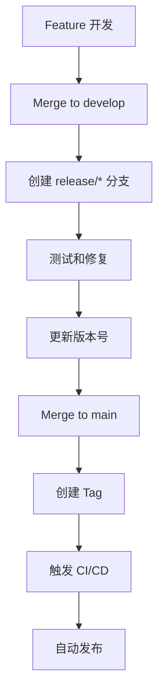

# 🚀 ChainlessChain 多平台发布指南

完整的自动化发布系统文档，支持 Windows、macOS、Linux 三大平台的 Docker 离线版本发布。

---

## 📋 目录

- [发布方式选择](#发布方式选择)
- [方式一：GitHub Actions 自动发布](#方式一github-actions-自动发布推荐)
- [方式二：本地手动发布](#方式二本地手动发布)
- [版本管理](#版本管理)
- [发布检查清单](#发布检查清单)
- [故障排除](#故障排除)
- [发布最佳实践](#发布最佳实践)

---

## 发布方式选择

| 方式 | 优势 | 劣势 | 适用场景 |
|------|------|------|---------|
| **GitHub Actions** | ✅ 完全自动化<br>✅ 多平台并行构建<br>✅ 无需本地资源<br>✅ 可追溯和审计 | ❌ 需要 GitHub Actions 配额<br>❌ 构建时间较长（~45分钟） | 正式版本发布 |
| **本地构建** | ✅ 快速迭代<br>✅ 完全控制<br>✅ 即时反馈 | ❌ 仅构建当前平台<br>❌ 需要本地资源<br>❌ 手动操作 | 测试版本、开发调试 |

---

## 方式一：GitHub Actions 自动发布（推荐）

### 前置条件

1. **GitHub 仓库权限**
   - 拥有仓库的 push 权限
   - 能够创建 tags 和 releases

2. **GitHub Actions 启用**
   - 仓库设置 > Actions > General > "Allow all actions"

### 步骤 1: 更新版本号

使用版本管理脚本：

```bash
cd packaging/scripts

# 自动递增版本号
./bump-version.sh patch    # 0.16.0 -> 0.16.1
./bump-version.sh minor    # 0.16.0 -> 0.17.0
./bump-version.sh major    # 0.16.0 -> 1.0.0

# 或手动指定版本
./bump-version.sh v0.16.5
```

这会自动：
- 更新 `package.json` 中的版本号
- 更新 `CHANGELOG.md`（需要手动编辑内容）
- 创建 git commit
- 创建 git tag

### 步骤 2: 编辑 CHANGELOG

打开 `CHANGELOG.md`，完善本次发布的更新内容：

```markdown
## [0.16.5] - 2025-01-20

### Added
- 新增离线 Docker 镜像打包支持
- 新增多平台自动发布系统

### Changed
- 优化生产构建体积，减少10%
- 改进错误处理和日志输出

### Fixed
- 修复 32 个 ESLint 错误
- 修复数据库连接池问题
```

### 步骤 3: 推送 Tag 触发构建

```bash
# 推送代码和 tag
git push && git push --tags
```

GitHub Actions 会自动：
1. 导出 Docker 镜像（PostgreSQL, Redis, Qdrant, Ollama）
2. 并行构建 Windows、macOS、Linux 安装包
3. 创建 GitHub Release
4. 上传所有安装包

### 步骤 4: 手动触发（可选）

如果不想创建 tag，可以手动触发 workflow：

```bash
# 使用 gh CLI
gh workflow run release.yml \
  -f version=v0.16.5 \
  -f draft=true \
  -f prerelease=false

# 或在 GitHub 网页操作
# Actions > Multi-Platform Docker Offline Release > Run workflow
```

### 步骤 5: 监控构建进度

```bash
# 查看 workflow 运行状态
gh run list --workflow=release.yml

# 查看特定 run 的日志
gh run view <run-id> --log
```

构建预计时间：
- Docker 镜像导出：5-10 分钟
- Windows 构建：10-15 分钟
- macOS 构建：15-20 分钟
- Linux 构建：10-15 分钟
- **总计：~45 分钟**（并行构建）

### 步骤 6: 验证 Release

构建完成后，前往 GitHub Release 页面验证：

```bash
# 打开 release 页面
gh release view v0.16.5 --web

# 或列出所有 assets
gh release view v0.16.5
```

检查项：
- ✅ 所有平台的安装包都已上传（Windows、macOS、Linux）
- ✅ 文件大小正确（每个约 1.3 GB）
- ✅ Release notes 内容完整
- ✅ 标记为 Draft（如果是草稿）或 Published

### 步骤 7: 发布 Release

如果创建的是草稿，编辑并发布：

```bash
# 发布草稿 release
gh release edit v0.16.5 --draft=false

# 或在网页上操作
# Releases > Draft > Edit > Publish release
```

---

## 方式二：本地手动发布

### 前置条件

1. **环境要求**
   - Docker Desktop 已安装并运行
   - Node.js 20+ 已安装
   - GitHub CLI (gh) 已安装并登录

2. **平台限制**
   - Windows 机器只能构建 Windows 版本
   - macOS 机器只能构建 macOS 版本
   - Linux 机器只能构建 Linux 版本

### 验证环境

```bash
# 检查工具版本
docker --version      # Docker version 24.0+
node --version        # v20.0+
gh --version          # gh version 2.0+

# 验证 Docker 运行
docker info

# 验证 gh 登录
gh auth status
```

### 完整发布流程

#### 步骤 1: 更新版本号

```bash
cd packaging/scripts
./bump-version.sh v0.16.5
```

#### 步骤 2: 运行本地发布脚本

**Windows:**
```cmd
cd packaging\scripts
release-local.bat v0.16.5
```

**Linux/macOS:**
```bash
cd packaging/scripts
chmod +x release-local.sh
./release-local.sh v0.16.5
```

**可选参数:**
```bash
# 创建草稿 release
./release-local.sh v0.16.5 --draft

# 创建预发布版本
./release-local.sh v0.16.5-beta.1 --prerelease
```

#### 步骤 3: 脚本自动执行

脚本会自动完成以下步骤：

1. ✅ **环境检查**
   - 验证 Docker、Node.js、gh CLI 已安装
   - 验证 Docker 正在运行
   - 验证 gh CLI 已登录

2. ✅ **导出 Docker 镜像**
   - 拉取并导出 PostgreSQL、Redis、Qdrant、Ollama
   - 创建 images-manifest.txt

3. ✅ **安装依赖**
   - npm ci（根目录和 desktop-app-vue）

4. ✅ **构建应用**
   - 构建主进程（npm run build:main）
   - 构建渲染进程（npm run build，生产模式）

5. ✅ **打包安装包**
   - Windows: EXE + ZIP
   - macOS: DMG + ZIP
   - Linux: DEB + RPM + ZIP

6. ✅ **创建 GitHub Release**
   - 生成 release notes
   - 上传所有安装包
   - 创建 release（draft 或 published）

#### 步骤 4: 验证输出

脚本完成后，检查本地输出：

```bash
# 查看生成的文件
ls -lh release-output/

# 预期文件（取决于平台）
# Windows:
#   ChainlessChain-Setup.exe (~1.3 GB)
#   ChainlessChain-Windows-x64.zip (~1.3 GB)
#
# macOS:
#   ChainlessChain.dmg (~1.3 GB)
#   ChainlessChain-macOS-Universal.zip (~1.3 GB)
#
# Linux:
#   chainlesschain_*.deb (~1.3 GB)
#   chainlesschain-*.rpm (~1.3 GB)
#   ChainlessChain-Linux-x64.zip (~1.3 GB)
```

#### 步骤 5: 补充其他平台

如果需要发布完整的多平台版本，需要在对应平台上重复执行：

1. **在 Windows 机器上**运行 `release-local.bat`
2. **在 macOS 机器上**运行 `release-local.sh`
3. **在 Linux 机器上**运行 `release-local.sh`

然后手动合并所有安装包到同一个 Release：

```bash
# 在任意平台上
gh release upload v0.16.5 \
  path/to/ChainlessChain-Windows-x64.zip \
  path/to/ChainlessChain.dmg \
  path/to/chainlesschain_*.deb
```

---

## 版本管理

### 语义化版本控制

遵循 [Semantic Versioning 2.0.0](https://semver.org/)：

```
格式: MAJOR.MINOR.PATCH

示例:
  0.16.0        - 正式版本
  0.16.1        - 补丁版本
  0.17.0-beta.1 - 预发布版本
  1.0.0-rc.1    - 候选版本
```

**何时递增：**
- **MAJOR**: 不兼容的 API 变更
- **MINOR**: 向下兼容的功能新增
- **PATCH**: 向下兼容的问题修正

### 版本号命名规范

| 类型 | 格式 | 示例 | 说明 |
|------|------|------|------|
| 正式版本 | `v<major>.<minor>.<patch>` | `v0.16.5` | 稳定版本 |
| Beta 版本 | `v<major>.<minor>.<patch>-beta.<n>` | `v0.16.5-beta.1` | 测试版本 |
| Alpha 版本 | `v<major>.<minor>.<patch>-alpha.<n>` | `v0.16.5-alpha.1` | 开发版本 |
| RC 版本 | `v<major>.<minor>.<patch>-rc.<n>` | `v0.16.5-rc.1` | 发布候选 |

### bump-version.sh 使用示例

```bash
cd packaging/scripts

# 递增补丁版本 (0.16.0 -> 0.16.1)
./bump-version.sh patch

# 递增次版本 (0.16.0 -> 0.17.0)
./bump-version.sh minor

# 递增主版本 (0.16.0 -> 1.0.0)
./bump-version.sh major

# 手动指定版本
./bump-version.sh v0.16.5
./bump-version.sh 0.16.5        # 自动添加 v 前缀
./bump-version.sh v0.16.5-beta.1
```

---

## 发布检查清单

### 发布前检查

- [ ] **代码质量**
  - [ ] 所有测试通过（`npm test`）
  - [ ] ESLint 无错误（`npm run lint`）
  - [ ] 构建成功（`npm run build`）

- [ ] **文档更新**
  - [ ] `CHANGELOG.md` 已更新
  - [ ] `README.md` 版本号已更新（如果有）
  - [ ] 相关文档已同步

- [ ] **版本号**
  - [ ] 版本号符合语义化版本规范
  - [ ] package.json 版本号一致
  - [ ] Git tag 已创建

- [ ] **Docker 镜像**
  - [ ] Docker 镜像已导出（packaging/docker-images/*.tar）
  - [ ] images-manifest.txt 已创建
  - [ ] 镜像总大小合理（~800MB）

### 发布后验证

- [ ] **Release 检查**
  - [ ] GitHub Release 已创建
  - [ ] Release notes 内容完整
  - [ ] 所有平台安装包已上传

- [ ] **文件验证**
  - [ ] Windows 安装包（~1.3 GB）
  - [ ] macOS 安装包（~1.3 GB）
  - [ ] Linux 安装包（~1.3 GB）
  - [ ] 文件哈希值正确（可选）

- [ ] **功能测试**
  - [ ] 下载并安装测试（至少一个平台）
  - [ ] Docker 镜像加载成功
  - [ ] 后端服务启动正常
  - [ ] 应用正常运行

- [ ] **通知**
  - [ ] 团队通知
  - [ ] 用户公告（如果是重大更新）
  - [ ] 文档网站更新（如果有）

---

## 故障排除

### GitHub Actions 构建失败

#### 问题：Docker 镜像导出失败

```
Error: Cannot connect to the Docker daemon
```

**解决方案：**
- GitHub Actions runners 已默认安装 Docker
- 检查 workflow 文件中 docker 步骤是否正确
- 使用 `docker/setup-buildx-action@v3`

#### 问题：Node.js 依赖安装失败

```
Error: Cannot find module 'xxx'
```

**解决方案：**
```yaml
# 确保使用 npm ci 而不是 npm install
- run: npm ci
  working-directory: desktop-app-vue
```

#### 问题：Windows 打包失败

```
Error: Missing packaging resources
```

**解决方案：**
- 确保设置了 `SKIP_BACKEND_CHECK=true` 环境变量
- 确保 Docker 镜像已下载到 `packaging/docker-images/`

#### 问题：Artifact 上传失败

```
Error: No files were found with the provided path
```

**解决方案：**
- 检查 `out/make/` 目录结构
- 使用通配符时确保路径正确
- 使用 `||` 操作符容错

### 本地构建失败

#### 问题：Docker 镜像导出失败

```
Error: Cannot connect to the Docker daemon
```

**解决方案：**
```bash
# 启动 Docker Desktop
# Windows: 从开始菜单启动
# macOS: 从 Applications 启动
# Linux: sudo systemctl start docker

# 验证 Docker 运行
docker info
```

#### 问题：gh CLI 未登录

```
Error: gh CLI is not authenticated
```

**解决方案：**
```bash
# 登录 GitHub
gh auth login

# 选择 GitHub.com
# 选择 HTTPS
# 使用浏览器登录或粘贴 token
```

#### 问题：npm 依赖安装失败

```
Error: ENOENT: no such file or directory
```

**解决方案：**
```bash
# 清理缓存
rm -rf node_modules package-lock.json
npm cache clean --force

# 重新安装
npm install
```

#### 问题：打包体积异常大

```
Warning: Package size is 3+ GB
```

**可能原因：**
- `node_modules` 全量打包
- Docker 镜像重复包含

**解决方案：**
```javascript
// forge.config.js
{
  prune: true,  // 移除未使用的依赖
  ignore: [     // 忽略不必要的文件
    /^\\/tests/,
    /^\\/docs/,
    /\\.log$/
  ]
}
```

---

## 发布最佳实践

### 1. 发布频率

- **正式版本**: 每 2-4 周发布一次
- **Beta 版本**: 每周发布，用于测试新功能
- **Patch 版本**: 按需发布，修复重要 bug

### 2. 分支策略

```
main              - 生产稳定版本
├── develop       - 开发主分支
├── feature/*     - 新功能分支
├── hotfix/*      - 紧急修复分支
└── release/*     - 发布准备分支
```

### 3. 发布流程



### 4. CHANGELOG 维护

每次发布必须更新 `CHANGELOG.md`，遵循 [Keep a Changelog](https://keepachangelog.com/) 格式：

```markdown
## [0.16.5] - 2025-01-20

### Added
- 列出新增功能

### Changed
- 列出变更内容

### Deprecated
- 列出即将废弃的功能

### Removed
- 列出已移除的功能

### Fixed
- 列出修复的 bug

### Security
- 列出安全更新
```

### 5. 测试策略

发布前必须通过：
- ✅ 单元测试 (Unit Tests)
- ✅ 集成测试 (Integration Tests)
- ✅ 端到端测试 (E2E Tests)
- ✅ 手动冒烟测试 (Smoke Tests)

### 6. 回滚方案

如果发现严重问题，立即回滚：

```bash
# 删除有问题的 release
gh release delete v0.16.5 --yes

# 删除 tag
git tag -d v0.16.5
git push origin :refs/tags/v0.16.5

# 或者标记为 withdrawn
gh release edit v0.16.5 --prerelease
```

### 7. 通知机制

发布完成后：
- 📧 发送团队邮件通知
- 💬 在 Slack/Discord 发布公告
- 📝 更新文档网站
- 🐦 社交媒体宣传（重大版本）

---

## 附录

### A. 相关文件

| 文件 | 说明 |
|------|------|
| `.github/workflows/release.yml` | GitHub Actions 自动发布 workflow |
| `packaging/scripts/release-local.sh` | Linux/macOS 本地发布脚本 |
| `packaging/scripts/release-local.bat` | Windows 本地发布脚本 |
| `packaging/scripts/bump-version.sh` | 版本号管理脚本 |
| `packaging/export-docker-images.bat` | Docker 镜像导出脚本 |
| `packaging/docker-compose.production.yml` | 生产环境 Docker 配置 |
| `desktop-app-vue/forge.config.js` | Electron 打包配置 |

### B. 环境变量

| 变量 | 说明 | 示例 |
|------|------|------|
| `SKIP_BACKEND_CHECK` | 跳过后端依赖检查 | `true` |
| `NODE_ENV` | Node.js 环境 | `production` |
| `GH_TOKEN` | GitHub token（CI 中） | `${{ github.token }}` |

### C. 有用的命令

```bash
# 查看所有 releases
gh release list

# 查看特定 release
gh release view v0.16.5

# 下载 release assets
gh release download v0.16.5

# 删除 release
gh release delete v0.16.5 --yes

# 查看 workflow 列表
gh workflow list

# 查看 workflow 运行历史
gh run list --workflow=release.yml

# 查看特定 run 的日志
gh run view <run-id> --log

# 取消正在运行的 workflow
gh run cancel <run-id>
```

---

## 联系方式

如有问题，请联系：
- 📧 Email: dev@chainlesschain.com
- 💬 Discord: [ChainlessChain Community](https://discord.gg/chainlesschain)
- 🐛 Issues: [GitHub Issues](https://github.com/chainlesschain/chainlesschain/issues)

---

**文档版本**: v1.0.0
**最后更新**: 2025-01-20
**维护者**: ChainlessChain Team
